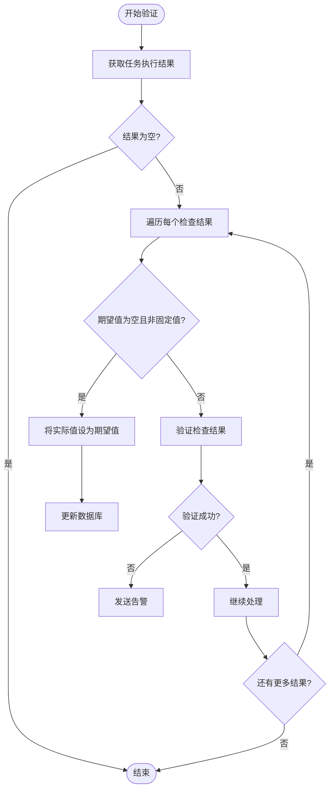
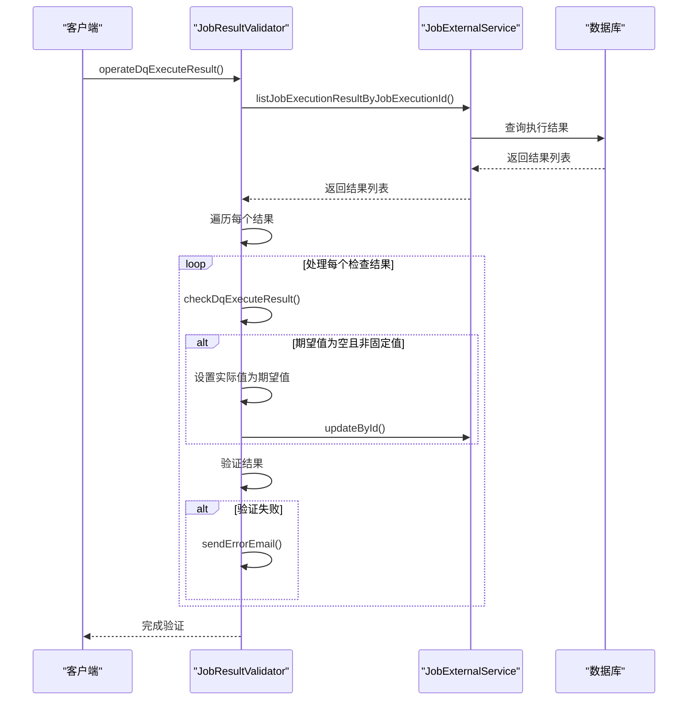
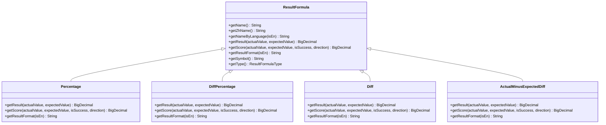
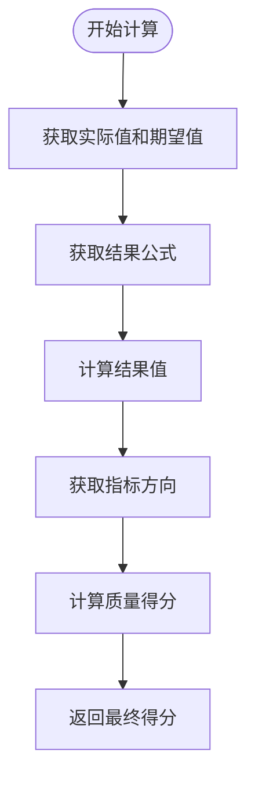
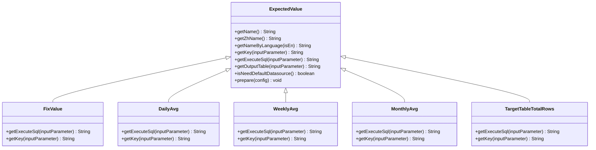
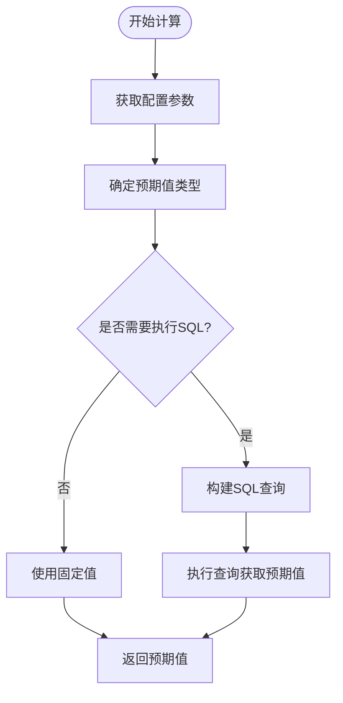
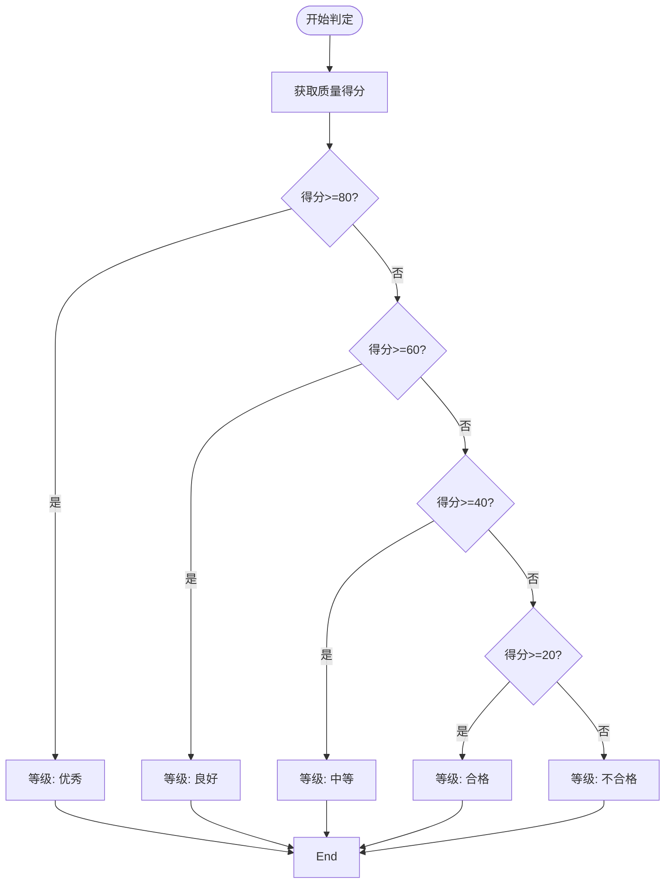
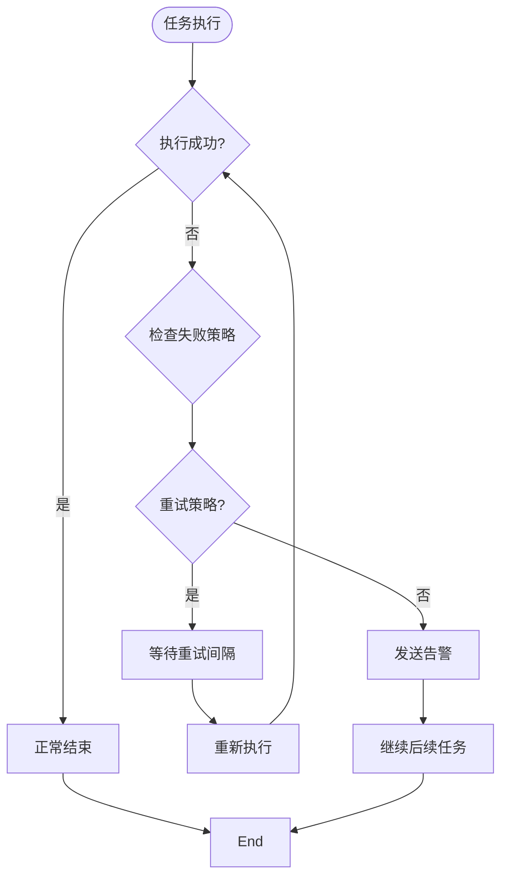
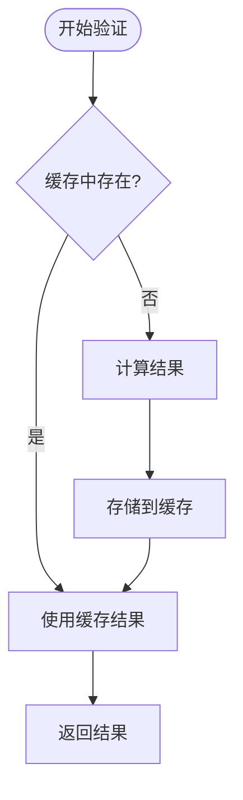
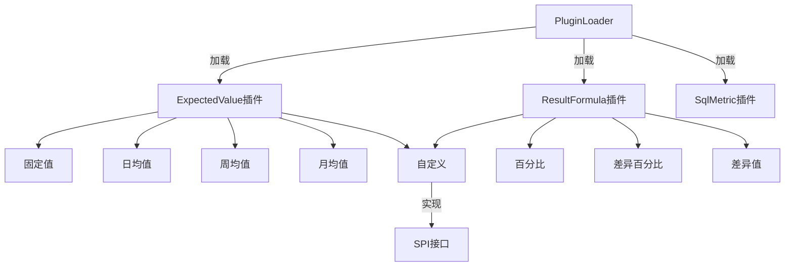

# 结果验证

<cite>
**本文档引用的文件**   
- [JobResultValidator.java](file://datavines-server/src/main/java/io/datavines/server/dqc/coordinator/validator/JobResultValidator.java)
- [MetricValidator.java](file://datavines-metric/datavines-metric-api/src/main/java/io/datavines/metric/api/MetricValidator.java)
- [ResultFormula.java](file://datavines-metric/datavines-metric-api/src/main/java/io/datavines/metric/api/ResultFormula.java)
- [ExpectedValue.java](file://datavines-metric/datavines-metric-api/src/main/java/io/datavines/metric/api/ExpectedValue.java)
- [DataQualityLevel.java](file://datavines-server/src/main/java/io/datavines/server/enums/DataQualityLevel.java)
- [DiffPercentage.java](file://datavines-metric/datavines-metric-result-formula-plugins/datavines-metric-result-formula-diff-percentage/src/main/java/io/datavines/metric/result/formula/DiffPercentage.java)
- [Percentage.java](file://datavines-metric/datavines-metric-result-formula-plugins/datavines-metric-result-formula-percentage/src/main/java/io/datavines/metric/result/formula/Percentage.java)
- [DailyAvg.java](file://datavines-metric/datavines-metric-expected-plugins/datavines-metric-expected-daily-avg/src/main/java/io/datavines/metric/expected/plugin/DailyAvg.java)
- [WeeklyAvg.java](file://datavines-metric/datavines-metric-expected-plugins/datavines-metric-expected-weekly-avg/src/main/java/io/datavines/metric/expected/plugin/WeeklyAvg.java)
- [MonthlyAvg.java](file://datavines-metric/datavines-metric-expected-plugins/datavines-metric-expected-monthly-avg/src/main/java/io/datavines/metric/expected/plugin/MonthlyAvg.java)
</cite>

## 目录
1. [引言](#引言)
2. [结果验证流程](#结果验证流程)
3. [结果验证器工作原理](#结果验证器工作原理)
4. [结果计算机制](#结果计算机制)
5. [预期值计算方式](#预期值计算方式)
6. [质量等级划分标准](#质量等级划分标准)
7. [异常处理机制](#异常处理机制)
8. [性能优化建议](#性能优化建议)
9. [扩展性设计](#扩展性设计)

## 引言
本文档详细描述了大数据质量检查系统中质量检查结果的验证、计算和评估机制。系统通过JobResultValidator组件对数据质量检查任务的执行结果进行验证，包括实际值提取、预期值计算和结果比较。文档将深入解析结果验证器的工作原理，说明如何配置结果公式来计算质量得分，以及如何通过多种方式计算预期值。同时，文档还将介绍质量等级的划分标准、告警阈值设置、异常处理机制和性能优化建议。

## 结果验证流程

**图示来源**
- [JobResultValidator.java](file://datavines-server/src/main/java/io/datavines/server/dqc/coordinator/validator/JobResultValidator.java#L73-L102)

**本节来源**
- [JobResultValidator.java](file://datavines-server/src/main/java/io/datavines/server/dqc/coordinator/validator/JobResultValidator.java#L73-L102)

## 结果验证器工作原理

结果验证器（JobResultValidator）是数据质量检查系统的核心组件，负责对质量检查任务的执行结果进行验证和评估。其工作流程主要包括以下几个步骤：

1. **获取执行结果**：通过JobExternalService从数据库中获取指定任务执行ID的所有检查结果。
2. **遍历检查结果**：对每个检查结果进行处理，确保所有质量检查项都得到验证。
3. **期望值处理**：当期望值为空且不是固定值类型时，将实际值设置为期望值，确保后续比较的准确性。
4. **结果验证**：调用checkDqExecuteResult方法对每个检查结果进行验证。
5. **告警处理**：如果任何检查结果失败，触发告警机制发送通知。

**图示来源**
- [JobResultValidator.java](file://datavines-server/src/main/java/io/datavines/server/dqc/coordinator/validator/JobResultValidator.java#L73-L124)

**本节来源**
- [JobResultValidator.java](file://datavines-server/src/main/java/io/datavines/server/dqc/coordinator/validator/JobResultValidator.java#L73-L124)

## 结果计算机制

结果计算机制是质量检查系统的核心，通过配置不同的结果公式来计算质量得分。系统支持多种计算方式，包括百分比、差异值和合格率等。

### 结果公式类型

**图示来源**
- [ResultFormula.java](file://datavines-metric/datavines-metric-api/src/main/java/io/datavines/metric/api/ResultFormula.java)
- [Percentage.java](file://datavines-metric/datavines-metric-result-formula-plugins/datavines-metric-result-formula-percentage/src/main/java/io/datavines/metric/result/formula/Percentage.java)
- [DiffPercentage.java](file://datavines-metric/datavines-metric-result-formula-plugins/datavines-metric-result-formula-diff-percentage/src/main/java/io/datavines/metric/result/formula/DiffPercentage.java)

**本节来源**
- [ResultFormula.java](file://datavines-metric/datavines-metric-api/src/main/java/io/datavines/metric/api/ResultFormula.java)
- [Percentage.java](file://datavines-metric/datavines-metric-result-formula-plugins/datavines-metric-result-formula-percentage/src/main/java/io/datavines/metric/result/formula/Percentage.java)
- [DiffPercentage.java](file://datavines-metric/datavines-metric-result-formula-plugins/datavines-metric-result-formula-diff-percentage/src/main/java/io/datavines/metric/result/formula/DiffPercentage.java)

### 结果计算流程

**图示来源**
- [MetricValidator.java](file://datavines-metric/datavines-metric-api/src/main/java/io/datavines/metric/api/MetricValidator.java#L47-L57)

**本节来源**
- [MetricValidator.java](file://datavines-metric/datavines-metric-api/src/main/java/io/datavines/metric/api/MetricValidator.java#L47-L57)

## 预期值计算方式

系统支持多种预期值计算方式，以适应不同的业务场景和数据特征。这些计算方式通过插件化设计实现，便于扩展和维护。

### 预期值计算类型

**图示来源**
- [ExpectedValue.java](file://datavines-metric/datavines-metric-api/src/main/java/io/datavines/metric/api/ExpectedValue.java)
- [DailyAvg.java](file://datavines-metric/datavines-metric-expected-plugins/datavines-metric-expected-daily-avg/src/main/java/io/datavines/metric/expected/plugin/DailyAvg.java)
- [WeeklyAvg.java](file://datavines-metric/datavines-metric-expected-plugins/datavines-metric-expected-weekly-avg/src/main/java/io/datavines/metric/expected/plugin/WeeklyAvg.java)
- [MonthlyAvg.java](file://datavines-metric/datavines-metric-expected-plugins/datavines-metric-expected-monthly-avg/src/main/java/io/datavines/metric/expected/plugin/MonthlyAvg.java)

**本节来源**
- [ExpectedValue.java](file://datavines-metric/datavines-metric-api/src/main/java/io/datavines/metric/api/ExpectedValue.java)
- [DailyAvg.java](file://datavines-metric/datavines-metric-expected-plugins/datavines-metric-expected-daily-avg/src/main/java/io/datavines/metric/expected/plugin/DailyAvg.java)
- [WeeklyAvg.java](file://datavines-metric/datavines-metric-expected-plugins/datavines-metric-expected-weekly-avg/src/main/java/io/datavines/metric/expected/plugin/WeeklyAvg.java)
- [MonthlyAvg.java](file://datavines-metric/datavines-metric-expected-plugins/datavines-metric-expected-monthly-avg/src/main/java/io/datavines/metric/expected/plugin/MonthlyAvg.java)

### 预期值计算流程

**本节来源**
- [ExpectedValue.java](file://datavines-metric/datavines-metric-api/src/main/java/io/datavines/metric/api/ExpectedValue.java)
- [DailyAvg.java](file://datavines-metric/datavines-metric-expected-plugins/datavines-metric-expected-daily-avg/src/main/java/io/datavines/metric/expected/plugin/DailyAvg.java)

## 质量等级划分标准

系统根据质量得分将数据质量划分为不同的等级，便于用户快速了解数据质量状况。质量等级的划分标准基于得分区间，每个等级都有明确的定义。

### 质量等级定义

| 质量等级 | 得分区间 | 描述 |
|---------|--------|------|
| 优秀 | 80-100 | 数据质量非常高，完全满足业务要求 |
| 良好 | 60-80 | 数据质量较高，基本满足业务要求 |
| 中等 | 40-60 | 数据质量一般，需要关注和改进 |
| 合格 | 20-40 | 数据质量较低，存在较多问题 |
| 不合格 | 0-20 | 数据质量很差，严重影响业务 |

### 质量等级判定流程

**图示来源**
- [DataQualityLevel.java](file://datavines-server/src/main/java/io/datavines/server/enums/DataQualityLevel.java#L57-L73)

**本节来源**
- [DataQualityLevel.java](file://datavines-server/src/main/java/io/datavines/server/enums/DataQualityLevel.java#L57-L73)

## 异常处理机制

系统设计了完善的异常处理机制，确保在各种异常情况下仍能正常运行并提供准确的反馈。

### 异常处理策略

系统支持多种异常处理策略，用户可以根据业务需求进行配置：

- **重试策略**：当任务失败时，系统会按照配置的重试间隔进行重试，直到成功或达到最大重试次数。
- **告警策略**：当任务失败时，系统仅发送告警通知，不影响后续任务的执行。

**本节来源**
- [JobResultValidator.java](file://datavines-server/src/main/java/io/datavines/server/dqc/coordinator/validator/JobResultValidator.java#L99-L101)
- [DqFailureStrategy.java](file://datavines-server/src/main/java/io/datavines/server/enums/DqFailureStrategy.java)

## 性能优化建议

为了提高结果验证的性能，系统采用了多种优化策略，确保在大规模数据场景下仍能高效运行。

### 减少重复计算

系统通过以下方式减少重复计算：
- **缓存历史数据**：将历史计算结果缓存到数据库中，避免重复计算。
- **批量处理**：对多个检查结果进行批量处理，减少数据库交互次数。
- **预计算**：在数据写入时预先计算部分指标，减少验证时的计算量。

### 缓存策略

**本节来源**
- [JobResultValidator.java](file://datavines-server/src/main/java/io/datavines/server/dqc/coordinator/validator/JobResultValidator.java)
- [ExpectedValue.java](file://datavines-metric/datavines-metric-api/src/main/java/io/datavines/metric/api/ExpectedValue.java)

## 扩展性设计

系统采用插件化设计，支持自定义验证逻辑的实现，具有良好的扩展性。

### 插件化架构

**本节来源**
- [ExpectedValue.java](file://datavines-metric/datavines-metric-api/src/main/java/io/datavines/metric/api/ExpectedValue.java)
- [ResultFormula.java](file://datavines-metric/datavines-metric-api/src/main/java/io/datavines/metric/api/ResultFormula.java)
- [SPI.java](file://datavines-spi/src/main/java/io/datavines/spi/SPI.java)