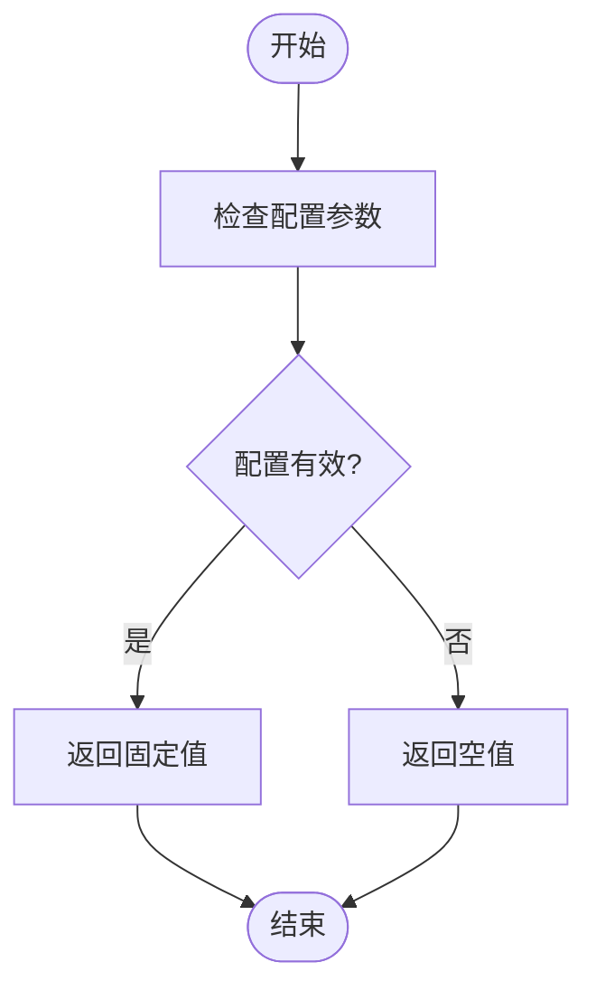
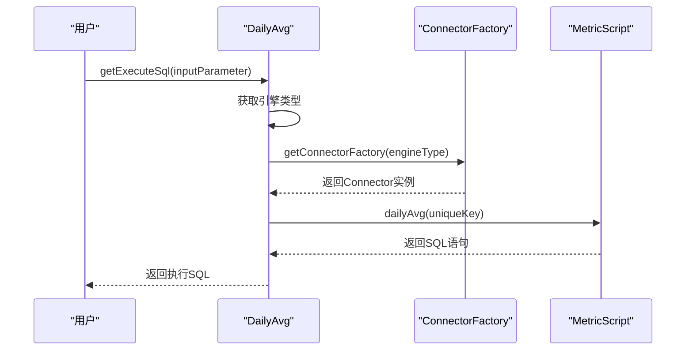
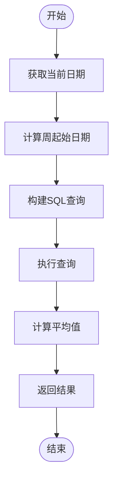
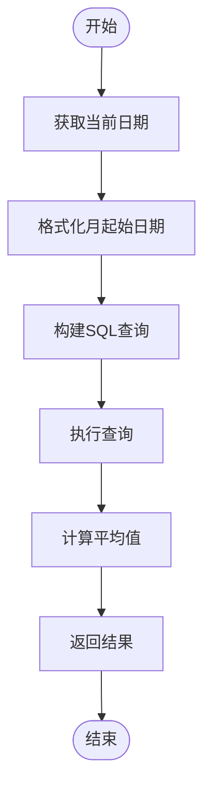
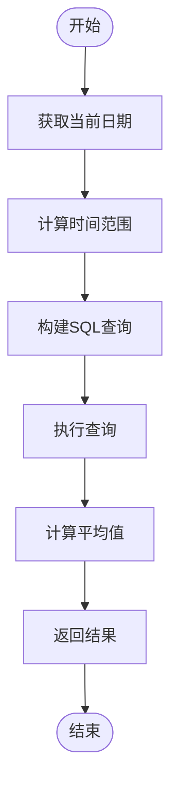
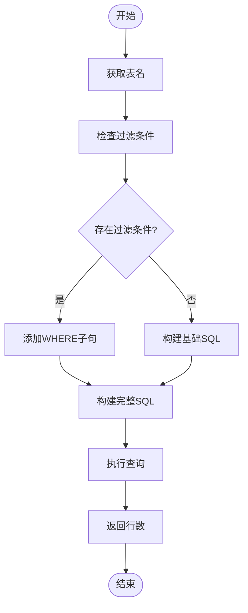
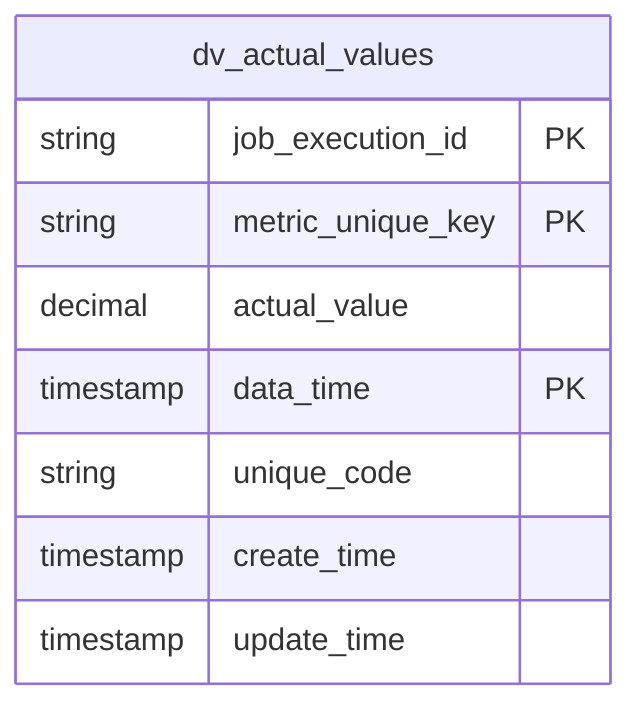
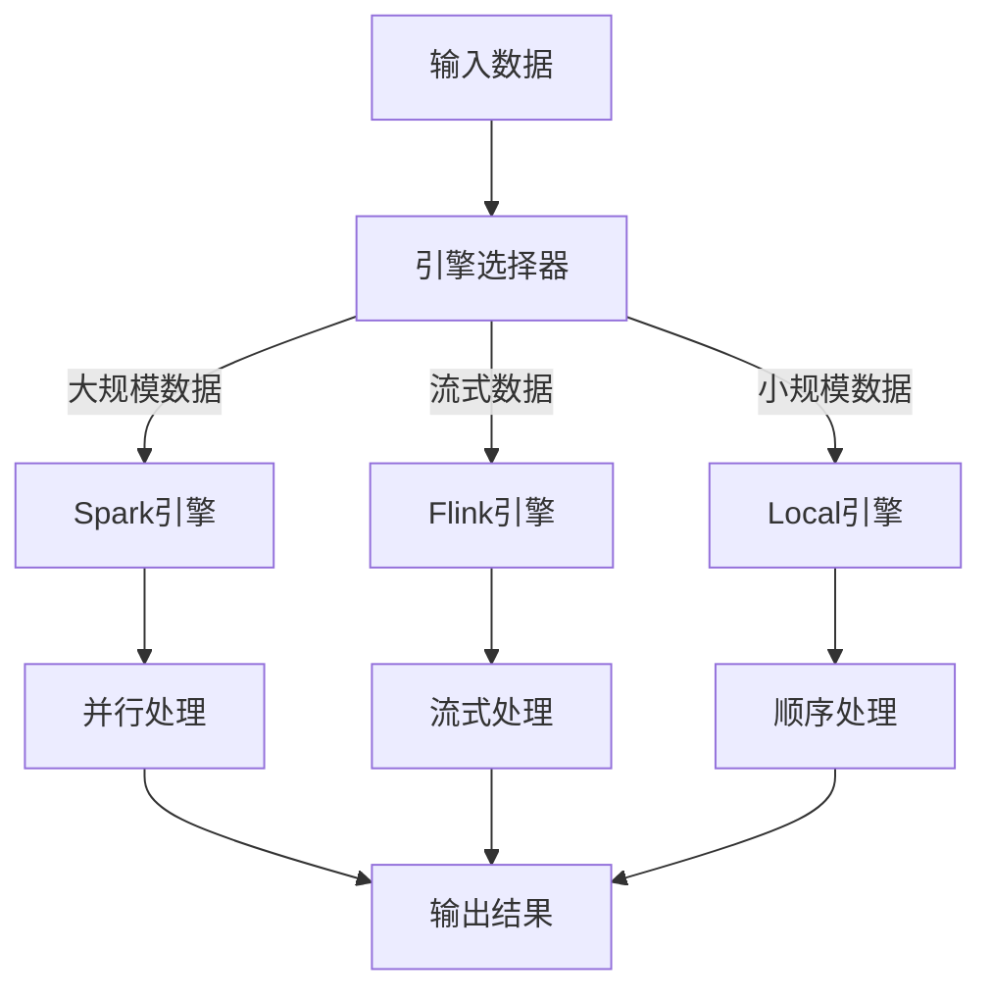
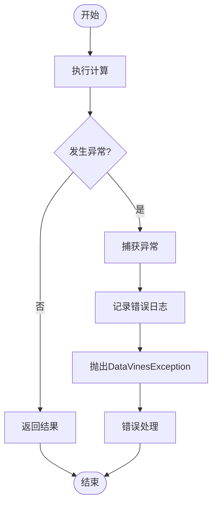

# 预期值计算

<cite>
**本文档引用的文件**   
- [ExpectedValue.java](file://datavines-metric\datavines-metric-api\src\main\java\io\datavines\metric\api\ExpectedValue.java)
- [DailyAvg.java](file://datavines-metric\datavines-metric-expected-plugins\datavines-metric-expected-daily-avg\src\main\java\io\datavines\metric\expected\plugin\DailyAvg.java)
- [SparkLast7DayAvg.java](file://datavines-metric\datavines-metric-expected-plugins\datavines-metric-expected-last7day-avg\src\main\java\io\datavines\metric\expected\plugin\SparkLast7DayAvg.java)
- [SparkMonthlyAvg.java](file://datavines-metric\datavines-metric-expected-plugins\datavines-metric-expected-monthly-avg\src\main\java\io\datavines\metric\expected\plugin\SparkMonthlyAvg.java)
- [WeeklyAvg.java](file://datavines-metric\datavines-metric-expected-plugins\datavines-metric-expected-weekly-avg\src\main\java\io\datavines\metric\expected\plugin\WeeklyAvg.java)
- [FixValue.java](file://datavines-metric\datavines-metric-expected-plugins\datavines-metric-expected-fix\src\main\java\io\datavines\metric\expected\plugin\FixValue.java)
- [None.java](file://datavines-metric\datavines-metric-expected-plugins\datavines-metric-expected-none\src\main\java\io\datavines\metric\expected\plugin\None.java)
- [TableTotalRows.java](file://datavines-metric\datavines-metric-expected-plugins\datavines-metric-expected-table-rows\src\main\java\io\datavines\metric\expected\plugin\TableTotalRows.java)
- [AbstractExpectedValue.java](file://datavines-metric\datavines-metric-expected-plugins\datavines-metric-expected-base\src\main\java\io\datavines\metric\expected\plugin\AbstractExpectedValue.java)
- [MetricConstants.java](file://datavines-metric\datavines-metric-api\src\main\java\io\datavines\metric\api\MetricConstants.java)
- [ExpectedValueExecutor.java](file://datavines-engine\datavines-engine-plugins\datavines-engine-local\datavines-engine-local-transform\src\main\java\io\datavines\engine\local\transform\sql\ExpectedValueExecutor.java)
</cite>

## 目录
1. [引言](#引言)
2. [预期值计算策略](#预期值计算策略)
3. [核心计算策略实现](#核心计算策略实现)
4. [性能优化机制](#性能优化机制)
5. [扩展接口说明](#扩展接口说明)
6. [容错与异常处理](#容错与异常处理)
7. [计算策略配置参数](#计算策略配置参数)
8. [结论](#结论)

## 引言

预期值计算是数据质量平台中的核心功能之一，用于为数据质量指标提供基准参考值。本系统通过多种计算策略实现预期值的动态生成，包括固定值、历史平均值（日均、周均、月均、最近7天、最近30天等）和表行数等。这些策略通过插件化架构实现，支持灵活扩展和配置。系统利用SPI（Service Provider Interface）机制实现插件加载，确保了良好的可扩展性和维护性。

**Section sources**
- [ExpectedValue.java](file://datavines-metric\datavines-metric-api\src\main\java\io\datavines\metric\api\ExpectedValue.java#L1-L65)

## 预期值计算策略

系统提供了多种预期值计算策略，每种策略针对不同的业务场景和数据特征。主要计算策略包括：

- **固定值**：使用预设的固定数值作为预期值，适用于业务规则明确且稳定的场景
- **历史平均值**：基于历史数据计算平均值，包括日均值、周均值、月均值、最近7天均值和最近30天均值
- **表行数**：计算指定表的总行数作为预期值，适用于数据量监控场景
- **无预期值**：不计算预期值，仅用于实际值的采集和监控

这些策略通过统一的接口`ExpectedValue`进行抽象，确保了计算逻辑的一致性和可扩展性。

```mermaid
classDiagram
class ExpectedValue {
<<interface>>
+getName() String
+getZhName() String
+getKey(Map~String,String~) String
+getExecuteSql(Map~String,String~) String
+getOutputTable(Map~String,String~) String
+isNeedDefaultDatasource() boolean
+prepare(Map~String,String~) void
}
class FixValue {
+getName() String
+getZhName() String
+getKey(Map~String,String~) String
+getExecuteSql(Map~String,String~) String
+getOutputTable(Map~String,String~) String
+isNeedDefaultDatasource() boolean
+prepare(Map~String,String~) void
}
class DailyAvg {
+getName() String
+getZhName() String
+getKey(Map~String,String~) String
+getExecuteSql(Map~String,String~) String
+getOutputTable(Map~String,String~) String
+isNeedDefaultDatasource() boolean
+prepare(Map~String,String~) void
}
class WeeklyAvg {
+getName() String
+getZhName() String
+getKey(Map~String,String~) String
+getExecuteSql(Map~String,String~) String
+getOutputTable(Map~String,String~) String
+isNeedDefaultDatasource() boolean
+prepare(Map~String,String~) void
}
class MonthlyAvg {
+getName() String
+getZhName() String
+getKey(Map~String,String~) String
+getExecuteSql(Map~String,String~) String
+getOutputTable(Map~String,String~) String
+isNeedDefaultDatasource() boolean
+prepare(Map~String,String~) void
}
class Last7DayAvg {
+getName() String
+getZhName() String
+getKey(Map~String,String~) String
+getExecuteSql(Map~String,String~) String
+getOutputTable(Map~String,String~) String
+isNeedDefaultDatasource() boolean
+prepare(Map~String,String~) void
}
class Last30DayAvg {
+getName() String
+getZhName() String
+getKey(Map~String,String~) String
+getExecuteSql(Map~String,String~) String
+getOutputTable(Map~String,String~) String
+isNeedDefaultDatasource() boolean
+prepare(Map~String,String~) void
}
class TableTotalRows {
+getName() String
+getZhName() String
+getKey(Map~String,String~) String
+getExecuteSql(Map~String,String~) String
+getOutputTable(Map~String,String~) String
+isNeedDefaultDatasource() boolean
+prepare(Map~String,String~) void
}
class None {
+getName() String
+getZhName() String
+getKey(Map~String,String~) String
+getExecuteSql(Map~String,String~) String
+getOutputTable(Map~String,String~) String
+isNeedDefaultDatasource() boolean
+prepare(Map~String,String~) void
}
ExpectedValue <|-- FixValue
ExpectedValue <|-- DailyAvg
ExpectedValue <|-- WeeklyAvg
ExpectedValue <|-- MonthlyAvg
ExpectedValue <|-- Last7DayAvg
ExpectedValue <|-- Last30DayAvg
ExpectedValue <|-- TableTotalRows
ExpectedValue <|-- None
```



**Diagram sources **
- [ExpectedValue.java](file://datavines-metric\datavines-metric-api\src\main\java\io\datavines\metric\api\ExpectedValue.java#L1-L65)
- [FixValue.java](file://datavines-metric\datavines-metric-expected-plugins\datavines-metric-expected-fix\src\main\java\io\datavines\metric\expected\plugin\FixValue.java#L1-L62)
- [DailyAvg.java](file://datavines-metric\datavines-metric-expected-plugins\datavines-metric-expected-daily-avg\src\main\java\io\datavines\metric\expected\plugin\DailyAvg.java#L1-L76)
- [WeeklyAvg.java](file://datavines-metric\datavines-metric-expected-plugins\datavines-metric-expected-weekly-avg\src\main\java\io\datavines\metric\expected\plugin\WeeklyAvg.java#L1-L76)
- [SparkMonthlyAvg.java](file://datavines-metric\datavines-metric-expected-plugins\datavines-metric-expected-monthly-avg\src\main\java\io\datavines\metric\expected\plugin\SparkMonthlyAvg.java#L1-L67)
- [SparkLast7DayAvg.java](file://datavines-metric\datavines-metric-expected-plugins\datavines-metric-expected-last7day-avg\src\main\java\io\datavines\metric\expected\plugin\SparkLast7DayAvg.java#L1-L67)
- [SparkLast30DayAvg.java](file://datavines-metric\datavines-metric-expected-plugins\datavines-metric-expected-last30day-avg\src\main\java\io\datavines\metric\expected\plugin\SparkLast30DayAvg.java#L1-L67)
- [TableTotalRows.java](file://datavines-metric\datavines-metric-expected-plugins\datavines-metric-expected-table-rows\src\main\java\io\datavines\metric\expected\plugin\TableTotalRows.java#L1-L76)
- [None.java](file://datavines-metric\datavines-metric-expected-plugins\datavines-metric-expected-none\src\main\java\io\datavines\metric\expected\plugin\None.java#L1-L63)

## 核心计算策略实现

### 固定值计算策略

固定值计算策略通过`FixValue`类实现，该策略不依赖于任何历史数据或数据库查询，直接返回预设的固定值。这种策略适用于业务规则明确且不需要动态调整的场景。



**Diagram sources **
- [FixValue.java](file://datavines-metric\datavines-metric-expected-plugins\datavines-metric-expected-fix\src\main\java\io\datavines\metric\expected\plugin\FixValue.java#L1-L62)

### 历史平均值计算策略

历史平均值计算策略基于历史数据表`dv_actual_values`中的实际值进行计算。系统支持多种时间范围的平均值计算，包括日均值、周均值、月均值、最近7天均值和最近30天均值。

#### 日均值计算

日均值计算策略通过`DailyAvg`类实现，根据不同的执行引擎（Spark、Flink、Local）调用相应的SQL脚本生成器获取执行SQL。



**Diagram sources **
- [DailyAvg.java](file://datavines-metric\datavines-metric-expected-plugins\datavines-metric-expected-daily-avg\src\main\java\io\datavines\metric\expected\plugin\DailyAvg.java#L1-L76)
- [AbstractExpectedValue.java](file://datavines-metric\datavines-metric-expected-plugins\datavines-metric-expected-base\src\main\java\io\datavines\metric\expected\plugin\AbstractExpectedValue.java#L1-L35)

#### 周均值计算

周均值计算策略通过`WeeklyAvg`类实现，使用SQL函数计算当前周的起始日期，然后对本周内的历史数据进行平均值计算。



**Diagram sources **
- [WeeklyAvg.java](file://datavines-metric\datavines-metric-expected-plugins\datavines-metric-expected-weekly-avg\src\main\java\io\datavines\metric\expected\plugin\WeeklyAvg.java#L1-L76)

#### 月均值计算

月均值计算策略通过`SparkMonthlyAvg`类实现，使用日期格式化函数获取当前月的起始日期，然后对本月内的历史数据进行平均值计算。



**Diagram sources **
- [SparkMonthlyAvg.java](file://datavines-metric\datavines-metric-expected-plugins\datavines-metric-expected-monthly-avg\src\main\java\io\datavines\metric\expected\plugin\SparkMonthlyAvg.java#L1-L67)

#### 最近7天和最近30天均值计算

最近7天和最近30天均值计算策略分别通过`SparkLast7DayAvg`和`SparkLast30DayAvg`类实现，使用日期减法函数计算时间范围，然后对指定时间范围内的历史数据进行平均值计算。



**Diagram sources **
- [SparkLast7DayAvg.java](file://datavines-metric\datavines-metric-expected-plugins\datavines-metric-expected-last7day-avg\src\main\java\io\datavines\metric\expected\plugin\SparkLast7DayAvg.java#L1-L67)
- [SparkLast30DayAvg.java](file://datavines-metric\datavines-metric-expected-plugins\datavines-metric-expected-last30day-avg\src\main\java\io\datavines\metric\expected\plugin\SparkLast30DayAvg.java#L1-L67)

### 表行数计算策略

表行数计算策略通过`TableTotalRows`类实现，使用SQL的`COUNT(1)`函数计算指定表的总行数。该策略支持通过`filter`参数添加查询条件。



**Diagram sources **
- [TableTotalRows.java](file://datavines-metric\datavines-metric-expected-plugins\datavines-metric-expected-table-rows\src\main\java\io\datavines\metric\expected\plugin\TableTotalRows.java#L1-L76)

## 性能优化机制

### 缓存策略

系统通过`dv_actual_values`表存储历史实际值数据，实现了数据的持久化缓存。该表结构设计合理，包含`job_execution_id`、`metric_unique_key`、`actual_value`、`data_time`等关键字段，支持高效的时间范围查询。



**Diagram sources **
- [MetricConstants.java](file://datavines-metric\datavines-metric-api\src\main\java\io\datavines\metric\api\MetricConstants.java#L1-L64)

### 增量计算

系统采用增量计算机制，每次计算预期值时只查询指定时间范围内的历史数据，避免了全量数据扫描。通过合理的索引设计（如`data_time`字段的索引），确保了时间范围查询的高效性。

### 并行处理

系统支持多种执行引擎（Spark、Flink、Local），可以根据数据规模和计算复杂度选择合适的执行引擎。对于大规模数据计算，可以利用Spark或Flink的分布式计算能力实现并行处理。



**Diagram sources **
- [DailyAvg.java](file://datavines-metric\datavines-metric-expected-plugins\datavines-metric-expected-daily-avg\src\main\java\io\datavines\metric\expected\plugin\DailyAvg.java#L1-L76)

## 扩展接口说明

### 预期值接口

`ExpectedValue`接口定义了预期值计算的核心方法，为扩展新的计算策略提供了标准接口。

```java
public interface ExpectedValue {
    String getName();
    String getZhName();
    String getKey(Map<String,String> inputParameter);
    String getExecuteSql(Map<String,String> inputParameter);
    String getOutputTable(Map<String,String> inputParameter);
    boolean isNeedDefaultDatasource();
    void prepare(Map<String, String> config);
}
```

**Section sources**
- [ExpectedValue.java](file://datavines-metric\datavines-metric-api\src\main\java\io\datavines\metric\api\ExpectedValue.java#L1-L65)

### 抽象基类

`AbstractExpectedValue`类提供了通用的连接器工厂获取方法，简化了子类的实现。

```java
public abstract class AbstractExpectedValue implements ExpectedValue {
    protected ConnectorFactory getConnectorFactory(Map<String,String> inputParameter) {
        String srcConnectorType = inputParameter.get("src_connector_type");
        return PluginLoader.getPluginLoader(ConnectorFactory.class).getOrCreatePlugin(srcConnectorType);
    }
    
    protected ConnectorFactory getConnectorFactory(String connectorType) {
        return PluginLoader.getPluginLoader(ConnectorFactory.class).getOrCreatePlugin(connectorType);
    }
}
```

**Section sources**
- [AbstractExpectedValue.java](file://datavines-metric\datavines-metric-expected-plugins\datavines-metric-expected-base\src\main\java\io\datavines\metric\expected\plugin\AbstractExpectedValue.java#L1-L35)

## 容错与异常处理

### 异常处理机制

系统通过`DataVinesException`类统一处理异常，确保了错误信息的一致性和可追溯性。在`DailyAvg`等类中，当遇到不支持的引擎类型时会抛出明确的异常信息。



**Diagram sources **
- [DailyAvg.java](file://datavines-metric\datavines-metric-expected-plugins\datavines-metric-expected-daily-avg\src\main\java\io\datavines\metric\expected\plugin\DailyAvg.java#L1-L76)

### 容错设计

系统在多个层面实现了容错设计：
1. **配置检查**：在`prepare`方法中检查配置参数的有效性
2. **默认值处理**：对于可选参数提供合理的默认值
3. **空值处理**：对可能为空的结果进行空值检查和处理
4. **引擎兼容性**：通过条件判断支持多种执行引擎

## 计算策略配置参数

### 通用配置参数

| 参数名称 | 类型 | 描述 | 是否必需 |
|--------|-----|------|--------|
| `src_connector_type` | 字符串 | 源数据连接器类型 | 是 |
| `engine_type` | 字符串 | 执行引擎类型 | 是 |
| `metric_unique_key` | 字符串 | 指标唯一键 | 是 |
| `filter` | 字符串 | 查询过滤条件 | 否 |

### 特定策略配置参数

#### 固定值策略
- 无特定配置参数，直接使用预设值

#### 表行数策略
- `table`：指定要计算行数的表名
- `filter`：可选的查询过滤条件

#### 历史平均值策略
- `data_time`：计算基准时间
- `unique_code`：数据唯一编码

**Section sources**
- [DailyAvg.java](file://datavines-metric\datavines-metric-expected-plugins\datavines-metric-expected-daily-avg\src\main\java\io\datavines\metric\expected\plugin\DailyAvg.java#L1-L76)
- [TableTotalRows.java](file://datavines-metric\datavines-metric-expected-plugins\datavines-metric-expected-table-rows\src\main\java\io\datavines\metric\expected\plugin\TableTotalRows.java#L1-L76)
- [FixValue.java](file://datavines-metric\datavines-metric-expected-plugins\datavines-metric-expected-fix\src\main\java\io\datavines\metric\expected\plugin\FixValue.java#L1-L62)

## 结论

本文档详细描述了数据质量平台中预期值计算机制的实现原理和使用场景。系统通过插件化架构实现了多种预期值计算策略，包括固定值、历史平均值和表行数等。每种策略都有明确的适用条件和配置参数，能够满足不同业务场景的需求。

性能优化方面，系统通过缓存策略、增量计算和并行处理机制确保了计算效率。扩展接口设计合理，支持自定义计算逻辑的开发。容错机制完善，能够有效处理各种异常情况。

未来可以考虑增加更多计算策略，如移动平均、加权平均等，以满足更复杂的业务需求。同时，可以进一步优化查询性能，如引入更智能的索引策略和查询优化器。