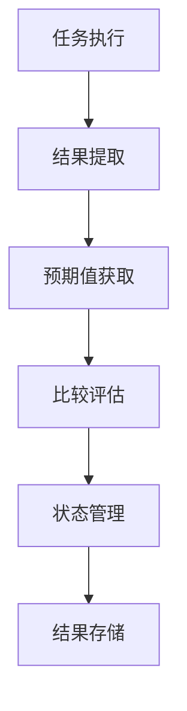
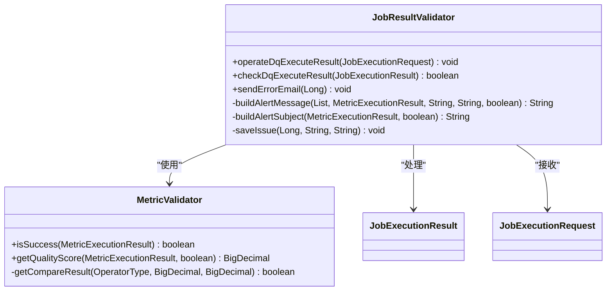
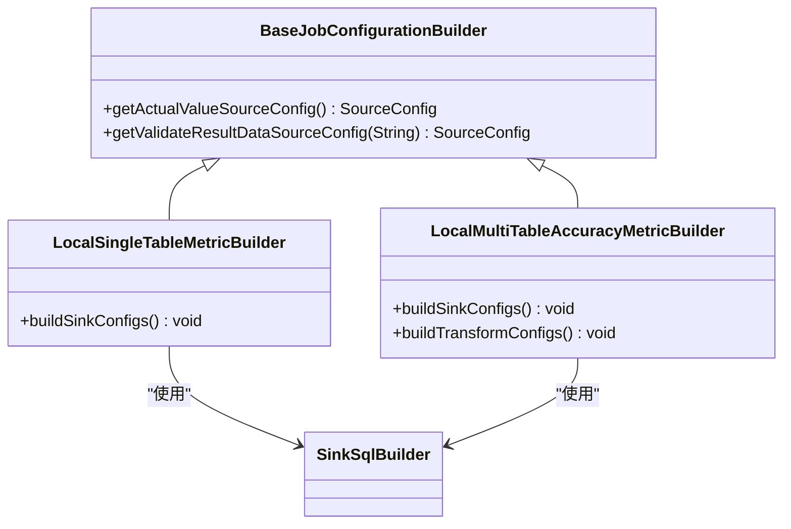
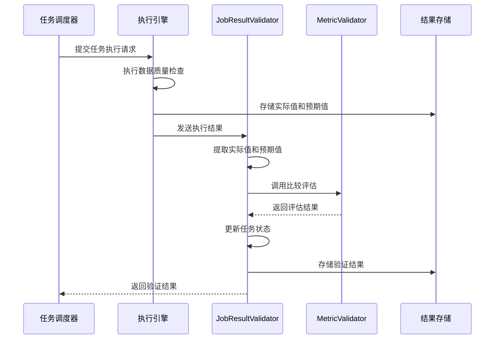
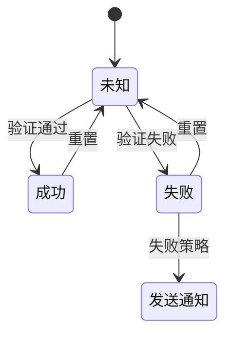
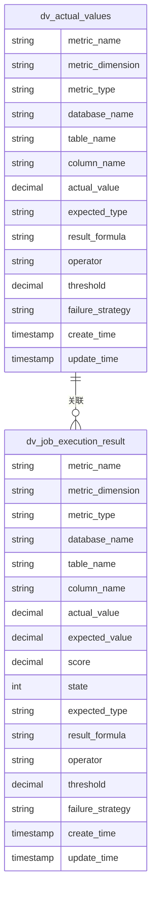
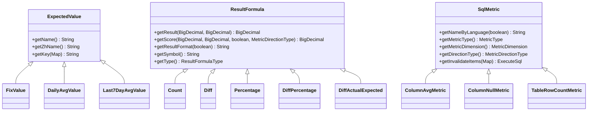
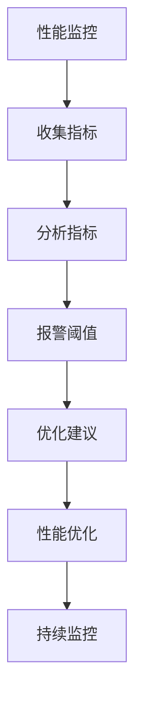

# 验证流程

<cite>
**本文档引用的文件**   
- [JobResultValidator.java](file://datavines-server/src/main/java/io/datavines/server/dqc/coordinator/validator/JobResultValidator.java)
- [MetricValidator.java](file://datavines-metric/datavines-metric-api/src/main/java/io/datavines/metric/api/MetricValidator.java)
- [LocalSingleTableMetricBuilder.java](file://datavines-engine/datavines-engine-plugins/datavines-engine-local/datavines-engine-local-config/src/main/java/io/datavines/engine/local/config/LocalSingleTableMetricBuilder.java)
- [LocalMultiTableAccuracyMetricBuilder.java](file://datavines-engine/datavines-engine-plugins/datavines-engine-local/datavines-engine-local-config/src/main/java/io/datavines/engine/local/config/LocalMultiTableAccuracyMetricBuilder.java)
- [BaseJobConfigurationBuilder.java](file://datavines-engine/datavines-engine-config/src/main/java/io/datavines/engine/config/BaseJobConfigurationBuilder.java)
- [JobExecutionInfo.java](file://datavines-common/src/main/java/io/datavines/common/entity/JobExecutionInfo.java)
- [JobCheckState.java](file://datavines-server/src/main/java/io/datavines/server/enums/JobCheckState.java)
- [DataQualityLevel.java](file://datavines-server/src/main/java/io/datavines/server/enums/DataQualityLevel.java)
- [JobExecutionRequest.java](file://datavines-common/src/main/java/io/datavines/common/entity/JobExecutionRequest.java)
- [MetricExecutionResult.java](file://datavines-metric/datavines-metric-api/src/main/java/io/datavines/metric/api/MetricExecutionResult.java)
- [JobExecutionResult.java](file://datavines-server/src/main/java/io/datavines/server/repository/entity/JobExecutionResult.java)
- [SinkSqlBuilder.java](file://datavines-engine/datavines-engine-plugins/datavines-engine-local/datavines-engine-local-config/src/main/java/io/datavines/engine/local/config/SinkSqlBuilder.java)
</cite>

## 目录
1. [引言](#引言)
2. [验证流程概述](#验证流程概述)
3. [核心组件分析](#核心组件分析)
4. [验证流程时序图](#验证流程时序图)
5. [状态管理机制](#状态管理机制)
6. [结果存储结构](#结果存储结构)
7. [可扩展性设计](#可扩展性设计)
8. [性能监控与优化](#性能监控与优化)
9. [结论](#结论)

## 引言

数据质量验证流程是数据质量管理系统的核心功能，负责从任务执行到结果评估的完整验证过程。该流程通过任务调度器、执行引擎和结果存储组件的协作，实现对数据质量的全面监控和评估。本文档详细描述了验证流程的各个阶段，包括任务执行、结果提取、预期值获取、比较评估、状态管理和结果存储等关键环节。

## 验证流程概述

数据质量验证流程从任务执行开始，经过结果提取、预期值获取、比较评估等多个阶段，最终完成验证结果的存储和状态更新。整个流程涉及多个核心组件的协作，包括任务调度器、执行引擎、结果存储等。

验证流程的主要步骤包括：
1. 任务执行：执行引擎根据任务配置执行数据质量检查
2. 结果提取：从执行结果中提取实际值
3. 预期值获取：根据配置获取预期值
4. 比较评估：将实际值与预期值进行比较，评估验证结果
5. 状态管理：根据评估结果更新任务状态
6. 结果存储：将验证结果存储到指定位置

**图表来源**
- [JobResultValidator.java](file://datavines-server/src/main/java/io/datavines/server/dqc/coordinator/validator/JobResultValidator.java)
- [MetricValidator.java](file://datavines-metric/datavines-metric-api/src/main/java/io/datavines/metric/api/MetricValidator.java)

## 核心组件分析

### JobResultValidator 组件

JobResultValidator 是验证流程的核心组件，负责接收执行结果、提取实际值、获取预期值并进行比较评估。该组件通过调用 MetricValidator 进行具体的比较评估，并根据评估结果更新任务状态。

**图表来源**
- [JobResultValidator.java](file://datavines-server/src/main/java/io/datavines/server/dqc/coordinator/validator/JobResultValidator.java)
- [MetricValidator.java](file://datavines-metric/datavines-metric-api/src/main/java/io/datavines/metric/api/MetricValidator.java)

**本节来源**
- [JobResultValidator.java](file://datavines-server/src/main/java/io/datavines/server/dqc/coordinator/validator/JobResultValidator.java#L73-L227)
- [MetricValidator.java](file://datavines-metric/datavines-metric-api/src/main/java/io/datavines/metric/api/MetricValidator.java#L33-L82)

### 配置构建组件

配置构建组件负责构建验证任务的配置，包括实际值和预期值的存储配置。这些组件根据任务类型和配置参数，生成相应的存储配置。

**图表来源**
- [BaseJobConfigurationBuilder.java](file://datavines-engine/datavines-engine-config/src/main/java/io/datavines/engine/config/BaseJobConfigurationBuilder.java)
- [LocalSingleTableMetricBuilder.java](file://datavines-engine/datavines-engine-plugins/datavines-engine-local/datavines-engine-local-config/src/main/java/io/datavines/engine/local/config/LocalSingleTableMetricBuilder.java)
- [LocalMultiTableAccuracyMetricBuilder.java](file://datavines-engine/datavines-engine-plugins/datavines-engine-local/datavines-engine-local-config/src/main/java/io/datavines/engine/local/config/LocalMultiTableAccuracyMetricBuilder.java)

**本节来源**
- [BaseJobConfigurationBuilder.java](file://datavines-engine/datavines-engine-config/src/main/java/io/datavines/engine/config/BaseJobConfigurationBuilder.java#L228-L251)
- [LocalSingleTableMetricBuilder.java](file://datavines-engine/datavines-engine-plugins/datavines-engine-local/datavines-engine-local-config/src/main/java/io/datavines/engine/local/config/LocalSingleTableMetricBuilder.java#L44-L127)
- [LocalMultiTableAccuracyMetricBuilder.java](file://datavines-engine/datavines-engine-plugins/datavines-engine-local/datavines-engine-local-config/src/main/java/io/datavines/engine/local/config/LocalMultiTableAccuracyMetricBuilder.java#L71-L155)

## 验证流程时序图

验证流程的时序图展示了从任务执行到结果评估的完整流程，包括各个组件之间的交互顺序。

**图表来源**
- [JobResultValidator.java](file://datavines-server/src/main/java/io/datavines/server/dqc/coordinator/validator/JobResultValidator.java)
- [JobExecutionRequest.java](file://datavines-common/src/main/java/io/datavines/common/entity/JobExecutionRequest.java)
- [JobExecutionResult.java](file://datavines-server/src/main/java/io/datavines/server/repository/entity/JobExecutionResult.java)

## 状态管理机制

验证流程的状态管理机制负责处理成功、失败和异常情况。系统定义了多种状态，包括成功、失败和未知状态，通过状态码进行管理。

**图表来源**
- [JobCheckState.java](file://datavines-server/src/main/java/io/datavines/server/enums/JobCheckState.java)

**本节来源**
- [JobCheckState.java](file://datavines-server/src/main/java/io/datavines/server/enums/JobCheckState.java#L35-L74)

### 状态转换逻辑

状态管理机制通过 JobCheckState 枚举类实现，包含以下状态：
- NONE(0): 未知状态
- SUCCESS(1): 成功状态
- FAILURE(2): 失败状态

当验证结果为成功时，状态设置为 SUCCESS；当验证结果为失败时，状态设置为 FAILURE。系统还支持失败策略，可以在验证失败时发送通知或执行其他操作。

## 结果存储结构

验证结果的存储结构设计用于高效存储和访问验证结果数据。系统将实际值、预期值和验证结果分别存储在不同的表中。

**图表来源**
- [SinkSqlBuilder.java](file://datavines-engine/datavines-engine-plugins/datavines-engine-local/datavines-engine-local-config/src/main/java/io/datavines/engine/local/config/SinkSqlBuilder.java)
- [LocalSingleTableMetricBuilder.java](file://datavines-engine/datavines-engine-plugins/datavines-engine-local/datavines-engine-local-config/src/main/java/io/datavines/engine/local/config/LocalSingleTableMetricBuilder.java)

**本节来源**
- [SinkSqlBuilder.java](file://datavines-engine/datavines-engine-plugins/datavines-engine-local/datavines-engine-local-config/src/main/java/io/datavines/engine/local/config/SinkSqlBuilder.java)
- [LocalSingleTableMetricBuilder.java](file://datavines-engine/datavines-engine-plugins/datavines-engine-local/datavines-engine-local-config/src/main/java/io/datavines/engine/local/config/LocalSingleTableMetricBuilder.java#L58-L73)

### 数据访问模式

验证结果的数据访问模式主要包括：
1. 按任务执行ID查询验证结果
2. 按数据源、数据库、表和列查询历史验证结果
3. 按时间范围查询验证结果
4. 按验证状态查询任务

系统通过索引优化查询性能，确保在大数据量情况下仍能快速响应查询请求。

## 可扩展性设计

验证流程的可扩展性设计支持自定义验证逻辑的接入，通过插件机制实现灵活的扩展。

**图表来源**
- [ExpectedValue.java](file://datavines-metric/datavines-metric-api/src/main/java/io/datavines/metric/api/ExpectedValue.java)
- [ResultFormula.java](file://datavines-metric/datavines-metric-api/src/main/java/io/datavines/metric/api/ResultFormula.java)
- [SqlMetric.java](file://datavines-metric/datavines-metric-api/src/main/java/io/datavines/metric/api/SqlMetric.java)

**本节来源**
- [ExpectedValue.java](file://datavines-metric/datavines-metric-api/src/main/java/io/datavines/metric/api/ExpectedValue.java)
- [ResultFormula.java](file://datavines-metric/datavines-metric-api/src/main/java/io/datavines/metric/api/ResultFormula.java)
- [SqlMetric.java](file://datavines-metric/datavines-metric-api/src/main/java/io/datavines/metric/api/SqlMetric.java)

### 自定义验证逻辑接入

系统通过 SPI（Service Provider Interface）机制支持自定义验证逻辑的接入。用户可以通过实现以下接口来扩展验证功能：
1. ExpectedValue: 自定义预期值计算逻辑
2. ResultFormula: 自定义结果计算公式
3. SqlMetric: 自定义数据质量检查指标

插件加载器（PluginLoader）负责加载和管理这些插件，确保系统能够动态识别和使用新添加的验证逻辑。

## 性能监控与优化

验证流程的性能监控指标和优化策略确保系统在高负载情况下仍能稳定运行。

### 性能监控指标

系统监控以下关键性能指标：
- 任务执行时间
- 验证结果存储时间
- 数据库查询响应时间
- 内存使用率
- CPU使用率

**图表来源**
- [JobResultValidator.java](file://datavines-server/src/main/java/io/datavines/server/dqc/coordinator/validator/JobResultValidator.java)
- [JobExecutionInfo.java](file://datavines-common/src/main/java/io/datavines/common/entity/JobExecutionInfo.java)

**本节来源**
- [JobResultValidator.java](file://datavines-server/src/main/java/io/datavines/server/dqc/coordinator/validator/JobResultValidator.java)
- [JobExecutionInfo.java](file://datavines-common/src/main/java/io/datavines/common/entity/JobExecutionInfo.java)

### 优化策略

系统采用以下优化策略提升性能：
1. 批量处理：将多个验证任务合并处理，减少系统开销
2. 缓存机制：缓存常用数据，减少数据库查询次数
3. 异步处理：将非关键操作异步化，提高响应速度
4. 索引优化：为关键查询字段创建索引，提升查询性能
5. 连接池：使用数据库连接池，减少连接创建开销

## 结论

数据质量验证流程通过精心设计的架构和组件协作，实现了从任务执行到结果评估的完整验证过程。系统通过 JobResultValidator 核心组件、灵活的配置构建机制、完善的状态管理、高效的结果存储结构和可扩展的插件设计，提供了强大的数据质量验证能力。

验证流程的时序图清晰地展示了各个组件之间的交互顺序，状态管理机制确保了任务状态的准确跟踪，结果存储结构设计考虑了数据访问的效率和便利性。系统的可扩展性设计支持自定义验证逻辑的接入，满足不同场景的需求。

通过性能监控指标和优化策略，系统能够在高负载情况下保持稳定运行。未来可以进一步优化批量处理算法，引入机器学习模型进行智能阈值调整，提升系统的智能化水平。