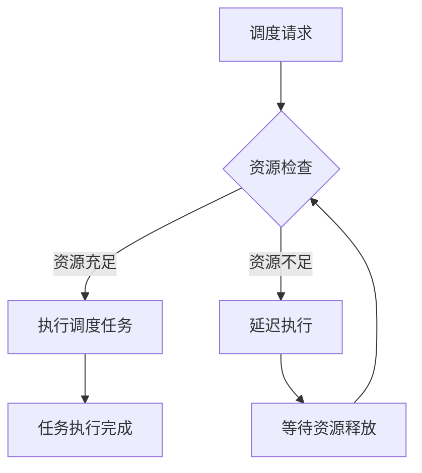
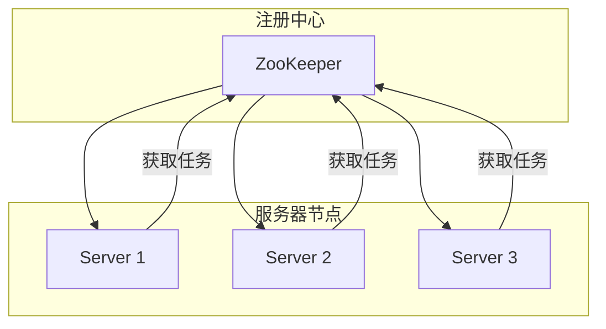
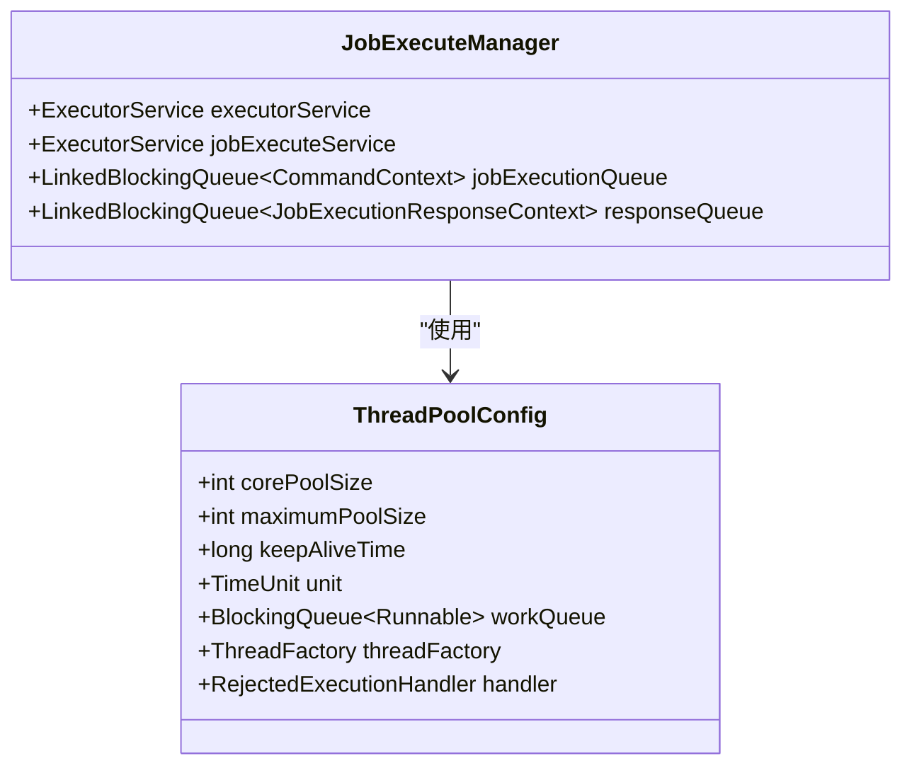
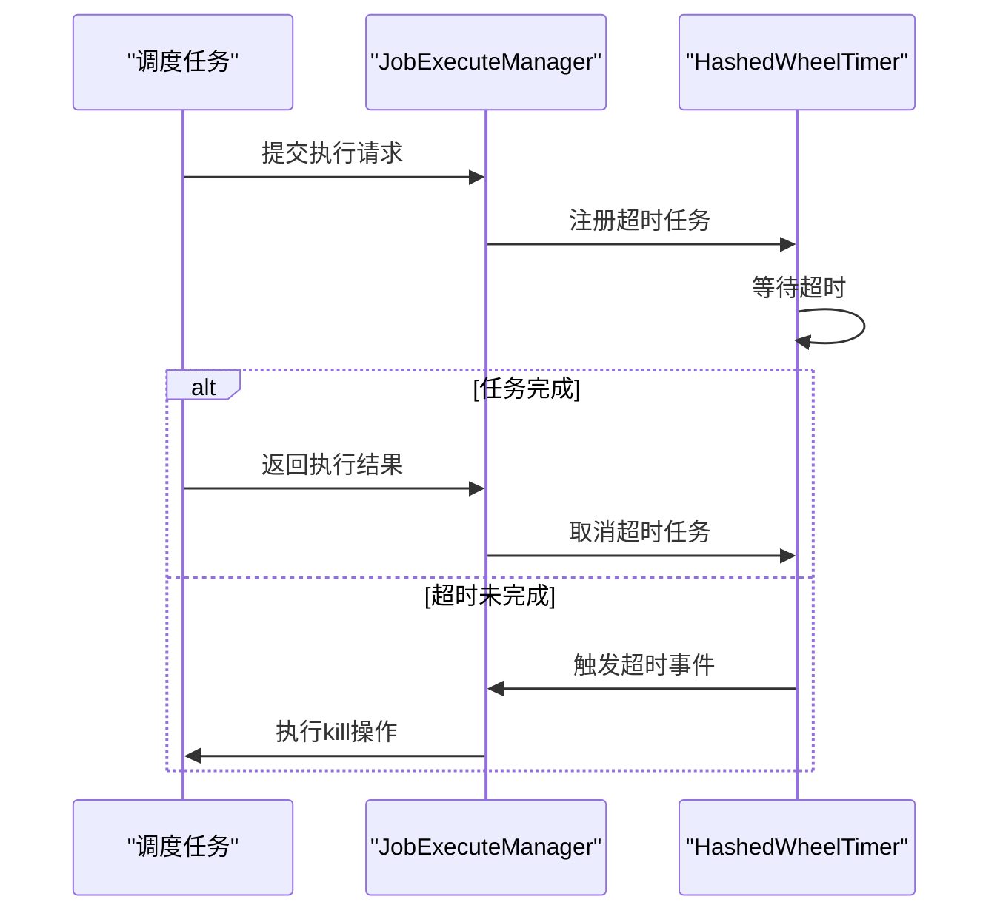
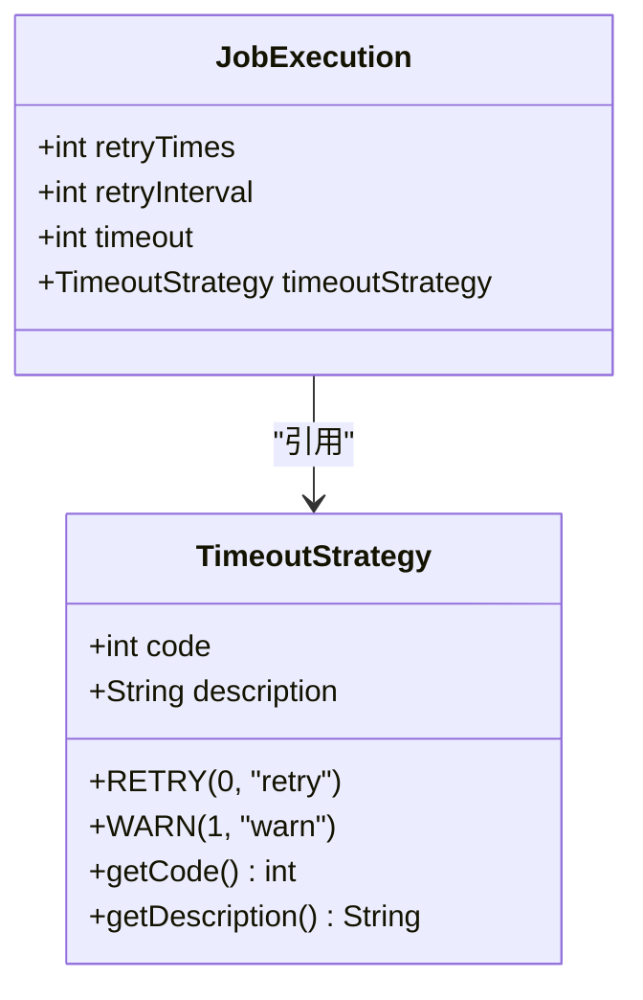
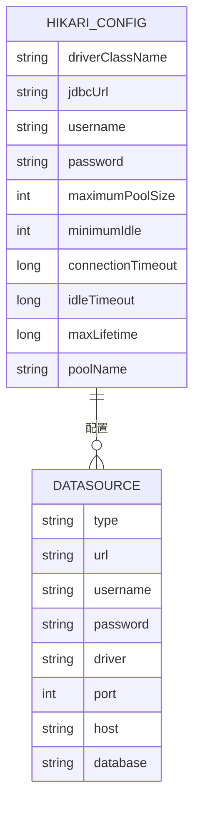
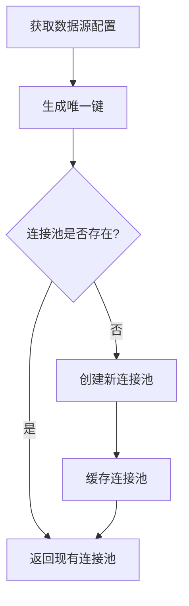
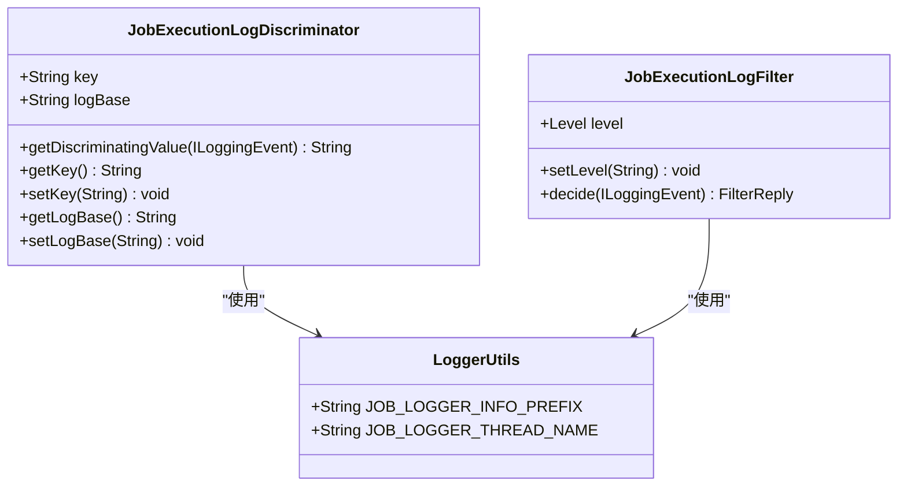

# 性能优化

<cite>
**本文档引用的文件**   
- [application.yaml](file://datavines-server/src/main/resources/application.yaml)
- [CommonTaskScheduler.java](file://datavines-server/src/main/java/io/datavines/server/scheduler/CommonTaskScheduler.java)
- [JobScheduler.java](file://datavines-server/src/main/java/io/datavines/server/dqc/coordinator/runner/JobScheduler.java)
- [JobExecuteManager.java](file://datavines-server/src/main/java/io/datavines/server/dqc/coordinator/cache/JobExecuteManager.java)
- [ThreadUtils.java](file://datavines-common/src/main/java/io/datavines/common/utils/ThreadUtils.java)
- [NamedThreadFactory.java](file://datavines-server/src/main/java/io/datavines/server/utils/NamedThreadFactory.java)
- [TimeoutStrategy.java](file://datavines-common/src/main/java/io/datavines/common/enums/TimeoutStrategy.java)
- [JdbcDataSourceManager.java](file://datavines-common/src/main/java/io/datavines/common/datasource/jdbc/JdbcDataSourceManager.java)
- [DefaultDataSourceInfoUtils.java](file://datavines-server/src/main/java/io/datavines/server/utils/DefaultDataSourceInfoUtils.java)
</cite>

## 目录
1. [引言](#引言)
2. [调度风暴避免策略](#调度风暴避免策略)
3. [分布式环境下的负载均衡](#分布式环境下的负载均衡)
4. [调度线程池配置](#调度线程池配置)
5. [超时控制与失败重试](#超时控制与失败重试)
6. [数据库连接池优化](#数据库连接池优化)
7. [日志管理与监控](#日志管理与监控)
8. [性能调优检查清单](#性能调优检查清单)

## 引言

DataVines 是一个数据质量服务管理平台，支持多种数据质量检查规则和执行引擎。本指南旨在提供提升调度系统效率和稳定性的最佳实践，涵盖调度优化、资源管理、线程池配置、超时控制、数据库连接池优化等多个方面，帮助用户构建高性能、高可用的数据质量监控系统。

## 调度风暴避免策略

为避免调度风暴，系统采用错峰执行和批量调度优化策略。通过配置合理的调度间隔和执行窗口，确保系统资源的平稳利用。



**图示来源**
- [CommonTaskScheduler.java](file://datavines-server/src/main/java/io/datavines/server/scheduler/CommonTaskScheduler.java#L55-L62)
- [JobScheduler.java](file://datavines-server/src/main/java/io/datavines/server/dqc/coordinator/runner/JobScheduler.java#L80-L86)

**本节来源**
- [CommonTaskScheduler.java](file://datavines-server/src/main/java/io/datavines/server/scheduler/CommonTaskScheduler.java#L49-L87)
- [JobScheduler.java](file://datavines-server/src/main/java/io/datavines/server/dqc/coordinator/runner/JobScheduler.java#L59-L134)

## 分布式环境下的负载均衡

在分布式环境下，系统通过注册中心实现节点间的负载均衡。每个节点根据自身资源状况和任务队列长度动态调整任务分配，确保整体负载均衡。



**图示来源**
- [CommonTaskScheduler.java](file://datavines-server/src/main/java/io/datavines/server/scheduler/CommonTaskScheduler.java#L41-L45)
- [JobScheduler.java](file://datavines-server/src/main/java/io/datavines/server/dqc/coordinator/runner/JobScheduler.java#L51-L55)

**本节来源**
- [CommonTaskScheduler.java](file://datavines-server/src/main/java/io/datavines/server/scheduler/CommonTaskScheduler.java#L41-L45)
- [JobScheduler.java](file://datavines-server/src/main/java/io/datavines/server/dqc/coordinator/runner/JobScheduler.java#L51-L55)

## 调度线程池配置

调度系统使用多个线程池来管理不同类型的任务执行，合理配置线程池参数对系统性能至关重要。

### 线程池配置参数

| 参数 | 描述 | 推荐值 |
|------|------|--------|
| corePoolSize | 核心线程数 | 根据CPU核心数设置 |
| maximumPoolSize | 最大线程数 | 根据系统资源设置 |
| keepAliveTime | 空闲线程存活时间 | 60秒 |
| workQueue | 工作队列容量 | 根据任务量设置 |



**图示来源**
- [JobExecuteManager.java](file://datavines-server/src/main/java/io/datavines/server/dqc/coordinator/cache/JobExecuteManager.java#L108-L111)
- [ThreadUtils.java](file://datavines-common/src/main/java/io/datavines/common/utils/ThreadUtils.java#L49-L155)

**本节来源**
- [JobExecuteManager.java](file://datavines-server/src/main/java/io/datavines/server/dqc/coordinator/cache/JobExecuteManager.java#L108-L111)
- [ThreadUtils.java](file://datavines-common/src/main/java/io/datavines/common/utils/ThreadUtils.java#L49-L155)

## 超时控制与失败重试

系统提供完善的超时控制和失败重试机制，确保任务执行的可靠性和稳定性。

### 超时策略配置



**图示来源**
- [JobExecuteManager.java](file://datavines-server/src/main/java/io/datavines/server/dqc/coordinator/cache/JobExecuteManager.java#L91-L92)
- [JobExecuteManager.java](file://datavines-server/src/main/java/io/datavines/server/dqc/coordinator/cache/JobExecuteManager.java#L404-L425)

### 失败重试策略

系统支持多种失败重试策略，通过枚举类型定义不同的重试行为。



**图示来源**
- [TimeoutStrategy.java](file://datavines-common/src/main/java/io/datavines/common/enums/TimeoutStrategy.java#L24-L50)
- [JobExecuteManager.java](file://datavines-server/src/main/java/io/datavines/server/dqc/coordinator/cache/JobExecuteManager.java#L321-L331)

**本节来源**
- [TimeoutStrategy.java](file://datavines-common/src/main/java/io/datavines/common/enums/TimeoutStrategy.java#L24-L50)
- [JobExecuteManager.java](file://datavines-server/src/main/java/io/datavines/server/dqc/coordinator/cache/JobExecuteManager.java#L321-L331)

## 数据库连接池优化

系统使用HikariCP作为数据库连接池，通过合理配置连接池参数提升数据库访问性能。

### 连接池配置



**图示来源**
- [JdbcDataSourceManager.java](file://datavines-common/src/main/java/io/datavines/common/datasource/jdbc/JdbcDataSourceManager.java#L59-L63)
- [DefaultDataSourceInfoUtils.java](file://datavines-server/src/main/java/io/datavines/server/utils/DefaultDataSourceInfoUtils.java#L45-L62)

### 连接池管理

系统通过唯一键管理不同数据源的连接池，避免重复创建连接。



**图示来源**
- [JdbcDataSourceManager.java](file://datavines-common/src/main/java/io/datavines/common/datasource/jdbc/JdbcDataSourceManager.java#L71-L97)
- [JdbcDataSourceManager.java](file://datavines-common/src/main/java/io/datavines/common/datasource/jdbc/JdbcDataSourceManager.java#L133-L138)

**本节来源**
- [JdbcDataSourceManager.java](file://datavines-common/src/main/java/io/datavines/common/datasource/jdbc/JdbcDataSourceManager.java#L59-L143)
- [DefaultDataSourceInfoUtils.java](file://datavines-server/src/main/java/io/datavines/server/utils/DefaultDataSourceInfoUtils.java#L45-L62)

## 日志管理与监控

系统提供完善的日志管理和监控机制，便于问题诊断和性能分析。

### 日志配置



**图示来源**
- [JobExecutionLogDiscriminator.java](file://datavines-common/src/main/java/io/datavines/common/log/JobExecutionLogDiscriminator.java#L30-L68)
- [JobExecutionLogFilter.java](file://datavines-common/src/main/java/io/datavines/common/log/JobExecutionLogFilter.java#L27-L44)

### 监控指标

系统通过Spring Boot Actuator暴露监控指标，便于集成监控系统。

```yaml
management:
  endpoints:
    web:
      exposure:
        include: '*'
  metrics:
    tags:
      application: ${spring.application.name}
```

**图示来源**
- [application.yaml](file://datavines-server/src/main/resources/application.yaml#L72-L80)

**本节来源**
- [JobExecutionLogDiscriminator.java](file://datavines-common/src/main/java/io/datavines/common/log/JobExecutionLogDiscriminator.java#L30-L68)
- [JobExecutionLogFilter.java](file://datavines-common/src/main/java/io/datavines/common/log/JobExecutionLogFilter.java#L27-L44)
- [application.yaml](file://datavines-server/src/main/resources/application.yaml#L72-L80)

## 性能调优检查清单

### 配置检查清单

| 检查项 | 配置建议 |
|-------|---------|
| 调度线程池大小 | 根据CPU核心数和任务类型合理设置 |
| 数据库连接池大小 | 根据并发需求和数据库性能设置 |
| 任务超时时间 | 根据任务执行时间合理设置 |
| 失败重试次数 | 根据任务重要性和失败原因设置 |
| 日志级别 | 生产环境建议使用INFO级别 |
| 监控指标 | 确保关键指标已暴露 |

### 常见性能问题诊断

1. **调度延迟**：检查系统资源使用情况，调整调度线程池大小
2. **数据库连接耗尽**：检查连接池配置，优化数据库访问
3. **任务执行超时**：分析任务执行时间，调整超时策略
4. **内存溢出**：检查对象生命周期，优化内存使用
5. **CPU使用率过高**：分析热点代码，优化算法效率

**本节来源**
- [application.yaml](file://datavines-server/src/main/resources/application.yaml)
- [CommonTaskScheduler.java](file://datavines-server/src/main/java/io/datavines/server/scheduler/CommonTaskScheduler.java)
- [JobScheduler.java](file://datavines-server/src/main/java/io/datavines/server/dqc/coordinator/runner/JobScheduler.java)
- [JobExecuteManager.java](file://datavines-server/src/main/java/io/datavines/server/dqc/coordinator/cache/JobExecuteManager.java)