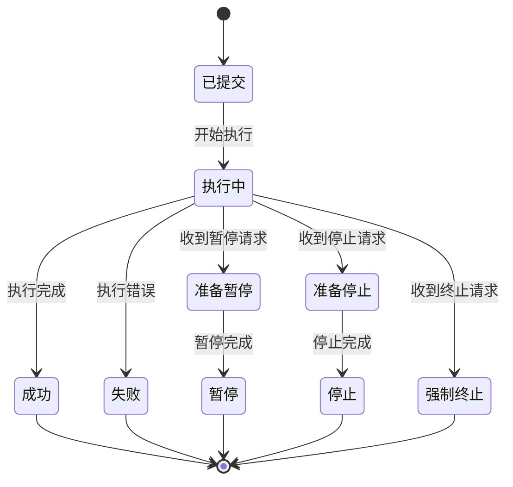
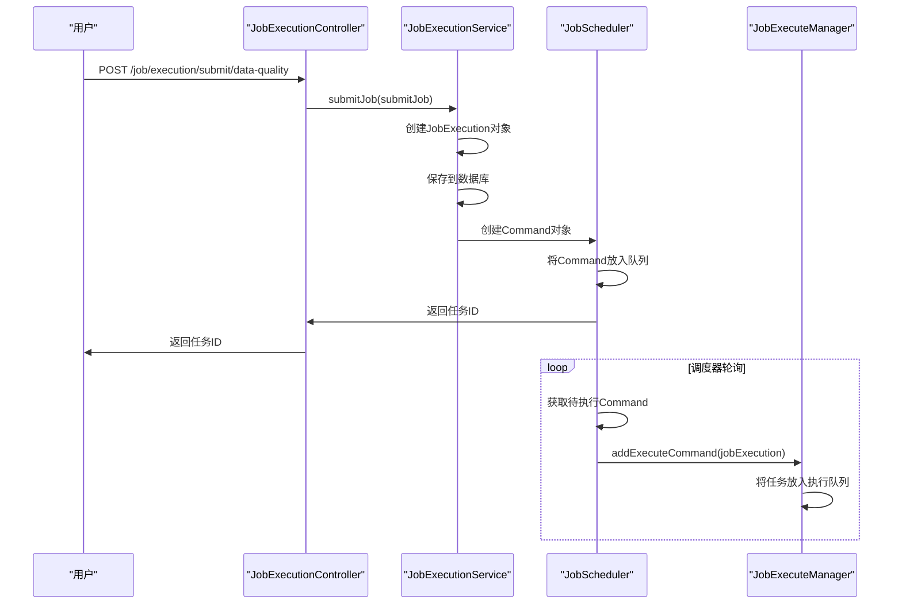
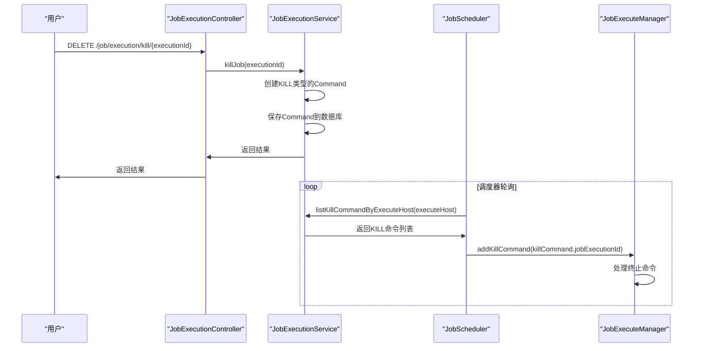
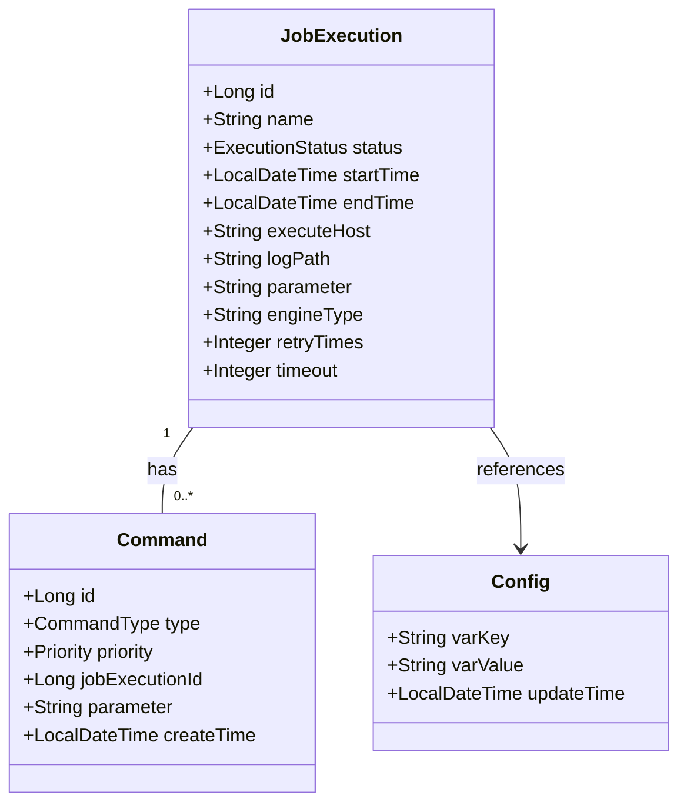
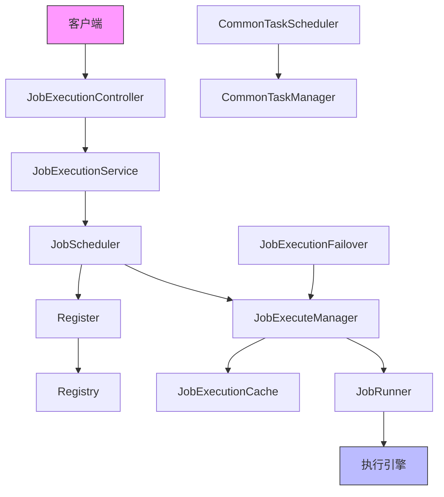
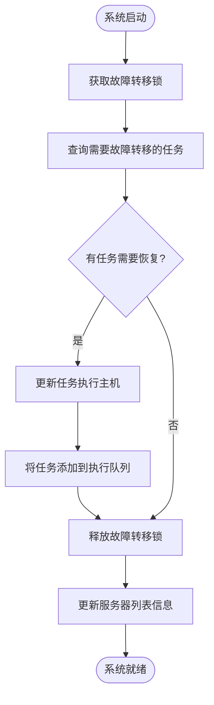
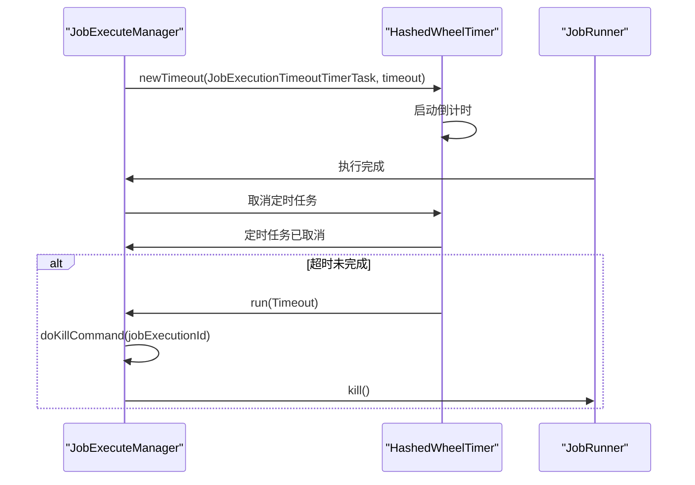
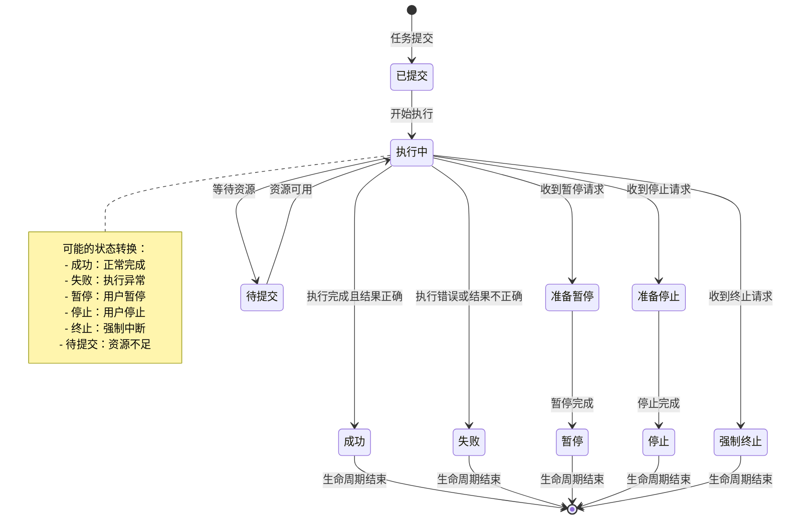

# 生命周期管理

<cite>
**本文档引用的文件**
- [DataVinesServer.java](file://datavines-server/src/main/java/io/datavines/server/DataVinesServer.java)
- [JobExecutionController.java](file://datavines-server/src/main/java/io/datavines/server/api/controller/JobExecutionController.java)
- [JobExecuteManager.java](file://datavines-server/src/main/java/io/datavines/server/dqc/coordinator/cache/JobExecuteManager.java)
- [JobScheduler.java](file://datavines-server/src/main/java/io/datavines/server/dqc/coordinator/runner/JobScheduler.java)
- [Register.java](file://datavines-server/src/main/java/io/datavines/server/registry/Register.java)
- [CommonTaskManager.java](file://datavines-server/src/main/java/io/datavines/server/scheduler/CommonTaskManager.java)
- [CommonTaskScheduler.java](file://datavines-server/src/main/java/io/datavines/server/scheduler/CommonTaskScheduler.java)
- [ExecutionStatus.java](file://datavines-common/src/main/java/io/datavines/common/enums/ExecutionStatus.java)
</cite>

## 目录
1. [引言](#引言)
2. [调度任务生命周期概述](#调度任务生命周期概述)
3. [任务状态转换逻辑](#任务状态转换逻辑)
4. [任务操作实现机制](#任务操作实现机制)
5. [元数据持久化与查询](#元数据持久化与查询)
6. [系统组件交互](#系统组件交互)
7. [异常情况处理策略](#异常情况处理策略)
8. [生命周期状态转换图](#生命周期状态转换图)
9. [结论](#结论)

## 引言

数据质量调度任务生命周期管理是Datavines系统的核心功能之一，负责管理数据质量检查任务从创建到销毁的完整生命周期。本系统通过分布式架构设计，实现了任务的创建、启动、暂停、恢复、更新和删除等操作，同时提供了完善的任务状态管理、元数据持久化和异常处理机制。

系统采用微服务架构，主要由服务器核心模块、调度器、执行引擎和注册中心等组件构成。服务器核心模块负责任务的生命周期管理，调度器负责任务的调度和分配，执行引擎负责任务的实际执行，注册中心负责节点的注册和故障转移。这种架构设计确保了系统的高可用性和可扩展性。

**本文档引用的文件**
- [DataVinesServer.java](file://datavines-server/src/main/java/io/datavines/server/DataVinesServer.java)

## 调度任务生命周期概述

调度任务的生命周期从任务创建开始，经过提交、执行、完成或失败等阶段，最终到达销毁状态。整个生命周期由多个核心组件协同管理，确保任务能够按照预定的流程顺利执行。

在系统启动时，`DataVinesServer`类负责初始化所有核心组件。通过`@PostConstruct`注解标记的`initializeAndStart`方法，系统依次初始化公共属性、任务执行管理器、通用任务管理器、注册中心等关键组件。其中，`JobScheduler`负责数据质量任务的调度，`CommonTaskScheduler`负责通用任务的调度。

任务的生命周期管理主要通过`JobExecuteManager`类实现。该类维护了任务执行队列、未完成任务映射和响应队列，通过多线程机制处理任务的执行和响应。当任务被提交时，系统会创建`JobExecutionRequest`对象，包含任务执行所需的所有参数，并将其放入执行队列中等待处理。

**Section sources**
- [DataVinesServer.java](file://datavines-server/src/main/java/io/datavines/server/DataVinesServer.java#L75-L108)
- [JobExecuteManager.java](file://datavines-server/src/main/java/io/datavines/server/dqc/coordinator/cache/JobExecuteManager.java#L77-L81)

## 任务状态转换逻辑

调度任务的状态转换是生命周期管理的核心，系统定义了多种状态来精确描述任务的执行情况。这些状态通过`ExecutionStatus`枚举类进行管理，每个状态都有唯一的代码和描述信息。

主要任务状态包括：
- **已提交**（SUBMITTED_SUCCESS）：任务已成功提交到系统，等待执行
- **执行中**（RUNNING_EXECUTION）：任务正在执行过程中
- **准备暂停**（READY_PAUSE）：任务已收到暂停请求，正在准备暂停
- **暂停**（PAUSE）：任务已暂停执行
- **准备停止**（READY_STOP）：任务已收到停止请求，正在准备停止
- **停止**（STOP）：任务已停止执行
- **失败**（FAILURE）：任务执行失败
- **成功**（SUCCESS）：任务执行成功
- **强制终止**（KILL）：任务被强制终止

状态转换遵循严格的规则，例如只有在"已提交"或"准备暂停"状态下才能暂停任务，只有在"执行中"状态下才能停止任务。系统通过`typeIsRunning()`、`typeIsSuccess()`、`typeIsFailure()`等方法提供状态判断功能，便于在业务逻辑中进行状态检查。

**Diagram sources**
- [ExecutionStatus.java](file://datavines-common/src/main/java/io/datavines/common/enums/ExecutionStatus.java#L45-L56)

**Section sources**
- [ExecutionStatus.java](file://datavines-common/src/main/java/io/datavines/common/enums/ExecutionStatus.java#L86-L157)

## 任务操作实现机制

调度任务的各种操作通过API接口和后端服务协同实现。系统提供了RESTful API接口，允许用户通过HTTP请求对任务进行管理操作。

### 任务创建与启动

任务创建通过`JobExecutionController`中的`submitDataQualityJob`方法实现。当用户提交任务时，系统会创建`SubmitJob`对象，包含任务的基本信息和执行参数。控制器将请求转发给`JobExecutionService`，由服务层处理任务的持久化和调度。

**Diagram sources**
- [JobExecutionController.java](file://datavines-server/src/main/java/io/datavines/server/api/controller/JobExecutionController.java#L57-L59)
- [JobScheduler.java](file://datavines-server/src/main/java/io/datavines/server/dqc/coordinator/runner/JobScheduler.java#L89-L113)

### 任务暂停与恢复

目前系统主要通过"停止"和"强制终止"操作来中断任务执行。`JobExecutionController`提供了`killTask`方法，允许用户通过DELETE请求终止指定的任务执行。

当收到终止请求时，系统会创建一个`Command`对象，类型为`CommandType.KILL`，并将其放入命令队列。`JobScheduler`在轮询时会检查是否有针对本机的KILL命令，如果有，则调用`JobExecuteManager`的`addKillCommand`方法。

**Diagram sources**
- [JobExecutionController.java](file://datavines-server/src/main/java/io/datavines/server/api/controller/JobExecutionController.java#L68-L70)
- [JobScheduler.java](file://datavines-server/src/main/java/io/datavines/server/dqc/coordinator/runner/JobScheduler.java#L69-L77)

### 任务更新与删除

任务更新主要通过修改任务配置和重新提交来实现。系统没有提供直接的任务更新API，而是通过创建新的任务执行实例来反映配置变更。任务删除实际上是通过终止正在运行的任务来实现的，已完成的任务记录会保留在系统中作为历史数据。

**Section sources**
- [JobExecutionController.java](file://datavines-server/src/main/java/io/datavines/server/api/controller/JobExecutionController.java#L57-L77)

## 元数据持久化与查询

调度任务的元数据通过关系型数据库进行持久化存储，系统使用MyBatis-Plus作为ORM框架，实现了数据的高效存取。

### 元数据存储结构

核心数据表包括：
- **job_execution**：存储任务执行实例，包含任务ID、状态、开始时间、结束时间等信息
- **command**：存储调度命令，包含命令类型、优先级、任务执行ID等信息
- **config**：存储系统配置，用于动态调整系统行为

### 元数据查询机制

系统提供了多种查询接口，支持按不同条件检索任务执行记录。`JobExecutionService`接口定义了`getById`、`listByJobId`、`getJobExecutionPage`等方法，支持精确查询、列表查询和分页查询。

**Diagram sources**
- [JobExecution.java](file://datavines-server/src/main/java/io/datavines/server/repository/entity/JobExecution.java)
- [Command.java](file://datavines-server/src/main/java/io/datavines/server/repository/entity/Command.java)
- [Config.java](file://datavines-server/src/main/java/io/datavines/server/repository/entity/Config.java)

**Section sources**
- [JobExecutionService.java](file://datavines-server/src/main/java/io/datavines/server/repository/service/JobExecutionService.java#L30-L34)
- [JobExecutionController.java](file://datavines-server/src/main/java/io/datavines/server/api/controller/JobExecutionController.java#L79-L83)

## 系统组件交互

调度任务生命周期管理涉及多个系统组件的协同工作，各组件通过定义良好的接口进行交互，确保系统的松耦合和高内聚。

### 核心组件交互

- **控制器层**（JobExecutionController）：提供RESTful API接口，接收外部请求
- **服务层**（JobExecutionService）：处理业务逻辑，协调各组件工作
- **调度器**（JobScheduler）：负责任务的调度和分配，从命令队列获取待执行任务
- **执行管理器**（JobExecuteManager）：管理任务执行的整个过程，包括执行、监控和响应处理
- **注册中心**（Register）：管理集群节点，处理节点故障转移
- **缓存**（JobExecutionCache）：缓存正在执行的任务上下文，支持任务状态查询和故障恢复

### 交互流程

1. 客户端通过HTTP请求提交任务
2. 控制器接收请求并调用服务层
3. 服务层创建任务执行记录和调度命令
4. 调度器轮询获取待执行命令
5. 执行管理器接收任务并启动执行线程
6. JobRunner加载执行引擎并运行任务
7. 执行结果通过响应队列返回给执行管理器
8. 执行管理器更新任务状态并通知相关组件

**Section sources**
- [DataVinesServer.java](file://datavines-server/src/main/java/io/datavines/server/DataVinesServer.java#L75-L108)
- [JobScheduler.java](file://datavines-server/src/main/java/io/datavines/server/dqc/coordinator/runner/JobScheduler.java)
- [JobExecuteManager.java](file://datavines-server/src/main/java/io/datavines/server/dqc/coordinator/cache/JobExecuteManager.java)

## 异常情况处理策略

系统设计了完善的异常处理机制，确保在各种异常情况下仍能保持稳定运行。

### 系统重启后的任务恢复

当系统重启时，`Register`组件会执行故障恢复流程。在`start`方法中，系统会：
1. 获取当前服务器的地址信息
2. 查询是否有需要故障转移的任务
3. 将这些任务重新分配到当前活跃的服务器节点
4. 更新任务的执行主机信息

**Diagram sources**
- [Register.java](file://datavines-server/src/main/java/io/datavines/server/registry/Register.java#L113-L134)

### 调度冲突处理

系统通过分布式锁机制处理调度冲突。`Register`类使用注册中心提供的`acquire`和`release`方法实现分布式锁，确保在故障转移过程中只有一个节点能够处理任务恢复。

当多个节点同时检测到某个节点失效时，它们都会尝试获取故障转移锁。只有成功获取锁的节点才能执行任务恢复操作，其他节点将等待或重试。这种机制避免了多个节点同时恢复同一任务导致的冲突。

### 任务执行超时处理

系统使用`HashedWheelTimer`实现任务执行超时检测。当任务开始执行时，会创建一个超时定时任务。如果在指定时间内没有收到任务完成的响应，定时任务将触发并调用`doKillCommand`方法强制终止任务。

**Diagram sources**
- [JobExecuteManager.java](file://datavines-server/src/main/java/io/datavines/server/dqc/coordinator/cache/JobExecuteManager.java#L91-L92)
- [JobExecuteManager.java](file://datavines-server/src/main/java/io/datavines/server/dqc/coordinator/cache/JobExecuteManager.java#L404-L425)

**Section sources**
- [Register.java](file://datavines-server/src/main/java/io/datavines/server/registry/Register.java#L137-L141)
- [JobExecuteManager.java](file://datavines-server/src/main/java/io/datavines/server/dqc/coordinator/cache/JobExecuteManager.java#L404-L425)

## 生命周期状态转换图

以下是调度任务生命周期的完整状态转换图，展示了任务在不同状态之间的转换关系和触发条件。

**Diagram sources**
- [ExecutionStatus.java](file://datavines-common/src/main/java/io/datavines/common/enums/ExecutionStatus.java)

## 结论

Datavines系统的数据质量调度任务生命周期管理机制设计完善，通过分布式架构实现了高可用性和可扩展性。系统采用分层设计，各组件职责明确，通过定义良好的接口进行交互，确保了系统的松耦合和高内聚。

核心特点包括：
1. **完整的生命周期管理**：支持任务的创建、启动、暂停、恢复、更新和删除等操作
2. **精确的状态控制**：通过多种状态精确描述任务的执行情况，支持复杂的状态转换逻辑
3. **可靠的持久化机制**：使用关系型数据库持久化任务元数据，确保数据的可靠存储
4. **高效的组件交互**：通过队列和缓存机制实现组件间的高效通信
5. **完善的异常处理**：设计了系统重启恢复、调度冲突处理和超时处理等机制

该系统能够有效管理大规模数据质量检查任务，为数据质量管理提供了坚实的基础。未来可以进一步优化任务调度算法，增加更多状态监控指标，提升系统的智能化水平。