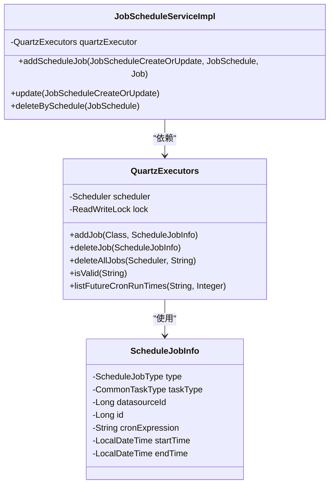
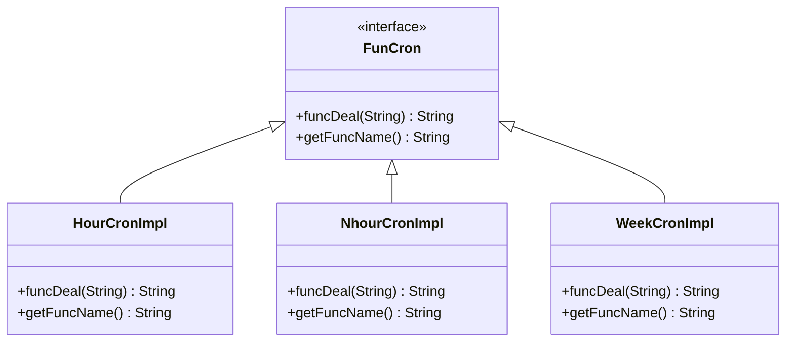
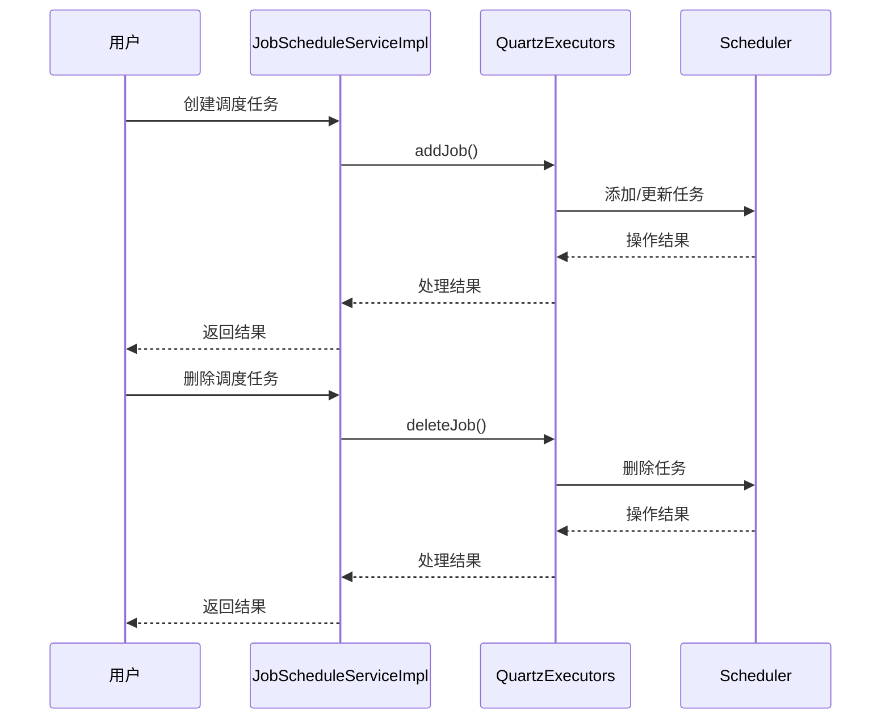
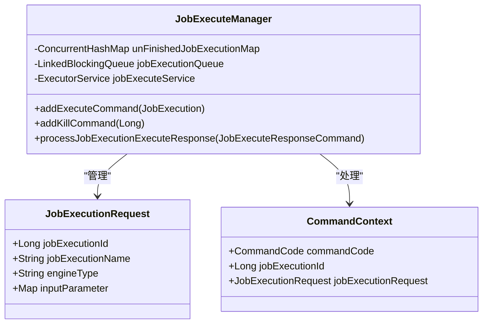
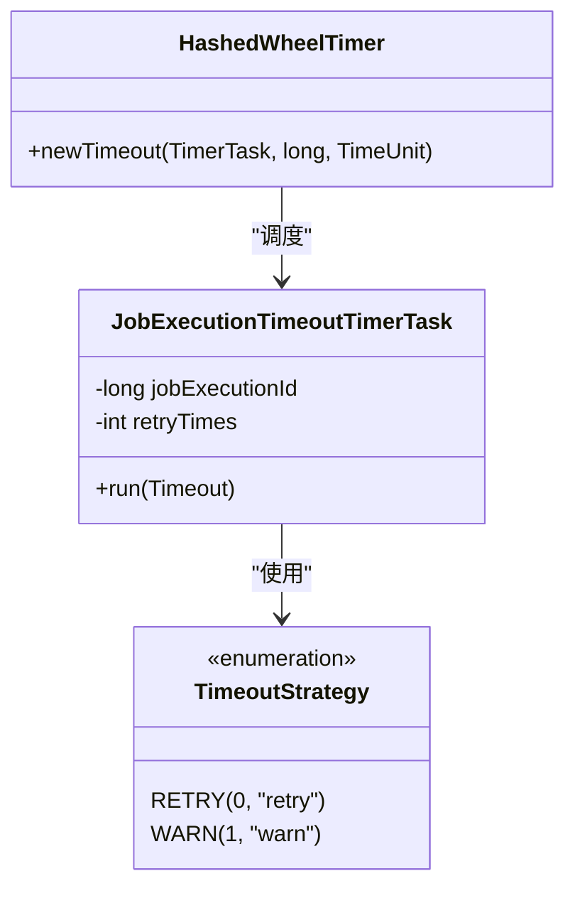
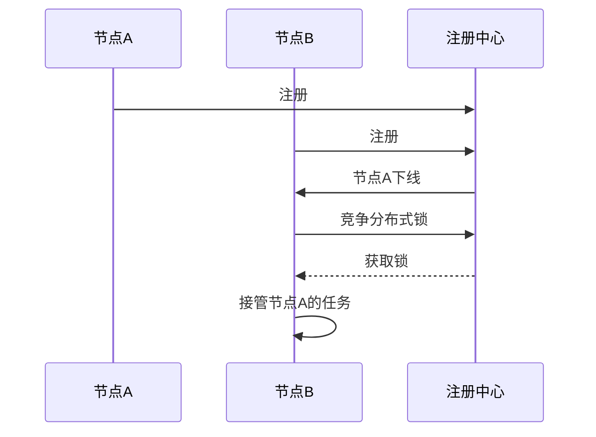

# 调度策略

<cite>
**本文档引用的文件**   
- [ScheduleJobInfo.java](file://datavines-server/src/main/java/io/datavines/server/dqc/coordinator/quartz/ScheduleJobInfo.java)
- [QuartzExecutors.java](file://datavines-server/src/main/java/io/datavines/server/dqc/coordinator/quartz/QuartzExecutors.java)
- [application.yaml](file://datavines-server/src/main/resources/application.yaml)
- [JobExecuteManager.java](file://datavines-server/src/main/java/io/datavines/server/dqc/coordinator/cache/JobExecuteManager.java)
- [JobExecutionFailover.java](file://datavines-server/src/main/java/io/datavines/server/dqc/coordinator/failover/JobExecutionFailover.java)
- [DataVinesServer.java](file://datavines-server/src/main/java/io/datavines/server/DataVinesServer.java)
- [JobScheduleServiceImpl.java](file://datavines-server/src/main/java/io/datavines/server/repository/service/impl/JobScheduleServiceImpl.java)
- [TimeoutStrategy.java](file://datavines-common/src/main/java/io/datavines/common/enums/TimeoutStrategy.java)
- [NhourCronImpl.java](file://datavines-server/src/main/java/io/datavines/server/dqc/coordinator/quartz/cron/impl/NhourCronImpl.java)
- [HourCronImpl.java](file://datavines-server/src/main/java/io/datavines/server/dqc/coordinator/quartz/cron/impl/HourCronImpl.java)
- [WeekCronImpl.java](file://datavines-server/src/main/java/io/datavines/server/dqc/coordinator/quartz/cron/impl/WeekCronImpl.java)
</cite>

## 目录
1. [引言](#引言)
2. [调度框架实现原理](#调度框架实现原理)
3. [调度类型详解](#调度类型详解)
4. [Cron表达式语法与示例](#cron表达式语法与示例)
5. [调度任务生命周期管理](#调度任务生命周期管理)
6. [依赖管理与资源竞争处理](#依赖管理与资源竞争处理)
7. [超时与失败重试策略](#超时与失败重试策略)
8. [性能优化建议](#性能优化建议)
9. [分布式环境下的调度一致性](#分布式环境下的调度一致性)
10. [总结](#总结)

## 引言
数据质量调度策略文档全面介绍了基于Quartz框架的质量检查任务调度机制。该系统通过Quartz实现任务的精确调度，支持一次性、固定频率和Cron表达式等多种调度类型，确保数据质量检查任务能够按时、高效地执行。系统还提供了完善的调度任务生命周期管理、依赖管理、优先级设置和资源竞争处理机制，以及超时策略和失败重试策略，确保调度过程的稳定性和可靠性。在分布式环境下，系统通过注册中心和容错机制保证调度的一致性和故障恢复能力。

## 调度框架实现原理
数据质量调度系统基于Quartz框架实现，Quartz是一个功能强大的开源作业调度框架，能够为几乎任何类型的作业提供调度服务。系统通过`QuartzExecutors`类封装Quartz的核心功能，实现了任务的添加、删除和更新操作。

**图源**
- [QuartzExecutors.java](file://datavines-server/src/main/java/io/datavines/server/dqc/coordinator/quartz/QuartzExecutors.java)
- [ScheduleJobInfo.java](file://datavines-server/src/main/java/io/datavines/server/dqc/coordinator/quartz/ScheduleJobInfo.java)
- [JobScheduleServiceImpl.java](file://datavines-server/src/main/java/io/datavines/server/repository/service/impl/JobScheduleServiceImpl.java)

**本节源码**
- [QuartzExecutors.java](file://datavines-server/src/main/java/io/datavines/server/dqc/coordinator/quartz/QuartzExecutors.java#L58-L262)
- [ScheduleJobInfo.java](file://datavines-server/src/main/java/io/datavines/server/dqc/coordinator/quartz/ScheduleJobInfo.java#L24-L56)

## 调度类型详解
系统支持三种主要的调度类型：一次性调度、固定频率调度和Cron表达式调度。每种调度类型都有其特定的使用场景和配置方式。

### 一次性调度
一次性调度用于执行单次任务，任务在指定时间点执行一次后即完成。这种调度类型适用于需要在特定时间点执行的临时任务或初始化任务。

### 固定频率调度
固定频率调度允许任务按照固定的间隔时间重复执行。系统提供了多种固定频率的实现，如每小时、每天等。例如，`HourCronImpl`类实现了每小时调度的功能，通过配置分钟数来确定每小时的具体执行时间。

**图源**
- [HourCronImpl.java](file://datavines-server/src/main/java/io/datavines/server/dqc/coordinator/quartz/cron/impl/HourCronImpl.java)
- [NhourCronImpl.java](file://datavines-server/src/main/java/io/datavines/server/dqc/coordinator/quartz/cron/impl/NhourCronImpl.java)
- [WeekCronImpl.java](file://datavines-server/src/main/java/io/datavines/server/dqc/coordinator/quartz/cron/impl/WeekCronImpl.java)

### Cron表达式调度
Cron表达式调度提供了最灵活的调度方式，允许用户通过Cron表达式定义复杂的调度模式。系统支持标准的Quartz Cron表达式语法，可以精确到秒级别，满足各种复杂的调度需求。

**本节源码**
- [HourCronImpl.java](file://datavines-server/src/main/java/io/datavines/server/dqc/coordinator/quartz/cron/impl/HourCronImpl.java#L37-L75)
- [NhourCronImpl.java](file://datavines-server/src/main/java/io/datavines/server/dqc/coordinator/quartz/cron/impl/NhourCronImpl.java#L38-L73)
- [WeekCronImpl.java](file://datavines-server/src/main/java/io/datavines/server/dqc/coordinator/quartz/cron/impl/WeekCronImpl.java#L38-L75)

## Cron表达式语法与示例
Cron表达式由六个或七个字段组成，分别表示秒、分钟、小时、日期、月份、星期和年份（可选）。每个字段可以使用数字、星号（*）、斜杠（/）、连字符（-）和逗号（,）等符号来定义具体的调度规则。

### Cron表达式语法
- **秒（Seconds）**：0-59
- **分钟（Minutes）**：0-59
- **小时（Hours）**：0-23
- **日期（Day of month）**：1-31
- **月份（Month）**：1-12 或 JAN-DEC
- **星期（Day of week）**：1-7 或 SUN-SAT（1表示星期日）
- **年份（Year）**：可选，1970-2099

### 常见调度模式示例
- **每小时**：`0 0 * * * ?` - 每小时的第0分钟第0秒执行
- **每天凌晨**：`0 0 0 * * ?` - 每天的00:00:00执行
- **每周一**：`0 0 0 ? * MON` - 每周一的00:00:00执行
- **每月1号**：`0 0 0 1 * ?` - 每月1号的00:00:00执行
- **每5分钟**：`0 */5 * * * ?` - 每5分钟执行一次

系统提供了`listFutureCronRunTimes`方法来验证Cron表达式的有效性，并计算未来的执行时间列表，帮助用户确认调度配置的正确性。

**本节源码**
- [QuartzExecutors.java](file://datavines-server/src/main/java/io/datavines/server/dqc/coordinator/quartz/QuartzExecutors.java#L249-L261)

## 调度任务生命周期管理
调度任务的生命周期包括创建、启动、暂停、恢复和删除等操作。系统通过`JobScheduleServiceImpl`类提供了完整的生命周期管理接口。

### 创建调度任务
创建调度任务时，系统会根据调度类型调用`QuartzExecutors`的`addJob`方法，将任务添加到Quartz调度器中。如果任务已存在，则更新其触发器配置。

### 启动与暂停
系统通过`JobExecuteManager`类管理任务的执行状态。任务启动时，会将其添加到执行队列中；暂停时，会从队列中移除并停止执行。

### 恢复与删除
恢复操作会重新将暂停的任务添加到执行队列中。删除操作则通过`QuartzExecutors`的`deleteJob`方法从调度器中移除任务。

**图源**
- [JobScheduleServiceImpl.java](file://datavines-server/src/main/java/io/datavines/server/repository/service/impl/JobScheduleServiceImpl.java)
- [QuartzExecutors.java](file://datavines-server/src/main/java/io/datavines/server/dqc/coordinator/quartz/QuartzExecutors.java)

**本节源码**
- [JobScheduleServiceImpl.java](file://datavines-server/src/main/java/io/datavines/server/repository/service/impl/JobScheduleServiceImpl.java#L116-L197)
- [QuartzExecutors.java](file://datavines-server/src/main/java/io/datavines/server/dqc/coordinator/quartz/QuartzExecutors.java#L74-L148)

## 依赖管理与资源竞争处理
系统通过`JobExecuteManager`类管理任务的执行依赖和资源竞争。`JobExecuteManager`维护了一个执行队列和一个未完成任务映射表，确保任务按序执行并避免资源冲突。

**图源**
- [JobExecuteManager.java](file://datavines-server/src/main/java/io/datavines/server/dqc/coordinator/cache/JobExecuteManager.java)

**本节源码**
- [JobExecuteManager.java](file://datavines-server/src/main/java/io/datavines/server/dqc/coordinator/cache/JobExecuteManager.java#L72-L615)

## 超时与失败重试策略
系统通过`TimeoutStrategy`枚举定义了任务失败时的处理策略，支持重试（RETRY）和警告（WARN）两种模式。超时策略通过`HashedWheelTimer`实现，为每个任务设置超时定时器。

**图源**
- [TimeoutStrategy.java](file://datavines-common/src/main/java/io/datavines/common/enums/TimeoutStrategy.java)
- [JobExecuteManager.java](file://datavines-server/src/main/java/io/datavines/server/dqc/coordinator/cache/JobExecuteManager.java)

**本节源码**
- [TimeoutStrategy.java](file://datavines-common/src/main/java/io/datavines/common/enums/TimeoutStrategy.java#L24-L31)
- [JobExecuteManager.java](file://datavines-server/src/main/java/io/datavines/server/dqc/coordinator/cache/JobExecuteManager.java#L91-L92)

## 性能优化建议
为避免调度风暴和实现负载均衡，建议采取以下措施：
1. **合理设置调度间隔**：避免过于频繁的调度，减少系统负载。
2. **使用分布式锁**：在分布式环境下，通过分布式锁确保同一任务不会被多个节点重复执行。
3. **动态调整线程池大小**：根据系统负载动态调整执行线程池的大小，提高资源利用率。
4. **监控和告警**：建立完善的监控和告警机制，及时发现和处理调度异常。

## 分布式环境下的调度一致性
在分布式环境下，系统通过注册中心（Registry）和容错机制保证调度的一致性和故障恢复能力。当某个节点宕机时，其他节点会通过竞争分布式锁获得容错资格，接管该节点上未完成的任务。

**图源**
- [Register.java](file://datavines-server/src/main/java/io/datavines/server/registry/Register.java)
- [JobExecutionFailover.java](file://datavines-server/src/main/java/io/datavines/server/dqc/coordinator/failover/JobExecutionFailover.java)

**本节源码**
- [DataVinesServer.java](file://datavines-server/src/main/java/io/datavines/server/DataVinesServer.java#L73-L109)
- [JobExecutionFailover.java](file://datavines-server/src/main/java/io/datavines/server/dqc/coordinator/failover/JobExecutionFailover.java#L43-L151)

## 总结
本文档全面介绍了数据质量调度系统的实现原理和配置方式。系统基于Quartz框架，支持多种调度类型，提供了完善的生命周期管理、依赖管理、超时和失败重试策略。在分布式环境下，通过注册中心和容错机制保证了调度的一致性和可靠性。通过合理的性能优化措施，系统能够高效、稳定地执行数据质量检查任务。