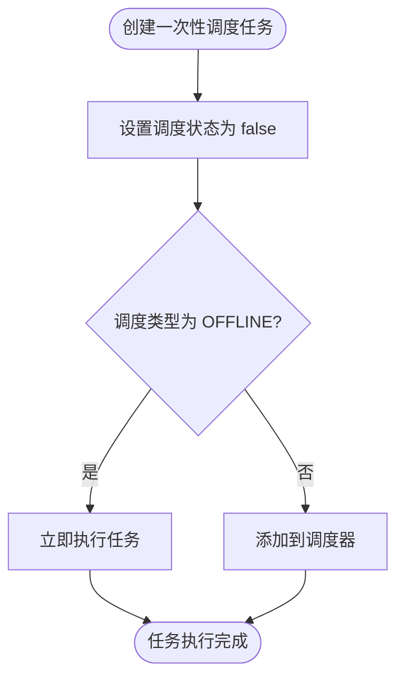
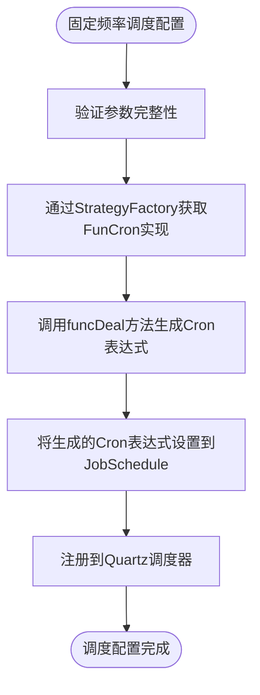
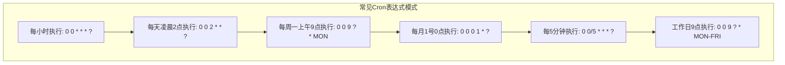
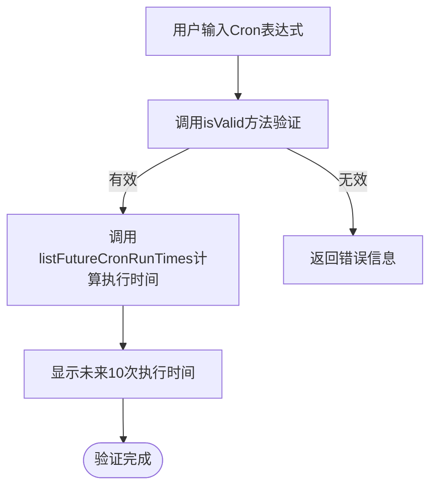
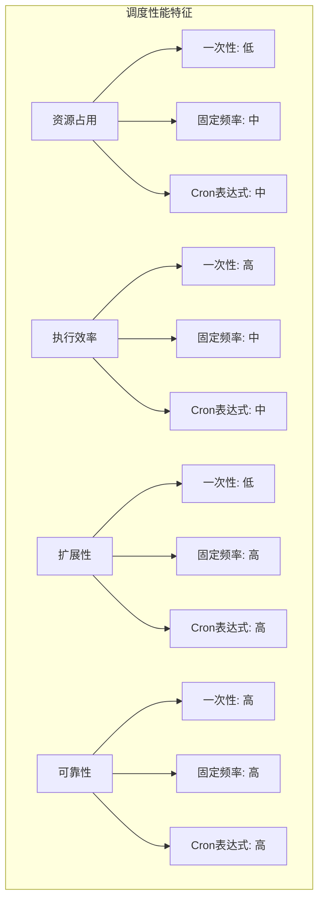
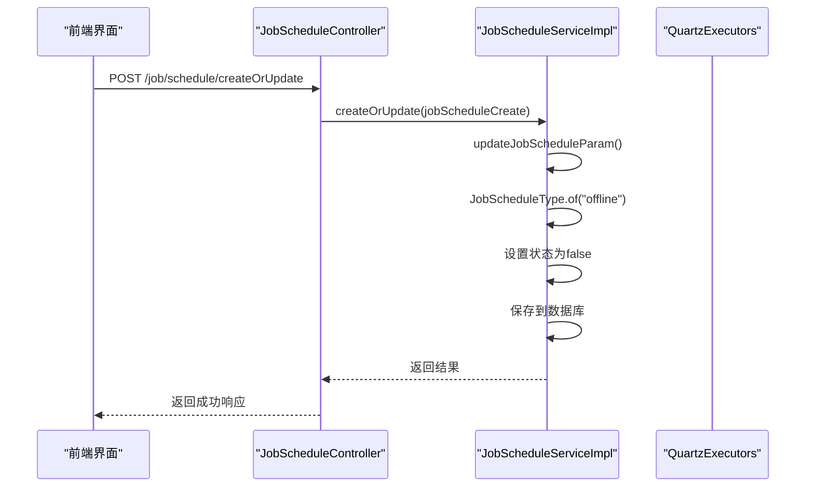
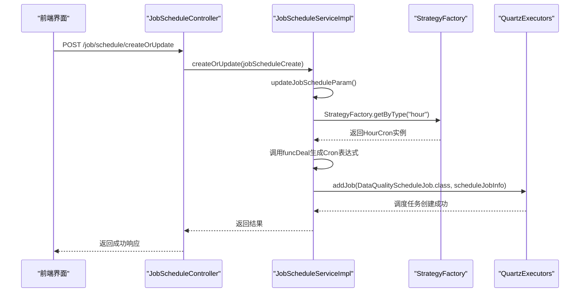
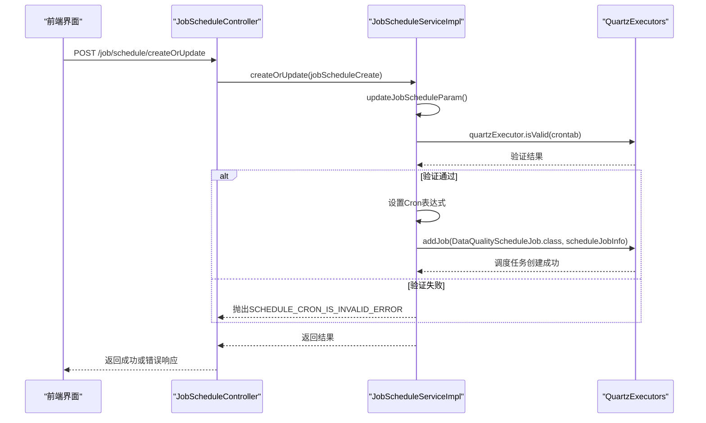

# 调度类型

<cite>
**本文档引用的文件**  
- [JobScheduleType.java](file://datavines-server/src/main/java/io/datavines/server/enums/JobScheduleType.java)
- [QuartzExecutors.java](file://datavines-server/src/main/java/io/datavines/server/dqc/coordinator/quartz/QuartzExecutors.java)
- [JobScheduleServiceImpl.java](file://datavines-server/src/main/java/io/datavines/server/repository/service/impl/JobScheduleServiceImpl.java)
- [JobSchedule.java](file://datavines-server/src/main/java/io/datavines/server/repository/entity/JobSchedule.java)
- [MapParam.java](file://datavines-server/src/main/java/io/datavines/server/api/dto/bo/job/schedule/MapParam.java)
- [ScheduleJobInfo.java](file://datavines-server/src/main/java/io/datavines/server/dqc/coordinator/quartz/ScheduleJobInfo.java)
- [JobScheduleController.java](file://datavines-server/src/main/java/io/datavines/server/api/controller/JobScheduleController.java)
- [index.tsx](file://datavines-ui/src/view/Main/HomeDetail/Jobs/components/Schedule/index.tsx)
</cite>

## 目录
1. [介绍](#介绍)
2. [一次性调度](#一次性调度)
3. [固定频率调度](#固定频率调度)
4. [Cron表达式调度](#cron表达式调度)
5. [调度类型对比](#调度类型对比)
6. [代码实现示例](#代码实现示例)
7. [结论](#结论)

## 介绍

DataVines数据质量检查系统提供了三种调度类型：一次性调度、固定频率调度和Cron表达式调度。这些调度类型为数据质量检查任务提供了灵活的执行方式，满足不同场景下的需求。系统基于Quartz调度框架实现任务调度功能，通过不同的调度策略来控制数据质量检查任务的执行时机和频率。

**调度类型**
- **一次性调度**：用于临时性的数据质量验证，任务执行一次后即完成
- **固定频率调度**：按照预设的时间间隔周期性执行任务
- **Cron表达式调度**：使用Cron表达式定义复杂的调度模式，支持精确到秒的调度配置

这些调度类型通过`JobScheduleType`枚举类进行定义，包含`CYCLE`（固定频率）、`CRONTAB`（Cron表达式）和`OFFLINE`（一次性）三种类型。调度配置信息存储在`dv_job_schedule`数据库表中，包含任务ID、调度类型、参数、Cron表达式、状态以及开始和结束时间等字段。

**Section sources**
- [JobScheduleType.java](file://datavines-server/src/main/java/io/datavines/server/enums/JobScheduleType.java#L24-L30)
- [JobSchedule.java](file://datavines-server/src/main/java/io/datavines/server/repository/entity/JobSchedule.java#L31-L74)

## 一次性调度

一次性调度（One-time Scheduling）是一种特殊的调度类型，主要用于临时性的数据质量验证场景。在DataVines系统中，一次性调度通过`JobScheduleType.OFFLINE`类型来表示，当调度状态设置为`false`时，表示该任务为一次性执行任务。

一次性调度的主要应用场景包括：
- **临时数据验证**：当需要对特定数据集进行即时质量检查时，可以创建一次性调度任务
- **问题排查**：在发现数据质量问题后，可以快速创建一次性任务来验证修复效果
- **数据迁移验证**：在数据迁移或系统升级后，进行一次性全面数据质量检查
- **新数据源接入验证**：在接入新的数据源时，进行一次性全面质量评估

在系统实现上，一次性调度的处理逻辑相对简单。当任务被创建时，系统会立即执行该任务，而不会将其加入到周期性调度队列中。在`JobScheduleServiceImpl`的`updateJobScheduleParam`方法中，当调度类型为`OFFLINE`时，系统会将任务状态设置为`false`，表示该任务不会被周期性执行。



**Diagram sources**
- [JobScheduleServiceImpl.java](file://datavines-server/src/main/java/io/datavines/server/repository/service/impl/JobScheduleServiceImpl.java#L258-L260)

**Section sources**
- [JobScheduleServiceImpl.java](file://datavines-server/src/main/java/io/datavines/server/repository/service/impl/JobScheduleServiceImpl.java#L258-L260)
- [JobScheduleType.java](file://datavines-server/src/main/java/io/datavines/server/enums/JobScheduleType.java#L30)

## 固定频率调度

固定频率调度（Fixed Frequency Scheduling）允许用户按照预设的时间间隔周期性执行数据质量检查任务。在DataVines系统中，固定频率调度通过`JobScheduleType.CYCLE`类型来表示，系统支持多种预定义的时间间隔模式。

### 时间间隔配置方式

固定频率调度的时间间隔通过`MapParam`对象进行配置，包含以下参数：
- **cycle**：调度周期类型，如"hour"、"day"、"week"等
- **parameter**：具体的调度参数，如小时、分钟等数值
- **crontab**：生成的Cron表达式

系统通过策略模式实现不同周期类型的处理，`StrategyFactory`根据`cycle`参数获取相应的`FunCron`实现类来生成Cron表达式。例如，当`cycle`为"hour"时，系统会使用`HourCron`类来生成每小时执行的Cron表达式。

### 精度控制

固定频率调度的精度控制主要体现在以下几个方面：

1. **时间粒度控制**：系统支持从分钟级到周级的不同时间粒度
2. **起止时间控制**：通过`startTime`和`endTime`参数精确控制任务的执行时间段
3. **时区处理**：系统会自动处理服务器时区与调度时区的转换，确保任务在正确的时间执行

在`JobScheduleServiceImpl`的`updateJobScheduleParam`方法中，当调度类型为`CYCLE`时，系统会验证参数的完整性，然后通过策略工厂获取相应的Cron生成器来生成最终的Cron表达式：



**Diagram sources**
- [JobScheduleServiceImpl.java](file://datavines-server/src/main/java/io/datavines/server/repository/service/impl/JobScheduleServiceImpl.java#L230-L244)

**Section sources**
- [JobScheduleServiceImpl.java](file://datavines-server/src/main/java/io/datavines/server/repository/service/impl/JobScheduleServiceImpl.java#L230-L244)
- [MapParam.java](file://datavines-server/src/main/java/io/datavines/server/api/dto/bo/job/schedule/MapParam.java#L23-L29)

## Cron表达式调度

Cron表达式调度（Cron Expression Scheduling）提供了最灵活的调度方式，允许用户使用标准的Cron表达式来定义复杂的执行模式。在DataVines系统中，Cron表达式调度通过`JobScheduleType.CRONTAB`类型来表示。

### 语法规范

Cron表达式由六个或七个字段组成，每个字段代表一个时间单位。DataVines系统使用的Cron表达式格式如下：

```
秒 分 时 日 月 周 [年]
```

各字段的取值范围和特殊字符含义如下：

| 字段 | 取值范围 | 特殊字符 | 含义 |
|------|--------|--------|------|
| 秒 | 0-59 | , - * / | 分隔符、范围、任意值、步长 |
| 分 | 0-59 | , - * / | 分隔符、范围、任意值、步长 |
| 时 | 0-23 | , - * / | 分隔符、范围、任意值、步长 |
| 日 | 1-31 | , - * / ? L W | 分隔符、范围、任意值、步长、无特定值、月末、工作日 |
| 月 | 1-12或JAN-DEC | , - * / | 分隔符、范围、任意值、步长 |
| 周 | 1-7或SUN-SAT | , - * / ? L # | 分隔符、范围、任意值、步长、无特定值、月末第几个周几 |
| 年 | (可选) | , - * / | 分隔符、范围、任意值、步长 |

### 字段含义说明

- **`*`**：表示任意值，如分钟字段的`*`表示"每分钟"
- **`?`**：表示不指定值，通常用于日和周字段的互斥
- **`-`**：表示范围，如`9-17`表示从9到17
- **`,`**：表示多个值，如`1,3,5`表示1、3、5
- **`/`**：表示增量，如`0/15`表示从0开始每15个单位执行一次
- **`L`**：表示最后，如日字段的`L`表示"当月最后一天"
- **`W`**：表示工作日，如`15W`表示"距离15号最近的工作日"

### 常见模式示例

以下是几种常见的Cron表达式模式及其含义：



**Diagram sources**
- [QuartzExecutors.java](file://datavines-server/src/main/java/io/datavines/server/dqc/coordinator/quartz/QuartzExecutors.java#L239-L262)

在系统实现上，Cron表达式调度的验证和处理通过`QuartzExecutors`类完成。系统使用Quartz框架的`CronExpression.isValidExpression()`方法验证表达式的有效性，并在创建调度任务时进行验证：

```java
public boolean isValid(String cronExpression) {
    return CronExpression.isValidExpression(cronExpression);
}
```

当用户输入Cron表达式时，系统会调用`listFutureCronRunTimes`方法计算未来几次的执行时间，帮助用户验证表达式的正确性：



**Diagram sources**
- [QuartzExecutors.java](file://datavines-server/src/main/java/io/datavines/server/dqc/coordinator/quartz/QuartzExecutors.java#L250-L262)

**Section sources**
- [QuartzExecutors.java](file://datavines-server/src/main/java/io/datavines/server/dqc/coordinator/quartz/QuartzExecutors.java#L239-L262)
- [JobScheduleServiceImpl.java](file://datavines-server/src/main/java/io/datavines/server/repository/service/impl/JobScheduleServiceImpl.java#L245-L257)

## 调度类型对比

以下是对三种调度类型的详细对比，包括优缺点和性能特征：

### 调度类型对比表

| 特性 | 一次性调度 | 固定频率调度 | Cron表达式调度 |
|------|-----------|------------|-------------|
| **配置复杂度** | 简单 | 中等 | 复杂 |
| **灵活性** | 低 | 中等 | 高 |
| **适用场景** | 临时验证 | 周期性检查 | 复杂调度需求 |
| **维护成本** | 低 | 中等 | 高 |
| **错误风险** | 低 | 中等 | 高 |
| **性能开销** | 低 | 中等 | 中等 |
| **调试难度** | 低 | 中等 | 高 |

### 优缺点分析

**一次性调度**
- **优点**：
  - 配置简单，易于理解和使用
  - 执行后自动结束，无需手动停止
  - 适合临时性、一次性的数据质量验证
- **缺点**：
  - 缺乏灵活性，无法重复执行
  - 不能用于需要周期性检查的场景
  - 功能单一，仅适用于特定场景

**固定频率调度**
- **优点**：
  - 配置相对简单，通过预定义选项选择时间间隔
  - 适合大多数周期性检查场景
  - 通过策略模式实现，易于扩展新的时间间隔类型
  - 系统自动处理Cron表达式生成，降低用户出错风险
- **缺点**：
  - 灵活性有限，只能选择预定义的时间间隔
  - 无法实现复杂的调度模式（如"每月最后一个工作日"）
  - 对于特殊需求需要开发新的策略类

**Cron表达式调度**
- **优点**：
  - 极高的灵活性，可以定义几乎任何复杂的调度模式
  - 标准化语法，被广泛接受和使用
  - 适合复杂的业务需求和特殊调度场景
  - 支持精确到秒的调度精度
- **缺点**：
  - 语法复杂，学习成本高
  - 容易出错，一个字符的错误可能导致完全不同的执行模式
  - 调试困难，需要专门的工具验证表达式
  - 维护成本高，后续人员需要理解复杂的表达式

### 性能特征

从性能角度来看，三种调度类型的性能特征如下：

1. **资源占用**：三种调度类型在资源占用上差异不大，主要开销在于Quartz调度器的定时检查
2. **执行效率**：一次性调度在执行后立即释放资源，而周期性调度需要持续占用调度器资源
3. **扩展性**：Cron表达式调度和固定频率调度都基于Quartz框架，具有良好的扩展性
4. **可靠性**：系统通过数据库持久化调度配置，确保调度信息不会丢失



**Diagram sources**
- [JobScheduleType.java](file://datavines-server/src/main/java/io/datavines/server/enums/JobScheduleType.java#L24-L30)
- [QuartzExecutors.java](file://datavines-server/src/main/java/io/datavines/server/dqc/coordinator/quartz/QuartzExecutors.java#L57-L61)

**Section sources**
- [JobScheduleType.java](file://datavines-server/src/main/java/io/datavines/server/enums/JobScheduleType.java#L24-L30)
- [QuartzExecutors.java](file://datavines-server/src/main/java/io/datavines/server/dqc/coordinator/quartz/QuartzExecutors.java#L57-L61)

## 代码实现示例

本节通过实际代码示例展示不同类型调度任务的创建过程。

### 一次性调度创建示例



**Diagram sources**
- [JobScheduleController.java](file://datavines-server/src/main/java/io/datavines/server/api/controller/JobScheduleController.java#L48-L50)
- [JobScheduleServiceImpl.java](file://datavines-server/src/main/java/io/datavines/server/repository/service/impl/JobScheduleServiceImpl.java#L258-L260)

### 固定频率调度创建示例



**Diagram sources**
- [JobScheduleServiceImpl.java](file://datavines-server/src/main/java/io/datavines/server/repository/service/impl/JobScheduleServiceImpl.java#L230-L244)
- [QuartzExecutors.java](file://datavines-server/src/main/java/io/datavines/server/dqc/coordinator/quartz/QuartzExecutors.java#L74-L148)

### Cron表达式调度创建示例



**Diagram sources**
- [JobScheduleServiceImpl.java](file://datavines-server/src/main/java/io/datavines/server/repository/service/impl/JobScheduleServiceImpl.java#L245-L257)
- [QuartzExecutors.java](file://datavines-server/src/main/java/io/datavines/server/dqc/coordinator/quartz/QuartzExecutors.java#L239-L241)

**Section sources**
- [JobScheduleController.java](file://datavines-server/src/main/java/io/datavines/server/api/controller/JobScheduleController.java#L48-L50)
- [JobScheduleServiceImpl.java](file://datavines-server/src/main/java/io/datavines/server/repository/service/impl/JobScheduleServiceImpl.java#L118-L128)
- [QuartzExecutors.java](file://datavines-server/src/main/java/io/datavines/server/dqc/coordinator/quartz/QuartzExecutors.java#L74-L148)

## 结论

DataVines系统提供的三种调度类型——一次性调度、固定频率调度和Cron表达式调度——为数据质量检查任务提供了全面的调度解决方案。每种调度类型都有其特定的适用场景和优势：

1. **一次性调度**最适合临时性的数据质量验证场景，配置简单，执行后自动结束，适合快速验证和问题排查。

2. **固定频率调度**通过预定义的时间间隔选项，为大多数周期性检查场景提供了简单易用的解决方案。系统通过策略模式实现不同时间间隔的处理，既保证了易用性，又具有良好的扩展性。

3. **Cron表达式调度**提供了最高的灵活性，能够满足复杂的调度需求。虽然语法复杂，学习成本较高，但对于需要精确控制执行时间的场景是必不可少的。

在实际应用中，建议根据具体需求选择合适的调度类型：
- 对于临时验证和快速测试，使用一次性调度
- 对于常规的周期性检查，使用固定频率调度
- 对于复杂的业务需求和特殊调度模式，使用Cron表达式调度

系统通过统一的调度框架和清晰的代码结构，确保了三种调度类型的一致性和可靠性。前端界面与后端服务的良好集成，使得用户能够方便地创建和管理各种类型的调度任务。