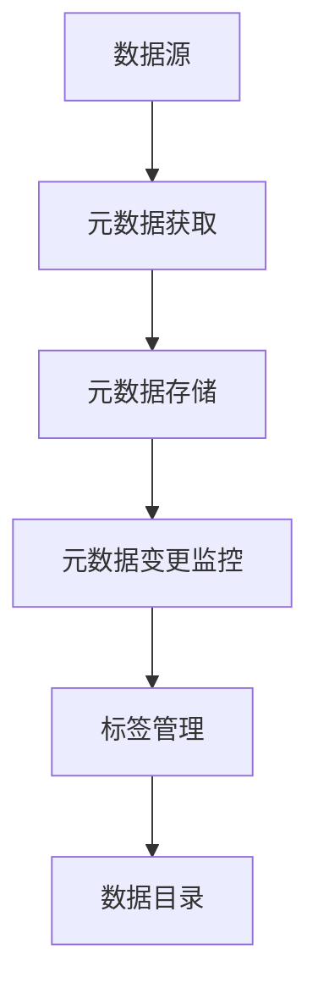
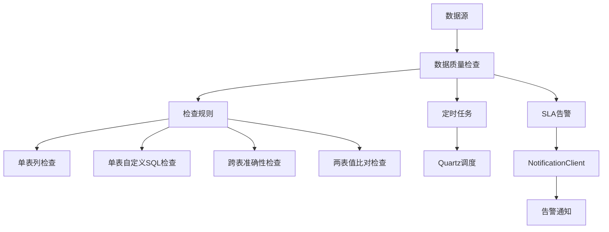
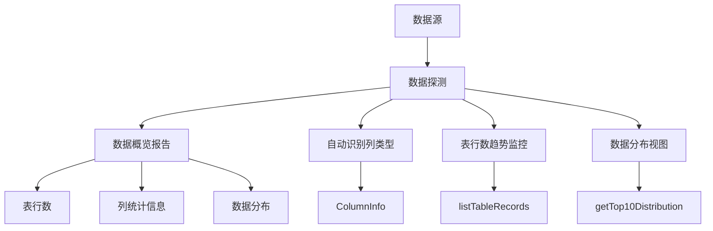
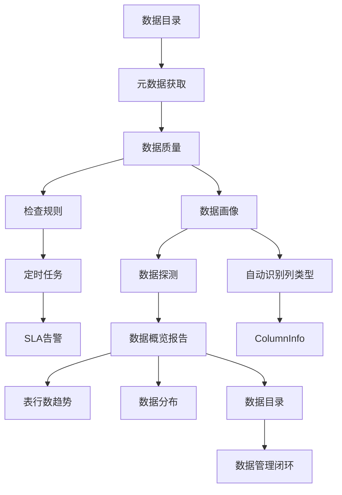
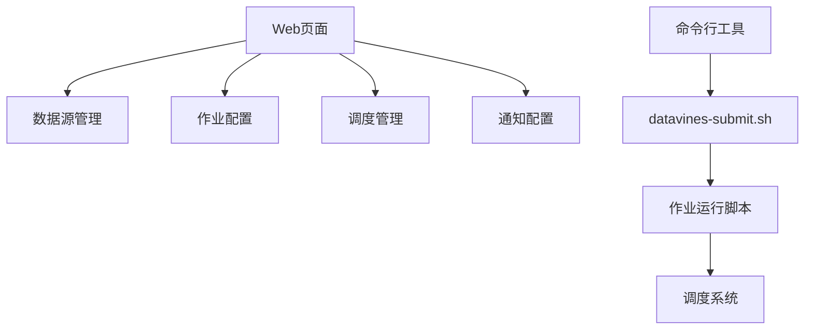
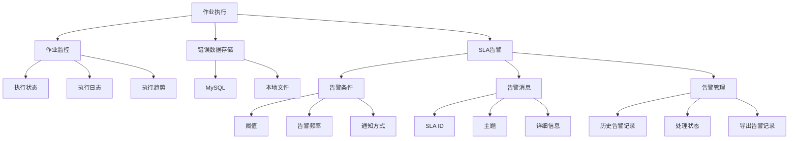

# 核心功能

<cite>
**本文档引用的文件**  
- [README.md](file://README.md)
- [README.zh-CN.md](file://README.zh-CN.md)
- [DataVinesServer.java](file://datavines-server/src/main/java/io/datavines/server/DataVinesServer.java)
- [CatalogController.java](file://datavines-server/src/main/java/io/datavines/server/api/controller/CatalogController.java)
- [CatalogTagController.java](file://datavines-server/src/main/java/io/datavines/server/api/controller/CatalogTagController.java)
- [CatalogMetaDataFetchTaskRunner.java](file://datavines-server/src/main/java/io/datavines/server/scheduler/metadata/CatalogMetaDataFetchTaskRunner.java)
- [DataQualityReportTaskRunner.java](file://datavines-server/src/main/java/io/datavines/server/scheduler/report/DataQualityReportTaskRunner.java)
- [JobRunner.java](file://datavines-runner/src/main/java/io/datavines/runner/JobRunner.java)
- [JobExecuteBootstrap.java](file://datavines-runner/src/main/java/io/datavines/runner/JobExecuteBootstrap.java)
- [MetricValidator.java](file://datavines-metric/datavines-metric-api/src/main/java/io/datavines/metric/api/MetricValidator.java)
- [MetricDimension.java](file://datavines-metric/datavines-metric-api/src/main/java/io/datavines/metric/api/MetricDimension.java)
- [CatalogEntityInstanceService.java](file://datavines-server/src/main/java/io/datavines/server/repository/service/CatalogEntityInstanceService.java)
- [JobExecutionService.java](file://datavines-server/src/main/java/io/datavines/server/repository/service/JobExecutionService.java)
- [NotificationClient.java](file://datavines-notification/datavines-notification-core/src/main/java/io/datavines/notification/core/client/NotificationClient.java)
- [SlaNotificationMessage.java](file://datavines-notification/datavines-notification-api/src/main/java/io/datavines/notification/api/entity/SlaNotificationMessage.java)
</cite>

## 目录
1. [简介](#简介)
2. [数据目录](#数据目录)
3. [数据质量](#数据质量)
4. [数据画像](#数据画像)
5. [功能协同与集成](#功能协同与集成)
6. [配置与管理](#配置与管理)
7. [监控与告警](#监控与告警)
8. [总结](#总结)

## 简介

DataVines 是一个开源的一站式数据可观测性平台，提供元数据管理、数据质量监控、数据画像等核心功能。该平台旨在帮助用户全面了解和掌握数据资产，确保数据的准确性、完整性和一致性。DataVines 支持多种数据源，包括 MySQL、PostgreSQL、ClickHouse、Doris、StarRocks、Presto、Trino 等，并通过插件化设计实现了高度可扩展性。

平台的核心功能包括数据目录、数据质量和数据画像三大模块。数据目录模块负责构建和维护数据资产的元数据信息，支持定时获取数据源元数据、监听元数据变更以及标签管理。数据质量模块提供丰富的数据质量检查规则，支持单表列检查、自定义 SQL 检查、跨表准确性检查和两表值比对检查等多种检查类型，并支持定时任务和 SLA 告警。数据画像模块则通过定时执行数据探测，生成数据概览报告，支持自动识别列类型并匹配相应的数据概况指标，同时提供表行数趋势监控和数据分布视图。

DataVines 采用去中心化设计，Server 节点支持水平扩展以提高性能，作业具备自动容错能力，确保作业不丢失且不重复执行。平台依赖较少，易于部署，最小仅依赖 MySQL 即可启动项目，完成数据质量作业的检查。此外，DataVines 还支持 Web 页面配置检查作业、运行作业、查看作业执行日志、查看错误数据和检查结果，以及在线生成作业运行脚本，通过 `datavines-submit.sh` 提交作业，可与调度系统配合使用。

**Section sources**
- [README.md](file://README.md)
- [README.zh-CN.md](file://README.zh-CN.md)

## 数据目录

数据目录是 DataVines 的核心功能之一，旨在构建和维护数据资产的元数据信息，帮助用户更好地理解和管理数据。该模块通过定时获取数据源的元数据来构建数据目录，并支持定时监听元数据变更情况，确保数据目录的实时性和准确性。此外，数据目录还支持标签管理，允许用户为元数据添加标签，以便于分类和检索。

### 业务价值与使用场景

数据目录的业务价值主要体现在以下几个方面：
- **数据资产管理**：通过集中管理数据源的元数据信息，帮助组织建立统一的数据资产视图，提升数据的可见性和可管理性。
- **数据发现与探索**：用户可以通过数据目录快速查找和了解所需的数据表及其字段信息，提高数据使用的效率。
- **数据治理**：支持元数据变更的监控，有助于及时发现和处理数据结构的变化，保障数据的一致性和完整性。
- **合规性支持**：通过标签管理，可以对敏感数据进行标记，便于实施数据安全策略，满足合规要求。

典型使用场景包括：
- **数据湖/数据仓库管理**：在大规模数据环境中，数据目录可以帮助管理员和分析师快速定位和理解数据资产。
- **数据迁移与整合**：在数据迁移或整合过程中，数据目录可以作为参考，确保数据结构的一致性。
- **数据共享与协作**：团队成员可以通过数据目录共享数据信息，促进跨部门的数据协作。

### 技术实现

数据目录的技术实现主要包括以下几个关键组件：
- **元数据获取**：通过 `CatalogMetaDataFetchTaskRunner` 类实现，该类实现了 `Runnable` 接口，负责执行元数据获取任务。具体逻辑在 `CatalogMetaDataFetchExecutorImpl` 中定义，通过 JDBC 连接数据源，执行元数据查询语句，获取表结构、字段信息等元数据。
- **元数据存储**：获取的元数据被存储在 DataVines 的数据库中，通常使用 MySQL 或 PostgreSQL 作为后端存储。元数据信息包括表名、字段名、数据类型、注释等。
- **元数据变更监控**：通过定时任务定期执行元数据获取任务，比较新旧元数据的差异，记录变更历史。变更信息可以用于触发告警或通知相关人员。
- **标签管理**：通过 `CatalogTagController` 类提供 REST API 接口，支持创建、更新和删除标签。标签可以应用于表、字段等元数据对象，帮助用户对数据进行分类和管理。

**Diagram sources**
- [CatalogMetaDataFetchTaskRunner.java](file://datavines-server/src/main/java/io/datavines/server/scheduler/metadata/CatalogMetaDataFetchTaskRunner.java)
- [CatalogTagController.java](file://datavines-server/src/main/java/io/datavines/server/api/controller/CatalogTagController.java)

**Section sources**
- [README.md](file://README.md)
- [README.zh-CN.md](file://README.zh-CN.md)
- [CatalogMetaDataFetchTaskRunner.java](file://datavines-server/src/main/java/io/datavines/server/scheduler/metadata/CatalogMetaDataFetchTaskRunner.java)
- [CatalogTagController.java](file://datavines-server/src/main/java/io/datavines/server/api/controller/CatalogTagController.java)

## 数据质量

数据质量是 DataVines 的核心功能之一，旨在确保数据在集成和处理过程中的准确性，是 DataOps 的核心组成部分。该模块提供了丰富的数据质量检查规则，支持多种检查类型，并可通过定时任务和 SLA 告警机制保障数据质量。

### 业务价值与使用场景

数据质量的业务价值主要体现在以下几个方面：
- **数据准确性**：通过内置的 27 个数据质量检查规则，确保数据的准确性和一致性，减少因数据错误导致的业务决策失误。
- **数据完整性**：支持单表列检查、自定义 SQL 检查、跨表准确性检查和两表值比对检查等多种检查类型，覆盖数据质量的多个维度。
- **自动化监控**：支持配置定时任务进行数据质量检查，减轻人工监控的负担，提高数据质量监控的效率。
- **告警与通知**：支持 SLA 用于检查结果告警，当数据质量不达标时，及时通知相关人员，确保问题得到及时处理。

典型使用场景包括：
- **数据仓库质量监控**：在数据仓库中，通过数据质量模块定期检查数据的准确性、完整性和一致性，确保数据仓库的数据质量。
- **ETL 流程验证**：在 ETL（Extract, Transform, Load）流程中，通过数据质量检查规则验证数据转换的正确性，确保数据在传输过程中的质量。
- **数据治理**：通过数据质量检查结果，识别数据质量问题，推动数据治理工作的开展，提升整体数据管理水平。

### 技术实现

数据质量的技术实现主要包括以下几个关键组件：
- **检查规则**：DataVines 内置了 27 个数据质量检查规则，包括空值检查、非空检查、枚举检查等。这些规则通过 `MetricValidator` 类实现，该类提供了判断数据质量任务结果是否失败的方法。
- **检查类型**：支持四种数据质量检查规则类型：
  - **单表列检查**：针对单个表的特定列进行检查，如空值检查、非空检查等。
  - **单表自定义 SQL 检查**：通过自定义 SQL 语句对单个表进行复杂的数据质量检查。
  - **跨表准确性检查**：检查多个表之间的数据一致性，如主键外键关系的完整性。
  - **两表值比对检查**：比较两个表中的数据值，确保数据的一致性。
- **定时任务**：通过 Quartz 调度框架实现定时任务，定期执行数据质量检查。`DataQualityScheduleJob` 类负责调度数据质量检查任务。
- **SLA 告警**：当数据质量检查结果不满足 SLA 要求时，通过 `NotificationClient` 发送告警通知。`SlaNotificationMessage` 类定义了告警消息的结构，包括 SLA ID、主题和消息内容。

**Diagram sources**
- [MetricValidator.java](file://datavines-metric/datavines-metric-api/src/main/java/io/datavines/metric/api/MetricValidator.java)
- [DataQualityScheduleJob.java](file://datavines-server/src/main/java/io/datavines/server/dqc/coordinator/quartz/DataQualityScheduleJob.java)
- [NotificationClient.java](file://datavines-notification/datavines-notification-core/src/main/java/io/datavines/notification/core/client/NotificationClient.java)

**Section sources**
- [README.md](file://README.md)
- [README.zh-CN.md](file://README.zh-CN.md)
- [MetricValidator.java](file://datavines-metric/datavines-metric-api/src/main/java/io/datavines/metric/api/MetricValidator.java)
- [DataQualityScheduleJob.java](file://datavines-server/src/main/java/io/datavines/server/dqc/coordinator/quartz/DataQualityScheduleJob.java)
- [NotificationClient.java](file://datavines-notification/datavines-notification-core/src/main/java/io/datavines/notification/core/client/NotificationClient.java)

## 数据画像

数据画像是 DataVines 的核心功能之一，旨在通过定时执行数据探测，生成数据概览报告，帮助用户全面了解数据的分布和趋势。该模块支持自动识别列类型并匹配相应的数据概况指标，同时提供表行数趋势监控和数据分布视图。

### 业务价值与使用场景

数据画像的业务价值主要体现在以下几个方面：
- **数据洞察**：通过生成数据概览报告，帮助用户快速了解数据的整体情况，包括数据量、数据分布、数据趋势等。
- **数据质量评估**：通过数据分布视图，识别数据中的异常值和离群点，评估数据质量。
- **数据治理**：通过表行数趋势监控，及时发现数据量的异常变化，支持数据治理工作的开展。
- **数据探索**：支持自动识别列类型并匹配相应的数据概况指标，帮助用户快速了解数据的特征，促进数据探索和分析。

典型使用场景包括：
- **数据仓库监控**：在数据仓库中，通过数据画像模块定期生成数据概览报告，监控数据量和数据分布的变化，确保数据仓库的健康状态。
- **数据质量审计**：通过数据分布视图，识别数据中的异常值和离群点，进行数据质量审计，确保数据的准确性和一致性。
- **数据探索与分析**：在数据分析过程中，通过数据画像模块快速了解数据的特征，支持数据探索和分析工作。

### 技术实现

数据画像的技术实现主要包括以下几个关键组件：
- **数据探测**：通过 `CatalogEntityInstanceService` 类提供的 `executeDataProfileJob` 方法，执行数据探测任务。该方法接收 `RunProfileRequest` 参数，包含数据源、表名、列名等信息，启动数据探测作业。
- **数据概览报告**：数据探测任务完成后，生成数据概览报告。报告内容包括表行数、列的统计信息（如最大值、最小值、平均值、标准差等）、数据分布等。
- **自动识别列类型**：通过 `ColumnInfo` 类解析列的元数据信息，自动识别列的数据类型（如数值型、字符串型、日期时间型等），并匹配相应的数据概况指标。
- **表行数趋势监控**：通过 `listTableRecords` 方法，获取指定时间段内的表行数变化趋势，生成趋势图。
- **数据分布视图**：通过 `getTop10Distribution` 方法，获取列的数据分布情况，生成分布图。

**Diagram sources**
- [CatalogEntityInstanceService.java](file://datavines-server/src/main/java/io/datavines/server/repository/service/CatalogEntityInstanceService.java)
- [ColumnInfo.java](file://datavines-metric/datavines-metric-api/src/main/java/io/datavines/metric/api/ColumnInfo.java)

**Section sources**
- [README.md](file://README.md)
- [README.zh-CN.md](file://README.zh-CN.md)
- [CatalogEntityInstanceService.java](file://datavines-server/src/main/java/io/datavines/server/repository/service/CatalogEntityInstanceService.java)
- [ColumnInfo.java](file://datavines-metric/datavines-metric-api/src/main/java/io/datavines/metric/api/ColumnInfo.java)

## 功能协同与集成

DataVines 的三大核心功能——数据目录、数据质量和数据画像——之间存在紧密的协同关系，共同构成了一个完整的数据可观测性平台。这些功能不仅各自独立发挥作用，还能相互配合，形成一个闭环的数据管理流程。

### 数据目录与数据质量的协同

数据目录为数据质量提供了基础的元数据信息。在配置数据质量检查规则时，用户可以从数据目录中选择需要检查的表和字段，确保检查规则的准确性和针对性。例如，在进行单表列检查时，用户可以通过数据目录查看表的结构和字段信息，选择合适的检查规则。此外，数据目录中的元数据变更监控功能可以及时发现表结构的变化，触发数据质量检查任务的重新配置，确保数据质量检查的持续有效性。

### 数据质量与数据画像的协同

数据质量检查结果可以作为数据画像的一部分，丰富数据概览报告的内容。例如，在生成数据概览报告时，可以将数据质量检查的结果（如空值率、非空率、枚举值分布等）纳入报告中，帮助用户全面了解数据的质量状况。此外，数据画像中的数据分布视图可以辅助数据质量检查，通过可视化的方式识别数据中的异常值和离群点，进一步验证数据质量检查的结果。

### 数据画像与数据目录的协同

数据画像生成的数据概览报告可以补充数据目录中的元数据信息，提供更丰富的数据洞察。例如，在数据目录中，除了基本的表结构和字段信息外，还可以展示表的行数趋势、列的统计信息和数据分布等。这些信息有助于用户更全面地了解数据的特征和变化趋势，支持数据治理和数据探索工作。

### 集成示例

假设某企业使用 DataVines 管理其数据仓库。首先，通过数据目录模块定时获取数据源的元数据信息，构建数据目录。然后，基于数据目录中的元数据信息，配置数据质量检查规则，定期执行数据质量检查任务。检查结果通过 SLA 告警机制通知相关人员。同时，通过数据画像模块定期生成数据概览报告，监控数据量和数据分布的变化。当发现数据量异常增加或数据分布出现离群点时，可以触发数据质量检查任务，进一步验证数据的准确性。最终，所有这些信息都被整合到数据目录中，形成一个完整的数据管理闭环。

**Diagram sources**
- [CatalogEntityInstanceService.java](file://datavines-server/src/main/java/io/datavines/server/repository/service/CatalogEntityInstanceService.java)
- [MetricValidator.java](file://datavines-metric/datavines-metric-api/src/main/java/io/datavines/metric/api/MetricValidator.java)
- [NotificationClient.java](file://datavines-notification/datavines-notification-core/src/main/java/io/datavines/notification/core/client/NotificationClient.java)

**Section sources**
- [README.md](file://README.md)
- [README.zh-CN.md](file://README.zh-CN.md)
- [CatalogEntityInstanceService.java](file://datavines-server/src/main/java/io/datavines/server/repository/service/CatalogEntityInstanceService.java)
- [MetricValidator.java](file://datavines-metric/datavines-metric-api/src/main/java/io/datavines/metric/api/MetricValidator.java)
- [NotificationClient.java](file://datavines-notification/datavines-notification-core/src/main/java/io/datavines/notification/core/client/NotificationClient.java)

## 配置与管理

DataVines 提供了丰富的配置和管理功能，支持用户通过 Web 页面或命令行工具进行配置和管理。这些功能涵盖了数据源管理、作业配置、调度管理、通知配置等多个方面，确保用户能够灵活地管理和使用平台。

### 数据源管理

数据源管理是 DataVines 的基础功能之一，支持用户添加、编辑和删除数据源。用户可以通过 Web 页面配置数据源的连接信息，包括数据库类型、主机地址、端口、用户名、密码等。平台支持多种数据源，包括 MySQL、PostgreSQL、ClickHouse、Doris、StarRocks、Presto、Trino 等。添加数据源后，平台会自动获取其元数据信息，构建数据目录。

### 作业配置

作业配置功能支持用户创建和管理数据质量检查作业和数据画像作业。用户可以通过 Web 页面选择数据源、表和字段，配置检查规则或数据探测参数。对于数据质量检查作业，用户可以选择检查类型（如单表列检查、单表自定义 SQL 检查等），设置检查频率和 SLA 告警条件。对于数据画像作业，用户可以配置数据探测的频率和范围，选择需要生成的报告内容。

### 调度管理

调度管理功能支持用户配置定时任务，定期执行数据质量检查和数据画像作业。平台使用 Quartz 调度框架实现定时任务，用户可以通过 Web 页面设置任务的执行频率（如每小时、每天、每周等）。调度任务可以与外部调度系统（如 Airflow、Cron）集成，实现更复杂的调度需求。

### 通知配置

通知配置功能支持用户配置告警通知，当数据质量检查结果不满足 SLA 要求时，通过邮件等方式通知相关人员。用户可以通过 Web 页面配置通知方式（如邮件、钉钉、企业微信等），设置通知接收人和通知内容。平台支持多种通知通道，包括邮件、钉钉、飞书、企业微信等。

### 管理工具

除了 Web 页面，DataVines 还提供了命令行工具 `datavines-submit.sh`，支持用户在线生成作业运行脚本，通过命令行提交作业。这种方式适用于与调度系统集成的场景，用户可以将生成的脚本提交到调度系统中，实现自动化作业调度。

**Diagram sources**
- [DataSourceController.java](file://datavines-server/src/main/java/io/datavines/server/api/controller/DataSourceController.java)
- [JobController.java](file://datavines-server/src/main/java/io/datavines/server/api/controller/JobController.java)
- [JobScheduleController.java](file://datavines-server/src/main/java/io/datavines/server/api/controller/JobScheduleController.java)
- [SlaController.java](file://datavines-server/src/main/java/io/datavines/server/api/controller/SlaController.java)
- [datavines-submit.sh](file://bin/datavines-submit.sh)

**Section sources**
- [README.md](file://README.md)
- [README.zh-CN.md](file://README.zh-CN.md)
- [DataSourceController.java](file://datavines-server/src/main/java/io/datavines/server/api/controller/DataSourceController.java)
- [JobController.java](file://datavines-server/src/main/java/io/datavines/server/api/controller/JobController.java)
- [JobScheduleController.java](file://datavines-server/src/main/java/io/datavines/server/api/controller/JobScheduleController.java)
- [SlaController.java](file://datavines-server/src/main/java/io/datavines/server/api/controller/SlaController.java)
- [datavines-submit.sh](file://bin/datavines-submit.sh)

## 监控与告警

监控与告警是 DataVines 的重要功能之一，旨在确保数据质量检查和数据画像作业的正常运行，并在出现问题时及时通知相关人员。平台提供了全面的监控和告警机制，支持用户通过 Web 页面查看作业执行日志、错误数据和检查结果，并配置 SLA 告警。

### 作业监控

作业监控功能支持用户查看作业的执行状态和日志。用户可以通过 Web 页面查看作业的执行历史，包括作业的开始时间、结束时间、执行状态（成功、失败、运行中等）和执行日志。对于失败的作业，用户可以查看详细的错误信息，定位问题原因。此外，平台还支持查看作业的执行趋势，帮助用户了解作业的执行情况。

### 错误数据存储

当数据质量检查发现错误数据时，平台支持将错误数据存储到指定的位置，便于后续分析和处理。用户可以配置错误数据的存储方式，包括 MySQL 和本地文件。对于使用 Local 执行引擎的作业，错误数据可以存储在本地文件中；对于使用 Spark 执行引擎的作业，错误数据可以存储在 MySQL 中。

### SLA 告警

SLA 告警功能支持用户配置数据质量检查的 SLA 条件，当检查结果不满足 SLA 要求时，通过邮件等方式通知相关人员。用户可以通过 Web 页面设置 SLA 条件，包括检查结果的阈值、告警频率和通知方式。平台支持多种通知通道，包括邮件、钉钉、飞书、企业微信等。告警消息包含 SLA ID、主题和详细信息，帮助用户快速了解问题的严重程度和影响范围。

### 告警管理

告警管理功能支持用户查看和管理告警记录。用户可以通过 Web 页面查看历史告警记录，包括告警时间、告警类型、告警内容和处理状态。对于已处理的告警，用户可以标记为已解决；对于未处理的告警，用户可以分配给相关人员进行处理。此外，平台还支持导出告警记录，便于后续分析和报告。

**Diagram sources**
- [JobExecutionController.java](file://datavines-server/src/main/java/io/datavines/server/api/controller/JobExecutionController.java)
- [ErrorDataStorageController.java](file://datavines-server/src/main/java/io/datavines/server/api/controller/ErrorDataStorageController.java)
- [SlaController.java](file://datavines-server/src/main/java/io/datavines/server/api/controller/SlaController.java)
- [LogController.java](file://datavines-server/src/main/java/io/datavines/server/api/controller/LogController.java)

**Section sources**
- [README.md](file://README.md)
- [README.zh-CN.md](file://README.zh-CN.md)
- [JobExecutionController.java](file://datavines-server/src/main/java/io/datavines/server/api/controller/JobExecutionController.java)
- [ErrorDataStorageController.java](file://datavines-server/src/main/java/io/datavines/server/api/controller/ErrorDataStorageController.java)
- [SlaController.java](file://datavines-server/src/main/java/io/datavines/server/api/controller/SlaController.java)
- [LogController.java](file://datavines-server/src/main/java/io/datavines/server/api/controller/LogController.java)

## 总结

DataVines 是一个功能强大且易于使用的开源数据可观测性平台，提供了数据目录、数据质量和数据画像三大核心功能。这些功能不仅各自独立发挥作用，还能相互协同，形成一个完整的数据管理闭环。通过数据目录，用户可以构建和维护数据资产的元数据信息，提升数据的可见性和可管理性。通过数据质量，用户可以确保数据的准确性、完整性和一致性，减少因数据错误导致的业务决策失误。通过数据画像，用户可以全面了解数据的分布和趋势，支持数据治理和数据探索工作。

DataVines 采用去中心化设计，Server 节点支持水平扩展以提高性能，作业具备自动容错能力，确保作业不丢失且不重复执行。平台依赖较少，易于部署，最小仅依赖 MySQL 即可启动项目，完成数据质量作业的检查。此外，DataVines 还支持 Web 页面配置检查作业、运行作业、查看作业执行日志、查看错误数据和检查结果，以及在线生成作业运行脚本，通过 `datavines-submit.sh` 提交作业，可与调度系统配合使用。

总之，DataVines 为用户提供了一个全面的数据可观测性解决方案，帮助用户更好地理解和管理数据资产，确保数据的高质量和高可用性。