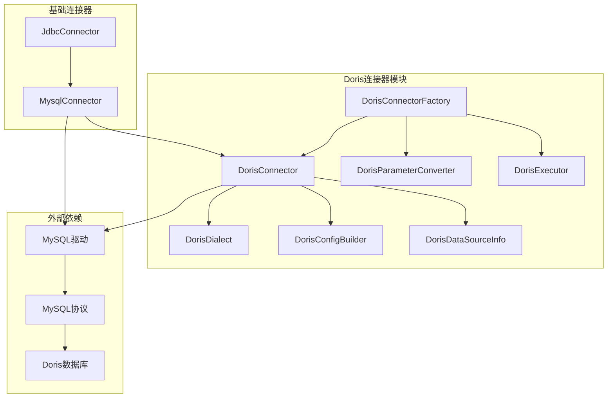
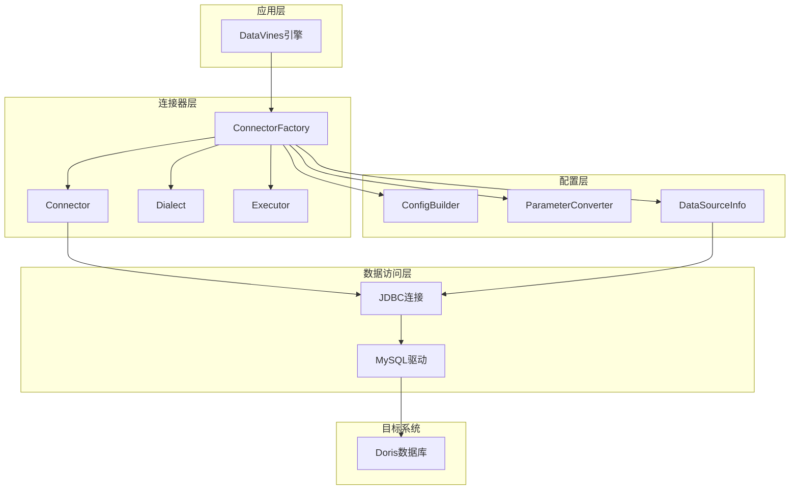
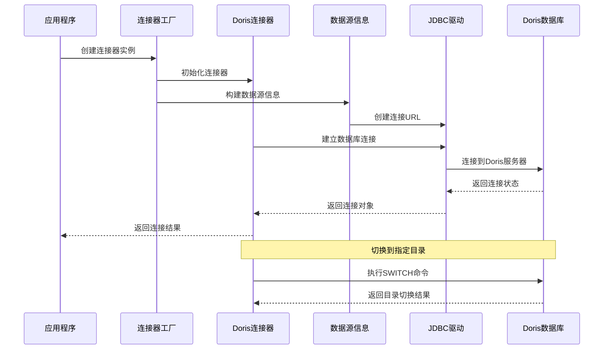
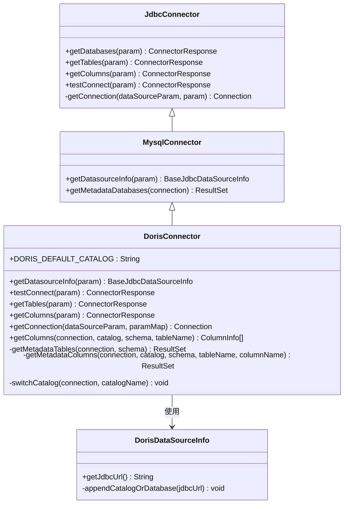
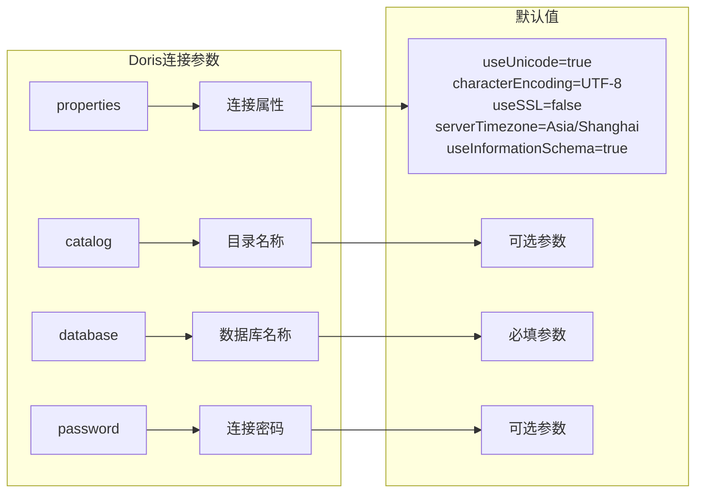
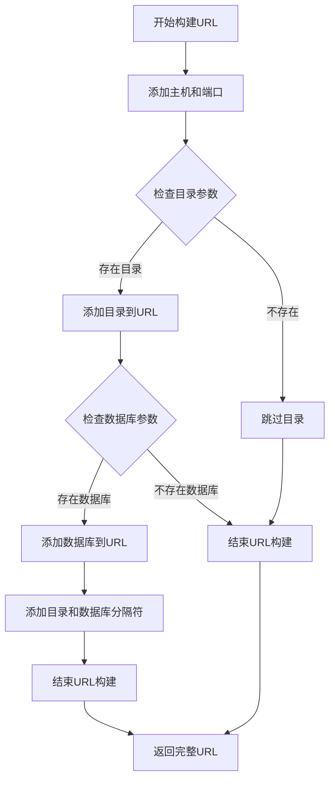
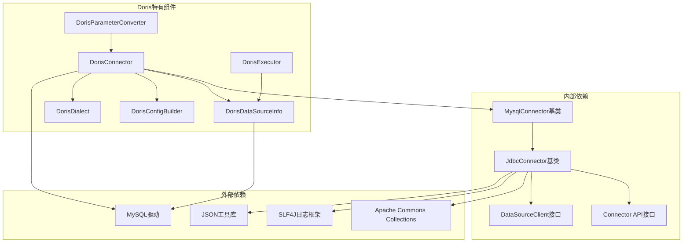
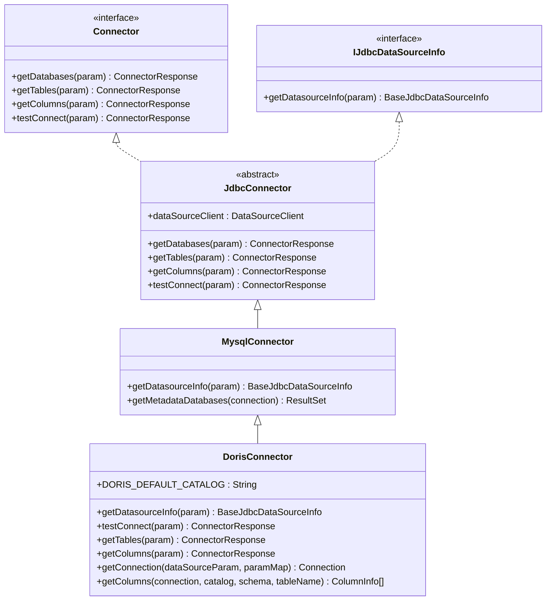
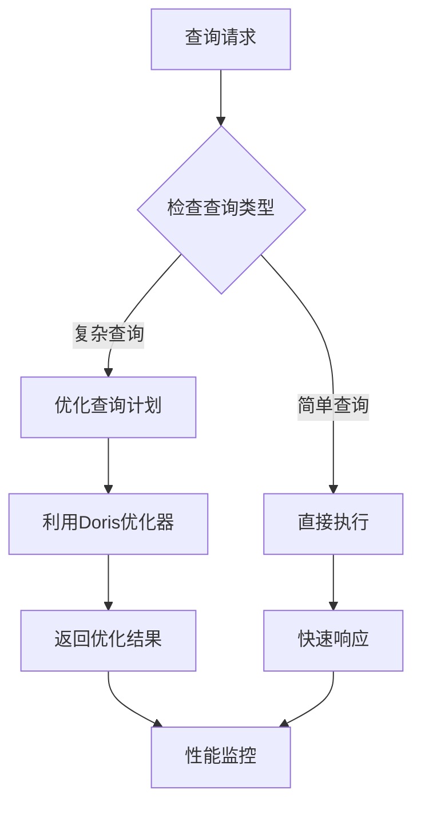

# Doris连接器

<cite>
**本文档引用的文件**
- [DorisConnector.java](file://datavines-connector/datavines-connector-plugins/datavines-connector-doris/src/main/java/io/datavines/connector/plugin/DorisConnector.java)
- [DorisDialect.java](file://datavines-connector/datavines-connector-plugins/datavines-connector-doris/src/main/java/io/datavines/connector/plugin/DorisDialect.java)
- [DorisConfigBuilder.java](file://datavines-connector/datavines-connector-plugins/datavines-connector-doris/src/main/java/io/datavines/connector/plugin/DorisConfigBuilder.java)
- [DorisDataSourceInfo.java](file://datavines-connector/datavines-connector-plugins/datavines-connector-doris/src/main/java/io/datavines/connector/plugin/DorisDataSourceInfo.java)
- [DorisConnectorFactory.java](file://datavines-connector/datavines-connector-plugins/datavines-connector-doris/src/main/java/io/datavines/connector/plugin/DorisConnectorFactory.java)
- [DorisParameterConverter.java](file://datavines-connector/datavines-connector-plugins/datavines-connector-doris/src/main/java/io/datavines/connector/plugin/DorisParameterConverter.java)
- [DorisExecutor.java](file://datavines-connector/datavines-connector-plugins/datavines-connector-doris/src/main/java/io/datavines/connector/plugin/DorisExecutor.java)
- [pom.xml](file://datavines-connector/datavines-connector-plugins/datavines-connector-doris/pom.xml)
- [MysqlConnector.java](file://datavines-connector/datavines-connector-plugins/datavines-connector-mysql/src/main/java/io/datavines/connector/plugin/MysqlConnector.java)
- [JdbcConnector.java](file://datavines-connector/datavines-connector-plugins/datavines-connector-jdbc/src/main/java/io/datavines/connector/plugin/JdbcConnector.java)
</cite>

## 目录
1. [简介](#简介)
2. [项目结构](#项目结构)
3. [核心组件](#核心组件)
4. [架构概览](#架构概览)
5. [详细组件分析](#详细组件分析)
6. [依赖关系分析](#依赖关系分析)
7. [性能考虑](#性能考虑)
8. [故障排除指南](#故障排除指南)
9. [结论](#结论)

## 简介

Doris连接器是DataVines项目中的一个专用连接器，用于与Apache Doris数据库进行交互。Doris是一个现代化的MPP（大规模并行处理）分析型数据库，支持实时数据导入、高并发查询和灵活的数据模型。

该连接器基于MySQL协议实现，通过继承MySQL连接器的功能，专门为Doris数据库提供了特定的适配和优化。它实现了DataVines连接器API的所有核心功能，包括数据库发现、表结构获取、列信息检索以及连接测试等。

## 项目结构

Doris连接器位于DataVines项目的插件架构中，采用模块化设计，与其他连接器保持一致的结构模式：



**图表来源**
- [DorisConnector.java](file://datavines-connector/datavines-connector-plugins/datavines-connector-doris/src/main/java/io/datavines/connector/plugin/DorisConnector.java#L40-L51)
- [DorisConnectorFactory.java](file://datavines-connector/datavines-connector-plugins/datavines-connector-doris/src/main/java/io/datavines/connector/plugin/DorisConnectorFactory.java#L21-L47)

**章节来源**
- [DorisConnector.java](file://datavines-connector/datavines-connector-plugins/datavines-connector-doris/src/main/java/io/datavines/connector/plugin/DorisConnector.java#L1-L251)
- [pom.xml](file://datavines-connector/datavines-connector-plugins/datavines-connector-doris/pom.xml#L1-L41)

## 核心组件

Doris连接器由以下核心组件构成：

### 主要连接器类
- **DorisConnector**: 主要的连接器实现，继承自MySQL连接器
- **DorisDialect**: 语法方言适配器，定义Doris特有的SQL语法支持
- **DorisDataSourceInfo**: 数据源信息管理，负责构建Doris连接URL

### 工厂和配置类
- **DorisConnectorFactory**: 连接器工厂，创建各种相关组件实例
- **DorisConfigBuilder**: 配置参数构建器，定义用户界面参数
- **DorisParameterConverter**: 参数转换器，处理连接参数格式化

### 执行器类
- **DorisExecutor**: 执行器实现，负责SQL语句执行和结果处理

**章节来源**
- [DorisConnectorFactory.java](file://datavines-connector/datavines-connector-plugins/datavines-connector-doris/src/main/java/io/datavines/connector/plugin/DorisConnectorFactory.java#L21-L47)
- [DorisConfigBuilder.java](file://datavines-connector/datavines-connector-plugins/datavines-connector-doris/src/main/java/io/datavines/connector/plugin/DorisConfigBuilder.java#L25-L59)

## 架构概览

Doris连接器采用分层架构设计，基于DataVines的插件系统：



**图表来源**
- [DorisConnectorFactory.java](file://datavines-connector/datavines-connector-plugins/datavines-connector-doris/src/main/java/io/datavines/connector/plugin/DorisConnectorFactory.java#L21-L47)
- [JdbcConnector.java](file://datavines-connector/datavines-connector-plugins/datavines-connector-jdbc/src/main/java/io/datavines/connector/plugin/JdbcConnector.java#L42-L64)

### 连接流程序列图



**图表来源**
- [DorisConnector.java](file://datavines-connector/datavines-connector-plugins/datavines-connector-doris/src/main/java/io/datavines/connector/plugin/DorisConnector.java#L72-L85)
- [DorisDataSourceInfo.java](file://datavines-connector/datavines-connector-plugins/datavines-connector-doris/src/main/java/io/datavines/connector/plugin/DorisDataSourceInfo.java#L29-L36)

## 详细组件分析

### DorisConnector类分析

DorisConnector是整个连接器的核心实现，继承自MysqlConnector，主要扩展了以下功能：

#### 核心方法实现



**图表来源**
- [DorisConnector.java](file://datavines-connector/datavines-connector-plugins/datavines-connector-doris/src/main/java/io/datavines/connector/plugin/DorisConnector.java#L40-L51)
- [DorisDataSourceInfo.java](file://datavines-connector/datavines-connector-plugins/datavines-connector-doris/src/main/java/io/datavines/connector/plugin/DorisDataSourceInfo.java#L23-L36)

#### 目录切换机制

Doris连接器实现了独特的目录切换功能，这是其与标准MySQL连接器的主要区别：

```mermaid
flowchart TD
A[建立数据库连接] --> B{检查目录参数}
B --> |存在目录参数| C[使用指定目录]
B --> |不存在目录参数| D[使用默认目录]
C --> E[执行SWITCH目录命令]
D --> E
E --> F[验证目录切换结果]
F --> |成功| G[返回连接对象]
F --> |失败| H[抛出SQL异常]
H --> I[关闭连接并返回错误]
G --> J[连接建立完成]
```

**图表来源**
- [DorisConnector.java](file://datavines-connector/datavines-connector-plugins/datavines-connector-doris/src/main/java/io/datavines/connector/plugin/DorisConnector.java#L206-L249)

#### 表和列信息获取

Doris连接器通过重写元数据查询方法来适配Doris的特殊需求：

**章节来源**
- [DorisConnector.java](file://datavines-connector/datavines-connector-plugins/datavines-connector-doris/src/main/java/io/datavines/connector/plugin/DorisConnector.java#L87-L131)
- [DorisConnector.java](file://datavines-connector/datavines-connector-plugins/datavines-connector-doris/src/main/java/io/datavines/connector/plugin/DorisConnector.java#L133-L167)

### DorisDialect类分析

DorisDialect继承自MysqlDialect，主要修改了错误数据存储的支持性：

#### 语法方言特性

| 特性 | 支持状态 | 说明 |
|------|----------|------|
| 错误数据存储 | 不支持 | Doris不支持将错误数据存储到单独的表中 |
| SQL语法兼容性 | 高度兼容 | 基于MySQL协议，语法高度相似 |
| 并行查询支持 | 完全支持 | 利用Doris的MPP架构优势 |
| 实时数据导入 | 完全支持 | 支持Stream Load等实时导入功能 |

**章节来源**
- [DorisDialect.java](file://datavines-connector/datavines-connector-plugins/datavines-connector-doris/src/main/java/io/datavines/connector/plugin/DorisDialect.java#L19-L24)

### DorisConfigBuilder类分析

DorisConfigBuilder负责定义用户界面的配置参数：

#### 配置参数定义



**图表来源**
- [DorisConfigBuilder.java](file://datavines-connector/datavines-connector-plugins/datavines-connector-doris/src/main/java/io/datavines/connector/plugin/DorisConfigBuilder.java#L28-L42)

**章节来源**
- [DorisConfigBuilder.java](file://datavines-connector/datavines-connector-plugins/datavines-connector-doris/src/main/java/io/datavines/connector/plugin/DorisConfigBuilder.java#L25-L59)

### DorisDataSourceInfo类分析

DorisDataSourceInfo负责构建Doris数据库的连接URL：

#### URL构建逻辑

Doris连接URL的构建遵循特殊的格式规则：



**图表来源**
- [DorisDataSourceInfo.java](file://datavines-connector/datavines-connector-plugins/datavines-connector-doris/src/main/java/io/datavines/connector/plugin/DorisDataSourceInfo.java#L38-L60)

**章节来源**
- [DorisDataSourceInfo.java](file://datavines-connector/datavines-connector-plugins/datavines-connector-doris/src/main/java/io/datavines/connector/plugin/DorisDataSourceInfo.java#L23-L61)

## 依赖关系分析

Doris连接器的依赖关系体现了清晰的层次结构：



**图表来源**
- [pom.xml](file://datavines-connector/datavines-connector-plugins/datavines-connector-doris/pom.xml#L32-L37)
- [DorisConnector.java](file://datavines-connector/datavines-connector-plugins/datavines-connector-doris/src/main/java/io/datavines/connector/plugin/DorisConnector.java#L19-L36)

### 继承关系图



**图表来源**
- [JdbcConnector.java](file://datavines-connector/datavines-connector-plugins/datavines-connector-jdbc/src/main/java/io/datavines/connector/plugin/JdbcConnector.java#L42-L64)
- [MysqlConnector.java](file://datavines-connector/datavines-connector-plugins/datavines-connector-mysql/src/main/java/io/datavines/connector/plugin/MysqlConnector.java#L28-L45)
- [DorisConnector.java](file://datavines-connector/datavines-connector-plugins/datavines-connector-doris/src/main/java/io/datavines/connector/plugin/DorisConnector.java#L40-L51)

**章节来源**
- [pom.xml](file://datavines-connector/datavines-connector-plugins/datavines-connector-doris/pom.xml#L32-L37)
- [DorisConnectorFactory.java](file://datavines-connector/datavines-connector-plugins/datavines-connector-doris/src/main/java/io/datavines/connector/plugin/DorisConnectorFactory.java#L21-L47)

## 性能考虑

### 连接池优化

Doris连接器在性能方面具有以下特点：

1. **连接复用**: 通过继承JdbcConnector，自动获得连接池管理能力
2. **元数据缓存**: 复用MySQL连接器的元数据查询优化
3. **批量操作**: 支持大数据量的批量数据导入和查询

### 查询优化策略



### 内存管理

- **流式处理**: 对大结果集采用流式处理，避免内存溢出
- **连接生命周期管理**: 自动管理连接的创建和销毁
- **资源清理**: 确保所有数据库资源正确释放

## 故障排除指南

### 常见连接问题

| 问题类型 | 可能原因 | 解决方案 |
|----------|----------|----------|
| 连接超时 | 网络延迟或防火墙阻断 | 检查网络连通性和端口开放情况 |
| 认证失败 | 用户名或密码错误 | 验证Doris用户的认证信息 |
| 目录切换失败 | 目录不存在或权限不足 | 确认目录名称正确且有访问权限 |
| 元数据查询失败 | MySQL驱动版本不兼容 | 更新到兼容的MySQL驱动版本 |

### 调试建议

1. **启用详细日志**: 在application.yaml中设置连接器日志级别
2. **检查连接参数**: 验证所有必需参数的正确性
3. **测试基础连接**: 使用testConnect方法验证基本连通性
4. **监控资源使用**: 关注连接数和内存使用情况

**章节来源**
- [DorisConnector.java](file://datavines-connector/datavines-connector-plugins/datavines-connector-doris/src/main/java/io/datavines/connector/plugin/DorisConnector.java#L54-L70)
- [DorisConnector.java](file://datavines-connector/datavines-connector-plugins/datavines-connector-doris/src/main/java/io/datavines/connector/plugin/DorisConnector.java#L206-L249)

## 结论

Doris连接器作为DataVines生态系统的重要组成部分，成功地将Apache Doris数据库集成到统一的数据质量平台中。通过继承MySQL连接器的设计模式，Doris连接器不仅保持了与现有系统的兼容性，还针对Doris的特性进行了专门的优化。

### 主要优势

1. **无缝集成**: 基于MySQL协议，实现零代码改造的Doris支持
2. **功能完整**: 提供完整的数据库发现、表结构获取和元数据管理功能
3. **性能优化**: 利用Doris的MPP架构优势，提供高效的查询性能
4. **易于维护**: 清晰的代码结构和完善的测试覆盖

### 技术特色

- **目录切换机制**: 独特的目录管理功能，满足Doris的多租户需求
- **参数化配置**: 灵活的配置选项，适应不同的部署环境
- **错误处理**: 完善的异常处理和错误恢复机制
- **资源管理**: 有效的连接管理和资源清理策略

Doris连接器为DataVines用户提供了稳定可靠的Doris数据库连接能力，是构建企业级数据质量解决方案的重要基础设施。