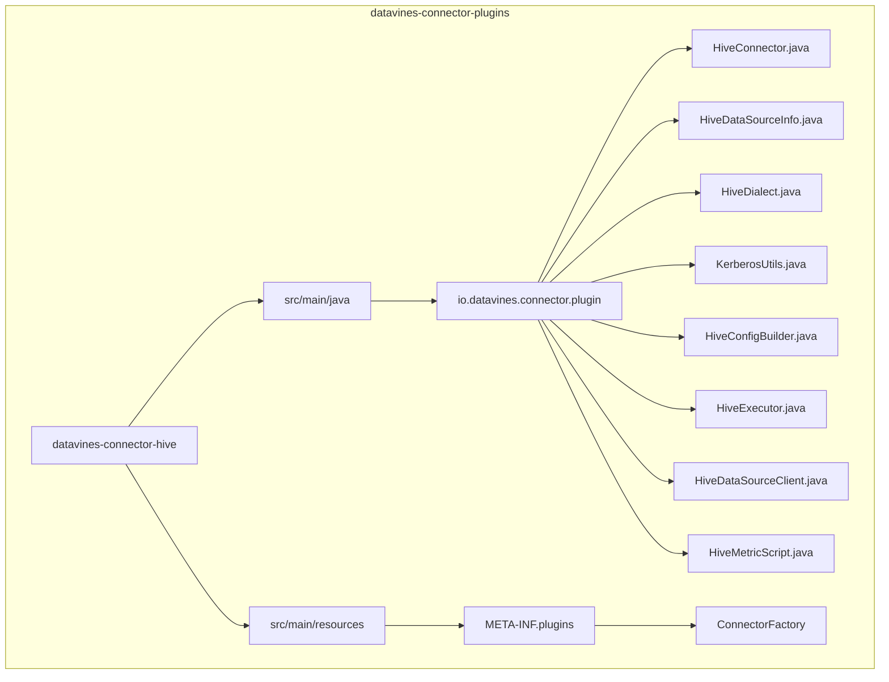
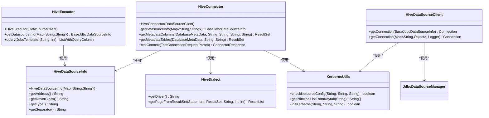
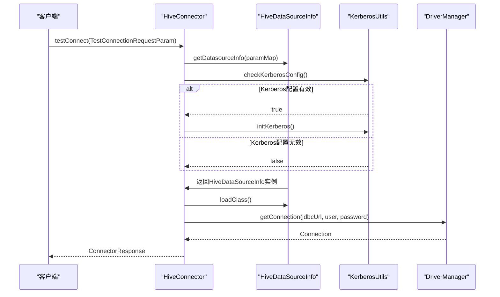
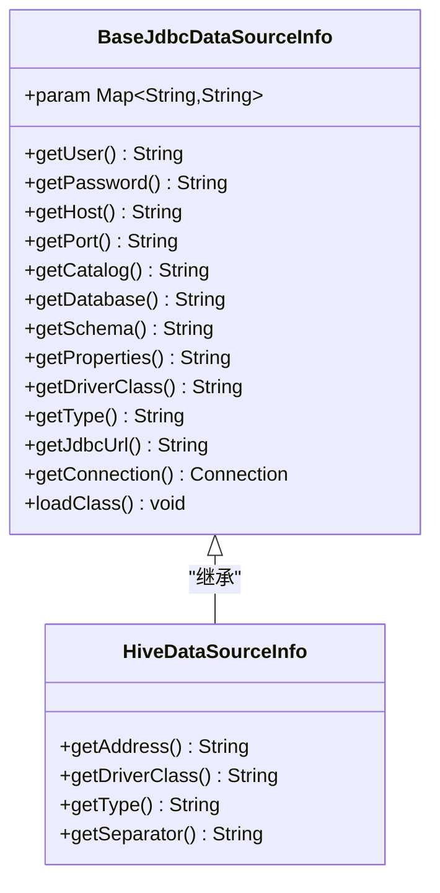
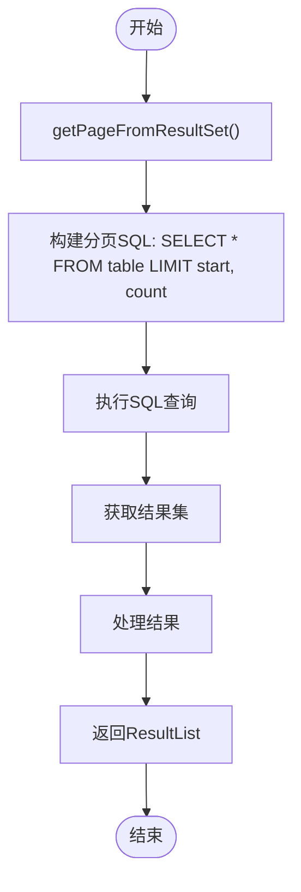
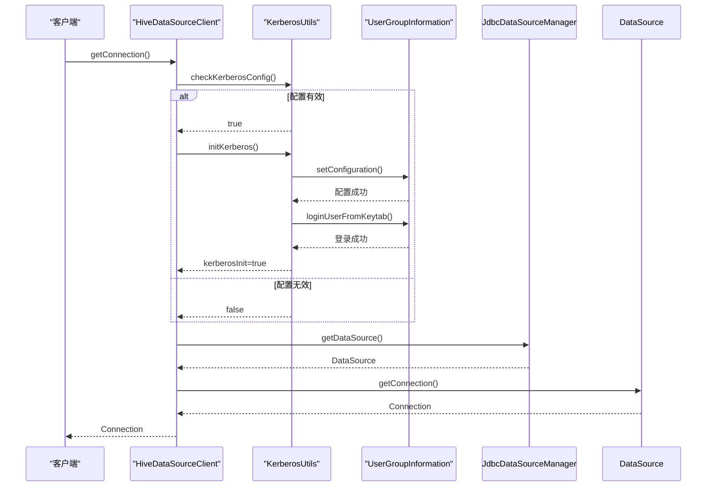
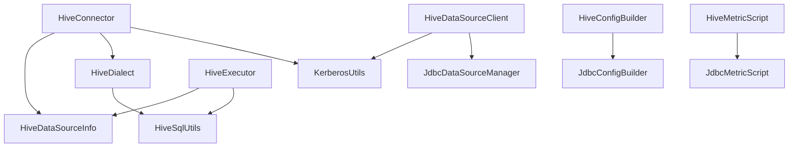

# Hive连接器

<cite>
**本文档引用的文件**
- [HiveConnector.java](file://datavines-connector\datavines-connector-plugins\datavines-connector-hive\src\main\java\io\datavines\connector\plugin\HiveConnector.java)
- [HiveDataSourceInfo.java](file://datavines-connector\datavines-connector-plugins\datavines-connector-hive\src\main\java\io\datavines\connector\plugin\HiveDataSourceInfo.java)
- [HiveDialect.java](file://datavines-connector\datavines-connector-plugins\datavines-connector-hive\src\main\java\io\datavines\connector\plugin\HiveDialect.java)
- [KerberosUtils.java](file://datavines-connector\datavines-connector-plugins\datavines-connector-hive\src\main\java\io\datavines\connector\plugin\KerberosUtils.java)
- [HiveConfigBuilder.java](file://datavines-connector\datavines-connector-plugins\datavines-connector-hive\src\main\java\io\datavines\connector\plugin\HiveConfigBuilder.java)
- [HiveExecutor.java](file://datavines-connector\datavines-connector-plugins\datavines-connector-hive\src\main\java\io\datavines\connector\plugin\HiveExecutor.java)
- [HiveDataSourceClient.java](file://datavines-connector\datavines-connector-plugins\datavines-connector-hive\src\main\java\io\datavines\connector\plugin\HiveDataSourceClient.java)
- [HiveMetricScript.java](file://datavines-connector\datavines-connector-plugins\datavines-connector-hive\src\main\java\io\datavines\connector\plugin\HiveMetricScript.java)
- [BaseJdbcDataSourceInfo.java](file://datavines-common\src\main\java\io\datavines\common\datasource\jdbc\BaseJdbcDataSourceInfo.java)
- [JdbcDialect.java](file://datavines-connector\datavines-connector-plugins\datavines-connector-jdbc\src\main\java\io\datavines\connector\plugin\JdbcDialect.java)
- [HiveSqlUtils.java](file://datavines-common\src\main\java\io\datavines\common\datasource\jdbc\utils\HiveSqlUtils.java)
</cite>

## 目录
1. [简介](#简介)
2. [项目结构](#项目结构)
3. [核心组件](#核心组件)
4. [架构概述](#架构概述)
5. [详细组件分析](#详细组件分析)
6. [依赖分析](#依赖分析)
7. [性能考虑](#性能考虑)
8. [故障排除指南](#故障排除指南)
9. [结论](#结论)

## 简介
Hive连接器是DataVines平台中用于连接和操作Apache Hive数据库的重要组件。该连接器实现了Hive特有的连接参数处理、HiveQL语法支持、Kerberos认证配置等功能，为大数据环境下的数据质量监控和分析提供了可靠的基础。本文档详细介绍了Hive连接器的实现细节，包括其核心组件、架构设计、安全配置和性能优化建议。

## 项目结构
Hive连接器作为DataVines系统的一个插件，位于`datavines-connector-plugins`模块下的`datavines-connector-hive`子模块中。该结构遵循了DataVines的插件化设计原则，使得Hive连接器可以独立开发、测试和部署。

**图示来源**
- [HiveConnector.java](file://datavines-connector\datavines-connector-plugins\datavines-connector-hive\src\main\java\io\datavines\connector\plugin\HiveConnector.java)
- [HiveDataSourceInfo.java](file://datavines-connector\datavines-connector-plugins\datavines-connector-hive\src\main\java\io\datavines\connector\plugin\HiveDataSourceInfo.java)

**本节来源**
- [HiveConnector.java](file://datavines-connector\datavines-connector-plugins\datavines-connector-hive\src\main\java\io\datavines\connector\plugin\HiveConnector.java)
- [HiveDataSourceInfo.java](file://datavines-connector\datavines-connector-plugins\datavines-connector-hive\src\main\java\io\datavines\connector\plugin\HiveDataSourceInfo.java)

## 核心组件
Hive连接器的核心组件包括HiveConnector、HiveDataSourceInfo、HiveDialect、KerberosUtils等类，它们共同实现了Hive数据库的连接、认证、SQL执行和结果处理功能。这些组件通过继承和扩展基础JDBC类，实现了Hive特有的功能需求。

**本节来源**
- [HiveConnector.java](file://datavines-connector\datavines-connector-plugins\datavines-connector-hive\src\main\java\io\datavines\connector\plugin\HiveConnector.java)
- [HiveDataSourceInfo.java](file://datavines-connector\datavines-connector-plugins\datavines-connector-hive\src\main\java\io\datavines\connector\plugin\HiveDataSourceInfo.java)

## 架构概述
Hive连接器的架构基于DataVines的插件化设计，通过实现Connector接口和继承基础JDBC类来提供Hive数据库的特定功能。连接器的核心是HiveConnector类，它负责管理连接、执行查询和处理结果。HiveDataSourceInfo类处理Hive特有的连接参数，HiveDialect类支持HiveQL语法，而KerberosUtils类则负责Kerberos认证的配置和初始化。

**图示来源**
- [HiveConnector.java](file://datavines-connector\datavines-connector-plugins\datavines-connector-hive\src\main\java\io\datavines\connector\plugin\HiveConnector.java)
- [HiveDataSourceInfo.java](file://datavines-connector\datavines-connector-plugins\datavines-connector-hive\src\main\java\io\datavines\connector\plugin\HiveDataSourceInfo.java)
- [HiveDialect.java](file://datavines-connector\datavines-connector-plugins\datavines-connector-hive\src\main\java\io\datavines\connector\plugin\HiveDialect.java)
- [KerberosUtils.java](file://datavines-connector\datavines-connector-plugins\datavines-connector-hive\src\main\java\io\datavines\connector\plugin\KerberosUtils.java)

## 详细组件分析

### HiveConnector分析
HiveConnector是Hive连接器的核心类，继承自JdbcConnector并实现了Connector接口。它负责管理Hive数据库的连接和查询执行。该类通过重写父类方法来提供Hive特有的功能，如元数据获取和连接测试。

**图示来源**
- [HiveConnector.java](file://datavines-connector\datavines-connector-plugins\datavines-connector-hive\src\main\java\io\datavines\connector\plugin\HiveConnector.java)
- [HiveDataSourceInfo.java](file://datavines-connector\datavines-connector-plugins\datavines-connector-hive\src\main\java\io\datavines\connector\plugin\HiveDataSourceInfo.java)
- [KerberosUtils.java](file://datavines-connector\datavines-connector-plugins\datavines-connector-hive\src\main\java\io\datavines\connector\plugin\KerberosUtils.java)

**本节来源**
- [HiveConnector.java](file://datavines-connector\datavines-connector-plugins\datavines-connector-hive\src\main\java\io\datavines\connector\plugin\HiveConnector.java)

### HiveDataSourceInfo分析
HiveDataSourceInfo类负责处理Hive特有的连接参数，继承自BaseJdbcDataSourceInfo。它实现了Hive连接URL的构建、驱动类名的获取和连接类型标识等核心功能。

**图示来源**
- [HiveDataSourceInfo.java](file://datavines-connector\datavines-connector-plugins\datavines-connector-hive\src\main\java\io\datavines\connector\plugin\HiveDataSourceInfo.java)
- [BaseJdbcDataSourceInfo.java](file://datavines-common\src\main\java\io\datavines\common\datasource\jdbc\BaseJdbcDataSourceInfo.java)

**本节来源**
- [HiveDataSourceInfo.java](file://datavines-connector\datavines-connector-plugins\datavines-connector-hive\src\main\java\io\datavines\connector\plugin\HiveDataSourceInfo.java)

### HiveDialect分析
HiveDialect类负责处理HiveQL语法和分区表的支持，继承自JdbcDialect。它重写了getPageFromResultSet方法，以支持Hive特有的分页查询语法。

**图示来源**
- [HiveDialect.java](file://datavines-connector\datavines-connector-plugins\datavines-connector-hive\src\main\java\io\datavines\connector\plugin\HiveDialect.java)
- [JdbcDialect.java](file://datavines-connector\datavines-connector-plugins\datavines-connector-jdbc\src\main\java\io\datavines\connector\plugin\JdbcDialect.java)

**本节来源**
- [HiveDialect.java](file://datavines-connector\datavines-connector-plugins\datavines-connector-hive\src\main\java\io\datavines\connector\plugin\HiveDialect.java)

### Kerberos认证配置
KerberosUtils类提供了Kerberos认证的配置和初始化功能。它检查Kerberos配置的有效性，并在需要时初始化Kerberos环境。

**图示来源**
- [KerberosUtils.java](file://datavines-connector\datavines-connector-plugins\datavines-connector-hive\src\main\java\io\datavines\connector\plugin\KerberosUtils.java)
- [HiveDataSourceClient.java](file://datavines-connector\datavines-connector-plugins\datavines-connector-hive\src\main\java\io\datavines\connector\plugin\HiveDataSourceClient.java)

**本节来源**
- [KerberosUtils.java](file://datavines-connector\datavines-connector-plugins\datavines-connector-hive\src\main\java\io\datavines\connector\plugin\KerberosUtils.java)

## 依赖分析
Hive连接器依赖于多个核心组件和外部库，形成了一个完整的连接和查询执行体系。这些依赖关系确保了连接器能够正确处理Hive数据库的连接、认证和查询操作。

**图示来源**
- [HiveConnector.java](file://datavines-connector\datavines-connector-plugins\datavines-connector-hive\src\main\java\io\datavines\connector\plugin\HiveConnector.java)
- [HiveDataSourceInfo.java](file://datavines-connector\datavines-connector-plugins\datavines-connector-hive\src\main\java\io\datavines\connector\plugin\HiveDataSourceInfo.java)
- [HiveDialect.java](file://datavines-connector\datavines-connector-plugins\datavines-connector-hive\src\main\java\io\datavines\connector\plugin\HiveDialect.java)
- [KerberosUtils.java](file://datavines-connector\datavines-connector-plugins\datavines-connector-hive\src\main\java\io\datavines\connector\plugin\KerberosUtils.java)
- [HiveExecutor.java](file://datavines-connector\datavines-connector-plugins\datavines-connector-hive\src\main\java\io\datavines\connector\plugin\HiveExecutor.java)
- [HiveDataSourceClient.java](file://datavines-connector\datavines-connector-plugins\datavines-connector-hive\src\main\java\io\datavines\connector\plugin\HiveDataSourceClient.java)
- [HiveSqlUtils.java](file://datavines-common\src\main\java\io\datavines\common\datasource\jdbc\utils\HiveSqlUtils.java)

**本节来源**
- [HiveConnector.java](file://datavines-connector\datavines-connector-plugins\datavines-connector-hive\src\main\java\io\datavines\connector\plugin\HiveConnector.java)
- [HiveDataSourceInfo.java](file://datavines-connector\datavines-connector-plugins\datavines-connector-hive\src\main\java\io\datavines\connector\plugin\HiveDataSourceInfo.java)
- [HiveDialect.java](file://datavines-connector\datavines-connector-plugins\datavines-connector-hive\src\main\java\io\datavines\connector\plugin\HiveDialect.java)

## 性能考虑
Hive连接器在性能方面进行了多项优化，包括查询并行度控制、内存配置和连接池管理。HiveSqlUtils类中的query方法设置了默认的最大行数限制（DEFAULT_LIMIT=1000），防止大结果集导致内存溢出。同时，连接器通过JdbcDataSourceManager实现了连接池管理，提高了连接的复用效率。

在查询执行方面，连接器提供了分页查询支持，通过getPageFromResultSet方法实现了高效的分页查询。对于大数据量的查询，建议使用适当的LIMIT子句来限制返回结果的数量，避免对Hive服务器造成过大压力。

**本节来源**
- [HiveSqlUtils.java](file://datavines-common\src\main\java\io\datavines\common\datasource\jdbc\utils\HiveSqlUtils.java)
- [HiveDialect.java](file://datavines-connector\datavines-connector-plugins\datavines-connector-hive\src\main\java\io\datavines\connector\plugin\HiveDialect.java)

## 故障排除指南
Hive连接器的常见问题主要集中在连接配置、Kerberos认证和查询执行三个方面。对于连接问题，首先检查HiveServer2的URL、端口和数据库名称是否正确。对于Kerberos认证问题，确保keytab文件路径、principal和krb5.conf文件配置正确，并且文件具有适当的读取权限。

在查询执行方面，如果遇到"Invalid query"错误，检查SQL语法是否符合HiveQL规范。对于性能问题，检查是否设置了适当的查询限制，并考虑优化Hive查询计划。日志文件是诊断问题的重要工具，连接器在执行过程中会记录详细的日志信息，包括查询执行时间和结果统计。

**本节来源**
- [HiveConnector.java](file://datavines-connector\datavines-connector-plugins\datavines-connector-hive\src\main\java\io\datavines\connector\plugin\HiveConnector.java)
- [HiveDataSourceClient.java](file://datavines-connector\datavines-connector-plugins\datavines-connector-hive\src\main\java\io\datavines\connector\plugin\HiveDataSourceClient.java)
- [HiveSqlUtils.java](file://datavines-common\src\main\java\io\datavines\common\datasource\jdbc\utils\HiveSqlUtils.java)

## 结论
Hive连接器通过精心设计的架构和实现，为DataVines平台提供了可靠的Hive数据库连接能力。它不仅支持标准的JDBC功能，还针对Hive的特性实现了Kerberos认证、HiveQL语法支持和性能优化。通过插件化的设计，Hive连接器可以轻松集成到DataVines生态系统中，为大数据环境下的数据质量管理提供了坚实的基础。