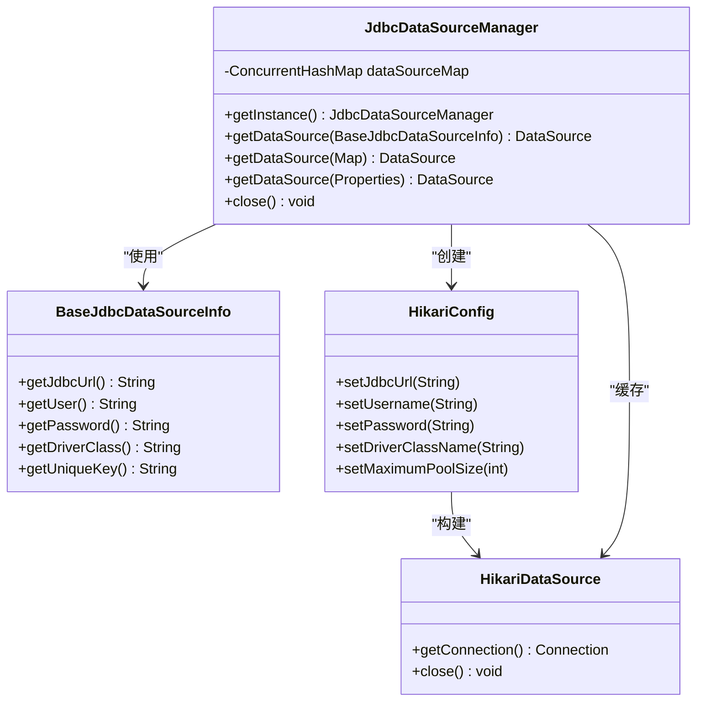
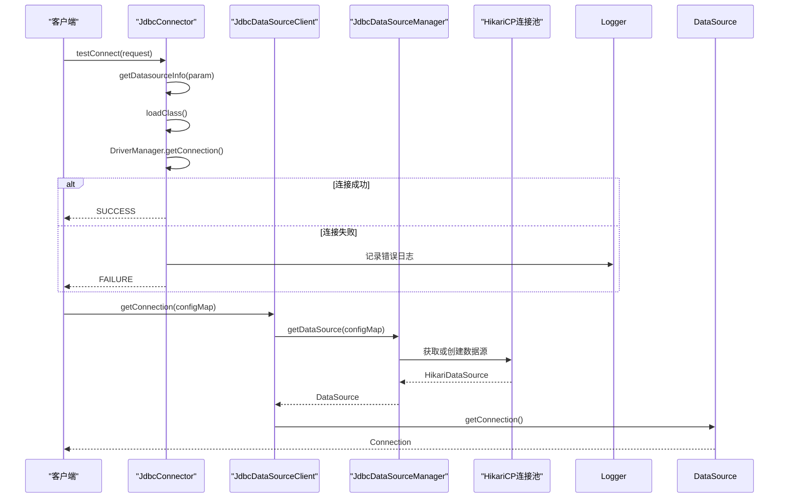
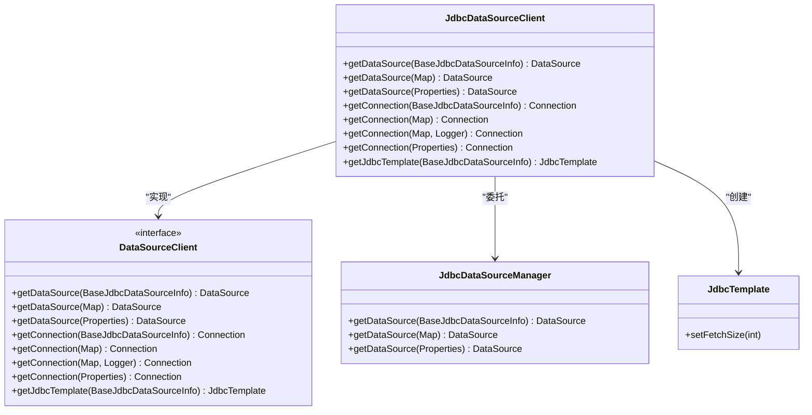
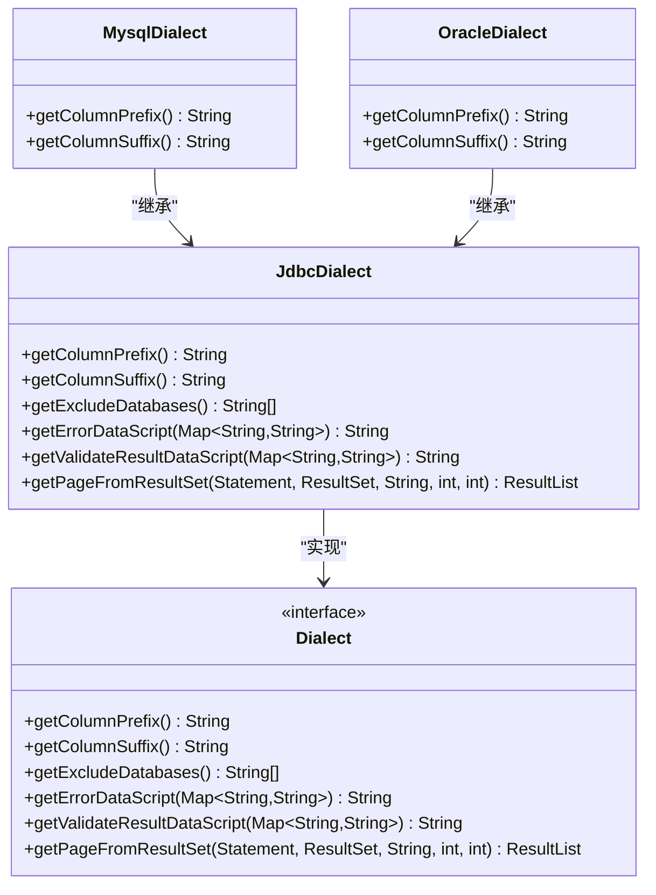

# JDBC连接器

<cite>
**本文档引用的文件**
- [JdbcConnector.java](file://datavines-connector\datavines-connector-plugins\datavines-connector-jdbc\src\main\java\io\datavines\connector\plugin\JdbcConnector.java)
- [JdbcDataSourceClient.java](file://datavines-connector\datavines-connector-plugins\datavines-connector-jdbc\src\main\java\io\datavines\connector\plugin\JdbcDataSourceClient.java)
- [JdbcDialect.java](file://datavines-connector\datavines-connector-plugins\datavines-connector-jdbc\src\main\java\io\datavines\connector\plugin\JdbcDialect.java)
- [JdbcDataSourceManager.java](file://datavines-common\src\main\java\io\datavines\common\datasource\jdbc\JdbcDataSourceManager.java)
- [BaseJdbcDataSourceInfo.java](file://datavines-common\src\main\java\io\datavines\common\datasource\jdbc\BaseJdbcDataSourceInfo.java)
- [JdbcExecutorClient.java](file://datavines-common\src\main\java\io\datavines\common\datasource\jdbc\JdbcExecutorClient.java)
- [JdbcExecutorClientManager.java](file://datavines-common\src\main\java\io\datavines\common\datasource\jdbc\JdbcExecutorClientManager.java)
- [ConnectionUtils.java](file://datavines-common\src\main\java\io\datavines\common\utils\ConnectionUtils.java)
- [JdbcUrlParser.java](file://datavines-common\src\main\java\io\datavines\common\utils\JdbcUrlParser.java)
</cite>

## 目录
1. [引言](#引言)
2. [核心组件](#核心组件)
3. [连接池管理](#连接池管理)
4. [连接测试与故障恢复机制](#连接测试与故障恢复机制)
5. [JdbcDataSourceClient统一管理](#jdbcdatasourceclient统一管理)
6. [JdbcDialect适配策略](#jdbcdialect适配策略)
7. [连接参数配置最佳实践](#连接参数配置最佳实践)
8. [性能优化建议](#性能优化建议)
9. [结论](#结论)

## 引言
JDBC连接器是DataVines平台中用于连接各种关系型数据库的核心组件。作为所有JDBC数据库的基础实现，它提供了一套统一的接口和机制来管理数据库连接、执行SQL语句以及处理不同数据库的特定行为。本文档详细阐述了JDBC连接器的架构设计、关键组件及其工作原理，重点介绍了连接池管理、连接测试、故障恢复机制，以及如何通过JdbcDataSourceClient统一管理不同数据库的连接信息。同时，文档还深入分析了JdbcDialect对不同数据库SQL方言的适配策略，并提供了JDBC连接参数配置的最佳实践和性能优化建议。

## 核心组件

JDBC连接器由多个核心组件构成，这些组件协同工作以提供稳定可靠的数据库连接服务。主要组件包括JdbcConnector、JdbcDataSourceClient、JdbcDialect、JdbcDataSourceManager和JdbcExecutorClient等。

**JdbcConnector** 是所有JDBC数据库连接器的抽象基类，它实现了Connector接口和IJdbcDataSourceInfo接口，为具体的数据库连接器（如MySQL、Oracle等）提供了通用的功能实现。它负责处理数据库的元数据查询，如获取数据库列表、表列表和列信息等。

**JdbcDataSourceClient** 是数据源客户端，实现了DataSourceClient接口，负责创建和管理数据源（DataSource）和数据库连接（Connection）。它通过JdbcDataSourceManager来获取数据源实例，并提供了多种方式来获取连接。

**JdbcDialect** 是SQL方言的抽象基类，定义了不同数据库在SQL语法上的差异处理策略。它提供了诸如获取列名前缀/后缀、排除系统数据库等功能，确保SQL语句能够在特定数据库上正确执行。

**JdbcDataSourceManager** 是连接池管理的核心类，使用HikariCP作为底层连接池实现，负责创建、缓存和管理数据源实例。它通过唯一的键来标识每个数据源，避免了重复创建。

**JdbcExecutorClient** 是执行客户端，封装了获取连接和JdbcTemplate的功能，为上层应用提供了便捷的数据库操作接口。

**Section sources**
- [JdbcConnector.java](file://datavines-connector\datavines-connector-plugins\datavines-connector-jdbc\src\main\java\io\datavines\connector\plugin\JdbcConnector.java#L42-L284)
- [JdbcDataSourceClient.java](file://datavines-connector\datavines-connector-plugins\datavines-connector-jdbc\src\main\java\io\datavines\connector\plugin\JdbcDataSourceClient.java#L32-L89)
- [JdbcDialect.java](file://datavines-connector\datavines-connector-plugins\datavines-connector-jdbc\src\main\java\io\datavines\connector\plugin\JdbcDialect.java#L33-L76)
- [JdbcDataSourceManager.java](file://datavines-common\src\main\java\io\datavines\common\datasource\jdbc\JdbcDataSourceManager.java#L33-L144)
- [JdbcExecutorClient.java](file://datavines-common\src\main\java\io\datavines\common\datasource\jdbc\JdbcExecutorClient.java#L24-L45)

## 连接池管理

JDBC连接器使用HikariCP作为其连接池实现，通过JdbcDataSourceManager类进行管理。连接池的管理机制确保了数据库连接的高效复用，减少了频繁创建和销毁连接的开销。

JdbcDataSourceManager采用单例模式，确保在整个应用生命周期内只有一个实例。它内部维护了一个ConcurrentHashMap，用于缓存已创建的数据源实例。每个数据源实例通过一个唯一的键来标识，该键由数据库URL、用户名和密码的MD5哈希值生成，确保了相同连接配置的数据源不会被重复创建。

当需要获取数据源时，JdbcDataSourceManager首先检查缓存中是否存在对应的实例。如果不存在，则创建一个新的HikariConfig配置对象，设置JDBC URL、用户名、密码、驱动类名和最大连接池大小（默认为10），然后创建HikariDataSource实例并将其放入缓存中。这种双重检查的同步机制保证了线程安全。

**Diagram sources**
- [JdbcDataSourceManager.java](file://datavines-common\src\main\java\io\datavines\common\datasource\jdbc\JdbcDataSourceManager.java#L33-L144)
- [BaseJdbcDataSourceInfo.java](file://datavines-common\src\main\java\io\datavines\common\datasource\jdbc\BaseJdbcDataSourceInfo.java#L34-L198)

## 连接测试与故障恢复机制

JDBC连接器提供了完善的连接测试和故障恢复机制，确保数据库连接的可靠性和稳定性。

连接测试功能通过JdbcConnector的testConnect方法实现。该方法接收测试连接请求参数，解析出数据源配置，创建BaseJdbcDataSourceInfo实例，并尝试使用DriverManager.getConnection建立连接。如果连接成功，则返回成功状态；否则捕获SQLException异常，记录错误日志并返回失败状态。此机制允许在配置数据库连接时验证连接的有效性。

故障恢复机制主要体现在连接的获取和释放过程中。当通过JdbcDataSourceClient或ConnectionUtils获取连接时，系统会尝试从连接池中获取连接。如果获取失败或连接无效，会抛出DataVinesException异常。在使用完连接后，必须通过JdbcDataSourceUtils.releaseConnection方法显式关闭连接，该方法会安全地处理连接关闭过程，即使发生异常也不会影响主流程。

此外，连接池本身也具备一定的故障恢复能力。HikariCP连接池会定期检测连接的健康状况，并自动移除失效的连接。当应用程序请求连接时，连接池会优先提供健康的连接，从而保证了连接的质量。

**Diagram sources**
- [JdbcConnector.java](file://datavines-connector\datavines-connector-plugins\datavines-connector-jdbc\src\main\java\io\datavines\connector\plugin\JdbcConnector.java#L196-L212)
- [JdbcDataSourceClient.java](file://datavines-connector\datavines-connector-plugins\datavines-connector-jdbc\src\main\java\io\datavines\connector\plugin\JdbcDataSourceClient.java#L50-L75)
- [JdbcDataSourceManager.java](file://datavines-common\src\main\java\io\datavines\common\datasource\jdbc\JdbcDataSourceManager.java#L45-L69)

## JdbcDataSourceClient统一管理

JdbcDataSourceClient是统一管理不同数据库连接信息的核心组件。它实现了DataSourceClient接口，提供了多种方式来获取数据源和数据库连接，包括通过BaseJdbcDataSourceInfo、配置映射（Map）或属性（Properties）等方式。

JdbcDataSourceClient通过委托给JdbcDataSourceManager来获取数据源实例。这种设计模式实现了关注点分离，JdbcDataSourceClient负责接口定义和调用，而JdbcDataSourceManager负责具体的连接池管理。当调用getConnection方法时，JdbcDataSourceClient会先获取数据源，然后从数据源中获取连接，并在成功获取后记录日志，便于问题排查。

此外，JdbcDataSourceClient还提供了getJdbcTemplate方法，返回一个预配置的JdbcTemplate实例。该实例的fetchSize被设置为500，以优化大数据量查询的性能。这为上层应用提供了更高层次的数据库操作抽象，简化了开发工作。

**Diagram sources**
- [JdbcDataSourceClient.java](file://datavines-connector\datavines-connector-plugins\datavines-connector-jdbc\src\main\java\io\datavines\connector\plugin\JdbcDataSourceClient.java#L32-L89)
- [JdbcDataSourceManager.java](file://datavines-common\src\main\java\io\datavines\common\datasource\jdbc\JdbcDataSourceManager.java#L33-L144)

## JdbcDialect适配策略

JdbcDialect是处理不同数据库SQL方言差异的关键组件。它定义了一套抽象方法，允许子类根据具体数据库的特性进行重写，从而实现SQL语句的正确生成和执行。

JdbcDialect的适配策略主要包括以下几个方面：

1. **列名引号处理**：通过getColumnPrefix和getColumnSuffix方法定义列名的前缀和后缀引号。默认实现使用反引号（`），但不同的数据库可能需要使用双引号（"）或其他符号。

2. **系统数据库排除**：通过getExcludeDatabases方法返回一个包含系统数据库名称的列表。这在获取数据库列表时非常有用，可以避免显示系统内部数据库，提高用户体验。

3. **特定SQL脚本生成**：通过getErrorDataScript和getValidateResultDataScript方法生成特定于数据库的查询脚本。例如，根据配置生成查询错误数据或验证结果的SQL语句。

4. **分页查询处理**：通过getPageFromResultSet方法处理结果集的分页。虽然默认实现使用了通用的分页逻辑，但可以根据数据库特性进行优化。

这种策略使得JDBC连接器能够灵活地适应各种数据库，而无需在核心逻辑中硬编码特定数据库的处理逻辑。

**Diagram sources**
- [JdbcDialect.java](file://datavines-connector\datavines-connector-plugins\datavines-connector-jdbc\src\main\java\io\datavines\connector\plugin\JdbcDialect.java#L33-L76)
- [Dialect.java](file://datavines-connector\datavines-connector-api\src\main\java\io\datavines\connector\api\Dialect.java)

## 连接参数配置最佳实践

为了确保JDBC连接的稳定性和安全性，遵循以下连接参数配置最佳实践至关重要：

1. **连接信息管理**：使用BaseJdbcDataSourceInfo类来封装连接信息。该类提供了统一的接口来获取主机、端口、数据库、用户名、密码等信息，并通过getJdbcUrl方法生成完整的JDBC URL。

2. **唯一标识生成**：通过getUniqueKey方法生成数据源的唯一标识。该方法将连接参数转换为字符串，并计算其MD5哈希值，确保了相同配置的数据源具有相同的标识，避免了重复创建。

3. **驱动类加载**：在建立连接前，通过loadClass方法显式加载数据库驱动类。这可以提前发现驱动类缺失的问题，避免在运行时才暴露错误。

4. **连接参数解析**：使用JdbcUrlParser工具类解析JDBC URL，提取出主机、端口、数据库等信息。这对于处理复杂的连接字符串非常有用。

5. **敏感信息处理**：密码等敏感信息应妥善处理，避免在日志中明文显示。系统在记录连接信息时，应考虑对敏感字段进行脱敏。

6. **配置验证**：在使用连接参数前，应进行基本的验证，如检查必要字段是否为空，确保JDBC URL格式正确等。

**Section sources**
- [BaseJdbcDataSourceInfo.java](file://datavines-common\src\main\java\io\datavines\common\datasource\jdbc\BaseJdbcDataSourceInfo.java#L34-L198)
- [JdbcUrlParser.java](file://datavines-common\src\main\java\io\datavines\common\utils\JdbcUrlParser.java#L36-L77)
- [ConnectionUtils.java](file://datavines-common\src\main\java\io\datavines\common\utils\ConnectionUtils.java#L34-L87)

## 性能优化建议

为了最大化JDBC连接器的性能，建议采取以下优化措施：

1. **连接池大小调整**：根据应用的并发需求和数据库的承载能力，合理设置连接池大小。默认的10个连接可能不足以应对高并发场景，应根据实际负载进行调整。可以通过修改JdbcDataSourceManager中的setMaximumPoolSize值来调整。

2. **连接超时设置**：配置合理的连接超时时间，避免应用程序因等待连接而长时间阻塞。HikariCP提供了connectionTimeout、validationTimeout等参数，应根据网络状况和数据库响应时间进行设置。

3. **批量操作优化**：对于大量数据的插入或更新操作，使用批量处理（batch processing）而不是逐条执行。这可以显著减少网络往返次数，提高吞吐量。

4. **结果集获取优化**：通过设置合适的fetchSize来优化大结果集的获取。JdbcDataSourceClient中默认设置为500，可以根据查询的数据量和内存使用情况进行调整。

5. **连接泄漏预防**：确保每次获取连接后都能正确关闭。使用try-with-resources语句或在finally块中关闭连接，防止连接泄漏导致连接池耗尽。

6. **监控和调优**：启用连接池的监控功能，定期检查连接池的状态，如活跃连接数、空闲连接数、等待线程数等。根据监控数据进行针对性的调优。

7. **SQL语句优化**：编写高效的SQL语句，避免全表扫描，合理使用索引。对于复杂的查询，考虑使用执行计划分析工具进行优化。

**Section sources**
- [JdbcDataSourceManager.java](file://datavines-common\src\main\java\io\datavines\common\datasource\jdbc\JdbcDataSourceManager.java#L60-L61)
- [JdbcDataSourceClient.java](file://datavines-connector\datavines-connector-plugins\datavines-connector-jdbc\src\main\java\io\datavines\connector\plugin\JdbcDataSourceClient.java#L85-L86)
- [JdbcExecutorClient.java](file://datavines-common\src\main\java\io\datavines\common\datasource\jdbc\JdbcExecutorClient.java#L41-L42)

## 结论
JDBC连接器作为DataVines平台与各种关系型数据库交互的桥梁，其设计充分考虑了可扩展性、稳定性和性能。通过连接池管理、统一的连接信息管理、SQL方言适配等机制，它为上层应用提供了简单而强大的数据库访问能力。理解其内部工作原理和最佳实践，有助于开发者更好地利用这一组件，构建高效、可靠的数据库应用。未来，可以进一步增强连接池的动态调整能力，引入更智能的故障恢复策略，以及支持更多的数据库类型，以满足不断变化的业务需求。