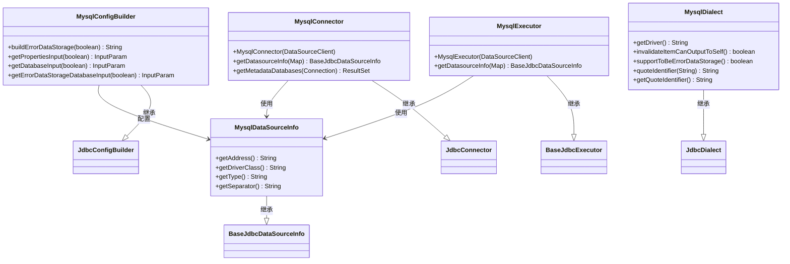
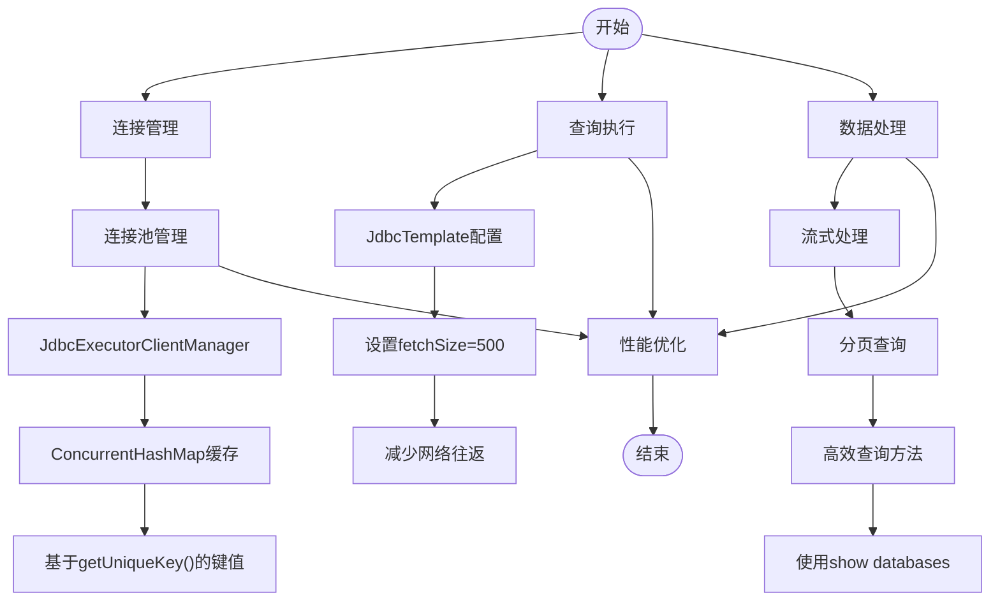
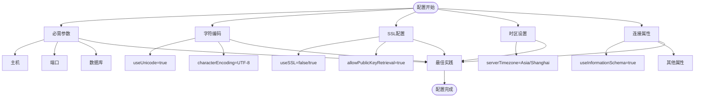

# MySQL连接器

<cite>
**本文档中引用的文件**  
- [MysqlDataSourceInfo.java](file://datavines-connector\datavines-connector-plugins\datavines-connector-mysql\src\main\java\io\datavines\connector\plugin\MysqlDataSourceInfo.java)
- [MysqlDialect.java](file://datavines-connector\datavines-connector-plugins\datavines-connector-mysql\src\main\java\io\datavines\connector\plugin\MysqlDialect.java)
- [MysqlConfigBuilder.java](file://datavines-connector\datavines-connector-plugins\datavines-connector-mysql\src\main\java\io\datavines\connector\plugin\MysqlConfigBuilder.java)
- [MysqlExecutor.java](file://datavines-connector\datavines-connector-plugins\datavines-connector-mysql\src\main\java\io\datavines\connector\plugin\MysqlExecutor.java)
- [MysqlConnector.java](file://datavines-connector\datavines-connector-plugins\datavines-connector-mysql\src\main\java\io\datavines\connector\plugin\MysqlConnector.java)
- [JdbcDialect.java](file://datavines-connector\datavines-connector-plugins\datavines-connector-jdbc\src\main\java\io\datavines\connector\plugin\JdbcDialect.java)
- [BaseJdbcExecutor.java](file://datavines-connector\datavines-connector-plugins\datavines-connector-jdbc\src\main\java\io\datavines\connector\plugin\BaseJdbcExecutor.java)
- [JdbcConnector.java](file://datavines-connector\datavines-connector-plugins\datavines-connector-jdbc\src\main\java\io\datavines\connector\plugin\JdbcConnector.java)
- [BaseJdbcDataSourceInfo.java](file://datavines-common\src\main\java\io\datavines\common\datasource\jdbc\BaseJdbcDataSourceInfo.java)
</cite>

## 目录
1. [简介](#简介)
2. [MySQL连接器架构](#mysql连接器架构)
3. [MysqlDataSourceInfo实现](#mysqldatasourceinfo实现)
4. [MysqlDialect适配策略](#mysqldialect适配策略)
5. [性能优化特性](#性能优化特性)
6. [连接参数配置最佳实践](#连接参数配置最佳实践)
7. [常见问题解决方案](#常见问题解决方案)
8. [结论](#结论)

## 简介

MySQL连接器是DataVines数据质量平台中用于连接和操作MySQL数据库的核心组件。该连接器基于JDBC标准实现，提供了对MySQL数据库的全面支持，包括连接管理、元数据获取、SQL执行和数据质量验证等功能。本文档详细分析MySQL连接器的实现细节，重点关注其对MySQL特有功能的支持、SQL语法适配策略以及性能优化机制。

MySQL连接器的设计遵循了模块化和可扩展的原则，通过继承和实现基类与接口来提供特定于MySQL的功能。连接器的主要功能包括：建立和管理数据库连接、获取数据库元数据（如数据库列表、表结构、列信息等）、执行SQL查询和更新操作，以及支持数据质量检查和错误数据存储。

**本节内容未分析具体源文件，因此不提供来源信息**

## MySQL连接器架构

MySQL连接器的整体架构基于JDBC插件体系，通过继承通用JDBC组件并实现MySQL特定功能来完成。连接器的核心组件包括MysqlDataSourceInfo、MysqlDialect、MysqlExecutor和MysqlConnector，它们分别负责连接信息管理、SQL语法适配、执行逻辑和连接操作。



**图示来源**  
- [MysqlDataSourceInfo.java](file://datavines-connector\datavines-connector-plugins\datavines-connector-mysql\src\main\java\io\datavines\connector\plugin\MysqlDataSourceInfo.java)
- [MysqlDialect.java](file://datavines-connector\datavines-connector-plugins\datavines-connector-mysql\src\main\java\io\datavines\connector\plugin\MysqlDialect.java)
- [MysqlExecutor.java](file://datavines-connector\datavines-connector-plugins\datavines-connector-mysql\src\main\java\io\datavines\connector\plugin\MysqlExecutor.java)
- [MysqlConnector.java](file://datavines-connector\datavines-connector-plugins\datavines-connector-mysql\src\main\java\io\datavines\connector\plugin\MysqlConnector.java)
- [MysqlConfigBuilder.java](file://datavines-connector\datavines-connector-plugins\datavines-connector-mysql\src\main\java\io\datavines\connector\plugin\MysqlConfigBuilder.java)

**本节来源**  
- [MysqlDataSourceInfo.java](file://datavines-connector\datavines-connector-plugins\datavines-connector-mysql\src\main\java\io\datavines\connector\plugin\MysqlDataSourceInfo.java)
- [MysqlDialect.java](file://datavines-connector\datavines-connector-plugins\datavines-connector-mysql\src\main\java\io\datavines\connector\plugin\MysqlDialect.java)
- [MysqlExecutor.java](file://datavines-connector\datavines-connector-plugins\datavines-connector-mysql\src\main\java\io\datavines\connector\plugin\MysqlExecutor.java)
- [MysqlConnector.java](file://datavines-connector\datavines-connector-plugins\datavines-connector-mysql\src\main\java\io\datavines\connector\plugin\MysqlConnector.java)
- [MysqlConfigBuilder.java](file://datavines-connector\datavines-connector-plugins\datavines-connector-mysql\src\main\java\io\datavines\connector\plugin\MysqlConfigBuilder.java)

## MysqlDataSourceInfo实现

MysqlDataSourceInfo类负责处理MySQL数据库的连接信息和特定参数。作为BaseJdbcDataSourceInfo的子类，它实现了MySQL特有的连接地址生成、驱动类指定和类型标识功能。

该类的核心功能包括：
1. 连接地址生成：通过getAddress()方法生成标准的JDBC连接URL，格式为"jdbc:mysql://host:port"
2. 驱动类指定：返回MySQL Connector/J的驱动类名"com.mysql.cj.jdbc.Driver"
3. 类型标识：返回数据源类型为"mysql"
4. 参数分隔符：使用"?"作为连接参数的分隔符

MysqlDataSourceInfo继承了基类的参数解析功能，能够处理主机、端口、用户名、密码等基本连接参数，并通过父类的机制生成完整的JDBC连接URL。这种设计使得MySQL特定的连接逻辑与通用的JDBC连接管理分离，提高了代码的可维护性和可扩展性。

```mermaid
classDiagram
class BaseJdbcDataSourceInfo {
+getHost() String
+getPort() int
+getUser() String
+getPassword() String
+getDatabase() String
+getJdbcUrl() String
+getUniqueKey() String
+loadClass() void
}
class MysqlDataSourceInfo {
+getAddress() String
+getDriverClass() String
+getType() String
+getSeparator() String
}
MysqlDataSourceInfo --|> BaseJdbcDataSourceInfo : 继承
note right of MysqlDataSourceInfo
实现MySQL特有功能：
- getAddress() : 生成jdbc : mysql : //host : port
- getDriverClass() : 返回MySQL驱动类
- getType() : 返回数据源类型
- getSeparator() : 返回参数分隔符
end note
```

**图示来源**  
- [MysqlDataSourceInfo.java](file://datavines-connector\datavines-connector-plugins\datavines-connector-mysql\src\main\java\io\datavines\connector\plugin\MysqlDataSourceInfo.java)
- [BaseJdbcDataSourceInfo.java](file://datavines-common\src\main\java\io\datavines\common\datasource\jdbc\BaseJdbcDataSourceInfo.java)

**本节来源**  
- [MysqlDataSourceInfo.java](file://datavines-connector\datavines-connector-plugins\datavines-connector-mysql\src\main\java\io\datavines\connector\plugin\MysqlDataSourceInfo.java)

## MysqlDialect适配策略

MysqlDialect类负责处理MySQL特有的SQL语法和函数适配。作为JdbcDialect的子类，它重写了多个方法以支持MySQL的特定行为和功能。

主要适配策略包括：
1. 驱动类指定：返回MySQL Connector/J的驱动类名"com.mysql.cj.jdbc.Driver"
2. 标识符引用：使用反引号(`)作为标识符的引用符号，这是MySQL的标准做法
3. 错误数据存储支持：支持将错误数据存储到同一数据源中
4. 无效项输出：允许将无效项输出到自身

MysqlDialect继承了JdbcDialect的通用SQL处理功能，同时通过重写方法来适应MySQL的特定需求。例如，quoteIdentifier方法使用反引号而不是标准的双引号来引用标识符，这符合MySQL的语法规范。这种设计使得SQL语句在不同数据库之间的移植更加容易，同时保持了对特定数据库特性的支持。

```mermaid
classDiagram
class JdbcDialect {
+getColumnPrefix() String
+getColumnSuffix() String
+getExcludeDatabases() String[]
+getErrorDataScript(Map) String
+getValidateResultDataScript(Map) String
+getPageFromResultSet(Statement, ResultSet, String, int, int) ResultList
}
class MysqlDialect {
+getDriver() String
+invalidateItemCanOutputToSelf() boolean
+supportToBeErrorDataStorage() boolean
+quoteIdentifier(String) String
+getQuoteIdentifier() String
}
MysqlDialect --|> JdbcDialect : 继承
note right of MysqlDialect
重写方法以适应MySQL特性：
- getDriver() : 返回MySQL驱动
- quoteIdentifier() : 使用反引号引用
- supportToBeErrorDataStorage() : 支持错误数据存储
- invalidateItemCanOutputToSelf() : 允许无效项输出到自身
end note
```

**图示来源**  
- [MysqlDialect.java](file://datavines-connector\datavines-connector-plugins\datavines-connector-mysql\src\main\java\io\datavines\connector\plugin\MysqlDialect.java)
- [JdbcDialect.java](file://datavines-connector\datavines-connector-plugins\datavines-connector-jdbc\src\main\java\io\datavines\connector\plugin\JdbcDialect.java)

**本节来源**  
- [MysqlDialect.java](file://datavines-connector\datavines-connector-plugins\datavines-connector-mysql\src\main\java\io\datavines\connector\plugin\MysqlDialect.java)

## 性能优化特性

MySQL连接器在设计时考虑了多种性能优化策略，以提高数据处理效率和系统响应速度。这些优化特性主要体现在连接管理、查询执行和数据处理等方面。

连接管理方面，连接器利用JdbcExecutorClientManager的单例模式和ConcurrentHashMap来缓存和复用数据库连接，避免了频繁创建和销毁连接的开销。每个唯一的数据源配置都有一个对应的JdbcExecutorClient实例，通过getUniqueKey()方法生成的键值进行标识和查找。

查询执行方面，连接器在JdbcTemplate中设置了合理的fetchSize（500），这可以减少网络往返次数，提高大数据量查询的效率。同时，提供了多种查询方法（queryForPage、queryForOne、queryForList）以适应不同的使用场景，避免不必要的数据加载。

数据处理方面，连接器通过流式处理和分页查询来支持大数据集的操作。例如，getMetadataDatabases方法使用"show databases"语句直接获取数据库列表，而不是通过标准的JDBC元数据方法，这在某些情况下可以提高性能。



**图示来源**  
- [JdbcExecutorClientManager.java](file://datavines-common\src\main\java\io\datavines\common\datasource\jdbc\JdbcExecutorClientManager.java)
- [JdbcExecutorClient.java](file://datavines-common\src\main\java\io\datavines\common\datasource\jdbc\JdbcExecutorClient.java)
- [BaseJdbcExecutor.java](file://datavines-connector\datavines-connector-plugins\datavines-connector-jdbc\src\main\java\io\datavines\connector\plugin\BaseJdbcExecutor.java)
- [JdbcConnector.java](file://datavines-connector\datavines-connector-plugins\datavines-connector-jdbc\src\main\java\io\datavines\connector\plugin\JdbcConnector.java)

**本节来源**  
- [JdbcExecutorClientManager.java](file://datavines-common\src\main\java\io\datavines\common\datasource\jdbc\JdbcExecutorClientManager.java)
- [JdbcExecutorClient.java](file://datavines-common\src\main\java\io\datavines\common\datasource\jdbc\JdbcExecutorClient.java)
- [BaseJdbcExecutor.java](file://datavines-connector\datavines-connector-plugins\datavines-connector-jdbc\src\main\java\io\datavines\connector\plugin\BaseJdbcExecutor.java)
- [JdbcConnector.java](file://datavines-connector\datavines-connector-plugins\datavines-connector-jdbc\src\main\java\io\datavines\connector\plugin\JdbcConnector.java)

## 连接参数配置最佳实践

MySQL连接器通过MysqlConfigBuilder类提供了连接参数的配置构建功能。该类继承自JdbcConfigBuilder，重写了相关方法以支持MySQL特有的配置需求。

在连接参数配置方面，最佳实践包括：
1. 必需参数：确保正确配置主机、端口和数据库名称等基本连接参数
2. 字符编码：设置useUnicode=true&characterEncoding=UTF-8以支持中文字符
3. SSL配置：根据安全需求设置useSSL参数，生产环境建议启用SSL
4. 时区设置：配置serverTimezone参数以避免时区相关的问题
5. 连接属性：合理设置其他连接属性以优化性能和稳定性

MysqlConfigBuilder的getPropertiesInput方法提供了默认的连接参数配置，包括字符编码、SSL设置、时区和信息模式访问等。这些默认配置考虑了大多数使用场景的需求，开发者可以根据具体环境进行调整。



**图示来源**  
- [MysqlConfigBuilder.java](file://datavines-connector\datavines-connector-plugins\datavines-connector-mysql\src\main\java\io\datavines\connector\plugin\MysqlConfigBuilder.java)
- [JdbcConfigBuilder.java](file://datavines-connector\datavines-connector-plugins\datavines-connector-jdbc\src\main\java\io\datavines\connector\plugin\JdbcConfigBuilder.java)

**本节来源**  
- [MysqlConfigBuilder.java](file://datavines-connector\datavines-connector-plugins\datavines-connector-mysql\src\main\java\io\datavines\connector\plugin\MysqlConfigBuilder.java)

## 常见问题解决方案

在使用MySQL连接器时，可能会遇到一些常见问题。以下是这些问题的解决方案：

1. **连接失败问题**：检查主机、端口、用户名和密码是否正确，确保MySQL服务器正在运行且网络可达。如果使用SSL连接，确保SSL配置正确。

2. **字符编码问题**：如果出现中文乱码，确保在连接参数中设置了useUnicode=true&characterEncoding=UTF-8。

3. **时区问题**：如果时间数据出现偏差，检查serverTimezone参数是否正确设置为目标时区。

4. **权限问题**：确保连接用户具有足够的权限访问目标数据库和表。

5. **性能问题**：对于大数据量查询，考虑调整fetchSize参数或使用分页查询。

6. **驱动类问题**：确保classpath中包含正确版本的MySQL Connector/J驱动。

7. **元数据获取问题**：如果无法获取表或列信息，检查用户是否具有访问information_schema的权限。

通过合理配置连接参数和遵循最佳实践，可以有效避免大多数常见问题。对于复杂问题，建议查看详细的错误日志以获取更多信息。

**本节来源**  
- [MysqlDataSourceInfo.java](file://datavines-connector\datavines-connector-plugins\datavines-connector-mysql\src\main\java\io\datavines\connector\plugin\MysqlDataSourceInfo.java)
- [MysqlDialect.java](file://datavines-connector\datavines-connector-plugins\datavines-connector-mysql\src\main\java\io\datavines\connector\plugin\MysqlDialect.java)
- [MysqlConfigBuilder.java](file://datavines-connector\datavines-connector-plugins\datavines-connector-mysql\src\main\java\io\datavines\connector\plugin\MysqlConfigBuilder.java)

## 结论

MySQL连接器通过继承和扩展通用JDBC组件，实现了对MySQL数据库的全面支持。MysqlDataSourceInfo类处理MySQL特有的连接参数和URL生成，MysqlDialect类适配MySQL的SQL语法和函数特性，而MysqlExecutor和MysqlConnector类则提供了执行逻辑和连接操作功能。

连接器的设计体现了良好的面向对象原则和模块化思想，通过继承基类和实现接口来提供特定功能，同时保持了代码的可维护性和可扩展性。性能优化方面，连接器通过连接池管理、合理的fetchSize设置和高效的查询方法来提高数据处理效率。

在实际使用中，应遵循连接参数配置的最佳实践，合理设置字符编码、SSL和时区等参数，以确保连接的稳定性和数据的正确性。对于常见问题，可以通过检查配置、查看日志和调整参数来解决。

总体而言，MySQL连接器是一个功能完整、性能优良的数据库连接组件，为DataVines平台提供了可靠的MySQL数据库访问能力。

**本节内容未分析具体源文件，因此不提供来源信息**