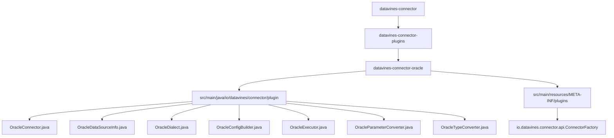
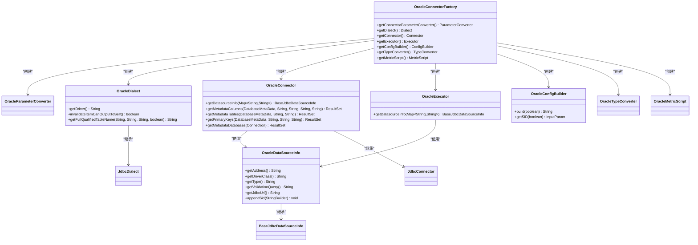
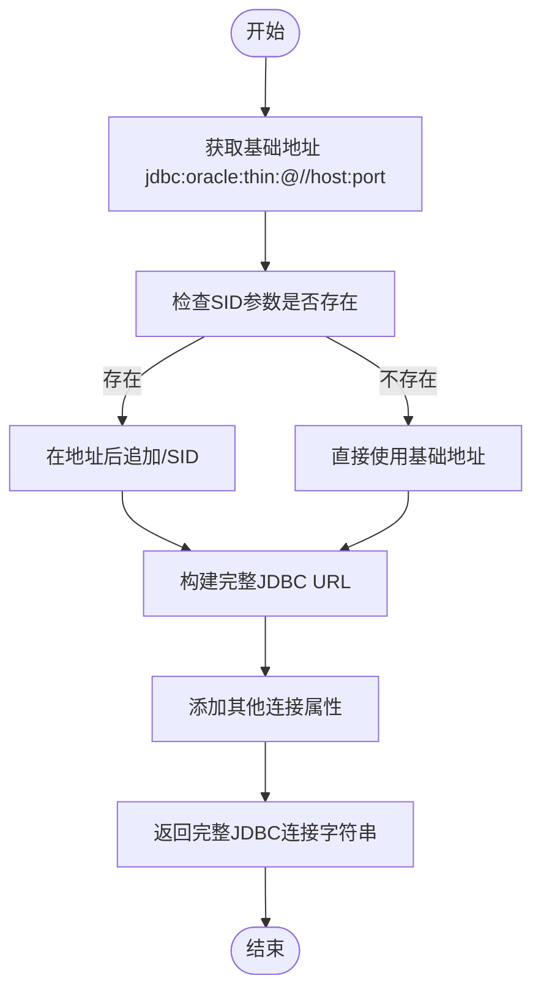

# Oracle连接器

<cite>
**本文档引用的文件**  
- [OracleConnector.java](file://datavines-connector/datavines-connector-plugins/datavines-connector-oracle/src/main/java/io/datavines/connector/plugin/OracleConnector.java)
- [OracleDataSourceInfo.java](file://datavines-connector/datavines-connector-plugins/datavines-connector-oracle/src/main/java/io/datavines/connector/plugin/OracleDataSourceInfo.java)
- [OracleDialect.java](file://datavines-connector/datavines-connector-plugins/datavines-connector-oracle/src/main/java/io/datavines/connector/plugin/OracleDialect.java)
- [OracleConfigBuilder.java](file://datavines-connector/datavines-connector-plugins/datavines-connector-oracle/src/main/java/io/datavines/connector/plugin/OracleConfigBuilder.java)
- [OracleExecutor.java](file://datavines-connector/datavines-connector-plugins/datavines-connector-oracle/src/main/java/io/datavines/connector/plugin/OracleExecutor.java)
- [OracleParameterConverter.java](file://datavines-connector/datavines-connector-plugins/datavines-connector-oracle/src/main/java/io/datavines/connector/plugin/OracleParameterConverter.java)
- [OracleTypeConverter.java](file://datavines-connector/datavines-connector-plugins/datavines-connector-oracle/src/main/java/io/datavines/connector/plugin/OracleTypeConverter.java)
- [BaseJdbcDataSourceInfo.java](file://datavines-common/src/main/java/io/datavines/common/datasource/jdbc/BaseJdbcDataSourceInfo.java)
- [JdbcDialect.java](file://datavines-connector/datavines-connector-plugins/datavines-connector-jdbc/src/main/java/io/datavines/connector/plugin/JdbcDialect.java)
- [JdbcConnector.java](file://datavines-connector/datavines-connector-plugins/datavines-connector-jdbc/src/main/java/io/datavines/connector/plugin/JdbcConnector.java)
</cite>

## 目录
1. [简介](#简介)
2. [项目结构](#项目结构)
3. [核心组件](#核心组件)
4. [架构概述](#架构概述)
5. [详细组件分析](#详细组件分析)
6. [依赖分析](#依赖分析)
7. [性能考虑](#性能考虑)
8. [故障排除指南](#故障排除指南)
9. [结论](#结论)

## 简介
Oracle连接器是DataVines平台中用于连接和操作Oracle数据库的核心组件。该连接器实现了Oracle数据库特有的连接参数处理、SQL语法支持以及性能优化特性。本文档详细描述了Oracle连接器的实现机制，包括OracleDataSourceInfo对Oracle连接参数的处理、OracleDialect对Oracle SQL语法的支持，以及连接器的性能优化特性。

## 项目结构
Oracle连接器位于`datavines-connector-plugins`模块下的`datavines-connector-oracle`子模块中。该结构遵循DataVines插件化架构设计，将Oracle数据库的连接功能封装为独立的插件。



**图示来源**
- [OracleConnector.java](file://datavines-connector/datavines-connector-plugins/datavines-connector-oracle/src/main/java/io/datavines/connector/plugin/OracleConnector.java)
- [OracleDataSourceInfo.java](file://datavines-connector/datavines-connector-plugins/datavines-connector-oracle/src/main/java/io/datavines/connector/plugin/OracleDataSourceInfo.java)
- [OracleDialect.java](file://datavines-connector/datavines-connector-plugins/datavines-connector-oracle/src/main/java/io/datavines/connector/plugin/OracleDialect.java)

**章节来源**
- [OracleConnector.java](file://datavines-connector/datavines-connector-plugins/datavines-connector-oracle/src/main/java/io/datavines/connector/plugin/OracleConnector.java)
- [OracleDataSourceInfo.java](file://datavines-connector/datavines-connector-plugins/datavines-connector-oracle/src/main/java/io/datavines/connector/plugin/OracleDataSourceInfo.java)
- [OracleDialect.java](file://datavines-connector/datavines-connector-plugins/datavines-connector-oracle/src/main/java/io/datavines/connector/plugin/OracleDialect.java)

## 核心组件
Oracle连接器的核心组件包括OracleConnector、OracleDataSourceInfo、OracleDialect等类，它们共同实现了Oracle数据库的连接、配置和操作功能。这些组件通过继承和扩展通用JDBC组件，实现了Oracle数据库特有的功能。

**章节来源**
- [OracleConnector.java](file://datavines-connector/datavines-connector-plugins/datavines-connector-oracle/src/main/java/io/datavines/connector/plugin/OracleConnector.java)
- [OracleDataSourceInfo.java](file://datavines-connector/datavines-connector-plugins/datavines-connector-oracle/src/main/java/io/datavines/connector/plugin/OracleDataSourceInfo.java)
- [OracleDialect.java](file://datavines-connector/datavines-connector-plugins/datavines-connector-oracle/src/main/java/io/datavines/connector/plugin/OracleDialect.java)

## 架构概述
Oracle连接器采用分层架构设计，基于DataVines的插件化架构，通过继承通用JDBC组件来实现Oracle数据库的特定功能。该架构遵循面向接口编程原则，通过工厂模式创建具体的连接器实例。



**图示来源**
- [OracleConnectorFactory.java](file://datavines-connector/datavines-connector-plugins/datavines-connector-oracle/src/main/java/io/datavines/connector/plugin/OracleConnectorFactory.java)
- [OracleConnector.java](file://datavines-connector/datavines-connector-plugins/datavines-connector-oracle/src/main/java/io/datavines/connector/plugin/OracleConnector.java)
- [OracleDataSourceInfo.java](file://datavines-connector/datavines-connector-plugins/datavines-connector-oracle/src/main/java/io/datavines/connector/plugin/OracleDataSourceInfo.java)
- [OracleDialect.java](file://datavines-connector/datavines-connector-plugins/datavines-connector-oracle/src/main/java/io/datavines/connector/plugin/OracleDialect.java)
- [OracleConfigBuilder.java](file://datavines-connector/datavines-connector-plugins/datavines-connector-oracle/src/main/java/io/datavines/connector/plugin/OracleConfigBuilder.java)
- [OracleExecutor.java](file://datavines-connector/datavines-connector-plugins/datavines-connector-oracle/src/main/java/io/datavines/connector/plugin/OracleExecutor.java)

## 详细组件分析

### OracleDataSourceInfo分析
OracleDataSourceInfo类负责处理Oracle数据库特有的连接参数，包括服务名/SID的处理。该类继承自BaseJdbcDataSourceInfo，重写了相关方法以适应Oracle数据库的连接要求。



**图示来源**
- [OracleDataSourceInfo.java](file://datavines-connector/datavines-connector-plugins/datavines-connector-oracle/src/main/java/io/datavines/connector/plugin/OracleDataSourceInfo.java)
- [BaseJdbcDataSourceInfo.java](file://datavines-common/src/main/java/io/datavines/common/datasource/jdbc/BaseJdbcDataSourceInfo.java)

**章节来源**
- [OracleDataSourceInfo.java](file://datavines-connector/datavines-connector-plugins/datavines-connector-oracle/src/main/java/io/datavines/connector/plugin/OracleDataSourceInfo.java)
- [BaseJdbcDataSourceInfo.java](file://datavines-common/src/main/java/io/datavines/common/datasource/jdbc/BaseJdbcDataSourceInfo.java)

### OracleDialect分析
OracleDialect类实现了Oracle数据库特有的SQL语法支持。该类继承自JdbcDialect，重写了相关方法以适应Oracle数据库的SQL语法特点。

```mermaid
classDiagram
class OracleDialect {
+getDriver() String
+invalidateItemCanOutputToSelf() boolean
+getFullQualifiedTableName(String, String, String, boolean) String
}
class JdbcDialect {
+getColumnPrefix() String
+getColumnSuffix() String
+getExcludeDatabases() String[]
+getErrorDataScript(Map~String,String~) String
+getValidateResultDataScript(Map~String,String~) String
+getPageFromResultSet(Statement, ResultSet, String, int, int) ResultList
}
OracleDialect --> JdbcDialect : "继承"
note right of OracleDialect
重写getFullQualifiedTableName方法：
- 不使用catalog作为数据库名
- schema和table名使用大写
- 支持Oracle特有的命名规则
end note
```

**图示来源**
- [OracleDialect.java](file://datavines-connector/datavines-connector-plugins/datavines-connector-oracle/src/main/java/io/datavines/connector/plugin/OracleDialect.java)
- [JdbcDialect.java](file://datavines-connector/datavines-connector-plugins/datavines-connector-jdbc/src/main/java/io/datavines/connector/plugin/JdbcDialect.java)

**章节来源**
- [OracleDialect.java](file://datavines-connector/datavines-connector-plugins/datavines-connector-oracle/src/main/java/io/datavines/connector/plugin/OracleDialect.java)
- [JdbcDialect.java](file://datavines-connector/datavines-connector-plugins/datavines-connector-jdbc/src/main/java/io/datavines/connector/plugin/JdbcDialect.java)

### Oracle连接参数配置分析
Oracle连接器通过OracleConfigBuilder类构建连接参数配置界面，支持用户输入Oracle特有的连接参数。

```mermaid
flowchart TD
Start([配置构建开始]) --> AddHost["添加主机输入项"]
AddHost --> AddPort["添加端口输入项"]
AddPort --> AddSID["添加SID输入项"]
AddSID --> AddUser["添加用户名输入项"]
AddUser --> AddPassword["添加密码输入项"]
AddPassword --> AddProperties["添加连接属性输入项"]
AddProperties --> AddOthers["添加其他参数"]
AddOthers --> Serialize["序列化为JSON格式"]
Serialize --> ReturnConfig["返回配置JSON字符串"]
ReturnConfig --> End([配置构建结束])
style AddSID fill:#f9f,stroke:#333
note right of AddSID
SID参数为必填项
提示信息支持中英文
用于构建Oracle连接字符串
end note
```

**图示来源**
- [OracleConfigBuilder.java](file://datavines-connector/datavines-connector-plugins/datavines-connector-oracle/src/main/java/io/datavines/connector/plugin/OracleConfigBuilder.java)
- [OracleParameterConverter.java](file://datavines-connector/datavines-connector-plugins/datavines-connector-oracle/src/main/java/io/datavines/connector/plugin/OracleParameterConverter.java)

**章节来源**
- [OracleConfigBuilder.java](file://datavines-connector/datavines-connector-plugins/datavines-connector-oracle/src/main/java/io/datavines/connector/plugin/OracleConfigBuilder.java)
- [OracleParameterConverter.java](file://datavines-connector/datavines-connector-plugins/datavines-connector-oracle/src/main/java/io/datavines/connector/plugin/OracleParameterConverter.java)

## 依赖分析
Oracle连接器的依赖关系体现了其插件化架构特点，通过继承和组合的方式复用通用JDBC组件的功能，同时实现Oracle数据库的特定功能。

```mermaid
graph TD
A[OracleConnectorFactory] --> B[OracleParameterConverter]
A --> C[OracleDialect]
A --> D[OracleConnector]
A --> E[OracleExecutor]
A --> F[OracleConfigBuilder]
A --> G[OracleTypeConverter]
A --> H[OracleMetricScript]
D --> I[OracleDataSourceInfo]
E --> I
I --> J[BaseJdbcDataSourceInfo]
C --> K[JdbcDialect]
D --> L[JdbcConnector]
M[Oracle连接器] --> N[Oracle JDBC驱动]
N --> O[Oracle数据库]
style A fill:#ff9999,stroke:#333
style D fill:#99ff99,stroke:#333
style I fill:#9999ff,stroke:#333
style J fill:#ffff99,stroke:#333
note right of A
工厂类负责创建所有Oracle相关组件
end note
note right of D
连接器实现Oracle数据库操作
end note
note right of I
数据源信息处理Oracle连接参数
end note
note right of J
基础JDBC数据源信息类
end note
```

**图示来源**
- [OracleConnectorFactory.java](file://datavines-connector/datavines-connector-plugins/datavines-connector-oracle/src/main/java/io/datavines/connector/plugin/OracleConnectorFactory.java)
- [OracleConnector.java](file://datavines-connector/datavines-connector-plugins/datavines-connector-oracle/src/main/java/io/datavines/connector/plugin/OracleConnector.java)
- [OracleDataSourceInfo.java](file://datavines-connector/datavines-connector-plugins/datavines-connector-oracle/src/main/java/io/datavines/connector/plugin/OracleDataSourceInfo.java)
- [BaseJdbcDataSourceInfo.java](file://datavines-common/src/main/java/io/datavines/common/datasource/jdbc/BaseJdbcDataSourceInfo.java)
- [JdbcDialect.java](file://datavines-connector/datavines-connector-plugins/datavines-connector-jdbc/src/main/java/io/datavines/connector/plugin/JdbcDialect.java)
- [JdbcConnector.java](file://datavines-connector/datavines-connector-plugins/datavines-connector-jdbc/src/main/java/io/datavines/connector/plugin/JdbcConnector.java)

**章节来源**
- [OracleConnectorFactory.java](file://datavines-connector/datavines-connector-plugins/datavines-connector-oracle/src/main/java/io/datavines/connector/plugin/OracleConnectorFactory.java)
- [OracleConnector.java](file://datavines-connector/datavines-connector-plugins/datavines-connector-oracle/src/main/java/io/datavines/connector/plugin/OracleConnector.java)
- [OracleDataSourceInfo.java](file://datavines-connector/datavines-connector-plugins/datavines-connector-oracle/src/main/java/io/datavines/connector/plugin/OracleDataSourceInfo.java)
- [BaseJdbcDataSourceInfo.java](file://datavines-common/src/main/java/io/datavines/common/datasource/jdbc/BaseJdbcDataSourceInfo.java)

## 性能考虑
Oracle连接器在设计时考虑了性能优化，特别是在连接管理和SQL执行方面。通过连接池管理和批量操作支持，提高了与Oracle数据库交互的效率。

**章节来源**
- [OracleConnector.java](file://datavines-connector/datavines-connector-plugins/datavines-connector-oracle/src/main/java/io/datavines/connector/plugin/OracleConnector.java)
- [OracleExecutor.java](file://datavines-connector/datavines-connector-plugins/datavines-connector-oracle/src/main/java/io/datavines/connector/plugin/OracleExecutor.java)
- [BaseJdbcDataSourceInfo.java](file://datavines-common/src/main/java/io/datavines/common/datasource/jdbc/BaseJdbcDataSourceInfo.java)

## 故障排除指南
Oracle连接器的故障排除主要集中在连接配置和驱动依赖方面。确保Oracle JDBC驱动正确配置是成功连接的关键。

**章节来源**
- [OracleDataSourceInfo.java](file://datavines-connector/datavines-connector-plugins/datavines-connector-oracle/src/main/java/io/datavines/connector/plugin/OracleDataSourceInfo.java)
- [BaseJdbcDataSourceInfo.java](file://datavines-common/src/main/java/io/datavines/common/datasource/jdbc/BaseJdbcDataSourceInfo.java)
- [OracleConnector.java](file://datavines-connector/datavines-connector-plugins/datavines-connector-oracle/src/main/java/io/datavines/connector/plugin/OracleConnector.java)

## 结论
Oracle连接器通过继承和扩展通用JDBC组件，实现了对Oracle数据库的完整支持。该连接器正确处理了Oracle特有的连接参数（如SID），支持Oracle SQL语法，并提供了良好的性能特性。通过插件化架构，Oracle连接器能够无缝集成到DataVines平台中，为用户提供可靠的Oracle数据库连接服务。