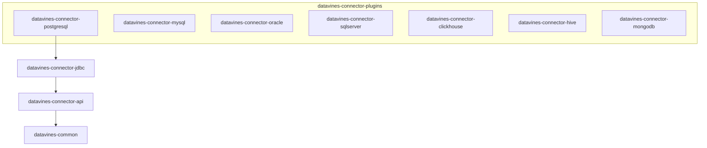
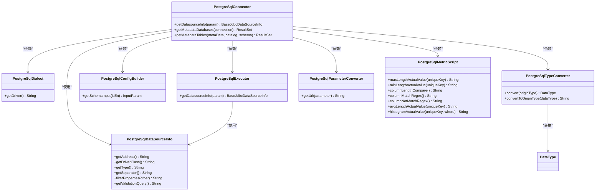
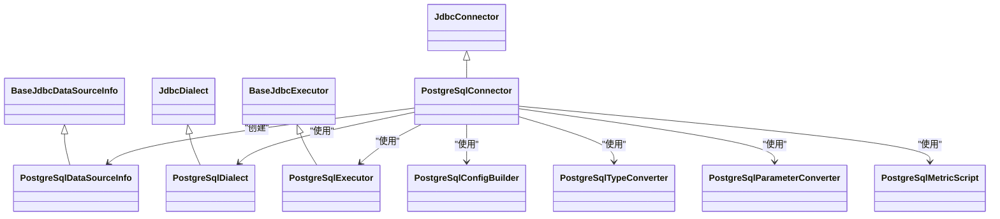
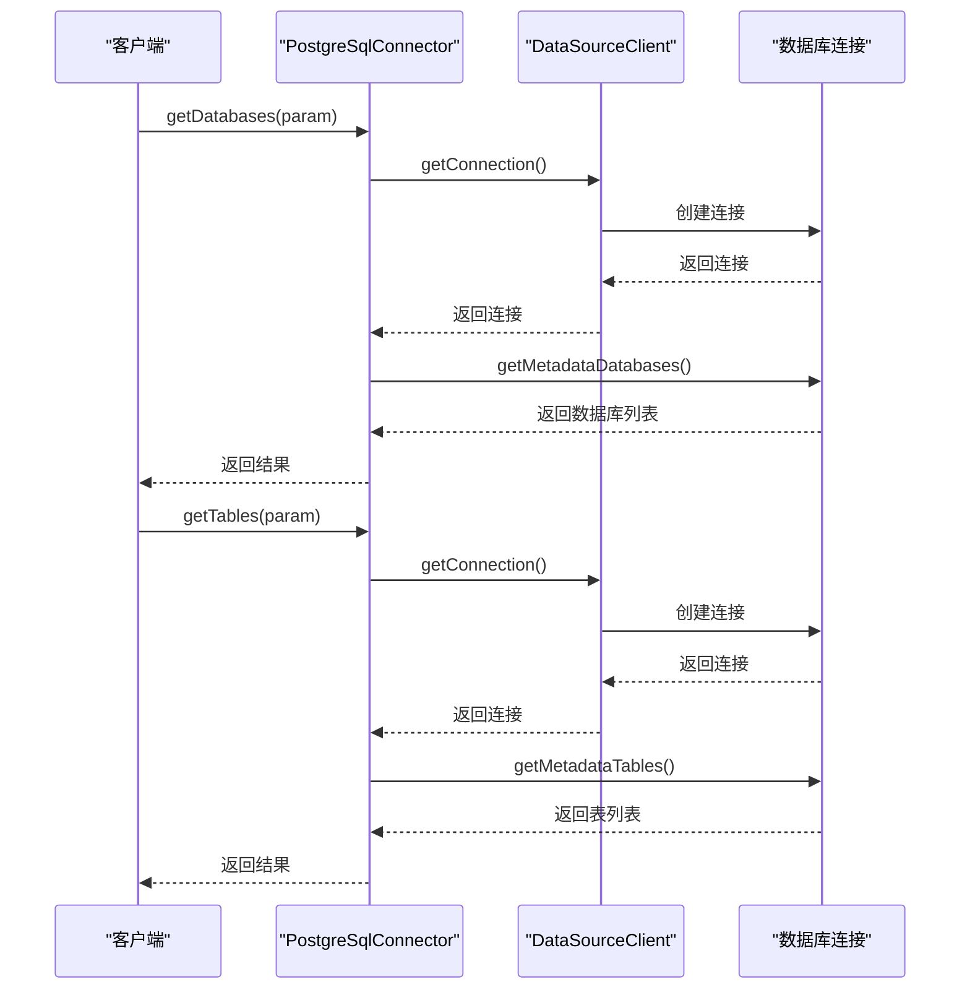
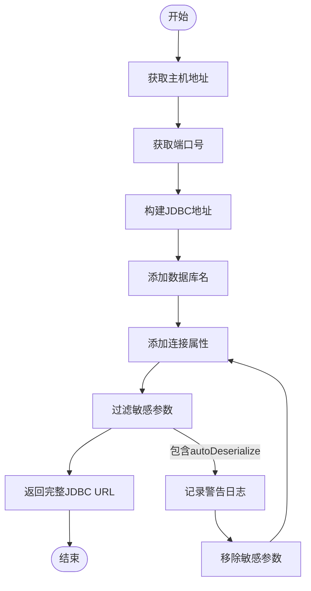
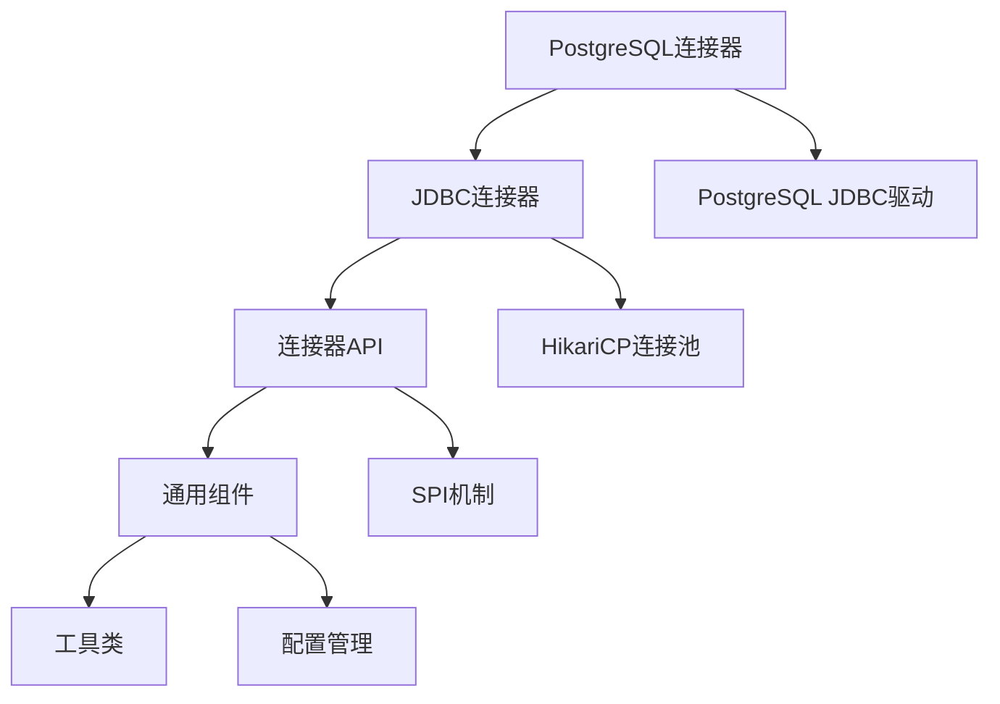

# PostgreSQL连接器

<cite>
**本文档引用的文件**
- [PostgreSqlConnector.java](file://datavines-connector/datavines-connector-plugins/datavines-connector-postgresql/src/main/java/io/datavines/connector/plugin/PostgreSqlConnector.java)
- [PostgreSqlDataSourceInfo.java](file://datavines-connector/datavines-connector-plugins/datavines-connector-postgresql/src/main/java/io/datavines/connector/plugin/PostgreSqlDataSourceInfo.java)
- [PostgreSqlDialect.java](file://datavines-connector/datavines-connector-plugins/datavines-connector-postgresql/src/main/java/io/datavines/connector/plugin/PostgreSqlDialect.java)
- [PostgreSqlExecutor.java](file://datavines-connector/datavines-connector-plugins/datavines-connector-postgresql/src/main/java/io/datavines/connector/plugin/PostgreSqlExecutor.java)
- [PostgreSqlConfigBuilder.java](file://datavines-connector/datavines-connector-plugins/datavines-connector-postgresql/src/main/java/io/datavines/connector/plugin/PostgreSqlConfigBuilder.java)
- [PostgreSqlTypeConverter.java](file://datavines-connector/datavines-connector-plugins/datavines-connector-postgresql/src/main/java/io/datavines/connector/plugin/PostgreSqlTypeConverter.java)
- [PostgreSqlParameterConverter.java](file://datavines-connector/datavines-connector-plugins/datavines-connector-postgresql/src/main/java/io/datavines/connector/plugin/PostgreSqlParameterConverter.java)
- [PostgreSqlMetricScript.java](file://datavines-connector/datavines-connector-plugins/datavines-connector-postgresql/src/main/java/io/datavines/connector/plugin/PostgreSqlMetricScript.java)
- [JdbcConnector.java](file://datavines-connector/datavines-connector-plugins/datavines-connector-jdbc/src/main/java/io/datavines/connector/plugin/JdbcConnector.java)
- [BaseJdbcDataSourceInfo.java](file://datavines-common/src/main/java/io/datavines/common/datasource/jdbc/BaseJdbcDataSourceInfo.java)
- [JdbcDialect.java](file://datavines-connector/datavines-connector-plugins/datavines-connector-jdbc/src/main/java/io/datavines/connector/plugin/JdbcDialect.java)
- [BaseJdbcExecutor.java](file://datavines-connector/datavines-connector-plugins/datavines-connector-jdbc/src/main/java/io/datavines/connector/plugin/BaseJdbcExecutor.java)
</cite>

## 目录
1. [简介](#简介)
2. [项目结构](#项目结构)
3. [核心组件](#核心组件)
4. [架构概述](#架构概述)
5. [详细组件分析](#详细组件分析)
6. [依赖分析](#依赖分析)
7. [性能考虑](#性能考虑)
8. [故障排除指南](#故障排除指南)
9. [结论](#结论)

## 简介
PostgreSQL连接器是DataVines数据质量平台中的一个关键组件，用于与PostgreSQL数据库进行交互。该连接器实现了针对PostgreSQL数据库的特定功能，包括连接参数处理、SQL语法支持、数据类型转换等。本文档详细介绍了PostgreSQL连接器的实现细节，包括其核心组件、架构设计、性能优化特性以及配置最佳实践。

## 项目结构
PostgreSQL连接器位于`datavines-connector-plugins`模块下的`datavines-connector-postgresql`子模块中。该结构遵循DataVines的插件化设计模式，允许灵活地添加和管理不同的数据库连接器。



**图源**
- [pom.xml](file://datavines-connector/datavines-connector-plugins/datavines-connector-postgresql/pom.xml)

**本节来源**
- [pom.xml](file://datavines-connector/datavines-connector-plugins/datavines-connector-postgresql/pom.xml)

## 核心组件
PostgreSQL连接器的核心组件包括`PostgreSqlConnector`、`PostgreSqlDataSourceInfo`、`PostgreSqlDialect`和`PostgreSqlExecutor`等类。这些组件共同协作，实现了与PostgreSQL数据库的连接、查询和数据操作功能。

**本节来源**
- [PostgreSqlConnector.java](file://datavines-connector/datavines-connector-plugins/datavines-connector-postgresql/src/main/java/io/datavines/connector/plugin/PostgreSqlConnector.java)
- [PostgreSqlDataSourceInfo.java](file://datavines-connector/datavines-connector-plugins/datavines-connector-postgresql/src/main/java/io/datavines/connector/plugin/PostgreSqlDataSourceInfo.java)
- [PostgreSqlDialect.java](file://datavines-connector/datavines-connector-plugins/datavines-connector-postgresql/src/main/java/io/datavines/connector/plugin/PostgreSqlDialect.java)
- [PostgreSqlExecutor.java](file://datavines-connector/datavines-connector-plugins/datavines-connector-postgresql/src/main/java/io/datavines/connector/plugin/PostgreSqlExecutor.java)

## 架构概述
PostgreSQL连接器的架构基于DataVines的通用JDBC连接器架构，通过继承和扩展基类来实现PostgreSQL特定的功能。这种设计模式允许代码重用，同时保持了针对特定数据库的定制化能力。



**图源**
- [PostgreSqlConnector.java](file://datavines-connector/datavines-connector-plugins/datavines-connector-postgresql/src/main/java/io/datavines/connector/plugin/PostgreSqlConnector.java)
- [PostgreSqlDataSourceInfo.java](file://datavines-connector/datavines-connector-plugins/datavines-connector-postgresql/src/main/java/io/datavines/connector/plugin/PostgreSqlDataSourceInfo.java)
- [PostgreSqlDialect.java](file://datavines-connector/datavines-connector-plugins/datavines-connector-postgresql/src/main/java/io/datavines/connector/plugin/PostgreSqlDialect.java)
- [PostgreSqlExecutor.java](file://datavines-connector/datavines-connector-plugins/datavines-connector-postgresql/src/main/java/io/datavines/connector/plugin/PostgreSqlExecutor.java)
- [PostgreSqlConfigBuilder.java](file://datavines-connector/datavines-connector-plugins/datavines-connector-postgresql/src/main/java/io/datavines/connector/plugin/PostgreSqlConfigBuilder.java)
- [PostgreSqlTypeConverter.java](file://datavines-connector/datavines-connector-plugins/datavines-connector-postgresql/src/main/java/io/datavines/connector/plugin/PostgreSqlTypeConverter.java)
- [PostgreSqlParameterConverter.java](file://datavines-connector/datavines-connector-plugins/datavines-connector-postgresql/src/main/java/io/datavines/connector/plugin/PostgreSqlParameterConverter.java)
- [PostgreSqlMetricScript.java](file://datavines-connector/datavines-connector-plugins/datavines-connector-postgresql/src/main/java/io/datavines/connector/plugin/PostgreSqlMetricScript.java)

## 详细组件分析

### PostgreSQL连接器分析
PostgreSQL连接器通过继承`JdbcConnector`基类，实现了针对PostgreSQL数据库的特定功能。它负责管理与PostgreSQL数据库的连接，并提供元数据查询功能。

#### 对象关系图


**图源**
- [PostgreSqlConnector.java](file://datavines-connector/datavines-connector-plugins/datavines-connector-postgresql/src/main/java/io/datavines/connector/plugin/PostgreSqlConnector.java)
- [JdbcConnector.java](file://datavines-connector/datavines-connector-plugins/datavines-connector-jdbc/src/main/java/io/datavines/connector/plugin/JdbcConnector.java)

#### 连接器工作流程


**图源**
- [PostgreSqlConnector.java](file://datavines-connector/datavines-connector-plugins/datavines-connector-postgresql/src/main/java/io/datavines/connector/plugin/PostgreSqlConnector.java)
- [JdbcConnector.java](file://datavines-connector/datavines-connector-plugins/datavines-connector-jdbc/src/main/java/io/datavines/connector/plugin/JdbcConnector.java)

**本节来源**
- [PostgreSqlConnector.java](file://datavines-connector/datavines-connector-plugins/datavines-connector-postgresql/src/main/java/io/datavines/connector/plugin/PostgreSqlConnector.java)
- [JdbcConnector.java](file://datavines-connector/datavines-connector-plugins/datavines-connector-jdbc/src/main/java/io/datavines/connector/plugin/JdbcConnector.java)

### PostgreSqlDataSourceInfo分析
`PostgreSqlDataSourceInfo`类负责处理PostgreSQL特有的连接参数。它继承自`BaseJdbcDataSourceInfo`，并重写了相关方法以适应PostgreSQL的连接要求。

#### 数据源信息处理流程


**图源**
- [PostgreSqlDataSourceInfo.java](file://datavines-connector/datavines-connector-plugins/datavines-connector-postgresql/src/main/java/io/datavines/connector/plugin/PostgreSqlDataSourceInfo.java)
- [BaseJdbcDataSourceInfo.java](file://datavines-common/src/main/java/io/datavines/common/datasource/jdbc/BaseJdbcDataSourceInfo.java)

**本节来源**
- [PostgreSqlDataSourceInfo.java](file://datavines-connector/datavines-connector-plugins/datavines-connector-postgresql/src/main/java/io/datavines/connector/plugin/PostgreSqlDataSourceInfo.java)
- [BaseJdbcDataSourceInfo.java](file://datavines-common/src/main/java/io/datavines/common/datasource/jdbc/BaseJdbcDataSourceInfo.java)

### PostgreSqlDialect分析
`PostgreSqlDialect`类实现了PostgreSQL特定的SQL语法支持。它继承自`JdbcDialect`基类，并提供了PostgreSQL驱动程序的类名。

#### SQL语法支持特性
```mermaid
erDiagram
METRIC_SCRIPT {
string maxLengthActualValue
string minLengthActualValue
string columnLengthCompare
string columnMatchRegex
string columnNotMatchRegex
string avgLengthActualValue
string histogramActualValue
}
METRIC_SCRIPT ||--o{ POSTGRESQL_METRIC_SCRIPT : "实现"
class PostgreSqlMetricScript {
+maxLengthActualValue(uniqueKey) String
+minLengthActualValue(uniqueKey) String
+columnLengthCompare() String
+columnMatchRegex() String
+columnNotMatchRegex() String
+avgLengthActualValue(uniqueKey) String
+histogramActualValue(uniqueKey, where) String
}
```

**图源**
- [PostgreSqlDialect.java](file://datavines-connector/datavines-connector-plugins/datavines-connector-postgresql/src/main/java/io/datavines/connector/plugin/PostgreSqlDialect.java)
- [JdbcDialect.java](file://datavines-connector/datavines-connector-plugins/datavines-connector-jdbc/src/main/java/io/datavines/connector/plugin/JdbcDialect.java)
- [PostgreSqlMetricScript.java](file://datavines-connector/datavines-connector-plugins/datavines-connector-postgresql/src/main/java/io/datavines/connector/plugin/PostgreSqlMetricScript.java)

**本节来源**
- [PostgreSqlDialect.java](file://datavines-connector/datavines-connector-plugins/datavines-connector-postgresql/src/main/java/io/datavines/connector/plugin/PostgreSqlDialect.java)
- [JdbcDialect.java](file://datavines-connector/datavines-connector-plugins/datavines-connector-jdbc/src/main/java/io/datavines/connector/plugin/JdbcDialect.java)
- [PostgreSqlMetricScript.java](file://datavines-connector/datavines-connector-plugins/datavines-connector-postgresql/src/main/java/io/datavines/connector/plugin/PostgreSqlMetricScript.java)

## 依赖分析
PostgreSQL连接器的依赖关系清晰地展示了其模块化设计。它依赖于通用的JDBC连接器组件，同时提供了PostgreSQL特定的实现。



**图源**
- [pom.xml](file://datavines-connector/datavines-connector-plugins/datavines-connector-postgresql/pom.xml)

**本节来源**
- [pom.xml](file://datavines-connector/datavines-connector-plugins/datavines-connector-postgresql/pom.xml)

## 性能考虑
PostgreSQL连接器在设计时考虑了性能优化，特别是在处理大数据量查询和连接管理方面。

### 连接池配置
PostgreSQL连接器利用HikariCP连接池来管理数据库连接，这有助于提高性能和资源利用率。连接池配置包括最大连接数、最小连接数、连接超时等参数，可以根据实际需求进行调整。

### 批量操作支持
虽然当前代码中没有直接体现，但基于JDBC的标准实现，PostgreSQL连接器支持批量插入、更新和删除操作。这些操作可以显著提高数据处理效率，特别是在处理大量数据时。

### 查询优化
PostgreSQL连接器通过使用预编译语句和参数化查询来防止SQL注入，并提高查询执行效率。此外，连接器还支持分页查询，可以有效处理大规模数据集。

**本节来源**
- [BaseJdbcExecutor.java](file://datavines-connector/datavines-connector-plugins/datavines-connector-jdbc/src/main/java/io/datavines/connector/plugin/BaseJdbcExecutor.java)
- [JdbcConnector.java](file://datavines-connector/datavines-connector-plugins/datavines-connector-jdbc/src/main/java/io/datavines/connector/plugin/JdbcConnector.java)

## 故障排除指南
在使用PostgreSQL连接器时，可能会遇到一些常见问题。以下是一些解决方案和最佳实践。

### 连接问题
如果无法连接到PostgreSQL数据库，请检查以下几点：
- 确认主机地址、端口号和数据库名称是否正确
- 检查用户名和密码是否正确
- 确认PostgreSQL服务器是否正在运行
- 检查防火墙设置，确保端口未被阻止
- 确认PostgreSQL的`pg_hba.conf`文件中是否允许来自客户端的连接

### SSL连接配置
PostgreSQL支持SSL连接，可以在连接字符串中添加SSL相关参数：
```
jdbc:postgresql://host:port/database?ssl=true&sslmode=require
```

### 性能问题
如果遇到性能问题，可以考虑以下优化措施：
- 调整连接池大小，根据负载情况设置合适的最大和最小连接数
- 使用索引优化查询性能
- 避免在查询中使用`SELECT *`，只选择需要的列
- 使用分页查询处理大规模数据集

**本节来源**
- [PostgreSqlDataSourceInfo.java](file://datavines-connector/datavines-connector-plugins/datavines-connector-postgresql/src/main/java/io/datavines/connector/plugin/PostgreSqlDataSourceInfo.java)
- [PostgreSqlParameterConverter.java](file://datavines-connector/datavines-connector-plugins/datavines-connector-postgresql/src/main/java/io/datavines/connector/plugin/PostgreSqlParameterConverter.java)

## 结论
PostgreSQL连接器是DataVines平台中一个重要的组件，它提供了与PostgreSQL数据库的高效、安全的连接和交互能力。通过继承和扩展通用JDBC连接器架构，PostgreSQL连接器实现了针对PostgreSQL特定功能的支持，包括连接参数处理、SQL语法支持、数据类型转换等。该连接器的设计体现了模块化和可扩展性，为未来的功能增强和维护提供了良好的基础。通过合理配置和使用，PostgreSQL连接器可以帮助用户有效地管理和监控PostgreSQL数据库的数据质量。