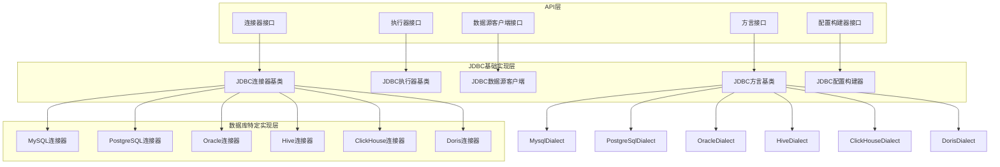
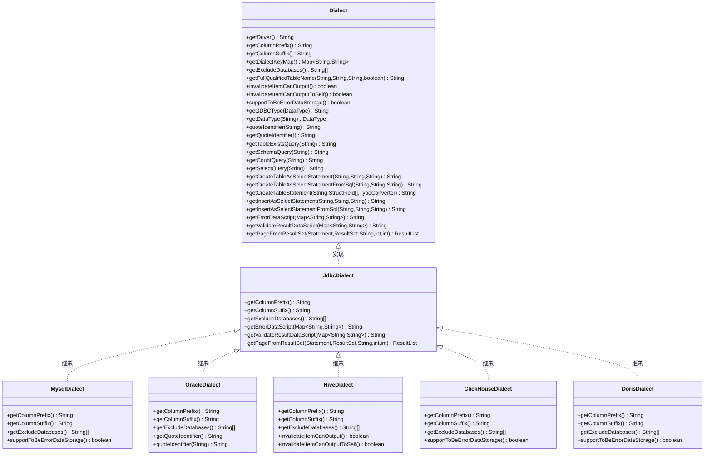
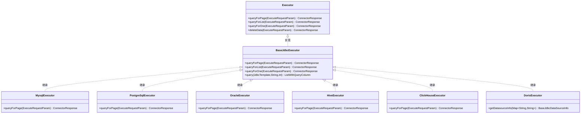
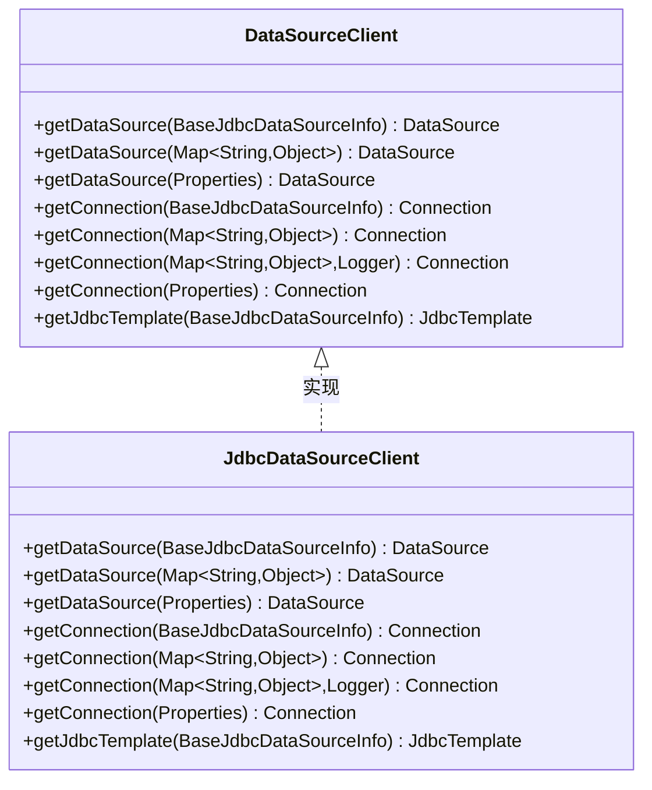
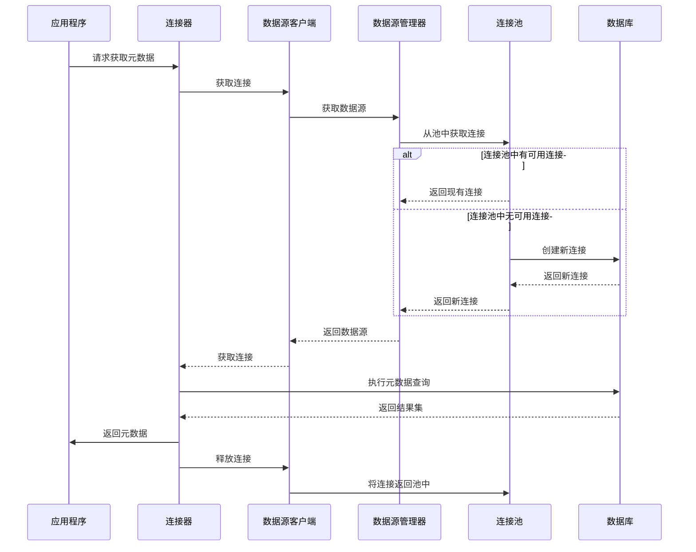
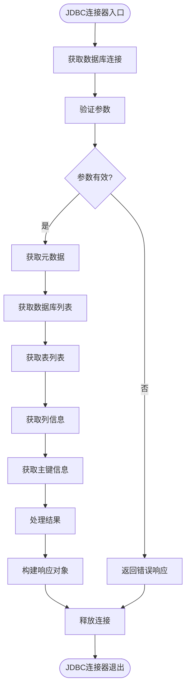
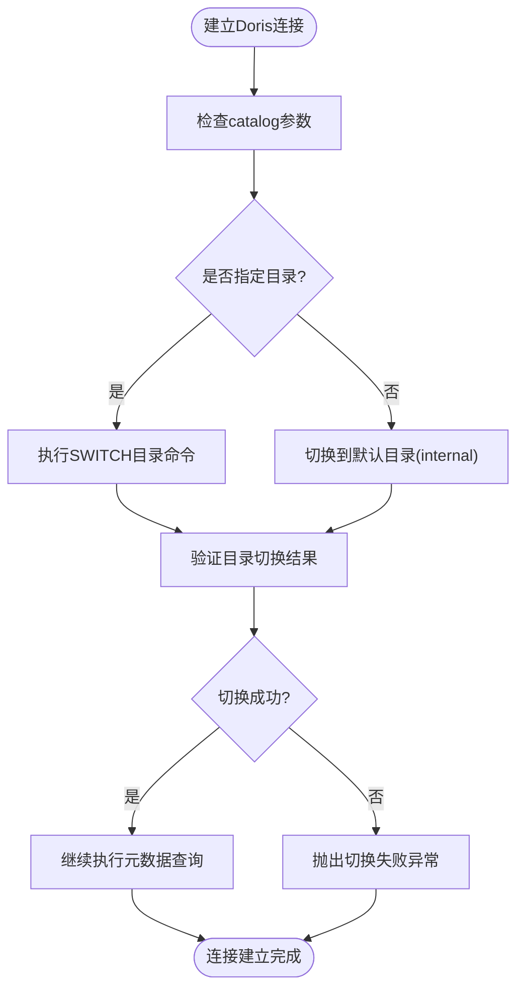
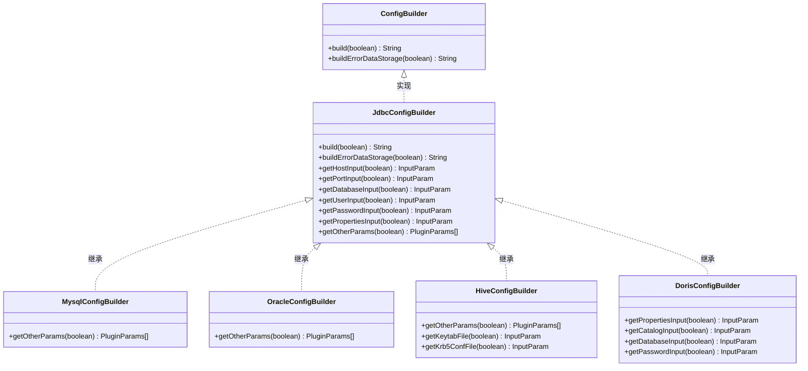
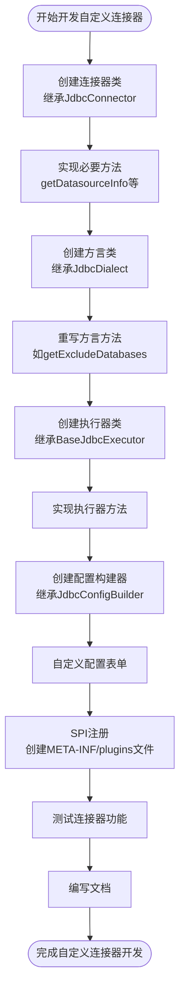

# datavines-connector模块

<cite>
**本文档引用的文件**   
- [Connector.java](file://datavines-connector/datavines-connector-api/src/main/java/io/datavines/connector/api/Connector.java)
- [Dialect.java](file://datavines-connector/datavines-connector-api/src/main/java/io/datavines/connector/api/Dialect.java)
- [Executor.java](file://datavines-connector/datavines-connector-api/src/main/java/io/datavines/connector/api/Executor.java)
- [DataSourceClient.java](file://datavines-connector/datavines-connector-api/src/main/java/io/datavines/connector/api/DataSourceClient.java)
- [ConfigBuilder.java](file://datavines-connector/datavines-connector-api/src/main/java/io/datavines/connector/api/ConfigBuilder.java)
- [JdbcConnector.java](file://datavines-connector/datavines-connector-plugins/datavines-connector-jdbc/src/main/java/io/datavines/connector/plugin/JdbcConnector.java)
- [JdbcDialect.java](file://datavines-connector/datavines-connector-plugins/datavines-connector-jdbc/src/main/java/io/datavines/connector/plugin/JdbcDialect.java)
- [BaseJdbcExecutor.java](file://datavines-connector/datavines-connector-plugins/datavines-connector-jdbc/src/main/java/io/datavines/connector/plugin/BaseJdbcExecutor.java)
- [JdbcDataSourceClient.java](file://datavines-connector/datavines-connector-plugins/datavines-connector-jdbc/src/main/java/io/datavines/connector/plugin/JdbcDataSourceClient.java)
- [JdbcConfigBuilder.java](file://datavines-connector/datavines-connector-plugins/datavines-connector-jdbc/src/main/java/io/datavines/connector/plugin/JdbcConfigBuilder.java)
- [MysqlConnector.java](file://datavines-connector/datavines-connector-plugins/datavines-connector-mysql/src/main/java/io/datavines/connector/plugin/MysqlConnector.java)
- [PostgreSqlConnector.java](file://datavines-connector/datavines-connector-plugins/datavines-connector-postgresql/src/main/java/io/datavines/connector/plugin/PostgreSqlConnector.java)
- [OracleConnector.java](file://datavines-connector/datavines-connector-plugins/datavines-connector-oracle/src/main/java/io/datavines/connector/plugin/OracleConnector.java)
- [HiveConnector.java](file://datavines-connector/datavines-connector-plugins/datavines-connector-hive/src/main/java/io/datavines/connector/plugin/HiveConnector.java)
- [ClickHouseConnector.java](file://datavines-connector/datavines-connector-plugins/datavines-connector-clickhouse/src/main/java/io/datavines/connector/plugin/ClickHouseConnector.java)
- [DorisConnector.java](file://datavines-connector/datavines-connector-plugins/datavines-connector-doris/src/main/java/io/datavines/connector/plugin/DorisConnector.java)
- [DorisDialect.java](file://datavines-connector/datavines-connector-plugins/datavines-connector-doris/src/main/java/io/datavines/connector/plugin/DorisDialect.java)
- [DorisConfigBuilder.java](file://datavines-connector/datavines-connector-plugins/datavines-connector-doris/src/main/java/io/datavines/connector/plugin/DorisConfigBuilder.java)
- [DorisDataSourceInfo.java](file://datavines-connector/datavines-connector-plugins/datavines-connector-doris/src/main/java/io/datavines/connector/plugin/DorisDataSourceInfo.java)
- [DorisExecutor.java](file://datavines-connector/datavines-connector-plugins/datavines-connector-doris/src/main/java/io/datavines/connector/plugin/DorisExecutor.java)
- [DorisParameterConverter.java](file://datavines-connector/datavines-connector-plugins/datavines-connector-doris/src/main/java/io/datavines/connector/plugin/DorisParameterConverter.java)
- [DorisConnectorFactory.java](file://datavines-connector/datavines-connector-plugins/datavines-connector-doris/src/main/java/io/datavines/connector/plugin/DorisConnectorFactory.java)
</cite>

## 目录
1. [简介](#简介)
2. [核心架构](#核心架构)
3. [连接器接口](#连接器接口)
4. [方言处理](#方言处理)
5. [执行器组件](#执行器组件)
6. [数据源客户端](#数据源客户端)
7. [连接池管理](#连接池管理)
8. [JDBC连接器实现](#jdbc连接器实现)
9. [数据库特定实现](#数据库特定实现)
10. [配置构建器](#配置构建器)
11. [连接参数配置](#连接参数配置)
12. [性能优化建议](#性能优化建议)
13. [自定义连接器开发](#自定义连接器开发)

## 简介
datavines-connector模块是DataVines数据质量平台的核心组件，负责管理与各种数据源的连接。该模块提供了统一的接口来处理JDBC连接、SQL执行、元数据获取和方言处理等功能。通过SPI机制，支持多种数据库类型，包括MySQL、PostgreSQL、Oracle、Hive、ClickHouse等。模块设计遵循面向接口编程原则，通过抽象基类和工厂模式实现可扩展的连接器架构。

**本节不分析具体文件**

## 核心架构
datavines-connector模块采用分层架构设计，主要包括连接器、执行器、数据源客户端和方言处理四个核心组件。这些组件通过接口定义契约，实现松耦合和高内聚。

**图源**
- [Connector.java](file://datavines-connector/datavines-connector-api/src/main/java/io/datavines/connector/api/Connector.java)
- [Executor.java](file://datavines-connector/datavines-connector-api/src/main/java/io/datavines/connector/api/Executor.java)
- [DataSourceClient.java](file://datavines-connector/datavines-connector-api/src/main/java/io/datavines/connector/api/DataSourceClient.java)
- [Dialect.java](file://datavines-connector/datavines-connector-api/src/main/java/io/datavines/connector/api/Dialect.java)
- [ConfigBuilder.java](file://datavines-connector/datavines-connector-api/src/main/java/io/datavines/connector/api/ConfigBuilder.java)
- [JdbcConnector.java](file://datavines-connector/datavines-connector-plugins/datavines-connector-jdbc/src/main/java/io/datavines/connector/plugin/JdbcConnector.java)
- [BaseJdbcExecutor.java](file://datavines-connector/datavines-connector-plugins/datavines-connector-jdbc/src/main/java/io/datavines/connector/plugin/BaseJdbcExecutor.java)
- [JdbcDataSourceClient.java](file://datavines-connector/datavines-connector-plugins/datavines-connector-jdbc/src/main/java/io/datavines/connector/plugin/JdbcDataSourceClient.java)
- [JdbcDialect.java](file://datavines-connector/datavines-connector-plugins/datavines-connector-jdbc/src/main/java/io/datavines/connector/plugin/JdbcDialect.java)
- [JdbcConfigBuilder.java](file://datavines-connector/datavines-connector-plugins/datavines-connector-jdbc/src/main/java/io/datavines/connector/plugin/JdbcConfigBuilder.java)

## 连接器接口
连接器接口（Connector）定义了数据源连接器的核心功能，包括获取数据库、表、列等元数据信息以及测试连接等功能。该接口通过默认方法提供了基本实现，允许具体连接器根据需要重写特定方法。

```mermaid
classDiagram
class Connector {
+getDatabases(GetDatabasesRequestParam) ConnectorResponse
+getTables(GetTablesRequestParam) ConnectorResponse
+getColumns(GetColumnsRequestParam) ConnectorResponse
+getPartitions(ConnectorRequestParam) ConnectorResponse
+testConnect(TestConnectionRequestParam) ConnectorResponse
+keyProperties() String[]
}
class JdbcConnector {
+getDatabases(GetDatabasesRequestParam) ConnectorResponse
+getTables(GetTablesRequestParam) ConnectorResponse
+getColumns(GetColumnsRequestParam) ConnectorResponse
+testConnect(TestConnectionRequestParam) ConnectorResponse
+getDatasourceInfo(Map~String,String~) BaseJdbcDataSourceInfo
+getMetadataDatabases(Connection) ResultSet
+getMetadataTables(DatabaseMetaData,String,String) ResultSet
+getMetadataColumns(DatabaseMetaData,String,String,String,String) ResultSet
+getPrimaryKeys(DatabaseMetaData,String,String,String) ResultSet
}
class MysqlConnector {
+getMetadataDatabases(Connection) ResultSet
+getDatasourceInfo(Map~String,String~) BaseJdbcDataSourceInfo
}
class PostgreSqlConnector {
+getMetadataDatabases(Connection) ResultSet
+getMetadataTables(DatabaseMetaData,String,String) ResultSet
+getDatasourceInfo(Map~String,String~) BaseJdbcDataSourceInfo
}
class OracleConnector {
+getMetadataDatabases(Connection) ResultSet
+getMetadataTables(DatabaseMetaData,String,String) ResultSet
+getMetadataColumns(DatabaseMetaData,String,String,String,String) ResultSet
+getPrimaryKeys(DatabaseMetaData,String,String,String) ResultSet
+getDatasourceInfo(Map~String,String~) BaseJdbcDataSourceInfo
}
class HiveConnector {
+getMetadataTables(DatabaseMetaData,String,String) ResultSet
+getMetadataColumns(DatabaseMetaData,String,String,String,String) ResultSet
+getPrimaryKeys(DatabaseMetaData,String,String,String) ResultSet
+testConnect(TestConnectionRequestParam) ConnectorResponse
+getDatasourceInfo(Map~String,String~) BaseJdbcDataSourceInfo
}
class ClickHouseConnector {
+getMetadataTables(DatabaseMetaData,String,String) ResultSet
+getMetadataColumns(DatabaseMetaData,String,String,String,String) ResultSet
+getDatasourceInfo(Map~String,String~) BaseJdbcDataSourceInfo
}
class DorisConnector {
+getMetadataDatabases(Connection) ResultSet
+getMetadataTables(Connection,String) ResultSet
+getMetadataColumns(Connection,String,String,String) ResultSet
+switchCatalog(Connection,String) void
+getDatasourceInfo(Map~String,String~) BaseJdbcDataSourceInfo
}
Connector <|.. JdbcConnector : 实现
JdbcConnector <|.. MysqlConnector : 继承
JdbcConnector <|.. PostgreSqlConnector : 继承
JdbcConnector <|.. OracleConnector : 继承
JdbcConnector <|.. HiveConnector : 继承
JdbcConnector <|.. ClickHouseConnector : 继承
JdbcConnector <|.. DorisConnector : 继承
```

**图源**
- [Connector.java](file://datavines-connector/datavines-connector-api/src/main/java/io/datavines/connector/api/Connector.java#L24-L72)
- [JdbcConnector.java](file://datavines-connector/datavines-connector-plugins/datavines-connector-jdbc/src/main/java/io/datavines/connector/plugin/JdbcConnector.java#L42-L283)
- [MysqlConnector.java](file://datavines-connector/datavines-connector-plugins/datavines-connector-mysql/src/main/java/io/datavines/connector/plugin/MysqlConnector.java#L28-L45)
- [PostgreSqlConnector.java](file://datavines-connector/datavines-connector-plugins/datavines-connector-postgresql/src/main/java/io/datavines/connector/plugin/PostgreSqlConnector.java#L28-L54)
- [OracleConnector.java](file://datavines-connector/datavines-connector-plugins/datavines-connector-oracle/src/main/java/io/datavines/connector/plugin/OracleConnector.java#L28-L59)
- [HiveConnector.java](file://datavines-connector/datavines-connector-plugins/datavines-connector-hive/src/main/java/io/datavines/connector/plugin/HiveConnector.java#L28-L75)
- [ClickHouseConnector.java](file://datavines-connector/datavines-connector-plugins/datavines-connector-clickhouse/src/main/java/io/datavines/connector/plugin/ClickHouseConnector.java#L27-L46)
- [DorisConnector.java](file://datavines-connector/datavines-connector-plugins/datavines-connector-doris/src/main/java/io/datavines/connector/plugin/DorisConnector.java#L40-L251)

**本节源码**
- [Connector.java](file://datavines-connector/datavines-connector-api/src/main/java/io/datavines/connector/api/Connector.java#L24-L72)
- [JdbcConnector.java](file://datavines-connector/datavines-connector-plugins/datavines-connector-jdbc/src/main/java/io/datavines/connector/plugin/JdbcConnector.java#L42-L283)

## 方言处理
方言接口（Dialect）定义了数据库特定的SQL语法和行为，包括标识符引用、查询语句生成、数据类型映射等功能。通过方言机制，连接器可以适应不同数据库的SQL语法差异。

**图源**
- [Dialect.java](file://datavines-connector/datavines-connector-api/src/main/java/io/datavines/connector/api/Dialect.java#L33-L150)
- [JdbcDialect.java](file://datavines-connector/datavines-connector-plugins/datavines-connector-jdbc/src/main/java/io/datavines/connector/plugin/JdbcDialect.java#L33-L75)
- [MysqlConnector.java](file://datavines-connector/datavines-connector-plugins/datavines-connector-mysql/src/main/java/io/datavines/connector/plugin/MysqlConnector.java)
- [OracleConnector.java](file://datavines-connector/datavines-connector-plugins/datavines-connector-oracle/src/main/java/io/datavines/connector/plugin/OracleConnector.java)
- [HiveConnector.java](file://datavines-connector/datavines-connector-plugins/datavines-connector-hive/src/main/java/io/datavines/connector/plugin/HiveConnector.java)
- [ClickHouseConnector.java](file://datavines-connector/datavines-connector-plugins/datavines-connector-clickhouse/src/main/java/io/datavines/connector/plugin/ClickHouseConnector.java)
- [DorisDialect.java](file://datavines-connector/datavines-connector-plugins/datavines-connector-doris/src/main/java/io/datavines/connector/plugin/DorisDialect.java#L19-L25)

**本节源码**
- [Dialect.java](file://datavines-connector/datavines-connector-api/src/main/java/io/datavines/connector/api/Dialect.java#L33-L150)
- [JdbcDialect.java](file://datavines-connector/datavines-connector-plugins/datavines-connector-jdbc/src/main/java/io/datavines/connector/plugin/JdbcDialect.java#L33-L75)

## 执行器组件
执行器接口（Executor）定义了SQL脚本执行的功能，包括分页查询、列表查询、单条查询和数据删除等操作。执行器通过数据源客户端获取连接，执行SQL并返回结果。

**图源**
- [Executor.java](file://datavines-connector/datavines-connector-api/src/main/java/io/datavines/connector/api/Executor.java#L24-L46)
- [BaseJdbcExecutor.java](file://datavines-connector/datavines-connector-plugins/datavines-connector-jdbc/src/main/java/io/datavines/connector/plugin/BaseJdbcExecutor.java#L34-L116)
- [MysqlConnector.java](file://datavines-connector/datavines-connector-plugins/datavines-connector-mysql/src/main/java/io/datavines/connector/plugin/MysqlConnector.java)
- [PostgreSqlConnector.java](file://datavines-connector/datavines-connector-plugins/datavines-connector-postgresql/src/main/java/io/datavines/connector/plugin/PostgreSqlConnector.java)
- [OracleConnector.java](file://datavines-connector/datavines-connector-plugins/datavines-connector-oracle/src/main/java/io/datavines/connector/plugin/OracleConnector.java)
- [HiveConnector.java](file://datavines-connector/datavines-connector-plugins/datavines-connector-hive/src/main/java/io/datavines/connector/plugin/HiveConnector.java)
- [ClickHouseConnector.java](file://datavines-connector/datavines-connector-plugins/datavines-connector-clickhouse/src/main/java/io/datavines/connector/plugin/ClickHouseConnector.java)
- [DorisExecutor.java](file://datavines-connector/datavines-connector-plugins/datavines-connector-doris/src/main/java/io/datavines/connector/plugin/DorisExecutor.java#L24-L35)

**本节源码**
- [Executor.java](file://datavines-connector/datavines-connector-api/src/main/java/io/datavines/connector/api/Executor.java#L24-L46)
- [BaseJdbcExecutor.java](file://datavines-connector/datavines-connector-plugins/datavines-connector-jdbc/src/main/java/io/datavines/connector/plugin/BaseJdbcExecutor.java#L34-L116)

## 数据源客户端
数据源客户端（DataSourceClient）接口定义了数据源和数据库连接的获取方法。它负责管理连接池，提供JDBC模板等工具类，是连接器与底层数据库之间的桥梁。

**图源**
- [DataSourceClient.java](file://datavines-connector/datavines-connector-api/src/main/java/io/datavines/connector/api/DataSourceClient.java#L30-L47)
- [JdbcDataSourceClient.java](file://datavines-connector/datavines-connector-plugins/datavines-connector-jdbc/src/main/java/io/datavines/connector/plugin/JdbcDataSourceClient.java#L32-L88)

**本节源码**
- [DataSourceClient.java](file://datavines-connector/datavines-connector-api/src/main/java/io/datavines/connector/api/DataSourceClient.java#L30-L47)
- [JdbcDataSourceClient.java](file://datavines-connector/datavines-connector-plugins/datavines-connector-jdbc/src/main/java/io/datavines/connector/plugin/JdbcDataSourceClient.java#L32-L88)

## 连接池管理
datavines-connector模块通过JdbcDataSourceManager实现连接池管理。该管理器使用单例模式，为每个数据源配置维护一个独立的连接池，确保连接的高效复用和资源管理。

**图源**
- [JdbcDataSourceClient.java](file://datavines-connector/datavines-connector-plugins/datavines-connector-jdbc/src/main/java/io/datavines/connector/plugin/JdbcDataSourceClient.java#L32-L88)
- [JdbcConnector.java](file://datavines-connector/datavines-connector-plugins/datavines-connector-jdbc/src/main/java/io/datavines/connector/plugin/JdbcConnector.java#L42-L283)

## JDBC连接器实现
JDBC连接器基类（JdbcConnector）提供了JDBC连接器的通用实现，包括元数据获取、连接管理、错误处理等功能。它通过模板方法模式，允许子类重写特定数据库的元数据查询方法。

**图源**
- [JdbcConnector.java](file://datavines-connector/datavines-connector-plugins/datavines-connector-jdbc/src/main/java/io/datavines/connector/plugin/JdbcConnector.java#L42-L283)

**本节源码**
- [JdbcConnector.java](file://datavines-connector/datavines-connector-plugins/datavines-connector-jdbc/src/main/java/io/datavines/connector/plugin/JdbcConnector.java#L42-L283)

## 数据库特定实现
datavines-connector模块为多种数据库提供了特定的连接器实现，每个实现都针对特定数据库的特性和限制进行了优化。

### MySQL连接器
MySQL连接器针对MySQL数据库的特性进行了优化，主要体现在元数据查询方式上。与默认的"show databases"查询不同，MySQL连接器使用DatabaseMetaData.getCatalogs()方法获取数据库列表。

**本节源码**
- [MysqlConnector.java](file://datavines-connector/datavines-connector-plugins/datavines-connector-mysql/src/main/java/io/datavines/connector/plugin/MysqlConnector.java#L28-L45)

### PostgreSQL连接器
PostgreSQL连接器扩展了表类型支持，除了常规的TABLE和VIEW外，还支持FOREIGN TABLE类型。同时，它重写了元数据查询方法以适应PostgreSQL的模式结构。

**本节源码**
- [PostgreSqlConnector.java](file://datavines-connector/datavines-connector-plugins/datavines-connector-postgresql/src/main/java/io/datavines/connector/plugin/PostgreSqlConnector.java#L28-L54)

### Oracle连接器
Oracle连接器针对Oracle数据库的特殊性进行了多项调整：
1. 使用大写模式名称进行元数据查询
2. 重写了多个元数据查询方法以适应Oracle的元数据结构
3. 使用特定的SQL查询获取数据库列表

**本节源码**
- [OracleConnector.java](file://datavines-connector/datavines-connector-plugins/datavines-connector-oracle/src/main/java/io/datavines/connector/plugin/OracleConnector.java#L28-L59)

### Hive连接器
Hive连接器支持Kerberos认证，这是大数据环境中常见的安全机制。连接器在测试连接时会检查Kerberos配置并初始化认证。

**本节源码**
- [HiveConnector.java](file://datavines-connector/datavines-connector-plugins/datavines-connector-hive/src/main/java/io/datavines/connector/plugin/HiveConnector.java#L28-L75)

### ClickHouse连接器
ClickHouse连接器针对ClickHouse数据库的元数据查询特性进行了优化，使用null作为catalog参数进行查询。

**本节源码**
- [ClickHouseConnector.java](file://datavines-connector/datavines-connector-plugins/datavines-connector-clickhouse/src/main/java/io/datavines/connector/plugin/ClickHouseConnector.java#L27-L46)

### **Doris连接器** **更新**
Doris连接器是datavines-connector模块中新增的重要数据库连接器，专门针对Apache Doris数据库的多目录(catalog)支持进行了完整实现。该连接器具有以下关键特性：

#### 多目录(catalog)支持
Doris连接器实现了完整的多目录支持功能，包括：
1. **目录切换机制**：在连接建立后自动切换到指定的目录
2. **默认目录配置**：设置默认的"internal"目录
3. **连接参数处理**：支持catalog参数的传递和处理
4. **URL构建**：支持catalog和database的组合URL构建

#### 目录切换机制
Doris连接器在建立数据库连接后，会根据传入的参数自动执行目录切换操作：

**图源**
- [DorisConnector.java](file://datavines-connector/datavines-connector-plugins/datavines-connector-doris/src/main/java/io/datavines/connector/plugin/DorisConnector.java#L72-L85)
- [DorisConnector.java](file://datavines-connector/datavines-connector-plugins/datavines-connector-doris/src/main/java/io/datavines/connector/plugin/DorisConnector.java#L206-L249)

#### 元数据查询增强
Doris连接器增强了元数据查询功能，支持目录级别的表和列信息获取：
1. **表查询**：支持按schema查询表列表
2. **列查询**：支持按catalog、schema、table查询列信息
3. **目录感知**：能够正确处理目录切换后的元数据查询

#### 配置参数支持
Doris连接器支持以下配置参数：
- **catalog**：目录名称（可选，默认为internal）
- **database**：数据库名称（可选）
- **properties**：连接属性（可选）

**本节源码**
- [DorisConnector.java](file://datavines-connector/datavines-connector-plugins/datavines-connector-doris/src/main/java/io/datavines/connector/plugin/DorisConnector.java#L40-L251)
- [DorisDialect.java](file://datavines-connector/datavines-connector-plugins/datavines-connector-doris/src/main/java/io/datavines/connector/plugin/DorisDialect.java#L19-L25)
- [DorisConfigBuilder.java](file://datavines-connector/datavines-connector-plugins/datavines-connector-doris/src/main/java/io/datavines/connector/plugin/DorisConfigBuilder.java#L25-L59)
- [DorisDataSourceInfo.java](file://datavines-connector/datavines-connector-plugins/datavines-connector-doris/src/main/java/io/datavines/connector/plugin/DorisDataSourceInfo.java#L23-L62)
- [DorisExecutor.java](file://datavines-connector/datavines-connector-plugins/datavines-connector-doris/src/main/java/io/datavines/connector/plugin/DorisExecutor.java#L24-L35)
- [DorisParameterConverter.java](file://datavines-connector/datavines-connector-plugins/datavines-connector-doris/src/main/java/io/datavines/connector/plugin/DorisParameterConverter.java#L25-L51)
- [DorisConnectorFactory.java](file://datavines-connector/datavines-connector-plugins/datavines-connector-doris/src/main/java/io/datavines/connector/plugin/DorisConnectorFactory.java#L21-L48)

## 配置构建器
配置构建器（ConfigBuilder）接口定义了连接器配置的构建方法，用于生成UI表单配置。基类JdbcConfigBuilder提供了通用的配置项，如主机、端口、数据库、用户名、密码等。

**图源**
- [ConfigBuilder.java](file://datavines-connector/datavines-connector-api/src/main/java/io/datavines/connector/api/ConfigBuilder.java#L19-L24)
- [JdbcConfigBuilder.java](file://datavines-connector/datavines-connector-plugins/datavines-connector-jdbc/src/main/java/io/datavines/connector/plugin/JdbcConfigBuilder.java#L36-L150)
- [MysqlConnector.java](file://datavines-connector/datavines-connector-plugins/datavines-connector-mysql/src/main/java/io/datavines/connector/plugin/MysqlConnector.java)
- [OracleConnector.java](file://datavines-connector/datavines-connector-plugins/datavines-connector-oracle/src/main/java/io/datavines/connector/plugin/OracleConnector.java)
- [HiveConnector.java](file://datavines-connector/datavines-connector-plugins/datavines-connector-hive/src/main/java/io/datavines/connector/plugin/HiveConnector.java)
- [DorisConfigBuilder.java](file://datavines-connector/datavines-connector-plugins/datavines-connector-doris/src/main/java/io/datavines/connector/plugin/DorisConfigBuilder.java#L25-L59)

**本节源码**
- [ConfigBuilder.java](file://datavines-connector/datavines-connector-api/src/main/java/io/datavines/connector/api/ConfigBuilder.java#L19-L24)
- [JdbcConfigBuilder.java](file://datavines-connector/datavines-connector-plugins/datavines-connector-jdbc/src/main/java/io/datavines/connector/plugin/JdbcConfigBuilder.java#L36-L150)

## 连接参数配置
连接参数配置遵循标准化的模式，主要包括以下核心参数：

| 参数名称 | 描述 | 是否必填 | 示例值 | Doris支持 |
|---------|------|---------|-------|----------|
| host | 数据库主机地址 | 是 | localhost | ✅ |
| port | 数据库端口号 | 是 | 3306 | ✅ |
| database | 数据库名称 | 是 | mydb | ✅ |
| user | 用户名 | 是 | root | ✅ |
| password | 密码 | 否 | password | ✅ |
| properties | 额外连接参数 | 否 | useSSL=false&serverTimezone=UTC | ✅ |
| **catalog** | **目录名称** | **否** | **internal** | **✅ 新增** |

对于特定数据库，还支持额外的配置参数：
- **Hive**: 支持Kerberos认证相关的keytabFile、krb5ConfFile等参数
- **Oracle**: 支持SID和服务名等特定参数
- **PostgreSQL**: 支持schema等模式相关参数
- **Doris**: 支持catalog目录参数，用于多目录支持

**本节源码**
- [DorisConfigBuilder.java](file://datavines-connector/datavines-connector-plugins/datavines-connector-doris/src/main/java/io/datavines/connector/plugin/DorisConfigBuilder.java#L35-L42)
- [DorisParameterConverter.java](file://datavines-connector/datavines-connector-plugins/datavines-connector-doris/src/main/java/io/datavines/connector/plugin/DorisParameterConverter.java#L28-L49)
- [DorisDataSourceInfo.java](file://datavines-connector/datavines-connector-plugins/datavines-connector-doris/src/main/java/io/datavines/connector/plugin/DorisDataSourceInfo.java#L38-L60)

## 性能优化建议
为了确保datavines-connector模块的高性能运行，建议采取以下优化措施：

1. **连接池配置**: 合理设置连接池大小，避免连接过多导致数据库压力过大或连接过少导致性能瓶颈
2. **查询优化**: 使用分页查询避免一次性获取大量数据，设置合理的fetchSize
3. **元数据缓存**: 对频繁访问的元数据进行缓存，减少数据库查询次数
4. **连接复用**: 确保连接使用后及时释放回连接池，避免连接泄漏
5. **批量操作**: 对于大量数据操作，使用批量处理而非逐条处理
6. **目录切换优化**: 对于Doris连接器，合理使用catalog参数，避免不必要的目录切换操作

**本节不分析具体文件**

## 自定义连接器开发
开发自定义连接器需要遵循以下步骤：

1. **实现Connector接口**: 创建新的连接器类，继承JdbcConnector基类
2. **实现DataSourceClient**: 提供数据源和连接的获取方法
3. **实现Dialect**: 定义数据库特定的SQL方言
4. **实现Executor**: 提供SQL执行功能
5. **实现ConfigBuilder**: 定义连接配置表单
6. **SPI注册**: 在resources/META-INF/plugins目录下创建SPI配置文件

**本节不分析具体文件**