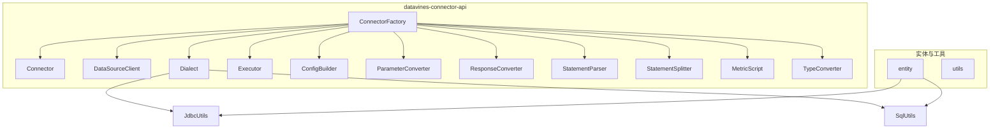
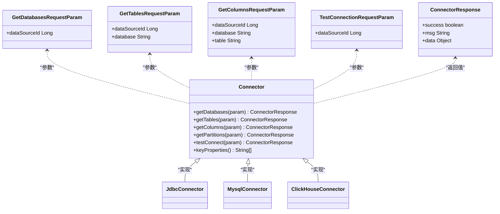
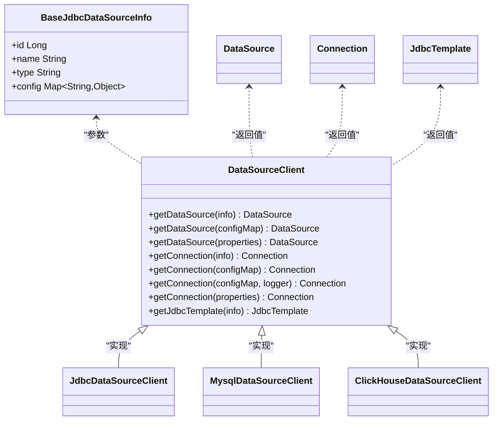
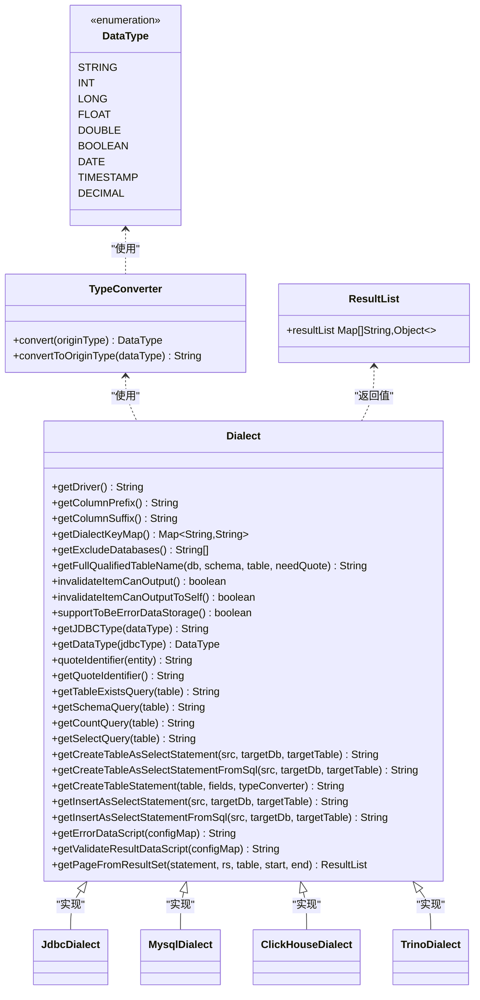
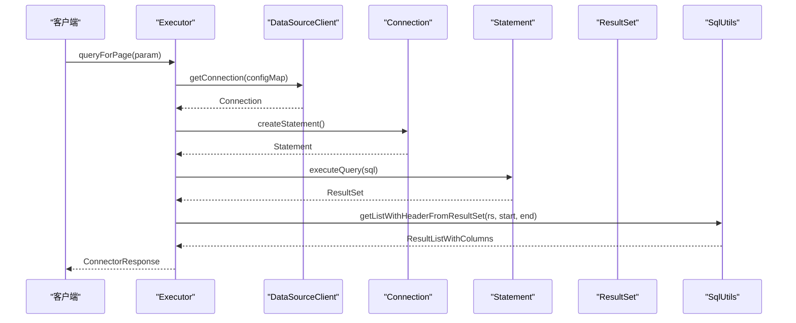
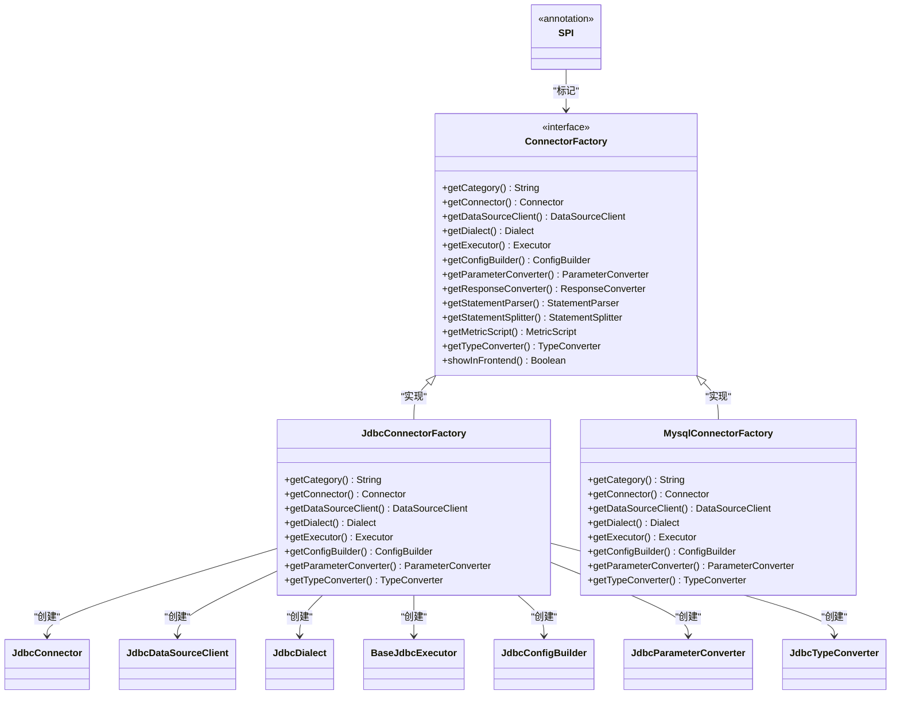
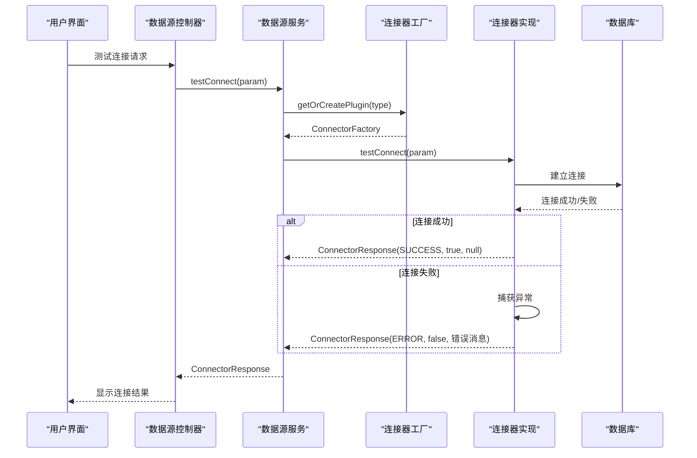
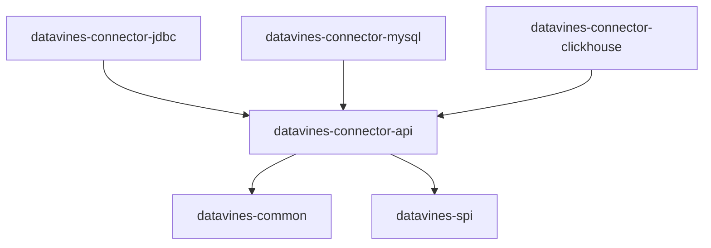

# 连接器API核心

<cite>
**本文档中引用的文件**
- [Connector.java](file://datavines-connector/datavines-connector-api/src/main/java/io/datavines/connector/api/Connector.java)
- [DataSourceClient.java](file://datavines-connector/datavines-connector-api/src/main/java/io/datavines/connector/api/DataSourceClient.java)
- [Dialect.java](file://datavines-connector/datavines-connector-api/src/main/java/io/datavines/connector/api/Dialect.java)
- [Executor.java](file://datavines-connector/datavines-connector-api/src/main/java/io/datavines/connector/api/Executor.java)
- [ConnectorFactory.java](file://datavines-connector/datavines-connector-api/src/main/java/io/datavines/connector/api/ConnectorFactory.java)
- [ConfigBuilder.java](file://datavines-connector/datavines-connector-api/src/main/java/io/datavines/connector/api/ConfigBuilder.java)
- [ParameterConverter.java](file://datavines-connector/datavines-connector-api/src/main/java/io/datavines/connector/api/ParameterConverter.java)
- [ResponseConverter.java](file://datavines-connector/datavines-connector-api/src/main/java/io/datavines/connector/api/ResponseConverter.java)
- [StatementParser.java](file://datavines-connector/datavines-connector-api/src/main/java/io/datavines/connector/api/StatementParser.java)
- [StatementSplitter.java](file://datavines-connector/datavines-connector-api/src/main/java/io/datavines/connector/api/StatementSplitter.java)
- [MetricScript.java](file://datavines-connector/datavines-connector-api/src/main/java/io/datavines/connector/api/MetricScript.java)
- [TypeConverter.java](file://datavines-connector/datavines-connector-api/src/main/java/io/datavines/connector/api/TypeConverter.java)
- [ResultList.java](file://datavines-connector/datavines-connector-api/src/main/java/io/datavines/connector/api/entity/ResultList.java)
- [QueryColumn.java](file://datavines-connector/datavines-connector-api/src/main/java/io/datavines/connector/api/entity/QueryColumn.java)
- [JdbcUtils.java](file://datavines-connector/datavines-connector-api/src/main/java/io/datavines/connector/api/utils/JdbcUtils.java)
- [SqlUtils.java](file://datavines-connector/datavines-connector-api/src/main/java/io/datavines/connector/api/utils/SqlUtils.java)
- [ConnectorResponse.java](file://datavines-common/src/main/java/io/datavines/common/param/ConnectorResponse.java)
- [TestConnectionRequestParam.java](file://datavines-common/src/main/java/io/datavines/common/param/TestConnectionRequestParam.java)
- [JdbcConnector.java](file://datavines-connector/datavines-connector-plugins/datavines-connector-jdbc/src/main/java/io/datavines/connector/plugin/JdbcConnector.java)
- [MongodbConnector.java](file://datavines-connector/datavines-connector-plugins/datavines-connector-mongodb/src/main/java/io/datavines/connector/plugin/MongodbConnector.java)
- [MaxComputeConnector.java](file://datavines-connector/datavines-connector-plugins/datavines-connector-maxcompute/src/main/java/io/datavines/connector/plugin/MaxComputeConnector.java)
- [DatabendConnector.java](file://datavines-connector/datavines-connector-plugins/datavines-connector-databend/src/main/java/io/datavines/connector/plugin/DatabendConnector.java)
- [HiveConnector.java](file://datavines-connector/datavines-connector-plugins/datavines-connector-hive/src/main/java/io/datavines/connector/plugin/HiveConnector.java)
- [PrestoConnector.java](file://datavines-connector/datavines-connector-plugins/datavines-connector-presto/src/main/java/io/datavines/connector/plugin/PrestoConnector.java)
- [TrinoConnector.java](file://datavines-connector/datavines-connector-plugins/datavines-connector-trino/src/main/java/io/datavines/connector/plugin/TrinoConnector.java)
- [DataSourceServiceImpl.java](file://datavines-server/src/main/java/io/datavines/server/repository/service/impl/DataSourceServiceImpl.java)
- [ErrorDataStorageController.java](file://datavines-server/src/main/java/io/datavines/server/api/controller/ErrorDataStorageController.java)
</cite>

## 更新摘要
**所做的更改**
- 更新了Connector接口的testConnect方法说明，强调了改进的错误报告机制
- 新增了ConnectorResponse错误消息处理的最佳实践章节
- 更新了连接器测试连接的错误处理流程图
- 增强了故障排除指南中关于错误报告的内容

## 目录
1. [引言](#引言)
2. [项目结构](#项目结构)
3. [核心组件](#核心组件)
4. [架构概述](#架构概述)
5. [详细组件分析](#详细组件分析)
6. [错误报告机制改进](#错误报告机制改进)
7. [依赖分析](#依赖分析)
8. [性能考虑](#性能考虑)
9. [故障排除指南](#故障排除指南)
10. [结论](#结论)

## 引言
本文档深入解析DataVines连接器API模块的设计与实现，重点阐述Connector、DataSourceClient、Dialect和Executor等核心接口的契约与职责。文档详细描述了基于SPI的插件机制如何实现连接器的可扩展性，分析了连接参数构建、SQL执行、元数据获取和方言处理的抽象设计。通过接口契约的详细说明，包括方法签名、参数约束和异常处理，为开发者提供清晰的实现指导。同时，文档包含连接器生命周期管理的最佳实践和线程安全考虑。

**更新** 本次更新重点关注连接器错误报告机制的改进，所有连接器的testConnect方法都增强了详细的异常捕获和错误消息返回，确保错误信息的一致性和可诊断性。

## 项目结构
datavines-connector-api模块是DataVines数据质量平台的核心组件之一，提供了连接各种数据源的标准接口和抽象。该模块采用接口驱动的设计，通过SPI（Service Provider Interface）机制实现插件化扩展，允许为不同的数据库系统（如MySQL、PostgreSQL、ClickHouse等）提供具体的实现。

**图表来源**
- [ConnectorFactory.java](file://datavines-connector/datavines-connector-api/src/main/java/io/datavines/connector/api/ConnectorFactory.java)
- [JdbcUtils.java](file://datavines-connector/datavines-connector-api/src/main/java/io/datavines/connector/api/utils/JdbcUtils.java)
- [SqlUtils.java](file://datavines-connector/datavines-connector-api/src/main/java/io/datavines/connector/api/utils/SqlUtils.java)

**章节来源**
- [ConnectorFactory.java](file://datavines-connector/datavines-connector-api/src/main/java/io/datavines/connector/api/ConnectorFactory.java)

## 核心组件
datavines-connector-api模块的核心在于其定义的一系列接口，这些接口共同构成了一个可扩展的连接器框架。`ConnectorFactory`作为入口点，通过SPI机制加载具体的连接器实现。`Connector`接口负责元数据的获取，如数据库、表和列的列表。`DataSourceClient`负责管理数据源连接的生命周期，提供获取`DataSource`、`Connection`和`JdbcTemplate`的能力。`Dialect`接口封装了特定数据库的SQL方言和元数据处理逻辑，是实现数据库兼容性的关键。`Executor`接口则负责SQL语句的执行，包括查询和数据操作。`ParameterConverter`和`ResponseConverter`分别处理连接参数的转换和执行结果的格式化，而`ConfigBuilder`用于构建前端配置表单。

**章节来源**
- [Connector.java](file://datavines-connector/datavines-connector-api/src/main/java/io/datavines/connector/api/Connector.java)
- [DataSourceClient.java](file://datavines-connector/datavines-connector-api/src/main/java/io/datavines/connector/api/DataSourceClient.java)
- [Dialect.java](file://datavines-connector/datavines-connector-api/src/main/java/io/datavines/connector/api/Dialect.java)
- [Executor.java](file://datavines-connector/datavines-connector-api/src/main/java/io/datavines/connector/api/Executor.java)
- [ConnectorFactory.java](file://datavines-connector/datavines-connector-api/src/main/java/io/datavines/connector/api/ConnectorFactory.java)

## 架构概述
datavines-connector-api的架构设计遵循了依赖倒置原则（DIP），高层模块（如数据质量检查服务）依赖于抽象（接口），而不是具体的实现。这种设计使得系统可以轻松地集成新的数据源，而无需修改核心业务逻辑。

```mermaid
classDiagram
class ConnectorFactory {
+getCategory() String
+getConnector() Connector
+getDataSourceClient() DataSourceClient
+getDialect() Dialect
+getExecutor() Executor
+getConfigBuilder() ConfigBuilder
+getParameterConverter() ParameterConverter
+getResponseConverter() ResponseConverter
+getStatementParser() StatementParser
+getStatementSplitter() StatementSplitter
+getMetricScript() MetricScript
+getTypeConverter() TypeConverter
+showInFrontend() Boolean
}
class Connector {
+getDatabases(param) ConnectorResponse
+getTables(param) ConnectorResponse
+getColumns(param) ConnectorResponse
+getPartitions(param) ConnectorResponse
+testConnect(param) ConnectorResponse
+keyProperties() String[]
}
class DataSourceClient {
+getDataSource(info) DataSource
+getDataSource(configMap) DataSource
+getDataSource(properties) DataSource
+getConnection(info) Connection
+getConnection(configMap) Connection
+getConnection(configMap, logger) Connection
+getConnection(properties) Connection
+getJdbcTemplate(info) JdbcTemplate
}
class Dialect {
+getDriver() String
+getColumnPrefix() String
+getColumnSuffix() String
+getDialectKeyMap() Map~String,String~
+getExcludeDatabases() String[]
+getFullQualifiedTableName(db, schema, table, needQuote) String
+invalidateItemCanOutput() boolean
+invalidateItemCanOutputToSelf() boolean
+supportToBeErrorDataStorage() boolean
+getJDBCType(dataType) String
+getDataType(jdbcType) DataType
+quoteIdentifier(entity) String
+getQuoteIdentifier() String
+getTableExistsQuery(table) String
+getSchemaQuery(table) String
+getCountQuery(table) String
+getSelectQuery(table) String
+getCreateTableAsSelectStatement(src, targetDb, targetTable) String
+getCreateTableAsSelectStatementFromSql(src, targetDb, targetTable) String
+getCreateTableStatement(table, fields, typeConverter) String
+getInsertAsSelectStatement(src, targetDb, targetTable) String
+getInsertAsSelectStatementFromSql(src, targetDb, targetTable) String
+getErrorDataScript(configMap) String
+getValidateResultDataScript(configMap) String
+getPageFromResultSet(statement, rs, table, start, end) ResultList
}
class Executor {
+queryForPage(param) ConnectorResponse
+queryForList(param) ConnectorResponse
+queryForOne(param) ConnectorResponse
+deleteData(param) ConnectorResponse
}
class ConfigBuilder {
+build(isEn) String
+buildErrorDataStorage(isEn) String
}
class ParameterConverter {
+converter(parameter) Map~String,Object~
+getConnectorUUID(parameter) String
}
class ResponseConverter {
}
class StatementParser {
+parseStatement(statement) StatementMetadataFragment
}
class StatementSplitter {
+splitStatements(body) String[]
}
class MetricScript {
+selectFromTable() String
+baseActualValue(uniqueKey) String
+baseDirectActualValue(uniqueKey, invalidateItemsSql) String
+avgActualValue(uniqueKey) String
+avgLengthActualValue(uniqueKey) String
+countDistinctActualValue(uniqueKey) String
+histogramActualValue(uniqueKey, where) String
+maxActualValue(uniqueKey) String
+maxLengthActualValue(uniqueKey) String
+minActualValue(uniqueKey) String
+minLengthActualValue(uniqueKey) String
+stdDevActualValue(uniqueKey) String
+sumActualValue(uniqueKey) String
+varianceActualValue(uniqueKey) String
+groupByHavingCountForUnique() String
+groupByHavingCountForDuplicate() String
+columnInEnums() String
+columnNotInEnums() String
+columnNotNull() String
+columnIsNull() String
+columnLengthCompare() String
+columnNotMatchRegex() String
+columnMatchRegex() String
+columnGteMin() String
+columnLteMax() String
+columnIsBlank() String
+timeBetweenWithFormat() String
+dailyAvg(uniqueKey) String
+last7DayAvg(uniqueKey) String
+last30DayAvg(uniqueKey) String
+monthlyAvg(uniqueKey) String
+weeklyAvg(uniqueKey) String
}
class TypeConverter {
+convert(originType) DataType
+convertToOriginType(dataType) String
}
ConnectorFactory <|-- JdbcConnectorFactory : "实现"
ConnectorFactory <|-- MysqlConnectorFactory : "实现"
ConnectorFactory <|-- ClickHouseConnectorFactory : "实现"
ConnectorFactory <|-- TrinoConnectorFactory : "实现"
ConnectorFactory --> Connector : "创建"
ConnectorFactory --> DataSourceClient : "创建"
ConnectorFactory --> Dialect : "创建"
ConnectorFactory --> Executor : "创建"
ConnectorFactory --> ConfigBuilder : "创建"
ConnectorFactory --> ParameterConverter : "创建"
ConnectorFactory --> ResponseConverter : "创建"
ConnectorFactory --> StatementParser : "创建"
ConnectorFactory --> StatementSplitter : "创建"
ConnectorFactory --> MetricScript : "创建"
ConnectorFactory --> TypeConverter : "创建"
Dialect --> TypeConverter : "使用"
Executor --> DataSourceClient : "使用"
SqlUtils --> Dialect : "使用"
JdbcUtils --> Dialect : "使用"
JdbcUtils --> TypeConverter : "使用"
```

**图表来源**
- [ConnectorFactory.java](file://datavines-connector/datavines-connector-api/src/main/java/io/datavines/connector/api/ConnectorFactory.java)
- [Connector.java](file://datavines-connector/datavines-connector-api/src/main/java/io/datavines/connector/api/Connector.java)
- [DataSourceClient.java](file://datavines-connector/datavines-connector-api/src/main/java/io/datavines/connector/api/DataSourceClient.java)
- [Dialect.java](file://datavines-connector/datavines-connector-api/src/main/java/io/datavines/connector/api/Dialect.java)
- [Executor.java](file://datavines-connector/datavines-connector-api/src/main/java/io/datavines/connector/api/Executor.java)
- [ConfigBuilder.java](file://datavines-connector/datavines-connector-api/src/main/java/io/datavines/connector/api/ConfigBuilder.java)
- [ParameterConverter.java](file://datavines-connector/datavines-connector-api/src/main/java/io/datavines/connector/api/ParameterConverter.java)
- [ResponseConverter.java](file://datavines-connector/datavines-connector-api/src/main/java/io/datavines/connector/api/ResponseConverter.java)
- [StatementParser.java](file://datavines-connector/datavines-connector-api/src/main/java/io/datavines/connector/api/StatementParser.java)
- [StatementSplitter.java](file://datavines-connector/datavines-connector-api/src/main/java/io/datavines/connector/api/StatementSplitter.java)
- [MetricScript.java](file://datavines-connector/datavines-connector-api/src/main/java/io/datavines/connector/api/MetricScript.java)
- [TypeConverter.java](file://datavines-connector/datavines-connector-api/src/main/java/io/datavines/connector/api/TypeConverter.java)
- [JdbcUtils.java](file://datavines-connector/datavines-connector-api/src/main/java/io/datavines/connector/api/utils/JdbcUtils.java)
- [SqlUtils.java](file://datavines-connector/datavines-connector-api/src/main/java/io/datavines/connector/api/utils/SqlUtils.java)

## 详细组件分析

### Connector接口分析
`Connector`接口是所有数据源连接器的基础，定义了与数据源进行交互的核心元数据操作。它提供了获取数据库列表、表列表、列列表、分区信息以及测试连接的功能。该接口采用默认方法（default methods）模式，允许实现类只覆盖其支持的操作，对于不支持的操作返回null。`keyProperties()`方法返回连接器的关键属性列表，用于生成连接器的唯一标识。

**更新** testConnect方法现在要求所有连接器实现都提供详细的错误报告，确保用户能够获得一致的错误信息体验。

**图表来源**
- [Connector.java](file://datavines-connector/datavines-connector-api/src/main/java/io/datavines/connector/api/Connector.java)

**章节来源**
- [Connector.java](file://datavines-connector/datavines-connector-api/src/main/java/io/datavines/connector/api/Connector.java)

### DataSourceClient接口分析
`DataSourceClient`接口负责管理与数据源的连接。它提供了多种方式来获取`DataSource`、`Connection`和`JdbcTemplate`，支持从`BaseJdbcDataSourceInfo`对象、`Map<String, Object>`配置映射或`Properties`对象创建连接。这种设计提供了极大的灵活性，允许连接器根据不同的配置源进行初始化。该接口是连接器与底层JDBC驱动之间的桥梁，确保了连接的正确建立和管理。

**图表来源**
- [DataSourceClient.java](file://datavines-connector/datavines-connector-api/src/main/java/io/datavines/connector/api/DataSourceClient.java)

**章节来源**
- [DataSourceClient.java](file://datavines-connector/datavines-connector-api/src/main/java/io/datavines/connector/api/DataSourceClient.java)

### Dialect接口分析
`Dialect`接口是实现数据库兼容性的核心。它封装了特定数据库的SQL方言、元数据处理和类型转换逻辑。接口提供了生成数据库驱动类名、标识符引号、各种SQL查询语句（如检查表是否存在、获取表结构、创建表等）的方法。`getPageFromResultSet`方法用于从结果集中提取分页数据，是实现数据预览功能的关键。`TypeConverter`被`Dialect`使用，以实现数据库特定类型与DataVines通用`DataType`枚举之间的双向转换。

**图表来源**
- [Dialect.java](file://datavines-connector/datavines-connector-api/src/main/java/io/datavines/connector/api/Dialect.java)
- [TypeConverter.java](file://datavines-connector/datavines-connector-api/src/main/java/io/datavines/connector/api/TypeConverter.java)

**章节来源**
- [Dialect.java](file://datavines-connector/datavines-connector-api/src/main/java/io/datavines/connector/api/Dialect.java)

### Executor接口分析
`Executor`接口负责执行SQL脚本和查询。它定义了`queryForPage`、`queryForList`和`queryForOne`等方法，用于执行查询并返回分页、列表或单条记录的结果。`deleteData`方法用于执行数据删除操作。该接口的实现通常会依赖`DataSourceClient`来获取数据库连接，并使用`Dialect`来处理特定于数据库的查询逻辑。`SqlUtils`工具类为`Executor`的实现提供了从`ResultSet`提取数据的通用方法。

**图表来源**
- [Executor.java](file://datavines-connector/datavines-connector-api/src/main/java/io/datavines/connector/api/Executor.java)
- [DataSourceClient.java](file://datavines-connector/datavines-connector-api/src/main/java/io/datavines/connector/api/DataSourceClient.java)
- [SqlUtils.java](file://datavines-connector/datavines-connector-api/src/main/java/io/datavines/connector/api/utils/SqlUtils.java)

**章节来源**
- [Executor.java](file://datavines-connector/datavines-connector-api/src/main/java/io/datavines/connector/api/Executor.java)

### ConnectorFactory接口分析
`ConnectorFactory`是整个连接器API的入口点和工厂。它被`@SPI`注解标记，表明它是一个服务提供者接口，可以通过Java的SPI机制动态加载。每个具体的连接器（如MySQL、PostgreSQL）都必须提供一个`ConnectorFactory`的实现。该工厂负责创建连接器所需的所有组件：`Connector`、`DataSourceClient`、`Dialect`、`Executor`等。`getCategory()`方法返回连接器的类别（如"jdbc"），`showInFrontend()`方法决定该连接器是否在前端UI中显示。

**图表来源**
- [ConnectorFactory.java](file://datavines-connector/datavines-connector-api/src/main/java/io/datavines/connector/api/ConnectorFactory.java)

**章节来源**
- [ConnectorFactory.java](file://datavines-connector/datavines-connector-api/src/main/java/io/datavines/connector/api/ConnectorFactory.java)

## 错误报告机制改进

### 统一的错误报告标准
所有连接器的testConnect方法现在都实现了统一的错误报告机制，确保用户能够获得一致且有用的错误信息。这种改进提高了系统的可诊断性和用户体验。

**图表来源**
- [DataSourceServiceImpl.java](file://datavines-server/src/main/java/io/datavines/server/repository/service/impl/DataSourceServiceImpl.java)
- [JdbcConnector.java](file://datavines-connector/datavines-connector-plugins/datavines-connector-jdbc/src/main/java/io/datavines/connector/plugin/JdbcConnector.java)
- [MongodbConnector.java](file://datavines-connector/datavines-connector-plugins/datavines-connector-mongodb/src/main/java/io/datavines/connector/plugin/MongodbConnector.java)
- [MaxComputeConnector.java](file://datavines-connector/datavines-connector-plugins/datavines-connector-maxcompute/src/main/java/io/datavines/connector/plugin/MaxComputeConnector.java)

### 错误消息处理最佳实践
连接器实现中的错误消息处理遵循以下最佳实践：

1. **详细的异常捕获**：所有testConnect方法都使用try-catch块捕获可能的异常
2. **有意义的错误消息**：错误消息应该清楚地描述问题所在
3. **一致的状态码**：使用ConnectorResponse.Status.ERROR表示失败状态
4. **完整的错误上下文**：在日志中记录详细的错误上下文信息

**章节来源**
- [JdbcConnector.java](file://datavines-connector/datavines-connector-plugins/datavines-connector-jdbc/src/main/java/io/datavines/connector/plugin/JdbcConnector.java)
- [MongodbConnector.java](file://datavines-connector/datavines-connector-plugins/datavines-connector-mongodb/src/main/java/io/datavines/connector/plugin/MongodbConnector.java)
- [MaxComputeConnector.java](file://datavines-connector/datavines-connector-plugins/datavines-connector-maxcompute/src/main/java/io/datavines/connector/plugin/MaxComputeConnector.java)
- [DatabendConnector.java](file://datavines-connector/datavines-connector-plugins/datavines-connector-databend/src/main/java/io/datavines/connector/plugin/DatabendConnector.java)
- [HiveConnector.java](file://datavines-connector/datavines-connector-plugins/datavines-connector-hive/src/main/java/io/datavines/connector/plugin/HiveConnector.java)
- [PrestoConnector.java](file://datavines-connector/datavines-connector-plugins/datavines-connector-presto/src/main/java/io/datavines/connector/plugin/PrestoConnector.java)
- [TrinoConnector.java](file://datavines-connector/datavines-connector-plugins/datavines-connector-trino/src/main/java/io/datavines/connector/plugin/TrinoConnector.java)

## 依赖分析
datavines-connector-api模块通过SPI机制与具体的连接器实现（如`datavines-connector-jdbc`、`datavines-connector-mysql`）进行解耦。核心API模块定义了所有必要的接口，而具体的实现模块则提供这些接口的实例。`datavines-common`模块提供了通用的配置、参数和异常处理类，被连接器API所依赖。`datavines-spi`模块提供了SPI加载机制，是实现插件化扩展的基础。

**图表来源**
- [pom.xml](file://datavines-connector/datavines-connector-api/pom.xml)
- [pom.xml](file://datavines-connector/datavines-connector-jdbc/pom.xml)
- [pom.xml](file://datavines-connector/datavines-connector-mysql/pom.xml)

**章节来源**
- [pom.xml](file://datavines-connector/datavines-connector-api/pom.xml)

## 性能考虑
在实现连接器时，性能是一个重要的考虑因素。`DataSourceClient`应确保`DataSource`的复用，避免为每次操作都创建新的连接池。`Executor`在执行查询时，应合理设置查询超时时间，并在处理大型结果集时使用分页。`Dialect`的`getPageFromResultSet`方法通过`ResultSet.absolute()`来实现分页，这在某些数据库上可能效率不高，应根据具体数据库的特性进行优化。此外，`ParameterConverter`中的`getConnectorUUID`方法使用MD5哈希生成连接器的唯一标识，这有助于缓存和连接池管理。

## 故障排除指南
当连接器出现问题时，应首先检查`DataSourceClient`能否成功建立连接。如果连接失败，检查连接参数（URL、用户名、密码）是否正确，并确认数据库驱动是否已正确加载。如果查询执行失败，检查`Dialect`生成的SQL语句是否符合目标数据库的语法。可以启用日志记录来跟踪`Executor`执行的SQL语句和返回的错误信息。对于元数据获取问题，检查`Connector`接口的实现是否正确处理了`GetDatabasesRequestParam`、`GetTablesRequestParam`等请求参数。

**更新** 现在所有连接器都实现了统一的错误报告机制，用户可以通过以下方式获取详细的错误信息：

1. **检查服务器日志**：连接器会在日志中记录详细的错误上下文
2. **验证连接参数**：确保连接字符串、用户名和密码正确无误
3. **网络连通性**：确认客户端能够访问目标数据库服务器
4. **权限验证**：检查数据库用户是否有足够的权限

**章节来源**
- [DataSourceClient.java](file://datavines-connector/datavines-connector-api/src/main/java/io/datavines/connector/api/DataSourceClient.java)
- [Executor.java](file://datavines-connector/datavines-connector-api/src/main/java/io/datavines/connector/api/Executor.java)
- [Connector.java](file://datavines-connector/datavines-connector-api/src/main/java/io/datavines/connector/api/Connector.java)
- [ConnectorResponse.java](file://datavines-common/src/main/java/io/datavines/common/param/ConnectorResponse.java)

## 结论
datavines-connector-api模块通过精心设计的接口和SPI插件机制，为DataVines平台提供了强大的数据源连接能力。其核心接口`Connector`、`DataSourceClient`、`Dialect`和`Executor`清晰地划分了职责，使得开发者可以轻松地为新的数据库系统创建连接器。`ConnectorFactory`作为统一的工厂，确保了组件的可配置性和可扩展性。

**更新** 本次更新显著改进了连接器的错误报告机制，所有连接器的testConnect方法现在都提供了详细、一致的错误信息，大大提升了系统的可诊断性和用户体验。通过遵循本文档中描述的设计原则和最佳实践，可以构建出高效、稳定且易于维护的连接器实现。