# datavines-engine模块

<cite>
**本文档中引用的文件**  
- [README.md](file://datavines-engine/README.md)
- [pom.xml](file://datavines-engine/pom.xml)
- [EngineConstants.java](file://datavines-engine/datavines-engine-api/src/main/java/io/datavines/engine/api/EngineConstants.java)
- [EngineExecutor.java](file://datavines-engine/datavines-engine-api/src/main/java/io/datavines/engine/api/engine/EngineExecutor.java)
- [RuntimeEnvironment.java](file://datavines-engine/datavines-engine-api/src/main/java/io/datavines/engine/api/env/RuntimeEnvironment.java)
- [Execution.java](file://datavines-engine/datavines-engine-api/src/main/java/io/datavines/engine/api/env/Execution.java)
- [Component.java](file://datavines-engine/datavines-engine-api/src/main/java/io/datavines/engine/api/component/Component.java)
- [Plugin.java](file://datavines-engine/datavines-engine-api/src/main/java/io/datavines/engine/api/plugin/Plugin.java)
- [BaseDataVinesBootstrap.java](file://datavines-engine/datavines-engine-core/src/main/java/io/datavines/engine/core/BaseDataVinesBootstrap.java)
- [BaseJobConfigurationBuilder.java](file://datavines-engine/datavines-engine-config/src/main/java/io/datavines/engine/config/BaseJobConfigurationBuilder.java)
- [DataVinesConfigurationManager.java](file://datavines-engine/datavines-engine-config/src/main/java/io/datavines/engine/config/DataVinesConfigurationManager.java)
- [AbstractEngineExecutor.java](file://datavines-engine/datavines-engine-executor/src/main/java/io/datavines/engine/executor/core/base/AbstractEngineExecutor.java)
- [AbstractLivyEngineExecutor.java](file://datavines-engine/datavines-engine-executor/src/main/java/io/datavines/engine/executor/core/base/AbstractLivyEngineExecutor.java)
- [AbstractYarnEngineExecutor.java](file://datavines-engine/datavines-engine-executor/src/main/java/io/datavines/engine/executor/core/base/AbstractYarnEngineExecutor.java)
</cite>

## 目录
1. [引言](#引言)
2. [项目结构](#项目结构)
3. [核心组件](#核心组件)
4. [架构概述](#架构概述)
5. [详细组件分析](#详细组件分析)
6. [依赖分析](#依赖分析)
7. [性能考虑](#性能考虑)
8. [故障排查指南](#故障排查指南)
9. [结论](#结论)

## 引言

datavines-engine模块是DataVines数据质量平台的核心执行引擎，负责任务执行、资源配置、引擎抽象和作业配置构建等关键功能。该模块设计为可扩展的架构，支持多种执行引擎，包括Flink、Spark和本地执行模式。通过标准化的接口和配置管理，datavines-engine实现了不同执行环境之间的无缝切换和统一管理。

## 项目结构

datavines-engine模块采用模块化设计，包含多个子模块，每个子模块负责特定的功能。这种设计使得系统具有良好的可扩展性和维护性。

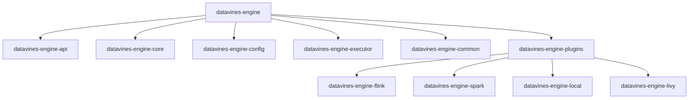

**图源**  
- [pom.xml](file://datavines-engine/pom.xml)

**本节来源**  
- [README.md](file://datavines-engine/README.md)
- [pom.xml](file://datavines-engine/pom.xml)

## 核心组件

datavines-engine模块的核心组件包括引擎执行器、运行时环境、执行接口、组件接口和插件接口。这些组件共同构成了执行引擎的基础架构。

**本节来源**  
- [EngineConstants.java](file://datavines-engine/datavines-engine-api/src/main/java/io/datavines/engine/api/EngineConstants.java)
- [EngineExecutor.java](file://datavines-engine/datavines-engine-api/src/main/java/io/datavines/engine/api/engine/EngineExecutor.java)
- [RuntimeEnvironment.java](file://datavines-engine/datavines-engine-api/src/main/java/io/datavines/engine/api/env/RuntimeEnvironment.java)
- [Execution.java](file://datavines-engine/datavines-engine-api/src/main/java/io/datavines/engine/api/env/Execution.java)
- [Component.java](file://datavines-engine/datavines-engine-api/src/main/java/io/datavines/engine/api/component/Component.java)
- [Plugin.java](file://datavines-engine/datavines-engine-api/src/main/java/io/datavines/engine/api/plugin/Plugin.java)

## 架构概述

datavines-engine模块的架构设计遵循了分层和模块化的原则，确保了系统的可扩展性和可维护性。

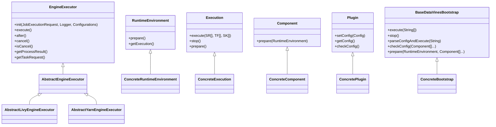

**图源**  
- [EngineExecutor.java](file://datavines-engine/datavines-engine-api/src/main/java/io/datavines/engine/api/engine/EngineExecutor.java)
- [RuntimeEnvironment.java](file://datavines-engine/datavines-engine-api/src/main/java/io/datavines/engine/api/env/RuntimeEnvironment.java)
- [Execution.java](file://datavines-engine/datavines-engine-api/src/main/java/io/datavines/engine/api/env/Execution.java)
- [Component.java](file://datavines-engine/datavines-engine-api/src/main/java/io/datavines/engine/api/component/Component.java)
- [Plugin.java](file://datavines-engine/datavines-engine-api/src/main/java/io/datavines/engine/api/plugin/Plugin.java)
- [BaseDataVinesBootstrap.java](file://datavines-engine/datavines-engine-core/src/main/java/io/datavines/engine/core/BaseDataVinesBootstrap.java)

## 详细组件分析

### 引擎执行器分析

引擎执行器是datavines-engine模块的核心组件之一，负责任务的执行和管理。

#### 引擎执行器接口
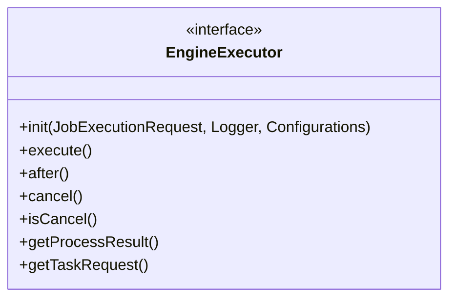

**图源**  
- [EngineExecutor.java](file://datavines-engine/datavines-engine-api/src/main/java/io/datavines/engine/api/engine/EngineExecutor.java)

#### 抽象引擎执行器
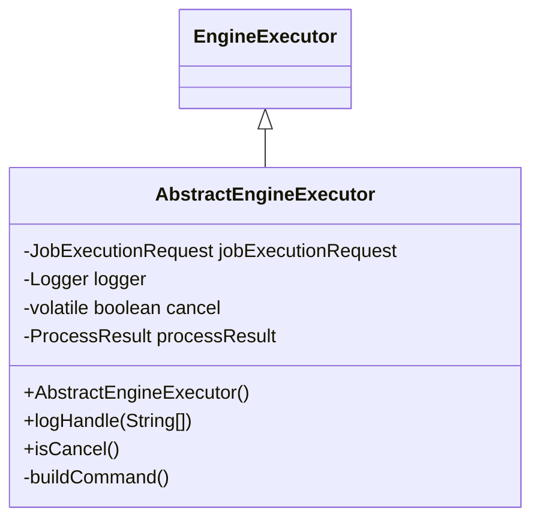

**图源**  
- [AbstractEngineExecutor.java](file://datavines-engine/datavines-engine-executor/src/main/java/io/datavines/engine/executor/core/base/AbstractEngineExecutor.java)

#### Livy引擎执行器
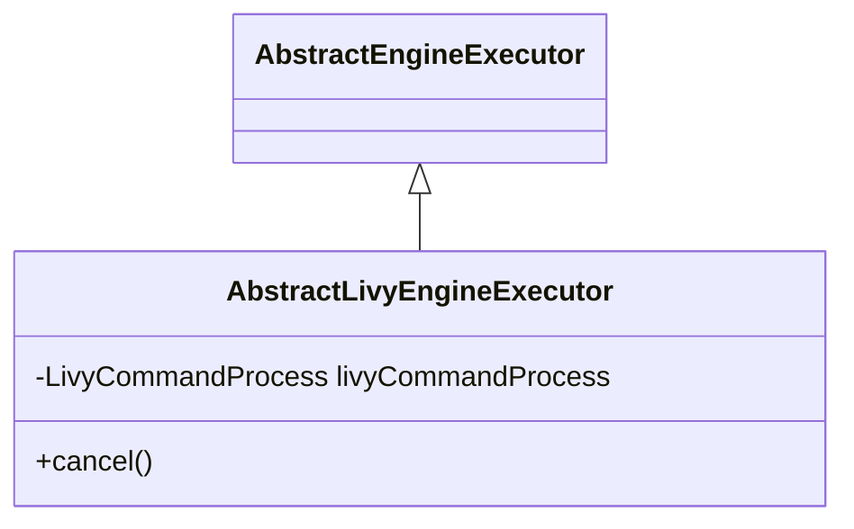

**图源**  
- [AbstractLivyEngineExecutor.java](file://datavines-engine/datavines-engine-executor/src/main/java/io/datavines/engine/executor/core/base/AbstractLivyEngineExecutor.java)

#### Yarn引擎执行器
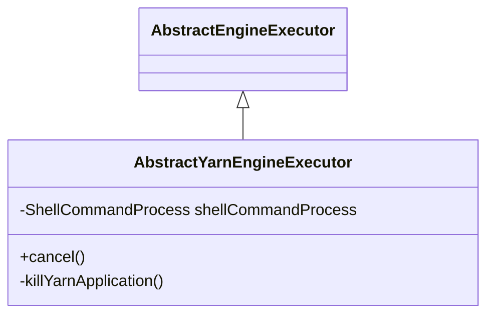

**图源**  
- [AbstractYarnEngineExecutor.java](file://datavines-engine/datavines-engine-executor/src/main/java/io/datavines/engine/executor/core/base/AbstractYarnEngineExecutor.java)

**本节来源**  
- [EngineExecutor.java](file://datavines-engine/datavines-engine-api/src/main/java/io/datavines/engine/api/engine/EngineExecutor.java)
- [AbstractEngineExecutor.java](file://datavines-engine/datavines-engine-executor/src/main/java/io/datavines/engine/executor/core/base/AbstractEngineExecutor.java)
- [AbstractLivyEngineExecutor.java](file://datavines-engine/datavines-engine-executor/src/main/java/io/datavines/engine/executor/core/base/AbstractLivyEngineExecutor.java)
- [AbstractYarnEngineExecutor.java](file://datavines-engine/datavines-engine-executor/src/main/java/io/datavines/engine/executor/core/base/AbstractYarnEngineExecutor.java)

### 运行时环境分析

运行时环境负责准备执行环境和获取执行实例。

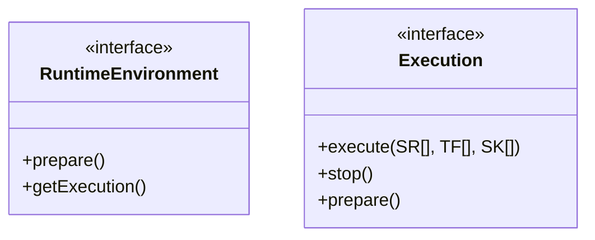

**图源**  
- [RuntimeEnvironment.java](file://datavines-engine/datavines-engine-api/src/main/java/io/datavines/engine/api/env/RuntimeEnvironment.java)
- [Execution.java](file://datavines-engine/datavines-engine-api/src/main/java/io/datavines/engine/api/env/Execution.java)

**本节来源**  
- [RuntimeEnvironment.java](file://datavines-engine/datavines-engine-api/src/main/java/io/datavines/engine/api/env/RuntimeEnvironment.java)
- [Execution.java](file://datavines-engine/datavines-engine-api/src/main/java/io/datavines/engine/api/env/Execution.java)

### 组件和插件分析

组件和插件接口为datavines-engine提供了可扩展的基础。

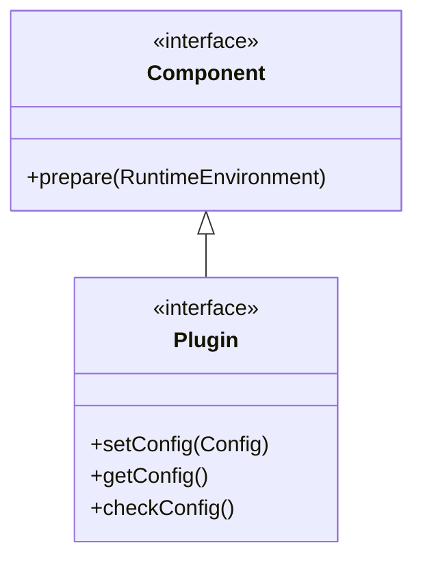

**图源**  
- [Component.java](file://datavines-engine/datavines-engine-api/src/main/java/io/datavines/engine/api/component/Component.java)
- [Plugin.java](file://datavines-engine/datavines-engine-api/src/main/java/io/datavines/engine/api/plugin/Plugin.java)

**本节来源**  
- [Component.java](file://datavines-engine/datavines-engine-api/src/main/java/io/datavines/engine/api/component/Component.java)
- [Plugin.java](file://datavines-engine/datavines-engine-api/src/main/java/io/datavines/engine/api/plugin/Plugin.java)

### 引擎抽象分析

引擎抽象层通过BaseDataVinesBootstrap类提供了统一的执行入口。

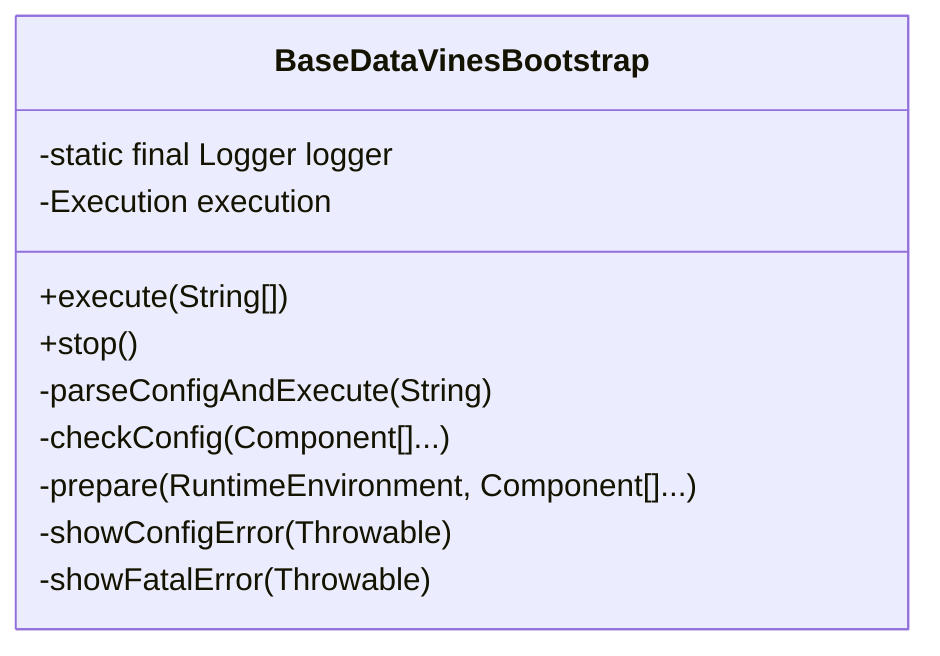

**图源**  
- [BaseDataVinesBootstrap.java](file://datavines-engine/datavines-engine-core/src/main/java/io/datavines/engine/core/BaseDataVinesBootstrap.java)

**本节来源**  
- [BaseDataVinesBootstrap.java](file://datavines-engine/datavines-engine-core/src/main/java/io/datavines/engine/core/BaseDataVinesBootstrap.java)

### 作业配置构建分析

作业配置构建器负责将标准的DataVines配置转换为特定引擎的配置。

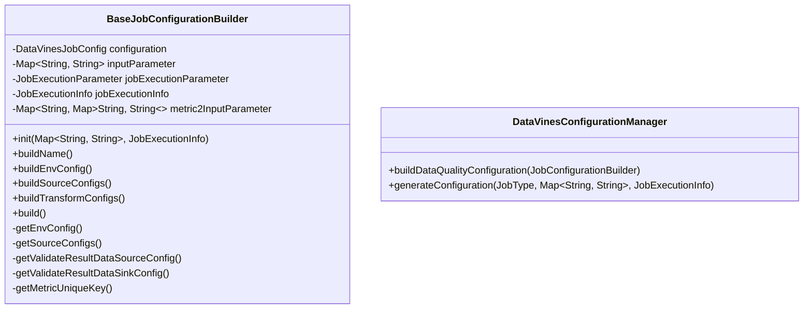

**图源**  
- [BaseJobConfigurationBuilder.java](file://datavines-engine/datavines-engine-config/src/main/java/io/datavines/engine/config/BaseJobConfigurationBuilder.java)
- [DataVinesConfigurationManager.java](file://datavines-engine/datavines-engine-config/src/main/java/io/datavines/engine/config/DataVinesConfigurationManager.java)

**本节来源**  
- [BaseJobConfigurationBuilder.java](file://datavines-engine/datavines-engine-config/src/main/java/io/datavines/engine/config/BaseJobConfigurationBuilder.java)
- [DataVinesConfigurationManager.java](file://datavines-engine/datavines-engine-config/src/main/java/io/datavines/engine/config/DataVinesConfigurationManager.java)

## 依赖分析

datavines-engine模块依赖于datavines-common模块，提供了基础的配置和实体类。

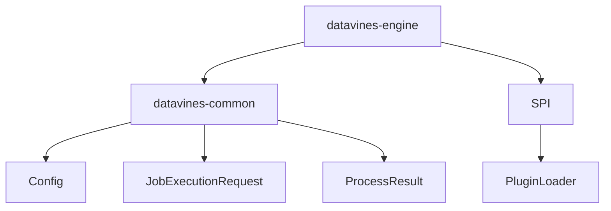

**图源**  
- [pom.xml](file://datavines-engine/pom.xml)

**本节来源**  
- [pom.xml](file://datavines-engine/pom.xml)

## 性能考虑

datavines-engine模块在设计时考虑了性能优化，通过异步执行、资源管理和错误处理等机制确保了高效的任务执行。

## 故障排查指南

当遇到执行问题时，可以按照以下步骤进行排查：

1. 检查配置文件是否正确
2. 查看日志输出，定位错误信息
3. 确认资源是否充足
4. 检查网络连接是否正常
5. 验证插件是否正确加载

**本节来源**  
- [BaseDataVinesBootstrap.java](file://datavines-engine/datavines-engine-core/src/main/java/io/datavines/engine/core/BaseDataVinesBootstrap.java)

## 结论

datavines-engine模块通过模块化和可扩展的设计，提供了一个强大而灵活的执行引擎框架。它支持多种执行模式，包括Flink、Spark和本地执行，并通过标准化的接口和配置管理实现了不同执行环境之间的无缝切换。该模块的设计充分考虑了性能、可维护性和可扩展性，为DataVines数据质量平台提供了坚实的基础。