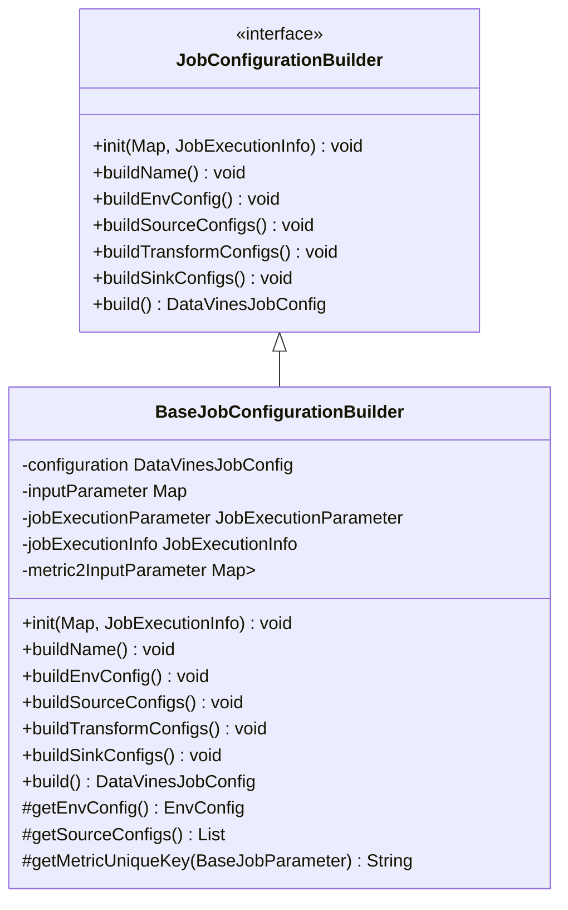
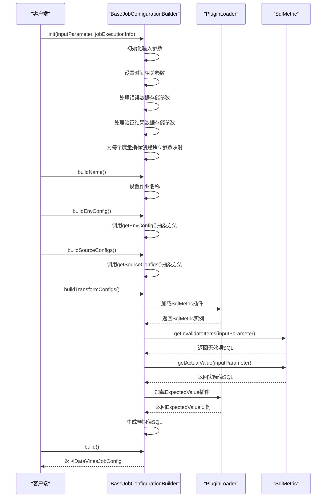
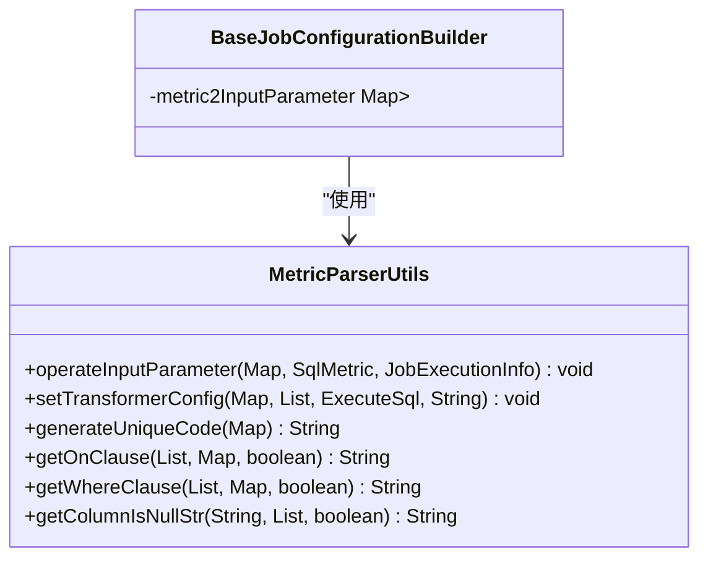
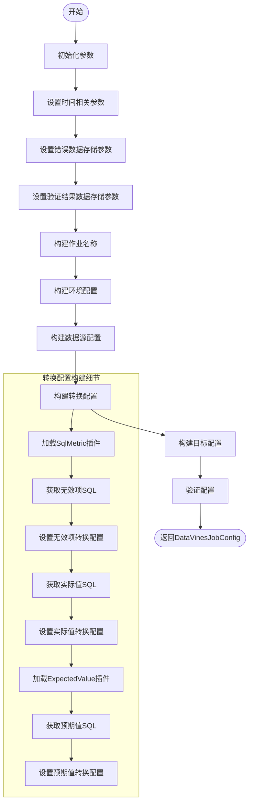
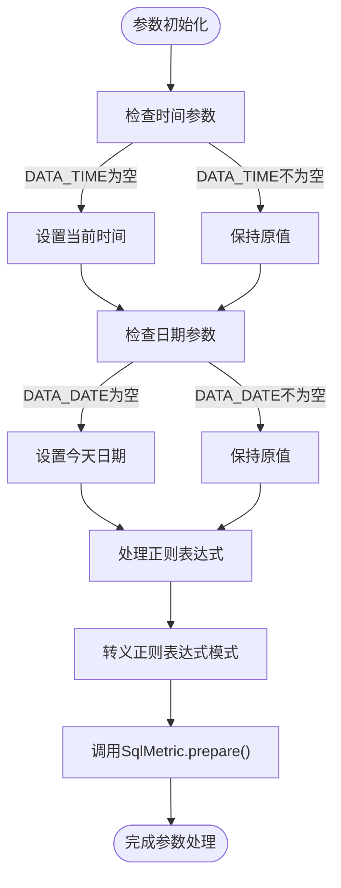
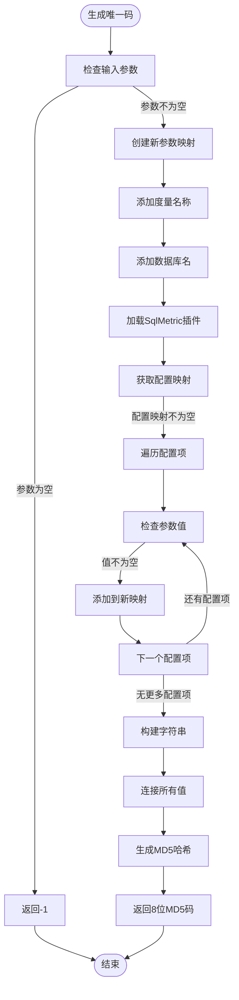
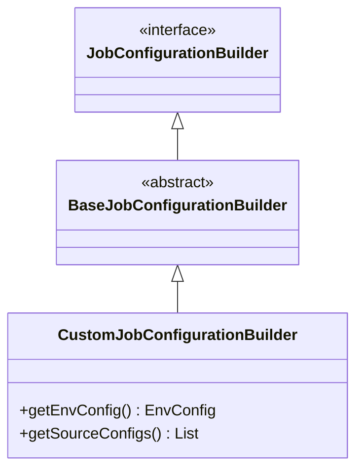

# 作业配置构建

<cite>
**本文档中引用的文件**  
- [JobConfigurationBuilder.java](file://datavines-engine/datavines-engine-config/src/main/java/io/datavines/engine/config/JobConfigurationBuilder.java)
- [BaseJobConfigurationBuilder.java](file://datavines-engine/datavines-engine-config/src/main/java/io/datavines/engine/config/BaseJobConfigurationBuilder.java)
- [MetricParserUtils.java](file://datavines-engine/datavines-engine-config/src/main/java/io/datavines/engine/config/MetricParserUtils.java)
- [DataVinesJobConfig.java](file://datavines-common/src/main/java/io/datavines/common/config/DataVinesJobConfig.java)
- [EnvConfig.java](file://datavines-common/src/main/java/io/datavines/common/config/EnvConfig.java)
- [SourceConfig.java](file://datavines-common/src/main/java/io/datavines/common/config/SourceConfig.java)
- [TransformConfig.java](file://datavines-common/src/main/java/io/datavines/common/config/TransformConfig.java)
- [SinkConfig.java](file://datavines-common/src/main/java/io/datavines/common/config/SinkConfig.java)
</cite>

## 目录
1. [引言](#引言)
2. [核心组件分析](#核心组件分析)
3. [配置构建流程](#配置构建流程)
4. [参数验证与默认值填充](#参数验证与默认值填充)
5. [配置优化机制](#配置优化机制)
6. [自定义配置构建器开发指南](#自定义配置构建器开发指南)
7. [最佳实践](#最佳实践)
8. [结论](#结论)

## 引言
作业配置构建系统是DataVines数据质量平台的核心组件，负责将高层业务逻辑转换为底层执行配置。该系统通过JobConfigurationBuilder接口和BaseJobConfigurationBuilder抽象类提供灵活的配置构建能力，同时利用MetricParserUtils工具类实现度量指标的解析和处理。本文档详细说明了该系统的架构、工作流程和扩展机制，为开发者提供全面的技术参考。

## 核心组件分析

### JobConfigurationBuilder接口
JobConfigurationBuilder是作业配置构建的核心接口，定义了配置构建的标准流程。该接口采用SPI（Service Provider Interface）机制，允许不同引擎实现各自的配置构建逻辑。

**图表来源**  
- [JobConfigurationBuilder.java](file://datavines-engine/datavines-engine-config/src/main/java/io/datavines/engine/config/JobConfigurationBuilder.java#L27-L42)
- [BaseJobConfigurationBuilder.java](file://datavines-engine/datavines-engine-config/src/main/java/io/datavines/engine/config/BaseJobConfigurationBuilder.java#L45-L321)

**本节来源**  
- [JobConfigurationBuilder.java](file://datavines-engine/datavines-engine-config/src/main/java/io/datavines/engine/config/JobConfigurationBuilder.java#L1-L43)

### BaseJobConfigurationBuilder抽象类
BaseJobConfigurationBuilder是JobConfigurationBuilder接口的抽象实现，提供了通用的配置构建能力。该类通过模板方法模式实现了配置构建的标准化流程，同时允许子类通过抽象方法提供特定实现。

该类的主要功能包括：
- 初始化输入参数和作业执行信息
- 构建作业名称
- 构建环境配置
- 构建数据源配置
- 构建转换配置
- 构建目标配置

**图表来源**  
- [BaseJobConfigurationBuilder.java](file://datavines-engine/datavines-engine-config/src/main/java/io/datavines/engine/config/BaseJobConfigurationBuilder.java#L45-L321)

**本节来源**  
- [BaseJobConfigurationBuilder.java](file://datavines-engine/datavines-engine-config/src/main/java/io/datavines/engine/config/BaseJobConfigurationBuilder.java#L1-L322)

### MetricParserUtils工具类
MetricParserUtils是度量指标解析的核心工具类，提供了参数处理、转换配置设置和唯一码生成等关键功能。

**图表来源**  
- [MetricParserUtils.java](file://datavines-engine/datavines-engine-config/src/main/java/io/datavines/engine/config/MetricParserUtils.java#L43-L223)
- [BaseJobConfigurationBuilder.java](file://datavines-engine/datavines-engine-config/src/main/java/io/datavines/engine/config/BaseJobConfigurationBuilder.java#L55-L56)

**本节来源**  
- [MetricParserUtils.java](file://datavines-engine/datavines-engine-config/src/main/java/io/datavines/engine/config/MetricParserUtils.java#L1-L223)

## 配置构建流程

### 完整配置构建流程
作业配置构建系统遵循标准化的构建流程，将高层业务逻辑转换为可执行的底层配置。该流程包括参数初始化、配置构建和最终配置生成三个主要阶段。

**图表来源**  
- [BaseJobConfigurationBuilder.java](file://datavines-engine/datavines-engine-config/src/main/java/io/datavines/engine/config/BaseJobConfigurationBuilder.java#L58-L219)

**本节来源**  
- [BaseJobConfigurationBuilder.java](file://datavines-engine/datavines-engine-config/src/main/java/io/datavines/engine/config/BaseJobConfigurationBuilder.java#L1-L322)

## 参数验证与默认值填充

### 参数初始化与处理
在配置构建过程中，系统会自动处理参数验证和默认值填充，确保配置的完整性和正确性。

**图表来源**  
- [MetricParserUtils.java](file://datavines-engine/datavines-engine-config/src/main/java/io/datavines/engine/config/MetricParserUtils.java#L45-L74)

**本节来源**  
- [MetricParserUtils.java](file://datavines-engine/datavines-engine-config/src/main/java/io/datavines/engine/config/MetricParserUtils.java#L1-L223)

## 配置优化机制

### 唯一码生成算法
系统通过generateUniqueCode方法生成唯一码，用于标识相同类型和条件的任务统计值，实现配置优化和缓存。

**图表来源**  
- [MetricParserUtils.java](file://datavines-engine/datavines-engine-config/src/main/java/io/datavines/engine/config/MetricParserUtils.java#L119-L143)
- [BaseJobConfigurationBuilder.java](file://datavines-engine/datavines-engine-config/src/main/java/io/datavines/engine/config/BaseJobConfigurationBuilder.java#L313-L319)

**本节来源**  
- [MetricParserUtils.java](file://datavines-engine/datavines-engine-config/src/main/java/io/datavines/engine/config/MetricParserUtils.java#L1-L223)
- [BaseJobConfigurationBuilder.java](file://datavines-engine/datavines-engine-config/src/main/java/io/datavines/engine/config/BaseJobConfigurationBuilder.java#L1-L322)

## 自定义配置构建器开发指南

### 创建自定义配置构建器
开发者可以通过继承BaseJobConfigurationBuilder类来创建自定义的配置构建器，实现特定引擎或场景的配置构建逻辑。

**开发步骤：**
1. 创建新类继承BaseJobConfigurationBuilder
2. 实现getEnvConfig()抽象方法
3. 实现getSourceConfigs()抽象方法
4. 在META-INF/plugins目录下注册SPI服务

**本节来源**  
- [JobConfigurationBuilder.java](file://datavines-engine/datavines-engine-config/src/main/java/io/datavines/engine/config/JobConfigurationBuilder.java#L27-L42)
- [BaseJobConfigurationBuilder.java](file://datavines-engine/datavines-engine-config/src/main/java/io/datavines/engine/config/BaseJobConfigurationBuilder.java#L45-L321)

## 最佳实践

### 配置构建最佳实践
在开发和使用作业配置构建系统时，应遵循以下最佳实践：

1. **参数命名规范**：使用统一的参数命名约定，避免命名冲突
2. **错误处理**：在构建过程中妥善处理异常情况
3. **性能优化**：合理使用缓存机制，避免重复计算
4. **扩展性设计**：遵循开闭原则，便于系统扩展
5. **配置验证**：在构建完成后进行完整的配置验证

### 插件开发最佳实践
1. **接口隔离**：确保插件接口职责单一
2. **版本兼容**：保持向后兼容性
3. **文档完整**：提供详细的插件文档
4. **测试覆盖**：确保充分的测试覆盖
5. **性能监控**：添加必要的性能监控点

## 结论
作业配置构建系统通过清晰的接口定义、灵活的抽象基类和强大的工具类，实现了从高层业务逻辑到底层执行配置的高效转换。该系统不仅提供了标准化的配置构建流程，还通过SPI机制支持灵活的扩展，为不同引擎和场景提供了统一的配置管理方案。通过遵循本文档中的指南和最佳实践，开发者可以有效地利用和扩展该系统，满足多样化的数据质量检测需求。