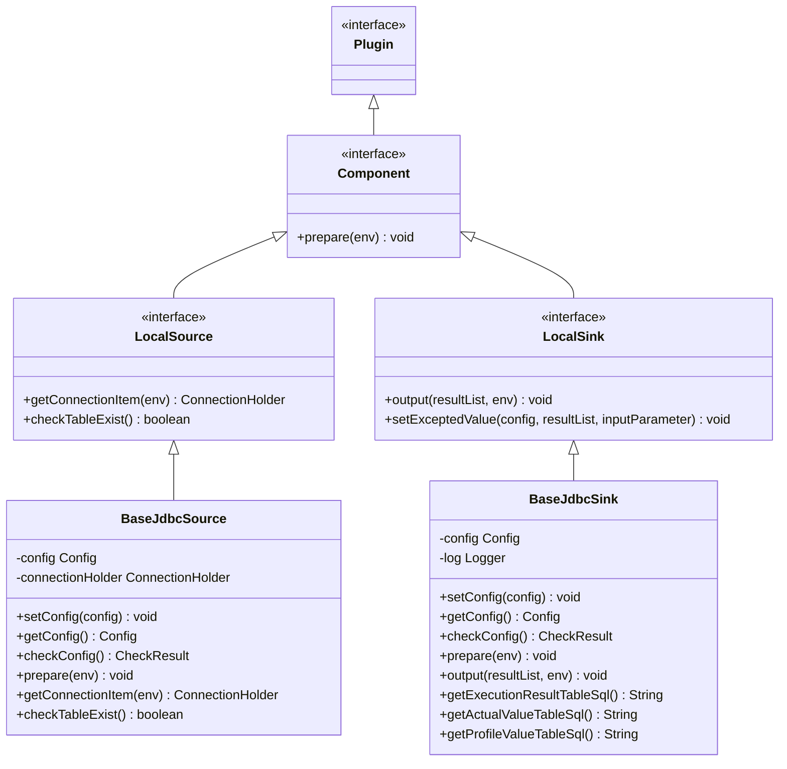
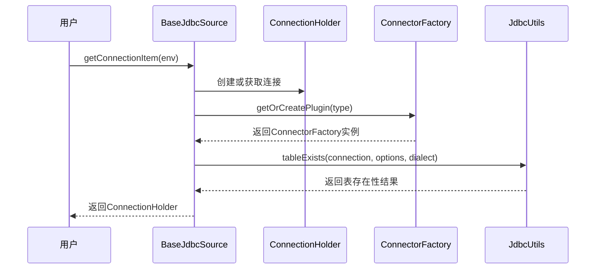
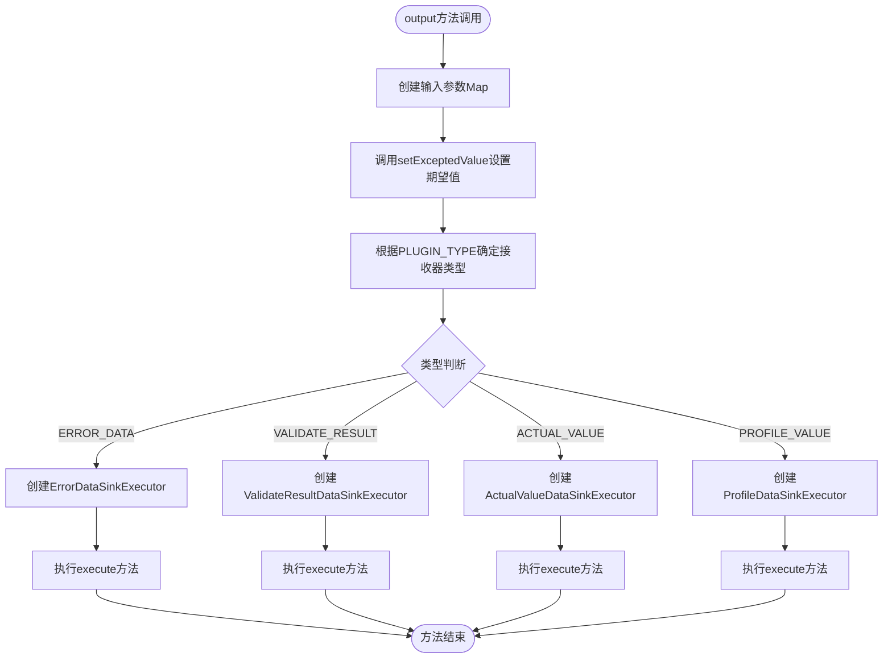
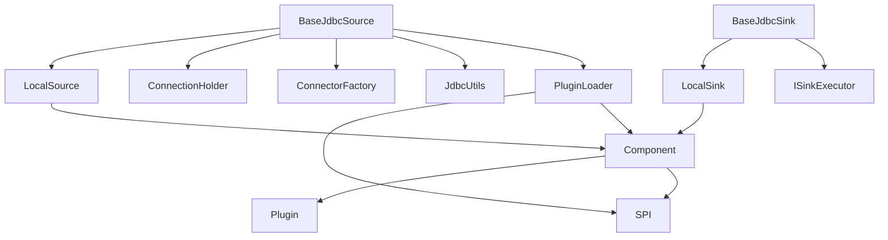

# Component接口

<cite>
**本文档中引用的文件**  
- [Component.java](file://datavines-engine/datavines-engine-api/src/main/java/io/datavines/engine/api/component/Component.java)
- [LocalSource.java](file://datavines-engine/datavines-engine-plugins/datavines-engine-local/datavines-engine-local-api/src/main/java/io/datavines/engine/local/api/LocalSource.java)
- [LocalSink.java](file://datavines-engine/datavines-engine-plugins/datavines-engine-local/datavines-engine-local-api/src/main/java/io/datavines/engine/local/api/LocalSink.java)
- [BaseJdbcSource.java](file://datavines-engine/datavines-engine-plugins/datavines-engine-local/datavines-engine-local-connector-jdbc/src/main/java/io/datavines/engine/local/connector/BaseJdbcSource.java)
- [BaseJdbcSink.java](file://datavines-engine/datavines-engine-plugins/datavines-engine-local/datavines-engine-local-connector-jdbc/src/main/java/io/datavines/engine/local/connector/BaseJdbcSink.java)
- [SPI.java](file://datavines-spi/src/main/java/io/datavines/spi/SPI.java)
- [PluginLoader.java](file://datavines-spi/src/main/java/io/datavines/spi/PluginLoader.java)
</cite>

## 目录
1. [介绍](#介绍)
2. [核心组件](#核心组件)
3. [架构概述](#架构概述)
4. [详细组件分析](#详细组件分析)
5. [依赖分析](#依赖分析)
6. [性能考虑](#性能考虑)
7. [故障排除指南](#故障排除指南)
8. [结论](#结论)

## 介绍
Component接口是DataVines数据处理流水线中的核心抽象，为数据源、转换器和接收器等组件提供了统一的插件化扩展机制。该接口定义了组件的生命周期方法，并通过SPI机制实现了灵活的插件加载。本文档深入解析Component接口的设计原理、实现方式及其在构建数据处理流水线中的关键作用。

## 核心组件
Component接口作为DataVines系统中所有可插拔组件的基础，通过继承Plugin接口并结合SPI注解，实现了组件的动态发现和加载。该接口定义了prepare方法，用于在组件执行前进行必要的初始化工作。基于Component接口，系统构建了LocalSource和LocalSink等具体接口，分别代表数据源和数据接收器，为不同类型的数据处理组件提供了统一的抽象。

**Section sources**
- [Component.java](file://datavines-engine/datavines-engine-api/src/main/java/io/datavines/engine/api/component/Component.java)
- [LocalSource.java](file://datavines-engine/datavines-engine-plugins/datavines-engine-local/datavines-engine-local-api/src/main/java/io/datavines/engine/local/api/LocalSource.java)
- [LocalSink.java](file://datavines-engine/datavines-engine-plugins/datavines-engine-local/datavines-engine-local-api/src/main/java/io/datavines/engine/local/api/LocalSink.java)

## 架构概述


**Diagram sources**
- [Component.java](file://datavines-engine/datavines-engine-api/src/main/java/io/datavines/engine/api/component/Component.java)
- [LocalSource.java](file://datavines-engine/datavines-engine-plugins/datavines-engine-local/datavines-engine-local-api/src/main/java/io/datavines/engine/local/api/LocalSource.java)
- [LocalSink.java](file://datavines-engine/datavines-engine-plugins/datavines-engine-local/datavines-engine-local-api/src/main/java/io/datavines/engine/local/api/LocalSink.java)
- [BaseJdbcSource.java](file://datavines-engine/datavines-engine-plugins/datavines-engine-local/datavines-engine-local-connector-jdbc/src/main/java/io/datavines/engine/local/connector/BaseJdbcSource.java)
- [BaseJdbcSink.java](file://datavines-engine/datavines-engine-plugins/datavines-engine-local/datavines-engine-local-connector-jdbc/src/main/java/io/datavines/engine/local/connector/BaseJdbcSink.java)

## 详细组件分析

### Component接口分析
Component接口是DataVines系统中所有可插拔组件的基础接口，它继承自Plugin接口并被@SPI注解标记，表明这是一个服务提供者接口，可以通过SPI机制进行动态加载。该接口定义了prepare方法，用于在组件执行前进行必要的环境准备和初始化工作。

```mermaid
classDiagram
class Component {
<<interface>>
+prepare(env) void
}
class SPI {
<<annotation>>
+value() String
}
class Plugin {
<<interface>>
}
Component <|-- Plugin
Component ..>> SPI : 注解
```

**Diagram sources**
- [Component.java](file://datavines-engine/datavines-engine-api/src/main/java/io/datavines/engine/api/component/Component.java)
- [SPI.java](file://datavines-spi/src/main/java/io/datavines/spi/SPI.java)

**Section sources**
- [Component.java](file://datavines-engine/datavines-engine-api/src/main/java/io/datavines/engine/api/component/Component.java)
- [SPI.java](file://datavines-spi/src/main/java/io/datavines/spi/SPI.java)

### 数据源组件分析
LocalSource接口扩展了Component接口，定义了数据源组件的特定行为。BaseJdbcSource作为JDBC数据源的基类实现，提供了连接管理、配置验证和表存在性检查等功能。该实现通过ConnectionHolder封装数据库连接，并利用ConnectorFactory和JdbcUtils进行数据库操作。



**Diagram sources**
- [BaseJdbcSource.java](file://datavines-engine/datavines-engine-plugins/datavines-engine-local/datavines-engine-local-connector-jdbc/src/main/java/io/datavines/engine/local/connector/BaseJdbcSource.java)
- [ConnectionHolder.java](file://datavines-engine/datavines-engine-plugins/datavines-engine-local/datavines-engine-local-api/src/main/java/io/datavines/engine/local/api/entity/ConnectionHolder.java)
- [ConnectorFactory.java](file://datavines-connector/datavines-connector-api/src/main/java/io/datavines/connector/api/ConnectorFactory.java)
- [JdbcUtils.java](file://datavines-connector/datavines-connector-api/src/main/java/io/datavines/connector/api/utils/JdbcUtils.java)

**Section sources**
- [BaseJdbcSource.java](file://datavines-engine/datavines-engine-plugins/datavines-engine-local/datavines-engine-local-connector-jdbc/src/main/java/io/datavines/engine/local/connector/BaseJdbcSource.java)

### 数据接收器组件分析
LocalSink接口扩展了Component接口，定义了数据接收器组件的特定行为。BaseJdbcSink作为JDBC接收器的基类实现，提供了多种类型数据的输出功能，包括验证结果、实际值、配置文件值等。该实现通过策略模式根据配置的插件类型选择相应的执行器进行数据写入。



**Diagram sources**
- [BaseJdbcSink.java](file://datavines-engine/datavines-engine-plugins/datavines-engine-local/datavines-engine-local-connector-jdbc/src/main/java/io/datavines/engine/local/connector/BaseJdbcSink.java)
- [ISinkExecutor.java](file://datavines-engine/datavines-engine-plugins/datavines-engine-local/datavines-engine-local-connector-jdbc/src/main/java/io/datavines/engine/local/connector/executor/ISinkExecutor.java)

**Section sources**
- [BaseJdbcSink.java](file://datavines-engine/datavines-engine-plugins/datavines-engine-local/datavines-engine-local-connector-jdbc/src/main/java/io/datavines/engine/local/connector/BaseJdbcSink.java)

## 依赖分析


**Diagram sources**
- [Component.java](file://datavines-engine/datavines-engine-api/src/main/java/io/datavines/engine/api/component/Component.java)
- [Plugin.java](file://datavines-engine/datavines-engine-api/src/main/java/io/datavines/engine/api/plugin/Plugin.java)
- [SPI.java](file://datavines-spi/src/main/java/io/datavines/spi/SPI.java)
- [PluginLoader.java](file://datavines-spi/src/main/java/io/datavines/spi/PluginLoader.java)

**Section sources**
- [Component.java](file://datavines-engine/datavines-engine-api/src/main/java/io/datavines/engine/api/component/Component.java)
- [PluginLoader.java](file://datavines-spi/src/main/java/io/datavines/spi/PluginLoader.java)

## 性能考虑
Component接口的设计充分考虑了性能因素。通过SPI机制实现的插件延迟加载避免了不必要的类加载开销。BaseJdbcSource中的连接池管理和重试机制确保了数据库连接的稳定性和可靠性。BaseJdbcSink中的策略模式避免了重复的对象创建，提高了执行效率。建议在实际使用中合理配置连接池参数和重试次数，以平衡性能和可靠性。

## 故障排除指南
当遇到Component接口相关的问题时，首先检查SPI配置文件是否正确放置在META-INF/services目录下。确认插件实现类的全限定名是否正确写入配置文件。对于数据库连接问题，检查BaseJdbcSource中的连接参数配置是否正确，并确保数据库驱动已正确添加到类路径。对于数据写入问题，验证BaseJdbcSink中的表结构SQL是否与目标数据库兼容。

**Section sources**
- [BaseJdbcSource.java](file://datavines-engine/datavines-engine-plugins/datavines-engine-local/datavines-engine-local-connector-jdbc/src/main/java/io/datavines/engine/local/connector/BaseJdbcSource.java)
- [BaseJdbcSink.java](file://datavines-engine/datavines-engine-plugins/datavines-engine-local/datavines-engine-local-connector-jdbc/src/main/java/io/datavines/engine/local/connector/BaseJdbcSink.java)

## 结论
Component接口作为DataVines系统的核心抽象，成功实现了数据处理组件的统一管理和插件化扩展。通过继承Component接口并结合SPI机制，开发者可以轻松创建自定义的数据源和接收器组件。BaseJdbcSource和BaseJdbcSink的实现为JDBC相关的组件开发提供了优秀的参考模板。该设计模式不仅提高了系统的可扩展性，还保证了代码的可维护性和可测试性。