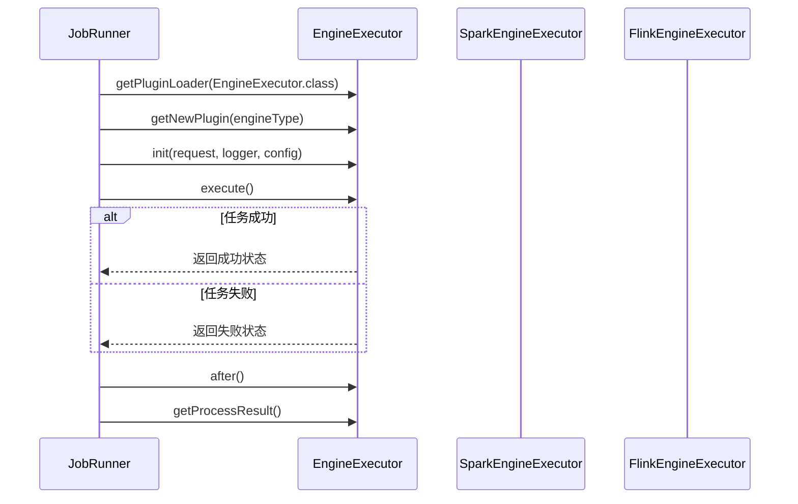
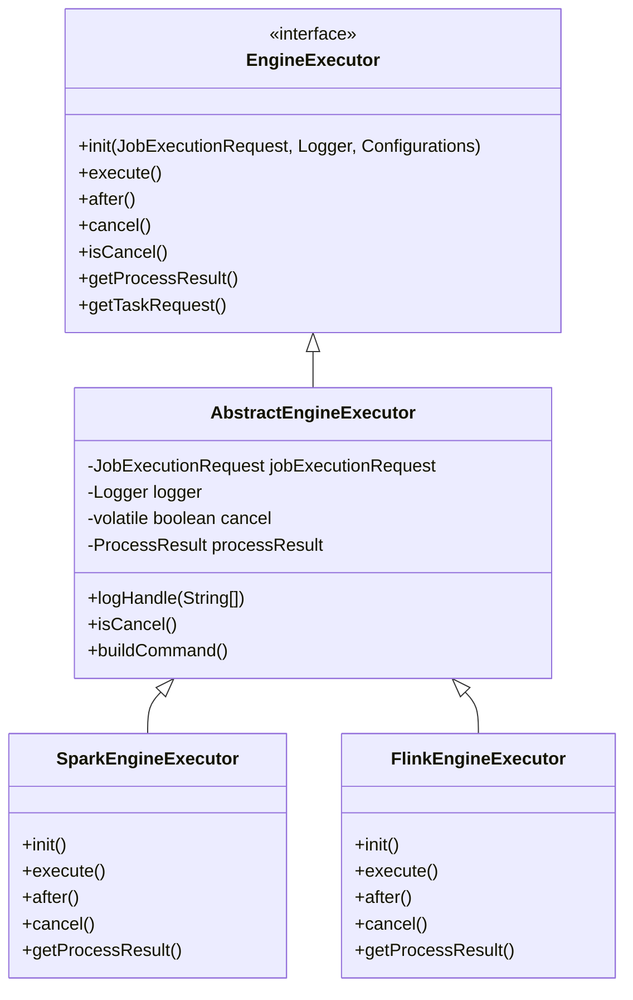
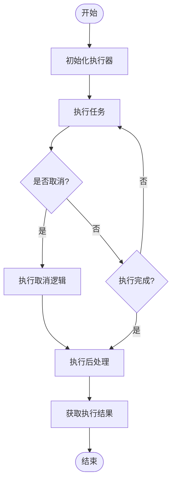
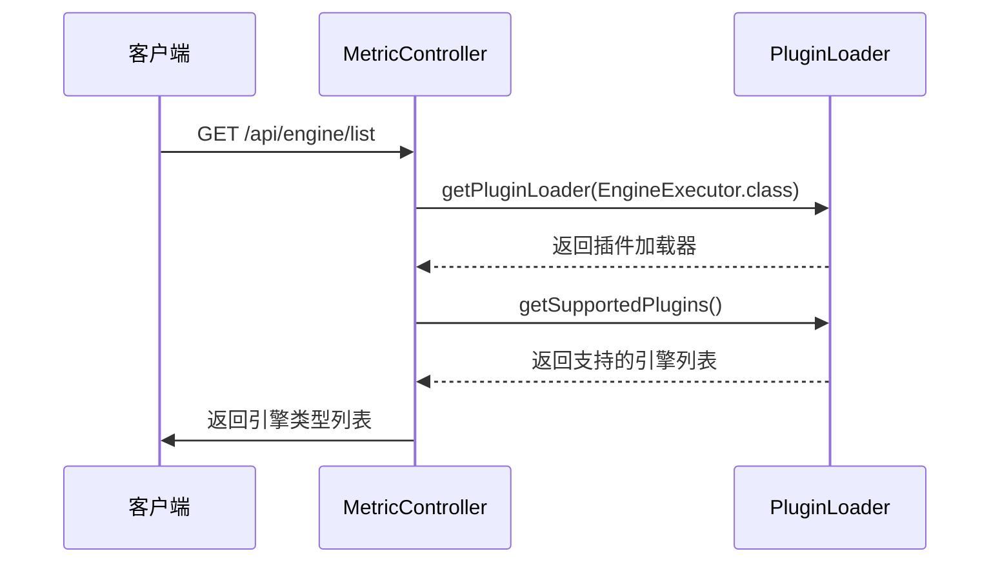

# EngineExecutor接口

<cite>
**本文档引用的文件**
- [EngineExecutor.java](file://datavines-engine/datavines-engine-api/src/main/java/io/datavines/engine/api/engine/EngineExecutor.java)
- [AbstractEngineExecutor.java](file://datavines-engine/datavines-engine-executor/src/main/java/io/datavines/engine/executor/core/base/AbstractEngineExecutor.java)
- [SparkEngineExecutor.java](file://datavines-engine/datavines-engine-plugins/datavines-engine-spark/datavines-engine-spark-executor/src/main/java/io/datavines/engine/spark/executor/SparkEngineExecutor.java)
- [FlinkEngineExecutor.java](file://datavines-engine/datavines-engine-plugins/datavines-engine-flink/datavines-engine-flink-executor/src/main/java/io/datavines/engine/flink/executor/FlinkEngineExecutor.java)
- [LivyEngineExecutor.java](file://datavines-engine/datavines-engine-plugins/datavines-engine-livy/datavines-engine-livy-executor/src/main/java/io/datavines/engine/livy/executor/LivyEngineExecutor.java)
- [LocalEngineExecutor.java](file://datavines-engine/datavines-engine-plugins/datavines-engine-local/datavines-engine-local-executor/src/main/java/io/datavines/engine/local/executor/LocalEngineExecutor.java)
- [JobRunner.java](file://datavines-runner/src/main/java/io/datavines/runner/JobRunner.java)
- [MetricController.java](file://datavines-server/src/main/java/io/datavines/server/api/controller/MetricController.java)
</cite>

## 目录
1. [引言](#引言)
2. [核心方法详解](#核心方法详解)
3. [接口设计与执行流程](#接口设计与执行流程)
4. [不同执行引擎的实现方式](#不同执行引擎的实现方式)
5. [使用示例与最佳实践](#使用示例与最佳实践)
6. [自定义引擎实现指导](#自定义引擎实现指导)
7. [结论](#结论)

## 引言
EngineExecutor接口是DataVines数据质量框架中的核心接口，定义了任务执行的契约。该接口为不同的计算引擎（如Spark、Flink等）提供了统一的执行抽象，使得系统能够灵活地支持多种执行引擎。通过SPI机制，系统可以动态加载和管理不同的引擎实现。

**Section sources**
- [EngineExecutor.java](file://datavines-engine/datavines-engine-api/src/main/java/io/datavines/engine/api/engine/EngineExecutor.java#L26-L42)

## 核心方法详解

### 初始化方法 (init)
`init`方法用于初始化执行器，接收任务执行请求、日志记录器和配置信息作为参数。该方法在任务执行前被调用，负责设置执行环境和准备必要的资源。

**Section sources**
- [EngineExecutor.java](file://datavines-engine/datavines-engine-api/src/main/java/io/datavines/engine/api/engine/EngineExecutor.java#L28-L28)

### 执行方法 (execute)
`execute`方法是核心的执行方法，负责启动任务的实际执行。该方法会阻塞直到任务完成或被取消。在不同的引擎实现中，该方法的具体实现会有所不同，但都遵循相同的执行契约。

**Section sources**
- [EngineExecutor.java](file://datavines-engine/datavines-engine-api/src/main/java/io/datavines/engine/api/engine/EngineExecutor.java#L30-L30)

### 后处理方法 (after)
`after`方法在任务执行完成后调用，用于执行清理工作和资源释放。无论任务成功还是失败，该方法都会被执行，确保资源的正确回收。

**Section sources**
- [EngineExecutor.java](file://datavines-engine/datavines-engine-api/src/main/java/io/datavines/engine/api/engine/EngineExecutor.java#L32-L32)

### 取消方法 (cancel)
`cancel`方法用于取消正在执行的任务。该方法会尝试终止任务的执行，并设置取消标志。不同的引擎实现会根据其特性提供相应的取消机制。

**Section sources**
- [EngineExecutor.java](file://datavines-engine/datavines-engine-api/src/main/java/io/datavines/engine/api/engine/EngineExecutor.java#L34-L34)

### 取消状态检查 (isCancel)
`isCancel`方法用于检查任务是否已被取消。返回布尔值表示当前任务的取消状态，这对于在执行过程中检查取消请求非常重要。

**Section sources**
- [EngineExecutor.java](file://datavines-engine/datavines-engine-api/src/main/java/io/datavines/engine/api/engine/EngineExecutor.java#L36-L36)

### 获取处理结果 (getProcessResult)
`getProcessResult`方法返回任务执行的结果信息，包括退出状态码、进程ID、应用ID等。这些信息对于监控任务状态和故障排查至关重要。

**Section sources**
- [EngineExecutor.java](file://datavines-engine/datavines-engine-api/src/main/java/io/datavines/engine/api/engine/EngineExecutor.java#L38-L38)

### 获取任务请求 (getTaskRequest)
`getTaskRequest`方法返回与执行器关联的任务执行请求对象，包含任务的详细配置和参数信息。

**Section sources**
- [EngineExecutor.java](file://datavines-engine/datavines-engine-api/src/main/java/io/datavines/engine/api/engine/EngineExecutor.java#L40-L40)

## 接口设计与执行流程



**Diagram sources**
- [JobRunner.java](file://datavines-runner/src/main/java/io/datavines/runner/JobRunner.java#L73-L79)
- [EngineExecutor.java](file://datavines-engine/datavines-engine-api/src/main/java/io/datavines/engine/api/engine/EngineExecutor.java#L28-L40)

### 抽象基类设计
`AbstractEngineExecutor`作为所有具体实现的基类，提供了公共的字段和方法实现，包括取消状态管理和日志处理。这种设计模式遵循了模板方法模式，确保了执行流程的一致性。



**Diagram sources**
- [AbstractEngineExecutor.java](file://datavines-engine/datavines-engine-executor/src/main/java/io/datavines/engine/executor/core/base/AbstractEngineExecutor.java#L27-L56)
- [EngineExecutor.java](file://datavines-engine/datavines-engine-api/src/main/java/io/datavines/engine/api/engine/EngineExecutor.java#L26-L42)

## 不同执行引擎的实现方式

### Spark引擎实现
SparkEngineExecutor实现了基于Spark的执行逻辑，通过构建适当的命令行参数来启动Spark应用。该实现支持YARN和本地模式等多种部署方式。

**Section sources**
- [SparkEngineExecutor.java](file://datavines-engine/datavines-engine-plugins/datavines-engine-spark/datavines-engine-spark-executor/src/main/java/io/datavines/engine/spark/executor/SparkEngineExecutor.java)

### Flink引擎实现
FlinkEngineExecutor提供了Flink任务的执行支持，能够通过命令行或REST API与Flink集群交互。该实现特别关注流处理任务的执行和管理。

**Section sources**
- [FlinkEngineExecutor.java](file://datavines-engine/datavines-engine-plugins/datavines-engine-flink/datavines-engine-flink-executor/src/main/java/io/datavines/engine/flink/executor/FlinkEngineExecutor.java)

### Livy引擎实现
LivyEngineExecutor通过Livy服务与Spark集群交互，提供了更高级别的REST API抽象。这种实现方式特别适合在多租户环境中运行Spark作业。

**Section sources**
- [LivyEngineExecutor.java](file://datavines-engine/datavines-engine-plugins/datavines-engine-livy/datavines-engine-livy-executor/src/main/java/io/datavines/engine/livy/executor/LivyEngineExecutor.java)

### 本地引擎实现
LocalEngineExecutor提供了在本地执行任务的能力，主要用于开发和测试场景。该实现直接在当前JVM中执行任务逻辑。

**Section sources**
- [LocalEngineExecutor.java](file://datavines-engine/datavines-engine-plugins/datavines-engine-local/datavines-engine-local-executor/src/main/java/io/datavines/engine/local/executor/LocalEngineExecutor.java)

## 使用示例与最佳实践

### 任务执行流程


**Diagram sources**
- [JobRunner.java](file://datavines-runner/src/main/java/io/datavines/runner/JobRunner.java#L77-L79)

### SPI机制集成
系统通过SPI机制动态加载引擎实现，`MetricController`中的`getEngineTypeList`方法展示了如何获取所有支持的引擎类型：



**Diagram sources**
- [MetricController.java](file://datavines-server/src/main/java/io/datavines/server/api/controller/MetricController.java#L194-L198)

## 自定义引擎实现指导

### 实现步骤
1. 创建新的Maven模块作为插件
2. 实现EngineExecutor接口
3. 在resources/META-INF/plugins/目录下创建配置文件
4. 注册SPI实现

### 配置文件示例
在`resources/META-INF/plugins/io.datavines.engine.api.engine.EngineExecutor`文件中添加：
```
myengine=com.example.MyCustomEngineExecutor
```

### 注意事项
- 确保实现类有默认构造函数
- 正确处理异常情况
- 实现资源清理逻辑
- 支持取消操作

**Section sources**
- [EngineExecutor.java](file://datavines-engine/datavines-engine-api/src/main/java/io/datavines/engine/api/engine/EngineExecutor.java#L26-L42)

## 结论
EngineExecutor接口通过清晰的契约定义和灵活的SPI机制，为DataVines框架提供了强大的执行引擎抽象能力。这种设计不仅支持现有的Spark、Flink等主流计算引擎，还为未来扩展新的执行引擎提供了便利。通过统一的执行接口，系统能够轻松地在不同计算平台之间切换，满足多样化的数据处理需求。