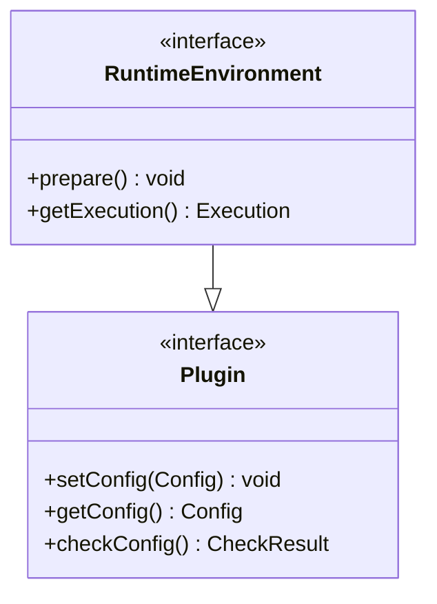
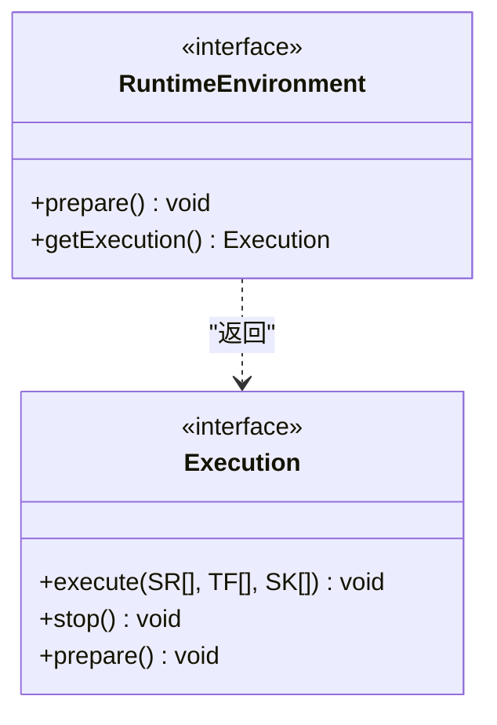
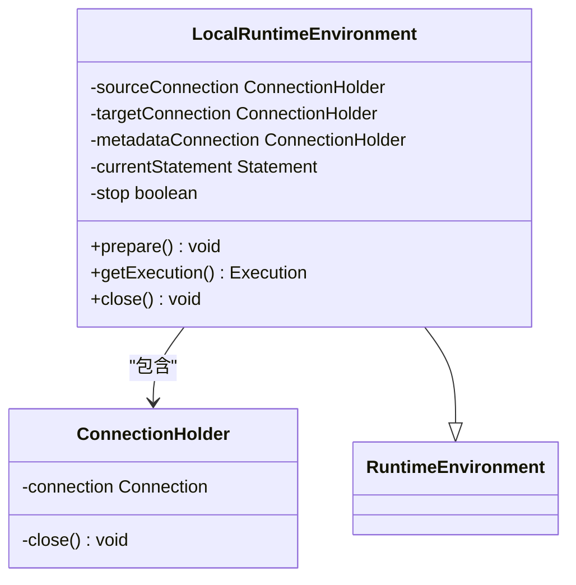
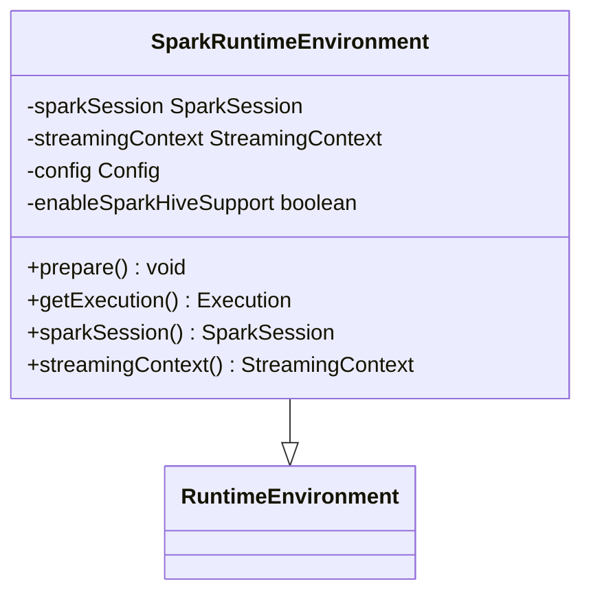
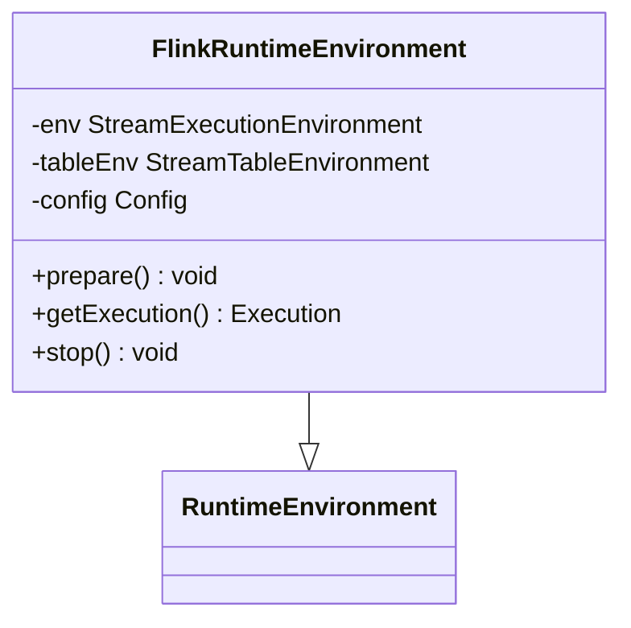
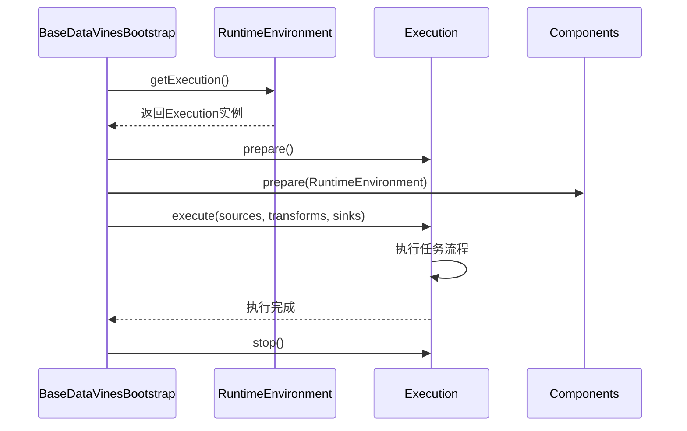
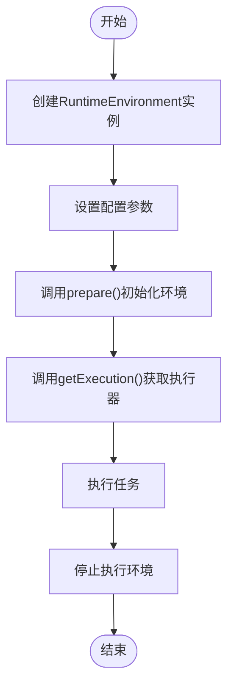
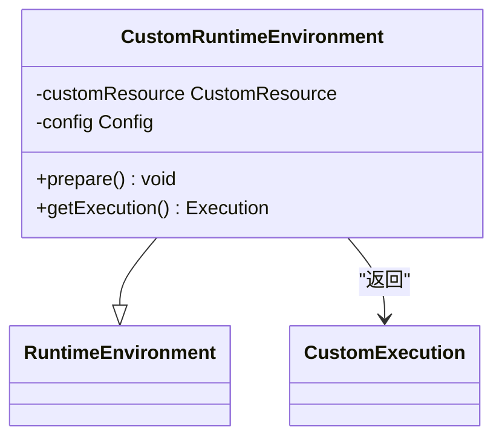
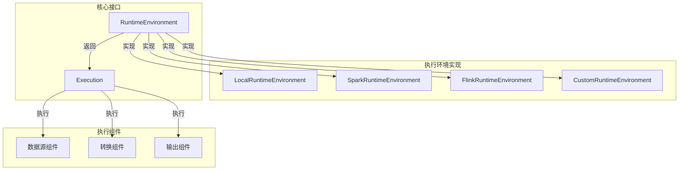

# RuntimeEnvironment接口

<cite>
**本文档中引用的文件**   
- [RuntimeEnvironment.java](file://datavines-engine/datavines-engine-api/src/main/java/io/datavines/engine/api/env/RuntimeEnvironment.java)
- [LocalRuntimeEnvironment.java](file://datavines-engine/datavines-engine-plugins/datavines-engine-local/datavines-engine-local-api/src/main/java/io/datavines/engine/local/api/LocalRuntimeEnvironment.java)
- [SparkRuntimeEnvironment.java](file://datavines-engine/datavines-engine-plugins/datavines-engine-spark/datavines-engine-spark-api/src/main/java/io/datavines/engine/spark/api/SparkRuntimeEnvironment.java)
- [FlinkRuntimeEnvironment.java](file://datavines-engine/datavines-engine-plugins/datavines-engine-flink/datavines-engine-flink-api/src/main/java/io/datavines/engine/flink/api/FlinkRuntimeEnvironment.java)
- [Execution.java](file://datavines-engine/datavines-engine-api/src/main/java/io/datavines/engine/api/env/Execution.java)
- [SparkBatchExecution.java](file://datavines-engine/datavines-engine-plugins/datavines-engine-spark/datavines-engine-spark-api/src/main/java/io/datavines/engine/spark/api/batch/SparkBatchExecution.java)
- [LocalExecution.java](file://datavines-engine/datavines-engine-plugins/datavines-engine-local/datavines-engine-local-api/src/main/java/io/datavines/engine/local/api/LocalExecution.java)
- [BaseDataVinesBootstrap.java](file://datavines-engine/datavines-engine-core/src/main/java/io/datavines/engine/core/BaseDataVinesBootstrap.java)
</cite>

## 目录
1. [简介](#简介)
2. [接口定义](#接口定义)
3. [核心方法解析](#核心方法解析)
4. [执行环境实现](#执行环境实现)
5. [执行上下文管理](#执行上下文管理)
6. [使用示例](#使用示例)
7. [扩展指导](#扩展指导)
8. [架构图](#架构图)

## 简介
RuntimeEnvironment接口是DataVines引擎的核心组件之一，用于封装不同执行环境（如Yarn、Livy、Local）的上下文信息和配置参数。该接口通过抽象化不同执行平台的细节，为上层应用提供统一的执行环境管理能力。通过实现该接口，可以支持多种执行环境，包括本地执行、Spark执行和Flink执行等。

**Section sources**
- [RuntimeEnvironment.java](file://datavines-engine/datavines-engine-api/src/main/java/io/datavines/engine/api/env/RuntimeEnvironment.java)

## 接口定义
RuntimeEnvironment接口定义了执行环境的基本契约，继承自Plugin接口并使用@SPI注解标记，表明它是一个可扩展的SPI（Service Provider Interface）接口。该接口主要包含两个核心方法：prepare()和getExecution()。

**Diagram sources**
- [RuntimeEnvironment.java](file://datavines-engine/datavines-engine-api/src/main/java/io/datavines/engine/api/env/RuntimeEnvironment.java)

**Section sources**
- [RuntimeEnvironment.java](file://datavines-engine/datavines-engine-api/src/main/java/io/datavines/engine/api/env/RuntimeEnvironment.java)

## 核心方法解析
RuntimeEnvironment接口定义了两个关键方法，用于环境初始化和执行上下文获取。

### prepare方法
prepare方法负责执行环境的初始化工作，包括资源配置、连接建立和环境配置等。不同的实现类会根据具体的执行平台进行相应的初始化操作。

### getExecution方法
getExecution方法返回与当前运行时环境关联的Execution实例，该实例负责具体的任务执行逻辑。Execution接口定义了execute、stop和prepare等方法，用于控制任务的执行流程。

**Diagram sources**
- [RuntimeEnvironment.java](file://datavines-engine/datavines-engine-api/src/main/java/io/datavines/engine/api/env/RuntimeEnvironment.java)
- [Execution.java](file://datavines-engine/datavines-engine-api/src/main/java/io/datavines/engine/api/env/Execution.java)

**Section sources**
- [RuntimeEnvironment.java](file://datavines-engine/datavines-engine-api/src/main/java/io/datavines/engine/api/env/RuntimeEnvironment.java)
- [Execution.java](file://datavines-engine/datavines-engine-api/src/main/java/io/datavines/engine/api/env/Execution.java)

## 执行环境实现
DataVines提供了多种RuntimeEnvironment的实现，以支持不同的执行平台。

### LocalRuntimeEnvironment
LocalRuntimeEnvironment是本地执行环境的实现，主要用于在本地JVM中执行任务。它管理本地数据库连接和执行状态。

**Diagram sources**
- [LocalRuntimeEnvironment.java](file://datavines-engine/datavines-engine-plugins/datavines-engine-local/datavines-engine-local-api/src/main/java/io/datavines/engine/local/api/LocalRuntimeEnvironment.java)

**Section sources**
- [LocalRuntimeEnvironment.java](file://datavines-engine/datavines-engine-plugins/datavines-engine-local/datavines-engine-local-api/src/main/java/io/datavines/engine/local/api/LocalRuntimeEnvironment.java)

### SparkRuntimeEnvironment
SparkRuntimeEnvironment是Spark执行环境的实现，用于在Spark集群上执行任务。它管理SparkSession和StreamingContext等Spark核心组件。

**Diagram sources**
- [SparkRuntimeEnvironment.java](file://datavines-engine/datavines-engine-plugins/datavines-engine-spark/datavines-engine-spark-api/src/main/java/io/datavines/engine/spark/api/SparkRuntimeEnvironment.java)

**Section sources**
- [SparkRuntimeEnvironment.java](file://datavines-engine/datavines-engine-plugins/datavines-engine-spark/datavines-engine-spark-api/src/main/java/io/datavines/engine/spark/api/SparkRuntimeEnvironment.java)

### FlinkRuntimeEnvironment
FlinkRuntimeEnvironment是Flink执行环境的实现，用于在Flink集群上执行流处理任务。它管理StreamExecutionEnvironment和StreamTableEnvironment等Flink核心组件。

**Diagram sources**
- [FlinkRuntimeEnvironment.java](file://datavines-engine/datavines-engine-plugins/datavines-engine-flink/datavines-engine-flink-api/src/main/java/io/datavines/engine/flink/api/FlinkRuntimeEnvironment.java)

**Section sources**
- [FlinkRuntimeEnvironment.java](file://datavines-engine/datavines-engine-plugins/datavines-engine-flink/datavines-engine-flink-api/src/main/java/io/datavines/engine/flink/api/FlinkRuntimeEnvironment.java)

## 执行上下文管理
RuntimeEnvironment通过Execution接口管理具体的执行上下文。不同的执行环境实现会返回相应的Execution实例。

### 执行流程

**Diagram sources**
- [BaseDataVinesBootstrap.java](file://datavines-engine/datavines-engine-core/src/main/java/io/datavines/engine/core/BaseDataVinesBootstrap.java)
- [RuntimeEnvironment.java](file://datavines-engine/datavines-engine-api/src/main/java/io/datavines/engine/api/env/RuntimeEnvironment.java)
- [Execution.java](file://datavines-engine/datavines-engine-api/src/main/java/io/datavines/engine/api/env/Execution.java)

**Section sources**
- [BaseDataVinesBootstrap.java](file://datavines-engine/datavines-engine-core/src/main/java/io/datavines/engine/core/BaseDataVinesBootstrap.java)

## 使用示例
以下是一个典型的RuntimeEnvironment使用示例：

**Diagram sources**
- [RuntimeEnvironment.java](file://datavines-engine/datavines-engine-api/src/main/java/io/datavines/engine/api/env/RuntimeEnvironment.java)

**Section sources**
- [RuntimeEnvironment.java](file://datavines-engine/datavines-engine-api/src/main/java/io/datavines/engine/api/env/RuntimeEnvironment.java)

## 扩展指导
要创建自定义的执行环境，需要实现RuntimeEnvironment接口并遵循以下步骤：

1. 创建新的实现类，继承RuntimeEnvironment接口
2. 实现prepare()方法进行环境初始化
3. 实现getExecution()方法返回相应的Execution实例
4. 在META-INF/plugins目录下创建服务发现文件

**Diagram sources**
- [RuntimeEnvironment.java](file://datavines-engine/datavines-engine-api/src/main/java/io/datavines/engine/api/env/RuntimeEnvironment.java)

**Section sources**
- [RuntimeEnvironment.java](file://datavines-engine/datavines-engine-api/src/main/java/io/datavines/engine/api/env/RuntimeEnvironment.java)

## 架构图
以下是RuntimeEnvironment的整体架构：

**Diagram sources**
- [RuntimeEnvironment.java](file://datavines-engine/datavines-engine-api/src/main/java/io/datavines/engine/api/env/RuntimeEnvironment.java)
- [Execution.java](file://datavines-engine/datavines-engine-api/src/main/java/io/datavines/engine/api/env/Execution.java)

**Section sources**
- [RuntimeEnvironment.java](file://datavines-engine/datavines-engine-api/src/main/java/io/datavines/engine/api/env/RuntimeEnvironment.java)
- [Execution.java](file://datavines-engine/datavines-engine-api/src/main/java/io/datavines/engine/api/env/Execution.java)