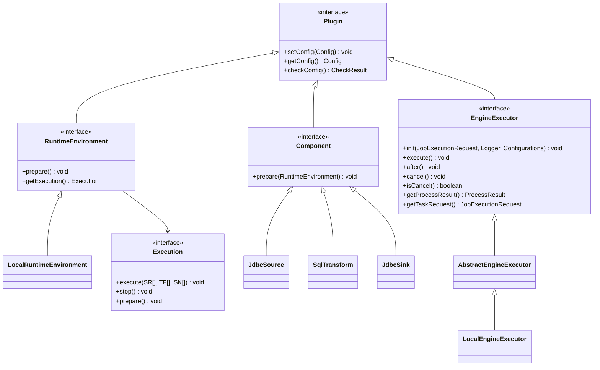
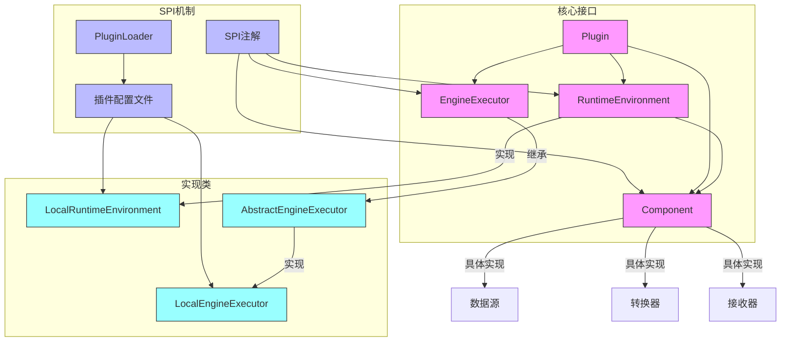

# 引擎API与抽象

<cite>
**本文档中引用的文件**  
- [EngineExecutor.java](file://datavines-engine/datavines-engine-api/src/main/java/io/datavines/engine/api/engine/EngineExecutor.java)
- [RuntimeEnvironment.java](file://datavines-engine/datavines-engine-api/src/main/java/io/datavines/engine/api/env/RuntimeEnvironment.java)
- [Component.java](file://datavines-engine/datavines-engine-api/src/main/java/io/datavines/engine/api/component/Component.java)
- [EngineConstants.java](file://datavines-engine/datavines-engine-api/src/main/java/io/datavines/engine/api/EngineConstants.java)
- [Plugin.java](file://datavines-engine/datavines-engine-api/src/main/java/io/datavines/engine/api/plugin/Plugin.java)
- [Execution.java](file://datavines-engine/datavines-engine-api/src/main/java/io/datavines/engine/api/env/Execution.java)
- [SPI.java](file://datavines-spi/src/main/java/io/datavines/spi/SPI.java)
- [PluginLoader.java](file://datavines-spi/src/main/java/io/datavines/spi/PluginLoader.java)
- [AbstractEngineExecutor.java](file://datavines-engine/datavines-engine-executor/src/main/java/io/datavines/engine/executor/core/base/AbstractEngineExecutor.java)
- [LocalEngineExecutor.java](file://datavines-engine/datavines-engine-plugins/datavines-engine-local/datavines-engine-local-executor/src/main/java/io/datavines/engine/local/executor/LocalEngineExecutor.java)
- [LocalRuntimeEnvironment.java](file://datavines-engine/datavines-engine-plugins/datavines-engine-local/datavines-engine-local-api/src/main/java/io/datavines/engine/local/api/LocalRuntimeEnvironment.java)
- [io.datavines.engine.api.engine.EngineExecutor](file://datavines-engine/datavines-engine-plugins/datavines-engine-local/datavines-engine-local-executor/src/main/resources/META-INF/plugins/io.datavines.engine.api.engine.EngineExecutor)
- [io.datavines.engine.api.env.RuntimeEnvironment](file://datavines-engine/datavines-engine-plugins/datavines-engine-local/datavines-engine-local-api/src/main/resources/META-INF/plugins/io.datavines.engine.api.env.RuntimeEnvironment)
</cite>

## 目录
1. [引言](#引言)
2. [核心接口定义](#核心接口定义)
3. [执行契约详解](#执行契约详解)
4. [运行时环境封装](#运行时环境封装)
5. [执行流水线构建](#执行流水线构建)
6. [常量定义与使用](#常量定义与使用)
7. [SPI扩展机制](#spi扩展机制)
8. [实现示例分析](#实现示例分析)
9. [架构关系图](#架构关系图)
10. [结论](#结论)

## 引言
DataVines引擎API与抽象层为数据质量检测系统提供了统一的执行框架。该框架通过定义清晰的接口契约，实现了不同执行引擎之间的解耦，支持本地、Spark、Flink等多种执行环境。本文档深入解析引擎API的核心组件，包括执行契约、运行时环境、流水线构建等关键概念，以及SPI扩展机制的实现原理。

## 核心接口定义
引擎API的核心由多个接口组成，这些接口共同构成了执行引擎的基础架构。主要接口包括EngineExecutor、RuntimeEnvironment、Component和Plugin，它们通过继承关系和组合模式构建了一个灵活可扩展的执行框架。

**图表来源**
- [EngineExecutor.java](file://datavines-engine/datavines-engine-api/src/main/java/io/datavines/engine/api/engine/EngineExecutor.java#L27-L42)
- [RuntimeEnvironment.java](file://datavines-engine/datavines-engine-api/src/main/java/io/datavines/engine/api/env/RuntimeEnvironment.java#L23-L28)
- [Component.java](file://datavines-engine/datavines-engine-api/src/main/java/io/datavines/engine/api/component/Component.java#L24-L26)
- [Plugin.java](file://datavines-engine/datavines-engine-api/src/main/java/io/datavines/engine/api/plugin/Plugin.java#L24-L31)
- [Execution.java](file://datavines-engine/datavines-engine-api/src/main/java/io/datavines/engine/api/env/Execution.java#L23-L30)

## 执行契约详解
EngineExecutor接口定义了执行引擎的核心契约，规范了任务执行的完整生命周期。该接口通过一系列方法调用，确保了执行过程的标准化和可预测性。

### 初始化方法
init方法负责执行器的初始化工作，接收任务执行请求、日志记录器和配置信息作为参数。这是执行流程的起点，为后续的执行做好准备。

### 执行方法
execute方法是执行器的核心，负责启动实际的任务执行过程。该方法被设计为阻塞调用，直到任务完成或被取消。

### 清理方法
after方法在执行完成后调用，用于执行必要的清理工作，如资源释放、状态更新等。

### 取消机制
cancel方法提供了任务取消的能力，isCancel方法则用于查询当前任务是否已被取消，两者共同实现了执行过程的可控性。

### 结果获取
getProcessResult方法返回执行结果，getTaskRequest方法返回原始的任务请求，这两个方法为执行结果的获取和追溯提供了支持。

**章节来源**
- [EngineExecutor.java](file://datavines-engine/datavines-engine-api/src/main/java/io/datavines/engine/api/engine/EngineExecutor.java#L27-L42)

## 运行时环境封装
RuntimeEnvironment接口封装了不同执行环境的上下文信息，为执行过程提供了必要的环境支持。

### 环境准备
prepare方法负责环境的准备工作，如连接建立、资源分配等。该方法在执行开始前调用，确保执行环境处于就绪状态。

### 执行获取
getExecution方法返回与当前环境关联的执行实例，实现了环境与执行的绑定。通过这种方式，不同的运行时环境可以提供不同的执行策略。

### 插件继承
RuntimeEnvironment继承自Plugin接口，获得了配置管理能力。这使得运行时环境可以接收外部配置，并进行有效性验证。

**章节来源**
- [RuntimeEnvironment.java](file://datavines-engine/datavines-engine-api/src/main/java/io/datavines/engine/api/env/RuntimeEnvironment.java#L23-L28)

## 执行流水线构建
Component接口在构建执行流水线中扮演着关键角色，它定义了流水线中各个组件的基本行为。

### 组件准备
prepare方法接收RuntimeEnvironment作为参数，允许组件根据当前执行环境进行初始化和配置。这种设计使得组件能够适应不同的执行环境。

### 流水线结构
执行流水线通常由三个部分组成：数据源（Source）、数据转换（Transform）和数据接收器（Sink）。每个部分都实现了Component接口，形成了统一的处理流程。

### 类型参数化
Execution接口使用泛型参数SR、TF、SK分别表示源、转换和接收器类型，提供了类型安全的执行契约。这种设计既保证了类型安全，又保持了足够的灵活性。

**章节来源**
- [Component.java](file://datavines-engine/datavines-engine-api/src/main/java/io/datavines/engine/api/component/Component.java#L24-L26)
- [Execution.java](file://datavines-engine/datavines-engine-api/src/main/java/io/datavines/engine/api/env/Execution.java#L23-L30)

## 常量定义与使用
EngineConstants类定义了引擎API中使用的各类常量，为配置和数据交换提供了统一的标准。

### 表名常量
OUTPUT_TABLE、INPUT_TABLE和TMP_TABLE常量用于标识不同类型的数据表，确保在数据处理过程中表名的一致性。

### 标识常量
PID常量用于标识进程ID，在分布式环境中用于跟踪和管理执行实例。

### 类型常量
PLUGIN_TYPE和TYPE常量用于标识插件类型和组件类型，支持基于类型的插件查找和实例化。

这些常量的集中定义避免了代码中的魔法值，提高了代码的可读性和可维护性。

**章节来源**
- [EngineConstants.java](file://datavines-engine/datavines-engine-api/src/main/java/io/datavines/engine/api/EngineConstants.java#L19-L32)

## SPI扩展机制
SPI（Service Provider Interface）机制是引擎API实现可扩展性的核心，它允许在不修改核心代码的情况下添加新的功能实现。

### 注解定义
@SPI注解标记了可扩展的接口，表明这些接口的实现可以通过SPI机制动态加载。该注解位于datavines-spi模块中，为整个系统提供了统一的扩展点管理。

### 插件加载
PluginLoader类负责SPI插件的加载和管理。它通过读取META-INF/plugins目录下的配置文件，发现并实例化插件实现。

### 配置文件
插件配置文件位于META-INF/plugins目录下，文件名是接口的全限定名，内容是实现类的别名和全限定名映射。例如，EngineExecutor的配置文件定义了local别名对应的LocalEngineExecutor实现。

### 动态实例化
PluginLoader提供了getOrCreatePlugin方法，根据别名获取或创建插件实例。该方法实现了单例模式，确保相同别名的插件在系统中只有一个实例。

**章节来源**
- [SPI.java](file://datavines-spi/src/main/java/io/datavines/spi/SPI.java#L28-L32)
- [PluginLoader.java](file://datavines-spi/src/main/java/io/datavines/spi/PluginLoader.java#L51-L487)
- [io.datavines.engine.api.engine.EngineExecutor](file://datavines-engine/datavines-engine-plugins/datavines-engine-local/datavines-engine-local-executor/src/main/resources/META-INF/plugins/io.datavines.engine.api.engine.EngineExecutor#L1)
- [io.datavines.engine.api.env.RuntimeEnvironment](file://datavines-engine/datavines-engine-plugins/datavines-engine-local/datavines-engine-local-api/src/main/resources/META-INF/plugins/io.datavines.engine.api.env.RuntimeEnvironment#L1)

## 实现示例分析
以本地执行引擎为例，分析核心接口的具体实现方式。

### 执行器实现
LocalEngineExecutor继承自AbstractEngineExecutor，实现了EngineExecutor接口。它通过LocalDataVinesBootstrap启动本地执行流程，并管理执行状态。

### 环境实现
LocalRuntimeEnvironment实现了RuntimeEnvironment接口，提供了本地执行环境的具体实现。它管理数据库连接、执行状态等运行时信息。

### 抽象基类
AbstractEngineExecutor提供了执行器的公共实现，如取消标志、日志处理等，减少了重复代码，提高了代码复用性。

这些实现展示了如何通过继承和组合模式，构建一个完整且可扩展的执行引擎。

**章节来源**
- [AbstractEngineExecutor.java](file://datavines-engine/datavines-engine-executor/src/main/java/io/datavines/engine/executor/core/base/AbstractEngineExecutor.java#L27-L56)
- [LocalEngineExecutor.java](file://datavines-engine/datavines-engine-plugins/datavines-engine-local/datavines-engine-local-executor/src/main/java/io/datavines/engine/local/executor/LocalEngineExecutor.java#L27-L57)
- [LocalRuntimeEnvironment.java](file://datavines-engine/datavines-engine-plugins/datavines-engine-local/datavines-engine-local-api/src/main/java/io/datavines/engine/local/api/LocalRuntimeEnvironment.java#L32-L98)

## 架构关系图
以下图表展示了引擎API各组件之间的关系和交互流程。

**图表来源**
- [EngineExecutor.java](file://datavines-engine/datavines-engine-api/src/main/java/io/datavines/engine/api/engine/EngineExecutor.java)
- [RuntimeEnvironment.java](file://datavines-engine/datavines-engine-api/src/main/java/io/datavines/engine/api/env/RuntimeEnvironment.java)
- [Component.java](file://datavines-engine/datavines-engine-api/src/main/java/io/datavines/engine/api/component/Component.java)
- [Plugin.java](file://datavines-engine/datavines-engine-api/src/main/java/io/datavines/engine/api/plugin/Plugin.java)
- [SPI.java](file://datavines-spi/src/main/java/io/datavines/spi/SPI.java)
- [PluginLoader.java](file://datavines-spi/src/main/java/io/datavines/spi/PluginLoader.java)
- [AbstractEngineExecutor.java](file://datavines-engine/datavines-engine-executor/src/main/java/io/datavines/engine/executor/core/base/AbstractEngineExecutor.java)
- [LocalEngineExecutor.java](file://datavines-engine/datavines-engine-plugins/datavines-engine-local/datavines-engine-local-executor/src/main/java/io/datavines/engine/local/executor/LocalEngineExecutor.java)
- [LocalRuntimeEnvironment.java](file://datavines-engine/datavines-engine-plugins/datavines-engine-local/datavines-engine-local-api/src/main/java/io/datavines/engine/local/api/LocalRuntimeEnvironment.java)

## 结论
DataVines引擎API与抽象层通过精心设计的接口契约和SPI扩展机制，构建了一个灵活、可扩展的执行框架。EngineExecutor接口定义了统一的执行契约，RuntimeEnvironment封装了执行环境的上下文信息，Component接口支持构建复杂的执行流水线，而SPI机制则为系统的可扩展性提供了坚实的基础。这种设计不仅支持当前的本地、Spark、Flink等执行引擎，也为未来添加新的执行引擎提供了便利，体现了良好的架构设计原则。