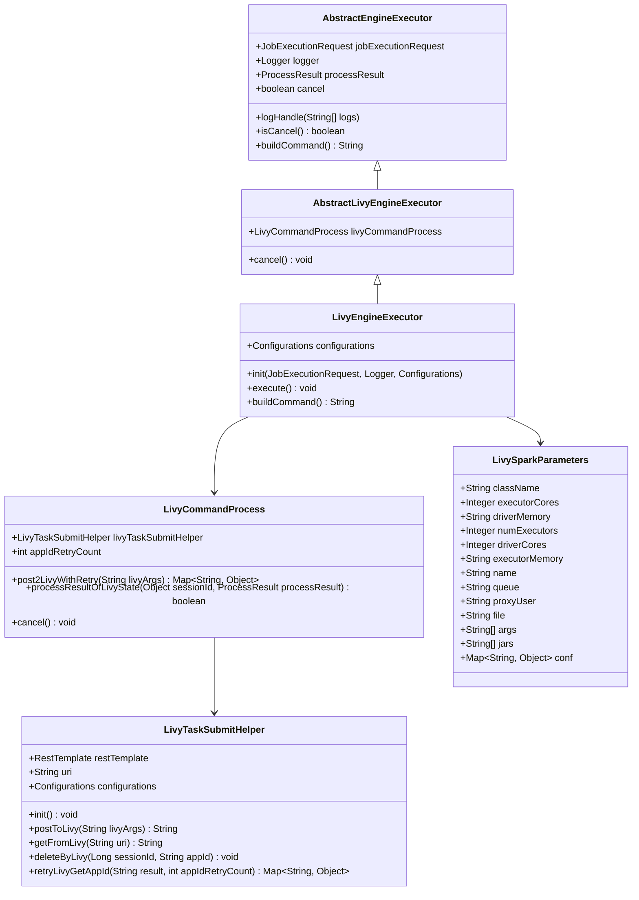
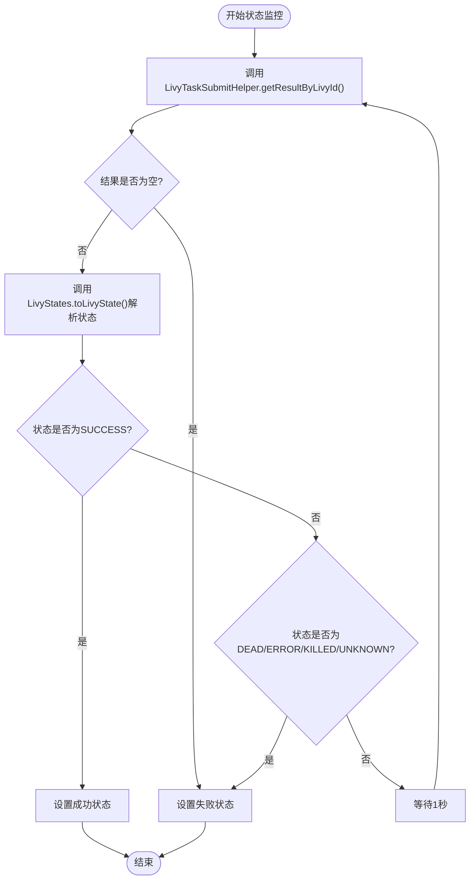
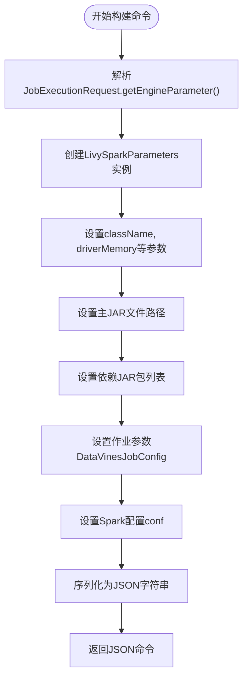
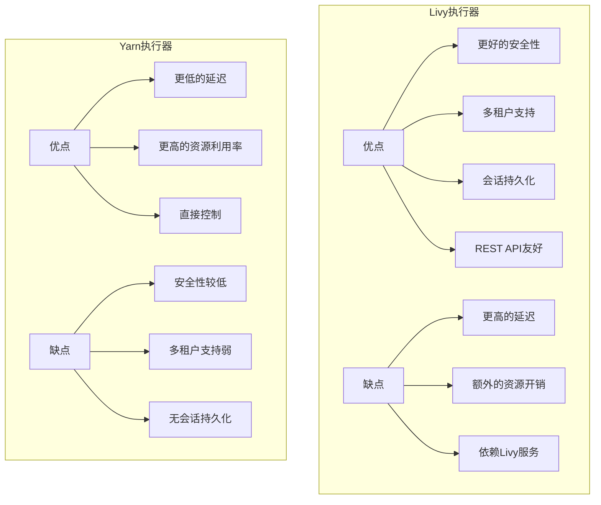

# Livy执行器

<cite>
**本文档引用的文件**   
- [AbstractLivyEngineExecutor.java](file://datavines-engine\datavines-engine-executor\src\main\java\io\datavines\engine\executor\core\base\AbstractLivyEngineExecutor.java)
- [LivyTaskSubmitHelper.java](file://datavines-engine\datavines-engine-executor\src\main\java\io\datavines\engine\executor\core\helper\LivyTaskSubmitHelper.java)
- [LivyEngineExecutor.java](file://datavines-engine\datavines-engine-plugins\datavines-engine-livy\datavines-engine-livy-executor\src\main\java\io\datavines\engine\livy\executor\LivyEngineExecutor.java)
- [LivyCommandProcess.java](file://datavines-engine\datavines-engine-executor\src\main\java\io\datavines\engine\executor\core\executor\LivyCommandProcess.java)
- [LivySparkParameters.java](file://datavines-engine\datavines-engine-plugins\datavines-engine-livy\datavines-engine-livy-executor\src\main\java\io\datavines\engine\livy\executor\parameter\LivySparkParameters.java)
- [LivyStates.java](file://datavines-engine\datavines-engine-executor\src\main\java\io\datavines\engine\executor\core\enums\LivyStates.java)
- [AbstractYarnEngineExecutor.java](file://datavines-engine\datavines-engine-executor\src\main\java\io\datavines\engine\executor\core\base\AbstractYarnEngineExecutor.java)
- [YarnUtils.java](file://datavines-common\src\main\java\io\datavines\common\utils\YarnUtils.java)
- [application.yaml](file://datavines-server\src\main\resources\application.yaml)
- [common.properties](file://datavines-common\src\main\resources\common.properties)
</cite>

## 目录
1. [简介](#简介)
2. [核心架构](#核心架构)
3. [会话管理与作业提交](#会话管理与作业提交)
4. [资源调度策略](#资源调度策略)
5. [容错与恢复机制](#容错与恢复机制)
6. [作业参数构造与请求封装](#作业参数构造与请求封装)
7. [性能对比与适用场景](#性能对比与适用场景)
8. [配置参数详解](#配置参数详解)

## 简介

Livy执行器是DataVines平台中用于与Apache Livy服务器交互的关键组件，它通过REST API实现Spark作业的远程提交和状态监控。该执行器基于`AbstractLivyEngineExecutor`抽象类构建，通过`LivyTaskSubmitHelper`辅助类处理与Livy服务器的HTTP通信。Livy执行器的主要优势在于它能够以会话（session）的方式管理Spark作业，提供更细粒度的控制和更好的资源隔离。与传统的Yarn执行器相比，Livy执行器通过REST API与Livy服务器通信，而Livy服务器再与Yarn资源管理器交互，这种间接的架构提供了更好的安全性和多租户支持。

**本节来源**
- [AbstractLivyEngineExecutor.java](file://datavines-engine\datavines-engine-executor\src\main\java\io\datavines\engine\executor\core\base\AbstractLivyEngineExecutor.java#L1-L37)
- [LivyEngineExecutor.java](file://datavines-engine\datavines-engine-plugins\datavines-engine-livy\datavines-engine-livy-executor\src\main\java\io\datavines\engine\livy\executor\LivyEngineExecutor.java#L1-L237)

## 核心架构

Livy执行器的架构采用分层设计，各组件职责明确，协同工作完成Spark作业的提交和监控。核心组件包括`LivyEngineExecutor`、`LivyCommandProcess`、`LivyTaskSubmitHelper`和`LivySparkParameters`。`LivyEngineExecutor`作为具体的执行器实现，继承自`AbstractLivyEngineExecutor`，负责初始化和协调整个作业执行流程。`LivyCommandProcess`负责处理与Livy服务器的通信细节，包括提交作业、查询状态和取消作业。`LivyTaskSubmitHelper`则封装了REST API调用的底层逻辑，支持Kerberos认证等高级功能。`LivySparkParameters`类定义了提交Spark作业所需的所有参数。



**图示来源**
- [AbstractLivyEngineExecutor.java](file://datavines-engine\datavines-engine-executor\src\main\java\io\datavines\engine\executor\core\base\AbstractLivyEngineExecutor.java#L23-L36)
- [LivyEngineExecutor.java](file://datavines-engine\datavines-engine-plugins\datavines-engine-livy\datavines-engine-livy-executor\src\main\java\io\datavines\engine\livy\executor\LivyEngineExecutor.java#L42-L236)
- [LivyCommandProcess.java](file://datavines-engine\datavines-engine-executor\src\main\java\io\datavines\engine\executor\core\executor\LivyCommandProcess.java#L38-L142)
- [LivyTaskSubmitHelper.java](file://datavines-engine\datavines-engine-executor\src\main\java\io\datavines\engine\executor\core\helper\LivyTaskSubmitHelper.java#L39-L257)
- [LivySparkParameters.java](file://datavines-engine\datavines-engine-plugins\datavines-engine-livy\datavines-engine-livy-executor\src\main\java\io\datavines\engine\livy\executor\parameter\LivySparkParameters.java#L22-L193)

## 会话管理与作业提交

Livy执行器通过REST API与Livy服务器交互，实现Spark作业的会话管理和远程提交。作业提交流程始于`LivyEngineExecutor`的`execute`方法，该方法调用`LivyCommandProcess`的`post2LivyWithRetry`方法提交作业。`LivyCommandProcess`首先通过`buildCommand`方法构造符合Livy API要求的JSON请求体，然后使用`LivyTaskSubmitHelper`的`postToLivy`方法发送POST请求到Livy服务器的`/batches`端点。成功提交后，Livy服务器返回一个包含会话ID的响应，执行器通过轮询`/batches/{sessionId}`端点来监控作业状态。

```mermaid
sequenceDiagram
participant LivyEngineExecutor as Livy执行器
participant LivyCommandProcess as 命令处理器
participant LivyTaskSubmitHelper as 提交助手
participant LivyServer as Livy服务器
LivyEngineExecutor->>LivyCommandProcess : execute()
LivyCommandProcess->>LivyEngineExecutor : buildCommand()
LivyEngineExecutor-->>LivyCommandProcess : JSON请求体
LivyCommandProcess->>LivyTaskSubmitHelper : post2LivyWithRetry()
LivyTaskSubmitHelper->>LivyServer : POST /batches
LivyServer-->>LivyTaskSubmitHelper : 201 Created + 会话ID
LivyTaskSubmitHelper-->>LivyCommandProcess : 返回结果
loop 状态监控
LivyCommandProcess->>LivyTaskSubmitHelper : getResultByLivyId()
LivyTaskSubmitHelper->>LivyServer : GET /batches/{sessionId}
LivyServer-->>LivyTaskSubmitHelper : 会话状态
LivyTaskSubmitHelper-->>LivyCommandProcess : 状态信息
alt 作业成功
LivyCommandProcess->>LivyEngineExecutor : 设置成功状态
break 结束
else 作业失败或被取消
LivyCommandProcess->>LivyEngineExecutor : 设置失败状态
break 结束
else 作业仍在运行
LivyCommandProcess->>LivyCommandProcess : 等待1秒
end
end
```

**图示来源**
- [LivyEngineExecutor.java](file://datavines-engine\datavines-engine-plugins\datavines-engine-livy\datavines-engine-livy-executor\src\main\java\io\datavines\engine\livy\executor\LivyEngineExecutor.java#L60-L78)
- [LivyCommandProcess.java](file://datavines-engine\datavines-engine-executor\src\main\java\io\datavines\engine\executor\core\executor\LivyCommandProcess.java#L71-L119)
- [LivyTaskSubmitHelper.java](file://datavines-engine\datavines-engine-executor\src\main\java\io\datavines\engine\executor\core\helper\LivyTaskSubmitHelper.java#L113-L164)

**本节来源**
- [LivyEngineExecutor.java](file://datavines-engine\datavines-engine-plugins\datavines-engine-livy\datavines-engine-livy-executor\src\main\java\io\datavines\engine\livy\executor\LivyEngineExecutor.java#L60-L78)
- [LivyCommandProcess.java](file://datavines-engine\datavines-engine-executor\src\main\java\io\datavines\engine\executor\core\executor\LivyCommandProcess.java#L71-L119)

## 资源调度策略

Livy执行器的资源调度策略主要通过配置参数来实现，这些参数在`LivySparkParameters`类中定义，并在`LivyEngineExecutor`的`buildCommand`方法中设置。执行器支持配置驱动程序和执行器的内存、核心数、队列等资源。资源调度平台类型由`ResourceSchedulePlatformType`枚举定义，目前支持YARN。执行器通过读取配置文件中的`livy.uri`参数确定Livy服务器地址，并通过`livy.task.proxyUser`参数支持代理用户提交作业，这对于多租户环境非常重要。资源调度的粒度由`numExecutors`、`executorCores`和`executorMemory`等参数控制，允许用户根据作业需求精确分配资源。

**本节来源**
- [LivySparkParameters.java](file://datavines-engine\datavines-engine-plugins\datavines-engine-livy\datavines-engine-livy-executor\src\main\java\io\datavines\engine\livy\executor\parameter\LivySparkParameters.java#L22-L193)
- [LivyEngineExecutor.java](file://datavines-engine\datavines-engine-plugins\datavines-engine-livy\datavines-engine-livy-executor\src\main\java\io\datavines\engine\livy\executor\LivyEngineExecutor.java#L97-L236)
- [application.yaml](file://datavines-server\src\main\resources\application.yaml)

## 容错与恢复机制

Livy执行器实现了多层次的容错与恢复机制，确保作业的可靠执行。状态监控方面，`LivyCommandProcess`的`processResultOfLivyState`方法通过轮询Livy服务器获取会话状态，使用`LivyStates`枚举来解析和判断状态。当检测到`DEAD`、`ERROR`、`KILLED`或`UNKNOWN`状态时，执行器会将作业标记为失败。取消机制方面，`cancel`方法首先调用Livy服务器的DELETE接口终止会话，如果失败则回退到直接调用Yarn的`application -kill`命令。此外，`retryLivyGetAppId`方法实现了获取应用ID的重试逻辑，通过配置`livy.task.appId.retry.count`参数控制重试次数，默认为2次。



**图示来源**
- [LivyCommandProcess.java](file://datavines-engine\datavines-engine-executor\src\main\java\io\datavines\engine\executor\core\executor\LivyCommandProcess.java#L87-L119)
- [LivyStates.java](file://datavines-engine\datavines-engine-executor\src\main\java\io\datavines\engine\executor\core\enums\LivyStates.java#L24-L82)
- [LivyTaskSubmitHelper.java](file://datavines-engine\datavines-engine-executor\src\main\java\io\datavines\engine\executor\core\helper\LivyTaskSubmitHelper.java#L67-L103)

**本节来源**
- [LivyCommandProcess.java](file://datavines-engine\datavines-engine-executor\src\main\java\io\datavines\engine\executor\core\executor\LivyCommandProcess.java#L87-L119)
- [LivyStates.java](file://datavines-engine\datavines-engine-executor\src\main\java\io\datavines\engine\executor\core\enums\LivyStates.java#L24-L82)

## 作业参数构造与请求封装

作业参数的构造和请求封装是通过`LivyEngineExecutor`的`buildCommand`方法和`LivyTaskSubmitHelper`类协同完成的。`buildCommand`方法首先从`JobExecutionRequest`中解析出`SparkParameters`，然后将其转换为`LivySparkParameters`对象。这个过程包括设置主类、JAR文件路径、依赖JAR包、作业参数和配置项。`LivyTaskSubmitHelper`负责将构造好的参数对象序列化为JSON字符串，并通过HTTP POST请求发送到Livy服务器。该类还处理了Kerberos认证，根据`livy.need.kerberos`配置决定使用普通`RestTemplate`还是`KerberosRestTemplate`。



**图示来源**
- [LivyEngineExecutor.java](file://datavines-engine\datavines-engine-plugins\datavines-engine-livy\datavines-engine-livy-executor\src\main\java\io\datavines\engine\livy\executor\LivyEngineExecutor.java#L97-L157)
- [LivyTaskSubmitHelper.java](file://datavines-engine\datavines-engine-executor\src\main\java\io\datavines\engine\executor\core\helper\LivyTaskSubmitHelper.java#L113-L164)

**本节来源**
- [LivyEngineExecutor.java](file://datavines-engine\datavines-engine-plugins\datavines-engine-livy\datavines-engine-livy-executor\src\main\java\io\datavines\engine\livy\executor\LivyEngineExecutor.java#L97-L157)
- [LivyTaskSubmitHelper.java](file://datavines-engine\datavines-engine-executor\src\main\java\io\datavines\engine\executor\core\helper\LivyTaskSubmitHelper.java#L113-L164)

## 性能对比与适用场景

与Yarn执行器相比，Livy执行器在性能和适用场景上有显著差异。Yarn执行器通过`ShellCommandProcess`直接执行`spark-submit`命令，通信开销小，启动速度快，适合对延迟敏感的场景。而Livy执行器通过REST API与Livy服务器通信，增加了网络开销和中间层处理时间，但提供了更好的安全性和多租户支持。Livy执行器适用于需要细粒度权限控制、动态资源分配和Web友好的交互环境。在容错方面，Livy执行器的状态监控更稳定，因为Livy服务器会持久化会话状态，即使客户端断开连接，作业仍可继续运行。然而，Yarn执行器在资源利用率上可能更高，因为它直接与Yarn交互，减少了中间层的资源消耗。



**图示来源**
- [LivyEngineExecutor.java](file://datavines-engine\datavines-engine-plugins\datavines-engine-livy\datavines-engine-livy-executor\src\main\java\io\datavines\engine\livy\executor\LivyEngineExecutor.java)
- [AbstractYarnEngineExecutor.java](file://datavines-engine\datavines-engine-executor\src\main\java\io\datavines\engine\executor\core\base\AbstractYarnEngineExecutor.java)
- [YarnUtils.java](file://datavines-common\src\main\java\io\datavines\common\utils\YarnUtils.java)

**本节来源**
- [LivyEngineExecutor.java](file://datavines-engine\datavines-engine-plugins\datavines-engine-livy\datavines-engine-livy-executor\src\main\java\io\datavines\engine\livy\executor\LivyEngineExecutor.java)
- [AbstractYarnEngineExecutor.java](file://datavines-engine\datavines-engine-executor\src\main\java\io\datavines\engine\executor\core\base\AbstractYarnEngineExecutor.java)
- [YarnUtils.java](file://datavines-common\src\main\java\io\datavines\common\utils\YarnUtils.java)

## 配置参数详解

Livy执行器的行为由一系列配置参数控制，这些参数主要定义在`application.yaml`和`common.properties`文件中。关键配置包括`livy.uri`（Livy服务器地址）、`livy.need.kerberos`（是否启用Kerberos认证）、`livy.task.jar.lib.path`（JAR包库路径）和`livy.task.proxyUser`（代理用户）。`livy.task.appId.retry.count`参数控制获取应用ID的重试次数，对于网络不稳定的环境尤为重要。`livy.server.auth.kerberos.principal`和`livy.server.auth.kerberos.keytab`用于配置Kerberos认证的凭据。这些配置使得Livy执行器能够适应不同的部署环境和安全要求。

**本节来源**
- [application.yaml](file://datavines-server\src\main\resources\application.yaml)
- [common.properties](file://datavines-common\src\main\resources\common.properties)
- [LivyTaskSubmitHelper.java](file://datavines-engine\datavines-engine-executor\src\main\java\io\datavines\engine\executor\core\helper\LivyTaskSubmitHelper.java#L53-L65)