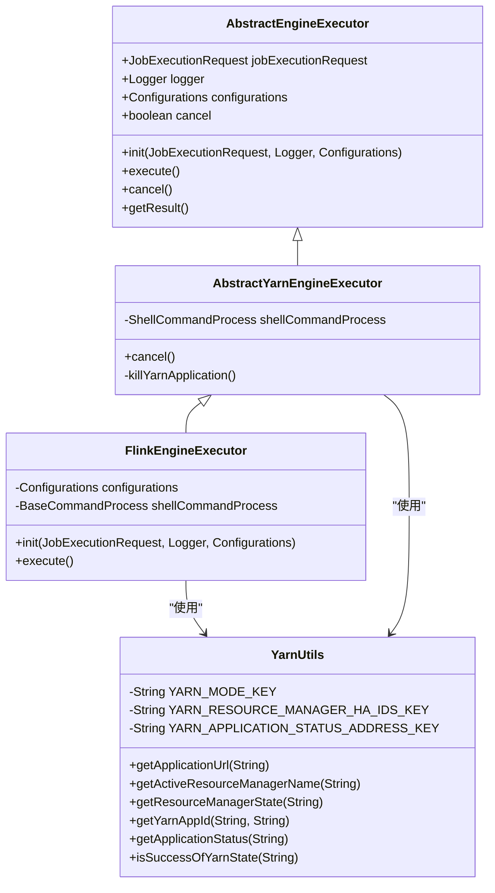
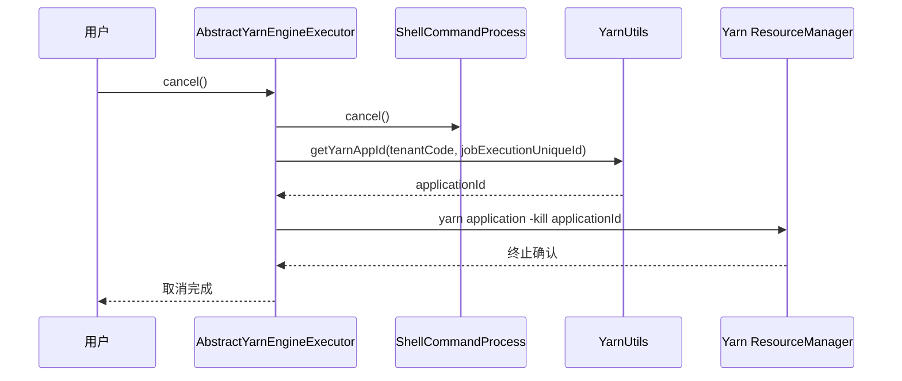
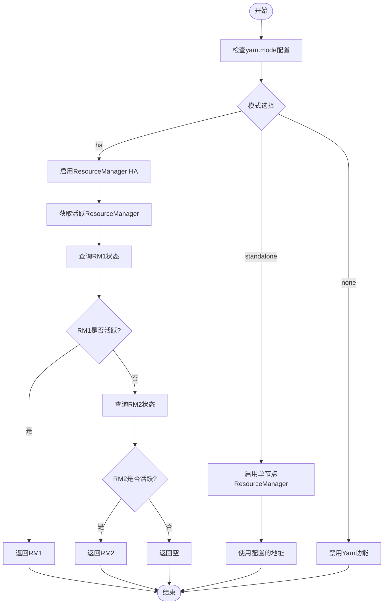
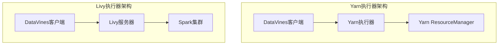

# Yarn执行器

<cite>
**本文档中引用的文件**  
- [AbstractYarnEngineExecutor.java](file://datavines-engine/datavines-engine-executor/src/main/java/io/datavines/engine/executor/core/base/AbstractYarnEngineExecutor.java)
- [YarnUtils.java](file://datavines-common/src/main/java/io/datavines/common/utils/YarnUtils.java)
- [FlinkEngineExecutor.java](file://datavines-engine/datavines-engine-plugins/datavines-engine-flink/datavines-engine-flink-executor/src/main/java/io/datavines/engine/flink/executor/FlinkEngineExecutor.java)
- [SparkParameters.java](file://datavines-engine/datavines-engine-plugins/datavines-engine-spark/datavines-engine-spark-executor/src/main/java/io/datavines/engine/spark/executor/parameter/SparkParameters.java)
- [LivyEngineExecutor.java](file://datavines-engine/datavines-engine-plugins/datavines-engine-livy/datavines-engine-livy-executor/src/main/java/io/datavines/engine/livy/executor/LivyEngineExecutor.java)
- [ResourceSchedulePlatformType.java](file://datavines-engine/datavines-engine-executor/src/main/java/io/datavines/engine/executor/core/enums/ResourceSchedulePlatformType.java)
- [common.properties](file://datavines-common/src/main/resources/common.properties)
</cite>

## 目录
1. [引言](#引言)
2. [Yarn执行器架构](#yarn执行器架构)
3. [核心组件分析](#核心组件分析)
4. [资源隔离与队列管理](#资源隔离与队列管理)
5. [Yarn与Livy执行器对比](#yarn与livy执行器对比)
6. [大规模集群性能优化](#大规模集群性能优化)
7. [故障恢复机制](#故障恢复机制)
8. [配置建议](#配置建议)
9. [结论](#结论)

## 引言
Yarn执行器是DataVines平台中用于与Hadoop Yarn资源管理器直接交互的核心组件，负责作业的资源申请和任务调度。该执行器通过抽象基类`AbstractYarnEngineExecutor`实现与Yarn ResourceManager的通信，支持在大规模分布式环境中高效执行数据质量检查任务。本文档将深入分析Yarn执行器的实现机制，包括资源隔离、队列管理和优先级调度等关键功能，并与Livy执行器进行对比，提供在大规模集群环境中的性能优化建议。

## Yarn执行器架构

**图表来源**  
- [AbstractYarnEngineExecutor.java](file://datavines-engine/datavines-engine-executor/src/main/java/io/datavines/engine/executor/core/base/AbstractYarnEngineExecutor.java)
- [YarnUtils.java](file://datavines-common/src/main/java/io/datavines/common/utils/YarnUtils.java)
- [FlinkEngineExecutor.java](file://datavines-engine/datavines-engine-plugins/datavines-engine-flink/datavines-engine-flink-executor/src/main/java/io/datavines/engine/flink/executor/FlinkEngineExecutor.java)

**本节来源**  
- [AbstractYarnEngineExecutor.java](file://datavines-engine/datavines-engine-executor/src/main/java/io/datavines/engine/executor/core/base/AbstractYarnEngineExecutor.java#L25-L59)
- [YarnUtils.java](file://datavines-common/src/main/java/io/datavines/common/utils/YarnUtils.java#L29-L270)

## 核心组件分析

### AbstractYarnEngineExecutor实现机制
`AbstractYarnEngineExecutor`作为Yarn执行器的抽象基类，定义了与Yarn ResourceManager交互的核心机制。该类通过继承`AbstractEngineExecutor`并扩展Yarn特定功能，实现了作业的生命周期管理。当需要取消作业时，执行器首先调用`shellCommandProcess.cancel()`终止本地进程，然后通过`killYarnApplication()`方法向Yarn集群发送应用终止指令。

作业取消流程通过`sudo -u {tenantCode} yarn application -kill {applicationId}`命令实现，该命令以租户用户身份执行，确保了多租户环境下的安全隔离。`YarnUtils`工具类负责获取应用ID，通过租户代码和作业执行唯一标识符进行查询，实现了精确的应用定位。

**图表来源**  
- [AbstractYarnEngineExecutor.java](file://datavines-engine/datavines-engine-executor/src/main/java/io/datavines/engine/executor/core/base/AbstractYarnEngineExecutor.java#L30-L58)
- [YarnUtils.java](file://datavines-common/src/main/java/io/datavines/common/utils/YarnUtils.java#L171-L191)

**本节来源**  
- [AbstractYarnEngineExecutor.java](file://datavines-engine/datavines-engine-executor/src/main/java/io/datavines/engine/executor/core/base/AbstractYarnEngineExecutor.java#L25-L59)
- [YarnUtils.java](file://datavines-common/src/main/java/io/datavines/common/utils/YarnUtils.java#L171-L191)

## 资源隔离与队列管理

### 资源隔离机制
Yarn执行器通过多层机制实现资源隔离。首先，`ResourceSchedulePlatformType`枚举定义了三种资源调度平台类型：LOCAL、YARN和K8S，为不同环境提供了统一的抽象接口。在Yarn模式下，系统通过`yarn.mode`配置项确定部署模式，支持`none`、`ha`（高可用）和`standalone`三种模式。

高可用模式下，`getActiveResourceManagerName`方法通过HTTP接口查询ResourceManager状态，自动识别活跃的ResourceManager节点。该方法向`http://{rmId}:8088/ws/v1/cluster/info`发送请求，解析返回的JSON数据中的`haState`字段，当状态为`ACTIVE`时返回对应的ResourceManager ID，确保了在集群故障切换时仍能正确通信。

**图表来源**  
- [YarnUtils.java](file://datavines-common/src/main/java/io/datavines/common/utils/YarnUtils.java#L59-L119)

**本节来源**  
- [YarnUtils.java](file://datavines-common/src/main/java/io/datavines/common/utils/YarnUtils.java#L33-L151)
- [ResourceSchedulePlatformType.java](file://datavines-engine/datavines-engine-executor/src/main/java/io/datavines/engine/executor/core/enums/ResourceSchedulePlatformType.java#L19-L25)

### 队列管理与优先级调度
Yarn执行器通过队列配置实现资源的分组管理和优先级调度。在Spark和Flink等具体执行器中，`queue`参数用于指定YARN队列，将作业提交到特定的资源池。这种机制允许多个团队或项目共享同一集群，同时保证关键任务获得足够的资源。

对于Flink作业，`FlinkArgsUtils`工具类在构建执行参数时，会根据部署模式添加相应的队列配置。当部署模式为YARN相关模式时，系统会添加`-Dyarn.application.queue={queueName}`参数，确保作业被正确分配到指定队列。此外，还可以通过`-Dyarn.tags`参数为作业添加标签，便于后续的监控和管理。

资源调度优先级通过YARN自身的容量调度器或公平调度器实现。管理员可以配置队列的容量、最大容量和权重，控制不同队列之间的资源分配比例。执行器本身不直接管理优先级，而是通过选择适当的队列来间接影响作业的调度优先级。

**本节来源**  
- [SparkParameters.java](file://datavines-engine/datavines-engine-plugins/datavines-engine-spark/datavines-engine-spark-executor/src/main/java/io/datavines/engine/spark/executor/parameter/SparkParameters.java#L73-L75)
- [FlinkArgsUtils.java](file://datavines-engine/datavines-engine-plugins/datavines-engine-flink/datavines-engine-flink-executor/src/main/java/io/datavines/engine/flink/executor/parameter/FlinkArgsUtils.java#L79-L83)

## Yarn与Livy执行器对比

### 部署复杂度对比
Yarn执行器和Livy执行器在部署复杂度上存在显著差异。Yarn执行器直接与Yarn ResourceManager交互，只需要在执行节点配置好Hadoop客户端环境，包括`HADOOP_CONF_DIR`和相关配置文件。这种直接集成方式减少了中间件依赖，部署相对简单。

相比之下，Livy执行器需要额外部署Livy服务器，这是一个独立的REST服务，作为Spark和客户端之间的桥梁。Livy服务器需要与Spark集群紧密集成，配置Spark Home路径、Hadoop配置等。这种架构增加了系统组件数量，提高了部署和维护的复杂度。

**图表来源**  
- [LivyEngineExecutor.java](file://datavines-engine/datavines-engine-plugins/datavines-engine-livy/datavines-engine-livy-executor/src/main/java/io/datavines/engine/livy/executor/LivyEngineExecutor.java)
- [AbstractYarnEngineExecutor.java](file://datavines-engine/datavines-engine-executor/src/main/java/io/datavines/engine/executor/core/base/AbstractYarnEngineExecutor.java)

**本节来源**  
- [LivyEngineExecutor.java](file://datavines-engine/datavines-engine-plugins/datavines-engine-livy/datavines-engine-livy-executor/src/main/java/io/datavines/engine/livy/executor/LivyEngineExecutor.java)
- [LivyEngineExecutor.java](file://datavines-engine/datavines-engine-plugins/datavines-engine-livy/README.md#L1-L6)

### 资源利用率与故障恢复
在资源利用率方面，Yarn执行器通常具有更高的效率。由于直接与Yarn交互，减少了中间层的开销，资源申请和释放更加及时。Yarn执行器可以精确控制容器的生命周期，根据作业需求动态调整资源分配。

Livy执行器由于引入了额外的REST层，存在一定的性能开销。Livy服务器需要维护与Spark应用的会话状态，这可能导致资源释放延迟。然而，Livy提供了更好的会话管理和多租户支持，适合需要长时间运行交互式作业的场景。

故障恢复机制上，Yarn执行器依赖Yarn自身的容错能力。当作业失败时，Yarn会尝试在其他节点重新启动容器。DataVines通过`JobExecutionFailover`机制监控作业状态，当检测到作业失败时，会自动触发重试逻辑。

Livy执行器的故障恢复更加复杂，需要处理Livy服务器故障、会话丢失等多种情况。Livy提供了会话持久化功能，可以在服务器重启后恢复之前的会话状态，但这也增加了系统复杂性。

**本节来源**  
- [LivyEngineExecutor.java](file://datavines-engine/datavines-engine-plugins/datavines-engine-livy/datavines-engine-livy-executor/src/main/java/io/datavines/engine/livy/executor/LivyEngineExecutor.java#L25-L27)
- [JobExecutionFailover.java](file://datavines-server/src/main/java/io/datavines/server/dqc/coordinator/failover/JobExecutionFailover.java#L119-L144)

## 大规模集群性能优化

### 配置优化建议
在大规模集群环境中，Yarn执行器的性能优化需要从多个方面考虑。首先，合理配置`yarn.resource.manager.ha.ids`参数，确保高可用性。在生产环境中，应配置至少两个ResourceManager节点，避免单点故障。

其次，优化`yarn.application.status.address`配置，使用负载均衡器或DNS轮询，避免对单个ResourceManager节点造成过大压力。同时，适当调整`yarn.resource.manager.http.address.port`，确保监控接口的可用性。

对于资源密集型作业，建议配置合理的队列策略。通过`queue`参数将不同优先级的作业分配到不同的队列，避免低优先级作业占用过多资源。可以创建多个队列，如`default`、`high-priority`和`low-priority`，并配置相应的容量和权重。

### 监控与调优
启用Yarn应用状态监控，定期调用`getApplicationStatus`方法检查作业状态。为了避免频繁查询对ResourceManager造成压力，建议设置合理的轮询间隔，通常为10-30秒。同时，实现超时机制，防止作业长时间处于未知状态。

在多租户环境中，确保`tenantCode`的正确使用，避免权限越界。通过`sudo -u {tenantCode}`命令以租户身份执行操作，实现了安全的资源隔离。同时，监控每个租户的资源使用情况，防止个别租户过度占用集群资源。

对于长时间运行的作业，建议配置检查点机制，定期保存作业状态。这样即使作业失败，也可以从最近的检查点恢复，减少重复计算的开销。

**本节来源**  
- [YarnUtils.java](file://datavines-common/src/main/java/io/datavines/common/utils/YarnUtils.java#L37-L41)
- [common.properties](file://datavines-common/src/main/resources/common.properties#L18-L25)
- [SparkParameters.java](file://datavines-engine/datavines-engine-plugins/datavines-engine-spark/datavines-engine-spark-executor/src/main/java/io/datavines/engine/spark/executor/parameter/SparkParameters.java)

## 故障恢复机制
Yarn执行器的故障恢复机制主要依赖于Yarn平台自身的容错能力。当容器失败时，Yarn会自动尝试在其他节点重新启动。DataVines通过`YarnJobExecutionStatusChecker`定期检查作业状态，当检测到作业失败时，会触发重试逻辑。

`isSuccessOfYarnState`方法实现了作业状态的轮询检查，通过`Thread.sleep(CommonConstants.SLEEP_TIME_MILLIS)`实现间隔轮询，避免对ResourceManager造成过大压力。当作业状态为`FAILURE`或`KILL`时，返回`false`，触发故障恢复流程。

在集群级别，建议配置Yarn的自动故障转移机制，确保ResourceManager高可用。同时，配置NodeManager的健康检查，及时发现和隔离故障节点。对于关键作业，可以配置重试次数和重试间隔，提高作业的可靠性。

**本节来源**  
- [YarnUtils.java](file://datavines-common/src/main/java/io/datavines/common/utils/YarnUtils.java#L242-L266)
- [JobExecutionFailover.java](file://datavines-server/src/main/java/io/datavines/server/dqc/coordinator/failover/JobExecutionFailover.java#L119-L144)

## 配置建议
1. **高可用配置**：在生产环境中，必须配置`yarn.mode=ha`，并设置`yarn.resource.manager.ha.ids`为多个ResourceManager节点的ID，确保集群高可用。

2. **资源隔离**：为不同租户配置独立的Yarn队列，通过`queue`参数控制资源分配。避免所有作业都提交到默认队列，导致资源争用。

3. **监控优化**：合理设置状态查询间隔，避免频繁查询影响ResourceManager性能。建议轮询间隔不低于10秒。

4. **安全配置**：确保`sudo`命令的正确配置，限制执行权限，防止安全漏洞。定期审计租户权限，确保资源使用的合规性。

5. **日志管理**：配置详细的日志记录，特别是`getApplicationUrl`和`killYarnApplication`等关键操作，便于故障排查。

6. **性能调优**：根据作业类型和资源需求，合理配置`numExecutors`、`executorCores`和`executorMemory`等参数，避免资源浪费或不足。

**本节来源**  
- [YarnUtils.java](file://datavines-common/src/main/java/io/datavines/common/utils/YarnUtils.java)
- [common.properties](file://datavines-common/src/main/resources/common.properties)
- [SparkParameters.java](file://datavines-engine/datavines-engine-plugins/datavines-engine-spark/datavines-engine-spark-executor/src/main/java/io/datavines/engine/spark/executor/parameter/SparkParameters.java)

## 结论
Yarn执行器作为DataVines平台的核心组件，通过`AbstractYarnEngineExecutor`基类实现了与Yarn ResourceManager的直接交互，提供了高效的资源申请和任务调度能力。其架构设计充分考虑了多租户环境下的资源隔离和安全性，通过租户代码和sudo机制实现了安全的作业管理。

与Livy执行器相比，Yarn执行器具有部署简单、资源利用率高的优势，特别适合批处理作业场景。然而，Livy执行器在交互式作业和会话管理方面具有优势。在选择执行器时，应根据具体应用场景和需求进行权衡。

在大规模集群环境中，通过合理的队列管理、高可用配置和监控优化，可以充分发挥Yarn执行器的性能优势。未来可以进一步优化故障恢复机制，实现更智能的作业重试和资源调度策略。