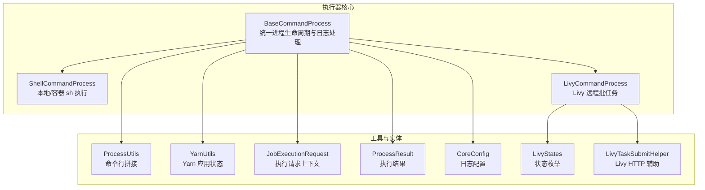
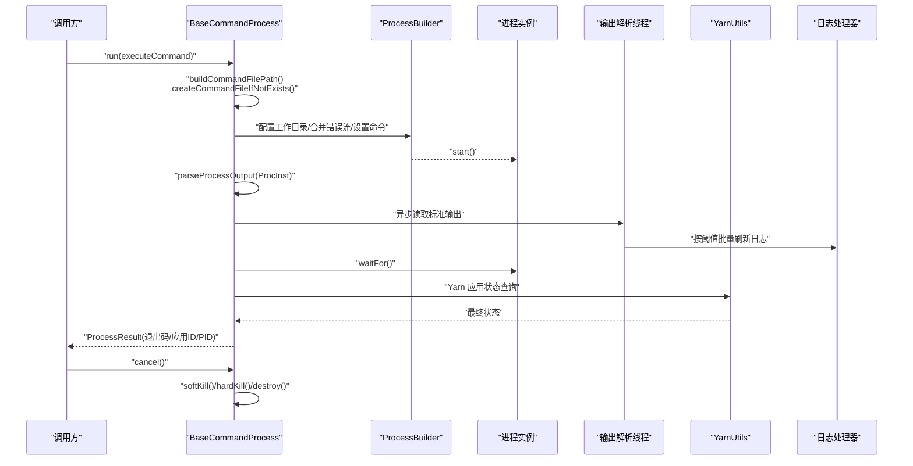
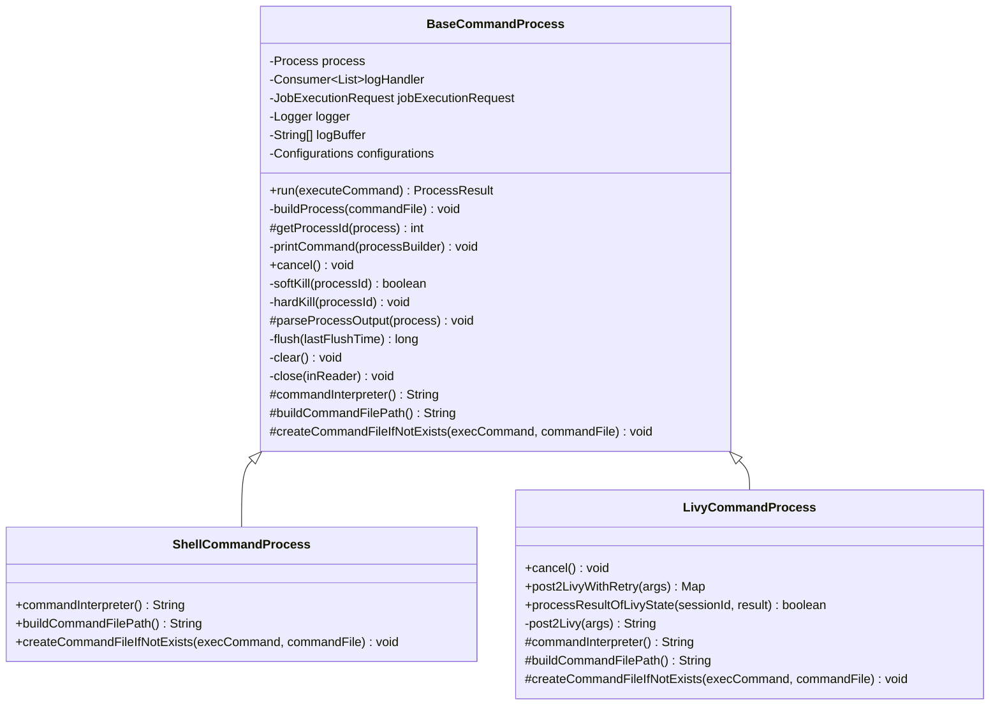
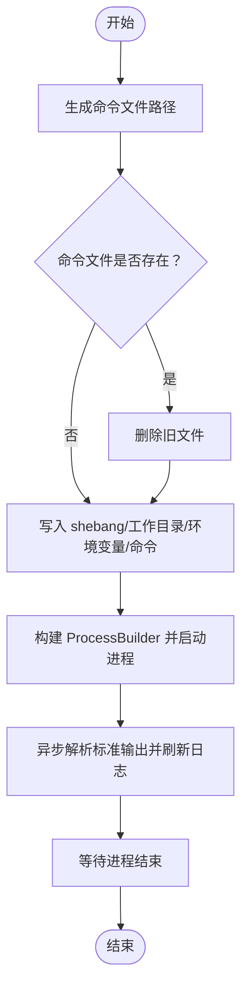
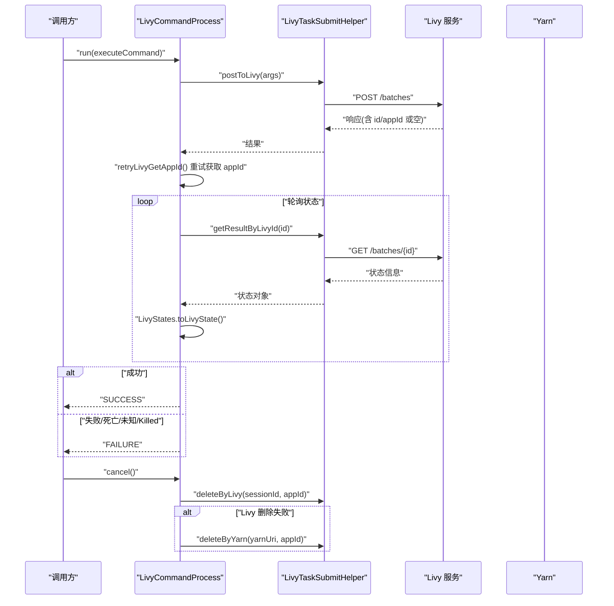
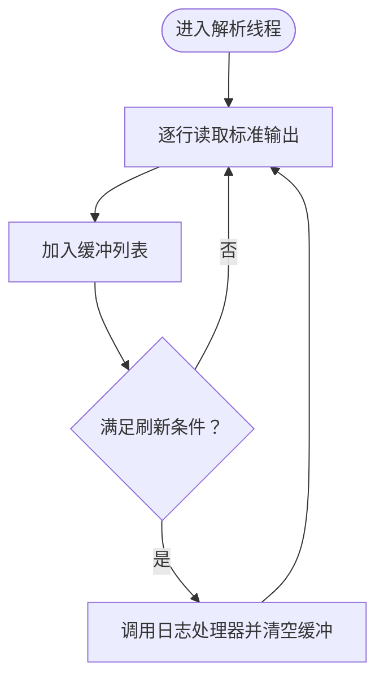
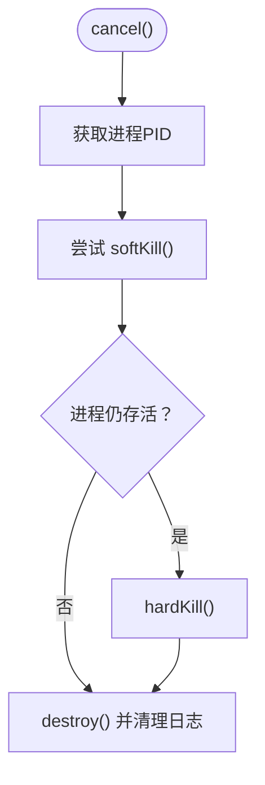
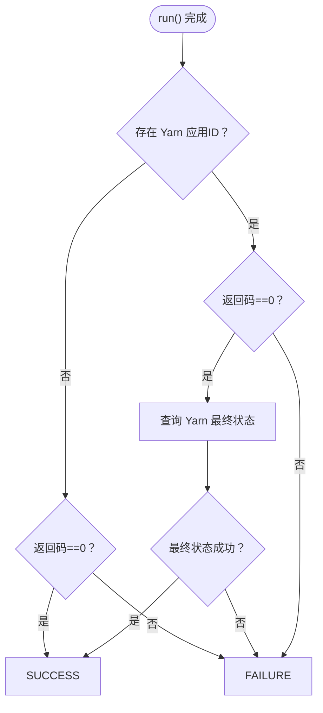
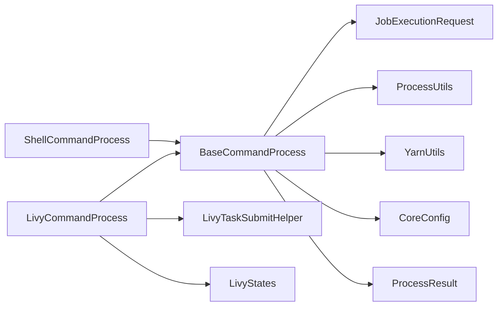

# 命令执行处理器

<cite>
**本文引用的文件列表**
- [BaseCommandProcess.java](file://datavines-engine/datavines-engine-executor/src/main/java/io/datavines/engine/executor/core/executor/BaseCommandProcess.java)
- [ShellCommandProcess.java](file://datavines-engine/datavines-engine-executor/src/main/java/io/datavines/engine/executor/core/executor/ShellCommandProcess.java)
- [LivyCommandProcess.java](file://datavines-engine/datavines-engine-executor/src/main/java/io/datavines/engine/executor/core/executor/LivyCommandProcess.java)
- [ProcessUtils.java](file://datavines-common/src/main/java/io/datavines/common/utils/ProcessUtils.java)
- [YarnUtils.java](file://datavines-common/src/main/java/io/datavines/common/utils/YarnUtils.java)
- [JobExecutionRequest.java](file://datavines-common/src/main/java/io/datavines/common/entity/JobExecutionRequest.java)
- [ProcessResult.java](file://datavines-common/src/main/java/io/datavines/common/entity/ProcessResult.java)
- [CoreConfig.java](file://datavines-common/src/main/java/io/datavines/common/config/CoreConfig.java)
- [LivyStates.java](file://datavines-engine/datavines-engine-executor/src/main/java/io/datavines/engine/executor/core/enums/LivyStates.java)
- [LivyTaskSubmitHelper.java](file://datavines-engine/datavines-engine-executor/src/main/java/io/datavines/engine/executor/core/helper/LivyTaskSubmitHelper.java)
</cite>

## 目录
1. [简介](#简介)
2. [项目结构](#项目结构)
3. [核心组件](#核心组件)
4. [架构总览](#架构总览)
5. [组件详解](#组件详解)
6. [依赖关系分析](#依赖关系分析)
7. [性能与稳定性考量](#性能与稳定性考量)
8. [故障排查指南](#故障排查指南)
9. [结论](#结论)

## 简介
本文件围绕命令执行处理器进行系统化技术文档整理，重点剖析 BaseCommandProcess 如何封装底层命令执行逻辑，覆盖进程创建、输入输出流处理、日志缓存与刷新、软硬终止策略、Yarn 应用状态判定、异常捕获与错误传播等关键能力；同时说明 ShellCommandProcess 与 LivyCommandProcess 的差异化实现，以及它们与执行器核心的协作方式，确保作业执行过程的稳定性与可观测性。

## 项目结构
命令执行处理器位于引擎执行模块中，采用抽象基类 + 具体实现的分层设计：
- 抽象基类：BaseCommandProcess 负责统一的进程生命周期管理、日志采集与缓冲、取消与终止、退出码与应用状态判定。
- 具体实现：
  - ShellCommandProcess：面向本地或容器内 sh/bash 环境，通过写入临时命令文件并以 sudo -u 指定租户用户执行。
  - LivyCommandProcess：面向远程 Livy 服务提交批任务，通过 LivyTaskSubmitHelper 与 Livy 交互，并轮询状态判断最终结果。
- 工具与实体：
  - ProcessUtils：构建可打印的命令行字符串，便于审计与调试。
  - YarnUtils：查询 Yarn 应用状态，辅助判定成功/失败。
  - JobExecutionRequest/ProcessResult：承载执行上下文与结果数据。
  - CoreConfig：日志缓冲与刷新的配置项来源。
  - LivyStates/LivyTaskSubmitHelper：Livy 会话状态枚举与 HTTP 交互辅助。

图表来源
- [BaseCommandProcess.java](file://datavines-engine/datavines-engine-executor/src/main/java/io/datavines/engine/executor/core/executor/BaseCommandProcess.java#L1-L365)
- [ShellCommandProcess.java](file://datavines-engine/datavines-engine-executor/src/main/java/io/datavines/engine/executor/core/executor/ShellCommandProcess.java#L1-L80)
- [LivyCommandProcess.java](file://datavines-engine/datavines-engine-executor/src/main/java/io/datavines/engine/executor/core/executor/LivyCommandProcess.java#L1-L143)
- [ProcessUtils.java](file://datavines-common/src/main/java/io/datavines/common/utils/ProcessUtils.java#L1-L302)
- [YarnUtils.java](file://datavines-common/src/main/java/io/datavines/common/utils/YarnUtils.java#L1-L270)
- [JobExecutionRequest.java](file://datavines-common/src/main/java/io/datavines/common/entity/JobExecutionRequest.java#L1-L86)
- [ProcessResult.java](file://datavines-common/src/main/java/io/datavines/common/entity/ProcessResult.java#L1-L43)
- [CoreConfig.java](file://datavines-common/src/main/java/io/datavines/common/config/CoreConfig.java#L1-L41)
- [LivyStates.java](file://datavines-engine/datavines-engine-executor/src/main/java/io/datavines/engine/executor/core/enums/LivyStates.java#L1-L83)
- [LivyTaskSubmitHelper.java](file://datavines-engine/datavines-engine-executor/src/main/java/io/datavines/engine/executor/core/helper/LivyTaskSubmitHelper.java#L1-L258)

章节来源
- [BaseCommandProcess.java](file://datavines-engine/datavines-engine-executor/src/main/java/io/datavines/engine/executor/core/executor/BaseCommandProcess.java#L1-L365)
- [ShellCommandProcess.java](file://datavines-engine/datavines-engine-executor/src/main/java/io/datavines/engine/executor/core/executor/ShellCommandProcess.java#L1-L80)
- [LivyCommandProcess.java](file://datavines-engine/datavines-engine-executor/src/main/java/io/datavines/engine/executor/core/executor/LivyCommandProcess.java#L1-L143)

## 核心组件
- BaseCommandProcess
  - 统一职责：进程启动、输出解析、日志缓冲与刷新、软硬终止、退出码与应用状态判定、取消流程。
  - 关键点：
    - 使用 ProcessBuilder 启动进程，合并标准错误到标准输出，设置工作目录与用户（sudo -u 租户）。
    - 通过反射读取进程 PID，便于日志与终止操作。
    - 输出解析使用单线程守护线程池异步读取标准输出，按配置阈值批量刷新至上层日志处理器。
    - 取消流程：优先软杀（kill），失败则硬杀（kill -9），最后 destroy 进程并清理缓冲。
    - 退出码判定：非 Yarn 场景依据进程返回码；Yarn 场景通过 YarnUtils 查询最终状态决定成功/失败。
- ShellCommandProcess
  - 面向本地/容器 sh 环境，写入临时命令文件，注入执行目录、环境变量与实际命令，再以指定解释器执行。
- LivyCommandProcess
  - 面向远程 Livy 提交批任务，借助 LivyTaskSubmitHelper 完成提交、轮询、删除等操作，并根据 LivyStates 判定最终状态。

章节来源
- [BaseCommandProcess.java](file://datavines-engine/datavines-engine-executor/src/main/java/io/datavines/engine/executor/core/executor/BaseCommandProcess.java#L81-L128)
- [ShellCommandProcess.java](file://datavines-engine/datavines-engine-executor/src/main/java/io/datavines/engine/executor/core/executor/ShellCommandProcess.java#L43-L79)
- [LivyCommandProcess.java](file://datavines-engine/datavines-engine-executor/src/main/java/io/datavines/engine/executor/core/executor/LivyCommandProcess.java#L38-L142)

## 架构总览
下图展示从调用 run 到完成执行的关键流程，涵盖进程创建、输出解析、日志刷新、取消与退出码判定。

图表来源
- [BaseCommandProcess.java](file://datavines-engine/datavines-engine-executor/src/main/java/io/datavines/engine/executor/core/executor/BaseCommandProcess.java#L81-L128)
- [BaseCommandProcess.java](file://datavines-engine/datavines-engine-executor/src/main/java/io/datavines/engine/executor/core/executor/BaseCommandProcess.java#L135-L159)
- [BaseCommandProcess.java](file://datavines-engine/datavines-engine-executor/src/main/java/io/datavines/engine/executor/core/executor/BaseCommandProcess.java#L269-L296)
- [YarnUtils.java](file://datavines-common/src/main/java/io/datavines/common/utils/YarnUtils.java#L171-L192)
- [YarnUtils.java](file://datavines-common/src/main/java/io/datavines/common/utils/YarnUtils.java#L242-L266)

## 组件详解

### BaseCommandProcess 类图
该类采用抽象基类模式，定义了统一的执行框架与扩展点，子类仅需提供命令解释器、命令文件路径与文件创建逻辑。

图表来源
- [BaseCommandProcess.java](file://datavines-engine/datavines-engine-executor/src/main/java/io/datavines/engine/executor/core/executor/BaseCommandProcess.java#L41-L364)
- [ShellCommandProcess.java](file://datavines-engine/datavines-engine-executor/src/main/java/io/datavines/engine/executor/core/executor/ShellCommandProcess.java#L32-L79)
- [LivyCommandProcess.java](file://datavines-engine/datavines-engine-executor/src/main/java/io/datavines/engine/executor/core/executor/LivyCommandProcess.java#L38-L142)

章节来源
- [BaseCommandProcess.java](file://datavines-engine/datavines-engine-executor/src/main/java/io/datavines/engine/executor/core/executor/BaseCommandProcess.java#L41-L364)
- [ShellCommandProcess.java](file://datavines-engine/datavines-engine-executor/src/main/java/io/datavines/engine/executor/core/executor/ShellCommandProcess.java#L32-L79)
- [LivyCommandProcess.java](file://datavines-engine/datavines-engine-executor/src/main/java/io/datavines/engine/executor/core/executor/LivyCommandProcess.java#L38-L142)

### ShellCommandProcess 执行流程
- 命令文件路径：基于执行目录与作业唯一标识生成临时命令文件。
- 文件内容：写入 shebang、切换工作目录、注入环境变量、追加实际命令。
- 执行方式：通过 sudo -u 指定租户用户，以 sh 解释器执行命令文件。
- 日志处理：沿用 BaseCommandProcess 的异步输出解析与缓冲刷新机制。

图表来源
- [ShellCommandProcess.java](file://datavines-engine/datavines-engine-executor/src/main/java/io/datavines/engine/executor/core/executor/ShellCommandProcess.java#L43-L79)
- [BaseCommandProcess.java](file://datavines-engine/datavines-engine-executor/src/main/java/io/datavines/engine/executor/core/executor/BaseCommandProcess.java#L135-L159)
- [BaseCommandProcess.java](file://datavines-engine/datavines-engine-executor/src/main/java/io/datavines/engine/executor/core/executor/BaseCommandProcess.java#L269-L296)

章节来源
- [ShellCommandProcess.java](file://datavines-engine/datavines-engine-executor/src/main/java/io/datavines/engine/executor/core/executor/ShellCommandProcess.java#L43-L79)
- [BaseCommandProcess.java](file://datavines-engine/datavines-engine-executor/src/main/java/io/datavines/engine/executor/core/executor/BaseCommandProcess.java#L135-L159)
- [BaseCommandProcess.java](file://datavines-engine/datavines-engine-executor/src/main/java/io/datavines/engine/executor/core/executor/BaseCommandProcess.java#L269-L296)

### LivyCommandProcess 流程与状态机
- 提交流程：构造参数后提交至 Livy，必要时重试获取 appId。
- 状态轮询：通过 LivyTaskSubmitHelper 获取会话状态，结合 LivyStates 判断是否成功/失败/未知。
- 取消流程：优先通过 Livy 删除会话；若失败则回退到 Yarn 杀死应用。

图表来源
- [LivyCommandProcess.java](file://datavines-engine/datavines-engine-executor/src/main/java/io/datavines/engine/executor/core/executor/LivyCommandProcess.java#L71-L121)
- [LivyTaskSubmitHelper.java](file://datavines-engine/datavines-engine-executor/src/main/java/io/datavines/engine/executor/core/helper/LivyTaskSubmitHelper.java#L113-L165)
- [LivyTaskSubmitHelper.java](file://datavines-engine/datavines-engine-executor/src/main/java/io/datavines/engine/executor/core/helper/LivyTaskSubmitHelper.java#L194-L234)
- [LivyStates.java](file://datavines-engine/datavines-engine-executor/src/main/java/io/datavines/engine/executor/core/enums/LivyStates.java#L50-L82)

章节来源
- [LivyCommandProcess.java](file://datavines-engine/datavines-engine-executor/src/main/java/io/datavines/engine/executor/core/executor/LivyCommandProcess.java#L38-L142)
- [LivyTaskSubmitHelper.java](file://datavines-engine/datavines-engine-executor/src/main/java/io/datavines/engine/executor/core/helper/LivyTaskSubmitHelper.java#L67-L103)
- [LivyStates.java](file://datavines-engine/datavines-engine-executor/src/main/java/io/datavines/engine/executor/core/enums/LivyStates.java#L50-L82)

### 日志缓冲与刷新机制
- 缓冲策略：维护一个线程安全的行缓冲列表，达到阈值或时间间隔即刷新。
- 刷新条件：行数阈值来自 CoreConfig 中的日志配置项；时间间隔同样来自 CoreConfig。
- 刷新行为：将缓冲中的日志交给上层日志处理器消费，并清空缓冲。

图表来源
- [BaseCommandProcess.java](file://datavines-engine/datavines-engine-executor/src/main/java/io/datavines/engine/executor/core/executor/BaseCommandProcess.java#L269-L296)
- [BaseCommandProcess.java](file://datavines-engine/datavines-engine-executor/src/main/java/io/datavines/engine/executor/core/executor/BaseCommandProcess.java#L298-L311)
- [CoreConfig.java](file://datavines-common/src/main/java/io/datavines/common/config/CoreConfig.java#L32-L39)

章节来源
- [BaseCommandProcess.java](file://datavines-engine/datavines-engine-executor/src/main/java/io/datavines/engine/executor/core/executor/BaseCommandProcess.java#L269-L311)
- [CoreConfig.java](file://datavines-common/src/main/java/io/datavines/common/config/CoreConfig.java#L32-L39)

### 取消与终止策略
- 软终止：尝试通过 kill 发送信号；若进程仍存活，则进行硬终止。
- 硬终止：发送 kill -9 强制结束。
- 进程销毁：在必要时调用 destroy 并清理日志缓冲。

图表来源
- [BaseCommandProcess.java](file://datavines-engine/datavines-engine-executor/src/main/java/io/datavines/engine/executor/core/executor/BaseCommandProcess.java#L195-L211)
- [BaseCommandProcess.java](file://datavines-engine/datavines-engine-executor/src/main/java/io/datavines/engine/executor/core/executor/BaseCommandProcess.java#L229-L263)

章节来源
- [BaseCommandProcess.java](file://datavines-engine/datavines-engine-executor/src/main/java/io/datavines/engine/executor/core/executor/BaseCommandProcess.java#L195-L263)

### 退出码与应用状态判定
- 非 Yarn 场景：以进程返回码为依据，0 表示成功，否则失败。
- Yarn 场景：先以返回码判断，若为 0 再通过 YarnUtils 查询最终状态，依据最终状态确定成功/失败。

图表来源
- [BaseCommandProcess.java](file://datavines-engine/datavines-engine-executor/src/main/java/io/datavines/engine/executor/core/executor/BaseCommandProcess.java#L97-L118)
- [YarnUtils.java](file://datavines-common/src/main/java/io/datavines/common/utils/YarnUtils.java#L171-L192)
- [YarnUtils.java](file://datavines-common/src/main/java/io/datavines/common/utils/YarnUtils.java#L242-L266)

章节来源
- [BaseCommandProcess.java](file://datavines-engine/datavines-engine-executor/src/main/java/io/datavines/engine/executor/core/executor/BaseCommandProcess.java#L97-L118)
- [YarnUtils.java](file://datavines-common/src/main/java/io/datavines/common/utils/YarnUtils.java#L171-L192)
- [YarnUtils.java](file://datavines-common/src/main/java/io/datavines/common/utils/YarnUtils.java#L242-L266)

## 依赖关系分析
- BaseCommandProcess 依赖：
  - JobExecutionRequest：获取执行目录、租户、唯一标识等上下文。
  - ProcessUtils：用于打印可读命令行，便于审计。
  - YarnUtils：在 Yarn 场景下查询应用最终状态。
  - CoreConfig：日志缓冲与刷新阈值。
  - ProcessResult：封装退出码、应用ID、进程PID。
- ShellCommandProcess 依赖：
  - 文件系统写入与删除，确保命令文件唯一且可复用。
- LivyCommandProcess 依赖：
  - LivyTaskSubmitHelper：HTTP 交互与重试。
  - LivyStates：状态枚举与转换。

图表来源
- [BaseCommandProcess.java](file://datavines-engine/datavines-engine-executor/src/main/java/io/datavines/engine/executor/core/executor/BaseCommandProcess.java#L1-L365)
- [ShellCommandProcess.java](file://datavines-engine/datavines-engine-executor/src/main/java/io/datavines/engine/executor/core/executor/ShellCommandProcess.java#L1-L80)
- [LivyCommandProcess.java](file://datavines-engine/datavines-engine-executor/src/main/java/io/datavines/engine/executor/core/executor/LivyCommandProcess.java#L1-L143)
- [ProcessUtils.java](file://datavines-common/src/main/java/io/datavines/common/utils/ProcessUtils.java#L1-L302)
- [YarnUtils.java](file://datavines-common/src/main/java/io/datavines/common/utils/YarnUtils.java#L1-L270)
- [CoreConfig.java](file://datavines-common/src/main/java/io/datavines/common/config/CoreConfig.java#L1-L41)
- [LivyTaskSubmitHelper.java](file://datavines-engine/datavines-engine-executor/src/main/java/io/datavines/engine/executor/core/helper/LivyTaskSubmitHelper.java#L1-L258)
- [LivyStates.java](file://datavines-engine/datavines-engine-executor/src/main/java/io/datavines/engine/executor/core/enums/LivyStates.java#L1-L83)

章节来源
- [BaseCommandProcess.java](file://datavines-engine/datavines-engine-executor/src/main/java/io/datavines/engine/executor/core/executor/BaseCommandProcess.java#L1-L365)
- [ShellCommandProcess.java](file://datavines-engine/datavines-engine-executor/src/main/java/io/datavines/engine/executor/core/executor/ShellCommandProcess.java#L1-L80)
- [LivyCommandProcess.java](file://datavines-engine/datavines-engine-executor/src/main/java/io/datavines/engine/executor/core/executor/LivyCommandProcess.java#L1-L143)

## 性能与稳定性考量
- 日志缓冲与刷新
  - 通过阈值与时间间隔控制刷新频率，避免频繁 I/O 与内存占用。
  - 建议根据作业输出速率调整 CoreConfig 中的行数阈值与刷新间隔。
- 进程与线程
  - 输出解析使用单线程守护线程池，避免多线程竞争；注意长时间运行任务的资源占用。
- 取消策略
  - 软硬终止结合，确保在异常情况下能尽快回收资源。
- Yarn 场景
  - 依赖 YarnUtils 的最终状态判定，建议在高延迟网络环境下适当增加轮询间隔与重试次数。
- Livy 场景
  - 提交后重试获取 appId，避免瞬时网络抖动导致的状态缺失；删除失败时回退到 Yarn 杀死应用，提升健壮性。

[本节为通用指导，不直接分析具体文件]

## 故障排查指南
- 进程无法启动
  - 检查命令文件是否正确生成与写入，确认解释器路径与权限。
  - 查看打印的命令行字符串，定位参数问题。
- 输出日志缺失
  - 确认输出解析线程是否正常运行，检查日志缓冲阈值是否过大。
  - 核对日志处理器是否被正确传入并触发刷新。
- 取消无效
  - 检查 PID 是否成功获取，确认 sudo 权限与 kill 命令可用。
  - 若软杀失败，确认硬杀是否执行。
- Yarn 应用状态异常
  - 核对 YarnUtils 的配置项（如地址、端口、HA 配置）是否正确。
  - 观察最终状态轮询是否被中断或网络异常影响。
- Livy 提交失败
  - 检查 LivyTaskSubmitHelper 的 URI、认证配置（Kerberos）是否正确。
  - 关注重试逻辑与状态轮询，确认会话 ID 与 appId 获取链路。

章节来源
- [BaseCommandProcess.java](file://datavines-engine/datavines-engine-executor/src/main/java/io/datavines/engine/executor/core/executor/BaseCommandProcess.java#L185-L193)
- [BaseCommandProcess.java](file://datavines-engine/datavines-engine-executor/src/main/java/io/datavines/engine/executor/core/executor/BaseCommandProcess.java#L229-L263)
- [YarnUtils.java](file://datavines-common/src/main/java/io/datavines/common/utils/YarnUtils.java#L171-L192)
- [LivyTaskSubmitHelper.java](file://datavines-engine/datavines-engine-executor/src/main/java/io/datavines/engine/executor/core/helper/LivyTaskSubmitHelper.java#L113-L165)
- [LivyTaskSubmitHelper.java](file://datavines-engine/datavines-engine-executor/src/main/java/io/datavines/engine/executor/core/helper/LivyTaskSubmitHelper.java#L194-L234)

## 结论
BaseCommandProcess 通过统一的进程生命周期管理、日志缓冲与刷新、软硬终止策略以及 Yarn/Livy 的状态判定，为各类命令执行场景提供了稳定可靠的执行框架。ShellCommandProcess 与 LivyCommandProcess 分别覆盖本地/容器与远程批处理场景，二者共享同一抽象基类，确保一致的行为与可观测性。结合合理的日志阈值与取消策略，可在复杂环境中保障作业执行的稳定性与可恢复性。