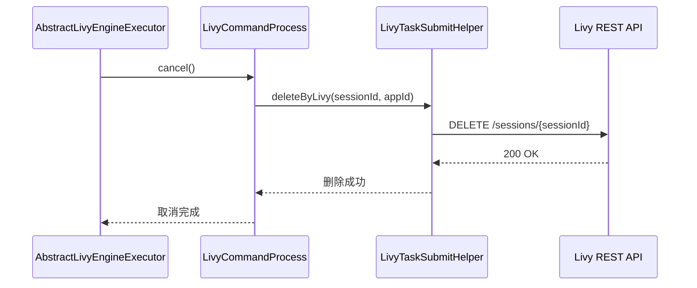
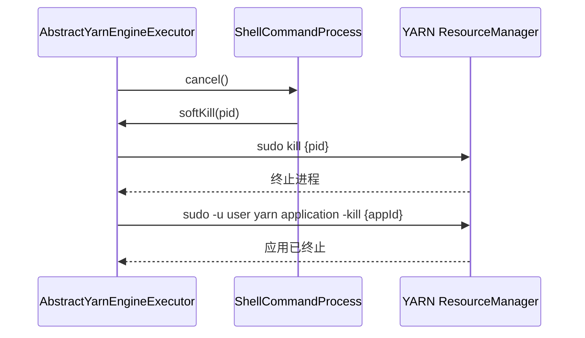
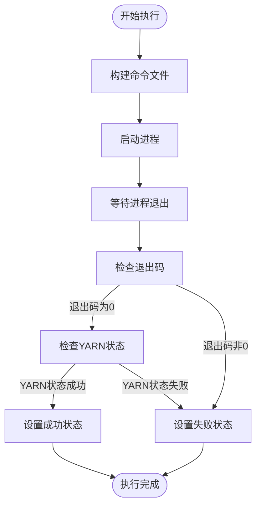

# 执行器实现

<cite>
**本文档中引用的文件**  
- [AbstractEngineExecutor.java](file://datavines-engine\datavines-engine-executor\src\main\java\io\datavines\engine\executor\core\base\AbstractEngineExecutor.java)
- [AbstractLivyEngineExecutor.java](file://datavines-engine\datavines-engine-executor\src\main\java\io\datavines\engine\executor\core\base\AbstractLivyEngineExecutor.java)
- [AbstractYarnEngineExecutor.java](file://datavines-engine\datavines-engine-executor\src\main\java\io\datavines\engine\executor\core\base\AbstractYarnEngineExecutor.java)
- [BaseCommandProcess.java](file://datavines-engine\datavines-engine-executor\src\main\java\io\datavines\engine\executor\core\executor\BaseCommandProcess.java)
- [LivyCommandProcess.java](file://datavines-engine\datavines-engine-executor\src\main\java\io\datavines\engine\executor\core\executor\LivyCommandProcess.java)
- [ShellCommandProcess.java](file://datavines-engine\datavines-engine-executor\src\main\java\io\datavines\engine\executor\core\executor\ShellCommandProcess.java)
- [LivyTaskSubmitHelper.java](file://datavines-engine\datavines-engine-executor\src\main\java\io\datavines\engine\executor\core\helper\LivyTaskSubmitHelper.java)
- [EngineExecutor.java](file://datavines-engine\datavines-engine-api\src\main\java\io\datavines\engine\api\engine\EngineExecutor.java)
- [JobExecutionRequest.java](file://datavines-common\src\main\java\io\datavines\common\entity\JobExecutionRequest.java)
- [ProcessResult.java](file://datavines-common\src\main\java\io\datavines\common\entity\ProcessResult.java)
- [ExecutionStatus.java](file://datavines-common\src\main\java\io\datavines\common\enums\ExecutionStatus.java)
- [LivyStates.java](file://datavines-engine\datavines-engine-executor\src\main\java\io\datavines\engine\executor\core\enums\LivyStates.java)
- [ResourceSchedulePlatformType.java](file://datavines-engine\datavines-engine-executor\src\main\java\io\datavines\engine\executor\core\enums\ResourceSchedulePlatformType.java)
</cite>

## 目录
1. [引言](#引言)
2. [核心执行器基类分析](#核心执行器基类分析)
3. [资源调度机制对比](#资源调度机制对比)
4. [命令执行封装机制](#命令执行封装机制)
5. [执行器与服务器通信协议](#执行器与服务器通信协议)
6. [性能优化策略](#性能优化策略)
7. [结论](#结论)

## 引言
本文档深入分析DataVines大数据平台中执行器模块的实现机制。重点阐述以`AbstractEngineExecutor`为核心的执行器体系结构，详细解析任务调度、资源管理、状态监控等核心功能的实现原理。对比分析基于Livy和Yarn两种不同资源调度平台的执行器实现差异，揭示其在资源管理策略上的不同设计思路。同时，文档将详细说明`BaseCommandProcess`如何封装底层命令执行逻辑，以及执行器与服务器模块之间的通信协议和性能优化策略，为系统维护和二次开发提供全面的技术参考。

## 核心执行器基类分析

`AbstractEngineExecutor`作为所有执行器的抽象基类，定义了执行器的核心行为和状态管理机制。该类实现了`EngineExecutor`接口，为所有具体执行器提供了统一的框架和基础功能。

基类中定义了关键的成员变量，包括`jobExecutionRequest`（作业执行请求）、`logger`（日志记录器）、`cancel`（取消标志）和`processResult`（进程结果）。其中，`cancel`标志采用`volatile`关键字修饰，确保在多线程环境下对取消状态的修改具有可见性，这是实现任务取消功能的基础。

基类提供了一个`logHandle`方法，用于统一处理日志输出。该方法将日志列表通过换行符连接后输出，便于日志系统的解析和处理。同时，`isCancel`方法提供了对取消状态的查询功能，允许执行器在运行过程中检查是否已被请求取消。

最核心的`buildCommand`方法被声明为抽象方法，强制要求所有子类必须实现具体的命令构建逻辑。这种设计模式体现了模板方法模式的思想，基类定义了算法的骨架（执行流程），而将具体实现延迟到子类中完成，保证了代码的灵活性和可扩展性。

**Section sources**
- [AbstractEngineExecutor.java](file://datavines-engine\datavines-engine-executor\src\main\java\io\datavines\engine\executor\core\base\AbstractEngineExecutor.java#L27-L56)
- [EngineExecutor.java](file://datavines-engine\datavines-engine-api\src\main\java\io\datavines\engine\api\engine\EngineExecutor.java#L27-L42)
- [JobExecutionRequest.java](file://datavines-common\src\main\java\io\datavines\common\entity\JobExecutionRequest.java#L26-L85)

## 资源调度机制对比

### AbstractLivyEngineExecutor 实现分析
`AbstractLivyEngineExecutor`是基于Livy服务的执行器基类，它继承自`AbstractEngineExecutor`。该类通过`LivyCommandProcess`与Livy REST API进行交互，实现对Spark作业的远程提交和管理。

其核心特点是将作业的生命周期管理委托给Livy服务。在`cancel`方法中，执行器首先调用`livyCommandProcess.cancel()`，该方法最终会通过`LivyTaskSubmitHelper`向Livy服务器发送DELETE请求，优雅地终止指定的会话。这种方式避免了直接操作底层YARN应用的复杂性，提供了更高层次的抽象。

**Diagram sources**
- [AbstractLivyEngineExecutor.java](file://datavines-engine\datavines-engine-executor\src\main\java\io\datavines\engine\executor\core\base\AbstractLivyEngineExecutor.java#L23-L36)
- [LivyCommandProcess.java](file://datavines-engine\datavines-engine-executor\src\main\java\io\datavines\engine\executor\core\executor\LivyCommandProcess.java#L38-L142)
- [LivyTaskSubmitHelper.java](file://datavines-engine\datavines-engine-executor\src\main\java\io\datavines\engine\executor\core\helper\LivyTaskSubmitHelper.java#L39-L257)

### AbstractYarnEngineExecutor 实现分析
`AbstractYarnEngineExecutor`是基于YARN资源管理器的执行器基类。与Livy方式不同，它通过`ShellCommandProcess`直接在本地执行shell命令来提交和管理YARN应用。

其`cancel`方法的实现更为直接和底层。在设置取消标志后，它首先调用`shellCommandProcess.cancel()`来终止本地进程，然后通过`killYarnApplication`方法构建并执行`yarn application -kill`命令，直接向YARN ResourceManager发送请求以终止指定的应用程序。这种方法绕过了Livy层，对YARN有更直接的控制权。

**Diagram sources**
- [AbstractYarnEngineExecutor.java](file://datavines-engine\datavines-engine-executor\src\main\java\io\datavines\engine\executor\core\base\AbstractYarnEngineExecutor.java#L25-L59)
- [ShellCommandProcess.java](file://datavines-engine\datavines-engine-executor\src\main\java\io\datavines\engine\executor\core\executor\ShellCommandProcess.java#L32-L79)

### 调度平台类型枚举
`ResourceSchedulePlatformType`枚举类定义了系统支持的三种资源调度平台：`LOCAL`、`YARN`和`K8S`。该枚举为执行器的选择和配置提供了类型安全的定义，确保了系统在不同环境下的可移植性和配置一致性。

**Section sources**
- [AbstractLivyEngineExecutor.java](file://datavines-engine\datavines-engine-executor\src\main\java\io\datavines\engine\executor\core\base\AbstractLivyEngineExecutor.java#L23-L36)
- [AbstractYarnEngineExecutor.java](file://datavines-engine\datavines-engine-executor\src\main\java\io\datavines\engine\executor\core\base\AbstractYarnEngineExecutor.java#L25-L59)
- [ResourceSchedulePlatformType.java](file://datavines-engine\datavines-engine-executor\src\main\java\io\datavines\engine\executor\core\enums\ResourceSchedulePlatformType.java#L19-L60)

## 命令执行封装机制

`BaseCommandProcess`是所有命令执行进程的抽象基类，它封装了底层命令执行的通用逻辑，包括进程创建、输出解析、日志处理和进程终止等。

### 核心执行流程
`run`方法是命令执行的核心入口。它首先检查执行命令的有效性，然后通过`buildCommandFilePath`和`createCommandFileIfNotExists`构建并写入命令脚本文件。接着，使用`ProcessBuilder`配置并启动进程，其中巧妙地使用`sudo -u`命令以指定租户用户身份执行，实现了多租户环境下的安全隔离。

### 进程输出与日志处理
`parseProcessOutput`方法启动一个守护线程，持续读取进程的标准输出流，并将日志行缓存到`logBuffer`中。`flush`方法根据配置的行数阈值（`LOG_CACHE_ROW_NUM`）或时间间隔（`LOG_FLUSH_INTERVAL`）将日志批量刷新到日志处理器，实现了高效的日志流处理，避免了频繁的I/O操作。

### 进程终止机制
`cancel`方法提供了优雅的进程终止机制。它首先尝试`softKill`（发送SIGTERM信号），如果进程仍在运行，则进行`hardKill`（发送SIGKILL信号）。这种分层的终止策略既保证了进程能够有机会清理资源，又确保了在必要时能够强制终止。

**Diagram sources**
- [BaseCommandProcess.java](file://datavines-engine\datavines-engine-executor\src\main\java\io\datavines\engine\executor\core\executor\BaseCommandProcess.java#L41-L364)
- [ShellCommandProcess.java](file://datavines-engine\datavines-engine-executor\src\main\java\io\datavines\engine\executor\core\executor\ShellCommandProcess.java#L32-L79)
- [LivyCommandProcess.java](file://datavines-engine\datavines-engine-executor\src\main\java\io\datavines\engine\executor\core\executor\LivyCommandProcess.java#L38-L142)

**Section sources**
- [BaseCommandProcess.java](file://datavines-engine\datavines-engine-executor\src\main\java\io\datavines\engine\executor\core\executor\BaseCommandProcess.java#L41-L364)
- [ShellCommandProcess.java](file://datavines-engine\datavines-engine-executor\src\main\java\io\datavines\engine\executor\core\executor\ShellCommandProcess.java#L32-L79)

## 执行器与服务器通信协议

执行器与服务器之间的通信主要通过`LivyTaskSubmitHelper`类实现，该类封装了与Livy REST API交互的所有细节。

### HTTP通信机制
`LivyTaskSubmitHelper`使用`RestTemplate`和`KerberosRestTemplate`作为HTTP客户端。它根据配置决定是否启用Kerberos认证。当`livy.need.kerberos`配置为`true`时，使用`KerberosRestTemplate`进行安全通信；否则，使用普通的`RestTemplate`。

### 状态监控与重试机制
`processResultOfLivyState`方法实现了对Livy会话状态的轮询监控。它在一个循环中持续调用`getResultByLivyId`获取会话状态，直到作业成功、失败或被取消。`retryLivyGetAppId`方法在初次提交后，如果返回结果中没有立即包含`appId`，会进行指定次数的重试，以应对Livy服务的延迟响应。

### 状态映射
`LivyStates`枚举类定义了Livy服务的所有可能状态，并提供了`toLivyState`静态方法将JSON响应中的状态字符串转换为对应的枚举值。`isActive`和`isHealthy`方法提供了对状态的高级判断，用于指导执行器的后续行为。

**Section sources**
- [LivyTaskSubmitHelper.java](file://datavines-engine\datavines-engine-executor\src\main\java\io\datavines\engine\executor\core\helper\LivyTaskSubmitHelper.java#L39-L257)
- [LivyCommandProcess.java](file://datavines-engine\datavines-engine-executor\src\main\java\io\datavines\engine\executor\core\executor\LivyCommandProcess.java#L38-L142)
- [LivyStates.java](file://datavines-engine\datavines-engine-executor\src\main\java\io\datavines\engine\executor\core\enums\LivyStates.java#L24-L82)

## 性能优化策略

### 日志缓冲与批量刷新
`BaseCommandProcess`通过`logBuffer`和`flush`机制实现了日志的批量处理。这避免了为每一行日志都进行一次I/O操作，显著降低了系统调用的开销。配置项`LOG_CACHE_ROW_NUM`和`LOG_FLUSH_INTERVAL`允许根据实际负载调整缓冲策略，在内存使用和日志实时性之间取得平衡。

### 守护线程与资源清理
`parseProcessOutput`方法使用`ThreadUtils.newDaemonSingleThreadExecutor`创建守护线程来处理输出流。守护线程不会阻止JVM退出，确保了在主进程结束时相关资源能够被正确回收。`clear`和`close`方法确保了在异常情况下也能及时清理缓冲区和关闭流。

### 进程ID反射获取
`getProcessId`方法通过反射访问`Process`对象的私有`pid`字段来获取进程ID。这是一种绕过Java标准API限制的技巧，为执行器提供了对底层进程的直接控制能力，是实现`softKill`和`hardKill`功能的基础。

### 配置驱动的灵活性
整个执行器框架高度依赖`Configurations`对象进行配置管理。从日志缓冲大小到Livy重试次数，几乎所有行为都可以通过配置文件进行调整，无需修改代码，极大地提高了系统的灵活性和可维护性。

**Section sources**
- [BaseCommandProcess.java](file://datavines-engine\datavines-engine-executor\src\main\java\io\datavines\engine\executor\core\executor\BaseCommandProcess.java#L41-L364)
- [LivyTaskSubmitHelper.java](file://datavines-engine\datavines-engine-executor\src\main\java\io\datavines\engine\executor\core\helper\LivyTaskSubmitHelper.java#L39-L257)
- [CoreConfig.java](file://datavines-common\src\main\java\io\datavines\common\config\CoreConfig.java)

## 结论
DataVines的执行器实现展现了一个设计精良、层次分明的分布式任务执行框架。通过`AbstractEngineExecutor`基类定义了统一的执行契约，而`AbstractLivyEngineExecutor`和`AbstractYarnEngineExecutor`则分别针对不同的资源调度平台提供了具体的实现。`BaseCommandProcess`对底层命令执行进行了优雅的封装，处理了进程管理、日志流和资源清理等复杂细节。`LivyTaskSubmitHelper`则实现了与外部服务的可靠通信。整个系统通过配置驱动和合理的性能优化策略，确保了在大规模数据处理场景下的稳定性和高效性。该设计为系统的扩展和维护提供了坚实的基础。