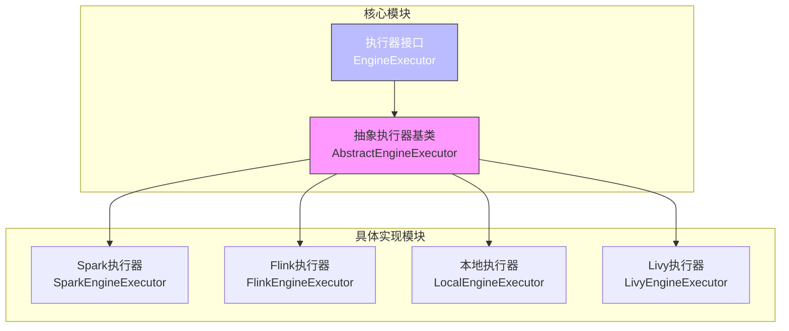
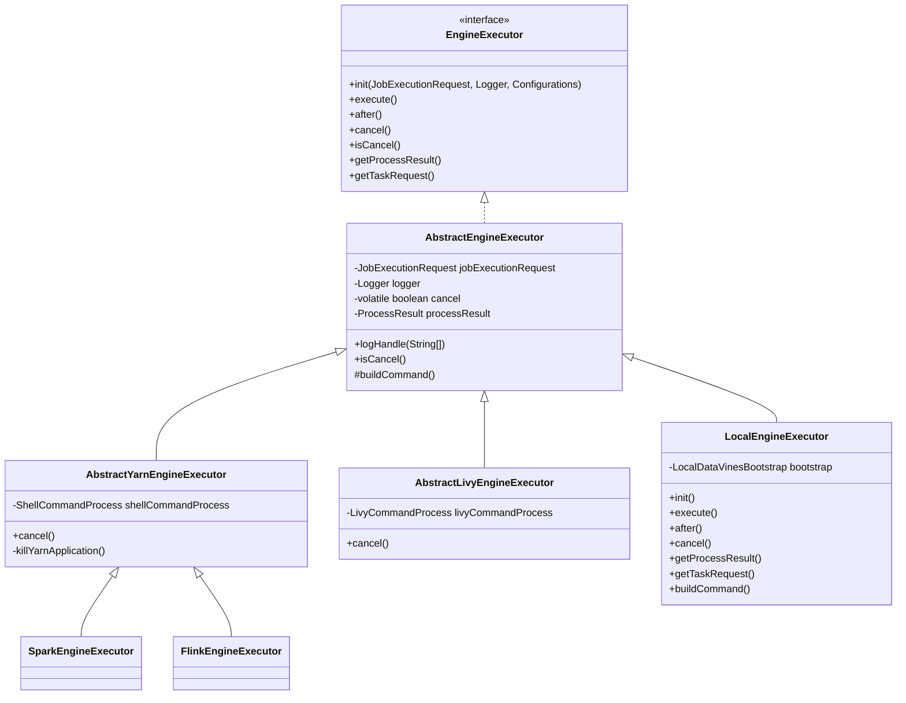
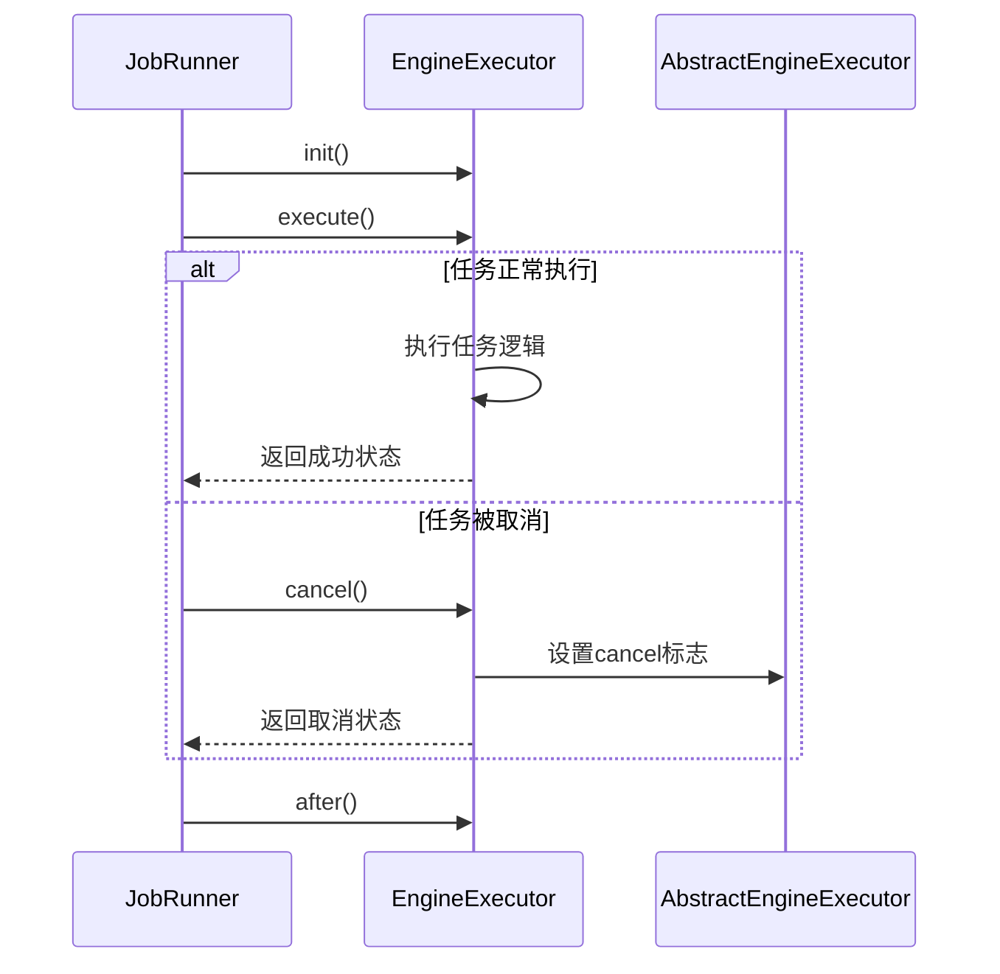
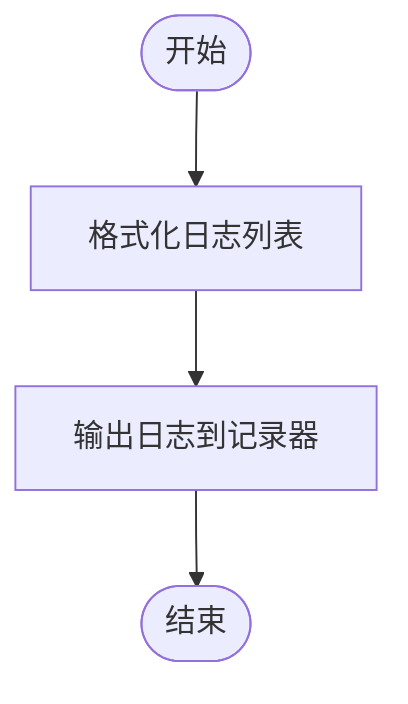
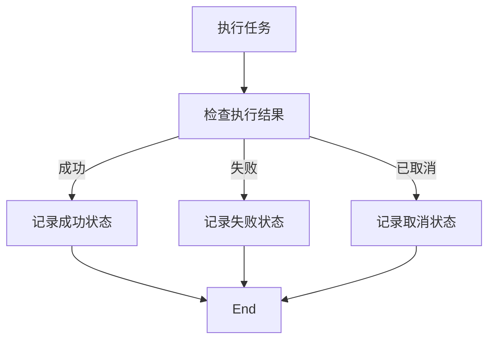
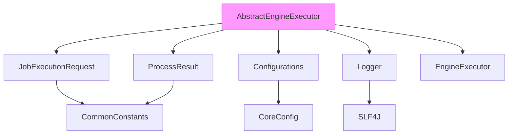

# 抽象执行器基类

<cite>
**本文档引用的文件**
- [AbstractEngineExecutor.java](file://datavines-engine/datavines-engine-executor/src/main/java/io/datavines/engine/executor/core/base/AbstractEngineExecutor.java)
- [EngineExecutor.java](file://datavines-engine/datavines-engine-api/src/main/java/io/datavines/engine/api/engine/EngineExecutor.java)
- [AbstractYarnEngineExecutor.java](file://datavines-engine/datavines-engine-executor/src/main/java/io/datavines/engine/executor/core/base/AbstractYarnEngineExecutor.java)
- [AbstractLivyEngineExecutor.java](file://datavines-engine/datavines-engine-executor/src/main/java/io/datavines/engine/executor/core/base/AbstractLivyEngineExecutor.java)
- [LocalEngineExecutor.java](file://datavines-engine/datavines-engine-plugins/datavines-engine-local/datavines-engine-local-executor/src/main/java/io/datavines/engine/local/executor/LocalEngineExecutor.java)
- [JobRunner.java](file://datavines-runner/src/main/java/io/datavines/runner/JobRunner.java)
- [ExecutionStatus.java](file://datavines-common/src/main/java/io/datavines/common/enums/ExecutionStatus.java)
</cite>

## 目录
1. [简介](#简介)
2. [项目结构](#项目结构)
3. [核心组件](#核心组件)
4. [架构概述](#架构概述)
5. [详细组件分析](#详细组件分析)
6. [依赖分析](#依赖分析)
7. [性能考虑](#性能考虑)
8. [故障排除指南](#故障排除指南)
9. [结论](#结论)

## 简介
`AbstractEngineExecutor` 是 DataVines 框架中所有执行器的抽象基类，定义了执行器的核心行为和生命周期管理机制。该基类通过实现 `EngineExecutor` 接口，为各种执行引擎（如 Spark、Flink、Livy 等）提供了统一的接口规范。其主要职责包括任务调度、资源管理、状态监控、日志处理和错误处理。通过继承此基类，开发者可以快速实现自定义执行器，同时确保与上层引擎和底层执行环境的兼容性。

## 项目结构
DataVines 的执行器模块采用插件化架构设计，核心执行器基类位于 `datavines-engine-executor` 模块中，具体实现类分布在各个引擎插件模块中。这种设计实现了核心逻辑与具体实现的分离，提高了代码的可维护性和扩展性。

**图示来源**
- [AbstractEngineExecutor.java](file://datavines-engine/datavines-engine-executor/src/main/java/io/datavines/engine/executor/core/base/AbstractEngineExecutor.java)
- [EngineExecutor.java](file://datavines-engine/datavines-engine-api/src/main/java/io/datavines/engine/api/engine/EngineExecutor.java)

**本节来源**
- [AbstractEngineExecutor.java](file://datavines-engine/datavines-engine-executor/src/main/java/io/datavines/engine/executor/core/base/AbstractEngineExecutor.java)
- [EngineExecutor.java](file://datavines-engine/datavines-engine-api/src/main/java/io/datavines/engine/api/engine/EngineExecutor.java)

## 核心组件
`AbstractEngineExecutor` 作为所有执行器的基类，封装了执行器的通用功能和生命周期管理方法。其核心组件包括任务请求、日志记录器、取消标志和处理结果等字段，以及初始化、执行、后处理、取消和状态检查等方法。该类通过抽象方法 `buildCommand` 强制子类实现具体的命令构建逻辑，确保了执行器的灵活性和可扩展性。

**本节来源**
- [AbstractEngineExecutor.java](file://datavines-engine/datavines-engine-executor/src/main/java/io/datavines/engine/executor/core/base/AbstractEngineExecutor.java)

## 架构概述
`AbstractEngineExecutor` 的架构设计遵循了面向对象的继承和多态原则，通过抽象基类定义通用行为，具体实现类负责特定引擎的细节处理。该架构支持多种执行模式，包括本地执行、YARN 集群执行和 Livy 会话执行，通过继承不同的抽象子类（如 `AbstractYarnEngineExecutor` 和 `AbstractLivyEngineExecutor`）来实现。

**图示来源**
- [AbstractEngineExecutor.java](file://datavines-engine/datavines-engine-executor/src/main/java/io/datavines/engine/executor/core/base/AbstractEngineExecutor.java)
- [AbstractYarnEngineExecutor.java](file://datavines-engine/datavines-engine-executor/src/main/java/io/datavines/engine/executor/core/base/AbstractYarnEngineExecutor.java)
- [AbstractLivyEngineExecutor.java](file://datavines-engine/datavines-engine-executor/src/main/java/io/datavines/engine/executor/core/base/AbstractLivyEngineExecutor.java)

## 详细组件分析

### 生命周期管理方法分析
`AbstractEngineExecutor` 定义了一套完整的生命周期管理方法，确保执行器能够正确地初始化、执行任务、处理后续操作和响应取消请求。

#### 初始化方法 (init)
`init` 方法负责初始化执行器所需的资源，包括设置任务请求、日志记录器和配置信息。该方法在执行器创建后立即调用，为后续的执行操作做好准备。

#### 执行方法 (execute)
`execute` 方法是执行器的核心，负责执行具体的任务逻辑。子类需要根据具体的执行环境和需求实现该方法。

#### 后处理方法 (after)
`after` 方法在任务执行完成后调用，用于清理资源和执行收尾工作。

#### 取消方法 (cancel)
`cancel` 方法用于取消正在执行的任务。不同的执行器实现可能会有不同的取消策略，例如通过终止进程或发送取消信号。

#### 状态检查方法 (isCancel)
`isCancel` 方法用于检查任务是否已被取消，返回一个布尔值表示当前的取消状态。

**图示来源**
- [AbstractEngineExecutor.java](file://datavines-engine/datavines-engine-executor/src/main/java/io/datavines/engine/executor/core/base/AbstractEngineExecutor.java)
- [JobRunner.java](file://datavines-runner/src/main/java/io/datavines/runner/JobRunner.java)

**本节来源**
- [AbstractEngineExecutor.java](file://datavines-engine/datavines-engine-executor/src/main/java/io/datavines/engine/executor/core/base/AbstractEngineExecutor.java)
- [JobRunner.java](file://datavines-runner/src/main/java/io/datavines/runner/JobRunner.java)

### 配置参数处理
执行器通过 `JobExecutionRequest` 对象接收配置参数，该对象包含了任务执行所需的所有信息，如应用参数、租户代码、任务唯一标识等。执行器在初始化阶段解析这些参数，并根据需要进行相应的配置。

### 日志管理
`AbstractEngineExecutor` 提供了 `logHandle` 方法用于统一处理日志输出。该方法将日志列表格式化后输出到日志记录器，便于日志的解析和监控。

**图示来源**
- [AbstractEngineExecutor.java](file://datavines-engine/datavines-engine-executor/src/main/java/io/datavines/engine/executor/core/base/AbstractEngineExecutor.java)

**本节来源**
- [AbstractEngineExecutor.java](file://datavines-engine/datavines-engine-executor/src/main/java/io/datavines/engine/executor/core/base/AbstractEngineExecutor.java)

### 错误处理策略
执行器通过 `ProcessResult` 对象返回执行结果，包括退出状态码、进程ID和应用ID等信息。上层调用者可以根据这些信息判断任务的执行状态，并采取相应的错误处理措施。

**图示来源**
- [AbstractEngineExecutor.java](file://datavines-engine/datavines-engine-executor/src/main/java/io/datavines/engine/executor/core/base/AbstractEngineExecutor.java)
- [ExecutionStatus.java](file://datavines-common/src/main/java/io/datavines/common/enums/ExecutionStatus.java)

**本节来源**
- [AbstractEngineExecutor.java](file://datavines-engine/datavines-engine-executor/src/main/java/io/datavines/engine/executor/core/base/AbstractEngineExecutor.java)
- [ExecutionStatus.java](file://datavines-common/src/main/java/io/datavines/common/enums/ExecutionStatus.java)

## 依赖分析
`AbstractEngineExecutor` 依赖于多个核心模块，包括 `datavines-common` 中的实体类和配置类，`datavines-engine-api` 中的接口定义，以及具体的执行器实现类。这些依赖关系确保了执行器能够与框架的其他部分无缝集成。

**图示来源**
- [AbstractEngineExecutor.java](file://datavines-engine/datavines-engine-executor/src/main/java/io/datavines/engine/executor/core/base/AbstractEngineExecutor.java)
- [JobExecutionRequest.java](file://datavines-common/src/main/java/io/datavines/common/entity/JobExecutionRequest.java)
- [ProcessResult.java](file://datavines-common/src/main/java/io/datavines/common/entity/ProcessResult.java)
- [Configurations.java](file://datavines-common/src/main/java/io/datavines/common/config/Configurations.java)

**本节来源**
- [AbstractEngineExecutor.java](file://datavines-engine/datavines-engine-executor/src/main/java/io/datavines/engine/executor/core/base/AbstractEngineExecutor.java)

## 性能考虑
在设计和实现执行器时，需要考虑以下几个性能方面：
- **资源管理**：合理分配和释放执行过程中使用的资源，避免内存泄漏和资源浪费。
- **并发处理**：支持多任务并发执行，提高系统的吞吐量。
- **日志输出**：优化日志输出频率和格式，减少I/O开销。
- **错误恢复**：实现健壮的错误处理机制，确保系统在异常情况下能够快速恢复。

## 故障排除指南
在使用 `AbstractEngineExecutor` 时，可能会遇到以下常见问题：
- **任务无法启动**：检查 `JobExecutionRequest` 中的参数是否正确，确保所有必需的配置都已提供。
- **任务执行超时**：调整任务的超时设置，或优化任务逻辑以减少执行时间。
- **资源不足**：检查集群资源使用情况，必要时增加资源配额。
- **日志无法输出**：确认日志配置是否正确，检查日志文件路径和权限。

**本节来源**
- [AbstractEngineExecutor.java](file://datavines-engine/datavines-engine-executor/src/main/java/io/datavines/engine/executor/core/base/AbstractEngineExecutor.java)
- [JobRunner.java](file://datavines-runner/src/main/java/io/datavines/runner/JobRunner.java)

## 结论
`AbstractEngineExecutor` 作为 DataVines 框架中所有执行器的基类，提供了统一的接口和通用的功能实现，极大地简化了新执行器的开发工作。通过继承该基类，开发者可以专注于具体执行逻辑的实现，而不必关心底层的资源管理和生命周期控制。这种设计不仅提高了代码的复用性和可维护性，还确保了不同执行器之间的一致性和兼容性。