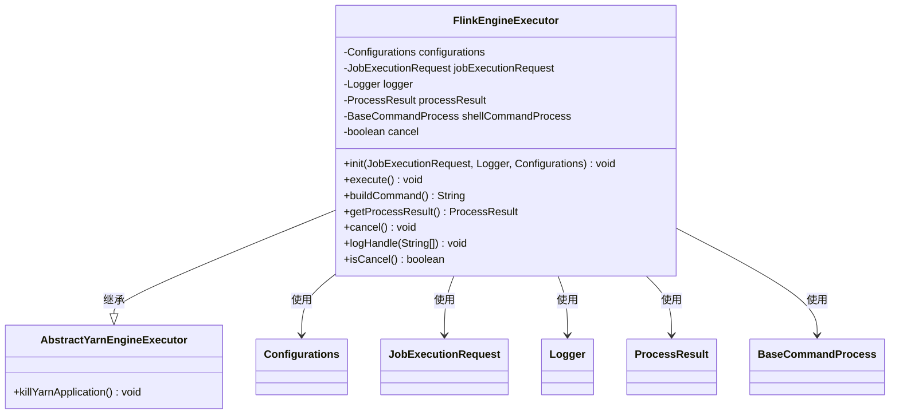
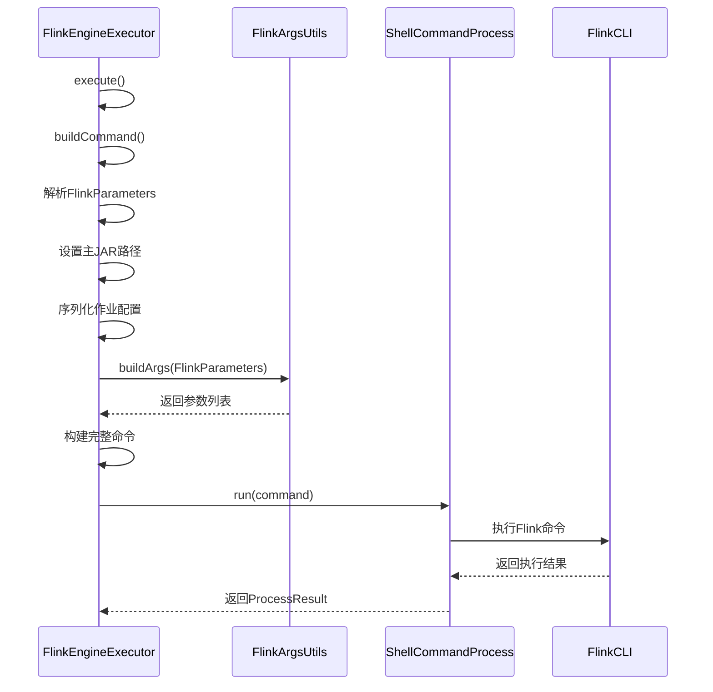
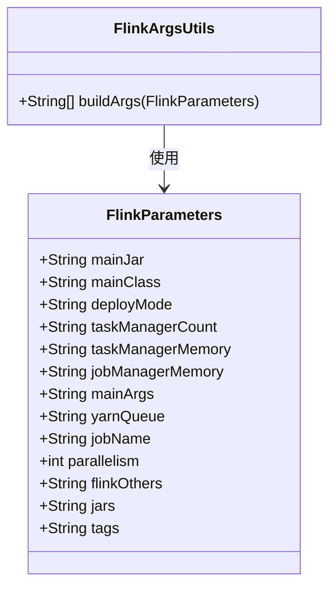
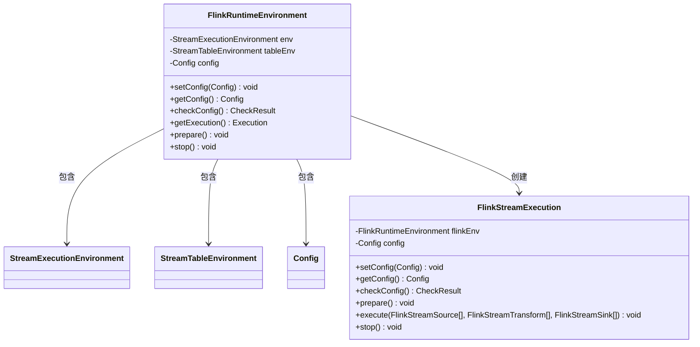
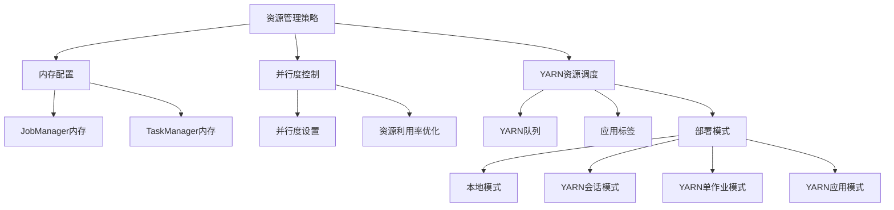
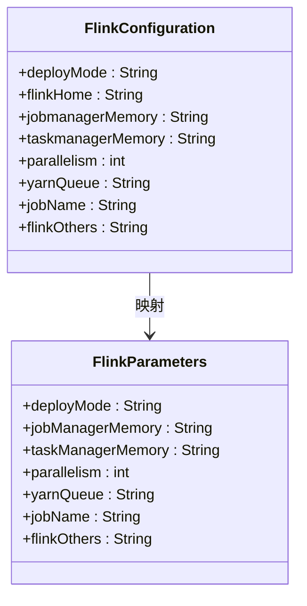
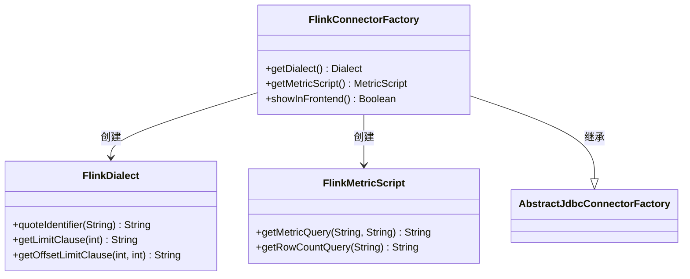

# Flink执行引擎

<cite>
**本文档引用的文件**  
- [FlinkEngineExecutor.java](file://datavines-engine/datavines-engine-plugins/datavines-engine-flink/datavines-engine-flink-executor/src/main/java/io/datavines/engine/flink/executor/FlinkEngineExecutor.java)
- [FlinkRuntimeEnvironment.java](file://datavines-engine/datavines-engine-plugins/datavines-engine-flink/datavines-engine-flink-api/src/main/java/io/datavines/engine/flink/api/FlinkRuntimeEnvironment.java)
- [FlinkParameters.java](file://datavines-engine/datavines-engine-plugins/datavines-engine-flink/datavines-engine-flink-executor/src/main/java/io/datavines/engine/flink/executor/parameter/FlinkParameters.java)
- [FlinkArgsUtils.java](file://datavines-engine/datavines-engine-plugins/datavines-engine-flink/datavines-engine-flink-executor/src/main/java/io/datavines/engine/flink/executor/parameter/FlinkArgsUtils.java)
- [FlinkDataVinesBootstrap.java](file://datavines-engine/datavines-engine-plugins/datavines-engine-flink/datavines-engine-flink-core/src/main/java/io/datavines/engine/flink/core/FlinkDataVinesBootstrap.java)
- [FlinkStreamExecution.java](file://datavines-engine/datavines-engine-plugins/datavines-engine-flink/datavines-engine-flink-api/src/main/java/io/datavines/engine/flink/api/stream/FlinkStreamExecution.java)
- [FlinkConfiguration.tsx](file://datavines-ui/src/view/Main/Config/FlinkConfiguration.tsx)
- [FlinkConnectorFactory.java](file://datavines-connector/datavines-connector-plugins/datavines-connector-flink/src/main/java/io/datavines/connector/plugin/FlinkConnectorFactory.java)
</cite>

## 目录
1. [Flink执行引擎概述](#flink执行引擎概述)
2. [FlinkEngineExecutor实现原理](#flinkengineexecutor实现原理)
3. [任务提交流程分析](#任务提交流程分析)
4. [Flink配置构建器](#flink配置构建器)
5. [Flink运行时环境初始化](#flink运行时环境初始化)
6. [资源管理策略](#资源管理策略)
7. [性能调优参数与最佳实践](#性能调优参数与最佳实践)
8. [Flink Connector与DataVines集成](#flink-connector与datavines集成)

## Flink执行引擎概述

Flink执行引擎是DataVines数据质量平台的核心组件之一，负责执行基于Apache Flink的流式和批处理作业。该引擎通过抽象化的执行器接口，实现了对Flink作业的统一管理和调度。Flink执行引擎支持多种部署模式，包括本地模式、YARN会话模式、YARN单作业模式和YARN应用模式，能够灵活适应不同的生产环境需求。

Flink执行引擎的设计遵循了模块化和可扩展的原则，通过SPI（Service Provider Interface）机制实现了组件的动态加载。这种设计使得引擎能够轻松集成新的数据源、转换器和接收器，为数据质量检查提供了强大的扩展能力。引擎的核心功能包括作业配置构建、运行时环境初始化、任务提交与监控、资源管理以及结果收集等。

**Section sources**
- [FlinkEngineExecutor.java](file://datavines-engine/datavines-engine-plugins/datavines-engine-flink/datavines-engine-flink-executor/src/main/java/io/datavines/engine/flink/executor/FlinkEngineExecutor.java#L1-L183)
- [FlinkRuntimeEnvironment.java](file://datavines-engine/datavines-engine-plugins/datavines-engine-flink/datavines-engine-flink-api/src/main/java/io/datavines/engine/flink/api/FlinkRuntimeEnvironment.java#L1-L94)

## FlinkEngineExecutor实现原理

FlinkEngineExecutor是Flink执行引擎的核心实现类，继承自AbstractYarnEngineExecutor，负责Flink作业的执行和管理。该类实现了EngineExecutor接口，提供了初始化、执行、取消和结果获取等关键方法。

FlinkEngineExecutor的主要职责包括：
1. 初始化执行环境，设置线程名称和日志记录器
2. 构建Flink命令行参数
3. 执行Flink作业并监控执行过程
4. 处理日志输出和执行结果
5. 支持作业取消和YARN应用终止

在初始化过程中，FlinkEngineExecutor会根据作业执行请求设置线程名称，便于日志追踪和监控。执行过程中，通过ShellCommandProcess执行构建的Flink命令，并实时处理输出日志。当需要取消作业时，除了调用ShellCommandProcess的取消方法外，还会通过YarnUtils获取YARN应用ID并执行kill命令，确保作业被彻底终止。

**Diagram sources**
- [FlinkEngineExecutor.java](file://datavines-engine/datavines-engine-plugins/datavines-engine-flink/datavines-engine-flink-executor/src/main/java/io/datavines/engine/flink/executor/FlinkEngineExecutor.java#L38-L182)

**Section sources**
- [FlinkEngineExecutor.java](file://datavines-engine/datavines-engine-plugins/datavines-engine-flink/datavines-engine-flink-executor/src/main/java/io/datavines/engine/flink/executor/FlinkEngineExecutor.java#L38-L182)

## 任务提交流程分析

Flink任务提交流程是Flink执行引擎的核心工作流程，从作业配置到最终执行的完整过程。该流程始于FlinkEngineExecutor的execute方法，通过构建Flink命令行并执行来启动作业。

任务提交的主要步骤包括：
1. 解析作业执行请求中的引擎参数，转换为FlinkParameters对象
2. 设置主JAR文件路径，从配置中获取Flink作业JAR名称
3. 将作业配置序列化为JSON字符串，并进行Base64编码作为主参数
4. 设置主类为FlinkDataVinesBootstrap
5. 构建完整的Flink命令行参数
6. 执行命令并监控执行过程

在构建命令行参数时，FlinkArgsUtils工具类发挥了关键作用。该工具类根据FlinkParameters中的配置，生成符合Flink CLI规范的参数列表。参数构建过程考虑了部署模式、并行度、内存配置、队列设置等多种因素，确保作业能够正确提交到目标环境。

**Diagram sources**
- [FlinkEngineExecutor.java](file://datavines-engine/datavines-engine-plugins/datavines-engine-flink/datavines-engine-flink-executor/src/main/java/io/datavines/engine/flink/executor/FlinkEngineExecutor.java#L72-L126)
- [FlinkArgsUtils.java](file://datavines-engine/datavines-engine-plugins/datavines-engine-flink/datavines-engine-flink-executor/src/main/java/io/datavines/engine/flink/executor/parameter/FlinkArgsUtils.java#L35-L124)

**Section sources**
- [FlinkEngineExecutor.java](file://datavines-engine/datavines-engine-plugins/datavines-engine-flink/datavines-engine-flink-executor/src/main/java/io/datavines/engine/flink/executor/FlinkEngineExecutor.java#L72-L126)
- [FlinkArgsUtils.java](file://datavines-engine/datavines-engine-plugins/datavines-engine-flink/datavines-engine-flink-executor/src/main/java/io/datavines/engine/flink/executor/parameter/FlinkArgsUtils.java#L35-L124)

## Flink配置构建器

Flink配置构建器负责生成Flink作业的配置参数，这些参数通过FlinkParameters类进行封装。配置构建器的主要功能是将用户界面或API提供的配置信息转换为Flink CLI可识别的参数格式。

FlinkParameters类包含以下关键配置项：
- **mainJar**: 主JAR文件路径
- **mainClass**: 主类名称
- **deployMode**: 部署模式（local, yarn-session, yarn-per-job, yarn-application）
- **taskManagerCount**: TaskManager数量
- **taskManagerMemory**: TaskManager内存大小
- **jobManagerMemory**: JobManager内存大小
- **mainArgs**: 主方法参数
- **yarnQueue**: YARN队列名称
- **jobName**: 作业名称
- **parallelism**: 并行度
- **flinkOthers**: 其他Flink参数
- **jars**: 附加JAR文件
- **tags**: 作业标签

这些配置项通过FlinkArgsUtils工具类转换为Flink命令行参数。例如，部署模式决定了使用"run"还是"run-application"命令，内存配置转换为-Djobmanager.memory.process.size和-Dtaskmanager.memory.process.size系统属性，YARN队列配置转换为-Dyarn.application.queue属性等。

**Diagram sources**
- [FlinkParameters.java](file://datavines-engine/datavines-engine-plugins/datavines-engine-flink/datavines-engine-flink-executor/src/main/java/io/datavines/engine/flink/executor/parameter/FlinkParameters.java#L22-L49)
- [FlinkArgsUtils.java](file://datavines-engine/datavines-engine-plugins/datavines-engine-flink/datavines-engine-flink-executor/src/main/java/io/datavines/engine/flink/executor/parameter/FlinkArgsUtils.java#L24-L124)

**Section sources**
- [FlinkParameters.java](file://datavines-engine/datavines-engine-plugins/datavines-engine-flink/datavines-engine-flink-executor/src/main/java/io/datavines/engine/flink/executor/parameter/FlinkParameters.java#L22-L49)
- [FlinkArgsUtils.java](file://datavines-engine/datavines-engine-plugins/datavines-engine-flink/datavines-engine-flink-executor/src/main/java/io/datavines/engine/flink/executor/parameter/FlinkArgsUtils.java#L24-L124)

## Flink运行时环境初始化

Flink运行时环境由FlinkRuntimeEnvironment类负责初始化和管理。该类实现了RuntimeEnvironment接口，为Flink作业提供了执行所需的环境配置。

运行时环境初始化的主要步骤包括：
1. 创建StreamExecutionEnvironment实例
2. 根据配置设置执行模式（流模式或批模式）
3. 创建StreamTableEnvironment实例
4. 准备执行环境

在prepare方法中，首先通过StreamExecutionEnvironment.getExecutionEnvironment()获取执行环境实例。然后根据配置中的TYPE参数判断是流模式还是批模式，如果是批模式则设置RuntimeExecutionMode.BATCH。最后创建StreamTableEnvironment实例，为后续的Table API和SQL操作提供支持。

FlinkRuntimeEnvironment还提供了配置检查、执行实例获取和环境停止等方法。其中getExecution方法返回FlinkStreamExecution实例，该实例负责具体的作业执行逻辑，包括数据源注册、转换处理和结果输出等。

**Diagram sources**
- [FlinkRuntimeEnvironment.java](file://datavines-engine/datavines-engine-plugins/datavines-engine-flink/datavines-engine-flink-api/src/main/java/io/datavines/engine/flink/api/FlinkRuntimeEnvironment.java#L33-L93)
- [FlinkStreamExecution.java](file://datavines-engine/datavines-engine-plugins/datavines-engine-flink/datavines-engine-flink-api/src/main/java/io/datavines/engine/flink/api/stream/FlinkStreamExecution.java#L38-L125)

**Section sources**
- [FlinkRuntimeEnvironment.java](file://datavines-engine/datavines-engine-plugins/datavines-engine-flink/datavines-engine-flink-api/src/main/java/io/datavines/engine/flink/api/FlinkRuntimeEnvironment.java#L33-L93)
- [FlinkStreamExecution.java](file://datavines-engine/datavines-engine-plugins/datavines-engine-flink/datavines-engine-flink-api/src/main/java/io/datavines/engine/flink/api/stream/FlinkStreamExecution.java#L38-L125)

## 资源管理策略

Flink执行引擎的资源管理策略主要体现在内存配置、并行度控制和YARN资源调度三个方面。这些策略通过FlinkParameters中的配置项实现，确保作业能够高效利用集群资源。

内存配置方面，引擎支持独立设置JobManager和TaskManager的内存大小。JobManager内存通过jobManagerMemory参数配置，对应Flink的jobmanager.memory.process.size属性；TaskManager内存通过taskManagerMemory参数配置，对应taskmanager.memory.process.size属性。这种细粒度的内存控制有助于优化作业性能，避免资源浪费。

并行度控制通过parallelism参数实现，允许用户根据数据量和处理需求设置合适的并行度。较高的并行度可以提高处理速度，但也会增加资源消耗；较低的并行度节省资源，但可能影响处理效率。最佳实践是根据集群资源和数据特征进行调优。

YARN资源调度方面，引擎支持指定YARN队列和应用标签。yarnQueue参数用于指定作业提交到的YARN队列，便于资源隔离和优先级管理；tags参数用于标记作业，便于监控和管理。此外，部署模式的选择也影响资源管理策略，YARN会话模式适合多作业共享资源，YARN单作业模式适合独占资源的长时间作业。

**Diagram sources**
- [FlinkParameters.java](file://datavines-engine/datavines-engine-plugins/datavines-engine-flink/datavines-engine-flink-executor/src/main/java/io/datavines/engine/flink/executor/parameter/FlinkParameters.java#L22-L49)
- [FlinkArgsUtils.java](file://datavines-engine/datavines-engine-plugins/datavines-engine-flink/datavines-engine-flink-executor/src/main/java/io/datavines/engine/flink/executor/parameter/FlinkArgsUtils.java#L73-L96)

**Section sources**
- [FlinkParameters.java](file://datavines-engine/datavines-engine-plugins/datavines-engine-flink/datavines-engine-flink-executor/src/main/java/io/datavines/engine/flink/executor/parameter/FlinkParameters.java#L22-L49)
- [FlinkArgsUtils.java](file://datavines-engine/datavines-engine-plugins/datavines-engine-flink/datavines-engine-flink-executor/src/main/java/io/datavines/engine/flink/executor/parameter/FlinkArgsUtils.java#L73-L96)

## 性能调优参数与最佳实践

Flink执行引擎提供了丰富的性能调优参数，帮助用户优化作业性能。这些参数主要通过FlinkParameters类配置，并在作业提交时转换为Flink CLI参数。

关键性能调优参数包括：
- **并行度(parallelism)**: 控制作业的并行处理能力，建议根据集群CPU核心数和数据量设置
- **内存配置**: 合理设置JobManager和TaskManager内存，避免OOM错误
- **部署模式**: 根据作业特征选择合适的部署模式
- **YARN队列**: 将作业提交到合适的YARN队列，确保资源可用性
- **其他Flink参数(flinkOthers)**: 支持传递任意Flink配置参数

最佳实践建议：
1. **内存调优**: 根据作业复杂度和数据量合理设置内存，建议初始设置为2-4GB，根据实际运行情况调整
2. **并行度设置**: 一般设置为集群CPU核心数的80%-90%，避免过度并行导致调度开销
3. **部署模式选择**: 短期作业使用YARN单作业模式，长期运行作业使用YARN会话模式
4. **资源隔离**: 使用YARN队列实现不同业务线的资源隔离
5. **监控与调优**: 定期监控作业性能指标，根据瓶颈进行针对性调优

前端界面通过FlinkConfiguration组件提供了这些参数的配置界面，用户可以直观地设置各种参数。配置信息通过API传递到后端，由FlinkEngineExecutor处理并提交作业。

**Diagram sources**
- [FlinkConfiguration.tsx](file://datavines-ui/src/view/Main/Config/FlinkConfiguration.tsx#L13-L84)
- [FlinkParameters.java](file://datavines-engine/datavines-engine-plugins/datavines-engine-flink/datavines-engine-flink-executor/src/main/java/io/datavines/engine/flink/executor/parameter/FlinkParameters.java#L22-L49)

**Section sources**
- [FlinkConfiguration.tsx](file://datavines-ui/src/view/Main/Config/FlinkConfiguration.tsx#L13-L84)
- [FlinkParameters.java](file://datavines-engine/datavines-engine-plugins/datavines-engine-flink/datavines-engine-flink-executor/src/main/java/io/datavines/engine/flink/executor/parameter/FlinkParameters.java#L22-L49)

## Flink Connector与DataVines集成

Flink Connector与DataVines的集成通过FlinkConnectorFactory类实现。该类继承自AbstractJdbcConnectorFactory，为Flink引擎提供了JDBC连接器的功能。

集成的主要组件包括：
- **FlinkDialect**: 实现Flink SQL方言，处理Flink特有的SQL语法和数据类型
- **FlinkMetricScript**: 生成Flink环境下的度量脚本，用于数据质量检查
- **FlinkConnectorFactory**: 连接器工厂，负责创建Flink相关的组件实例

FlinkConnectorFactory的showInFrontend方法返回false，表明该连接器不直接在前端界面显示，而是作为内部组件使用。这种设计使得Flink引擎能够无缝集成到DataVines平台中，而不需要用户直接配置Flink连接器。

数据传输机制基于Flink的DataStream API和Table API。数据源通过FlinkStreamSource接口实现，将外部数据源的数据转换为DataStream；转换逻辑通过FlinkStreamTransform接口实现，对数据流进行处理；结果输出通过FlinkStreamSink接口实现，将处理结果写入目标系统。这种基于流的处理模型确保了数据质量检查的实时性和高效性。

**Diagram sources**
- [FlinkConnectorFactory.java](file://datavines-connector/datavines-connector-plugins/datavines-connector-flink/src/main/java/io/datavines/connector/plugin/FlinkConnectorFactory.java#L21-L52)
- [FlinkDialect.java](file://datavines-connector/datavines-connector-plugins/datavines-connector-flink/src/main/java/io/datavines/connector/plugin/FlinkDialect.java)
- [FlinkMetricScript.java](file://datavines-connector/datavines-connector-plugins/datavines-connector-flink/src/main/java/io/datavines/connector/plugin/FlinkMetricScript.java)

**Section sources**
- [FlinkConnectorFactory.java](file://datavines-connector/datavines-connector-plugins/datavines-connector-flink/src/main/java/io/datavines/connector/plugin/FlinkConnectorFactory.java#L21-L52)