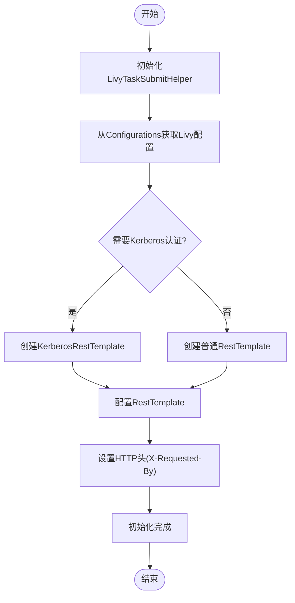
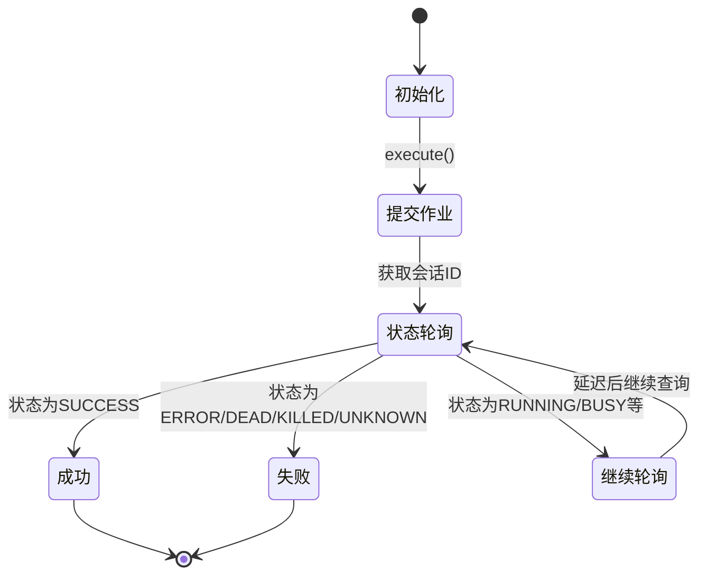
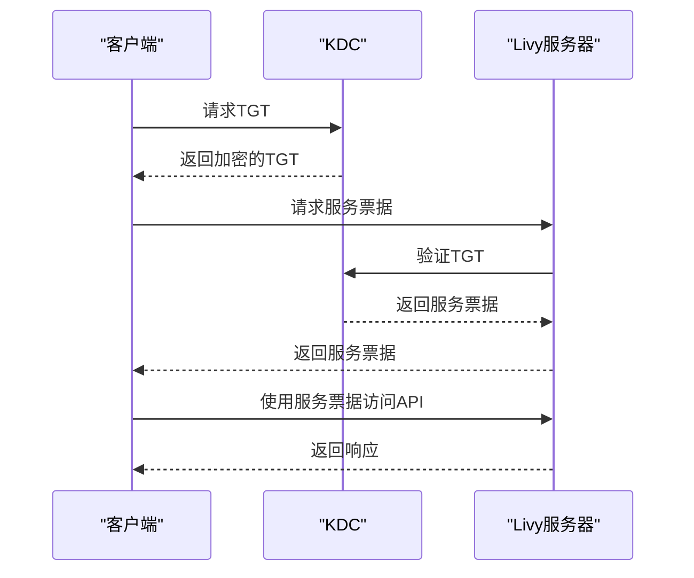

# Livy执行引擎

<cite>
**本文档引用的文件**   
- [LivyEngineExecutor.java](file://datavines-engine-plugins/datavines-engine-livy/datavines-engine-livy-executor/src/main/java/io/datavines/engine/livy/executor/LivyEngineExecutor.java)
- [LivyCommandProcess.java](file://datavines-engine-executor/src/main/java/io/datavines/engine/executor/core/executor/LivyCommandProcess.java)
- [LivyTaskSubmitHelper.java](file://datavines-engine-executor/src/main/java/io/datavines/engine/executor/core/helper/LivyTaskSubmitHelper.java)
- [LivyStates.java](file://datavines-engine-executor/src/main/java/io/datavines/engine/executor/core/enums/LivyStates.java)
- [LivySparkParameters.java](file://datavines-engine-plugins/datavines-engine-livy/datavines-engine-livy-executor/src/main/java/io/datavines/engine/livy/executor/parameter/LivySparkParameters.java)
- [SparkParameters.java](file://datavines-engine-plugins/datavines-engine-livy/datavines-engine-livy-executor/src/main/java/io/datavines/engine/livy/executor/parameter/SparkParameters.java)
- [SparkConstants.java](file://datavines-engine-plugins/datavines-engine-livy/datavines-engine-livy-executor/src/main/java/io/datavines/engine/livy/executor/parameter/SparkConstants.java)
- [AbstractLivyEngineExecutor.java](file://datavines-engine-executor/src/main/java/io/datavines/engine/executor/core/base/AbstractLivyEngineExecutor.java)
- [datavines-mysql.sql](file://scripts/sql/datavines-mysql.sql)
</cite>

## 目录
1. [简介](#简介)
2. [核心组件](#核心组件)
3. [Livy作业提交机制](#livy作业提交机制)
4. [Livy连接配置与会话管理](#livy连接配置与会话管理)
5. [任务状态监控与结果获取](#任务状态监控与结果获取)
6. [故障排查指南](#故障排查指南)
7. [性能优化建议](#性能优化建议)
8. [高可用与安全认证](#高可用与安全认证)

## 简介
Livy执行引擎是DataVines平台中用于通过Livy REST API提交和管理Spark作业的核心组件。该引擎通过抽象化的执行器模式，实现了与Spark引擎的代码复用，同时针对Livy特有的会话管理和状态监控机制进行了专门的实现。Livy执行引擎的主要功能包括：作业提交、会话管理、状态监控、结果获取和作业取消等。它通过REST API与Livy服务器通信，实现了对Spark作业的远程提交和管理，为数据质量检测等大数据处理任务提供了可靠的执行环境。

## 核心组件

Livy执行引擎由多个核心组件构成，这些组件协同工作以实现完整的作业执行流程。主要组件包括LivyEngineExecutor、LivyCommandProcess、LivyTaskSubmitHelper和LivyStates等。LivyEngineExecutor作为执行引擎的主类，负责初始化、执行和管理Spark作业的整个生命周期。LivyCommandProcess处理与Livy服务器的通信细节，包括作业提交和状态查询。LivyTaskSubmitHelper封装了与Livy REST API交互的具体实现，提供了POST、GET和DELETE等HTTP操作。LivyStates则定义了Livy会话的各种状态，用于作业状态的监控和判断。

**本文档引用的文件**   
- [LivyEngineExecutor.java](file://datavines-engine-plugins/datavines-engine-livy/datavines-engine-livy-executor/src/main/java/io/datavines/engine/livy/executor/LivyEngineExecutor.java)
- [LivyCommandProcess.java](file://datavines-engine-executor/src/main/java/io/datavines/engine/executor/core/executor/LivyCommandProcess.java)
- [LivyTaskSubmitHelper.java](file://datavines-engine-executor/src/main/java/io/datavines/engine/executor/core/helper/LivyTaskSubmitHelper.java)
- [LivyStates.java](file://datavines-engine-executor/src/main/java/io/datavines/engine/executor/core/enums/LivyStates.java)

## Livy作业提交机制

Livy执行引擎通过Livy REST API提交Spark作业的实现机制主要由LivyEngineExecutor和LivyCommandProcess两个核心类协同完成。作业提交流程始于LivyEngineExecutor的execute方法，该方法首先调用buildCommand方法构建作业提交所需的JSON参数，然后通过LivyCommandProcess的post2LivyWithRetry方法将作业提交到Livy服务器。

```mermaid
sequenceDiagram
participant Client as "客户端"
participant Executor as "LivyEngineExecutor"
participant CommandProcess as "LivyCommandProcess"
participant Helper as "LivyTaskSubmitHelper"
participant LivyServer as "Livy服务器"
Client->>Executor : execute()
Executor->>Executor : buildCommand()
Executor->>CommandProcess : post2LivyWithRetry()
CommandProcess->>Helper : postToLivy()
Helper->>LivyServer : POST /batches
LivyServer-->>Helper : 201 Created
Helper-->>CommandProcess : 返回结果
CommandProcess-->>Executor : 返回会话ID
Executor->>CommandProcess : processResultOfLivyState()
CommandProcess->>Helper : getResultByLivyId()
Helper->>LivyServer : GET /batches/{id}
LivyServer-->>Helper : 返回状态
Helper-->>CommandProcess : 解析状态
loop 状态轮询
CommandProcess->>Helper : 轮询状态
Helper->>LivyServer : GET /batches/{id}
LivyServer-->>Helper : 返回状态
alt 状态为SUCCESS
CommandProcess-->>Executor : 返回成功
break
else 状态为ERROR/DEAD/KILLED
CommandProcess-->>Executor : 返回失败
break
else 其他状态
CommandProcess->>CommandProcess : 继续轮询
end
end
```

**图源**
- [LivyEngineExecutor.java](file://datavines-engine-plugins/datavines-engine-livy/datavines-engine-livy-executor/src/main/java/io/datavines/engine/livy/executor/LivyEngineExecutor.java#L59-L78)
- [LivyCommandProcess.java](file://datavines-engine-executor/src/main/java/io/datavines/engine/executor/core/executor/LivyCommandProcess.java#L71-L120)
- [LivyTaskSubmitHelper.java](file://datavines-engine-executor/src/main/java/io/datavines/engine/executor/core/helper/LivyTaskSubmitHelper.java#L113-L164)

**本文档引用的文件**   
- [LivyEngineExecutor.java](file://datavines-engine-plugins/datavines-engine-livy/datavines-engine-livy-executor/src/main/java/io/datavines/engine/livy/executor/LivyEngineExecutor.java)
- [LivyCommandProcess.java](file://datavines-engine-executor/src/main/java/io/datavines/engine/executor/core/executor/LivyCommandProcess.java)
- [LivyTaskSubmitHelper.java](file://datavines-engine-executor/src/main/java/io/datavines/engine/executor/core/helper/LivyTaskSubmitHelper.java)

## Livy连接配置与会话管理

Livy执行引擎的连接配置和会话管理策略通过配置文件和代码实现相结合的方式进行管理。连接配置主要通过Configurations对象从系统配置中获取，关键配置项包括Livy服务器地址、Kerberos认证信息、代理用户等。会话管理则通过Livy的REST API实现，包括会话的创建、状态查询和终止等操作。

Livy连接配置主要包含以下关键参数：
- `livy.uri`: Livy服务器的REST API地址
- `livy.need.kerberos`: 是否需要Kerberos认证
- `livy.server.auth.kerberos.principal`: Kerberos认证的principal
- `livy.server.auth.kerberos.keytab`: Kerberos认证的keytab文件路径
- `livy.task.proxyUser`: 作业提交的代理用户
- `livy.task.appId.retry.count`: 获取应用ID的重试次数



**图源**
- [LivyTaskSubmitHelper.java](file://datavines-engine-executor/src/main/java/io/datavines/engine/executor/core/helper/LivyTaskSubmitHelper.java#L54-L65)
- [LivyTaskSubmitHelper.java](file://datavines-engine-executor/src/main/java/io/datavines/engine/executor/core/helper/LivyTaskSubmitHelper.java#L113-L164)

**本文档引用的文件**   
- [LivyTaskSubmitHelper.java](file://datavines-engine-executor/src/main/java/io/datavines/engine/executor/core/helper/LivyTaskSubmitHelper.java)
- [datavines-mysql.sql](file://scripts/sql/datavines-mysql.sql#L864-L872)

## 任务状态监控与结果获取

Livy执行引擎通过轮询机制监控任务状态并获取执行结果。状态监控的核心是LivyCommandProcess的processResultOfLivyState方法，该方法通过LivyTaskSubmitHelper定期查询Livy会话的状态，直到作业完成或失败。LivyStates枚举类定义了所有可能的会话状态，包括NOT_STARTED、STARTING、IDLE、RUNNING、BUSY、SHUTTING_DOWN、ERROR、DEAD、KILLED、SUCCESS等。

任务状态监控流程如下：
1. 作业提交后，获取Livy会话ID
2. 启动状态轮询循环，定期查询会话状态
3. 根据返回的状态码判断作业执行情况
4. 如果状态为SUCCESS，则获取应用ID并标记作业成功
5. 如果状态为ERROR、DEAD、KILLED或UNKNOWN，则标记作业失败
6. 如果状态为其他中间状态，则继续轮询



**图源**
- [LivyCommandProcess.java](file://datavines-engine-executor/src/main/java/io/datavines/engine/executor/core/executor/LivyCommandProcess.java#L87-L119)
- [LivyStates.java](file://datavines-engine-executor/src/main/java/io/datavines/engine/executor/core/enums/LivyStates.java#L30-L47)

**本文档引用的文件**   
- [LivyCommandProcess.java](file://datavines-engine-executor/src/main/java/io/datavines/engine/executor/core/executor/LivyCommandProcess.java)
- [LivyStates.java](file://datavines-engine-executor/src/main/java/io/datavines/engine/executor/core/enums/LivyStates.java)

## 故障排查指南

Livy执行引擎的故障排查主要涉及连接问题、认证问题、作业提交失败和状态监控异常等。以下是常见问题的排查指南：

### 连接问题
当出现连接Livy服务器失败时，应检查以下几点：
1. 确认`livy.uri`配置正确，包括协议、主机名、端口和路径
2. 检查网络连通性，确保客户端可以访问Livy服务器
3. 验证Livy服务器是否正常运行

### 认证问题
当出现Kerberos认证失败时，应检查以下几点：
1. 确认`livy.need.kerberos`配置正确
2. 验证`livy.server.auth.kerberos.principal`和`livy.server.auth.kerberos.keytab`配置正确
3. 检查keytab文件是否存在且可读
4. 验证Kerberos票据是否有效

### 作业提交失败
当作业提交失败时，应检查以下几点：
1. 检查作业参数是否正确，特别是jar包路径和main class
2. 验证HDFS上的jar包是否存在
3. 检查资源配额是否足够
4. 查看Livy服务器日志获取详细错误信息

### 状态监控异常
当状态监控出现异常时，应检查以下几点：
1. 确认会话ID是否正确获取
2. 检查`livy.task.appId.retry.count`配置是否合理
3. 验证Livy服务器状态查询接口是否正常
4. 检查网络延迟是否导致轮询超时

**本文档引用的文件**   
- [LivyTaskSubmitHelper.java](file://datavines-engine-executor/src/main/java/io/datavines/engine/executor/core/helper/LivyTaskSubmitHelper.java)
- [LivyCommandProcess.java](file://datavines-engine-executor/src/main/java/io/datavines/engine/executor/core/executor/LivyCommandProcess.java)

## 性能优化建议

为了提高Livy执行引擎的性能和可靠性，建议采取以下优化措施：

### 配置优化
1. **重试机制**: 合理设置`livy.task.appId.retry.count`参数，建议设置为3-5次，以应对网络波动导致的临时失败
2. **轮询间隔**: 调整状态轮询的间隔时间，避免过于频繁的请求对Livy服务器造成压力
3. **连接池**: 使用连接池管理HTTP连接，减少连接建立的开销

### 资源管理
1. **资源预估**: 合理配置executor数量、core数量和内存大小，避免资源浪费或不足
2. **JAR包管理**: 将常用的JAR包预先上传到HDFS，避免每次作业都上传
3. **代理用户**: 使用合适的代理用户，避免权限问题导致的作业失败

### 错误处理
1. **优雅降级**: 当Livy服务器不可用时，可以考虑降级到YARN直接提交模式
2. **超时处理**: 设置合理的作业执行超时时间，避免长时间挂起
3. **日志记录**: 完善日志记录，便于问题排查和性能分析

**本文档引用的文件**   
- [LivyTaskSubmitHelper.java](file://datavines-engine-executor/src/main/java/io/datavines/engine/executor/core/helper/LivyTaskSubmitHelper.java)
- [LivyCommandProcess.java](file://datavines-engine-executor/src/main/java/io/datavines/engine/executor/core/executor/LivyCommandProcess.java)

## 高可用与安全认证

Livy执行引擎支持高可用配置和多种安全认证机制，确保在生产环境中的稳定运行和数据安全。

### 高可用配置
1. **Livy集群**: 部署Livy集群，通过负载均衡实现高可用
2. **故障转移**: 当主Livy服务器不可用时，自动切换到备用服务器
3. **会话持久化**: 配置Livy的会话持久化，确保服务器重启后会话不丢失

### 安全认证
Livy执行引擎支持两种主要的认证方式：

#### Kerberos认证
Kerberos是一种网络认证协议，提供强身份验证。配置Kerberos认证需要：
1. 设置`livy.need.kerberos`为true
2. 配置`livy.server.auth.kerberos.principal`和`livy.server.auth.kerberos.keytab`
3. 确保客户端和服务器都在同一个Kerberos域中



**图源**
- [LivyTaskSubmitHelper.java](file://datavines-engine-executor/src/main/java/io/datavines/engine/executor/core/helper/LivyTaskSubmitHelper.java#L113-L164)

#### 代理用户机制
代理用户机制允许一个用户代表另一个用户执行操作。配置代理用户需要：
1. 设置`livy.task.proxyUser`参数
2. 确保Livy服务器配置了允许的代理用户列表
3. 验证代理用户的权限

**本文档引用的文件**   
- [LivyTaskSubmitHelper.java](file://datavines-engine-executor/src/main/java/io/datavines/engine/executor/core/helper/LivyTaskSubmitHelper.java)
- [datavines-mysql.sql](file://scripts/sql/datavines-mysql.sql#L866-L870)