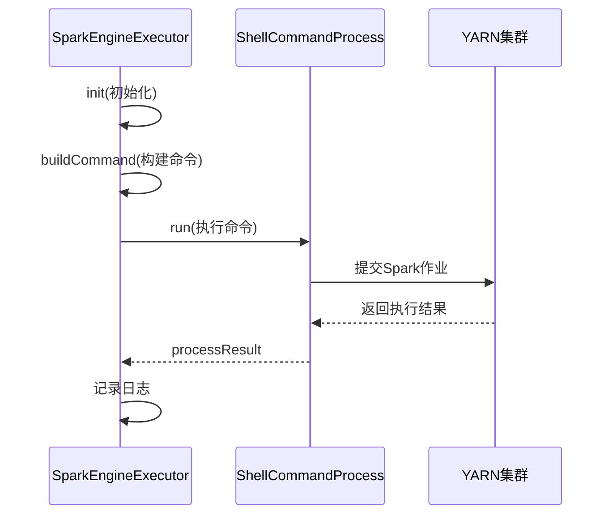
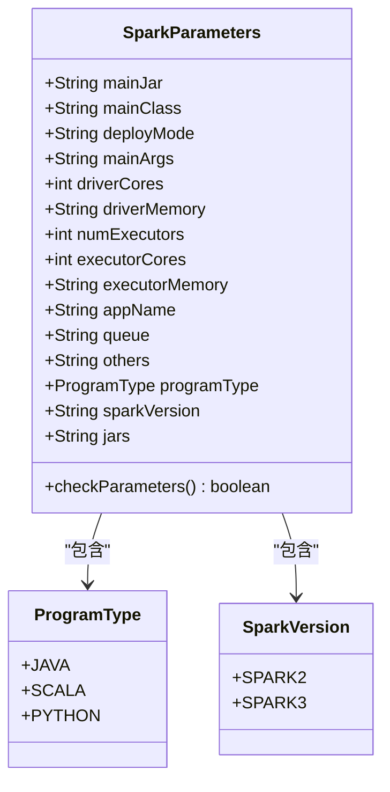
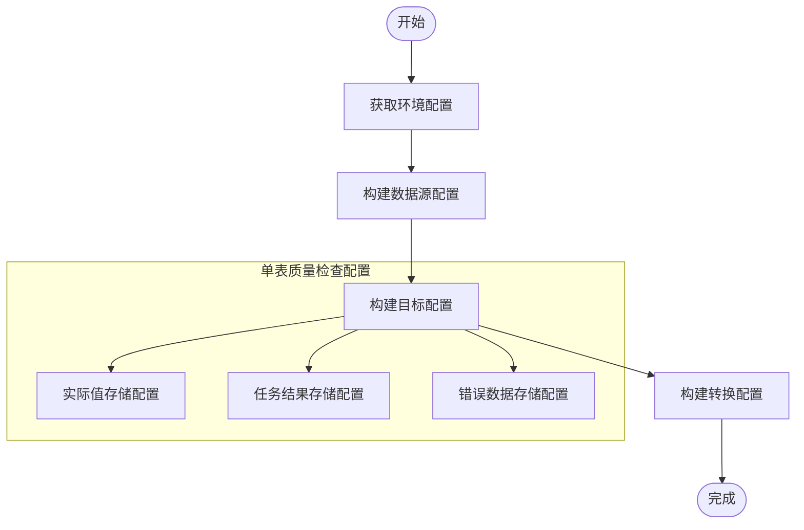
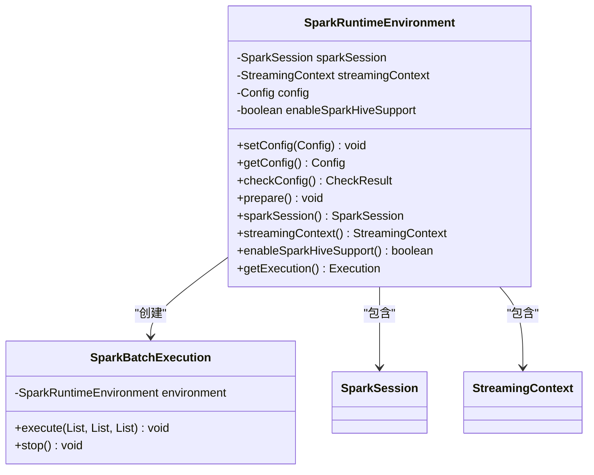
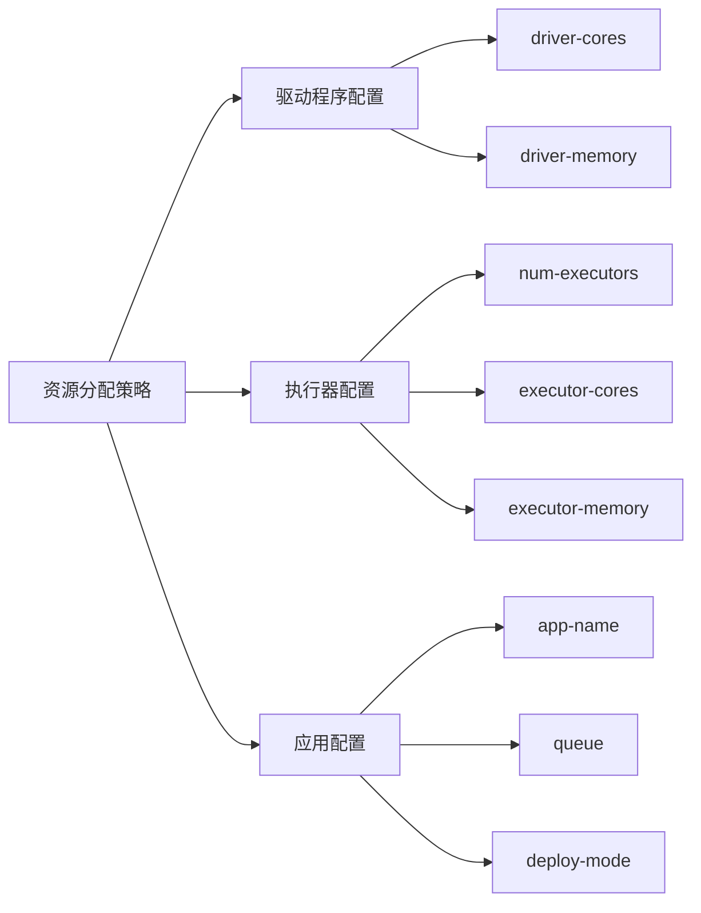
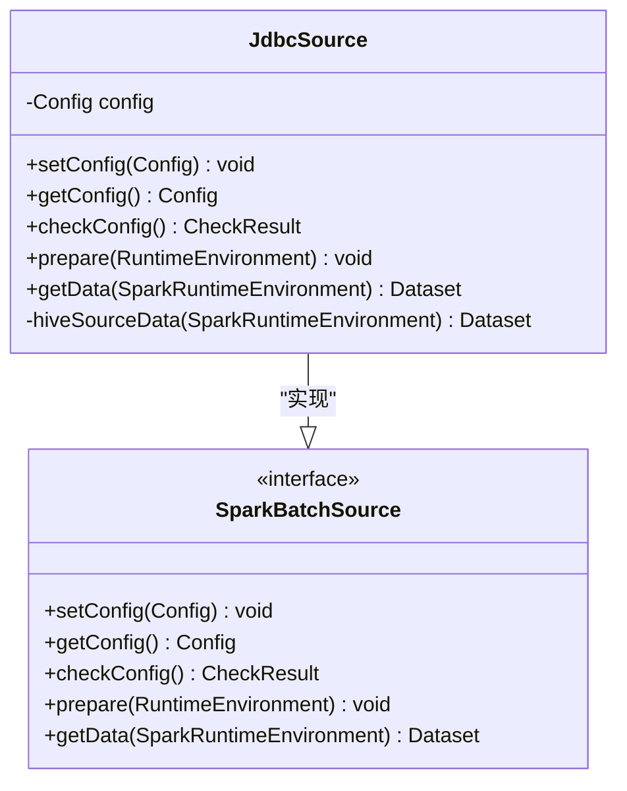

# Spark执行引擎

<cite>
**本文档引用的文件**   
- [SparkEngineExecutor.java](file://datavines-engine\datavines-engine-plugins\datavines-engine-spark\datavines-engine-spark-executor\src\main\java\io\datavines\engine\spark\executor\SparkEngineExecutor.java)
- [SparkParameters.java](file://datavines-engine\datavines-engine-plugins\datavines-engine-spark\datavines-engine-spark-executor\src\main\java\io\datavines\engine\spark\executor\parameter\SparkParameters.java)
- [BaseSparkConfigurationBuilder.java](file://datavines-engine\datavines-engine-plugins\datavines-engine-spark\datavines-engine-spark-config\src\main\java\io\datavines\engine\spark\config\BaseSparkConfigurationBuilder.java)
- [SparkSingleTableMetricBuilder.java](file://datavines-engine\datavines-engine-plugins\datavines-engine-spark\datavines-engine-spark-config\src\main\java\io\datavines\engine\spark\config\SparkSingleTableMetricBuilder.java)
- [SparkRuntimeEnvironment.java](file://datavines-engine\datavines-engine-plugins\datavines-engine-spark\datavines-engine-spark-api\src\main\java\io\datavines\engine\spark\api\SparkRuntimeEnvironment.java)
- [SparkBatchExecution.java](file://datavines-engine\datavines-engine-plugins\datavines-engine-spark\datavines-engine-spark-api\src\main\java\io\datavines\engine\spark\api\batch\SparkBatchExecution.java)
- [SparkDataVinesBootstrap.java](file://datavines-engine\datavines-engine-plugins\datavines-engine-spark\datavines-engine-spark-core\src\main\java\io\datavines\engine\spark\core\SparkDataVinesBootstrap.java)
- [JdbcSource.java](file://datavines-engine\datavines-engine-plugins\datavines-engine-spark\datavines-engine-spark-connector-jdbc\src\main\java\io\datavines\engine\spark\jdbc\source\JdbcSource.java)
- [SparkArgsUtils.java](file://datavines-engine\datavines-engine-plugins\datavines-engine-spark\datavines-engine-spark-executor\src\main\java\io\datavines\engine\spark\executor\parameter\SparkArgsUtils.java)
- [SparkConstants.java](file://datavines-engine\datavines-engine-plugins\datavines-engine-spark\datavines-engine-spark-executor\src\main\java\io\datavines\engine\spark\executor\parameter\SparkConstants.java)
- [SparkVersion.java](file://datavines-engine\datavines-engine-plugins\datavines-engine-spark\datavines-engine-spark-executor\src\main\java\io\datavines\engine\spark\executor\parameter\SparkVersion.java)
- [ProgramType.java](file://datavines-engine\datavines-engine-plugins\datavines-engine-spark\datavines-engine-spark-executor\src\main\java\io\datavines\engine\spark\executor\parameter\ProgramType.java)
</cite>

## 目录
1. [任务提交机制](#任务提交机制)
2. [Spark参数配置](#spark参数配置)
3. [配置构建器](#配置构建器)
4. [运行时环境](#运行时环境)
5. [资源分配与性能优化](#资源分配与性能优化)
6. [Spark Connector](#spark-connector)

## 任务提交机制

Spark执行引擎通过`SparkEngineExecutor`类实现任务提交机制。该机制基于YARN平台，通过构建spark-submit命令来提交Spark作业。执行器首先初始化作业请求和日志记录器，然后构建完整的命令行参数，最后通过ShellCommandProcess执行命令。

任务提交流程如下：
1. 初始化执行环境，设置线程名称和日志信息
2. 解析引擎参数和应用参数
3. 构建spark-submit命令行
4. 执行命令并获取处理结果
5. 记录执行过程和结果

**图示来源**
- [SparkEngineExecutor.java](file://datavines-engine\datavines-engine-plugins\datavines-engine-spark\datavines-engine-spark-executor\src\main\java\io\datavines\engine\spark\executor\SparkEngineExecutor.java#L41-L152)

**本节来源**
- [SparkEngineExecutor.java](file://datavines-engine\datavines-engine-plugins\datavines-engine-spark\datavines-engine-spark-executor\src\main\java\io\datavines\engine\spark\executor\SparkEngineExecutor.java#L41-L152)

## Spark参数配置

Spark参数配置通过`SparkParameters`类定义，包含Spark作业所需的各种配置参数。这些参数在任务提交时被转换为spark-submit命令行参数。

主要配置参数包括：
- **主JAR包**: 指定要执行的主JAR文件路径
- **主类**: 指定主类名称
- **部署模式**: cluster或client模式
- **资源配置**: 驱动程序和执行器的CPU核心数、内存大小
- **应用配置**: 应用名称、队列、其他参数
- **程序类型**: JAVA、SCALA或PYTHON
- **Spark版本**: SPARK2或SPARK3

**图示来源**
- [SparkParameters.java](file://datavines-engine\datavines-engine-plugins\datavines-engine-spark\datavines-engine-spark-executor\src\main\java\io\datavines\engine\spark\executor\parameter\SparkParameters.java#L19-L219)
- [ProgramType.java](file://datavines-engine\datavines-engine-plugins\datavines-engine-spark\datavines-engine-spark-executor\src\main\java\io\datavines\engine\spark\executor\parameter\ProgramType.java#L19-L27)
- [SparkVersion.java](file://datavines-engine\datavines-engine-plugins\datavines-engine-spark\datavines-engine-spark-executor\src\main\java\io\datavines\engine\spark\executor\parameter\SparkVersion.java#L19-L43)

**本节来源**
- [SparkParameters.java](file://datavines-engine\datavines-engine-plugins\datavines-engine-spark\datavines-engine-spark-executor\src\main\java\io\datavines\engine\spark\executor\parameter\SparkParameters.java#L19-L219)

## 配置构建器

Spark配置构建器负责为不同类型的质量检查生成作业配置。`BaseSparkConfigurationBuilder`是所有Spark配置构建器的基类，提供了通用的配置构建逻辑。

配置构建流程：
1. 获取环境配置
2. 构建数据源配置
3. 构建目标配置
4. 构建转换配置

对于单表质量检查，`SparkSingleTableMetricBuilder`构建器会生成相应的配置，包括实际值存储、任务结果存储和错误数据存储的配置。

**图示来源**
- [BaseSparkConfigurationBuilder.java](file://datavines-engine\datavines-engine-plugins\datavines-engine-spark\datavines-engine-spark-config\src\main\java\io\datavines\engine\spark\config\BaseSparkConfigurationBuilder.java#L47-L356)
- [SparkSingleTableMetricBuilder.java](file://datavines-engine\datavines-engine-plugins\datavines-engine-spark\datavines-engine-spark-config\src\main\java\io\datavines\engine\spark\config\SparkSingleTableMetricBuilder.java#L35-L81)

**本节来源**
- [BaseSparkConfigurationBuilder.java](file://datavines-engine\datavines-engine-plugins\datavines-engine-spark\datavines-engine-spark-config\src\main\java\io\datavines\engine\spark\config\BaseSparkConfigurationBuilder.java#L47-L356)
- [SparkSingleTableMetricBuilder.java](file://datavines-engine\datavines-engine-plugins\datavines-engine-spark\datavines-engine-spark-config\src\main\java\io\datavines\engine\spark\config\SparkSingleTableMetricBuilder.java#L35-L81)

## 运行时环境

Spark运行时环境由`SparkRuntimeEnvironment`类管理，负责Spark会话的初始化和管理。环境初始化时会根据配置创建SparkSession，并根据需要启用Hive支持。

运行时环境的主要功能：
- 创建和管理SparkSession
- 支持Hive集成
- 管理StreamingContext
- 提供执行环境

**图示来源**
- [SparkRuntimeEnvironment.java](file://datavines-engine\datavines-engine-plugins\datavines-engine-spark\datavines-engine-spark-api\src\main\java\io\datavines\engine\spark\api\SparkRuntimeEnvironment.java#L34-L117)
- [SparkBatchExecution.java](file://datavines-engine\datavines-engine-plugins\datavines-engine-spark\datavines-engine-spark-api\src\main\java\io\datavines\engine\spark\api\batch\SparkBatchExecution.java#L36-L136)

**本节来源**
- [SparkRuntimeEnvironment.java](file://datavines-engine\datavines-engine-plugins\datavines-engine-spark\datavines-engine-spark-api\src\main\java\io\datavines\engine\spark\api\SparkRuntimeEnvironment.java#L34-L117)
- [SparkBatchExecution.java](file://datavines-engine\datavines-engine-plugins\datavines-engine-spark\datavines-engine-spark-api\src\main\java\io\datavines\engine\spark\api\batch\SparkBatchExecution.java#L36-L136)

## 资源分配与性能优化

Spark执行引擎的资源分配策略通过`SparkArgsUtils`工具类实现，将配置参数转换为spark-submit命令行参数。资源分配包括驱动程序和执行器的CPU核心数、内存大小等。

性能优化建议：
1. **合理设置执行器数量**: 根据集群资源和任务复杂度调整num-executors
2. **优化内存分配**: 为驱动程序和执行器分配适当的内存
3. **调整核心数**: 根据任务并行度需求设置executor-cores
4. **使用合适的部署模式**: cluster模式适合生产环境，client模式适合调试
5. **启用Hive支持**: 当需要访问Hive表时启用spark-hive支持

**图示来源**
- [SparkArgsUtils.java](file://datavines-engine\datavines-engine-plugins\datavines-engine-spark\datavines-engine-spark-executor\src\main\java\io\datavines\engine\spark\executor\parameter\SparkArgsUtils.java#L25-L130)
- [SparkConstants.java](file://datavines-engine\datavines-engine-plugins\datavines-engine-spark\datavines-engine-spark-executor\src\main\java\io\datavines\engine\spark\executor\parameter\SparkConstants.java#L19-L75)

**本节来源**
- [SparkArgsUtils.java](file://datavines-engine\datavines-engine-plugins\datavines-engine-spark\datavines-engine-spark-executor\src\main\java\io\datavines\engine\spark\executor\parameter\SparkArgsUtils.java#L25-L130)
- [SparkConstants.java](file://datavines-engine\datavines-engine-plugins\datavines-engine-spark\datavines-engine-spark-executor\src\main\java\io\datavines\engine\spark\executor\parameter\SparkConstants.java#L19-L75)

## Spark Connector

Spark Connector支持多种数据源类型，通过插件机制实现。JDBC连接器是其中的重要组成部分，支持通过JDBC协议访问各种关系型数据库。

支持的数据源类型：
- ClickHouse
- Databend
- DM数据库
- Doris
- 文件系统
- Flink
- Hive
- Impala
- JDBC通用连接器
- MongoDB
- MySQL
- Oracle
- PostgreSQL
- Presto
- Spark
- SQL Server
- StarRocks
- Trino

JDBC连接器实现通过`JdbcSource`类提供数据读取功能，支持标准JDBC参数配置，包括URL、用户名、密码、驱动类等。

**图示来源**
- [JdbcSource.java](file://datavines-engine\datavines-engine-plugins\datavines-engine-spark\datavines-engine-spark-connector-jdbc\src\main\java\io\datavines\engine\spark\jdbc\source\JdbcSource.java#L38-L117)
- [SparkBatchSource.java](file://datavines-engine\datavines-engine-plugins\datavines-engine-spark\datavines-engine-spark-api\src\main\java\io\datavines\engine\spark\api\batch\SparkBatchSource.java)

**本节来源**
- [JdbcSource.java](file://datavines-engine\datavines-engine-plugins\datavines-engine-spark\datavines-engine-spark-connector-jdbc\src\main\java\io\datavines\engine\spark\jdbc\source\JdbcSource.java#L38-L117)
- [datavines-connector-plugins](file://datavines-connector\datavines-connector-plugins)