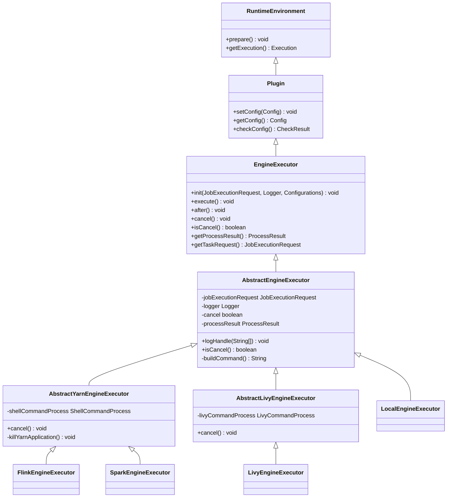
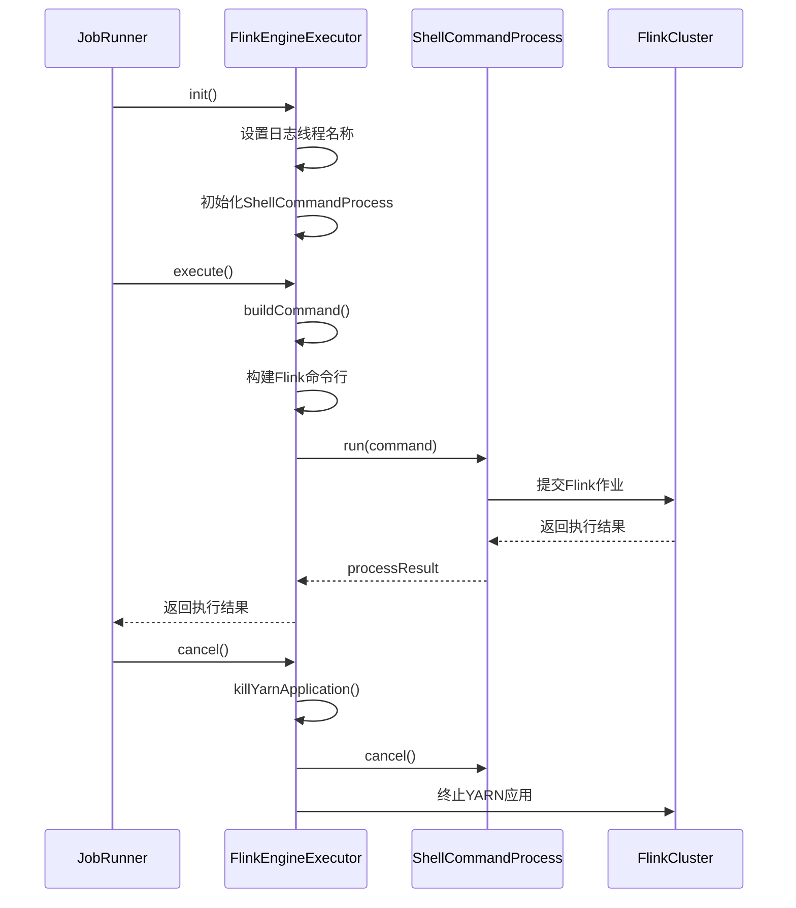
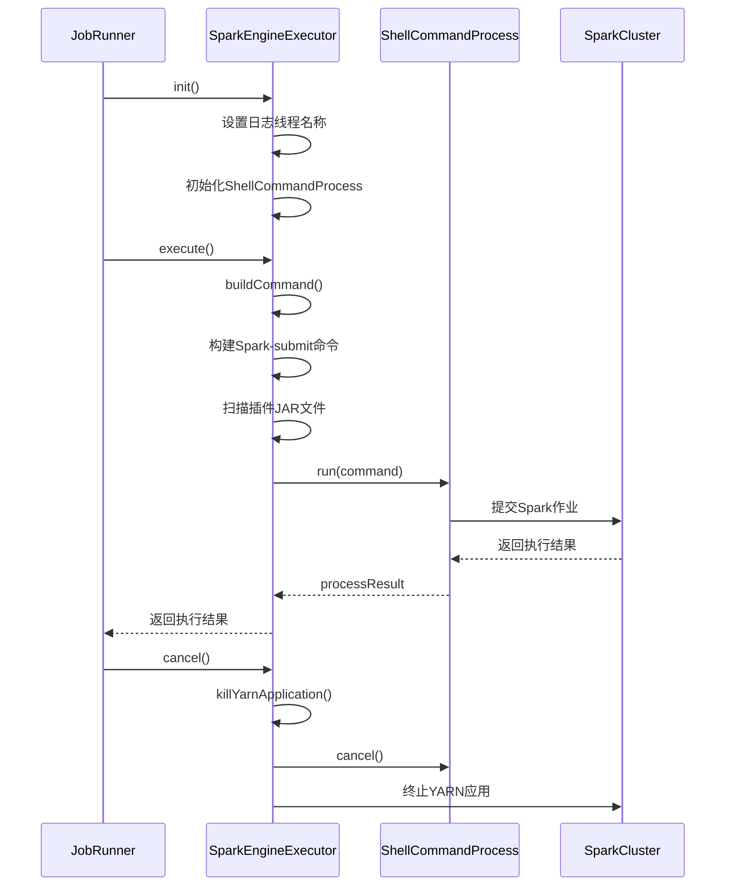
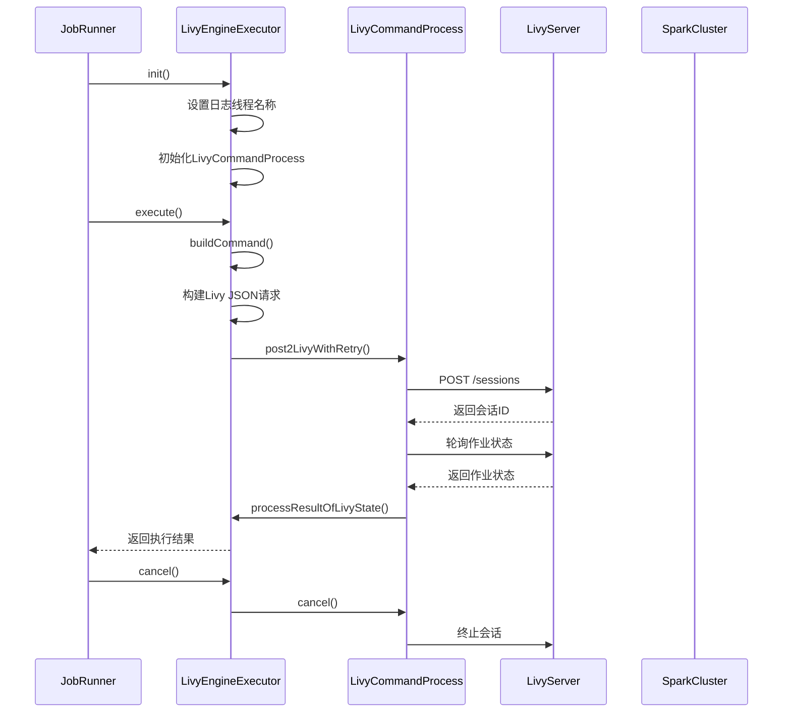
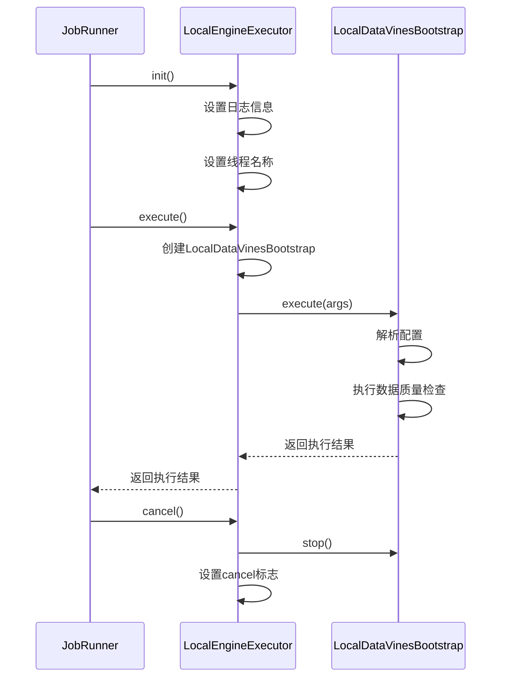
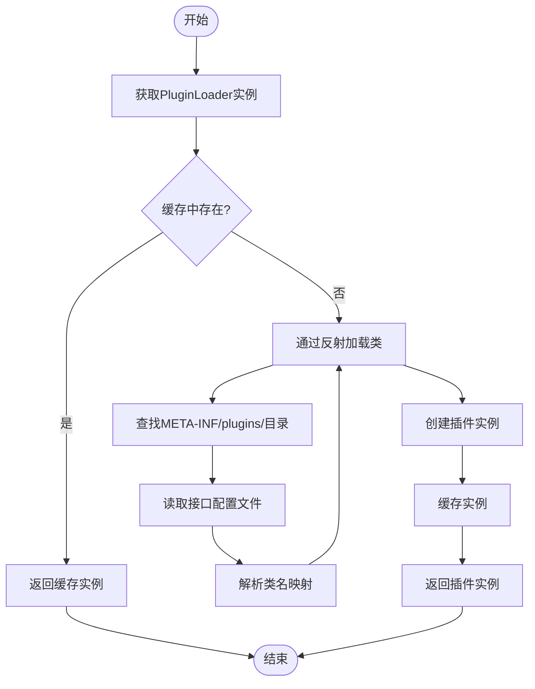
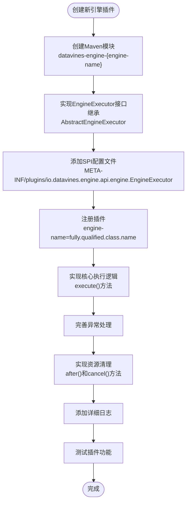
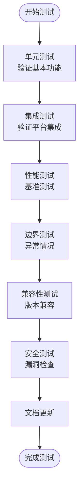

# 执行引擎插件

<cite>
**本文档引用文件**  
- [EngineExecutor.java](file://datavines-engine/datavines-engine-api/src/main/java/io/datavines/engine/api/engine/EngineExecutor.java)
- [Plugin.java](file://datavines-engine/datavines-engine-api/src/main/java/io/datavines/engine/api/plugin/Plugin.java)
- [RuntimeEnvironment.java](file://datavines-engine/datavines-engine-api/src/main/java/io/datavines/engine/api/env/RuntimeEnvironment.java)
- [AbstractEngineExecutor.java](file://datavines-engine/datavines-engine-executor/src/main/java/io/datavines/engine/executor/core/base/AbstractEngineExecutor.java)
- [AbstractLivyEngineExecutor.java](file://datavines-engine/datavines-engine-executor/src/main/java/io/datavines/engine/executor/core/base/AbstractLivyEngineExecutor.java)
- [AbstractYarnEngineExecutor.java](file://datavines-engine/datavines-engine-executor/src/main/java/io/datavines/engine/executor/core/base/AbstractYarnEngineExecutor.java)
- [FlinkEngineExecutor.java](file://datavines-engine/datavines-engine-plugins/datavines-engine-flink/datavines-engine-flink-executor/src/main/java/io/datavines/engine/flink/executor/FlinkEngineExecutor.java)
- [SparkEngineExecutor.java](file://datavines-engine/datavines-engine-plugins/datavines-engine-spark/datavines-engine-spark-executor/src/main/java/io/datavines/engine/spark/executor/SparkEngineExecutor.java)
- [LocalEngineExecutor.java](file://datavines-engine/datavines-engine-plugins/datavines-engine-local/datavines-engine-local-executor/src/main/java/io/datavines/engine/local/executor/LocalEngineExecutor.java)
- [LivyEngineExecutor.java](file://datavines-engine/datavines-engine-plugins/datavines-engine-livy/datavines-engine-livy-executor/src/main/java/io/datavines/engine/livy/executor/LivyEngineExecutor.java)
- [FlinkDataVinesBootstrap.java](file://datavines-engine/datavines-engine-plugins/datavines-engine-flink/datavines-engine-flink-core/src/main/java/io/datavines/engine/flink/core/FlinkDataVinesBootstrap.java)
- [SparkDataVinesBootstrap.java](file://datavines-engine/datavines-engine-plugins/datavines-engine-spark/datavines-engine-spark-core/src/main/java/io/datavines/engine/spark/core/SparkDataVinesBootstrap.java)
- [LocalDataVinesBootstrap.java](file://datavines-engine/datavines-engine-plugins/datavines-engine-local/datavines-engine-local-core/src/main/java/io/datavines/engine/local/core/LocalDataVinesBootstrap.java)
- [PluginLoader.java](file://datavines-spi/src/main/java/io/datavines/spi/PluginLoader.java)
</cite>

## 目录
1. [执行引擎插件架构](#执行引擎插件架构)
2. [Flink执行引擎](#flink执行引擎)
3. [Spark执行引擎](#spark执行引擎)
4. [Livy执行引擎](#livy执行引擎)
5. [本地执行引擎](#本地执行引擎)
6. [性能与资源对比](#性能与资源对比)
7. [插件加载机制](#插件加载机制)
8. [配置参数说明](#配置参数说明)
9. [性能调优指南](#性能调优指南)
10. [新引擎开发模板](#新引擎开发模板)
11. [测试验证流程](#测试验证流程)

## 执行引擎插件架构

DataVines平台的执行引擎插件系统采用基于SPI（Service Provider Interface）的插件化架构设计，实现了执行引擎的可扩展性和灵活性。系统通过统一的接口定义和抽象基类，支持Flink、Spark、Livy和本地四种执行引擎的集成。

核心架构由三个关键接口组成：`EngineExecutor`、`RuntimeEnvironment`和`Plugin`。`EngineExecutor`接口定义了执行引擎的生命周期方法，包括初始化、执行、后处理和取消等操作。`RuntimeEnvironment`接口定义了运行时环境的准备和执行上下文获取。`Plugin`接口则提供了配置设置、获取和验证的基础能力。

**图源**  
- [EngineExecutor.java](file://datavines-engine/datavines-engine-api/src/main/java/io/datavines/engine/api/engine/EngineExecutor.java)
- [AbstractEngineExecutor.java](file://datavines-engine/datavines-engine-executor/src/main/java/io/datavines/engine/executor/core/base/AbstractEngineExecutor.java)
- [AbstractYarnEngineExecutor.java](file://datavines-engine/datavines-engine-executor/src/main/java/io/datavines/engine/executor/core/base/AbstractYarnEngineExecutor.java)
- [AbstractLivyEngineExecutor.java](file://datavines-engine/datavines-engine-executor/src/main/java/io/datavines/engine/executor/core/base/AbstractLivyEngineExecutor.java)

**本节来源**  
- [EngineExecutor.java](file://datavines-engine/datavines-engine-api/src/main/java/io/datavines/engine/api/engine/EngineExecutor.java#L26-L42)
- [Plugin.java](file://datavines-engine/datavines-engine-api/src/main/java/io/datavines/engine/api/plugin/Plugin.java#L24-L31)
- [RuntimeEnvironment.java](file://datavines-engine/datavines-engine-api/src/main/java/io/datavines/engine/api/env/RuntimeEnvironment.java#L23-L28)

## Flink执行引擎

Flink执行引擎通过`FlinkEngineExecutor`类实现，继承自`AbstractYarnEngineExecutor`，采用YARN集群模式运行Flink作业。该引擎通过构建Flink命令行来提交作业，利用Flink的分布式流处理能力进行数据质量检查。

`FlinkEngineExecutor`的执行流程包括：初始化时设置日志线程名称和命令行处理器；执行时通过`buildCommand`方法构建完整的Flink命令；执行完成后进行资源清理。在`buildCommand`方法中，系统会解析Flink参数，设置主JAR包路径、主类名和运行参数，并将作业配置序列化为Base64编码的字符串作为参数传递。

Flink引擎的作业启动通过调用Flink的`bin/flink`脚本实现，使用`flink run`命令提交作业。作业的主类为`io.datavines.engine.flink.core.FlinkDataVinesBootstrap`，该类负责启动Flink流处理作业并执行数据质量检查逻辑。

**图源**  
- [FlinkEngineExecutor.java](file://datavines-engine/datavines-engine-plugins/datavines-engine-flink/datavines-engine-flink-executor/src/main/java/io/datavines/engine/flink/executor/FlinkEngineExecutor.java)
- [AbstractYarnEngineExecutor.java](file://datavines-engine/datavines-engine-executor/src/main/java/io/datavines/engine/executor/core/base/AbstractYarnEngineExecutor.java)

**本节来源**  
- [FlinkEngineExecutor.java](file://datavines-engine/datavines-engine-plugins/datavines-engine-flink/datavines-engine-flink-executor/src/main/java/io/datavines/engine/flink/executor/FlinkEngineExecutor.java#L38-L182)
- [FlinkDataVinesBootstrap.java](file://datavines-engine/datavines-engine-plugins/datavines-engine-flink/datavines-engine-flink-core/src/main/java/io/datavines/engine/flink/core/FlinkDataVinesBootstrap.java#L25-L36)

## Spark执行引擎

Spark执行引擎通过`SparkEngineExecutor`类实现，同样继承自`AbstractYarnEngineExecutor`，采用YARN集群模式运行Spark作业。该引擎通过构建Spark-submit命令来提交作业，利用Spark的批处理能力进行数据质量检查。

`SparkEngineExecutor`的执行流程与Flink引擎类似，但在命令构建方面有所不同。系统会解析Spark参数，设置主JAR包路径、主类名和运行参数。与Flink引擎不同的是，Spark引擎会自动扫描插件目录下的JAR文件，并将其添加到`--jars`参数中，确保所有依赖都能正确加载。

Spark引擎的作业启动通过调用`SPARK2_COMMAND`（即`spark-submit`）实现。作业的主类为`io.datavines.engine.spark.core.SparkDataVinesBootstrap`，该类负责启动Spark应用程序并执行数据质量检查逻辑。系统还会在Spark配置中添加作业唯一ID作为标签，便于作业追踪和管理。

**图源**  
- [SparkEngineExecutor.java](file://datavines-engine/datavines-engine-plugins/datavines-engine-spark/datavines-engine-spark-executor/src/main/java/io/datavines/engine/spark/executor/SparkEngineExecutor.java)
- [SparkDataVinesBootstrap.java](file://datavines-engine/datavines-engine-plugins/datavines-engine-spark/datavines-engine-spark-core/src/main/java/io/datavines/engine/spark/core/SparkDataVinesBootstrap.java)

**本节来源**  
- [SparkEngineExecutor.java](file://datavines-engine/datavines-engine-plugins/datavines-engine-spark/datavines-engine-spark-executor/src/main/java/io/datavines/engine/spark/executor/SparkEngineExecutor.java#L41-L152)
- [SparkDataVinesBootstrap.java](file://datavines-engine/datavines-engine-plugins/datavines-engine-spark/datavines-engine-spark-core/src/main/java/io/datavines/engine/spark/core/SparkDataVinesBootstrap.java#L23-L33)

## Livy执行引擎

Livy执行引擎通过`LivyEngineExecutor`类实现，继承自`AbstractLivyEngineExecutor`，采用Livy REST API提交Spark作业。该引擎不直接执行命令，而是通过HTTP请求与Livy服务器通信来管理Spark作业的生命周期。

`LivyEngineExecutor`的执行流程包括：初始化时创建`LivyCommandProcess`用于处理HTTP请求；执行时通过`buildCommand`方法构建JSON格式的Livy请求体；然后调用`post2LivyWithRetry`方法向Livy服务器提交作业；最后监控作业状态并获取执行结果。

Livy引擎的作业提交采用RESTful API方式，请求体包含作业的JAR文件路径、主类名、参数、资源分配等配置。系统会将数据质量检查配置序列化为JSON字符串，并作为作业参数传递。作业提交后，Livy服务器会返回作业ID，引擎会持续轮询作业状态直到完成。

**图源**  
- [LivyEngineExecutor.java](file://datavines-engine/datavines-engine-plugins/datavines-engine-livy/datavines-engine-livy-executor/src/main/java/io/datavines/engine/livy/executor/LivyEngineExecutor.java)
- [AbstractLivyEngineExecutor.java](file://datavines-engine/datavines-engine-executor/src/main/java/io/datavines/engine/executor/core/base/AbstractLivyEngineExecutor.java)

**本节来源**  
- [LivyEngineExecutor.java](file://datavines-engine/datavines-engine-plugins/datavines-engine-livy/datavines-engine-livy-executor/src/main/java/io/datavines/engine/livy/executor/LivyEngineExecutor.java#L42-L236)
- [SparkDataVinesBootstrap.java](file://datavines-engine/datavines-engine-plugins/datavines-engine-spark/datavines-engine-spark-core/src/main/java/io/datavines/engine/spark/core/SparkDataVinesBootstrap.java)

## 本地执行引擎

本地执行引擎通过`LocalEngineExecutor`类实现，继承自`AbstractEngineExecutor`，在本地JVM进程中直接执行数据质量检查任务。该引擎适用于开发测试和小规模数据处理场景，无需依赖外部计算集群。

`LocalEngineExecutor`的执行流程包括：初始化时设置日志信息；执行时创建`LocalDataVinesBootstrap`实例并调用其`execute`方法；执行完成后进行清理。与分布式引擎不同，本地引擎不构建外部命令，而是直接在当前JVM中启动数据质量检查流程。

本地引擎的作业执行通过`LocalDataVinesBootstrap`类实现，该类继承自`BaseDataVinesBootstrap`，负责解析配置并执行相应的数据质量检查逻辑。系统会将作业配置作为参数传递给引导类，由引导类负责整个执行流程的协调和管理。

**图源**  
- [LocalEngineExecutor.java](file://datavines-engine/datavines-engine-plugins/datavines-engine-local/datavines-engine-local-executor/src/main/java/io/datavines/engine/local/executor/LocalEngineExecutor.java)
- [LocalDataVinesBootstrap.java](file://datavines-engine/datavines-engine-plugins/datavines-engine-local/datavines-engine-local-core/src/main/java/io/datavines/engine/local/core/LocalDataVinesBootstrap.java)

**本节来源**  
- [LocalEngineExecutor.java](file://datavines-engine/datavines-engine-plugins/datavines-engine-local/datavines-engine-local-executor/src/main/java/io/datavines/engine/local/executor/LocalEngineExecutor.java#L27-L77)
- [LocalDataVinesBootstrap.java](file://datavines-engine/datavines-engine-plugins/datavines-engine-local/datavines-engine-local-core/src/main/java/io/datavines/engine/local/core/LocalDataVinesBootstrap.java#L23-L28)

## 性能与资源对比

四种执行引擎在性能、资源利用率和功能支持方面各有特点，适用于不同的应用场景。以下是对各引擎的详细对比分析：

| 特性 | Flink引擎 | Spark引擎 | Livy引擎 | 本地引擎 |
|------|---------|---------|--------|-------|
| **执行模式** | 流处理 | 批处理 | 批处理 | 本地执行 |
| **延迟** | 低（秒级） | 高（分钟级） | 高（分钟级） | 低（秒级） |
| **吞吐量** | 高 | 高 | 高 | 低 |
| **资源开销** | 中等 | 高 | 高 | 低 |
| **启动时间** | 中等 | 长 | 长 | 短 |
| **容错能力** | 强 | 中等 | 中等 | 弱 |
| **状态管理** | 支持 | 有限支持 | 有限支持 | 不支持 |
| **窗口计算** | 原生支持 | 通过结构化流支持 | 不支持 | 不支持 |
| **背压处理** | 原生支持 | 有限支持 | 不支持 | 不支持 |
| **集群依赖** | Flink集群 | Spark集群 | Livy服务器 | 无 |
| **适用场景** | 实时数据质量监控 | 大规模批处理 | 共享Spark集群 | 开发测试 |

Flink引擎在实时性方面表现最佳，适合需要低延迟响应的数据质量监控场景。其流处理架构能够实现秒级甚至毫秒级的数据质量检查，同时具备强大的状态管理和容错能力。然而，Flink集群的维护成本相对较高，且对开发人员的技术要求较高。

Spark引擎在大规模批处理场景下表现出色，适合处理TB级以上的数据质量检查任务。其基于内存的计算模型能够提供较高的处理速度，但作业启动时间较长，不适合实时性要求高的场景。Spark引擎的生态系统丰富，易于与其他大数据工具集成。

Livy引擎提供了对Spark集群的RESTful访问接口，适合多租户环境和共享集群场景。通过Livy服务器，多个客户端可以安全地提交和管理Spark作业，而无需直接访问集群。这种架构提高了资源利用率和安全性，但增加了额外的网络开销和延迟。

本地引擎在资源利用率方面最优，无需额外的集群资源，适合开发测试和小规模数据处理。其启动速度快，调试方便，但受限于单机性能，不适合处理大规模数据。本地引擎是快速验证数据质量规则的理想选择。

**本节来源**  
- [FlinkEngineExecutor.java](file://datavines-engine/datavines-engine-plugins/datavines-engine-flink/datavines-engine-flink-executor/src/main/java/io/datavines/engine/flink/executor/FlinkEngineExecutor.java)
- [SparkEngineExecutor.java](file://datavines-engine/datavines-engine-plugins/datavines-engine-spark/datavines-engine-spark-executor/src/main/java/io/datavines/engine/spark/executor/SparkEngineExecutor.java)
- [LivyEngineExecutor.java](file://datavines-engine/datavines-engine-plugins/datavines-engine-livy/datavines-engine-livy-executor/src/main/java/io/datavines/engine/livy/executor/LivyEngineExecutor.java)
- [LocalEngineExecutor.java](file://datavines-engine/datavines-engine-plugins/datavines-engine-local/datavines-engine-local-executor/src/main/java/io/datavines/engine/local/executor/LocalEngineExecutor.java)

## 插件加载机制

DataVines平台的插件加载机制基于自定义的SPI（Service Provider Interface）框架实现，位于`datavines-spi`模块中。该机制通过`PluginLoader`类提供插件的发现、加载和管理功能，实现了执行引擎的动态扩展能力。

插件加载的核心流程如下：首先，系统通过`PluginLoader.getPluginLoader(Class<T> type)`方法获取指定接口类型的插件加载器；然后，加载器会扫描类路径下的`META-INF/plugins/`目录，查找与接口名称匹配的配置文件；接着，解析配置文件中的类名映射，加载对应的实现类；最后，通过反射创建插件实例并进行缓存管理。

插件配置文件采用标准的Java SPI格式，每行包含一个插件名称和实现类的映射，格式为`name=fully.qualified.class.name`。系统会自动发现所有实现了`EngineExecutor`接口的插件，并根据名称进行管理和调用。这种设计使得新增执行引擎只需添加相应的实现类和配置文件，无需修改核心代码。

**图源**  
- [PluginLoader.java](file://datavines-spi/src/main/java/io/datavines/spi/PluginLoader.java)

**本节来源**  
- [PluginLoader.java](file://datavines-spi/src/main/java/io/datavines/spi/PluginLoader.java#L79-L407)
- [EngineExecutor.java](file://datavines-engine/datavines-engine-api/src/main/java/io/datavines/engine/api/engine/EngineExecutor.java#L26)

## 配置参数说明

各执行引擎支持不同的配置参数，这些参数通过`JobExecutionRequest`对象传递，包括引擎特定参数和应用参数。以下是各引擎的主要配置参数说明：

### Flink引擎配置参数
- **主JAR包**: `data.quality.flink.jar.name` - 指定Flink作业的主JAR包名称
- **FLINK_HOME**: 环境变量 - 指定Flink安装目录
- **资源分配**: 包括TaskManager数量、Slot数量、内存配置等
- **并行度**: 作业的并行执行度
- **检查点**: 检查点间隔、超时时间、最小间隔等
- **状态后端**: 状态存储类型（内存、文件系统、RocksDB）

### Spark引擎配置参数
- **主JAR包**: `data.quality.jar.name` - 指定Spark作业的主JAR包名称
- **SPARK_HOME2**: 环境变量 - 指定Spark安装目录
- **资源分配**: 
  - `driverCores`: Driver核心数
  - `driverMemory`: Driver内存
  - `numExecutors`: Executor数量
  - `executorCores`: 每个Executor的核心数
  - `executorMemory`: 每个Executor的内存
- **队列**: `queue` - YARN队列名称
- **其他参数**: `others` - 其他Spark配置参数

### Livy引擎配置参数
- **主JAR包**: `data.quality.jar.name` - 指定Spark作业的主JAR包名称
- **JAR库路径**: `livy.task.jar.lib.path` - HDFS上的JAR库路径
- **附加JAR**: `livy.task.jars` - 需要加载的附加JAR文件列表
- **代理用户**: `livy.task.proxyUser` - Livy代理用户
- **资源分配**: 与Spark引擎类似，包括Driver和Executor的资源配置
- **超时设置**: 会话超时时间、批处理超时时间等

### 本地引擎配置参数
- **无特殊配置**: 本地引擎主要依赖JVM参数和系统资源
- **日志配置**: 日志级别、输出格式等
- **线程池**: 本地执行的线程池大小

**本节来源**  
- [FlinkEngineExecutor.java](file://datavines-engine/datavines-engine-plugins/datavines-engine-flink/datavines-engine-flink-executor/src/main/java/io/datavines/engine/flink/executor/FlinkEngineExecutor.java)
- [SparkEngineExecutor.java](file://datavines-engine/datavines-engine-plugins/datavines-engine-spark/datavines-engine-spark-executor/src/main/java/io/datavines/engine/spark/executor/SparkEngineExecutor.java)
- [LivyEngineExecutor.java](file://datavines-engine/datavines-engine-plugins/datavines-engine-livy/datavines-engine-livy-executor/src/main/java/io/datavines/engine/livy/executor/LivyEngineExecutor.java)
- [LocalEngineExecutor.java](file://datavines-engine/datavines-engine-plugins/datavines-engine-local/datavines-engine-local-executor/src/main/java/io/datavines/engine/local/executor/LocalEngineExecutor.java)

## 性能调优指南

针对不同执行引擎的特性，以下是相应的性能调优建议：

### Flink引擎调优
1. **并行度优化**: 根据数据量和集群资源合理设置作业并行度，避免过度并行导致资源竞争
2. **状态管理**: 选择合适的状态后端，对于大状态作业推荐使用RocksDB状态后端
3. **检查点配置**: 根据业务需求平衡检查点频率和性能影响，避免过于频繁的检查点
4. **内存调优**: 合理分配TaskManager的堆内存和堆外内存，避免GC压力过大
5. **网络缓冲区**: 调整网络缓冲区大小以优化网络传输性能

### Spark引擎调优
1. **资源分配**: 根据数据规模合理设置Executor数量和资源配置，避免资源浪费或不足
2. **并行度**: 设置合适的分区数，确保数据均衡分布，避免数据倾斜
3. **内存管理**: 调整Executor内存分配，合理设置堆内存和堆外内存比例
4. **序列化**: 使用Kryo序列化提高序列化性能
5. **数据本地性**: 优化数据存储位置，提高数据本地性，减少网络传输

### Livy引擎调优
1. **会话管理**: 合理设置会话超时时间，平衡资源利用率和响应速度
2. **批处理配置**: 优化批处理的资源配置，避免资源争用
3. **连接池**: 配置Livy客户端连接池，提高并发处理能力
4. **重试机制**: 设置合理的重试策略，应对网络波动和临时故障
5. **监控告警**: 建立完善的监控体系，及时发现和处理作业异常

### 通用调优建议
1. **数据分区**: 合理设计数据分区策略，提高数据处理效率
2. **缓存策略**: 对频繁访问的数据进行缓存，减少重复计算
3. **日志级别**: 生产环境使用适当的日志级别，避免过多日志影响性能
4. **资源监控**: 实时监控作业的资源使用情况，及时发现性能瓶颈
5. **基准测试**: 定期进行基准测试，评估调优效果并持续优化

**本节来源**  
- [FlinkEngineExecutor.java](file://datavines-engine/datavines-engine-plugins/datavines-engine-flink/datavines-engine-flink-executor/src/main/java/io/datavines/engine/flink/executor/FlinkEngineExecutor.java)
- [SparkEngineExecutor.java](file://datavines-engine/datavines-engine-plugins/datavines-engine-spark/datavines-engine-spark-executor/src/main/java/io/datavines/engine/spark/executor/SparkEngineExecutor.java)
- [LivyEngineExecutor.java](file://datavines-engine/datavines-engine-plugins/datavines-engine-livy/datavines-engine-livy-executor/src/main/java/io/datavines/engine/livy/executor/LivyEngineExecutor.java)

## 新引擎开发模板

开发新的执行引擎插件需要遵循以下模板和步骤：

1. **创建Maven模块**: 在`datavines-engine-plugins`目录下创建新的模块，命名规范为`datavines-engine-{engine-name}`
2. **实现EngineExecutor接口**: 创建执行器类，继承`AbstractEngineExecutor`或其子类，实现所有抽象方法
3. **添加SPI配置**: 在`src/main/resources/META-INF/plugins/`目录下创建配置文件，格式为`io.datavines.engine.api.engine.EngineExecutor`
4. **注册插件**: 在配置文件中添加插件名称和实现类的映射，格式为`engine-name=fully.qualified.class.name`
5. **实现核心逻辑**: 在`execute()`方法中实现具体的作业提交和执行逻辑
6. **处理异常**: 完善异常处理机制，确保作业失败时能够正确报告错误信息
7. **资源清理**: 在`after()`和`cancel()`方法中实现资源清理逻辑
8. **日志记录**: 添加详细的日志记录，便于问题排查和监控

**图源**  
- [EngineExecutor.java](file://datavines-engine/datavines-engine-api/src/main/java/io/datavines/engine/api/engine/EngineExecutor.java)
- [AbstractEngineExecutor.java](file://datavines-engine/datavines-engine-executor/src/main/java/io/datavines/engine/executor/core/base/AbstractEngineExecutor.java)

**本节来源**  
- [EngineExecutor.java](file://datavines-engine/datavines-engine-api/src/main/java/io/datavines/engine/api/engine/EngineExecutor.java#L26-L42)
- [AbstractEngineExecutor.java](file://datavines-engine/datavines-engine-executor/src/main/java/io/datavines/engine/executor/core/base/AbstractEngineExecutor.java#L27-L56)

## 测试验证流程

新执行引擎插件的测试验证应遵循以下流程：

1. **单元测试**: 编写单元测试验证执行器的基本功能，包括初始化、执行、取消等操作
2. **集成测试**: 在实际环境中测试引擎与平台的集成，验证作业提交、执行监控和结果返回
3. **性能测试**: 进行基准测试，评估引擎在不同数据规模下的性能表现
4. **边界测试**: 测试各种边界条件和异常情况，如网络中断、资源不足、配置错误等
5. **兼容性测试**: 验证引擎在不同版本的依赖组件下的兼容性
6. **安全测试**: 检查引擎的安全性，防止代码注入、权限提升等安全问题
7. **文档更新**: 更新相关文档，包括配置说明、使用指南和故障排查

测试过程中应重点关注以下方面：
- 作业提交的正确性
- 执行状态的准确监控
- 错误信息的完整报告
- 资源的正确清理
- 性能指标的合理范围
- 日志信息的完整性

**图源**  
- [EngineExecutor.java](file://datavines-engine/datavines-engine-api/src/main/java/io/datavines/engine/api/engine/EngineExecutor.java)
- [AbstractEngineExecutor.java](file://datavines-engine/datavines-engine-executor/src/main/java/io/datavines/engine/executor/core/base/AbstractEngineExecutor.java)

**本节来源**  
- [EngineExecutor.java](file://datavines-engine/datavines-engine-api/src/main/java/io/datavines/engine/api/engine/EngineExecutor.java)
- [AbstractEngineExecutor.java](file://datavines-engine/datavines-engine-executor/src/main/java/io/datavines/engine/executor/core/base/AbstractEngineExecutor.java)