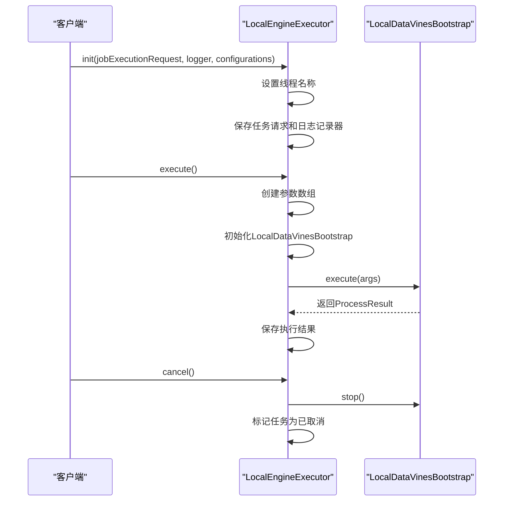
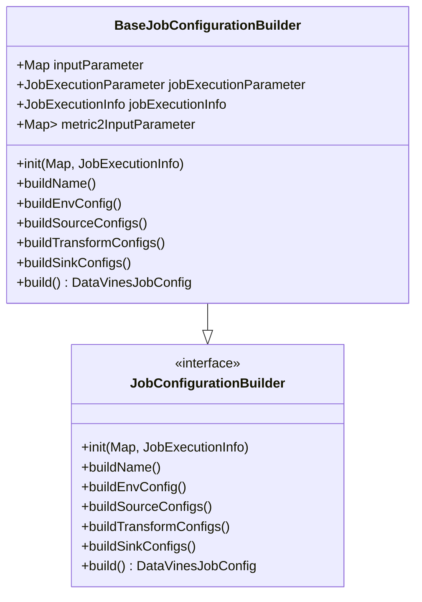
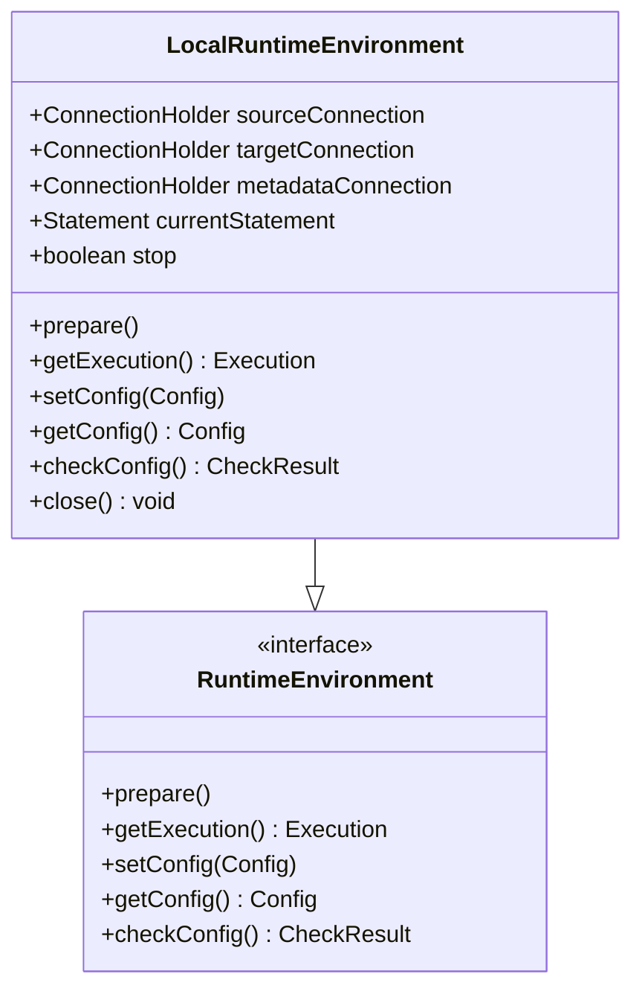
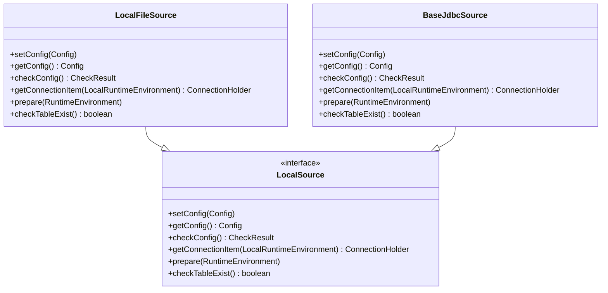
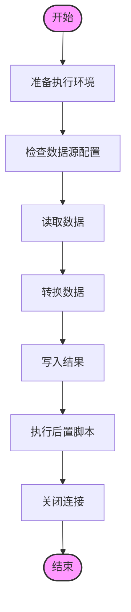

# 本地执行引擎

<cite>
**本文档引用的文件**  
- [LocalEngineExecutor.java](file://datavines-engine/datavines-engine-plugins/datavines-engine-local/datavines-engine-local-executor/src/main/java/io/datavines/engine/local/executor/LocalEngineExecutor.java)
- [LocalRuntimeEnvironment.java](file://datavines-engine/datavines-engine-plugins/datavines-engine-local/datavines-engine-local-api/src/main/java/io/datavines/engine/local/api/LocalRuntimeEnvironment.java)
- [LocalDataVinesBootstrap.java](file://datavines-engine/datavines-engine-plugins/datavines-engine-local/datavines-engine-local-core/src/main/java/io/datavines/engine/local/core/LocalDataVinesBootstrap.java)
- [LocalExecution.java](file://datavines-engine/datavines-engine-plugins/datavines-engine-local/datavines-engine-local-api/src/main/java/io/datavines/engine/local/api/LocalExecution.java)
- [BaseJobConfigurationBuilder.java](file://datavines-engine/datavines-engine-config/src/main/java/io/datavines/engine/config/BaseJobConfigurationBuilder.java)
- [LocalFileSource.java](file://datavines-engine/datavines-engine-plugins/datavines-engine-local/datavines-engine-local-connector-file/src/main/java/io/datavines/engine/local/connector/LocalFileSource.java)
- [BaseJdbcSource.java](file://datavines-engine/datavines-engine-plugins/datavines-engine-local/datavines-engine-local-connector-jdbc/src/main/java/io/datavines/engine/local/connector/BaseJdbcSource.java)
- [ConnectionHolder.java](file://datavines-engine/datavines-engine-plugins/datavines-engine-local/datavines-engine-local-api/src/main/java/io/datavines/engine/local/api/entity/ConnectionHolder.java)
</cite>

## 目录
1. [简介](#简介)
2. [本地任务执行机制与进程管理](#本地任务执行机制与进程管理)
3. [本地配置构建器](#本地配置构建器)
4. [本地运行时环境](#本地运行时环境)
5. [配置参数与使用限制](#配置参数与使用限制)
6. [数据源连接与结果处理](#数据源连接与结果处理)
7. [总结](#总结)

## 简介

本地执行引擎是 DataVines 框架中的一个重要组件，用于在本地环境中执行数据质量检查、数据剖析和数据对账等任务。该引擎通过 `LocalEngineExecutor` 类实现，支持从文件或 JDBC 数据源读取数据，并将结果写入指定的目标。本地执行模式适用于开发测试、小规模数据处理以及对资源消耗敏感的场景。

**本地执行引擎的核心特点包括：**
- **轻量级**：无需依赖外部集群，直接在本地 JVM 中运行。
- **灵活性**：支持多种数据源（如文件、JDBC）和目标存储。
- **易用性**：提供简单的配置接口，便于快速部署和调试。
- **可扩展性**：基于插件化设计，可以轻松添加新的数据源和转换逻辑。

本文档详细介绍了 `LocalEngineExecutor` 的本地任务执行机制、进程管理、配置构建器、运行时环境、配置参数及使用限制，以及数据源连接和结果处理的实现细节。

## 本地任务执行机制与进程管理

`LocalEngineExecutor` 是本地执行引擎的核心类，继承自 `AbstractEngineExecutor`，负责初始化、执行和取消任务。其主要方法如下：

- **init**：初始化任务执行请求，设置日志记录器和线程名称。
- **execute**：执行任务，创建 `LocalDataVinesBootstrap` 实例并调用其 `execute` 方法。
- **after**：任务执行后的清理工作。
- **cancel**：取消任务，停止 `LocalDataVinesBootstrap` 并标记任务为已取消。
- **getProcessResult**：获取任务执行结果。
- **getTaskRequest**：获取任务请求信息。

**本地任务执行流程：**
1. 客户端调用 `init` 方法，传入任务执行请求、日志记录器和配置。
2. `LocalEngineExecutor` 初始化任务，设置线程名称，并保存相关对象。
3. 客户端调用 `execute` 方法，`LocalEngineExecutor` 创建 `LocalDataVinesBootstrap` 实例并传递参数。
4. `LocalDataVinesBootstrap` 执行任务，返回执行结果。
5. 如果需要取消任务，客户端调用 `cancel` 方法，`LocalEngineExecutor` 停止 `LocalDataVinesBootstrap` 并标记任务为已取消。

**Section sources**
- [LocalEngineExecutor.java](file://datavines-engine/datavines-engine-plugins/datavines-engine-local/datavines-engine-local-executor/src/main/java/io/datavines/engine/local/executor/LocalEngineExecutor.java#L27-L77)

## 本地配置构建器

`BaseJobConfigurationBuilder` 是一个抽象类，实现了 `JobConfigurationBuilder` 接口，用于生成适用于本地执行的作业配置。它提供了以下方法：

- **init**：初始化输入参数和任务执行信息，设置日期相关的占位符。
- **buildName**：构建任务名称。
- **buildEnvConfig**：构建环境配置。
- **buildSourceConfigs**：构建数据源配置。
- **buildTransformConfigs**：构建转换配置。
- **buildSinkConfigs**：构建目标配置。
- **build**：返回最终的 `DataVinesJobConfig` 对象。

**本地配置构建流程：**
1. 调用 `init` 方法，传入输入参数和任务执行信息，设置日期相关的占位符。
2. 调用 `buildName` 方法，设置任务名称。
3. 调用 `buildEnvConfig` 方法，设置环境配置。
4. 调用 `buildSourceConfigs` 方法，设置数据源配置。
5. 调用 `buildTransformConfigs` 方法，设置转换配置。
6. 调用 `buildSinkConfigs` 方法，设置目标配置。
7. 调用 `build` 方法，返回最终的 `DataVinesJobConfig` 对象。

**Section sources**
- [BaseJobConfigurationBuilder.java](file://datavines-engine/datavines-engine-config/src/main/java/io/datavines/engine/config/BaseJobConfigurationBuilder.java#L45-L322)

## 本地运行时环境

`LocalRuntimeEnvironment` 类实现了 `RuntimeEnvironment` 接口，提供了本地运行时环境的管理功能。它包含以下字段和方法：

- **sourceConnection**：源数据源连接。
- **targetConnection**：目标数据源连接。
- **metadataConnection**：元数据连接。
- **currentStatement**：当前 SQL 语句。
- **stop**：是否停止执行。
- **prepare**：准备执行环境。
- **getExecution**：获取执行器。
- **setConfig**：设置配置。
- **getConfig**：获取配置。
- **checkConfig**：检查配置。
- **close**：关闭所有连接。

**本地运行时环境的特点：**
- **连接管理**：通过 `ConnectionHolder` 管理源、目标和元数据连接。
- **执行控制**：提供 `stop` 字段，允许外部控制任务的停止。
- **资源释放**：通过 `close` 方法确保所有连接和资源被正确释放。

**适用场景：**
- 开发和测试环境，快速验证数据处理逻辑。
- 小规模数据处理，避免资源浪费。
- 对延迟敏感的应用，减少网络传输开销。

**Section sources**
- [LocalRuntimeEnvironment.java](file://datavines-engine/datavines-engine-plugins/datavines-engine-local/datavines-engine-local-api/src/main/java/io/datavines/engine/local/api/LocalRuntimeEnvironment.java#L31-L99)

## 配置参数与使用限制

### 配置参数

本地执行模式支持以下配置参数：

- **path**：文件路径，用于读取本地文件。
- **table_name**：表名，用于创建临时表。
- **schema**：表结构，定义列名和类型。
- **url**：JDBC 连接 URL。
- **user**：数据库用户名。
- **password**：数据库密码。
- **database**：数据库名称。
- **schema_name**：模式名称。
- **table**：表名称。
- **pre_sql**：前置 SQL 脚本，在数据处理前执行。
- **post_sql**：后置 SQL 脚本，在数据处理后执行。

### 使用限制

- **文件大小限制**：文件长度不能超过 10MB，否则会抛出异常。
- **并发限制**：不支持高并发执行，建议单线程运行。
- **资源消耗**：由于在本地 JVM 中运行，可能会占用较多内存和 CPU 资源。
- **网络依赖**：对于 JDBC 数据源，需要保证网络连接稳定。

**Section sources**
- [LocalFileSource.java](file://datavines-engine/datavines-engine-plugins/datavines-engine-local/datavines-engine-local-connector-file/src/main/java/io/datavines/engine/local/connector/LocalFileSource.java#L101-L107)
- [BaseJdbcSource.java](file://datavines-engine/datavines-engine-plugins/datavines-engine-local/datavines-engine-local-connector-jdbc/src/main/java/io/datavines/engine/local/connector/BaseJdbcSource.java#L62-L78)

## 数据源连接与结果处理

### 数据源连接

`LocalFileSource` 和 `BaseJdbcSource` 分别实现了文件和 JDBC 数据源的连接。它们都实现了 `LocalSource` 接口，提供了以下方法：

- **setConfig**：设置配置。
- **getConfig**：获取配置。
- **checkConfig**：检查配置是否完整。
- **getConnectionItem**：获取连接项。
- **prepare**：准备执行环境。
- **checkTableExist**：检查表是否存在。

### 结果处理

`LocalExecution` 类负责执行数据处理任务，包括数据读取、转换和写入。它通过 `execute` 方法协调 `LocalSource`、`LocalTransform` 和 `LocalSink` 组件的工作。

**数据源连接与结果处理流程：**
1. 准备执行环境，设置日志记录器和连接。
2. 检查数据源配置，确保所有必需的参数都已提供。
3. 读取数据，根据配置从文件或 JDBC 数据源加载数据。
4. 转换数据，应用各种转换逻辑（如实际值计算、预期值生成等）。
5. 写入结果，将处理后的数据写入目标存储。
6. 执行后置脚本，清理临时资源。
7. 关闭所有连接，释放资源。

**Section sources**
- [LocalFileSource.java](file://datavines-engine/datavines-engine-plugins/datavines-engine-local/datavines-engine-local-connector-file/src/main/java/io/datavines/engine/local/connector/LocalFileSource.java#L43-L143)
- [BaseJdbcSource.java](file://datavines-engine/datavines-engine-plugins/datavines-engine-local/datavines-engine-local-connector-jdbc/src/main/java/io/datavines/engine/local/connector/BaseJdbcSource.java#L40-L121)
- [LocalExecution.java](file://datavines-engine/datavines-engine-plugins/datavines-engine-local/datavines-engine-local-api/src/main/java/io/datavines/engine/local/api/LocalExecution.java#L39-L201)

## 总结

本地执行引擎是 DataVines 框架中的一个重要组成部分，提供了轻量级、灵活且易于使用的数据处理能力。通过 `LocalEngineExecutor`、`LocalRuntimeEnvironment` 和 `BaseJobConfigurationBuilder` 等核心组件，用户可以在本地环境中高效地执行数据质量检查、数据剖析和数据对账等任务。本文档详细介绍了这些组件的功能、配置参数、使用限制以及数据源连接和结果处理的实现细节，帮助开发者更好地理解和使用本地执行模式。

**Section sources**
- [LocalEngineExecutor.java](file://datavines-engine/datavines-engine-plugins/datavines-engine-local/datavines-engine-local-executor/src/main/java/io/datavines/engine/local/executor/LocalEngineExecutor.java)
- [LocalRuntimeEnvironment.java](file://datavines-engine/datavines-engine-plugins/datavines-engine-local/datavines-engine-local-api/src/main/java/io/datavines/engine/local/api/LocalRuntimeEnvironment.java)
- [BaseJobConfigurationBuilder.java](file://datavines-engine/datavines-engine-config/src/main/java/io/datavines/engine/config/BaseJobConfigurationBuilder.java)
- [LocalFileSource.java](file://datavines-engine/datavines-engine-plugins/datavines-engine-local/datavines-engine-local-connector-file/src/main/java/io/datavines/engine/local/connector/LocalFileSource.java)
- [BaseJdbcSource.java](file://datavines-engine/datavines-engine-plugins/datavines-engine-local/datavines-engine-local-connector-jdbc/src/main/java/io/datavines/engine/local/connector/BaseJdbcSource.java)
- [LocalExecution.java](file://datavines-engine/datavines-engine-plugins/datavines-engine-local/datavines-engine-local-api/src/main/java/io/datavines/engine/local/api/LocalExecution.java)