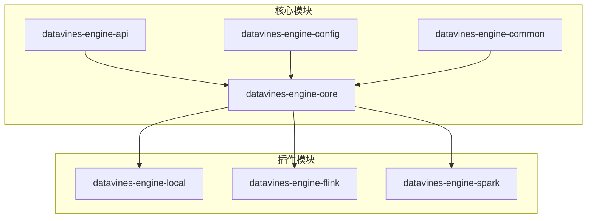
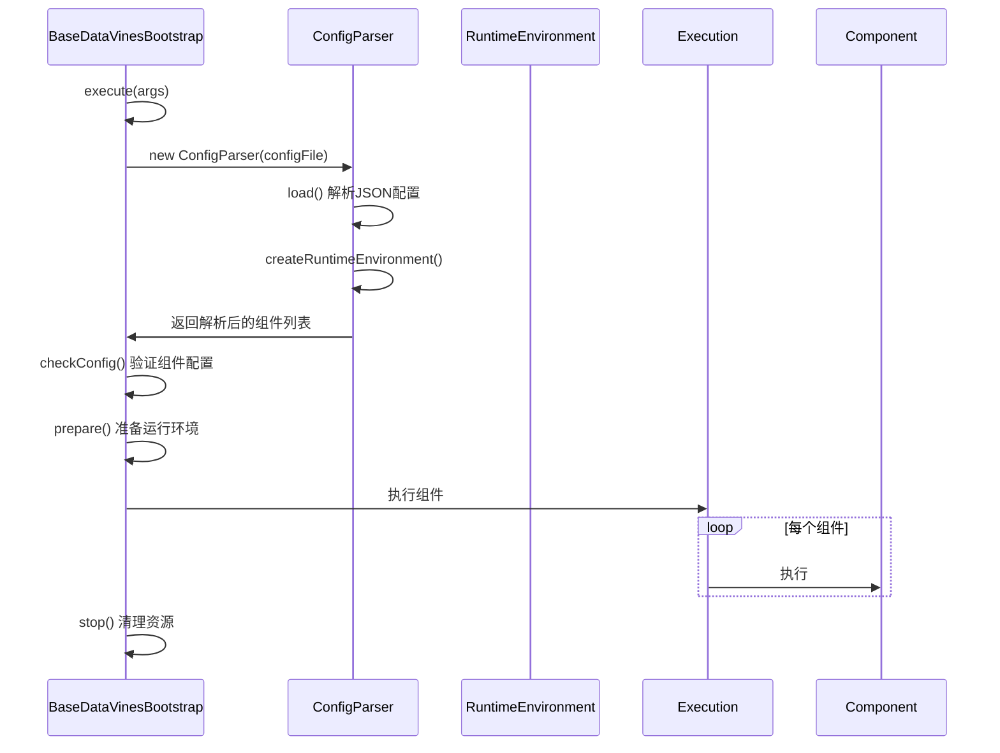
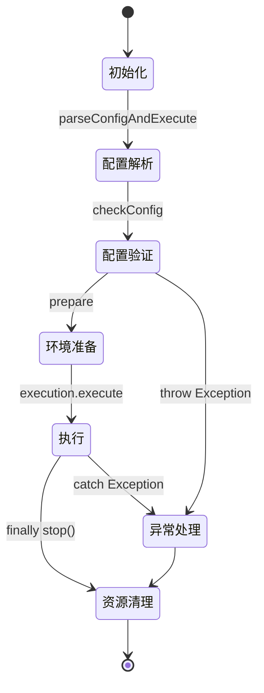
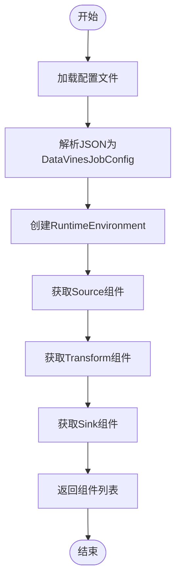
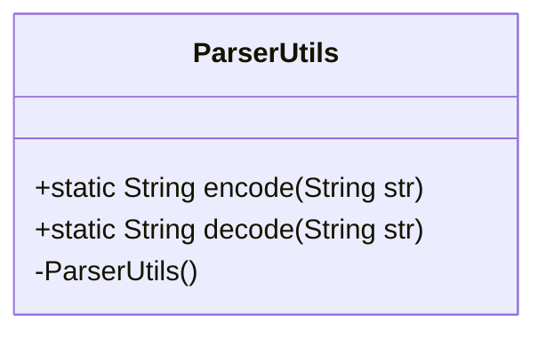
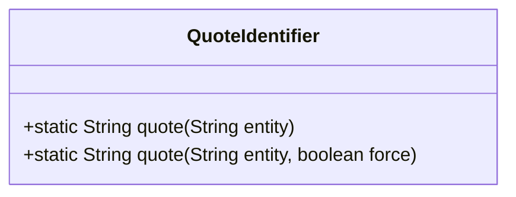
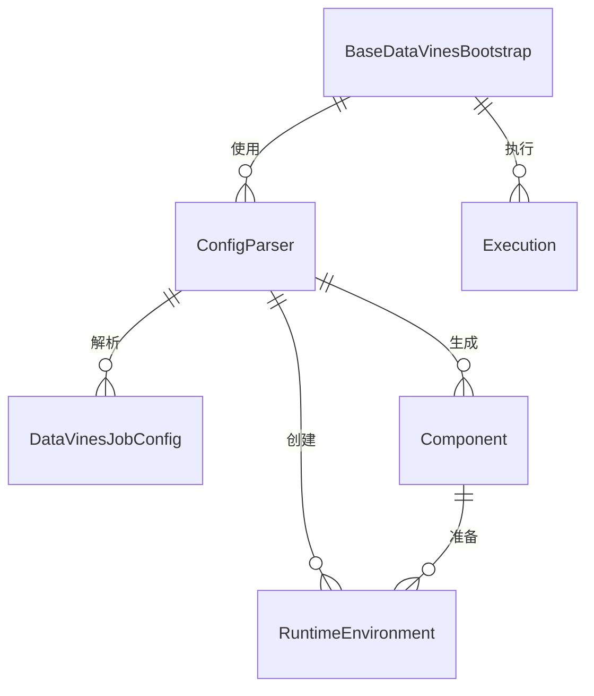

# 核心引擎

<cite>
**本文档中引用的文件**  
- [BaseDataVinesBootstrap.java](file://datavines-engine/datavines-engine-core/src/main/java/io/datavines/engine/core/BaseDataVinesBootstrap.java)
- [ConfigParser.java](file://datavines-engine/datavines-engine-core/src/main/java/io/datavines/engine/core/config/ConfigParser.java)
- [ParserUtils.java](file://datavines-engine/datavines-engine-common/src/main/java/io/datavines/engine/common/utils/ParserUtils.java)
- [QuoteIdentifier.java](file://datavines-engine/datavines-engine-common/src/main/java/io/datavines/engine/common/utils/QuoteIdentifier.java)
- [MetricParserUtils.java](file://datavines-engine/datavines-engine-config/src/main/java/io/datavines/engine/config/MetricParserUtils.java)
- [DataVinesJobConfig.java](file://datavines-common/src/main/java/io/datavines/common/config/DataVinesJobConfig.java)
- [BaseJobConfigurationBuilder.java](file://datavines-engine/datavines-engine-config/src/main/java/io/datavines/engine/config/BaseJobConfigurationBuilder.java)
- [RuntimeEnvironment.java](file://datavines-engine/datavines-engine-api/src/main/java/io/datavines/engine/api/env/RuntimeEnvironment.java)
- [Component.java](file://datavines-engine/datavines-engine-api/src/main/java/io/datavines/engine/api/component/Component.java)
- [LocalDataVinesBootstrap.java](file://datavines-engine/datavines-engine-plugins/datavines-engine-local/datavines-engine-local-core/src/main/java/io/datavines/engine/local/core/LocalDataVinesBootstrap.java)
- [FlinkDataVinesBootstrap.java](file://datavines-engine/datavines-engine-plugins/datavines-engine-flink/datavines-engine-flink-core/src/main/java/io/datavines/engine/flink/core/FlinkDataVinesBootstrap.java)
- [SparkDataVinesBootstrap.java](file://datavines-engine/datavines-engine-plugins/datavines-engine-spark/datavines-engine-spark-core/src/main/java/io/datavines/engine/spark/core/SparkDataVinesBootstrap.java)
</cite>

## 目录
1. [引言](#引言)
2. [项目结构](#项目结构)
3. [核心组件](#核心组件)
4. [架构概述](#架构概述)
5. [详细组件分析](#详细组件分析)
6. [依赖分析](#依赖分析)
7. [性能考虑](#性能考虑)
8. [故障排除指南](#故障排除指南)
9. [结论](#结论)

## 引言
DataVines引擎是数据质量验证系统的核心执行组件，负责解析作业配置、初始化执行环境并协调数据源、转换和接收器组件的执行。本文档详细阐述了`BaseDataVinesBootstrap`作为所有执行引擎基类的生命周期管理机制，`ConfigParser`的配置解析流程，以及`ParserUtils`和`QuoteIdentifier`在SQL语义处理中的作用。

## 项目结构
DataVines引擎模块采用插件化架构，核心组件与具体执行引擎实现分离。主要模块包括：
- `datavines-engine-api`: 定义核心接口
- `datavines-engine-core`: 封装通用执行流程
- `datavines-engine-config`: 负责配置转换
- `datavines-engine-common`: 提供通用工具类
- `datavines-engine-plugins`: 包含不同执行引擎的具体实现

**图源**
- [BaseDataVinesBootstrap.java](file://datavines-engine/datavines-engine-core/src/main/java/io/datavines/engine/core/BaseDataVinesBootstrap.java)
- [ConfigParser.java](file://datavines-engine/datavines-engine-core/src/main/java/io/datavines/engine/core/config/ConfigParser.java)

**节源**
- [BaseDataVinesBootstrap.java](file://datavines-engine/datavines-engine-core/src/main/java/io/datavines/engine/core/BaseDataVinesBootstrap.java)
- [ConfigParser.java](file://datavines-engine/datavines-engine-core/src/main/java/io/datavines/engine/core/config/ConfigParser.java)

## 核心组件
`BaseDataVinesBootstrap`是所有执行引擎的基类，负责管理引擎的初始化、配置解析和生命周期。`ConfigParser`负责将JSON配置文件解析为可执行的组件实例。`ParserUtils`和`QuoteIdentifier`提供字符串编码和SQL标识符处理的通用功能。

**节源**
- [BaseDataVinesBootstrap.java](file://datavines-engine/datavines-engine-core/src/main/java/io/datavines/engine/core/BaseDataVinesBootstrap.java)
- [ConfigParser.java](file://datavines-engine/datavines-engine-core/src/main/java/io/datavines/engine/core/config/ConfigParser.java)
- [ParserUtils.java](file://datavines-engine/datavines-engine-common/src/main/java/io/datavines/engine/common/utils/ParserUtils.java)
- [QuoteIdentifier.java](file://datavines-engine/datavines-engine-common/src/main/java/io/datavines/engine/common/utils/QuoteIdentifier.java)

## 架构概述
DataVines引擎采用分层架构，从配置解析到执行的完整流程如下：

**图源**
- [BaseDataVinesBootstrap.java](file://datavines-engine/datavines-engine-core/src/main/java/io/datavines/engine/core/BaseDataVinesBootstrap.java)
- [ConfigParser.java](file://datavines-engine/datavines-engine-core/src/main/java/io/datavines/engine/core/config/ConfigParser.java)

## 详细组件分析

### BaseDataVinesBootstrap 分析
`BaseDataVinesBootstrap`作为抽象基类，定义了所有执行引擎的通用执行流程和生命周期管理。

#### 生命周期管理

**图源**
- [BaseDataVinesBootstrap.java](file://datavines-engine/datavines-engine-core/src/main/java/io/datavines/engine/core/BaseDataVinesBootstrap.java)

#### 初始化流程
`BaseDataVinesBootstrap`的初始化流程包括配置解析、组件验证和环境准备三个主要阶段。首先通过`ConfigParser`加载配置文件，然后验证所有组件的配置有效性，最后准备运行环境并启动执行。

**节源**
- [BaseDataVinesBootstrap.java](file://datavines-engine/datavines-engine-core/src/main/java/io/datavines/engine/core/BaseDataVinesBootstrap.java)

### ConfigParser 分析
`ConfigParser`负责将JSON格式的作业配置解析为可执行的组件实例。

#### 配置解析流程

**图源**
- [ConfigParser.java](file://datavines-engine/datavines-engine-core/src/main/java/io/datavines/engine/core/config/ConfigParser.java)

#### 配置转换机制
`ConfigParser`使用SPI机制动态加载不同类型的组件。通过`PluginLoader`根据配置中的引擎类型、组件类型等信息创建相应的组件实例，并将配置参数注入到组件中。

**节源**
- [ConfigParser.java](file://datavines-engine/datavines-engine-core/src/main/java/io/datavines/engine/core/config/ConfigParser.java)

### ParserUtils 和 QuoteIdentifier 分析
这两个工具类提供字符串处理和SQL标识符引用的通用功能。

#### ParserUtils 作用
`ParserUtils`提供URL编码和解码功能，用于安全地处理包含特殊字符的字符串。

**图源**
- [ParserUtils.java](file://datavines-engine/datavines-engine-common/src/main/java/io/datavines/engine/common/utils/ParserUtils.java)

#### QuoteIdentifier 作用
`QuoteIdentifier`提供SQL标识符引用功能，确保标识符在SQL语句中的正确性。

**图源**
- [QuoteIdentifier.java](file://datavines-engine/datavines-engine-common/src/main/java/io/datavines/engine/common/utils/QuoteIdentifier.java)

**节源**
- [ParserUtils.java](file://datavines-engine/datavines-engine-common/src/main/java/io/datavines/engine/common/utils/ParserUtils.java)
- [QuoteIdentifier.java](file://datavines-engine/datavines-engine-common/src/main/java/io/datavines/engine/common/utils/QuoteIdentifier.java)

## 依赖分析
DataVines引擎各组件之间的依赖关系清晰，采用接口隔离和依赖注入模式。

**图源**
- [BaseDataVinesBootstrap.java](file://datavines-engine/datavines-engine-core/src/main/java/io/datavines/engine/core/BaseDataVinesBootstrap.java)
- [ConfigParser.java](file://datavines-engine/datavines-engine-core/src/main/java/io/datavines/engine/core/config/ConfigParser.java)

**节源**
- [BaseDataVinesBootstrap.java](file://datavines-engine/datavines-engine-core/src/main/java/io/datavines/engine/core/BaseDataVinesBootstrap.java)
- [ConfigParser.java](file://datavines-engine/datavines-engine-core/src/main/java/io/datavines/engine/core/config/ConfigParser.java)

## 性能考虑
引擎设计考虑了性能优化，包括：
- 配置解析的懒加载机制
- 组件实例的复用
- 异常处理的快速失败模式
- 资源的及时清理

## 故障排除指南
常见问题及解决方案：
- 配置文件路径错误：确保配置文件路径正确且可读
- 组件配置无效：检查组件配置参数是否符合要求
- 运行环境创建失败：确认引擎类型和配置正确
- 执行异常：查看日志定位具体错误

**节源**
- [BaseDataVinesBootstrap.java](file://datavines-engine/datavines-engine-core/src/main/java/io/datavines/engine/core/BaseDataVinesBootstrap.java)
- [ConfigParser.java](file://datavines-engine/datavines-engine-core/src/main/java/io/datavines/engine/core/config/ConfigParser.java)

## 结论
DataVines核心引擎采用模块化和插件化设计，通过`BaseDataVinesBootstrap`统一管理执行流程，`ConfigParser`实现配置解析，以及各种工具类提供辅助功能，形成了一个灵活、可扩展的数据质量验证执行框架。