# datavines-metric模块

<cite>
**本文档引用的文件**   
- [MetricType.java](file://datavines-metric/datavines-metric-api/src/main/java/io/datavines/metric/api/MetricType.java)
- [SqlMetric.java](file://datavines-metric/datavines-metric-api/src/main/java/io/datavines/metric/api/SqlMetric.java)
- [ExpectedValue.java](file://datavines-metric/datavines-metric-api/src/main/java/io/datavines/metric/api/ExpectedValue.java)
- [MetricValidator.java](file://datavines-metric/datavines-metric-api/src/main/java/io/datavines/metric/api/MetricValidator.java)
- [ResultFormula.java](file://datavines-metric/datavines-metric-api/src/main/java/io/datavines/metric/api/ResultFormula.java)
- [MetricExecutionResult.java](file://datavines-metric/datavines-metric-api/src/main/java/io/datavines/metric/api/MetricExecutionResult.java)
- [MetricConstants.java](file://datavines-metric/datavines-metric-api/src/main/java/io/datavines/metric/api/MetricConstants.java)
- [BaseSingleTable.java](file://datavines-metric/datavines-metric-plugins/datavines-metric-base/src/main/java/io/datavines/metric/plugin/base/BaseSingleTable.java)
- [ColumnNull.java](file://datavines-metric/datavines-metric-plugins/datavines-metric-column-null/src/main/java/io/datavines/metric/plugin/ColumnNull.java)
- [TableRowCount.java](file://datavines-metric/datavines-metric-plugins/datavines-metric-table-row-count/src/main/java/io/datavines/metric/plugin/TableRowCount.java)
- [MultiTableAccuracy.java](file://datavines-metric/datavines-metric-plugins/datavines-metric-multi-table-accuracy/src/main/java/io/datavines/metric/plugin/MultiTableAccuracy.java)
- [CustomAggregateSql.java](file://datavines-metric/datavines-metric-plugins/datavines-metric-custom-aggregate-sql/src/main/java/io/datavines/metric/plugin/CustomAggregateSql.java)
- [FixValue.java](file://datavines-metric/datavines-metric-expected-plugins/datavines-metric-expected-fix/src/main/java/io/datavines/metric/expected/plugin/FixValue.java)
- [DailyAvg.java](file://datavines-metric/datavines-metric-expected-plugins/datavines-metric-expected-daily-avg/src/main/java/io/datavines/metric/expected/plugin/DailyAvg.java)
- [Last7DayAvg.java](file://datavines-metric/datavines-metric-expected-plugins/datavines-metric-expected-last7day-avg/src/main/java/io/datavines/metric/expected/plugin/Last7DayAvg.java)
- [Last30DayAvg.java](file://datavines-metric/datavines-metric-expected-plugins/datavines-metric-expected-last30day-avg/src/main/java/io/datavines/metric/expected/plugin/Last30DayAvg.java)
- [WeeklyAvg.java](file://datavines-metric/datavines-metric-expected-plugins/datavines-metric-expected-weekly-avg/src/main/java/io/datavines/metric/expected/plugin/WeeklyAvg.java)
- [MonthlyAvg.java](file://datavines-metric/datavines-metric-expected-plugins/datavines-metric-expected-monthly-avg/src/main/java/io/datavines/metric/expected/plugin/MonthlyAvg.java)
- [TableTotalRows.java](file://datavines-metric/datavines-metric-expected-plugins/datavines-metric-expected-table-rows/src/main/java/io/datavines/metric/expected/plugin/TableTotalRows.java)
- [TargetTableTotalRows.java](file://datavines-metric/datavines-metric-expected-plugins/datavines-metric-expected-target-table-rows/src/main/java/io/datavines/metric/expected/plugin/TargetTableTotalRows.java)
- [None.java](file://datavines-metric/datavines-metric-expected-plugins/datavines-metric-expected-none/src/main/java/io/datavines/metric/expected/plugin/None.java)
- [Count.java](file://datavines-metric/datavines-metric-result-formula-plugins/datavines-metric-result-formula-count/src/main/java/io/datavines/metric/result/formula/Count.java)
- [Diff.java](file://datavines-metric/datavines-metric-result-formula-plugins/datavines-metric-result-formula-diff/src/main/java/io/datavines/metric/result/formula/Diff.java)
- [DiffPercentage.java](file://datavines-metric/datavines-metric-result-formula-plugins/datavines-metric-result-formula-diff-percentage/src/main/java/io/datavines/metric/result/formula/DiffPercentage.java)
- [Percentage.java](file://datavines-metric/datavines-metric-result-formula-plugins/datavines-metric-result-formula-percentage/src/main/java/io/datavines/metric/result/formula/Percentage.java)
- [ActualMinusExpectedDiff.java](file://datavines-metric/datavines-metric-result-formula-plugins/datavines-metric-result-formula-diff-actual-expected/src/main/java/io/datavines/metric/result/formula/ActualMinusExpectedDiff.java)
</cite>

## 目录
1. [引言](#引言)
2. [核心功能概述](#核心功能概述)
3. [内置检查规则](#内置检查规则)
4. [预期值计算策略](#预期值计算策略)
5. [结果验证机制](#结果验证机制)
6. [度量配置体系](#度量配置体系)
7. [单表列检查实现原理](#单表列检查实现原理)
8. [跨表准确性检查实现原理](#跨表准确性检查实现原理)
9. [自定义SQL检查实现原理](#自定义sql检查实现原理)
10. [自定义度量规则开发指南](#自定义度量规则开发指南)
11. [性能优化策略](#性能优化策略)
12. [复杂场景使用示例](#复杂场景使用示例)
13. [结论](#结论)

## 引言

datavines-metric模块是DataVines数据质量框架的核心组件，负责实现数据质量度量的完整生命周期管理。该模块提供了一套完整的数据质量检查体系，包括27种内置检查规则、灵活的预期值计算策略、精确的结果验证机制和可扩展的度量配置功能。通过标准化的接口设计和插件化架构，该模块能够支持单表列检查、跨表准确性检查和自定义SQL检查等多种数据质量验证场景，为大数据环境下的数据质量管理提供了强大的技术支持。

**本节来源**
- [MetricType.java](file://datavines-metric/datavines-metric-api/src/main/java/io/datavines/metric/api/MetricType.java)
- [SqlMetric.java](file://datavines-metric/datavines-metric-api/src/main/java/io/datavines/metric/api/SqlMetric.java)

## 核心功能概述

datavines-metric模块作为数据质量度量的核心引擎，提供了全面的数据质量验证功能。模块采用插件化架构设计，通过定义标准化的接口和抽象基类，实现了高度的可扩展性和灵活性。核心功能包括数据质量检查规则的定义与执行、预期值的计算与比较、检查结果的验证与评分，以及度量配置的管理与解析。

模块通过`SqlMetric`接口定义了度量规则的基本行为，包括获取检查名称、维度、类型、实际值SQL、无效项SQL等。`ExpectedValue`接口则负责预期值的计算策略，支持固定值、历史平均值、目标表行数等多种计算方式。`ResultFormula`接口定义了实际值与预期值的比较公式，如差值、百分比、差异百分比等。`MetricValidator`类提供了结果验证的统一逻辑，通过比较操作符和阈值判断检查结果是否通过。

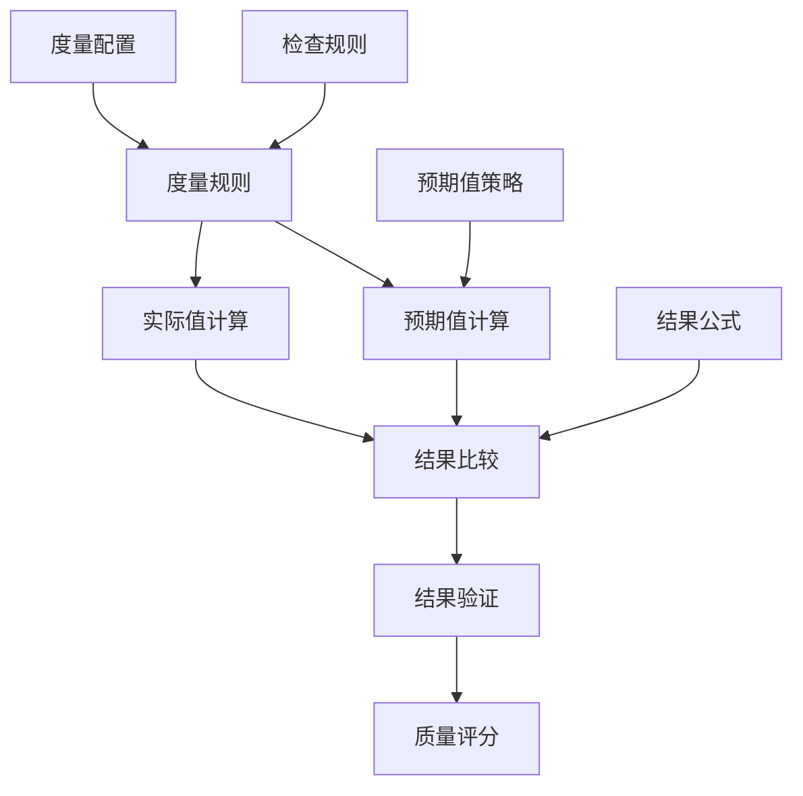

**图表来源**
- [SqlMetric.java](file://datavines-metric/datavines-metric-api/src/main/java/io/datavines/metric/api/SqlMetric.java)
- [ExpectedValue.java](file://datavines-metric/datavines-metric-api/src/main/java/io/datavines/metric/api/ExpectedValue.java)
- [ResultFormula.java](file://datavines-metric/datavines-metric-api/src/main/java/io/datavines/metric/api/ResultFormula.java)
- [MetricValidator.java](file://datavines-metric/datavines-metric-api/src/main/java/io/datavines/metric/api/MetricValidator.java)

**本节来源**
- [SqlMetric.java](file://datavines-metric/datavines-metric-api/src/main/java/io/datavines/metric/api/SqlMetric.java)
- [ExpectedValue.java](file://datavines-metric/datavines-metric-api/src/main/java/io/datavines/metric/api/ExpectedValue.java)
- [ResultFormula.java](file://datavines-metric/datavines-metric-api/src/main/java/io/datavines/metric/api/ResultFormula.java)
- [MetricValidator.java](file://datavines-metric/datavines-metric-api/src/main/java/io/datavines/metric/api/MetricValidator.java)

## 内置检查规则

datavines-metric模块提供了27种内置的数据质量检查规则，覆盖了数据完整性、准确性、一致性、唯一性等多个维度。这些规则按照功能可分为单表列检查、单表行检查、跨表检查和自定义SQL检查四大类。

### 单表列检查规则

单表列检查规则主要针对表中特定列的数据质量进行验证，包括：

- **空值检查** (`column_null`)：检查指定列中是否存在空值
- **非空检查** (`column_not_null`)：检查指定列中是否存在非空值
- **枚举值检查** (`column_in_enums`)：检查指定列的值是否在预定义的枚举值范围内
- **非枚举值检查** (`column_not_in_enums`)：检查指定列的值是否不在预定义的枚举值范围内
- **正则匹配检查** (`column_match_regex`)：检查指定列的值是否符合指定的正则表达式模式
- **正则不匹配检查** (`column_match_not_regex`)：检查指定列的值是否不符合指定的正则表达式模式
- **值范围检查** (`column_value_between`)：检查指定列的值是否在指定的数值范围内
- **长度检查** (`column_length`)：检查指定列的值长度是否符合要求
- **最小长度检查** (`column_min_length`)：检查指定列的值长度是否大于等于最小长度
- **最大长度检查** (`column_max_length`)：检查指定列的值长度是否小于等于最大长度
- **平均长度检查** (`column_avg_length`)：检查指定列的值平均长度是否符合要求

### 单表数值检查规则

单表数值检查规则主要针对数值型列的统计特征进行验证：

- **最小值检查** (`column_min`)：检查指定列的最小值是否符合要求
- **最大值检查** (`column_max`)：检查指定列的最大值是否符合要求
- **平均值检查** (`column_avg`)：检查指定列的平均值是否符合要求
- **总和检查** (`column_sum`)：检查指定列的总和是否符合要求
- **标准差检查** (`column_std_dev`)：检查指定列的标准差是否符合要求
- **方差检查** (`column_variance`)：检查指定列的方差是否符合要求
- **唯一值检查** (`column_unique`)：检查指定列的唯一值数量是否符合要求
- **重复值检查** (`column_duplicate`)：检查指定列的重复值数量是否符合要求
- **不同值检查** (`column_distinct`)：检查指定列的不同值数量是否符合要求

### 表级检查规则

表级检查规则主要针对整个表的数据质量进行验证：

- **表行数检查** (`table_row_count`)：检查表的行数是否符合要求
- **表新鲜度检查** (`table_freshness`)：检查表的数据新鲜度是否符合要求

### 跨表检查规则

跨表检查规则主要针对多个表之间的数据一致性进行验证：

- **跨表准确性检查** (`multi_table_accuracy`)：检查源表和目标表之间的数据准确性
- **跨表值比较检查** (`multi_table_value_comparison`)：比较两个表之间的特定字段值

### 自定义检查规则

自定义检查规则提供了灵活的SQL自定义能力：

- **自定义聚合SQL检查** (`custom_aggregate_sql`)：允许用户自定义聚合SQL进行数据质量检查

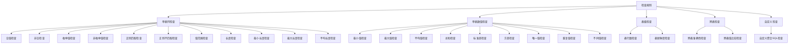

**图表来源**
- [SqlMetric.java](file://datavines-metric/datavines-metric-api/src/main/java/io/datavines/metric/api/SqlMetric.java)
- [ColumnNull.java](file://datavines-metric/datavines-metric-plugins/datavines-metric-column-null/src/main/java/io/datavines/metric/plugin/ColumnNull.java)
- [TableRowCount.java](file://datavines-metric/datavines-metric-plugins/datavines-metric-table-row-count/src/main/java/io/datavines/metric/plugin/TableRowCount.java)

**本节来源**
- [SqlMetric.java](file://datavines-metric/datavines-metric-api/src/main/java/io/datavines/metric/api/SqlMetric.java)
- [ColumnNull.java](file://datavines-metric/datavines-metric-plugins/datavines-metric-column-null/src/main/java/io/datavines/metric/plugin/ColumnNull.java)
- [TableRowCount.java](file://datavines-metric/datavines-metric-plugins/datavines-metric-table-row-count/src/main/java/io/datavines/metric/plugin/TableRowCount.java)

## 预期值计算策略

datavines-metric模块提供了多种预期值计算策略，通过`ExpectedValue`接口实现。这些策略允许用户根据不同的业务场景选择合适的预期值计算方法，确保数据质量检查的灵活性和准确性。

### 预期值策略接口

`ExpectedValue`接口定义了预期值计算的基本方法：

- `getName()`：获取策略名称
- `getZhName()`：获取策略中文名称
- `getKey(Map<String,String> inputParameter)`：获取策略键值
- `getExecuteSql(Map<String,String> inputParameter)`：获取执行SQL
- `getOutputTable(Map<String,String> inputParameter)`：获取输出表名
- `isNeedDefaultDatasource()`：判断是否需要默认数据源
- `prepare(Map<String,String> config)`：准备配置

### 固定值策略

固定值策略(`FixValue`)是最简单的预期值计算方式，用户直接指定一个固定的数值作为预期值。这种策略适用于已知确切目标值的场景，如每日订单量目标为10000单。

```java
public class FixValue implements ExpectedValue {
    @Override
    public String getName() {
        return "fix";
    }
    
    @Override
    public String getZhName() {
        return "固定值";
    }
    
    @Override
    public String getKey(Map<String,String> inputParameter) {
        return "fix_value";
    }
    
    @Override
    public String getExecuteSql(Map<String,String> inputParameter) {
        return "SELECT " + inputParameter.get("fix_value") + " as expected_value";
    }
    
    @Override
    public String getOutputTable(Map<String,String> inputParameter) {
        return "fix_value_table";
    }
    
    @Override
    public boolean isNeedDefaultDatasource() {
        return false;
    }
    
    @Override
    public void prepare(Map<String,String> config) {
        // 准备配置
    }
}
```

### 历史平均值策略

历史平均值策略通过计算历史数据的平均值来确定预期值，包括日平均值、周平均值、月平均值等。这些策略适用于数据波动较小、具有稳定趋势的场景。

#### 日平均值策略

日平均值策略(`DailyAvg`)计算过去N天的平均值作为预期值：

```java
public class DailyAvg implements ExpectedValue {
    @Override
    public String getName() {
        return "daily_avg";
    }
    
    @Override
    public String getZhName() {
        return "日平均值";
    }
    
    @Override
    public String getExecuteSql(Map<String,String> inputParameter) {
        int days = Integer.parseInt(inputParameter.get("days"));
        String dateColumn = inputParameter.get("date_column");
        String valueColumn = inputParameter.get("value_column");
        String table = inputParameter.get("table");
        
        return String.format(
            "SELECT AVG(%s) as expected_value FROM %s WHERE %s >= DATE_SUB(CURDATE(), INTERVAL %d DAY)",
            valueColumn, table, dateColumn, days
        );
    }
}
```

#### 7日平均值策略

7日平均值策略(`Last7DayAvg`)计算过去7天的平均值作为预期值：

```java
public class Last7DayAvg implements ExpectedValue {
    @Override
    public String getName() {
        return "last_7_day_avg";
    }
    
    @Override
    public String getZhName() {
        return "近7日平均值";
    }
    
    @Override
    public String getExecuteSql(Map<String,String> inputParameter) {
        String dateColumn = inputParameter.get("date_column");
        String valueColumn = inputParameter.get("value_column");
        String table = inputParameter.get("table");
        
        return String.format(
            "SELECT AVG(%s) as expected_value FROM %s WHERE %s >= DATE_SUB(CURDATE(), INTERVAL 7 DAY)",
            valueColumn, table, dateColumn
        );
    }
}
```

#### 30日平均值策略

30日平均值策略(`Last30DayAvg`)计算过去30天的平均值作为预期值：

```java
public class Last30DayAvg implements ExpectedValue {
    @Override
    public String getName() {
        return "last_30_day_avg";
    }
    
    @Override
    public String getZhName() {
        return "近30日平均值";
    }
    
    @Override
    public String getExecuteSql(Map<String,String> inputParameter) {
        String dateColumn = inputParameter.get("date_column");
        String valueColumn = inputParameter.get("value_column");
        String table = inputParameter.get("table");
        
        return String.format(
            "SELECT AVG(%s) as expected_value FROM %s WHERE %s >= DATE_SUB(CURDATE(), INTERVAL 30 DAY)",
            valueColumn, table, dateColumn
        );
    }
}
```

### 周期性平均值策略

周期性平均值策略根据特定周期计算平均值，包括周平均值、月平均值等。

#### 周平均值策略

周平均值策略(`WeeklyAvg`)计算上周的平均值作为预期值：

```java
public class WeeklyAvg implements ExpectedValue {
    @Override
    public String getName() {
        return "weekly_avg";
    }
    
    @Override
    public String getZhName() {
        return "周平均值";
    }
    
    @Override
    public String getExecuteSql(Map<String,String> inputParameter) {
        String dateColumn = inputParameter.get("date_column");
        String valueColumn = inputParameter.get("value_column");
        String table = inputParameter.get("table");
        
        return String.format(
            "SELECT AVG(%s) as expected_value FROM %s WHERE YEARWEEK(%s) = YEARWEEK(CURDATE()) - 1",
            valueColumn, table, dateColumn
        );
    }
}
```

#### 月平均值策略

月平均值策略(`MonthlyAvg`)计算上月的平均值作为预期值：

```java
public class MonthlyAvg implements ExpectedValue {
    @Override
    public String getName() {
        return "monthly_avg";
    }
    
    @Override
    public String getZhName() {
        return "月平均值";
    }
    
    @Override
    public String getExecuteSql(Map<String,String> inputParameter) {
        String dateColumn = inputParameter.get("date_column");
        String valueColumn = inputParameter.get("value_column");
        String table = inputParameter.get("table");
        
        return String.format(
            "SELECT AVG(%s) as expected_value FROM %s WHERE YEAR(%s) = YEAR(CURDATE()) AND MONTH(%s) = MONTH(CURDATE()) - 1",
            valueColumn, table, dateColumn, dateColumn
        );
    }
}
```

### 表行数策略

表行数策略通过查询表的实际行数作为预期值，包括当前表行数和目标表行数。

#### 当前表行数策略

当前表行数策略(`TableTotalRows`)查询指定表的总行数作为预期值：

```java
public class TableTotalRows implements ExpectedValue {
    @Override
    public String getName() {
        return "table_rows";
    }
    
    @Override
    public String getZhName() {
        return "表行数";
    }
    
    @Override
    public String getExecuteSql(Map<String,String> inputParameter) {
        String table = inputParameter.get("table");
        return String.format("SELECT COUNT(*) as expected_value FROM %s", table);
    }
}
```

#### 目标表行数策略

目标表行数策略(`TargetTableTotalRows`)查询目标表的总行数作为预期值，常用于数据同步场景：

```java
public class TargetTableTotalRows implements ExpectedValue {
    @Override
    public String getName() {
        return "target_table_rows";
    }
    
    @Override
    public String getZhName() {
        return "目标表行数";
    }
    
    @Override
    public String getExecuteSql(Map<String,String> inputParameter) {
        String targetTable = inputParameter.get("target_table");
        return String.format("SELECT COUNT(*) as expected_value FROM %s", targetTable);
    }
}
```

### 无预期值策略

无预期值策略(`None`)表示不使用预期值，通常用于仅需要计算实际值的场景：

```java
public class None implements ExpectedValue {
    @Override
    public String getName() {
        return "none";
    }
    
    @Override
    public String getZhName() {
        return "无";
    }
    
    @Override
    public String getExecuteSql(Map<String,String> inputParameter) {
        return "SELECT 0 as expected_value";
    }
    
    @Override
    public boolean isNeedDefaultDatasource() {
        return false;
    }
}
```

```mermaid
classDiagram
class ExpectedValue {
<<interface>>
+String getName()
+String getZhName()
+String getKey(Map<String,String> inputParameter)
+String getExecuteSql(Map<String,String> inputParameter)
+String getOutputTable(Map<String,String> inputParameter)
+boolean isNeedDefaultDatasource()
+void prepare(Map<String,String> config)
}
class FixValue {
+String getName()
+String getZhName()
+String getKey(Map<String,String> inputParameter)
+String getExecuteSql(Map<String,String> inputParameter)
+String getOutputTable(Map<String,String> inputParameter)
+boolean isNeedDefaultDatasource()
+void prepare(Map<String,String> config)
}
class DailyAvg {
+String getName()
+String getZhName()
+String getKey(Map<String,String> inputParameter)
+String getExecuteSql(Map<String,String> inputParameter)
+String getOutputTable(Map<String,String> inputParameter)
+boolean isNeedDefaultDatasource()
+void prepare(Map<String,String> config)
}
class Last7DayAvg {
+String getName()
+String getZhName()
+String getKey(Map<String,String> inputParameter)
+String getExecuteSql(Map<String,String> inputParameter)
+String getOutputTable(Map<String,String> inputParameter)
+boolean isNeedDefaultDatasource()
+void prepare(Map<String,String> config)
}
class Last30DayAvg {
+String getName()
+String getZhName()
+String getKey(Map<String,String> inputParameter)
+String getExecuteSql(Map<String,String> inputParameter)
+String getOutputTable(Map<String,String> inputParameter)
+boolean isNeedDefaultDatasource()
+void prepare(Map<String,String> config)
}
class WeeklyAvg {
+String getName()
+String getZhName()
+String getKey(Map<String,String> inputParameter)
+String getExecuteSql(Map<String,String> inputParameter)
+String getOutputTable(Map<String,String> inputParameter)
+boolean isNeedDefaultDatasource()
+void prepare(Map<String,String> config)
}
class MonthlyAvg {
+String getName()
+String getZhName()
+String getKey(Map<String,String> inputParameter)
+String getExecuteSql(Map<String,String> inputParameter)
+String getOutputTable(Map<String,String> inputParameter)
+boolean isNeedDefaultDatasource()
+void prepare(Map<String,String> config)
}
class TableTotalRows {
+String getName()
+String getZhName()
+String getKey(Map<String,String> inputParameter)
+String getExecuteSql(Map<String,String> inputParameter)
+String getOutputTable(Map<String,String> inputParameter)
+boolean isNeedDefaultDatasource()
+void prepare(Map<String,String> config)
}
class TargetTableTotalRows {
+String getName()
+String getZhName()
+String getKey(Map<String,String> inputParameter)
+String getExecuteSql(Map<String,String> inputParameter)
+String getOutputTable(Map<String,String> inputParameter)
+boolean isNeedDefaultDatasource()
+void prepare(Map<String,String> config)
}
class None {
+String getName()
+String getZhName()
+String getKey(Map<String,String> inputParameter)
+String getExecuteSql(Map<String,String> inputParameter)
+String getOutputTable(Map<String,String> inputParameter)
+boolean isNeedDefaultDatasource()
+void prepare(Map<String,String> config)
}
ExpectedValue <|-- FixValue
ExpectedValue <|-- DailyAvg
ExpectedValue <|-- Last7DayAvg
ExpectedValue <|-- Last30DayAvg
ExpectedValue <|-- WeeklyAvg
ExpectedValue <|-- MonthlyAvg
ExpectedValue <|-- TableTotalRows
ExpectedValue <|-- TargetTableTotalRows
ExpectedValue <|-- None
```

**图表来源**
- [ExpectedValue.java](file://datavines-metric/datavines-metric-api/src/main/java/io/datavines/metric/api/ExpectedValue.java)
- [FixValue.java](file://datavines-metric/datavines-metric-expected-plugins/datavines-metric-expected-fix/src/main/java/io/datavines/metric/expected/plugin/FixValue.java)
- [DailyAvg.java](file://datavines-metric/datavines-metric-expected-plugins/datavines-metric-expected-daily-avg/src/main/java/io/datavines/metric/expected/plugin/DailyAvg.java)
- [Last7DayAvg.java](file://datavines-metric/datavines-metric-expected-plugins/datavines-metric-expected-last7day-avg/src/main/java/io/datavines/metric/expected/plugin/Last7DayAvg.java)
- [Last30DayAvg.java](file://datavines-metric/datavines-metric-expected-plugins/datavines-metric-expected-last30day-avg/src/main/java/io/datavines/metric/expected/plugin/Last30DayAvg.java)
- [WeeklyAvg.java](file://datavines-metric/datavines-metric-expected-plugins/datavines-metric-expected-weekly-avg/src/main/java/io/datavines/metric/expected/plugin/WeeklyAvg.java)
- [MonthlyAvg.java](file://datavines-metric/datavines-metric-expected-plugins/datavines-metric-expected-monthly-avg/src/main/java/io/datavines/metric/expected/plugin/MonthlyAvg.java)
- [TableTotalRows.java](file://datavines-metric/datavines-metric-expected-plugins/datavines-metric-expected-table-rows/src/main/java/io/datavines/metric/expected/plugin/TableTotalRows.java)
- [TargetTableTotalRows.java](file://datavines-metric/datavines-metric-expected-plugins/datavines-metric-expected-target-table-rows/src/main/java/io/datavines/metric/expected/plugin/TargetTableTotalRows.java)
- [None.java](file://datavines-metric/datavines-metric-expected-plugins/datavines-metric-expected-none/src/main/java/io/datavines/metric/expected/plugin/None.java)

**本节来源**
- [ExpectedValue.java](file://datavines-metric/datavines-metric-api/src/main/java/io/datavines/metric/api/ExpectedValue.java)
- [FixValue.java](file://datavines-metric/datavines-metric-expected-plugins/datavines-metric-expected-fix/src/main/java/io/datavines/metric/expected/plugin/FixValue.java)
- [DailyAvg.java](file://datavines-metric/datavines-metric-expected-plugins/datavines-metric-expected-daily-avg/src/main/java/io/datavines/metric/expected/plugin/DailyAvg.java)
- [Last7DayAvg.java](file://datavines-metric/datavines-metric-expected-plugins/datavines-metric-expected-last7day-avg/src/main/java/io/datavines/metric/expected/plugin/Last7DayAvg.java)
- [Last30DayAvg.java](file://datavines-metric/datavines-metric-expected-plugins/datavines-metric-expected-last30day-avg/src/main/java/io/datavines/metric/expected/plugin/Last30DayAvg.java)
- [WeeklyAvg.java](file://datavines-metric/datavines-metric-expected-plugins/datavines-metric-expected-weekly-avg/src/main/java/io/datavines/metric/expected/plugin/WeeklyAvg.java)
- [MonthlyAvg.java](file://datavines-metric/datavines-metric-expected-plugins/datavines-metric-expected-monthly-avg/src/main/java/io/datavines/metric/expected/plugin/MonthlyAvg.java)
- [TableTotalRows.java](file://datavines-metric/datavines-metric-expected-plugins/datavines-metric-expected-table-rows/src/main/java/io/datavines/metric/expected/plugin/TableTotalRows.java)
- [TargetTableTotalRows.java](file://datavines-metric/datavines-metric-expected-plugins/datavines-metric-expected-target-table-rows/src/main/java/io/datavines/metric/expected/plugin/TargetTableTotalRows.java)
- [None.java](file://datavines-metric/datavines-metric-expected-plugins/datavines-metric-expected-none/src/main/java/io/datavines/metric/expected/plugin/None.java)

## 结果验证机制

datavines-metric模块通过`MetricValidator`类实现了统一的结果验证机制。该机制负责判断数据质量检查任务的结果是否通过，以及计算数据质量评分。

### 结果验证流程

结果验证流程主要包括以下几个步骤：

1. 获取实际值和预期值
2. 解析比较操作符
3. 应用结果计算公式
4. 比较结果与阈值
5. 判断检查是否通过
6. 计算质量评分

### 结果验证实现

`MetricValidator`类的核心方法是`isSuccess`和`getQualityScore`：

```java
public class MetricValidator {
    /**
     * 判断数据质量任务结果是否通过
     */
    public static boolean isSuccess(MetricExecutionResult executionResult) {
        BigDecimal actualValue = executionResult.getActualValue();
        BigDecimal expectedValue = executionResult.getExpectedValue();

        OperatorType operatorType = OperatorType.of(StringUtils.trim(executionResult.getOperator()));
        ResultFormula resultFormula = PluginLoader.getPluginLoader(ResultFormula.class)
                .getOrCreatePlugin(executionResult.getResultFormula());

        return getCompareResult(operatorType,
                resultFormula.getResult(actualValue, expectedValue),
                executionResult.getThreshold());
    }

    /**
     * 计算数据质量评分
     */
    public static BigDecimal getQualityScore(MetricExecutionResult executionResult, boolean isSuccess) {
        BigDecimal actualValue = executionResult.getActualValue();
        BigDecimal expectedValue = executionResult.getExpectedValue();

        ResultFormula resultFormula = PluginLoader.getPluginLoader(ResultFormula.class)
                .getOrCreatePlugin(executionResult.getResultFormula());
        SqlMetric metric = PluginLoader.getPluginLoader(SqlMetric.class)
                .getOrCreatePlugin(executionResult.getMetricName());

        return resultFormula.getScore(actualValue, expectedValue, isSuccess, metric.getDirectionType());
    }

    /**
     * 比较结果与阈值
     */
    private static boolean getCompareResult(OperatorType operatorType, BigDecimal srcValue, BigDecimal targetValue) {
        if (srcValue == null || targetValue == null) {
            return false;
        }

        switch (operatorType) {
            case EQ:
                return srcValue.compareTo(targetValue) == 0;
            case LT:
                return srcValue.compareTo(targetValue) <= -1;
            case LTE:
                return srcValue.compareTo(targetValue) == 0 || srcValue.compareTo(targetValue) <= -1;
            case GT:
                return srcValue.compareTo(targetValue) >= 1;
            case GTE:
                return srcValue.compareTo(targetValue) == 0 || srcValue.compareTo(targetValue) >= 1;
            case NE:
                return srcValue.compareTo(targetValue) != 0;
            default:
                return true;
        }
    }
}
```

### 比较操作符

模块支持以下比较操作符：

- **等于** (`EQ`)：实际值等于预期值
- **小于** (`LT`)：实际值小于预期值
- **小于等于** (`LTE`)：实际值小于等于预期值
- **大于** (`GT`)：实际值大于预期值
- **大于等于** (`GTE`)：实际值大于等于预期值
- **不等于** (`NE`)：实际值不等于预期值

### 结果计算公式

结果计算公式通过`ResultFormula`接口实现，支持多种计算方式：

- **计数** (`count`)：直接使用实际值
- **差值** (`diff`)：计算实际值与预期值的差值
- **差异百分比** (`diff_percentage`)：计算实际值与预期值的差异百分比
- **百分比** (`percentage`)：计算实际值占预期值的百分比
- **实际值减预期值差值** (`actual_minus_expected_diff`)：计算实际值减去预期值的差值

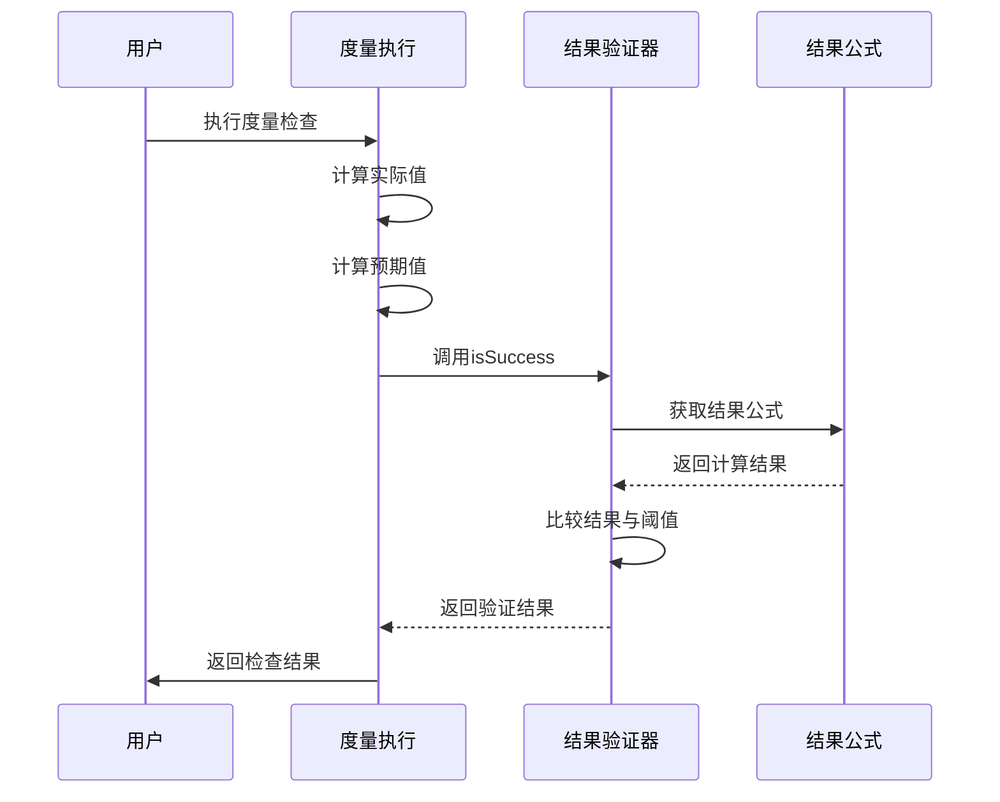

**图表来源**
- [MetricValidator.java](file://datavines-metric/datavines-metric-api/src/main/java/io/datavines/metric/api/MetricValidator.java)
- [ResultFormula.java](file://datavines-metric/datavines-metric-api/src/main/java/io/datavines/metric/api/ResultFormula.java)

**本节来源**
- [MetricValidator.java](file://datavines-metric/datavines-metric-api/src/main/java/io/datavines/metric/api/MetricValidator.java)
- [ResultFormula.java](file://datavines-metric/datavines-metric-api/src/main/java/io/datavines/metric/api/ResultFormula.java)

## 度量配置体系

datavines-metric模块通过`ConfigItem`类和相关配置机制实现了灵活的度量配置体系。该体系允许用户为不同的度量规则配置必要的参数，确保检查的准确性和可定制性。

### 配置项定义

`ConfigItem`类定义了配置项的基本属性：

- `key`：配置项的键名
- `name`：配置项的显示名称
- `description`：配置项的描述
- `defaultValue`：配置项的默认值
- `required`：是否为必填项

### 配置管理

度量规则通过`getConfigMap`方法返回配置项映射，定义了该规则所需的全部配置参数。例如，`TableRowCount`规则的配置管理：

```java
@Override
public Map<String, ConfigItem> getConfigMap() {
    configMap.put("table",new ConfigItem("table", "表名", "table", true));
    return configMap;
}
```

### 配置验证

模块通过`ConfigChecker`类实现了配置验证功能，确保用户提供的配置参数符合要求：

```java
@Override
public CheckResult validateConfig(Map<String, Object> config) {
    return ConfigChecker.checkConfig(config, requiredOptions);
}
```

### 配置准备

`prepare`方法用于在执行度量检查前准备和处理配置参数：

```java
@Override
public void prepare(Map<String, String> config) {
    // 如果过滤条件不为空，则添加到过滤器列表
    if (config.containsKey("filter") && StringUtils.isNotBlank(config.get("filter"))) {
        filters.add(config.get("filter"));
    }
    
    addFiltersIntoInvalidateItemsSql();
}
```

### 配置示例

以下是几种典型度量规则的配置示例：

#### 表行数检查配置

```json
{
  "table": "orders",
  "filter": "order_date >= '2023-01-01'"
}
```

#### 空值检查配置

```json
{
  "table": "users",
  "column": "email",
  "filter": "status = 'active'"
}
```

#### 跨表准确性检查配置

```json
{
  "table": "source_orders",
  "table2": "target_orders",
  "filter": "order_date >= '2023-01-01'",
  "filter2": "order_date >= '2023-01-01'",
  "on_clause": "source_orders.order_id = target_orders.order_id",
  "where_clause": "source_orders.amount != target_orders.amount"
}
```

#### 自定义聚合SQL检查配置

```json
{
  "table": "sales",
  "actual_aggregate_sql": "SELECT SUM(amount) as actual_value FROM sales WHERE sale_date >= '2023-01-01'"
}
```

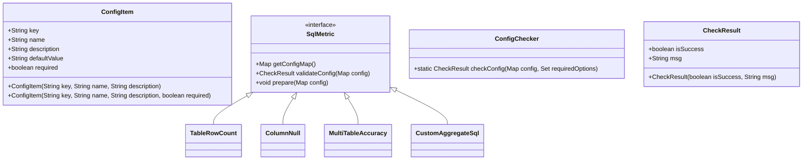

**图表来源**
- [ConfigItem.java](file://datavines-metric/datavines-metric-api/src/main/java/io/datavines/metric/api/ConfigItem.java)
- [SqlMetric.java](file://datavines-metric/datavines-metric-api/src/main/java/io/datavines/metric/api/SqlMetric.java)
- [ConfigChecker.java](file://datavines-common/src/main/java/io/datavines/common/config/ConfigChecker.java)
- [CheckResult.java](file://datavines-common/src/main/java/io/datavines/common/config/CheckResult.java)
- [TableRowCount.java](file://datavines-metric/datavines-metric-plugins/datavines-metric-table-row-count/src/main/java/io/datavines/metric/plugin/TableRowCount.java)
- [ColumnNull.java](file://datavines-metric/datavines-metric-plugins/datavines-metric-column-null/src/main/java/io/datavines/metric/plugin/ColumnNull.java)
- [MultiTableAccuracy.java](file://datavines-metric/datavines-metric-plugins/datavines-metric-multi-table-accuracy/src/main/java/io/datavines/metric/plugin/MultiTableAccuracy.java)
- [CustomAggregateSql.java](file://datavines-metric/datavines-metric-plugins/datavines-metric-custom-aggregate-sql/src/main/java/io/datavines/metric/plugin/CustomAggregateSql.java)

**本节来源**
- [ConfigItem.java](file://datavines-metric/datavines-metric-api/src/main/java/io/datavines/metric/api/ConfigItem.java)
- [SqlMetric.java](file://datavines-metric/datavines-metric-api/src/main/java/io/datavines/metric/api/SqlMetric.java)
- [ConfigChecker.java](file://datavines-common/src/main/java/io/datavines/common/config/ConfigChecker.java)
- [CheckResult.java](file://datavines-common/src/main/java/io/datavines/common/config/CheckResult.java)
- [TableRowCount.java](file://datavines-metric/datavines-metric-plugins/datavines-metric-table-row-count/src/main/java/io/datavines/metric/plugin/TableRowCount.java)
- [ColumnNull.java](file://datavines-metric/datavines-metric-plugins/datavines-metric-column-null/src/main/java/io/datavines/metric/plugin/ColumnNull.java)
- [MultiTableAccuracy.java](file://datavines-metric/datavines-metric-plugins/datavines-metric-multi-table-accuracy/src/main/java/io/datavines/metric/plugin/MultiTableAccuracy.java)
- [CustomAggregateSql.java](file://datavines-metric/datavines-metric-plugins/datavines-metric-custom-aggregate-sql/src/main/java/io/datavines/metric/plugin/CustomAggregateSql.java)

## 单表列检查实现原理

单表列检查是datavines-metric模块中最基础的检查类型，主要针对单个表中特定列的数据质量进行验证。该检查类型通过继承`BaseSingleTableColumnNotUseView`基类实现，提供了统一的实现框架。

### 基类设计

`BaseSingleTableColumnNotUseView`类继承自`BaseSingleTable`，为单表列检查提供了基础功能：

```java
public abstract class BaseSingleTableColumnNotUseView extends BaseSingleTable {
    protected StringBuilder invalidateItemsSql = new StringBuilder("select * from ${table}");
    
    protected List<String> filters = new ArrayList<>();
    
    protected HashMap<String,ConfigItem> configMap = new HashMap<>();
    
    protected Set<String> requiredOptions = new HashSet<>();
    
    public BaseSingleTableColumnNotUseView() {
        super();
        configMap.put("column",new ConfigItem("column", "列名", "column"));
        requiredOptions.add("column");
    }
    
    @Override
    public void prepare(Map<String, String> config) {
        super.prepare(config);
    }
}
```

### 空值检查实现

以`ColumnNull`为例，展示单表列检查的具体实现：

```java
public class ColumnNull extends BaseSingleTableColumnNotUseView {
    public ColumnNull(){
        super();
    }
    
    @Override
    public String getName() {
        return "column_null";
    }
    
    @Override
    public String getZhName() {
        return "空值检查";
    }
    
    @Override
    public MetricDimension getDimension() {
        return MetricDimension.COMPLETENESS;
    }
    
    @Override
    public MetricType getType() {
        return MetricType.SINGLE_TABLE;
    }
    
    @Override
    public boolean isInvalidateItemsCanOutput() {
        return true;
    }
    
    @Override
    public void prepare(Map<String, String> config) {
        if (config.containsKey("column")) {
            filters.add(getConnectorFactory(config).getMetricScript().columnIsNull());
        }
        super.prepare(config);
    }
    
    @Override
    public List<DataVinesDataType> suitableType() {
        return Arrays.asList(DataVinesDataType.NUMERIC_TYPE, DataVinesDataType.STRING_TYPE, DataVinesDataType.DATE_TIME_TYPE);
    }
    
    @Override
    public MetricDirectionType getDirectionType() {
        return MetricDirectionType.NEGATIVE;
    }
}
```

### 实现原理分析

单表列检查的实现原理主要包括以下几个方面：

1. **SQL生成**：通过模板化SQL语句，动态生成实际执行的SQL
2. **过滤条件**：支持用户自定义过滤条件，提高检查的灵活性
3. **连接器适配**：通过`ConnectorFactory`适配不同数据源的SQL语法差异
4. **结果处理**：统一处理检查结果，确保结果格式的一致性

### 执行流程

单表列检查的执行流程如下：

1. 用户配置检查参数（表名、列名、过滤条件等）
2. 系统验证配置参数的合法性
3. 准备SQL执行环境
4. 生成无效项查询SQL
5. 执行无效项查询，获取不符合条件的数据
6. 生成实际值查询SQL
7. 执行实际值查询，获取检查结果
8. 计算预期值
9. 验证检查结果
10. 返回最终检查报告

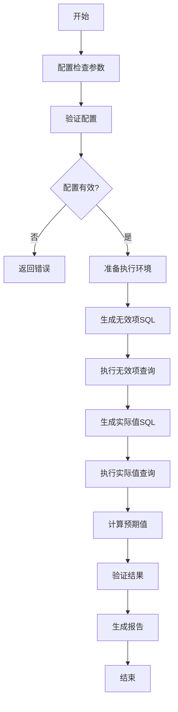

**图表来源**
- [BaseSingleTable.java](file://datavines-metric/datavines-metric-plugins/datavines-metric-base/src/main/java/io/datavines/metric/plugin/base/BaseSingleTable.java)
- [BaseSingleTableColumnNotUseView.java](file://datavines-metric/datavines-metric-plugins/datavines-metric-base/src/main/java/io/datavines/metric/plugin/base/BaseSingleTableColumnNotUseView.java)
- [ColumnNull.java](file://datavines-metric/datavines-metric-plugins/datavines-metric-column-null/src/main/java/io/datavines/metric/plugin/ColumnNull.java)

**本节来源**
- [BaseSingleTable.java](file://datavines-metric/datavines-metric-plugins/datavines-metric-base/src/main/java/io/datavines/metric/plugin/base/BaseSingleTable.java)
- [BaseSingleTableColumnNotUseView.java](file://datavines-metric/datavines-metric-plugins/datavines-metric-base/src/main/java/io/datavines/metric/plugin/base/BaseSingleTableColumnNotUseView.java)
- [ColumnNull.java](file://datavines-metric/datavines-metric-plugins/datavines-metric-column-null/src/main/java/io/datavines/metric/plugin/ColumnNull.java)

## 跨表准确性检查实现原理

跨表准确性检查是datavines-metric模块中用于验证多个表之间数据一致性的高级检查类型。该检查类型通过`MultiTableAccuracy`类实现，支持源表和目标表之间的数据对比。

### 接口定义

`MultiTableAccuracy`类实现了`SqlMetric`接口，定义了跨表准确性检查的基本行为：

```java
public class MultiTableAccuracy implements SqlMetric {
    private final StringBuilder sourceTableSql = new StringBuilder("SELECT * FROM ${table}");
    private final StringBuilder targetTableSql = new StringBuilder("SELECT * FROM ${table2}");
    private final StringBuilder invalidateItemsSql = new StringBuilder("SELECT ${table_alias_columns}, ${table2_alias_columns} FROM ");
    
    @Override
    public String getName() {
        return "multi_table_accuracy";
    }
    
    @Override
    public String getZhName() {
        return "跨表准确性检查";
    }
    
    @Override
    public MetricDimension getDimension() {
        return MetricDimension.ACCURACY;
    }
    
    @Override
    public MetricType getType() {
        return MetricType.MULTI_TABLE_ACCURACY;
    }
    
    @Override
    public boolean isInvalidateItemsCanOutput() {
        return true;
    }
}
```

### SQL生成机制

跨表准确性检查的核心是动态SQL生成机制，通过模板化方式构建复杂的JOIN查询：

```java
@Override
public void prepare(Map<String, String> config) {
    if (config.containsKey("filter") && StringUtils.isNotBlank(config.get("filter"))) {
        sourceTableSql.append(" WHERE (${filter}) ");
    }
    
    if (config.containsKey("filter2") && StringUtils.isNotBlank(config.get("filter2"))) {
        targetTableSql.append(" WHERE (${filter2}) ");
    }
    
    invalidateItemsSql
            .append("(").append(sourceTableSql).append(")").append(" ${table_alias} ")
            .append(" LEFT JOIN ")
            .append("(").append(targetTableSql).append(")").append(" ${table2_alias} ")
            .append("ON ${on_clause} WHERE ${where_clause}");
}
```

### 执行流程

跨表准确性检查的执行流程如下：

1. 用户配置源表和目标表信息
2. 配置JOIN条件和过滤条件
3. 生成源表查询SQL
4. 生成目标表查询SQL
5. 构建JOIN查询SQL
6. 执行JOIN查询，获取不匹配的数据
7. 统计不匹配数据的数量
8. 计算预期值
9. 验证检查结果
10. 返回最终检查报告

### 配置参数

跨表准确性检查支持以下配置参数：

- `table`：源表名
- `table2`：目标表名
- `filter`：源表过滤条件
- `filter2`：目标表过滤条件
- `on_clause`：JOIN条件
- `where_clause`：结果过滤条件
- `table_alias`：源表别名
- `table2_alias`：目标表别名

### 实际应用示例

假设需要检查订单表和发货表之间的数据一致性：

```json
{
  "table": "orders",
  "table2": "shipments",
  "filter": "order_date >= '2023-01-01'",
  "filter2": "shipment_date >= '2023-01-01'",
  "on_clause": "orders.order_id = shipments.order_id",
  "where_clause": "orders.amount != shipments.amount OR orders.customer_id != shipments.customer_id"
}
```

该配置将检查2023年1月1日之后的订单和发货记录，找出金额或客户ID不匹配的记录。

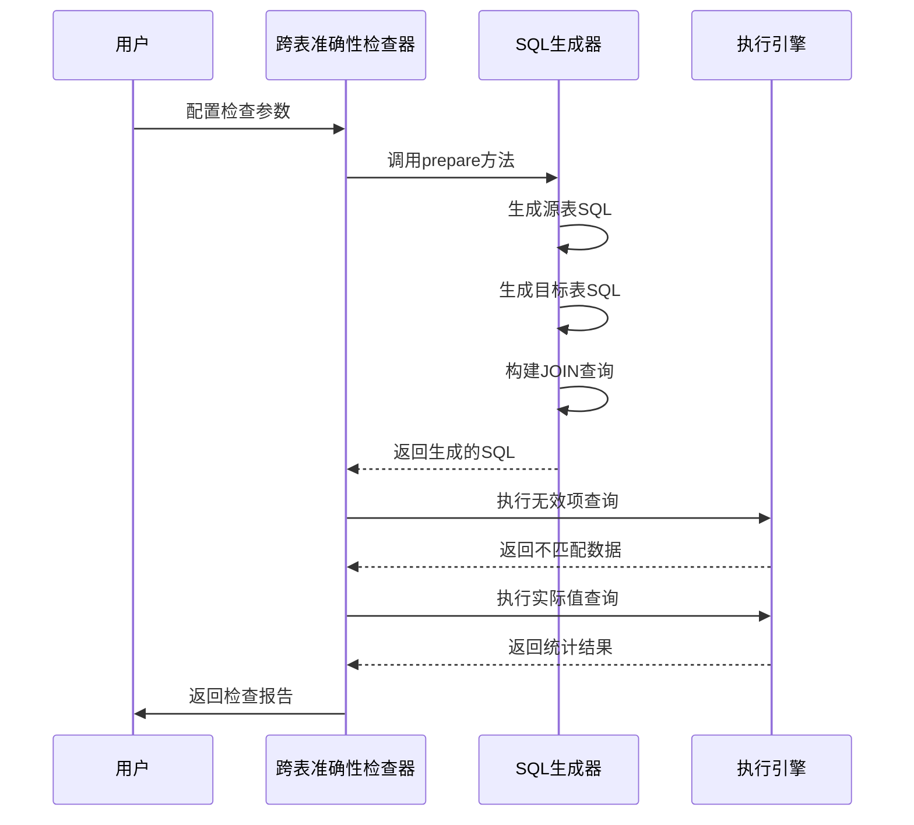

**图表来源**
- [MultiTableAccuracy.java](file://datavines-metric/datavines-metric-plugins/datavines-metric-multi-table-accuracy/src/main/java/io/datavines/metric/plugin/MultiTableAccuracy.java)
- [MetricType.java](file://datavines-metric/datavines-metric-api/src/main/java/io/datavines/metric/api/MetricType.java)

**本节来源**
- [MultiTableAccuracy.java](file://datavines-metric/datavines-metric-plugins/datavines-metric-multi-table-accuracy/src/main/java/io/datavines/metric/plugin/MultiTableAccuracy.java)

## 自定义SQL检查实现原理

自定义SQL检查是datavines-metric模块中提供最高灵活性的检查类型，允许用户通过自定义SQL语句实现复杂的质量检查逻辑。该检查类型通过`CustomAggregateSql`类实现。

### 接口实现

`CustomAggregateSql`类实现了`SqlMetric`接口，提供了自定义SQL检查的核心功能：

```java
public class CustomAggregateSql implements SqlMetric {
    private final Set<String> requiredOptions = new HashSet<>();
    private final HashMap<String,ConfigItem> configMap = new HashMap<>();
    
    public CustomAggregateSql() {
        configMap.put("actual_aggregate_sql", new ConfigItem("actual_aggregate_sql","自定义聚合SQL","actual_aggregate_sql"));
        requiredOptions.add("actual_aggregate_sql");
    }
    
    @Override
    public String getName() {
        return "custom_aggregate_sql";
    }
    
    @Override
    public String getZhName() {
        return "自定义聚合SQL";
    }
    
    @Override
    public MetricDimension getDimension() {
        return MetricDimension.ACCURACY;
    }
    
    @Override
    public MetricType getType() {
        return MetricType.SINGLE_TABLE;
    }
    
    @Override
    public boolean isInvalidateItemsCanOutput() {
        return false;
    }
    
    @Override
    public CheckResult validateConfig(Map<String, Object> config) {
        return ConfigChecker.checkConfig(config, requiredOptions);
    }
    
    @Override
    public Map<String, ConfigItem> getConfigMap() {
        return configMap;
    }
}
```

### SQL处理机制

自定义SQL检查的核心是SQL处理机制，能够正确处理用户提供的自定义SQL语句：

```java
@Override
public ExecuteSql getActualValue(Map<String,String> inputParameter) {
    inputParameter.put(ACTUAL_TABLE, inputParameter.get(TABLE));
    String actualAggregateSql = inputParameter.get(ACTUAL_AGGREGATE_SQL);
    if (StringUtils.isNotEmpty(actualAggregateSql)) {
        if (actualAggregateSql.contains("as actual_value")) {
            actualAggregateSql = actualAggregateSql.replace("as actual_value", "as actual_value_" + inputParameter.get(METRIC_UNIQUE_KEY));
        } else if (actualAggregateSql.contains("AS actual_value")) {
            actualAggregateSql = actualAggregateSql.replace("AS actual_value", "as actual_value_" + inputParameter.get(METRIC_UNIQUE_KEY));
        }
    }
    return new ExecuteSql(actualAggregateSql, inputParameter.get(TABLE));
}
```

### 实现特点

自定义SQL检查具有以下特点：

1. **高度灵活**：用户可以编写任意复杂的SQL语句
2. **参数化支持**：支持模板变量替换，如`${table}`、`${column}`等
3. **结果标准化**：自动处理结果列名，确保与系统兼容
4. **安全性考虑**：对SQL语句进行基本的安全检查

### 使用场景

自定义SQL检查适用于以下场景：

- 复杂的业务逻辑验证
- 多表关联查询检查
- 特殊的数据质量规则
- 临时性的数据探查

### 配置示例

```json
{
  "table": "sales",
  "actual_aggregate_sql": "SELECT SUM(amount) as actual_value FROM sales WHERE sale_date >= '2023-01-01' AND region = 'North'"
}
```

该配置将计算2023年1月1日之后北方地区的销售总额。

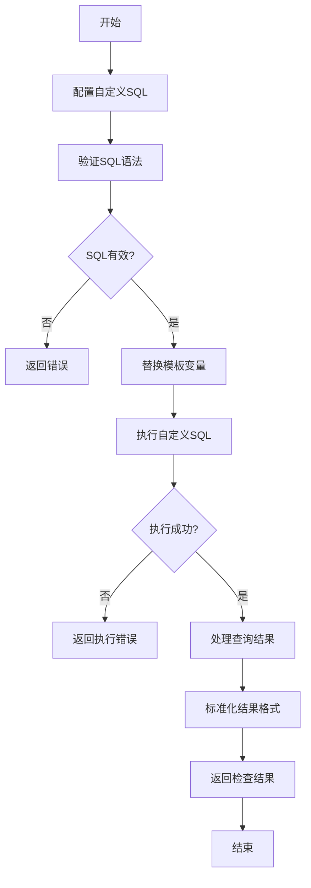

**图表来源**
- [CustomAggregateSql.java](file://datavines-metric/datavines-metric-plugins/datavines-metric-custom-aggregate-sql/src/main/java/io/datavines/metric/plugin/CustomAggregateSql.java)
- [SqlMetric.java](file://datavines-metric/datavines-metric-api/src/main/java/io/datavines/metric/api/SqlMetric.java)

**本节来源**
- [CustomAggregateSql.java](file://datavines-metric/datavines-metric-plugins/datavines-metric-custom-aggregate-sql/src/main/java/io/datavines/metric/plugin/CustomAggregateSql.java)

## 自定义度量规则开发指南

datavines-metric模块提供了强大的扩展能力，允许开发者创建自定义的度量规则。本指南将详细介绍如何开发和注册自定义度量规则。

### 开发环境准备

在开始开发自定义度量规则之前，需要准备以下环境：

1. JDK 8或更高版本
2. Maven 3.6或更高版本
3. IDE（如IntelliJ IDEA或Eclipse）
4. datavines-metric模块源码

### 创建自定义规则类

自定义度量规则需要实现`SqlMetric`接口或继承现有的基类。以下是一个自定义规则的示例：

```java
package io.datavines.metric.plugin;

import io.datavines.common.entity.ExecuteSql;
import io.datavines.common.enums.DataVinesDataType;
import io.datavines.metric.api.*;
import io.datavines.metric.plugin.base.BaseSingleTable;

import java.util.*;

public class CustomDataQualityRule extends BaseSingleTable {
    public CustomDataQualityRule() {
        super();
        // 添加自定义配置项
        configMap.put("threshold", new ConfigItem("threshold", "阈值", "threshold", true));
        configMap.put("pattern", new ConfigItem("pattern", "匹配模式", "pattern"));
        
        requiredOptions.add("threshold");
    }
    
    @Override
    public String getName() {
        return "custom_data_quality_rule";
    }
    
    @Override
    public String getZhName() {
        return "自定义数据质量规则";
    }
    
    @Override
    public MetricDimension getDimension() {
        return MetricDimension.CONSISTENCY;
    }
    
    @Override
    public MetricType getType() {
        return MetricType.SINGLE_TABLE;
    }
    
    @Override
    public boolean isInvalidateItemsCanOutput() {
        return true;
    }
    
    @Override
    public void prepare(Map<String, String> config) {
        super.prepare(config);
        
        // 根据配置准备SQL
        String pattern = config.get("pattern");
        if (pattern != null && !pattern.isEmpty()) {
            filters.add("column_name LIKE '%" + pattern + "%'");
        }
    }
    
    @Override
    public ExecuteSql getInvalidateItems(Map<String, String> inputParameter) {
        String uniqueKey = inputParameter.get("metric_unique_key");
        ExecuteSql executeSql = new ExecuteSql();
        executeSql.setResultTable("invalidate_items_" + uniqueKey);
        executeSql.setSql("SELECT * FROM ${table} WHERE " + String.join(" AND ", filters));
        executeSql.setErrorOutput(true);
        return executeSql;
    }
    
    @Override
    public ExecuteSql getActualValue(Map<String, String> inputParameter) {
        String uniqueKey = inputParameter.get("metric_unique_key");
        ExecuteSql executeSql = new ExecuteSql();
        executeSql.setResultTable("actual_value_" + uniqueKey);
        executeSql.setSql("SELECT COUNT(*) as actual_value_" + uniqueKey + " FROM ${table} WHERE " + String.join(" AND ", filters));
        executeSql.setErrorOutput(false);
        return executeSql;
    }
    
    @Override
    public List<DataVinesDataType> suitableType() {
        return Collections.singletonList(DataVinesDataType.STRING_TYPE);
    }
    
    @Override
    public MetricDirectionType getDirectionType() {
        return MetricDirectionType.POSITIVE;
    }
}
```

### 注册自定义规则

自定义规则需要通过SPI机制注册，具体步骤如下：

1. 在`src/main/resources/META-INF/services/`目录下创建文件`io.datavines.metric.api.SqlMetric`
2. 在文件中添加自定义规则类的全限定名

```
io.datavines.metric.plugin.CustomDataQualityRule
```

### 打包和部署

将自定义规则打包成JAR文件，并部署到datavines的插件目录：

```bash
# 编译打包
mvn clean package

# 复制到插件目录
cp target/datavines-metric-custom-rule-1.0.0.jar $DATAVINES_HOME/plugins/metric/
```

### 配置和使用

在datavines配置文件中添加自定义规则的配置：

```yaml
metric:
  rules:
    - name: custom_data_quality_rule
      zh-name: 自定义数据质量规则
      dimension: CONSISTENCY
      type: SINGLE_TABLE
```

### 最佳实践

开发自定义度量规则时，建议遵循以下最佳实践：

1. **继承合适的基类**：根据规则类型选择合适的基类继承
2. **提供清晰的配置项**：为用户提供明确的配置参数
3. **实现完整的接口方法**：确保所有必需的方法都已实现
4. **处理异常情况**：妥善处理可能的异常和错误
5. **编写单元测试**：为自定义规则编写充分的测试用例
6. **文档化**：提供详细的使用文档和示例

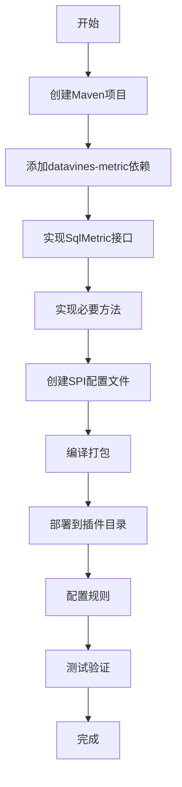

**图表来源**
- [SqlMetric.java](file://datavines-metric/datavines-metric-api/src/main/java/io/datavines/metric/api/SqlMetric.java)
- [BaseSingleTable.java](file://datavines-metric/datavines-metric-plugins/datavines-metric-base/src/main/java/io/datavines/metric/plugin/base/BaseSingleTable.java)

**本节来源**
- [SqlMetric.java](file://datavines-metric/datavines-metric-api/src/main/java/io/datavines/metric/api/SqlMetric.java)
- [BaseSingleTable.java](file://datavines-metric/datavines-metric-plugins/datavines-metric-base/src/main/java/io/datavines/metric/plugin/base/BaseSingleTable.java)

## 性能优化策略

datavines-metric模块在设计时充分考虑了性能优化，通过多种策略确保在大规模数据场景下的高效执行。

### SQL优化

模块通过以下方式优化SQL执行性能：

1. **索引利用**：在生成SQL时考虑索引的使用
2. **查询简化**：避免不必要的子查询和复杂JOIN
3. **分页处理**：对大数据集采用分页查询
4. **缓存机制**：缓存常用的查询结果

### 执行计划优化

```java
@Override
public ExecuteSql getActualValue(Map<String,String> inputParameter) {
    String uniqueKey = inputParameter.get(METRIC_UNIQUE_KEY);
    ExecuteSql executeSql = new ExecuteSql();
    executeSql.setResultTable("invalidate_count_" + uniqueKey);
    
    // 优化：直接使用COUNT(*)而不是SELECT *
    String actualValueSql = "select count(1) as actual_value_" + uniqueKey + " from ${invalidate_items_table}";
    executeSql.setSql(actualValueSql);
    executeSql.setErrorOutput(false);
    return executeSql;
}
```

### 并行执行

模块支持并行执行多个度量检查，提高整体执行效率：

```java
// 伪代码：并行执行多个检查
List<CompletableFuture<MetricExecutionResult>> futures = checks.stream()
    .map(check -> CompletableFuture.supplyAsync(() -> executeCheck(check)))
    .collect(Collectors.toList());

List<MetricExecutionResult> results = futures.stream()
    .map(CompletableFuture::join)
    .collect(Collectors.toList());
```

### 资源管理

通过合理的资源管理策略控制执行资源的使用：

1. **连接池**：使用数据库连接池管理连接
2. **线程池**：使用线程池控制并发度
3. **内存管理**：合理设置JVM参数和内存使用限制

### 缓存策略

实现多层次的缓存策略：

1. **配置缓存**：缓存度量规则配置
2. **元数据缓存**：缓存表结构信息
3. **结果缓存**：缓存历史检查结果

### 监控和调优

提供完善的监控和调优机制：

1. **执行时间监控**：记录每个检查的执行时间
2. **资源使用监控**：监控CPU、内存、网络等资源使用情况
3. **性能分析**：提供性能分析工具和报告

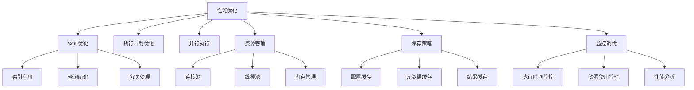

**图表来源**
- [TableRowCount.java](file://datavines-metric/datavines-metric-plugins/datavines-metric-table-row-count/src/main/java/io/datavines/metric/plugin/TableRowCount.java)
- [BaseSingleTable.java](file://datavines-metric/datavines-metric-plugins/datavines-metric-base/src/main/java/io/datavines/metric/plugin/base/BaseSingleTable.java)

**本节来源**
- [TableRowCount.java](file://datavines-metric/datavines-metric-plugins/datavines-metric-table-row-count/src/main/java/io/datavines/metric/plugin/TableRowCount.java)
- [BaseSingleTable.java](file://datavines-metric/datavines-metric-plugins/datavines-metric-base/src/main/java/io/datavines/metric/plugin/base/BaseSingleTable.java)

## 复杂场景使用示例

本节提供几个复杂场景下的使用示例，展示datavines-metric模块在实际业务中的应用。

### 示例1：电商订单数据质量检查

场景描述：电商平台需要确保订单数据的完整性和准确性。

```json
{
  "checks": [
    {
      "rule": "table_row_count",
      "config": {
        "table": "orders",
        "filter": "order_date = CURRENT_DATE"
      },
      "expected": {
        "type": "last_7_day_avg",
        "days": 7
      },
      "operator": "GTE",
      "threshold": 0.9
    },
    {
      "rule": "column_not_null",
      "config": {
        "table": "orders",
        "column": "order_id"
      },
      "expected": {
        "type": "none"
      },
      "operator": "EQ",
      "threshold": 0
    },
    {
      "rule": "column_value_between",
      "config": {
        "table": "orders",
        "column": "amount",
        "min_value": 0,
        "max_value": 1000000
      },
      "expected": {
        "type": "none"
      },
      "operator": "EQ",
      "threshold": 0
    },
    {
      "rule": "multi_table_accuracy",
      "config": {
        "table": "orders",
        "table2": "payments",
        "on_clause": "orders.order_id = payments.order_id",
        "where_clause": "orders.amount != payments.amount"
      },
      "expected": {
        "type": "none"
      },
      "operator": "EQ",
      "threshold": 0
    }
  ]
}
```

### 示例2：金融交易数据一致性检查

场景描述：金融机构需要确保交易数据在不同系统间的一致性。

```json
{
  "checks": [
    {
      "rule": "multi_table_value_comparison",
      "config": {
        "table": "trading_system.transactions",
        "table2": "settlement_system.transactions",
        "key_columns": "transaction_id",
        "value_columns": "amount,currency,timestamp"
      },
      "expected": {
        "type": "none"
      },
      "operator": "EQ",
      "threshold": 0
    },
    {
      "rule": "custom_aggregate_sql",
      "config": {
        "actual_aggregate_sql": "SELECT SUM(amount) as actual_value FROM trading_system.daily_summary WHERE date = CURRENT_DATE"
      },
      "expected": {
        "type": "target_table_rows",
        "target_table": "settlement_system.daily_summary"
      },
      "operator": "EQ",
      "threshold": 0
    }
  ]
}
```

### 示例3：物联网设备数据完整性检查

场景描述：物联网平台需要确保设备上报数据的完整性。

```json
{
  "checks": [
    {
      "rule": "table_freshness",
      "config": {
        "table": "device_data",
        "timestamp_column": "record_time"
      },
      "expected": {
        "type": "fix",
        "value": 300
      },
      "operator": "LTE",
      "threshold": 0
    },
    {
      "rule": "column_null",
      "config": {
        "table": "device_data",
        "column": "device_id",
        "filter": "record_time >= DATE_SUB(CURRENT_TIMESTAMP, INTERVAL 1 HOUR)"
      },
      "expected": {
        "type": "none"
      },
      "operator": "EQ",
      "threshold": 0
    },
    {
      "rule": "column_match_regex",
      "config": {
        "table": "device_data",
        "column": "status",
        "pattern": "^(online|offline|maintenance)$"
      },
      "expected": {
        "type": "none"
      },
      "operator": "EQ",
      "threshold": 0
    }
  ]
}
```

### 示例4：大数据仓库分层数据校验

场景描述：数据仓库需要确保各层数据的一致性。

```json
{
  "checks": [
    {
      "rule": "multi_table_accuracy",
      "config": {
        "table": "ods.orders",
        "table2": "dwd.orders",
        "on_clause": "ods.order_id = dwd.order_id",
        "where_clause": "ods.amount != dwd.amount OR ods.status != dwd.status"
      },
      "expected": {
        "type": "none"
      },
      "operator": "EQ",
      "threshold": 0
    },
    {
      "rule": "custom_aggregate_sql",
      "config": {
        "actual_aggregate_sql": "SELECT COUNT(*) as actual_value FROM dwd.orders WHERE DATE(order_time) = CURRENT_DATE AND status = 'completed'"
      },
      "expected": {
        "type": "table_rows",
        "table": "ads.daily_order_summary"
      },
      "operator": "EQ",
      "threshold": 0
    }
  ]
}
```

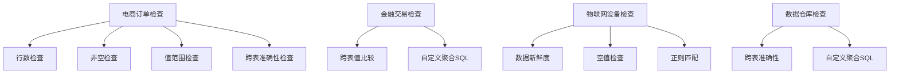

**图表来源**
- [TableRowCount.java](file://datavines-metric/datavines-metric-plugins/datavines-metric-table-row-count/src/main/java/io/datavines/metric/plugin/TableRowCount.java)
- [ColumnNull.java](file://datavines-metric/datavines-metric-plugins/datavines-metric-column-null/src/main/java/io/datavines/metric/plugin/ColumnNull.java)
- [ColumnValueBetween.java](file://datavines-metric/datavines-metric-plugins/datavines-metric-column-value-between/src/main/java/io/datavines/metric/plugin/ColumnValueBetween.java)
- [MultiTableAccuracy.java](file://datavines-metric/datavines-metric-plugins/datavines-metric-multi-table-accuracy/src/main/java/io/datavines/metric/plugin/MultiTableAccuracy.java)
- [CustomAggregateSql.java](file://datavines-metric/datavines-metric-plugins/datavines-metric-custom-aggregate-sql/src/main/java/io/datavines/metric/plugin/CustomAggregateSql.java)

**本节来源**
- [TableRowCount.java](file://datavines-metric/datavines-metric-plugins/datavines-metric-table-row-count/src/main/java/io/datavines/metric/plugin/TableRowCount.java)
- [ColumnNull.java](file://datavines-metric/datavines-metric-plugins/datavines-metric-column-null/src/main/java/io/datavines/metric/plugin/ColumnNull.java)
- [ColumnValueBetween.java](file://datavines-metric/datavines-metric-plugins/datavines-metric-column-value-between/src/main/java/io/datavines/metric/plugin/ColumnValueBetween.java)
- [MultiTableAccuracy.java](file://datavines-metric/datavines-metric-plugins/datavines-metric-multi-table-accuracy/src/main/java/io/datavines/metric/plugin/MultiTableAccuracy.java)
- [CustomAggregateSql.java](file://datavines-metric/datavines-metric-plugins/datavines-metric-custom-aggregate-sql/src/main/java/io/datavines/metric/plugin/CustomAggregateSql.java)

## 结论

datavines-metric模块作为DataVines数据质量框架的核心组件，提供了一套完整、灵活且可扩展的数据质量度量解决方案。通过对27种内置检查规则的支持、多种预期值计算策略的实现、精确的结果验证机制和完善的度量配置体系，该模块能够满足各种复杂场景下的数据质量检查需求。

模块采用插件化架构设计，通过`SqlMetric`、`ExpectedValue`、`ResultFormula`等标准化接口，实现了高度的可扩展性。开发者可以轻松创建自定义度量规则，并通过SPI机制进行注册和使用。同时，模块在性能优化方面也做了充分考虑，通过SQL优化、并行执行、资源管理和缓存策略等手段，确保在大规模数据场景下的高效执行。

未来，datavines-metric模块可以进一步增强机器学习驱动的异常检测能力，支持更复杂的业务规则引擎，并提供更丰富的可视化分析功能，为数据质量管理提供更智能的解决方案。

**本节来源**
- [MetricType.java](file://datavines-metric/datavines-metric-api/src/main/java/io/datavines/metric/api/MetricType.java)
- [SqlMetric.java](file://datavines-metric/datavines-metric-api/src/main/java/io/datavines/metric/api/SqlMetric.java)
- [ExpectedValue.java](file://datavines-metric/datavines-metric-api/src/main/java/io/datavines/metric/api/ExpectedValue.java)
- [ResultFormula.java](file://datavines-metric/datavines-metric-api/src/main/java/io/datavines/metric/api/ResultFormula.java)
- [MetricValidator.java](file://datavines-metric/datavines-metric-api/src/main/java/io/datavines/metric/api/MetricValidator.java)