# 内置度量规则

<cite>
**本文档引用的文件**
- [MetricType.java](file://datavines-metric\datavines-metric-api\src\main\java\io\datavines\metric\api\MetricType.java)
- [SqlMetric.java](file://datavines-metric\datavines-metric-api\src\main\java\io\datavines\metric\api\SqlMetric.java)
- [BaseSingleTable.java](file://datavines-metric\datavines-metric-plugins\datavines-metric-base\src\main\java\io\datavines\metric\plugin\base\BaseSingleTable.java)
- [BaseSingleTableColumn.java](file://datavines-metric\datavines-metric-plugins\datavines-metric-base\src\main\java\io\datavines\metric\plugin\base\BaseSingleTableColumn.java)
- [ColumnNotNull.java](file://datavines-metric\datavines-metric-plugins\datavines-metric-column-not-null\src\main\java\io\datavines\metric\plugin\ColumnNotNull.java)
- [CustomAggregateSql.java](file://datavines-metric\datavines-metric-plugins\datavines-metric-custom-aggregate-sql\src\main\java\io\datavines\metric\plugin\CustomAggregateSql.java)
- [MultiTableAccuracy.java](file://datavines-metric\datavines-metric-plugins\datavines-metric-multi-table-accuracy\src\main\java\io\datavines\metric\plugin\MultiTableAccuracy.java)
- [ColumnUnique.java](file://datavines-metric\datavines-metric-plugins\datavines-metric-column-unique\src\main\java\io\datavines\metric\plugin\ColumnUnique.java)
- [ColumnValueBetween.java](file://datavines-metric\datavines-metric-plugins\datavines-metric-column-value-between\src\main\java\io\datavines\metric\plugin\ColumnValueBetween.java)
- [TableRowCount.java](file://datavines-metric\datavines-metric-plugins\datavines-metric-table-row-count\src\main\java\io\datavines\metric\plugin\TableRowCount.java)
- [MultiTableValueComparison.java](file://datavines-metric\datavines-metric-plugins\datavines-metric-multi-table-value-comparison\src\main\java\io\datavines\metric\plugin\MultiTableValueComparison.java)
- [ColumnDistinct.java](file://datavines-metric\datavines-metric-plugins\datavines-metric-column-distinct\src\main\java\io\datavines\metric\plugin\ColumnDistinct.java)
- [ColumnMatchRegex.java](file://datavines-metric\datavines-metric-plugins\datavines-metric-column-match-regex\src\main\java\io\datavines\metric\plugin\ColumnMatchRegex.java)
- [ColumnInEnums.java](file://datavines-metric\datavines-metric-plugins\datavines-metric-column-in-enums\src\main\java\io\datavines\metric\plugin\ColumnInEnums.java)
- [ColumnAvg.java](file://datavines-metric\datavines-metric-plugins\datavines-metric-column-avg\src\main\java\io\datavines\metric\plugin\ColumnAvg.java)
- [ColumnSum.java](file://datavines-metric\datavines-metric-plugins\datavines-metric-column-sum\src\main\java\io\datavines\metric\plugin\ColumnSum.java)
</cite>

## 目录
1. [引言](#引言)
2. [度量规则体系概述](#度量规则体系概述)
3. [核心实现架构](#核心实现架构)
4. [单表列检查规则详解](#单表列检查规则详解)
5. [跨表准确性检查规则](#跨表准确性检查规则)
6. [自定义聚合SQL检查](#自定义聚合SQL检查)
7. [规则选择与性能优化指南](#规则选择与性能优化指南)
8. [复杂场景应用示例](#复杂场景应用示例)
9. [结论](#结论)

## 引言

DataVines系统提供了一套完整的数据质量度量规则体系，旨在通过自动化检查确保数据的准确性、完整性、唯一性和有效性。本文档详细介绍了系统内置的27种预置检查规则，涵盖单表列检查、跨表准确性检查和自定义聚合SQL检查三大类别。通过分析`ColumnNotNull`等具体实现类的代码结构和关键算法，为用户提供规则选择指南和性能优化建议，并提供复杂场景下的规则组合使用示例和最佳实践。

## 度量规则体系概述

DataVines的度量规则体系基于`SqlMetric`接口构建，通过SPI机制实现插件化扩展。系统定义了四种主要的度量类型，分别对应不同的业务场景：

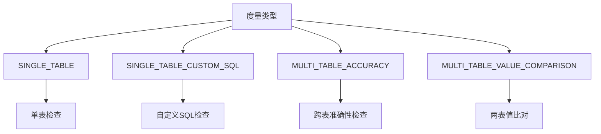

**图表来源**
- [MetricType.java](file://datavines-metric\datavines-metric-api\src\main\java\io\datavines\metric\api\MetricType.java)

**本节来源**
- [MetricType.java](file://datavines-metric\datavines-metric-api\src\main\java\io\datavines\metric\api\MetricType.java)

## 核心实现架构

度量规则的核心实现基于继承体系，通过抽象基类提供通用功能，具体规则类实现特定业务逻辑。主要的继承关系如下：

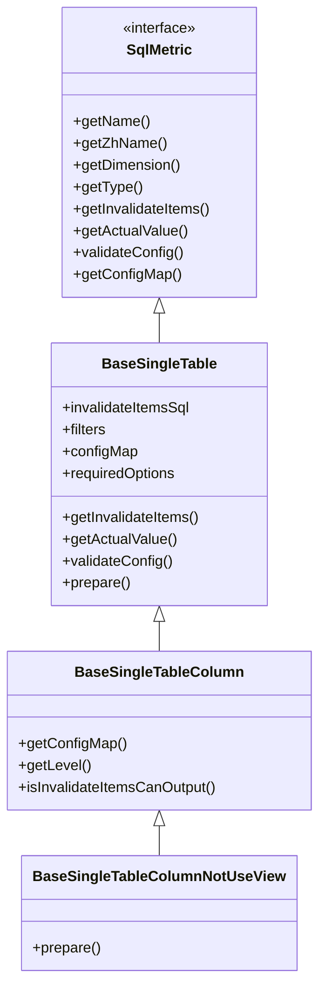

**图表来源**
- [SqlMetric.java](file://datavines-metric\datavines-metric-api\src\main\java\io\datavines\metric\api\SqlMetric.java)
- [BaseSingleTable.java](file://datavines-metric\datavines-metric-plugins\datavines-metric-base\src\main\java\io\datavines\metric\plugin\base\BaseSingleTable.java)
- [BaseSingleTableColumn.java](file://datavines-metric\datavines-metric-plugins\datavines-metric-base\src\main\java\io\datavines\metric\plugin\base\BaseSingleTableColumn.java)

**本节来源**
- [SqlMetric.java](file://datavines-metric\datavines-metric-api\src\main\java\io\datavines\metric\api\SqlMetric.java)
- [BaseSingleTable.java](file://datavines-metric\datavines-metric-plugins\datavines-metric-base\src\main\java\io\datavines\metric\plugin\base\BaseSingleTable.java)
- [BaseSingleTableColumn.java](file://datavines-metric\datavines-metric-plugins\datavines-metric-base\src\main\java\io\datavines\metric\plugin\base\BaseSingleTableColumn.java)

## 单表列检查规则详解

单表列检查规则是数据质量检查的基础，主要针对单个表的特定列进行各种约束验证。这些规则继承自`BaseSingleTableColumn`类，实现了列级别的数据质量检查。

### 非空检查 (ColumnNotNull)

非空检查用于验证指定列中是否存在空值，确保数据的完整性。

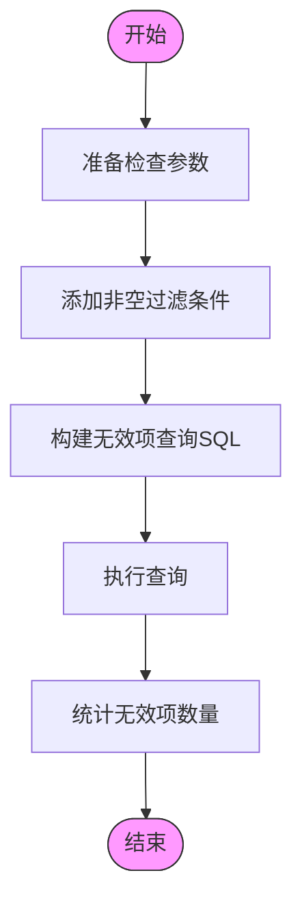

**图表来源**
- [ColumnNotNull.java](file://datavines-metric\datavines-metric-plugins\datavines-metric-column-not-null\src\main\java\io\datavines\metric\plugin\ColumnNotNull.java)

**本节来源**
- [ColumnNotNull.java](file://datavines-metric\datavines-metric-plugins\datavines-metric-column-not-null\src\main\java\io\datavines\metric\plugin\ColumnNotNull.java)

### 唯一性检查 (ColumnUnique)

唯一性检查用于验证指定列中的值是否唯一，防止重复数据的产生。

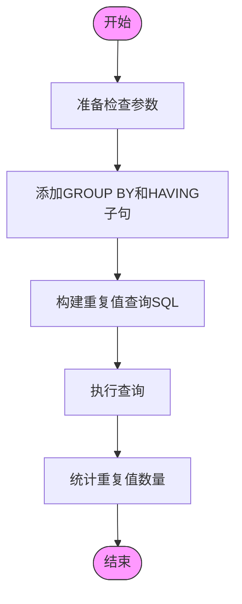

**图表来源**
- [ColumnUnique.java](file://datavines-metric\datavines-metric-plugins\datavines-metric-column-unique\src\main\java\io\datavines\metric\plugin\ColumnUnique.java)

**本节来源**
- [ColumnUnique.java](file://datavines-metric\datavines-metric-plugins\datavines-metric-column-unique\src\main\java\io\datavines\metric\plugin\ColumnUnique.java)

### 值范围检查 (ColumnValueBetween)

值范围检查用于验证指定列的值是否在预设的最小值和最大值范围内。

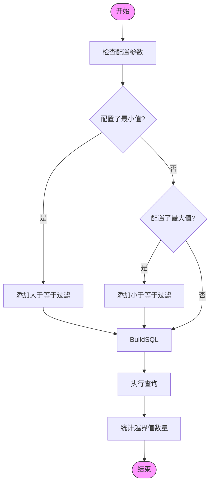

**图表来源**
- [ColumnValueBetween.java](file://datavines-metric\datavines-metric-plugins\datavines-metric-column-value-between\src\main\java\io\datavines\metric\plugin\ColumnValueBetween.java)

**本节来源**
- [ColumnValueBetween.java](file://datavines-metric\datavines-metric-plugins\datavines-metric-column-value-between\src\main\java\io\datavines\metric\plugin\ColumnValueBetween.java)

### 正则表达式检查 (ColumnMatchRegex)

正则表达式检查用于验证指定列的值是否符合预设的正则表达式模式。

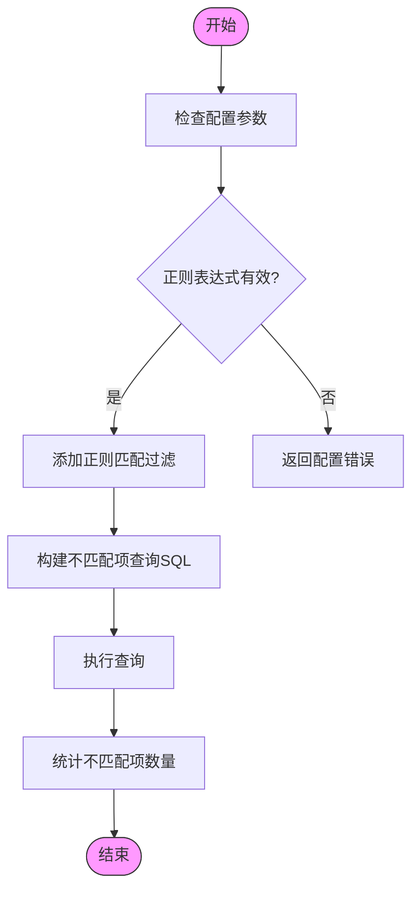

**图表来源**
- [ColumnMatchRegex.java](file://datavines-metric\datavines-metric-plugins\datavines-metric-column-match-regex\src\main\java\io\datavines\metric\plugin\ColumnMatchRegex.java)

**本节来源**
- [ColumnMatchRegex.java](file://datavines-metric\datavines-metric-plugins\datavines-metric-column-match-regex\src\main\java\io\datavines\metric\plugin\ColumnMatchRegex.java)

### 枚举值检查 (ColumnInEnums)

枚举值检查用于验证指定列的值是否属于预设的枚举值列表。

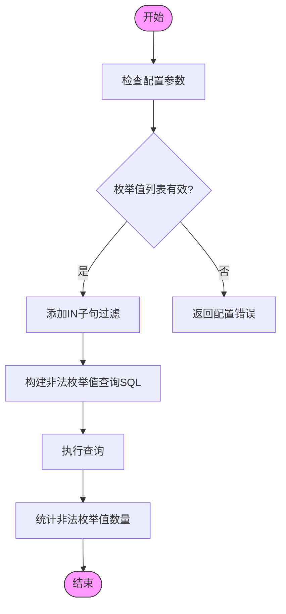

**图表来源**
- [ColumnInEnums.java](file://datavines-metric\datavines-metric-plugins\datavines-metric-column-in-enums\src\main\java\io\datavines\metric\plugin\ColumnInEnums.java)

**本节来源**
- [ColumnInEnums.java](file://datavines-metric\datavines-metric-plugins\datavines-metric-column-in-enums\src\main\java\io\datavines\metric\plugin\ColumnInEnums.java)

### 数值统计检查

数值统计检查包括平均值、总值、标准差等统计指标的计算。

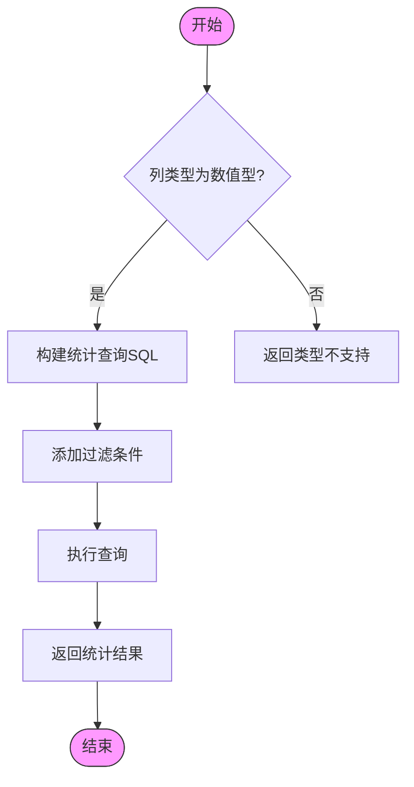

**图表来源**
- [ColumnAvg.java](file://datavines-metric\datavines-metric-plugins\datavines-metric-column-avg\src\main\java\io\datavines\metric\plugin\ColumnAvg.java)
- [ColumnSum.java](file://datavines-metric\datavines-metric-plugins\datavines-metric-column-sum\src\main\java\io\datavines\metric\plugin\ColumnSum.java)

**本节来源**
- [ColumnAvg.java](file://datavines-metric\datavines-metric-plugins\datavines-metric-column-avg\src\main\java\io\datavines\metric\plugin\ColumnAvg.java)
- [ColumnSum.java](file://datavines-metric\datavines-metric-plugins\datavines-metric-column-sum\src\main\java\io\datavines\metric\plugin\ColumnSum.java)

## 跨表准确性检查规则

跨表准确性检查规则用于验证不同表之间的数据一致性，确保数据在不同系统或不同版本之间保持准确。

### 跨表准确性检查 (MultiTableAccuracy)

跨表准确性检查通过LEFT JOIN操作比较源表和目标表的数据，识别缺失或不匹配的记录。

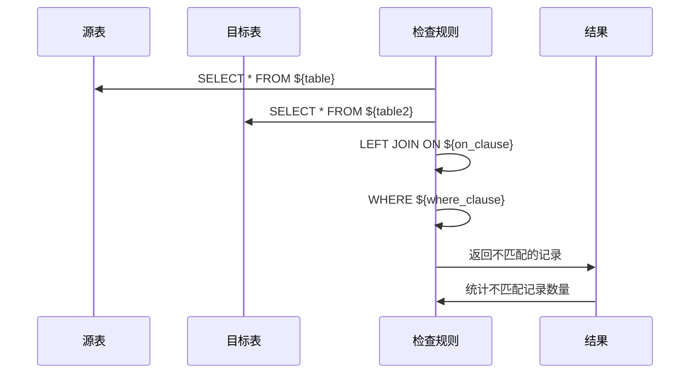

**图表来源**
- [MultiTableAccuracy.java](file://datavines-metric\datavines-metric-plugins\datavines-metric-multi-table-accuracy\src\main\java\io\datavines\metric\plugin\MultiTableAccuracy.java)

**本节来源**
- [MultiTableAccuracy.java](file://datavines-metric\datavines-metric-plugins\datavines-metric-multi-table-accuracy\src\main\java\io\datavines\metric\plugin\MultiTableAccuracy.java)

### 两表值比对 (MultiTableValueComparison)

两表值比对规则用于比较两个表中特定字段的值是否一致。

**本节来源**
- [MultiTableValueComparison.java](file://datavines-metric\datavines-metric-plugins\datavines-metric-multi-table-value-comparison\src\main\java\io\datavines\metric\plugin\MultiTableValueComparison.java)

## 自定义聚合SQL检查

自定义聚合SQL检查允许用户编写自定义的SQL查询来实现复杂的度量逻辑。

### 自定义聚合SQL (CustomAggregateSql)

自定义聚合SQL规则允许用户直接提供SQL语句进行数据质量检查。

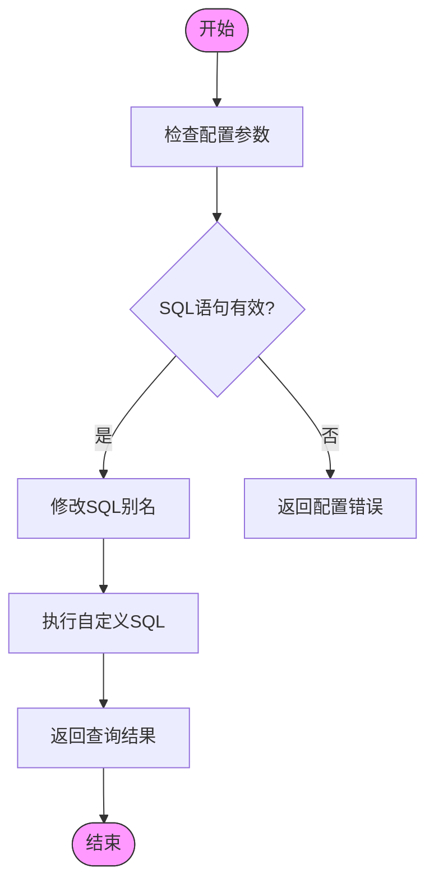

**图表来源**
- [CustomAggregateSql.java](file://datavines-metric\datavines-metric-plugins\datavines-metric-custom-aggregate-sql\src\main\java\io\datavines\metric\plugin\CustomAggregateSql.java)

**本节来源**
- [CustomAggregateSql.java](file://datavines-metric\datavines-metric-plugins\datavines-metric-custom-aggregate-sql\src\main\java\io\datavines\metric\plugin\CustomAggregateSql.java)

## 规则选择与性能优化指南

### 规则选择指南

根据不同的业务场景和数据特征，选择合适的度量规则：

| 业务场景 | 推荐规则 | 说明 |
|---------|---------|------|
| 数据完整性验证 | 非空检查、值范围检查 | 确保关键字段不为空且在合理范围内 |
| 数据一致性验证 | 跨表准确性检查 | 确保不同系统间数据同步一致 |
| 数据有效性验证 | 枚举值检查、正则表达式检查 | 确保数据符合业务规则 |
| 数据统计分析 | 平均值检查、总值检查 | 获取数据的统计特征 |

### 性能优化建议

1. **合理使用过滤条件**：通过配置`filter`参数减少查询数据量
2. **避免全表扫描**：确保被检查的列上有适当的索引
3. **批量处理**：对于多表检查，考虑使用批处理方式
4. **结果缓存**：对于频繁执行的检查，考虑缓存结果

**本节来源**
- [BaseSingleTable.java](file://datavines-metric\datavines-metric-plugins\datavines-metric-base\src\main\java\io\datavines\metric\plugin\base\BaseSingleTable.java)
- [TableRowCount.java](file://datavines-metric\datavines-metric-plugins\datavines-metric-table-row-count\src\main\java\io\datavines\metric\plugin\TableRowCount.java)

## 复杂场景应用示例

### 组合规则应用

在实际业务中，往往需要组合多个规则来全面评估数据质量：

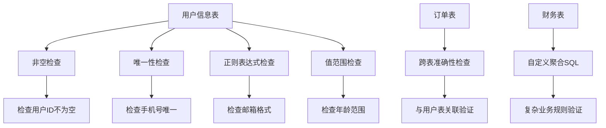

**图表来源**
- [ColumnNotNull.java](file://datavines-metric\datavines-metric-plugins\datavines-metric-column-not-null\src\main\java\io\datavines\metric\plugin\ColumnNotNull.java)
- [ColumnUnique.java](file://datavines-metric\datavines-metric-plugins\datavines-metric-column-unique\src\main\java\io\datavines\metric\plugin\ColumnUnique.java)
- [ColumnMatchRegex.java](file://datavines-metric\datavines-metric-plugins\datavines-metric-column-match-regex\src\main\java\io\datavines\metric\plugin\ColumnMatchRegex.java)
- [ColumnValueBetween.java](file://datavines-metric\datavines-metric-plugins\datavines-metric-column-value-between\src\main\java\io\datavines\metric\plugin\ColumnValueBetween.java)
- [MultiTableAccuracy.java](file://datavines-metric\datavines-metric-plugins\datavines-metric-multi-table-accuracy\src\main\java\io\datavines\metric\plugin\MultiTableAccuracy.java)
- [CustomAggregateSql.java](file://datavines-metric\datavines-metric-plugins\datavines-metric-custom-aggregate-sql\src\main\java\io\datavines\metric\plugin\CustomAggregateSql.java)

**本节来源**
- [ColumnNotNull.java](file://datavines-metric\datavines-metric-plugins\datavines-metric-column-not-null\src\main\java\io\datavines\metric\plugin\ColumnNotNull.java)
- [ColumnUnique.java](file://datavines-metric\datavines-metric-plugins\datavines-metric-column-unique\src\main\java\io\datavines\metric\plugin\ColumnUnique.java)
- [ColumnMatchRegex.java](file://datavines-metric\datavines-metric-plugins\datavines-metric-column-match-regex\src\main\java\io\datavines\metric\plugin\ColumnMatchRegex.java)
- [ColumnValueBetween.java](file://datavines-metric\datavines-metric-plugins\datavines-metric-column-value-between\src\main\java\io\datavines\metric\plugin\ColumnValueBetween.java)
- [MultiTableAccuracy.java](file://datavines-metric\datavines-metric-plugins\datavines-metric-multi-table-accuracy\src\main\java\io\datavines\metric\plugin\MultiTableAccuracy.java)
- [CustomAggregateSql.java](file://datavines-metric\datavines-metric-plugins\datavines-metric-custom-aggregate-sql\src\main\java\io\datavines\metric\plugin\CustomAggregateSql.java)

## 结论

DataVines的内置度量规则体系提供了全面的数据质量检查能力，通过27种预置规则覆盖了数据质量的各个方面。系统采用模块化设计，通过`SqlMetric`接口和继承体系实现了规则的可扩展性和可维护性。用户可以根据具体业务需求选择合适的规则，并通过组合使用实现复杂的数据质量验证。在实际应用中，应结合性能优化建议，合理配置规则参数，以达到最佳的检查效果。