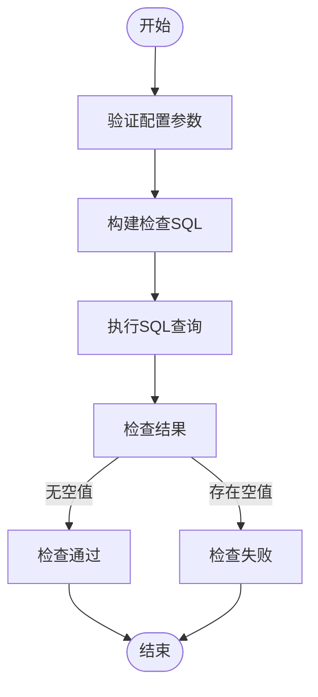
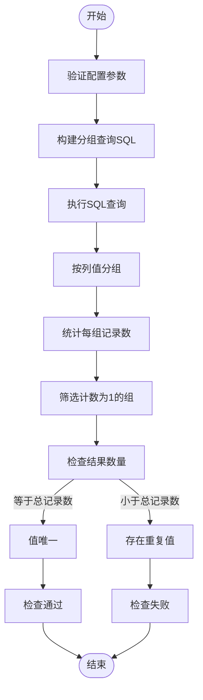
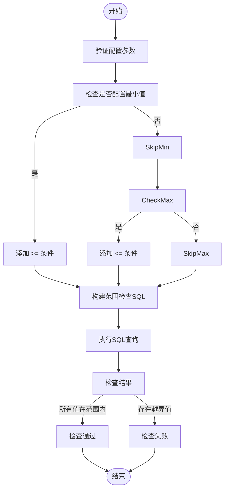
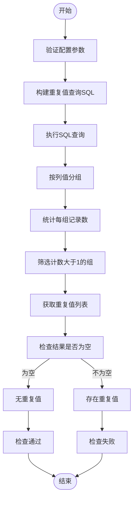
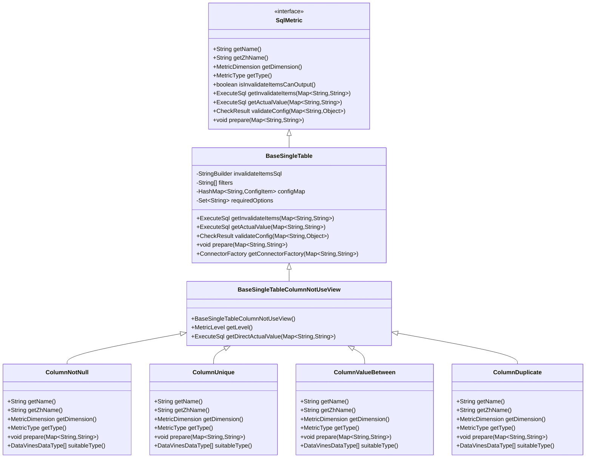
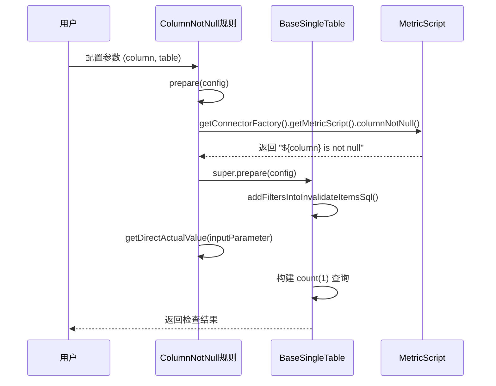

# 单表检查规则

<cite>
**本文档引用的文件**  
- [ColumnNotNull.java](file://datavines-metric\datavines-metric-plugins\datavines-metric-column-not-null\src\main\java\io\datavines\metric\plugin\ColumnNotNull.java)
- [ColumnUnique.java](file://datavines-metric\datavines-metric-plugins\datavines-metric-column-unique\src\main\java\io\datavines\metric\plugin\ColumnUnique.java)
- [ColumnValueBetween.java](file://datavines-metric\datavines-metric-plugins\datavines-metric-column-value-between\src\main\java\io\datavines\metric\plugin\ColumnValueBetween.java)
- [ColumnDuplicate.java](file://datavines-metric\datavines-metric-plugins\datavines-metric-column-duplicate\src\main\java\io\datavines\metric\plugin\ColumnDuplicate.java)
- [BaseSingleTableColumnNotUseView.java](file://datavines-metric\datavines-metric-plugins\datavines-metric-base\src\main\java\io\datavines\metric\plugin\base\BaseSingleTableColumnNotUseView.java)
- [BaseSingleTable.java](file://datavines-metric\datavines-metric-plugins\datavines-metric-base\src\main\java\io\datavines\metric\plugin\base\BaseSingleTable.java)
- [MetricScript.java](file://datavines-connector\datavines-connector-api\src\main\java\io\datavines\connector\api\MetricScript.java)
- [SqlMetric.java](file://datavines-metric\datavines-metric-api\src\main\java\io\datavines\metric\api\SqlMetric.java)
- [DataVinesDataType.java](file://datavines-common\src\main\java\io\datavines\common\enums\DataVinesDataType.java)
- [MetricDimension.java](file://datavines-metric\datavines-metric-api\src\main\java\io\datavines\metric\api\MetricDimension.java)
</cite>

## 目录
1. [引言](#引言)
2. [核心单表检查规则](#核心单表检查规则)
   1. [非空检查](#非空检查)
   2. [唯一性检查](#唯一性检查)
   3. [值范围检查](#值范围检查)
   4. [重复值检查](#重复值检查)
3. [规则配置与执行逻辑](#规则配置与执行逻辑)
4. [实现类分析](#实现类分析)
5. [规则选择指南与性能优化](#规则选择指南与性能优化)
6. [复杂场景下的规则组合使用](#复杂场景下的规则组合使用)
7. [最佳实践](#最佳实践)

## 引言
DataVines 是一个数据质量管理系统，提供多种单表列级质量检查规则。这些规则用于验证数据的完整性、有效性、唯一性等关键质量维度。本文档将详细介绍非空检查、唯一性检查、值范围检查和重复值检查等核心单表检查规则，包括它们的业务场景、配置参数、执行逻辑以及具体实现。

## 核心单表检查规则

### 非空检查
非空检查（`column_not_null`）用于验证指定列中是否存在空值，确保数据的完整性。

**业务场景**：  
在数据录入或ETL过程中，某些关键字段如用户ID、订单号等必须有值，不能为空。非空检查可以确保这些关键字段的数据完整性。

**配置参数**：  
- `column`：要检查的列名（必填）
- `table`：目标表名（必填）
- `filter`：可选的过滤条件

**执行逻辑**：  
该规则通过生成SQL查询来检查指定列中不为空的记录数量。核心SQL片段为 `${column} is not null`，它会被嵌入到完整的查询语句中进行执行。



**图源**  
- [ColumnNotNull.java](file://datavines-metric\datavines-metric-plugins\datavines-metric-column-not-null\src\main\java\io\datavines\metric\plugin\ColumnNotNull.java#L60-L65)
- [MetricScript.java](file://datavines-connector\datavines-connector-api\src\main\java\io\datavines\connector\api\MetricScript.java#L93-L95)

**节源**  
- [ColumnNotNull.java](file://datavines-metric\datavines-metric-plugins\datavines-metric-column-not-null\src\main\java\io\datavines\metric\plugin\ColumnNotNull.java)
- [MetricScript.java](file://datavines-connector\datavines-connector-api\src\main\java\io\datavines\connector\api\MetricScript.java)

### 唯一性检查
唯一性检查（`column_unique`）用于验证指定列中的值是否都是唯一的，即没有重复值。

**业务场景**：  
主键字段、唯一标识符等列需要保证其值的唯一性。例如，用户表中的邮箱地址或身份证号通常需要是唯一的。

**配置参数**：  
- `column`：要检查的列名（必填）
- `table`：目标表名（必填）
- `filter`：可选的过滤条件

**执行逻辑**：  
该规则通过分组和计数来识别重复值。核心SQL片段为 `group by ${column} having count(1) = 1`，它会筛选出那些只出现一次的值，从而确认列的唯一性。



**图源**  
- [ColumnUnique.java](file://datavines-metric\datavines-metric-plugins\datavines-metric-column-unique\src\main\java\io\datavines\metric\plugin\ColumnUnique.java#L62-L70)
- [MetricScript.java](file://datavines-connector\datavines-connector-api\src\main\java\io\datavines\connector\api\MetricScript.java#L77-L79)

**节源**  
- [ColumnUnique.java](file://datavines-metric\datavines-metric-plugins\datavines-metric-column-unique\src\main\java\io\datavines\metric\plugin\ColumnUnique.java)
- [MetricScript.java](file://datavines-connector\datavines-connector-api\src\main\java\io\datavines\connector\api\MetricScript.java)

### 值范围检查
值范围检查（`column_value_between`）用于验证指定列的值是否在预定义的最小值和最大值范围内。

**业务场景**：  
数值型字段如年龄、价格、分数等通常有合理的取值范围。例如，年龄应在0-150之间，价格不能为负数。

**配置参数**：  
- `column`：要检查的列名（必填）
- `table`：目标表名（必填）
- `min`：最小值（可选）
- `max`：最大值（可选）
- `filter`：可选的过滤条件

**执行逻辑**：  
该规则通过比较操作符来限制值的范围。核心SQL片段包括 `${column} >= ${min}` 和 `${column} <= ${max}`，它们会被组合成WHERE子句来过滤出不符合范围的记录。



**图源**  
- [ColumnValueBetween.java](file://datavines-metric\datavines-metric-plugins\datavines-metric-column-value-between\src\main\java\io\datavines\metric\plugin\ColumnValueBetween.java#L64-L75)
- [MetricScript.java](file://datavines-connector\datavines-connector-api\src\main\java\io\datavines\connector\api\MetricScript.java#L113-L118)

**节源**  
- [ColumnValueBetween.java](file://datavines-metric\datavines-metric-plugins\datavines-metric-column-value-between\src\main\java\io\datavines\metric\plugin\ColumnValueBetween.java)
- [MetricScript.java](file://datavines-connector\datavines-connector-api\src\main\java\io\datavines\connector\api\MetricScript.java)

### 重复值检查
重复值检查（`column_duplicate`）用于识别和报告指定列中存在的重复值。

**业务场景**：  
在数据清洗和去重过程中，需要找出并处理重复的记录。例如，客户信息表中可能存在重复的手机号或邮箱。

**配置参数**：  
- `column`：要检查的列名（必填）
- `table`：目标表名（必填）
- `filter`：可选的过滤条件

**执行逻辑**：  
该规则通过分组和HAVING子句来直接找出重复值。核心SQL片段为 `group by ${column} having count(${column}) > 1`，它会返回所有出现次数大于1的值。



**图源**  
- [ColumnDuplicate.java](file://datavines-metric\datavines-metric-plugins\datavines-metric-column-duplicate\src\main\java\io\datavines\metric\plugin\ColumnDuplicate.java#L62-L71)
- [MetricScript.java](file://datavines-connector\datavines-connector-api\src\main\java\io\datavines\connector\api\MetricScript.java#L81-L83)

**节源**  
- [ColumnDuplicate.java](file://datavines-metric\datavines-metric-plugins\datavines-metric-column-duplicate\src\main\java\io\datavines\metric\plugin\ColumnDuplicate.java)
- [MetricScript.java](file://datavines-connector\datavines-connector-api\src\main\java\io\datavines\connector\api\MetricScript.java)

## 规则配置与执行逻辑
单表检查规则的配置和执行遵循统一的框架。所有规则都实现了 `SqlMetric` 接口，并继承自 `BaseSingleTable` 或其子类。

**配置流程**：
1. **参数验证**：通过 `validateConfig` 方法检查必需参数是否提供。
2. **参数准备**：`prepare` 方法将配置参数转换为内部使用的过滤条件。
3. **SQL生成**：根据配置生成用于检查无效项和计算实际值的SQL语句。

**执行流程**：
1. **获取无效项**：执行 `getInvalidateItems` 生成的SQL，获取不符合规则的数据行。
2. **计算实际值**：执行 `getActualValue` 或 `getDirectActualValue` 生成的SQL，计算违规数据的数量。
3. **结果评估**：将实际值与预期值进行比较，判断规则是否通过。



**图源**  
- [SqlMetric.java](file://datavines-metric\datavines-metric-api\src\main\java\io\datavines\metric\api\SqlMetric.java)
- [BaseSingleTable.java](file://datavines-metric\datavines-metric-plugins\datavines-metric-base\src\main\java\io\datavines\metric\plugin\base\BaseSingleTable.java)
- [BaseSingleTableColumnNotUseView.java](file://datavines-metric\datavines-metric-plugins\datavines-metric-base\src\main\java\io\datavines\metric\plugin\base\BaseSingleTableColumnNotUseView.java)
- [ColumnNotNull.java](file://datavines-metric\datavines-metric-plugins\datavines-metric-column-not-null\src\main\java\io\datavines\metric\plugin\ColumnNotNull.java)
- [ColumnUnique.java](file://datavines-metric\datavines-metric-plugins\datavines-metric-column-unique\src\main\java\io\datavines\metric\plugin\ColumnUnique.java)
- [ColumnValueBetween.java](file://datavines-metric\datavines-metric-plugins\datavines-metric-column-value-between\src\main\java\io\datavines\metric\plugin\ColumnValueBetween.java)
- [ColumnDuplicate.java](file://datavines-metric\datavines-metric-plugins\datavines-metric-column-duplicate\src\main\java\io\datavines\metric\plugin\ColumnDuplicate.java)

**节源**  
- [SqlMetric.java](file://datavines-metric\datavines-metric-api\src\main\java\io\datavines\metric\api\SqlMetric.java)
- [BaseSingleTable.java](file://datavines-metric\datavines-metric-plugins\datavines-metric-base\src\main\java\io\datavines\metric\plugin\base\BaseSingleTable.java)

## 实现类分析
### ColumnNotNull 实现分析
`ColumnNotNull` 类实现了非空检查的核心逻辑。它继承自 `BaseSingleTableColumnNotUseView`，并重写了关键方法。

**关键方法**：
- `getName()`：返回规则的英文标识符 `column_not_null`。
- `getZhName()`：返回规则的中文名称 "非空检查"。
- `getDimension()`：返回质量维度 `EFFECTIVENESS`（有效性）。
- `getType()`：返回规则类型 `SINGLE_TABLE`（单表）。
- `prepare()`：准备检查逻辑，将 `columnNotNull()` SQL片段添加到过滤器中。

**执行流程**：
1. 调用 `prepare` 方法，根据配置构建过滤条件。
2. 调用 `getInvalidateItems` 获取所有非空值的记录。
3. 调用 `getDirectActualValue` 计算非空值的数量。



**图源**  
- [ColumnNotNull.java](file://datavines-metric\datavines-metric-plugins\datavines-metric-column-not-null\src\main\java\io\datavines\metric\plugin\ColumnNotNull.java)
- [MetricScript.java](file://datavines-connector\datavines-connector-api\src\main\java\io\datavines\connector\api\MetricScript.java)

**节源**  
- [ColumnNotNull.java](file://datavines-metric\datavines-metric-plugins\datavines-metric-column-not-null\src\main\java\io\datavines\metric\plugin\ColumnNotNull.java)

## 规则选择指南与性能优化
### 规则选择指南
选择合适的检查规则应基于数据的业务含义和质量要求：

| 规则类型 | 适用数据类型 | 适用场景 |
|--------|-----------|--------|
| 非空检查 | 所有类型 | 关键字段完整性验证 |
| 唯一性检查 | 数值、字符串、日期时间 | 主键、唯一标识符验证 |
| 值范围检查 | 数值、日期时间 | 数值合理性验证 |
| 重复值检查 | 所有类型 | 数据去重、清洗 |

**选择建议**：
- 对于主键字段，应同时使用**非空检查**和**唯一性检查**。
- 对于业务关键字段（如价格、数量），应使用**值范围检查**。
- 在数据导入后，应运行**重复值检查**以确保数据清洁。

### 性能优化建议
1. **索引优化**：为被检查的列创建索引，特别是用于唯一性检查和重复值检查的列。
2. **分区表查询**：对于大表，利用分区信息缩小查询范围。
3. **采样检查**：对于超大表，可先进行采样检查，再决定是否全量检查。
4. **批量执行**：将多个规则组合成一个作业批量执行，减少系统开销。

## 复杂场景下的规则组合使用
在实际应用中，往往需要组合多个规则来满足复杂的质量要求。

**示例：用户信息表质量检查**
```json
{
  "rules": [
    {
      "type": "column_not_null",
      "config": {
        "column": "user_id",
        "table": "users"
      }
    },
    {
      "type": "column_unique",
      "config": {
        "column": "email",
        "table": "users"
      }
    },
    {
      "type": "column_value_between",
      "config": {
        "column": "age",
        "table": "users",
        "min": "0",
        "max": "150"
      }
    },
    {
      "type": "column_duplicate",
      "config": {
        "column": "phone",
        "table": "users"
      }
    }
  ]
}
```

此组合确保了用户ID不为空、邮箱唯一、年龄合理且手机号无重复。

## 最佳实践
1. **分层检查**：先进行非空检查，再进行其他更复杂的检查。
2. **配置复用**：将常用的检查配置保存为模板，便于重复使用。
3. **定期执行**：将数据质量检查纳入日常ETL流程，实现自动化监控。
4. **结果分析**：不仅关注检查是否通过，更要分析违规数据的模式和原因。
5. **渐进式实施**：从关键表和关键字段开始，逐步扩展到整个数据仓库。

通过合理选择和组合这些单表检查规则，可以有效提升数据质量，为数据分析和决策提供可靠的基础。