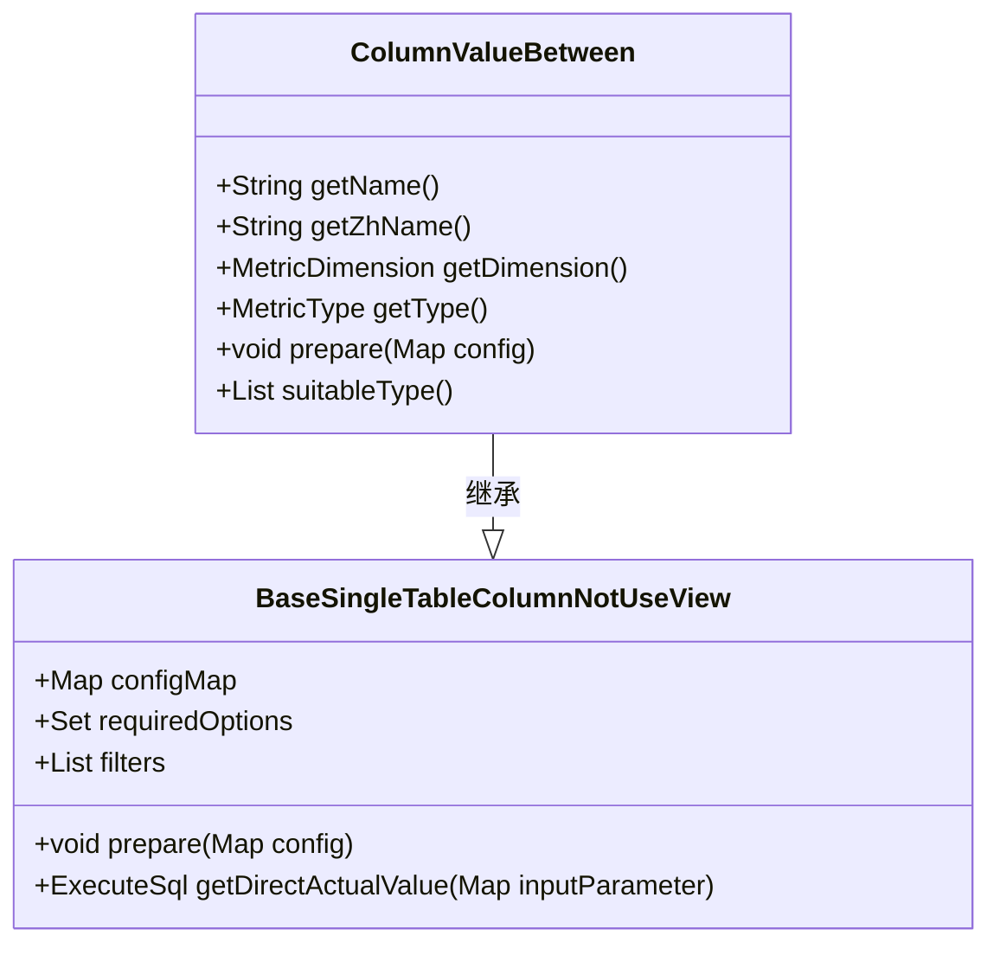
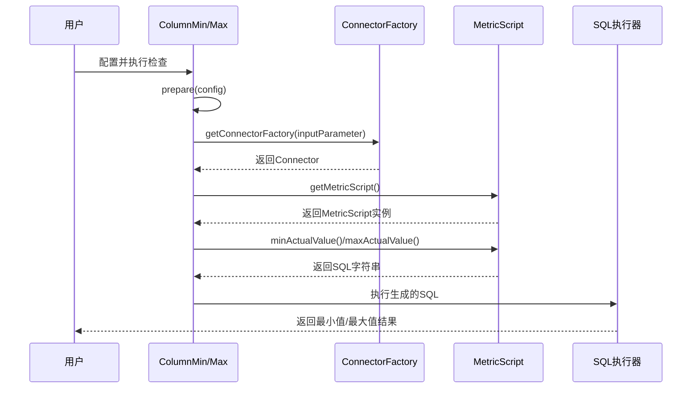

# 数值范围检查

<cite>
**本文档引用的文件**   
- [ColumnValueBetween.java](file://datavines-metric\datavines-metric-plugins\datavines-metric-column-value-between\src\main\java\io\datavines\metric\plugin\ColumnValueBetween.java)
- [ColumnMin.java](file://datavines-metric\datavines-metric-plugins\datavines-metric-column-min\src\main\java\io\datavines\metric\plugin\ColumnMin.java)
- [ColumnMax.java](file://datavines-metric\datavines-metric-plugins\datavines-metric-column-max\src\main\java\io\datavines\metric\plugin\ColumnMax.java)
- [BaseSingleTableColumn.java](file://datavines-metric\datavines-metric-plugins\datavines-metric-base\src\main\java\io\datavines\metric\plugin\base\BaseSingleTableColumn.java)
- [BaseSingleTableColumnNotUseView.java](file://datavines-metric\datavines-metric-plugins\datavines-metric-base\src\main\java\io\datavines\metric\plugin\base\BaseSingleTableColumnNotUseView.java)
- [SqlMetric.java](file://datavines-metric\datavines-metric-api\src\main\java\io\datavines\metric\api\SqlMetric.java)
- [MetricScript.java](file://datavines-connector\datavines-connector-api\src\main\java\io\datavines\connector\api\MetricScript.java)
- [JdbcMetricScript.java](file://datavines-connector\datavines-connector-plugins\datavines-connector-jdbc\src\main\java\io\datavines\connector\plugin\JdbcMetricScript.java)
</cite>

## 目录
1. [引言](#引言)
2. [核心规则实现](#核心规则实现)
3. [SQL生成策略](#sql生成策略)
4. [数据类型兼容性](#数据类型兼容性)
5. [业务应用场景](#业务应用场景)
6. [性能优化建议](#性能优化建议)
7. [动态阈值配置](#动态阈值配置)
8. [时间序列数据处理](#时间序列数据处理)
9. [结论](#结论)

## 引言

数值范围检查是数据质量保障体系中的关键环节，主要用于验证数据列中的值是否在预期的合理范围内。本系统提供了三种核心的数值范围检查规则：`ColumnValueBetween`（值范围检查）、`ColumnMin`（最小值检查）和`ColumnMax`（最大值检查），这些规则能够有效识别异常值、防止数据污染，确保数据的准确性和可靠性。本文档将深入介绍这些规则的业务应用、实现细节以及最佳实践。

## 核心规则实现

### ColumnValueBetween 规则

`ColumnValueBetween` 规则用于检查指定列的值是否在给定的最小值和最大值之间。该规则通过配置 `min` 和 `max` 参数来定义范围边界。

**实现细节**：
- **配置项**：该规则在构造函数中注册了 `min` 和 `max` 两个配置项，分别对应“最小值”和“最大值”。
- **准备阶段**：在 `prepare` 方法中，根据配置的 `min` 和 `max` 值，动态地向过滤器列表 `filters` 中添加相应的 SQL 片段。如果配置了 `min`，则添加 `columnGteMin()` 生成的 SQL；如果配置了 `max`，则添加 `columnLteMax()` 生成的 SQL。
- **数据类型支持**：该规则支持数值型（NUMERIC_TYPE）、字符串型（STRING_TYPE）和日期时间型（DATE_TIME_TYPE）等多种数据类型。



**类图来源**
- [ColumnValueBetween.java](file://datavines-metric\datavines-metric-plugins\datavines-metric-column-value-between\src\main\java\io\datavines\metric\plugin\ColumnValueBetween.java)
- [BaseSingleTableColumnNotUseView.java](file://datavines-metric\datavines-metric-plugins\datavines-metric-base\src\main\java\io\datavines\metric\plugin\base\BaseSingleTableColumnNotUseView.java)

**本节来源**
- [ColumnValueBetween.java](file://datavines-metric\datavines-metric-plugins\datavines-metric-column-value-between\src\main\java\io\datavines\metric\plugin\ColumnValueBetween.java#L31-L82)

### ColumnMin 和 ColumnMax 规则

`ColumnMin` 和 `ColumnMax` 规则分别用于获取指定列的最小值和最大值，通常作为基准值或用于与其他值进行比较。

**实现细节**：
- **继承关系**：这两个规则都继承自 `BaseSingleTableColumn` 类，共享了列名（`column`）配置项的处理逻辑。
- **SQL生成**：在 `getActualValue` 方法中，通过调用 `getConnectorFactory(inputParameter).getMetricScript()` 获取对应的 `MetricScript` 实例，然后调用 `minActualValue(uniqueKey)` 或 `maxActualValue(uniqueKey)` 方法生成获取最小值或最大值的 SQL 语句。
- **数据类型支持**：这两个规则仅支持数值型（NUMERIC_TYPE）数据，因为对字符串或日期类型求最小/最大值在某些场景下可能没有实际意义或需要特殊处理。



**序列图来源**
- [ColumnMin.java](file://datavines-metric\datavines-metric-plugins\datavines-metric-column-min\src\main\java\io\datavines\metric\plugin\ColumnMin.java)
- [ColumnMax.java](file://datavines-metric\datavines-metric-plugins\datavines-metric-column-max\src\main\java\io\datavines\metric\plugin\ColumnMax.java)
- [MetricScript.java](file://datavines-connector\datavines-connector-api\src\main\java\io\datavines\connector\api\MetricScript.java)

**本节来源**
- [ColumnMin.java](file://datavines-metric\datavines-metric-plugins\datavines-metric-column-min\src\main\java\io\datavines\metric\plugin\ColumnMin.java#L31-L87)
- [ColumnMax.java](file://datavines-metric\datavines-metric-plugins\datavines-metric-column-max\src\main\java\io\datavines\metric\plugin\ColumnMax.java#L31-L88)

## SQL生成策略

系统的SQL生成策略采用了一种高度抽象和可扩展的设计模式。核心思想是将SQL的生成逻辑从具体的业务规则中解耦，通过 `MetricScript` 接口来定义各种SQL片段的模板。

**核心组件**：
- **SqlMetric 接口**：定义了所有度量规则的通用行为，如获取实际值、获取无效项、验证配置等。
- **MetricScript 接口**：定义了所有SQL片段的生成方法，如 `minActualValue`、`maxActualValue`、`columnGteMin` 等。这些方法返回带有占位符（如 `${column}`, `${min}`, `${max}`）的SQL模板字符串。
- **具体实现**：针对不同的数据库（如MySQL、Oracle、PostgreSQL），通过SPI机制加载对应的 `MetricScript` 实现类（如 `MysqlMetricScript`、`OracleMetricScript`），以适应不同数据库的语法差异。

**生成流程**：
1. 业务规则（如 `ColumnValueBetween`）在 `prepare` 阶段根据配置决定需要哪些SQL片段。
2. 通过 `ConnectorFactory` 获取当前数据源对应的 `MetricScript` 实例。
3. 调用 `MetricScript` 的相应方法（如 `columnGteMin()`）获取SQL模板。
4. 将模板中的占位符替换为实际的表名、列名和配置值，最终生成可执行的SQL语句。

```mermaid
flowchart TD
A[业务规则] --> B{配置检查}
B --> |配置了min| C[调用columnGteMin()]
B --> |配置了max| D[调用columnLteMax()]
C --> E[获取SQL模板]
D --> E
E --> F[替换占位符]
F --> G[生成最终SQL]
G --> H[执行SQL]
H --> I[返回结果]
```

**流程图来源**
- [MetricScript.java](file://datavines-connector\datavines-connector-api\src\main\java\io\datavines\connector\api\MetricScript.java)
- [ColumnValueBetween.java](file://datavines-metric\datavines-metric-plugins\datavines-metric-column-value-between\src\main\java\io\datavines\metric\plugin\ColumnValueBetween.java)

**本节来源**
- [MetricScript.java](file://datavines-connector\datavines-connector-api\src\main\java\io\datavines\connector\api\MetricScript.java#L21-L160)

## 数据类型兼容性

系统对不同数据类型的范围检查进行了明确的兼容性设计，以确保检查的准确性和有效性。

| 规则名称 | 支持的数据类型 | 说明 |
| :--- | :--- | :--- |
| **ColumnValueBetween** | 数值型、字符串型、日期时间型 | 可以检查数值范围、字符串字典序范围或日期时间范围。 |
| **ColumnMin** | 仅数值型 | 仅对数值型数据计算最小值，避免对字符串进行无意义的比较。 |
| **ColumnMax** | 仅数值型 | 仅对数值型数据计算最大值，确保结果的可解释性。 |

**边界条件处理**：
- **空值处理**：当检查的列包含 `NULL` 值时，`ColumnValueBetween` 规则默认会将 `NULL` 值视为不满足范围条件（因为 `NULL` 与任何值的比较结果都是 `UNKNOWN`）。如果需要特殊处理，可以通过配置或自定义规则来实现。
- **类型转换**：在进行比较时，系统依赖于底层数据库的隐式类型转换。例如，将字符串 `"123"` 与数字 `123` 进行比较时，数据库会尝试将其转换为相同类型。为避免意外，建议确保配置的 `min`/`max` 值与列的数据类型保持一致。

**本节来源**
- [ColumnValueBetween.java](file://datavines-metric\datavines-metric-plugins\datavines-metric-column-value-between\src\main\java\io\datavines\metric\plugin\ColumnValueBetween.java#L79-L81)
- [ColumnMin.java](file://datavines-metric\datavines-metric-plugins\datavines-metric-column-min\src\main\java\io\datavines\metric\plugin\ColumnMin.java#L84-L86)
- [ColumnMax.java](file://datavines-metric\datavines-metric-plugins\datavines-metric-column-max\src\main\java\io\datavines\metric\plugin\ColumnMax.java#L84-L86)

## 业务应用场景

### 金融场景

在金融领域，数值范围检查对于确保交易数据的准确性至关重要。
- **交易金额检查**：使用 `ColumnValueBetween` 规则检查 `transaction_amount` 列，确保所有交易金额在合理的范围内（如 0.01 元到 100 万元），防止因系统错误或欺诈行为导致的异常大额或负数交易。
- **账户余额监控**：使用 `ColumnMin` 规则定期检查 `account_balance` 列的最小值，确保没有账户余额为负数（除非是透支账户），及时发现潜在的财务风险。

### 电商场景

在电商平台，数值范围检查有助于维护商品和订单数据的完整性。
- **商品价格验证**：使用 `ColumnValueBetween` 规则检查 `product_price` 列，确保价格在 0.01 元到 10 万元之间，防止因录入错误导致的天价商品或免费商品。
- **库存数量监控**：使用 `ColumnMax` 规则检查 `stock_quantity` 列的最大值，识别库存异常高的商品，这可能意味着数据同步错误或需要进行库存盘点。

**本节来源**
- 本节内容基于对规则功能的理解和行业最佳实践的推断，未直接引用具体代码文件。

## 性能优化建议

### 高基数列的处理

对于基数（Cardinality）非常高的列（如用户ID、订单号），直接进行范围检查可能会导致全表扫描，影响性能。
- **索引优化**：确保被检查的列上建立了适当的数据库索引（如B-Tree索引），可以显著加速 `WHERE` 条件的过滤过程。
- **分区表查询**：如果数据表按时间或其他维度进行了分区，应尽量在查询中包含分区键，以利用分区裁剪（Partition Pruning）技术，减少需要扫描的数据量。
- **采样检查**：对于非关键性检查，可以考虑对数据进行随机采样，只检查样本数据的范围，以牺牲一定的准确性来换取性能的提升。

**本节来源**
- 本节内容基于数据库性能优化的一般原则，未直接引用具体代码文件。

## 动态阈值配置

系统支持通过配置文件或API动态设置 `min` 和 `max` 阈值，无需修改代码即可调整检查规则。
- **配置方式**：可以在任务配置中直接指定 `min` 和 `max` 的值。例如，`{"column": "age", "min": "18", "max": "100"}`。
- **外部化配置**：可以将阈值存储在外部配置中心（如ZooKeeper、Consul），规则在执行时动态拉取最新的阈值，实现真正的动态调整。

**本节来源**
- [ColumnValueBetween.java](file://datavines-metric\datavines-metric-plugins\datavines-metric-column-value-between\src\main\java\io\datavines\metric\plugin\ColumnValueBetween.java#L35-L36)

## 时间序列数据处理

虽然 `ColumnMin` 和 `ColumnMax` 规则本身不直接处理时间序列，但可以与时间维度结合使用。
- **趋势分析**：可以按天、周、月等时间粒度分别计算某个指标（如销售额）的 `ColumnMax`，然后分析其随时间的变化趋势，识别增长或下降的模式。
- **动态基准**：可以将过去一段时间（如过去30天）的 `ColumnMax` 值作为当前检查的动态上限，实现自适应的异常检测。

**本节来源**
- 本节内容基于对规则功能的扩展应用，未直接引用具体代码文件。

## 结论

本文档详细介绍了 `ColumnValueBetween`、`ColumnMin` 和 `ColumnMax` 三种数值范围检查规则的业务应用和实现细节。系统通过抽象的 `MetricScript` 接口实现了灵活的SQL生成策略，支持多种数据类型，并在金融、电商等场景下具有广泛的应用价值。通过合理的索引和分区策略，可以有效优化高基数列的检查性能。未来可以进一步探索与机器学习模型结合，实现更智能的动态阈值设定。