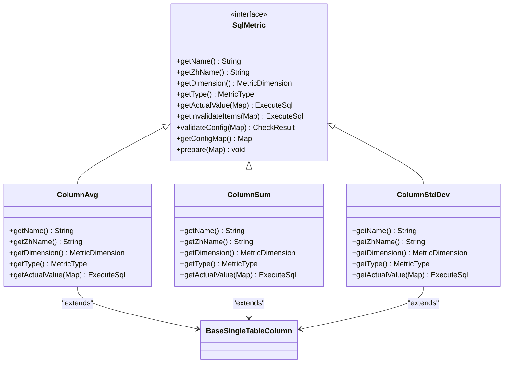
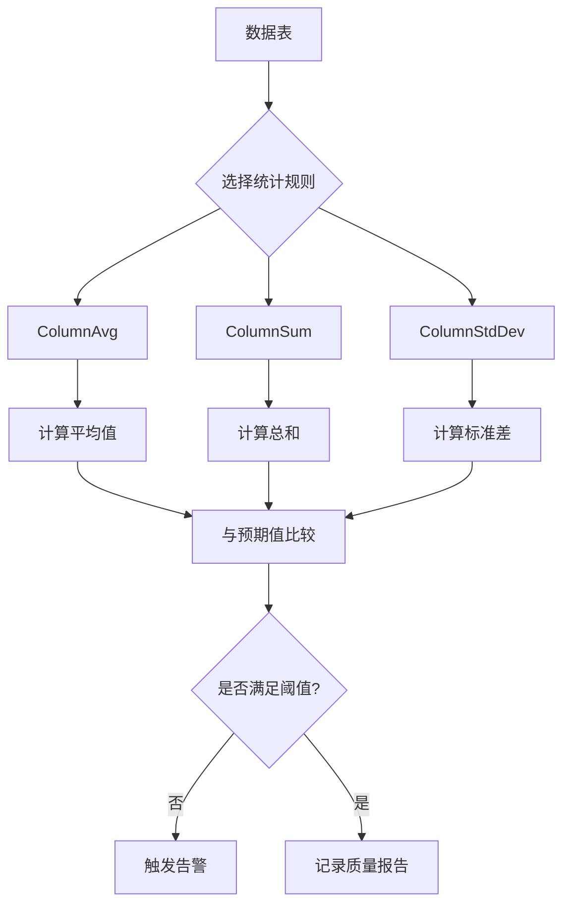

# 统计指标检查

<cite>
**本文档引用文件**  
- [ColumnAvg.java](file://datavines-metric/datavines-metric-plugins/datavines-metric-column-avg/src/main/java/io/datavines/metric/plugin/ColumnAvg.java)
- [ColumnSum.java](file://datavines-metric/datavines-metric-plugins/datavines-metric-column-sum/src/main/java/io/datavines/metric/plugin/ColumnSum.java)
- [ColumnStdDev.java](file://datavines-metric/datavines-metric-plugins/datavines-metric-column-std-dev/src/main/java/io/datavines/metric/plugin/ColumnStdDev.java)
- [SqlMetric.java](file://datavines-metric/datavines-metric-api/src/main/java/io/datavines/metric/api/SqlMetric.java)
- [MetricConstants.java](file://datavines-metric/datavines-metric-api/src/main/java/io/datavines/metric/api/MetricConstants.java)
- [ColumnInfo.java](file://datavines-metric/datavines-metric-api/src/main/java/io/datavines/metric/api/ColumnInfo.java)
- [MetricType.java](file://datavines-metric/datavines-metric-api/src/main/java/io/datavines/metric/api/MetricType.java)
</cite>

## 目录
1. [引言](#引言)
2. [核心统计规则解析](#核心统计规则解析)
3. [数据质量监控中的应用](#数据质量监控中的应用)
4. [计算优化与执行策略](#计算优化与执行策略)
5. [行业应用案例](#行业应用案例)
6. [性能调优指南](#性能调优指南)
7. [结论](#结论)

## 引言
本文档全面解析DataVines平台中ColumnAvg、ColumnSum和ColumnStdDev等核心统计指标检查规则的实现机制与应用场景。这些规则作为数据质量监控体系的重要组成部分，通过量化分析手段保障数据的完整性、一致性与可靠性。文档深入剖析其计算逻辑、适用场景及系统集成方式，为开发者和数据工程师提供详尽的技术参考。

## 核心统计规则解析

### ColumnAvg（平均值检查）
`ColumnAvg`类实现了对指定数值型列的平均值计算功能，继承自`BaseSingleTableColumn`基类并实现`SqlMetric`接口。该规则通过调用连接器工厂生成特定数据库方言的AVG聚合SQL语句，在执行时可附加过滤条件以支持条件平均值计算。其维度归类为“完整性”，仅适用于`NUMERIC_TYPE`数据类型。

**统计逻辑**：  
使用标准SQL `AVG()`函数计算列值的算术平均数，自动忽略NULL值。结果通过`getActualValue`方法返回封装后的`ExecuteSql`对象，包含唯一键标识和目标结果表名。

**Section sources**
- [ColumnAvg.java](file://datavines-metric/datavines-metric-plugins/datavines-metric-column-avg/src/main/java/io/datavines/metric/plugin/ColumnAvg.java#L33-L92)

### ColumnSum（总值检查）
`ColumnSum`类用于计算指定数值列的总和，同样实现`SqlMetric`接口并遵循单表列级指标规范。其核心逻辑调用底层连接器的`sumActualValue`方法生成SUM聚合SQL，支持动态过滤条件拼接，确保计算过程可追溯且可配置。

**统计逻辑**：  
采用SQL `SUM()`聚合函数对非空数值进行累加。与`ColumnAvg`类似，通过`METRIC_UNIQUE_KEY`保证任务执行的唯一性，并将中间结果写入临时结果表以便后续验证与比对。

**Section sources**
- [ColumnSum.java](file://datavines-metric/datavines-metric-plugins/datavines-metric-column-sum/src/main/java/io/datavines/metric/plugin/ColumnSum.java#L31-L88)

### ColumnStdDev（标准差检查）
`ColumnStdDev`类提供列值离散程度的度量能力，反映数据分布的波动性。其实现依赖于数据库内置的标准差函数（如STDDEV或STDDEV_SAMP），通过`getActualValue`构造专用SQL完成计算。

**统计逻辑**：  
利用SQL标准差函数评估数据集相对于均值的偏离程度。高标准差表明数据分布分散，可能提示异常值或数据质量问题；低标准差则表示数据集中稳定。此指标在金融风控、质量检测等领域具有重要价值。

**Section sources**
- [ColumnStdDev.java](file://datavines-metric/datavines-metric-plugins/datavines-metric-column-std-dev/src/main/java/io/datavines/metric/plugin/ColumnStdDev.java#L31-L88)

### 接口契约与配置体系
所有统计规则均实现`SqlMetric`接口，统一定义了名称获取、维度分类、SQL生成、参数校验等核心方法。`MetricConstants`中预定义了结果表结构（`RESULT_COLUMN_LIST`），确保各指标输出格式一致，便于统一存储与分析。

**Diagram sources**  
- [SqlMetric.java](file://datavines-metric/datavines-metric-api/src/main/java/io/datavines/metric/api/SqlMetric.java#L29-L112)
- [ColumnAvg.java](file://datavines-metric/datavines-metric-plugins/datavines-metric-column-avg/src/main/java/io/datavines/metric/plugin/ColumnAvg.java#L33-L92)
- [ColumnSum.java](file://datavines-metric/datavines-metric-plugins/datavines-metric-column-sum/src/main/java/io/datavines/metric/plugin/ColumnSum.java#L31-L88)
- [ColumnStdDev.java](file://datavines-metric/datavines-metric-plugins/datavines-metric-column-std-dev/src/main/java/io/datavines/metric/plugin/ColumnStdDev.java#L31-L88)

## 数据质量监控中的应用

### 均值异常检测
通过定期执行`ColumnAvg`检查，建立关键业务指标（如订单金额、用户活跃时长）的历史均值基线。结合预期值插件（如`daily-avg`或`weekly-avg`），系统可自动识别显著偏离正常范围的数据波动，及时触发告警。

**应用场景**：电商平台监控日均交易额，防止因系统故障或刷单行为导致的数据异常。

### 总量核对
`ColumnSum`广泛应用于财务对账、库存盘点等强一致性场景。通过对交易流水、库存变动等字段求和，并与外部系统或历史累计值比对，可快速发现数据丢失或重复记录问题。

**应用场景**：银行每日核对总交易额，确保账务系统数据完整无误。

### 离散程度评估
`ColumnStdDev`帮助识别数据分布的稳定性。在数据接入初期，若某字段标准差突然增大，可能意味着数据源格式变更或采集逻辑错误；长期跟踪标准差趋势还可辅助发现潜在的数据漂移问题。

**应用场景**：物联网平台监控传感器读数的标准差，判断设备运行状态是否正常。

**Diagram sources**  
- [ColumnAvg.java](file://datavines-metric/datavines-metric-plugins/datavines-metric-column-avg/src/main/java/io/datavines/metric/plugin/ColumnAvg.java#L72-L85)
- [ColumnSum.java](file://datavines-metric/datavines-metric-plugins/datavines-metric-column-sum/src/main/java/io/datavines/metric/plugin/ColumnSum.java#L68-L81)
- [ColumnStdDev.java](file://datavines-metric/datavines-metric-plugins/datavines-metric-column-std-dev/src/main/java/io/datavines/metric/plugin/ColumnStdDev.java#L68-L81)

## 计算优化与执行策略

### 浮点数精度处理
系统通过数据库原生聚合函数执行计算，精度由底层存储引擎保障。建议在配置阶段明确字段的数据类型与精度要求，避免因类型转换引发精度损失。对于高精度计算需求，可结合`DECIMAL`类型字段使用。

### 大数据量下的计算优化
- **过滤下推**：在`getActualValue`中支持`filters`条件拼接，将WHERE子句直接嵌入聚合SQL，减少扫描数据量。
- **索引利用**：确保被检查列已建立适当索引，尤其对于频繁查询的高基数列。
- **分区剪枝**：当表按时间或其他维度分区时，SQL生成器应自动利用分区信息缩小扫描范围。

### 分布式环境中的执行策略
在Spark或Flink等分布式引擎中执行时，`EngineExecutor`将SQL任务提交至集群，利用并行计算能力加速大规模数据处理。通过`Livy`或`Yarn`调度平台实现资源隔离与任务监控，确保高并发场景下的稳定性。

**Section sources**
- [BaseSingleTableColumn.java](file://datavines-metric/datavines-metric-plugins/datavines-metric-base/src/main/java/io/datavines/metric/plugin/base/BaseSingleTableColumn.java)
- [EngineExecutor.java](file://datavines-engine/datavines-engine-api/src/main/java/io/datavines/engine/api/engine/EngineExecutor.java)

## 行业应用案例

### 金融行业：交易数据完整性验证
某银行使用`ColumnSum`规则每日核对核心交易系统的总交易额，与清算系统进行交叉验证。一旦发现差异超过0.1%，立即启动异常排查流程，有效防止了因数据同步延迟导致的账务不平问题。

### 电商行业：用户行为分析质量保障
电商平台采用`ColumnAvg`监控用户日均停留时长，结合`ColumnStdDev`分析用户行为离散度。当标准差异常升高时，提示可能存在爬虫流量或A/B测试配置错误，保障分析结果的准确性。

### 制造业：设备传感器数据监控
工厂物联网系统利用`ColumnStdDev`持续监测关键设备的温度、振动等传感器读数。当标准差超过预设阈值时，表明设备运行状态不稳定，系统自动通知运维人员进行检查，实现预测性维护。

## 性能调优指南

### SQL生成优化
- 避免在`filters`中使用复杂表达式或函数，影响执行计划生成。
- 对于超大表，建议配合采样策略（如`TABLESAMPLE`）进行近似计算，平衡精度与性能。

### 资源配置建议
- 在`datavines-engine-config`中合理设置执行超时时间与内存限制。
- 对于高频检查任务，采用异步执行模式，避免阻塞主线程。

### 监控与诊断
- 启用SQL执行日志，分析慢查询并优化执行计划。
- 利用`JobExecutionLog`跟踪任务执行耗时，识别性能瓶颈。

## 结论
`ColumnAvg`、`ColumnSum`和`ColumnStdDev`作为DataVines平台的基础统计指标，为数据质量监控提供了强有力的量化工具。通过标准化接口设计与灵活的执行框架，这些规则能够高效集成至各类数据环境中，支撑起从基础校验到深度分析的多层次质量保障体系。未来可进一步扩展支持加权平均、分位数等高级统计函数，提升系统的分析能力。