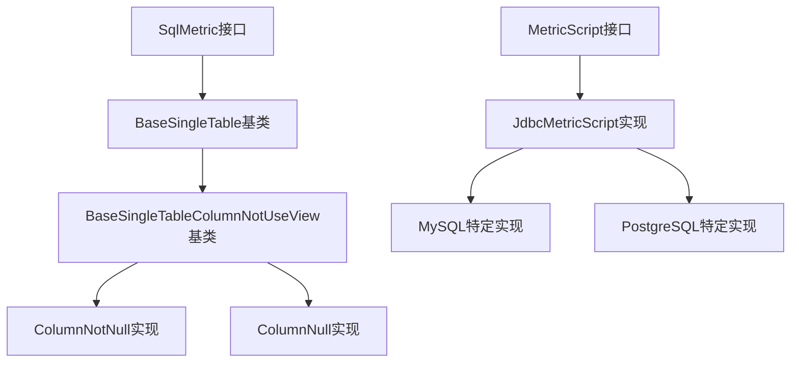
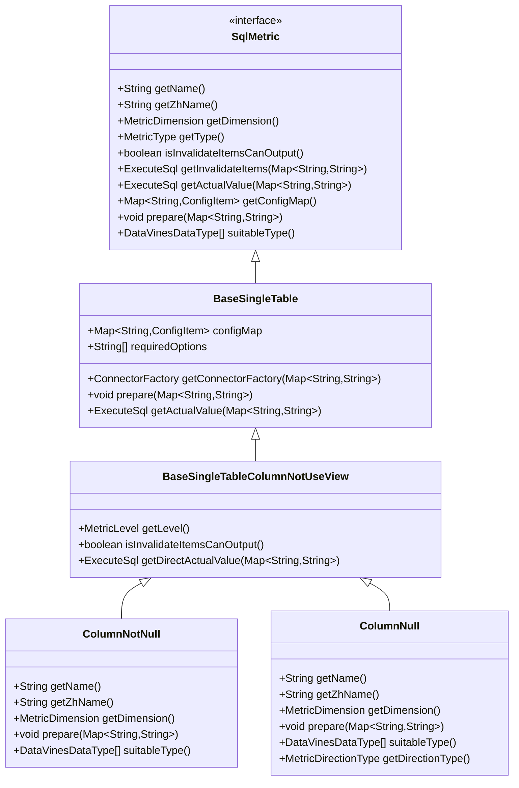
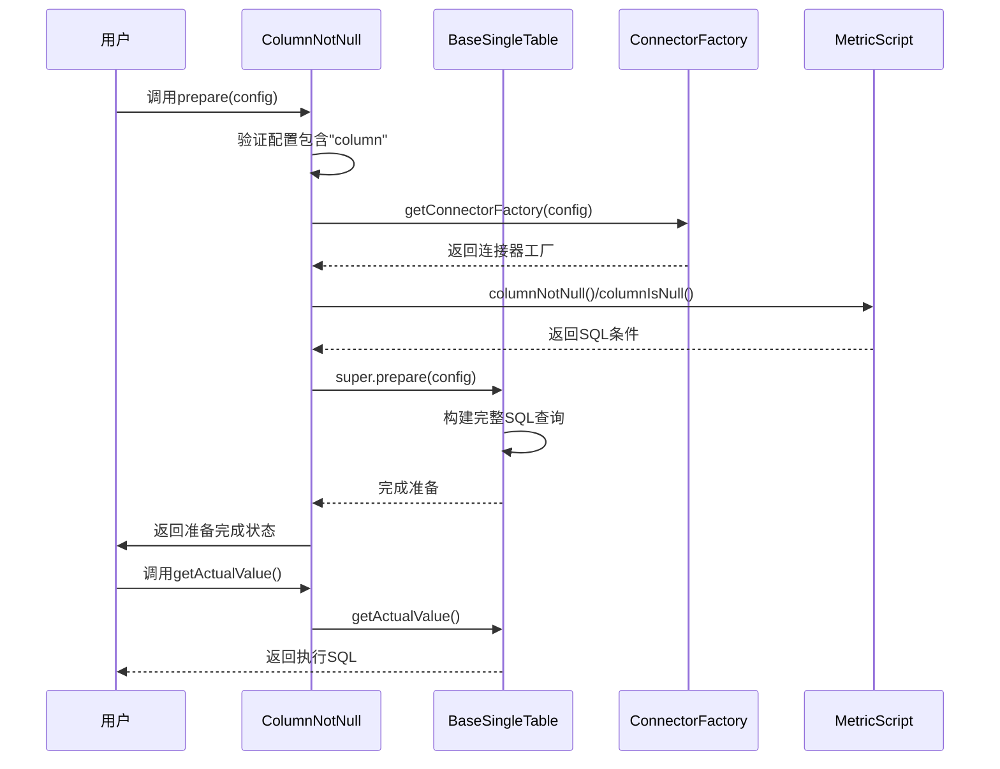
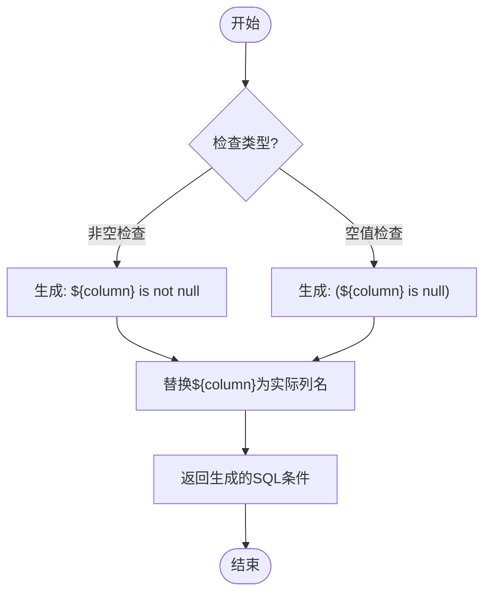
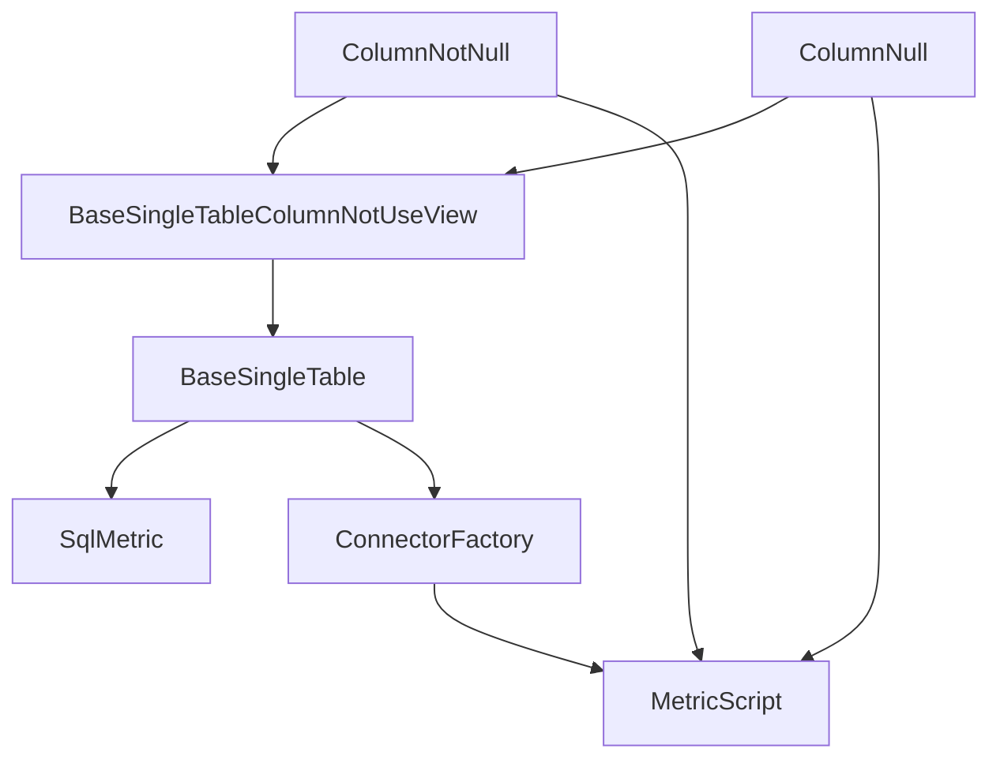

# 非空/空值检查

<cite>
**本文档引用的文件**
- [ColumnNotNull.java](file://datavines-metric\datavines-metric-plugins\datavines-metric-column-not-null\src\main\java\io\datavines\metric\plugin\ColumnNotNull.java)
- [ColumnNull.java](file://datavines-metric\datavines-metric-plugins\datavines-metric-column-null\src\main\java\io\datavines\metric\plugin\ColumnNull.java)
- [BaseSingleTableColumnNotUseView.java](file://datavines-metric\datavines-metric-plugins\datavines-metric-base\src\main\java\io\datavines\metric\plugin\base\BaseSingleTableColumnNotUseView.java)
- [MetricScript.java](file://datavines-connector\datavines-connector-api\src\main\java\io\datavines\connector\api\MetricScript.java)
- [SqlMetric.java](file://datavines-metric\datavines-metric-api\src\main\java\io\datavines\metric\api\SqlMetric.java)
- [JdbcMetricScript.java](file://datavines-connector\datavines-connector-plugins\datavines-connector-jdbc\src\main\java\io\datavines\connector\plugin\JdbcMetricScript.java)
</cite>

## 目录
1. [介绍](#介绍)
2. [核心组件](#核心组件)
3. [架构概述](#架构概述)
4. [详细组件分析](#详细组件分析)
5. [依赖分析](#依赖分析)
6. [性能考虑](#性能考虑)
7. [故障排除指南](#故障排除指南)
8. [结论](#结论)

## 介绍
DataVines是一个数据质量监控系统，提供多种数据质量检查规则。其中，非空/空值检查是数据完整性验证的重要组成部分。本文档详细分析了`ColumnNotNull`和`ColumnNull`两个核心规则的实现原理、业务场景、SQL生成逻辑和执行流程。这两个规则分别用于检查数据库列中是否存在非空值和空值，是确保数据完整性和有效性的基础工具。

## 核心组件
`ColumnNotNull`和`ColumnNull`是DataVines中实现非空和空值检查的核心组件。它们都继承自`BaseSingleTableColumnNotUseView`基类，实现了`SqlMetric`接口。这两个组件通过生成相应的SQL查询来检查指定列的空值或非空值情况，并返回检查结果。它们的主要区别在于检查的条件相反：`ColumnNotNull`检查列中非空值的数量，而`ColumnNull`检查列中空值的数量。

**组件来源**
- [ColumnNotNull.java](file://datavines-metric\datavines-metric-plugins\datavines-metric-column-not-null\src\main\java\io\datavines\metric\plugin\ColumnNotNull.java)
- [ColumnNull.java](file://datavines-metric\datavines-metric-plugins\datavines-metric-column-null\src\main\java\io\datavines\metric\plugin\ColumnNull.java)

## 架构概述
非空/空值检查规则的架构基于插件化设计模式，通过继承基类和实现接口来提供一致的API。整个架构分为三层：接口层、基类层和具体实现层。接口层定义了所有度量规则的通用行为，基类层提供了通用的功能实现，而具体实现层则针对特定的检查需求进行定制化开发。

**图表来源**
- [SqlMetric.java](file://datavines-metric\datavines-metric-api\src\main\java\io\datavines\metric\api\SqlMetric.java)
- [BaseSingleTable.java](file://datavines-metric\datavines-metric-plugins\datavines-metric-base\src\main\java\io\datavines\metric\plugin\base\BaseSingleTable.java)
- [BaseSingleTableColumnNotUseView.java](file://datavines-metric\datavines-metric-plugins\datavines-metric-base\src\main\java\io\datavines\metric\plugin\base\BaseSingleTableColumnNotUseView.java)

## 详细组件分析

### ColumnNotNull和ColumnNull分析
`ColumnNotNull`和`ColumnNull`是两个对称的检查规则，分别用于验证数据列中的非空值和空值。它们的实现结构相似，都通过继承`BaseSingleTableColumnNotUseView`基类来获得基本功能，并重写特定方法来实现各自的业务逻辑。

#### 类图分析

**图表来源**
- [SqlMetric.java](file://datavines-metric\datavines-metric-api\src\main\java\io\datavines\metric\api\SqlMetric.java)
- [BaseSingleTable.java](file://datavines-metric\datavines-metric-plugins\datavines-metric-base\src\main\java\io\datavines\metric\plugin\base\BaseSingleTable.java)
- [BaseSingleTableColumnNotUseView.java](file://datavines-metric\datavines-metric-plugins\datavines-metric-base\src\main\java\io\datavines\metric\plugin\base\BaseSingleTableColumnNotUseView.java)
- [ColumnNotNull.java](file://datavines-metric\datavines-metric-plugins\datavines-metric-column-not-null\src\main\java\io\datavines\metric\plugin\ColumnNotNull.java)
- [ColumnNull.java](file://datavines-metric\datavines-metric-plugins\datavines-metric-column-null\src\main\java\io\datavines\metric\plugin\ColumnNull.java)

#### 执行流程分析
非空/空值检查的执行流程遵循标准的数据质量检查模式，从配置准备到SQL生成再到结果返回。`ColumnNotNull`和`ColumnNull`的执行流程相似，主要区别在于生成的SQL条件不同。

**图表来源**
- [ColumnNotNull.java](file://datavines-metric\datavines-metric-plugins\datavines-metric-column-not-null\src\main\java\io\datavines\metric\plugin\ColumnNotNull.java)
- [ColumnNull.java](file://datavines-metric\datavines-metric-plugins\datavines-metric-column-null\src\main\java\io\datavines\metric\plugin\ColumnNull.java)
- [BaseSingleTable.java](file://datavines-metric\datavines-metric-plugins\datavines-metric-base\src\main\java\io\datavines\metric\plugin\base\BaseSingleTable.java)

#### SQL生成逻辑分析
非空/空值检查的核心在于SQL条件的生成。`MetricScript`接口提供了`columnNotNull()`和`columnIsNull()`两个默认方法，用于生成相应的SQL条件。这些方法使用模板字符串，通过替换`${column}`占位符来生成具体的SQL条件。

**图表来源**
- [MetricScript.java](file://datavines-connector\datavines-connector-api\src\main\java\io\datavines\connector\api\MetricScript.java)

## 依赖分析
非空/空值检查规则依赖于多个核心组件和接口，形成了一个完整的依赖链。主要依赖包括`SqlMetric`接口、`BaseSingleTable`基类、`BaseSingleTableColumnNotUseView`基类以及`MetricScript`接口。

**图表来源**
- [ColumnNotNull.java](file://datavines-metric\datavines-metric-plugins\datavines-metric-column-not-null\src\main\java\io\datavines\metric\plugin\ColumnNotNull.java)
- [ColumnNull.java](file://datavines-metric\datavines-metric-plugins\datavines-metric-column-null\src\main\java\io\datavines\metric\plugin\ColumnNull.java)
- [BaseSingleTableColumnNotUseView.java](file://datavines-metric\datavines-metric-plugins\datavines-metric-base\src\main\java\io\datavines\metric\plugin\base\BaseSingleTableColumnNotUseView.java)
- [BaseSingleTable.java](file://datavines-metric\datavines-metric-plugins\datavines-metric-base\src\main\java\io\datavines\metric\plugin\base\BaseSingleTable.java)
- [SqlMetric.java](file://datavines-metric\datavines-metric-api\src\main\java\io\datavines\metric\api\SqlMetric.java)
- [MetricScript.java](file://datavines-connector\datavines-connector-api\src\main\java\io\datavines\connector\api\MetricScript.java)

## 性能考虑
在使用非空/空值检查规则时，需要考虑以下性能因素：

1. **索引利用**：对于大表的空值检查，如果被检查的列上有索引，查询性能会显著提高。数据库优化器可以利用索引快速定位空值或非空值记录。

2. **数据量影响**：随着表中数据量的增加，COUNT查询的执行时间也会相应增加。对于超大表，建议在非高峰时段执行此类检查。

3. **并发控制**：在高并发环境下执行大量数据质量检查可能会影响数据库的整体性能，需要合理安排检查任务的执行时间。

4. **缓存策略**：对于频繁执行的检查任务，可以考虑实现结果缓存机制，避免重复执行相同的查询。

5. **分区表优化**：对于分区表，可以针对特定分区执行检查，而不是扫描整个表，从而提高查询效率。

## 故障排除指南
在使用非空/空值检查规则时，可能会遇到以下常见问题及解决方案：

1. **配置错误**：确保配置中包含必需的"column"参数。缺少此参数会导致检查无法执行。

2. **列名不存在**：检查指定的列名是否存在于目标表中，列名区分大小写，需要确保完全匹配。

3. **权限不足**：确保执行检查的数据库用户具有查询目标表的权限。

4. **连接问题**：检查数据库连接配置是否正确，包括主机名、端口、用户名和密码。

5. **性能问题**：如果检查执行时间过长，考虑在被检查的列上创建索引，或在数据量较小的时间段执行检查。

6. **结果不准确**：确认数据库的空值定义是否与检查规则一致，某些数据库可能对空字符串和NULL值有不同的处理方式。

**组件来源**
- [ColumnNotNull.java](file://datavines-metric\datavines-metric-plugins\datavines-metric-column-not-null\src\main\java\io\datavines\metric\plugin\ColumnNotNull.java)
- [ColumnNull.java](file://datavines-metric\datavines-metric-plugins\datavines-metric-column-null\src\main\java\io\datavines\metric\plugin\ColumnNull.java)

## 结论
`ColumnNotNull`和`ColumnNull`是非空/空值检查的核心实现，通过继承基类和实现接口的方式提供了灵活而强大的数据质量检查功能。这两个规则利用模板化的SQL生成机制，能够适应不同的数据库类型和配置需求。其设计遵循了良好的面向对象原则，具有高内聚、低耦合的特点，便于维护和扩展。通过合理使用这些规则，可以有效保证数据的完整性和有效性，为数据驱动的业务决策提供可靠的基础。