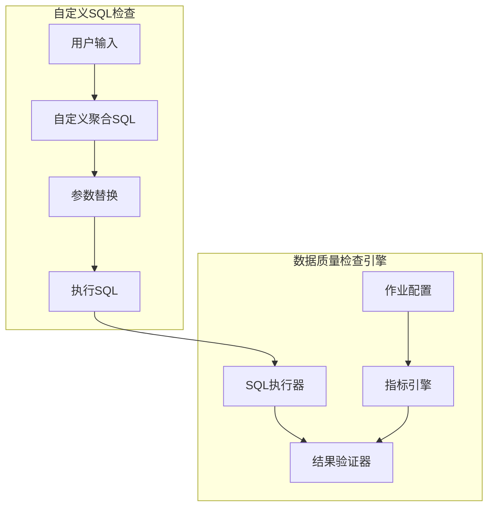
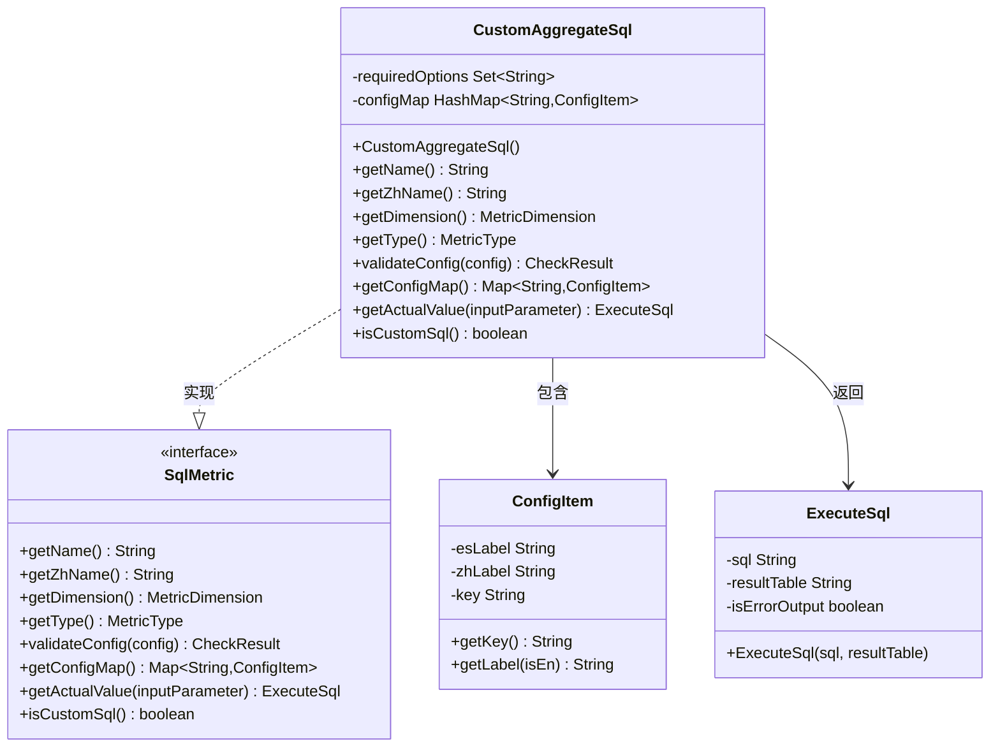
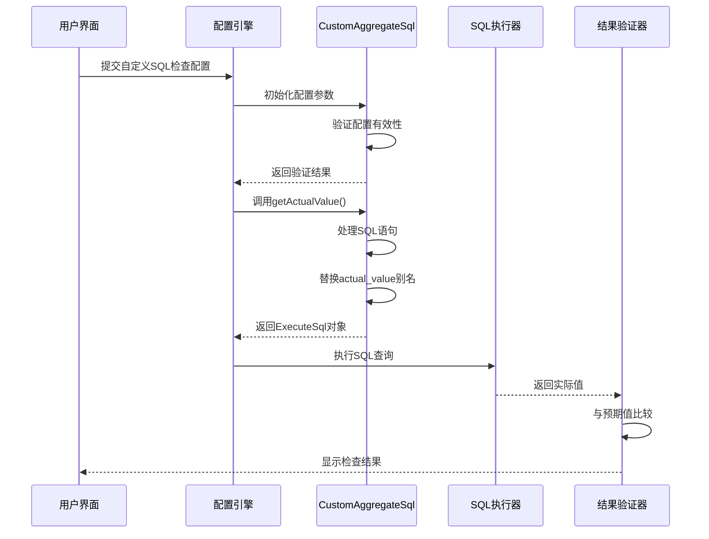
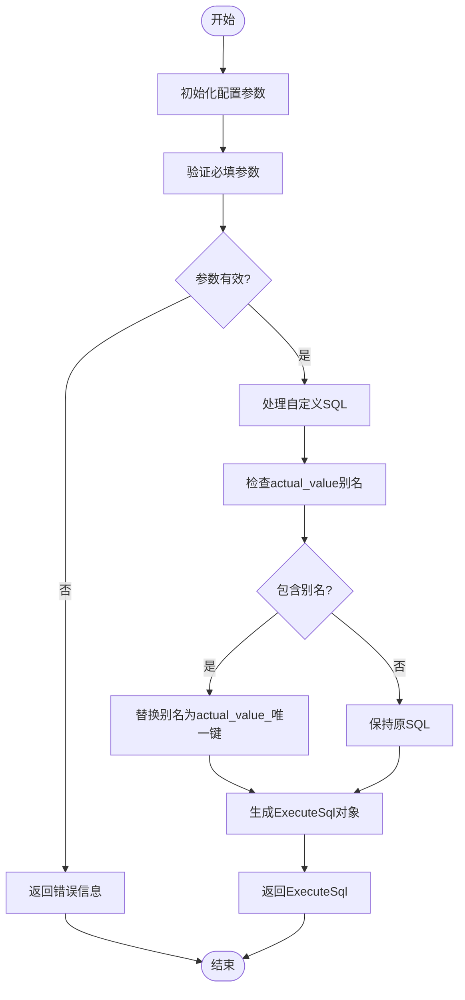

# 自定义SQL检查规则

<cite>
**本文档引用的文件**   
- [CustomAggregateSql.java](file://datavines-metric\datavines-metric-plugins\datavines-metric-custom-aggregate-sql\src\main\java\io\datavines\metric\plugin\CustomAggregateSql.java)
- [SqlMetric.java](file://datavines-metric\datavines-metric-api\src\main\java\io\datavines\metric\api\SqlMetric.java)
- [ExecuteSql.java](file://datavines-common\src\main\java\io\datavines\common\entity\ExecuteSql.java)
- [MetricParserUtils.java](file://datavines-engine\datavines-engine-config\src\main\java\io\datavines\engine\config\MetricParserUtils.java)
- [ConfigConstants.java](file://datavines-common\src\main\java\io\datavines\common\ConfigConstants.java)
- [ConfigItem.java](file://datavines-metric\datavines-metric-api\src\main\java\io\datavines\metric\api\ConfigItem.java)
- [BaseJobConfigurationBuilder.java](file://datavines-engine\datavines-engine-config\src\main\java\io\datavines\engine\config\BaseJobConfigurationBuilder.java)
- [ExpectedValue.java](file://datavines-metric\datavines-metric-api\src\main\java\io\datavines\metric\api\ExpectedValue.java)
</cite>

## 目录
1. [简介](#简介)
2. [核心组件分析](#核心组件分析)
3. [架构概述](#架构概述)
4. [详细组件分析](#详细组件分析)
5. [依赖分析](#依赖分析)
6. [性能考虑](#性能考虑)
7. [故障排除指南](#故障排除指南)
8. [结论](#结论)

## 简介
本文档详细介绍了DataVines数据质量检查框架中的自定义聚合SQL检查规则的实现机制。该规则允许用户通过编写自定义的聚合SQL语句来实现灵活的数据质量验证，适用于各种复杂的业务场景。文档将深入分析CustomAggregateSql规则的实现原理、参数配置、执行流程以及最佳实践。

## 核心组件分析

自定义SQL检查规则的核心实现位于`CustomAggregateSql`类中，该类实现了`SqlMetric`接口，提供了灵活的数据质量检查能力。通过分析代码结构，可以理解其如何将用户定义的SQL语句集成到数据质量检查流程中。

**本节来源**
- [CustomAggregateSql.java](file://datavines-metric\datavines-metric-plugins\datavines-metric-custom-aggregate-sql\src\main\java\io\datavines\metric\plugin\CustomAggregateSql.java)
- [SqlMetric.java](file://datavines-metric\datavines-metric-api\src\main\java\io\datavines\metric\api\SqlMetric.java)

## 架构概述



**图表来源**
- [CustomAggregateSql.java](file://datavines-metric\datavines-metric-plugins\datavines-metric-custom-aggregate-sql\src\main\java\io\datavines\metric\plugin\CustomAggregateSql.java)
- [SqlMetric.java](file://datavines-metric\datavines-metric-api\src\main\java\io\datavines\metric\api\SqlMetric.java)

## 详细组件分析

### CustomAggregateSql类分析

#### 类图


**图表来源**
- [CustomAggregateSql.java](file://datavines-metric\datavines-metric-plugins\datavines-metric-custom-aggregate-sql\src\main\java\io\datavines\metric\plugin\CustomAggregateSql.java)
- [SqlMetric.java](file://datavines-metric\datavines-metric-api\src\main\java\io\datavines\metric\api\SqlMetric.java)
- [ConfigItem.java](file://datavines-metric\datavines-metric-api\src\main\java\io\datavines\metric\api\ConfigItem.java)
- [ExecuteSql.java](file://datavines-common\src\main\java\io\datavines\common\entity\ExecuteSql.java)

#### 执行流程分析



**图表来源**
- [CustomAggregateSql.java](file://datavines-metric\datavines-metric-plugins\datavines-metric-custom-aggregate-sql\src\main\java\io\datavines\metric\plugin\CustomAggregateSql.java)
- [BaseJobConfigurationBuilder.java](file://datavines-engine\datavines-engine-config\src\main\java\io\datavines\engine\config\BaseJobConfigurationBuilder.java)
- [MetricParserUtils.java](file://datavines-engine\datavines-engine-config\src\main\java\io\datavines\engine\config\MetricParserUtils.java)

#### 配置参数处理流程



**图表来源**
- [CustomAggregateSql.java](file://datavines-metric\datavines-metric-plugins\datavines-metric-custom-aggregate-sql\src\main\java\io\datavines\metric\plugin\CustomAggregateSql.java)
- [ConfigConstants.java](file://datavines-common\src\main\java\io\datavines\common\ConfigConstants.java)

**本节来源**
- [CustomAggregateSql.java](file://datavines-metric\datavines-metric-plugins\datavines-metric-custom-aggregate-sql\src\main\java\io\datavines\metric\plugin\CustomAggregateSql.java)
- [SqlMetric.java](file://datavines-metric\datavines-metric-api\src\main\java\io\datavines\metric\api\SqlMetric.java)
- [ExecuteSql.java](file://datavines-common\src\main\java\io\datavines\common\entity\ExecuteSql.java)
- [MetricParserUtils.java](file://datavines-engine\datavines-engine-config\src\main\java\io\datavines\engine\config\MetricParserUtils.java)

## 依赖分析

```mermaid
graph TD
CustomAggregateSql --> SqlMetric : 实现接口
CustomAggregateSql --> ConfigItem : 使用配置项
CustomAggregateSql --> ExecuteSql : 返回执行SQL
CustomAggregateSql --> ConfigChecker : 验证配置
CustomAggregateSql --> StringUtils : 字符串处理
BaseJobConfigurationBuilder --> CustomAggregateSql : 调用getActualValue
BaseJobConfigurationBuilder --> MetricParserUtils : 设置转换配置
MetricParserUtils --> PluginLoader : 加载插件
MetricParserUtils --> ParameterUtils : 参数替换
ExpectedValue --> PluginLoader : 加载预期值插件
style CustomAggregateSql fill:#f9f,stroke:#333
style SqlMetric fill:#bbf,stroke:#333,color:#fff
style ConfigItem fill:#f96,stroke:#333
style ExecuteSql fill:#6f9,stroke:#333
```

**图表来源**
- [CustomAggregateSql.java](file://datavines-metric\datavines-metric-plugins\datavines-metric-custom-aggregate-sql\src\main\java\io\datavines\metric\plugin\CustomAggregateSql.java)
- [BaseJobConfigurationBuilder.java](file://datavines-engine\datavines-engine-config\src\main\java\io\datavines\engine\config\BaseJobConfigurationBuilder.java)
- [MetricParserUtils.java](file://datavines-engine\datavines-engine-config\src\main\java\io\datavines\engine\config\MetricParserUtils.java)
- [ExpectedValue.java](file://datavines-metric\datavines-metric-api\src\main\java\io\datavines\metric\api\ExpectedValue.java)

**本节来源**
- [CustomAggregateSql.java](file://datavines-metric\datavines-metric-plugins\datavines-metric-custom-aggregate-sql\src\main\java\io\datavines\metric\plugin\CustomAggregateSql.java)
- [BaseJobConfigurationBuilder.java](file://datavines-engine\datavines-engine-config\src\main\java\io\datavines\engine\config\BaseJobConfigurationBuilder.java)
- [MetricParserUtils.java](file://datavines-engine\datavines-engine-config\src\main\java\io\datavines\engine\config\MetricParserUtils.java)

## 性能考虑

自定义SQL检查规则在设计时考虑了性能优化，通过以下机制确保高效执行：

1. **参数化查询**：使用参数占位符避免SQL注入，同时提高查询计划缓存效率
2. **唯一键处理**：为每个检查实例生成唯一键，避免并发执行时的命名冲突
3. **配置验证**：在执行前验证必填参数，减少无效执行
4. **结果表管理**：明确指定结果表名称，便于后续处理和清理

虽然自定义SQL提供了极大的灵活性，但用户应注意编写高效的SQL语句，避免全表扫描和复杂的连接操作，特别是在处理大规模数据集时。

## 故障排除指南

当自定义SQL检查规则出现问题时，可参考以下排查步骤：

1. **检查配置参数**：确保"actual_aggregate_sql"参数已正确配置
2. **验证SQL语法**：在目标数据库中测试SQL语句的正确性
3. **检查表名引用**：确认SQL中的表名与配置一致
4. **查看日志信息**：检查执行日志中的错误详情
5. **验证权限**：确保执行账户有足够权限访问相关表

**本节来源**
- [CustomAggregateSql.java](file://datavines-metric\datavines-metric-plugins\datavines-metric-custom-aggregate-sql\src\main\java\io\datavines\metric\plugin\CustomAggregateSql.java)
- [MetricParserUtils.java](file://datavines-engine\datavines-engine-config\src\main\java\io\datavines\engine\config\MetricParserUtils.java)

## 结论

自定义聚合SQL检查规则为DataVines框架提供了强大的灵活性，使用户能够根据特定业务需求创建复杂的数据质量检查。通过`CustomAggregateSql`类的实现，系统能够安全地执行用户定义的SQL语句，并将其集成到标准的数据质量检查流程中。该功能特别适用于需要复杂聚合逻辑、跨表关联分析或特定业务规则验证的场景，极大地扩展了数据质量检查的能力范围。