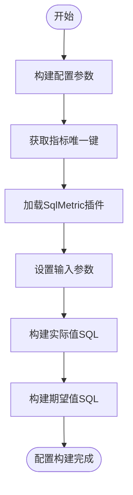
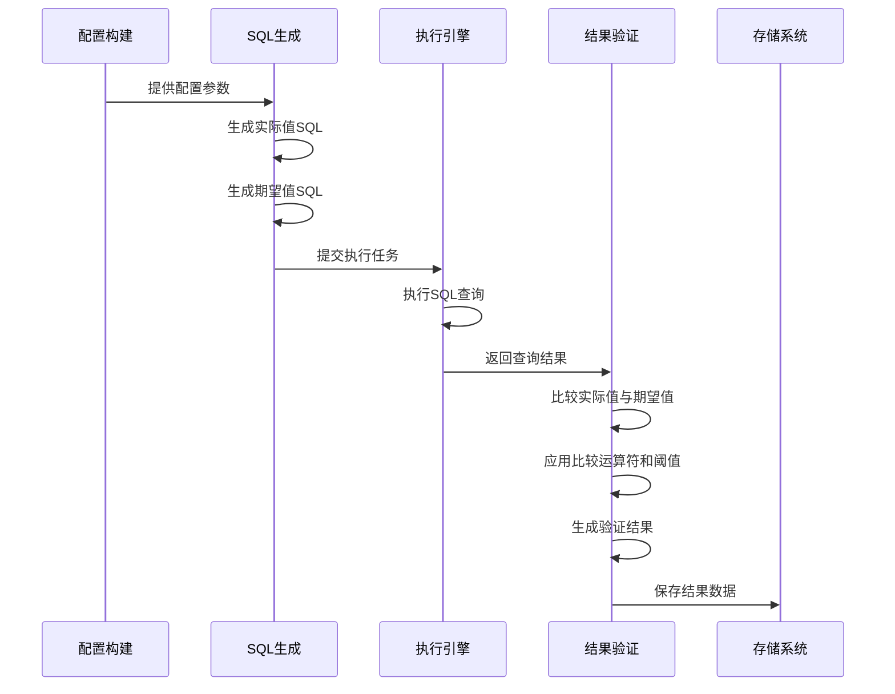

# 两表值比较检查

<cite>
**本文档引用的文件**
- [MultiTableValueComparison.java](file://datavines-metric\datavines-metric-plugins\datavines-metric-multi-table-value-comparison\src\main\java\io\datavines\metric\plugin\MultiTableValueComparison.java)
- [LocalMultiTableValueComparisonMetricBuilder.java](file://datavines-engine\datavines-engine-plugins\datavines-engine-local\datavines-engine-local-config\src\main\java\io\datavines\engine\local\config\LocalMultiTableValueComparisonMetricBuilder.java)
- [ConfigConstants.java](file://datavines-common\src\main\java\io\datavines\common\ConfigConstants.java)
- [CommonConstants.java](file://datavines-common\src\main\java\io\datavines\common\CommonConstants.java)
- [MetricConstants.java](file://datavines-metric\datavines-metric-api\src\main\java\io\datavines\metric\api\MetricConstants.java)
</cite>

## 目录
1. [介绍](#介绍)
2. [配置参数](#配置参数)
3. [执行逻辑与数据验证流程](#执行逻辑与数据验证流程)
4. [实际使用案例](#实际使用案例)
5. [常见问题解决方案](#常见问题解决方案)

## 介绍

两表值比较检查是一种用于验证两个数据表中特定字段数值一致性的数据质量检查方法。该功能主要用于数据迁移、数据同步或数据一致性验证等业务场景，通过比较源表和目标表中对应字段的数值差异，确保数据的准确性和完整性。

该功能属于DataVines数据质量框架中的多表值比较模块，其核心实现类为`MultiTableValueComparison`，该类实现了`SqlMetric`接口，提供了两表值比较的完整功能。该检查方法属于准确性（ACCURACY）维度，其指标类型为`MULTI_TABLE_VALUE_COMPARISON`。

**本节来源**
- [MultiTableValueComparison.java](file://datavines-metric\datavines-metric-plugins\datavines-metric-multi-table-value-comparison\src\main\java\io\datavines\metric\plugin\MultiTableValueComparison.java#L31-L51)

## 配置参数

两表值比较检查涉及多个关键配置参数，这些参数定义了比较的源表、目标表、比较字段、比较运算符和阈值等。以下是主要配置参数的详细说明：

- **源表配置**:
  - `table`: 源表名称
  - `datasource_id`: 源数据源ID
  - `column`: 源表比较字段
  - `actual_execute_sql`: 源表实际值查询SQL

- **目标表配置**:
  - `table2`: 目标表名称
  - `database2`: 目标数据库名称
  - `target_datasource_id`: 目标数据源ID
  - `target_column`: 目标表比较字段
  - `expected_execute_sql`: 目标表期望值查询SQL

- **比较规则配置**:
  - `operator`: 比较运算符，如等于(=)、大于(>)、小于(<)等
  - `threshold`: 阈值，用于定义可接受的差异范围
  - `result_formula`: 结果计算公式，定义如何计算比较结果
  - `mappingColumns`: 映射字段，用于连接两个表的关联字段

- **其他配置**:
  - `metric_unique_key`: 指标唯一键，用于标识特定的检查实例
  - `failure_strategy`: 失败策略，定义检查失败时的处理方式
  - `filter`: 源表过滤条件
  - `target_filter`: 目标表过滤条件

这些配置参数通过`ConfigConstants`和`CommonConstants`类中的常量定义，确保了配置的一致性和可维护性。

**本节来源**
- [ConfigConstants.java](file://datavines-common\src\main\java\io\datavines\common\ConfigConstants.java#L24-L54)
- [CommonConstants.java](file://datavines-common\src\main\java\io\datavines\common\CommonConstants.java#L177-L182)

## 执行逻辑与数据验证流程

两表值比较检查的执行逻辑主要由`MultiTableValueComparison`类和`LocalMultiTableValueComparisonMetricBuilder`类协同完成。整个流程可以分为配置构建、SQL生成、执行和结果验证四个阶段。

### 配置构建阶段

`LocalMultiTableValueComparisonMetricBuilder`类负责构建两表值比较所需的配置。该类继承自`BaseLocalConfigurationBuilder`，通过`buildTransformConfigs`方法构建转换配置。在构建过程中，系统会获取指标的唯一键，并从插件加载器中加载相应的`SqlMetric`实现。

**图表来源**
- [LocalMultiTableValueComparisonMetricBuilder.java](file://datavines-engine\datavines-engine-plugins\datavines-engine-local\datavines-engine-local-config\src\main\java\io\datavines\engine\local\config\LocalMultiTableValueComparisonMetricBuilder.java#L48-L84)

### SQL生成与执行阶段

在配置构建完成后，系统会生成用于获取实际值和期望值的SQL语句。`getActualValueExecuteSql`方法负责生成源表的查询SQL，而`getExceptedValueExecuteSql`方法负责生成目标表的查询SQL。这两个方法会根据输入参数中的`actual_execute_sql`和`expected_execute_sql`模板生成具体的SQL语句，并对结果列名进行唯一性处理，以避免列名冲突。

### 结果验证阶段

结果验证阶段由`buildSinkConfigs`方法处理，该方法构建了结果存储配置。系统会生成用于存储验证结果的SQL语句，这些语句会将实际值和期望值进行比较，并根据预设的比较运算符和阈值判断检查是否通过。验证结果会被存储到`dv_job_execution_result`表中，而实际值和期望值则会被存储到`dv_actual_values`表中。

**图表来源**
- [LocalMultiTableValueComparisonMetricBuilder.java](file://datavines-engine\datavines-engine-plugins\datavines-engine-local\datavines-engine-local-config\src\main\java\io\datavines\engine\local\config\LocalMultiTableValueComparisonMetricBuilder.java#L86-L102)
- [LocalMultiTableValueComparisonMetricBuilder.java](file://datavines-engine\datavines-engine-plugins\datavines-engine-local\datavines-engine-local-config\src\main\java\io\datavines\engine\local\config\LocalMultiTableValueComparisonMetricBuilder.java#L105-L139)

**本节来源**
- [LocalMultiTableValueComparisonMetricBuilder.java](file://datavines-engine\datavines-engine-plugins\datavines-engine-local\datavines-engine-local-config\src\main\java\io\datavines\engine\local\config\LocalMultiTableValueComparisonMetricBuilder.java#L48-L140)

## 实际使用案例

### 案例一：数据迁移验证

在将数据从旧系统迁移到新系统的场景中，可以使用两表值比较检查来验证迁移的准确性。假设需要验证用户表的数据迁移情况，可以配置如下参数：

- 源表: `old_system.users`
- 目标表: `new_system.users`
- 比较字段: `user_id`, `balance`
- 比较运算符: 等于(=)
- 阈值: 0 (要求完全一致)

系统会分别从两个表中查询用户余额，并比较对应用户ID的余额是否一致。如果所有用户的余额都一致，则检查通过；否则，检查失败并记录差异详情。

### 案例二：数据同步监控

在跨数据中心的数据同步场景中，可以使用两表值比较检查来监控数据同步的延迟和准确性。例如，监控订单表的同步情况：

- 源表: `primary_dc.orders`
- 目标表: `secondary_dc.orders`
- 比较字段: `order_id`, `total_amount`
- 比较运算符: 等于(=)
- 阈值: 0.01 (允许0.01的舍入误差)
- 过滤条件: `order_date = '${system.biz.date}'` (只比较当天的订单)

这种配置可以定期检查主备数据中心的订单数据是否一致，允许微小的舍入误差，但要求主要数据保持一致。

## 常见问题解决方案

### 问题一：列名冲突

**问题描述**: 当源表和目标表有相同名称的列时，可能会导致SQL执行错误。

**解决方案**: 在生成SQL时，系统会对实际值和期望值的列名添加唯一键后缀，如`actual_value_{metric_unique_key}`和`expected_value_{metric_unique_key}`，避免列名冲突。

### 问题二：数据类型不匹配

**问题描述**: 源表和目标表的比较字段数据类型不一致，导致比较失败。

**解决方案**: 在配置时确保两个字段的数据类型兼容，或在SQL查询中使用类型转换函数。例如，将字符串类型的数值转换为数值类型进行比较。

### 问题三：性能问题

**问题描述**: 当比较的表数据量很大时，查询性能可能成为瓶颈。

**解决方案**: 
1. 在比较字段上创建索引
2. 使用适当的过滤条件缩小数据范围
3. 考虑使用增量比较而非全量比较
4. 优化查询SQL，避免全表扫描

### 问题四：网络延迟影响

**问题描述**: 当源表和目标表位于不同的数据库实例时，网络延迟可能影响比较结果的实时性。

**解决方案**: 
1. 在非高峰时段执行比较
2. 增加合理的阈值以容忍短暂的数据不一致
3. 使用异步比较模式，将比较结果存储后进行分析

## 结论

两表值比较检查是DataVines数据质量框架中重要的数据验证工具，它通过系统化的配置和执行流程，确保了跨表数据的一致性和准确性。该功能具有良好的扩展性，支持多种数据源和数据库类型，并通过插件化架构实现了灵活的配置和执行。

通过合理配置比较参数和优化执行策略，两表值比较检查可以有效应用于数据迁移验证、数据同步监控、数据质量审计等多种业务场景，为数据驱动的决策提供可靠的质量保障。