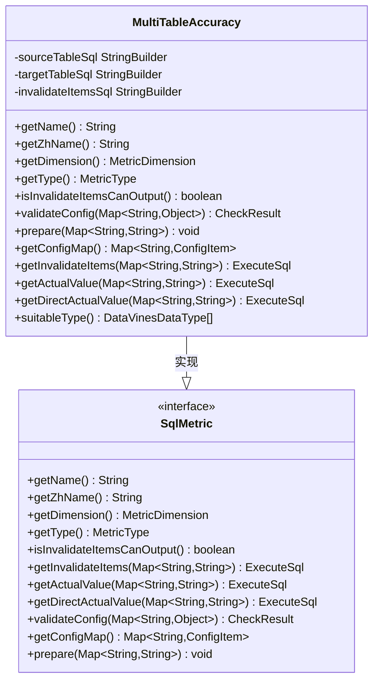
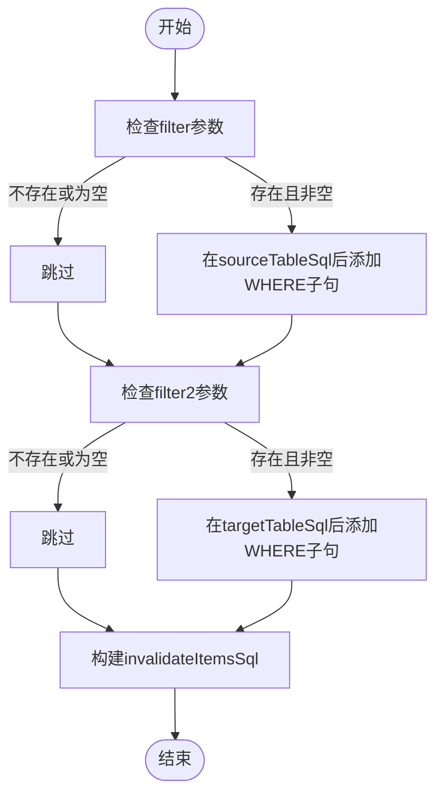
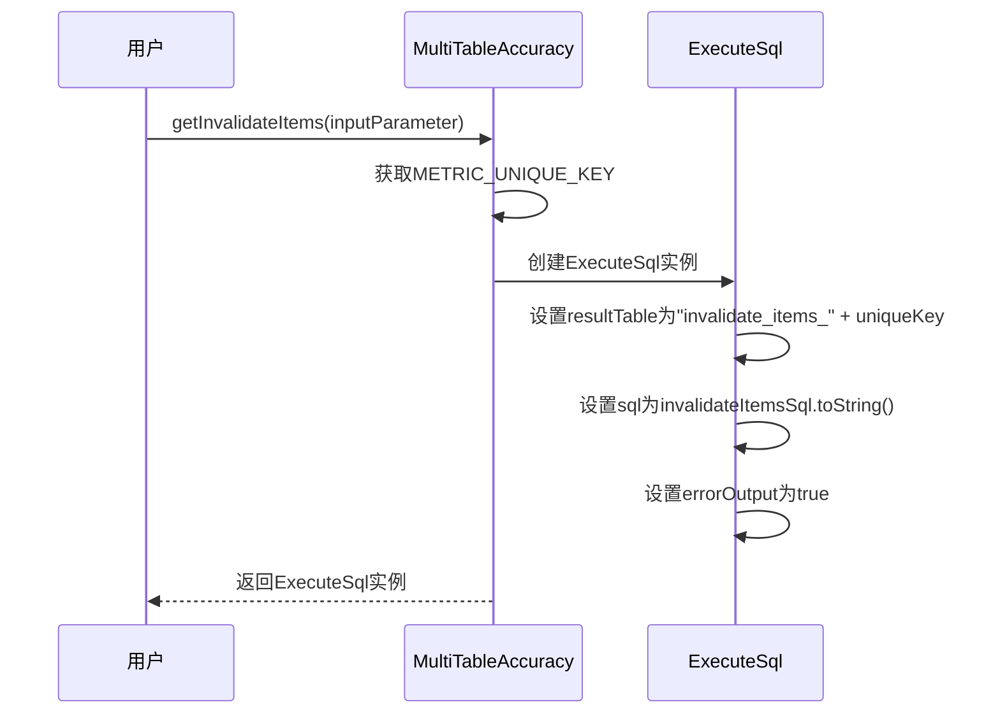
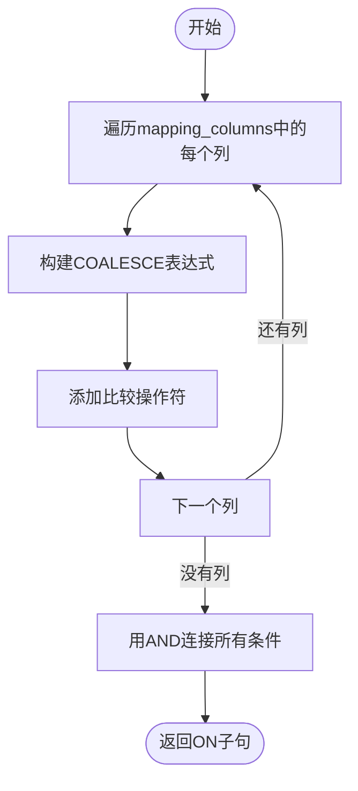
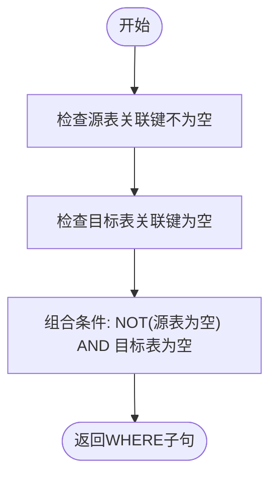

# 跨表准确性检查

<cite>
**本文档引用的文件**  
- [MultiTableAccuracy.java](file://datavines-metric\datavines-metric-plugins\datavines-metric-multi-table-accuracy\src\main\java\io\datavines\metric\plugin\MultiTableAccuracy.java)
- [SparkMultiTableAccuracyMetricBuilder.java](file://datavines-engine\datavines-engine-plugins\datavines-engine-spark\datavines-engine-spark-config\src\main\java\io\datavines\engine\spark\config\SparkMultiTableAccuracyMetricBuilder.java)
- [MetricParserUtils.java](file://datavines-engine\datavines-engine-config\src\main\java\io\datavines\engine\config\MetricParserUtils.java)
- [ConfigConstants.java](file://datavines-common\src\main\java\io\datavines\common\ConfigConstants.java)
- [SqlMetric.java](file://datavines-metric\datavines-metric-api\src\main\java\io\datavines\metric\api\SqlMetric.java)
- [submit_job_mysql_storage.json](file://datavines-runner\src\main\resources\submit_job_mysql_storage.json)
</cite>

## 目录
1. [引言](#引言)
2. [业务场景](#业务场景)
3. [配置参数说明](#配置参数说明)
4. [MultiTableAccuracy类实现分析](#multitableaccuracy类实现分析)
5. [数据比对算法与结果计算](#数据比对算法与结果计算)
6. [配置示例与使用场景](#配置示例与使用场景)
7. [大数据量下的性能优化建议](#大数据量下的性能优化建议)
8. [结论](#结论)

## 引言

跨表准确性检查是DataVines数据质量框架中的一个重要功能，用于验证两个数据表之间的数据一致性。该功能通过比较源表和目标表的数据，识别出不一致的记录，并提供详细的错误数据输出。本文档将深入分析跨表准确性检查的实现原理、配置方法和使用场景，为用户提供全面的技术指导。

**本节来源**  
- [MultiTableAccuracy.java](file://datavines-metric\datavines-metric-plugins\datavines-metric-multi-table-accuracy\src\main\java\io\datavines\metric\plugin\MultiTableAccuracy.java)

## 业务场景

跨表准确性检查适用于多种数据质量验证场景，主要包括：

1. **数据迁移验证**：在数据从一个系统迁移到另一个系统后，验证源表和目标表的数据是否一致。
2. **数据同步监控**：在实时或批量数据同步过程中，定期检查源端和目标端的数据一致性。
3. **ETL过程验证**：在ETL（抽取、转换、加载）流程中，验证转换前后的数据是否保持一致。
4. **数据备份验证**：验证主数据库和备份数据库之间的数据一致性。
5. **多源数据整合**：在将多个数据源整合到一个目标表时，验证整合过程的准确性。

这些场景都需要确保数据在不同表之间的准确性和完整性，跨表准确性检查功能能够有效满足这些需求。

**本节来源**  
- [MultiTableAccuracy.java](file://datavines-metric\datavines-metric-plugins\datavines-metric-multi-table-accuracy\src\main\java\io\datavines\metric\plugin\MultiTableAccuracy.java)

## 配置参数说明

跨表准确性检查功能通过一系列配置参数来定义数据比对的规则和条件。以下是主要配置参数的详细说明：

### 核心配置参数

| 参数名称 | 描述 | 示例 |
|--------|------|------|
| `table` | 源表名称 | `"users"` |
| `table2` | 目标表名称 | `"users_backup"` |
| `database` | 源表所在数据库 | `"production"` |
| `database2` | 目标表所在数据库 | `"backup"` |
| `mapping_columns` | 映射列配置，定义源表和目标表之间的列对应关系 | `[{"column":"id","column2":"user_id"},{"column":"name","column2":"full_name"}]` |
| `filter` | 源表过滤条件 | `"status = 'active'"` |
| `filter2` | 目标表过滤条件 | `"deleted = 0"` |

### 关联键配置

关联键是跨表准确性检查的核心，用于确定源表和目标表中哪些记录应该进行比较。关联键通过`mapping_columns`参数配置，每个映射列定义了源表列和目标表列的对应关系。

```json
{
  "mapping_columns": [
    {
      "column": "user_id",
      "column2": "id",
      "operator": "="
    },
    {
      "column": "email",
      "column2": "email_address",
      "operator": "="
    }
  ]
}
```

### 过滤条件配置

过滤条件允许用户在比对前对源表和目标表的数据进行筛选，只比对符合条件的记录。

```json
{
  "filter": "created_date >= '2023-01-01'",
  "filter2": "status = 'active'"
}
```

### 别名配置

为了在SQL查询中区分源表和目标表，系统会自动为它们分配别名。

| 参数 | 描述 |
|------|------|
| `table_alias` | 源表别名 | 
| `table2_alias` | 目标表别名 |

**本节来源**  
- [ConfigConstants.java](file://datavines-common\src\main\java\io\datavines\common\ConfigConstants.java)
- [MetricParserUtils.java](file://datavines-engine\datavines-engine-config\src\main\java\io\datavines\engine\config\MetricParserUtils.java)

## MultiTableAccuracy类实现分析

`MultiTableAccuracy`类是跨表准确性检查功能的核心实现，它实现了`SqlMetric`接口，提供了数据比对所需的所有方法。

### 类结构与继承关系



**图表来源**  
- [MultiTableAccuracy.java](file://datavines-metric\datavines-metric-plugins\datavines-metric-multi-table-accuracy\src\main\java\io\datavines\metric\plugin\MultiTableAccuracy.java)
- [SqlMetric.java](file://datavines-metric\datavines-metric-api\src\main\java\io\datavines\metric\api\SqlMetric.java)

### 核心字段

`MultiTableAccuracy`类定义了三个核心的`StringBuilder`字段，用于构建SQL查询语句：

- `sourceTableSql`：存储源表的SELECT查询语句模板
- `targetTableSql`：存储目标表的SELECT查询语句模板  
- `invalidateItemsSql`：存储用于查找不一致记录的SQL查询语句模板

### 主要方法分析

#### prepare方法

`prepare`方法是配置预处理的核心，它根据用户提供的配置参数构建最终的SQL查询语句。



**图表来源**  
- [MultiTableAccuracy.java](file://datavines-metric\datavines-metric-plugins\datavines-metric-multi-table-accuracy\src\main\java\io\datavines\metric\plugin\MultiTableAccuracy.java)

#### getInvalidateItems方法

`getInvalidateItems`方法生成用于查找不一致记录的SQL查询。



**图表来源**  
- [MultiTableAccuracy.java](file://datavines-metric\datavines-metric-plugins\datavines-metric-multi-table-accuracy\src\main\java\io\datavines\metric\plugin\MultiTableAccuracy.java)

**本节来源**  
- [MultiTableAccuracy.java](file://datavines-metric\datavines-metric-plugins\datavines-metric-multi-table-accuracy\src\main\java\io\datavines\metric\plugin\MultiTableAccuracy.java)

## 数据比对算法与结果计算

跨表准确性检查的数据比对算法基于SQL的LEFT JOIN操作，通过精心设计的查询语句来识别不一致的记录。

### 数据比对算法

跨表准确性检查使用以下算法来识别不一致的记录：

1. **LEFT JOIN比对**：使用LEFT JOIN将源表和目标表连接起来，基于配置的关联键。
2. **空值检测**：在JOIN结果中，检测目标表的关联键是否为空，为空表示源表中的记录在目标表中不存在。
3. **数据一致性检查**：对于JOIN成功的记录，比较其他字段的值是否一致。

```sql
SELECT 
    ${table_alias_columns}, 
    ${table2_alias_columns} 
FROM 
    (SELECT * FROM ${table} WHERE (${filter})) ${table_alias}
    LEFT JOIN 
    (SELECT * FROM ${table2} WHERE (${filter2})) ${table2_alias}
ON ${on_clause} 
WHERE ${where_clause}
```

其中，`on_clause`定义了关联键的匹配条件，`where_clause`定义了不一致记录的判断条件。

### 结果计算方式

系统通过两个步骤来计算最终的检查结果：

#### 1. 不一致记录查询

首先执行`getInvalidateItems`方法生成的SQL查询，获取所有不一致的记录。

#### 2. 不一致记录计数

然后执行`getActualValue`方法生成的SQL查询，统计不一致记录的数量。

```sql
SELECT COUNT(1) AS actual_value_${uniqueKey} 
FROM ${invalidate_items_table}
```

这个计数值将作为实际值，与预期值进行比较，以确定数据质量检查是否通过。

### ON子句生成逻辑

ON子句的生成由`MetricParserUtils.getOnClause`方法完成，它根据`mapping_columns`配置生成关联条件。



**图表来源**  
- [MetricParserUtils.java](file://datavines-engine\datavines-engine-config\src\main\java\io\datavines\engine\config\MetricParserUtils.java)

### WHERE子句生成逻辑

WHERE子句的生成由`MetricParserUtils.getWhereClause`方法完成，它定义了不一致记录的判断条件。



**图表来源**  
- [MetricParserUtils.java](file://datavines-engine\datavines-engine-config\src\main\java\io\datavines\engine\config\MetricParserUtils.java)

**本节来源**  
- [MultiTableAccuracy.java](file://datavines-metric\datavines-metric-plugins\datavines-metric-multi-table-accuracy\src\main\java\io\datavines\metric\plugin\MultiTableAccuracy.java)
- [MetricParserUtils.java](file://datavines-engine\datavines-engine-config\src\main\java\io\datavines\engine\config\MetricParserUtils.java)

## 配置示例与使用场景

### 完整配置示例

以下是一个完整的跨表准确性检查配置示例：

```json
{
  "languageEn": true,
  "name": "cross_table_accuracy_check",
  "executePlatformType": "spark",
  "parameter": {
    "connectorParameter": {
      "type": "mysql",
      "parameters": {
        "database": "production",
        "password": "password",
        "port": "3306",
        "host": "prod-db.example.com",
        "user": "reader",
        "properties": "useUnicode=true&characterEncoding=UTF-8&useSSL=false&serverTimezone=Asia/Shanghai"
      }
    },
    "connectorParameter2": {
      "type": "mysql",
      "parameters": {
        "database": "backup",
        "password": "password",
        "port": "3306",
        "host": "backup-db.example.com",
        "user": "reader",
        "properties": "useUnicode=true&characterEncoding=UTF-8&useSSL=false&serverTimezone=Asia/Shanghai"
      }
    },
    "metricParameterList": [
      {
        "metricType": "multi_table_accuracy",
        "metricParameter": {
          "table": "users",
          "table2": "users_backup",
          "database": "production",
          "database2": "backup",
          "mapping_columns": "[{\"column\":\"user_id\",\"column2\":\"id\",\"operator\":\"=\"},{\"column\":\"email\",\"column2\":\"email_address\",\"operator\":\"=\"}]",
          "filter": "created_date >= '2023-01-01'",
          "filter2": "status = 'active'",
          "expected_type": "fix_value",
          "expected_parameter": {
            "expected_value": "0"
          },
          "result_formula": "count",
          "operator": "eq",
          "threshold": 0.0
        }
      }
    ]
  },
  "errorDataStorageType": "file",
  "errorDataStorageParameter": {
    "data_dir": "/tmp/datavines/error-data",
    "column_separator": ","
  },
  "validateResultDataStorageType": "mysql",
  "validateResultDataStorageParameter": {
    "database": "dq_results",
    "password": "password",
    "port": "3306",
    "host": "results-db.example.com",
    "user": "writer",
    "properties": "useUnicode=true&characterEncoding=UTF-8&useSSL=false&serverTimezone=Asia/Shanghai"
  }
}
```

### 典型使用场景

#### 场景1：数据迁移验证

在将用户数据从旧系统迁移到新系统后，验证数据的完整性。

```json
{
  "table": "users_v1",
  "table2": "users_v2",
  "mapping_columns": "[{\"column\":\"id\",\"column2\":\"user_id\",\"operator\":\"=\"}]",
  "filter": "status = 'active'",
  "filter2": "deleted = 0"
}
```

#### 场景2：ETL过程监控

在每日ETL流程后，验证事实表和维度表的数据一致性。

```json
{
  "table": "fact_orders",
  "table2": "dim_customers",
  "mapping_columns": "[{\"column\":\"customer_id\",\"column2\":\"id\",\"operator\":\"=\"}]",
  "filter": "order_date = CURRENT_DATE - 1",
  "filter2": "status = 'active'"
}
```

#### 场景3：多数据中心同步验证

在主备数据中心之间，验证关键业务表的数据同步情况。

```json
{
  "table": "transactions",
  "table2": "transactions",
  "database": "finance",
  "database2": "finance",
  "connectorParameter": {
    "host": "primary-dc.example.com"
  },
  "connectorParameter2": {
    "host": "secondary-dc.example.com"
  },
  "mapping_columns": "[{\"column\":\"transaction_id\",\"column2\":\"transaction_id\",\"operator\":\"=\"}]"
}
```

**本节来源**  
- [submit_job_mysql_storage.json](file://datavines-runner\src\main\resources\submit_job_mysql_storage.json)
- [MultiTableAccuracy.java](file://datavines-metric\datavines-metric-plugins\datavines-metric-multi-table-accuracy\src\main\java\io\datavines\metric\plugin\MultiTableAccuracy.java)

## 大数据量下的性能优化建议

当处理大规模数据集时，跨表准确性检查可能会面临性能挑战。以下是一些性能优化建议：

### 1. 合理使用过滤条件

通过`filter`和`filter2`参数限制比对的数据范围，避免全表扫描。

```json
{
  "filter": "created_date >= '2023-01-01' AND created_date < '2023-02-01'",
  "filter2": "status = 'active'"
}
```

### 2. 确保关联键上有索引

在源表和目标表的关联键上创建索引，可以显著提高JOIN操作的性能。

### 3. 分批处理大数据集

对于超大规模的数据集，考虑分批处理，按时间范围或ID范围分批进行比对。

### 4. 使用合适的执行平台

根据数据规模选择合适的执行平台：
- 小规模数据：使用`local`执行平台
- 中大规模数据：使用`spark`执行平台
- 实时流数据：使用`flink`执行平台

### 5. 优化JOIN策略

在Spark等分布式计算框架中，可以通过配置优化JOIN策略：

```java
// 在Spark配置中设置JOIN优化参数
configuration.set("spark.sql.adaptive.enabled", "true");
configuration.set("spark.sql.adaptive.coalescePartitions.enabled", "true");
```

### 6. 减少数据传输

只选择必要的列进行比对，避免SELECT *操作。

```json
{
  "mapping_columns": "[{\"column\":\"id\",\"column2\":\"user_id\",\"operator\":\"=\"},{\"column\":\"email\",\"column2\":\"email_address\",\"operator\":\"=\"}]"
}
```

### 7. 监控和调优

定期监控跨表准确性检查的执行时间和资源消耗，根据监控结果进行调优。

**本节来源**  
- [SparkMultiTableAccuracyMetricBuilder.java](file://datavines-engine\datavines-engine-plugins\datavines-engine-spark\datavines-engine-spark-config\src\main\java\io\datavines\engine\spark\config\SparkMultiTableAccuracyMetricBuilder.java)
- [MultiTableAccuracy.java](file://datavines-metric\datavines-metric-plugins\datavines-metric-multi-table-accuracy\src\main\java\io\datavines\metric\plugin\MultiTableAccuracy.java)

## 结论

跨表准确性检查是DataVines数据质量框架中一个强大而灵活的功能，能够有效验证两个数据表之间的数据一致性。通过本文档的详细分析，我们了解了其业务场景、配置参数、实现原理和使用方法。

`MultiTableAccuracy`类通过巧妙的SQL查询设计，利用LEFT JOIN和空值检测算法，准确识别出不一致的记录。配置系统的灵活性允许用户根据具体需求定义复杂的比对规则，包括关联键、过滤条件和映射关系。

在实际应用中，用户应根据数据规模和业务需求合理配置参数，并采用适当的性能优化策略，以确保跨表准确性检查的高效执行。随着数据量的增长，分布式计算平台如Spark和Flink的优势将更加明显，能够处理更大规模的数据比对任务。

总之，跨表准确性检查功能为数据质量管理提供了重要的技术支撑，帮助组织确保数据的准确性和可靠性，为数据驱动的决策提供坚实的基础。