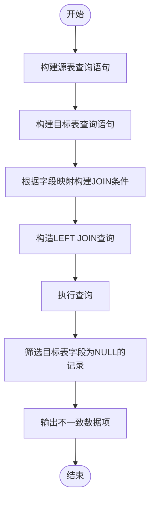
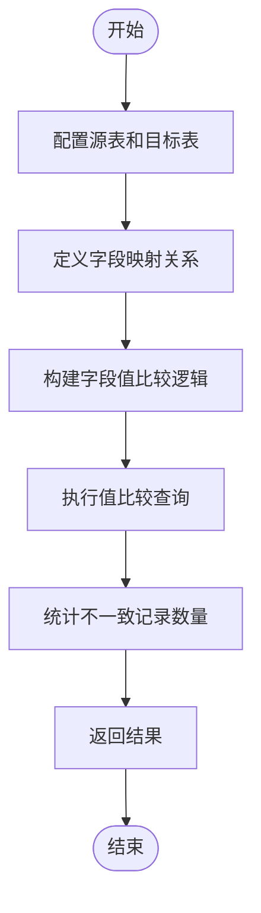
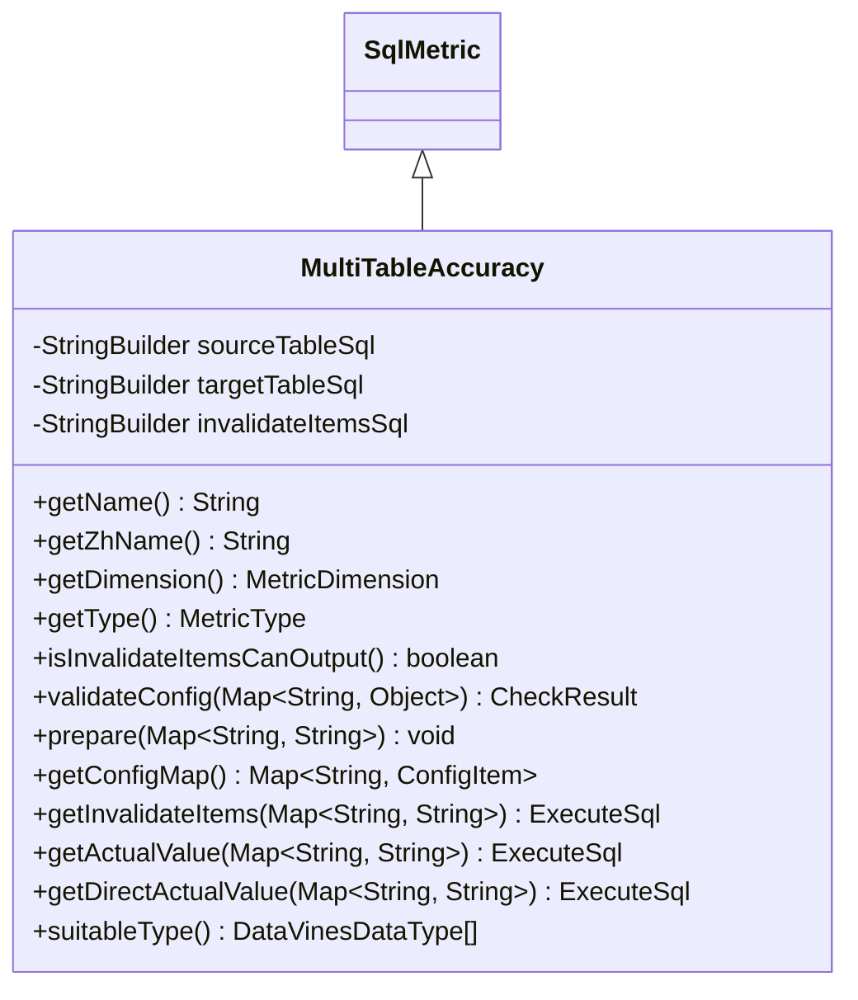
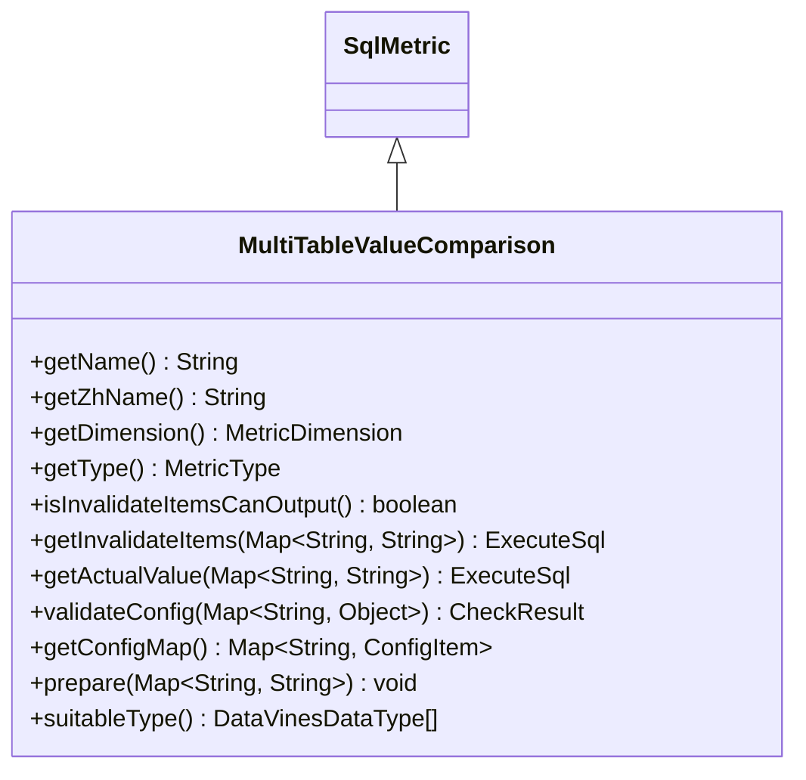
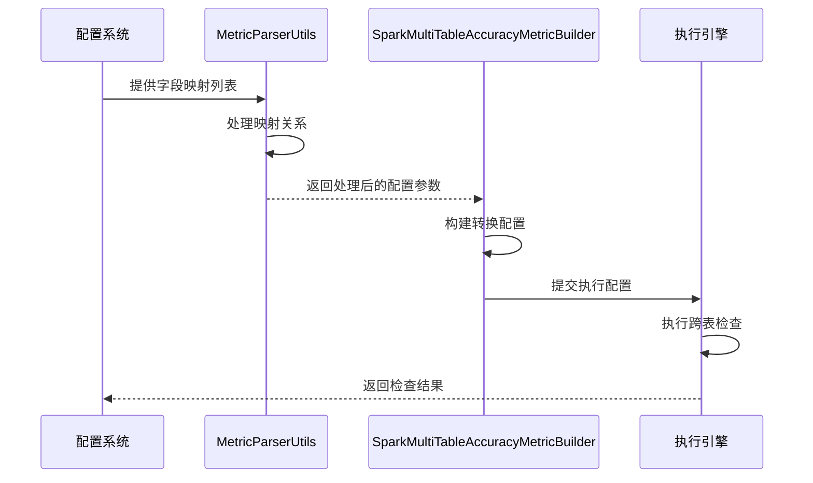

# 跨表检查规则

<cite>
**本文档引用的文件**   
- [MultiTableAccuracy.java](file://datavines-metric\datavines-metric-plugins\datavines-metric-multi-table-accuracy\src\main\java\io\datavines\metric\plugin\MultiTableAccuracy.java)
- [MultiTableValueComparison.java](file://datavines-metric\datavines-metric-plugins\datavines-metric-multi-table-value-comparison\src\main\java\io\datavines\metric\plugin\MultiTableValueComparison.java)
- [SparkMultiTableAccuracyMetricBuilder.java](file://datavines-engine\datavines-engine-plugins\datavines-engine-spark\datavines-engine-spark-config\src\main\java\io\datavines\engine\spark\config\SparkMultiTableAccuracyMetricBuilder.java)
- [SparkMultiTableValueComparisonMetricBuilder.java](file://datavines-engine\datavines-engine-plugins\datavines-engine-spark\datavines-engine-spark-config\src\main\java\io\datavines\engine\spark\config\SparkMultiTableValueComparisonMetricBuilder.java)
- [MetricParserUtils.java](file://datavines-engine\datavines-engine-config\src\main\java\io\datavines\engine\config\MetricParserUtils.java)
- [SparkSinkSqlBuilder.java](file://datavines-engine\datavines-engine-plugins\datavines-engine-spark\datavines-engine-spark-config\src\main\java\io\datavines\engine\spark\config\SparkSinkSqlBuilder.java)
</cite>

## 目录
1. [引言](#引言)
2. [跨表准确性检查](#跨表准确性检查)
3. [两表值比对检查](#两表值比对检查)
4. [核心实现类分析](#核心实现类分析)
5. [源表与目标表映射配置](#源表与目标表映射配置)
6. [数据一致性验证最佳实践](#数据一致性验证最佳实践)
7. [性能优化建议](#性能优化建议)
8. [结论](#结论)

## 引言

跨表检查规则是数据质量管理系统中的关键组成部分，用于验证不同数据表之间的数据一致性和准确性。本系统提供了两种主要的跨表检查规则：跨表准确性检查和两表值比对检查。这些规则通过比较源表和目标表的数据，确保数据在不同系统或不同时间点之间保持一致。跨表准确性检查主要用于验证源表中的记录是否在目标表中存在，而两表值比对检查则用于比较两个表中对应字段的值是否相等。这两种规则在数据迁移、数据同步和数据集成等场景中具有重要应用价值。

## 跨表准确性检查

跨表准确性检查规则用于验证源表中的记录是否在目标表中存在。该规则通过执行LEFT JOIN操作来识别源表中存在但目标表中缺失的记录。具体实现中，系统会构建一个包含源表和目标表的LEFT JOIN查询，其中连接条件由用户配置的字段映射关系决定。查询结果将包含源表和目标表中所有匹配和不匹配的记录，通过WHERE子句筛选出目标表中为NULL的记录，即为不一致的数据项。

该规则的执行流程如下：首先，系统会根据配置构建源表和目标表的SELECT语句；然后，根据字段映射关系构建ON子句；最后，组合成完整的LEFT JOIN查询语句。查询结果可以输出到指定的错误数据存储中，便于后续分析和处理。

**图来源**
- [MultiTableAccuracy.java](file://datavines-metric\datavines-metric-plugins\datavines-metric-multi-table-accuracy\src\main\java\io\datavines\metric\plugin\MultiTableAccuracy.java#L34-L38)

**本节来源**
- [MultiTableAccuracy.java](file://datavines-metric\datavines-metric-plugins\datavines-metric-multi-table-accuracy\src\main\java\io\datavines\metric\plugin\MultiTableAccuracy.java#L32-L136)

## 两表值比对检查

两表值比对检查规则用于比较两个表中对应字段的值是否相等。与跨表准确性检查不同，该规则不仅关注记录的存在性，还关注字段值的一致性。该规则通过构建包含两个表的查询，比较对应字段的值来识别不一致的数据。

该规则的实现相对简单，主要通过配置两个表的连接条件和需要比较的字段来完成。系统会为每个需要比较的字段生成相应的比较表达式，并在查询结果中标识不一致的记录。与跨表准确性检查相比，两表值比对检查不支持输出具体的不一致数据项，而是仅返回不一致记录的数量。

**图来源**
- [MultiTableValueComparison.java](file://datavines-metric\datavines-metric-plugins\datavines-metric-multi-table-value-comparison\src\main\java\io\datavines\metric\plugin\MultiTableValueComparison.java#L31-L87)

**本节来源**
- [MultiTableValueComparison.java](file://datavines-metric\datavines-metric-plugins\datavines-metric-multi-table-value-comparison\src\main\java\io\datavines\metric\plugin\MultiTableValueComparison.java#L31-L87)

## 核心实现类分析

### MultiTableAccuracy类

MultiTableAccuracy类是跨表准确性检查规则的核心实现。该类实现了SqlMetric接口，提供了跨表准确性检查所需的所有功能。类的主要成员变量包括sourceTableSql、targetTableSql和invalidateItemsSql，分别用于存储源表查询、目标表查询和不一致数据项查询的SQL模板。

该类的关键方法包括：
- prepare方法：根据配置参数准备SQL查询，包括添加过滤条件和构建JOIN语句
- getInvalidateItems方法：生成用于查询不一致数据项的SQL语句
- getActualValue方法：生成用于统计不一致记录数量的SQL语句
- getDirectActualValue方法：生成直接统计不一致记录数量的SQL语句，无需创建视图

**图来源**
- [MultiTableAccuracy.java](file://datavines-metric\datavines-metric-plugins\datavines-metric-multi-table-accuracy\src\main\java\io\datavines\metric\plugin\MultiTableAccuracy.java#L32-L136)

**本节来源**
- [MultiTableAccuracy.java](file://datavines-metric\datavines-metric-plugins\datavines-metric-multi-table-accuracy\src\main\java\io\datavines\metric\plugin\MultiTableAccuracy.java#L32-L136)

### MultiTableValueComparison类

MultiTableValueComparison类是两表值比对检查规则的核心实现。与MultiTableAccuracy类相比，该类的实现更为简单，因为它不支持输出具体的不一致数据项。该类同样实现了SqlMetric接口，但其关键方法如getInvalidateItems和getActualValue均返回null，表示不支持这些功能。

**图来源**
- [MultiTableValueComparison.java](file://datavines-metric\datavines-metric-plugins\datavines-metric-multi-table-value-comparison\src\main\java\io\datavines\metric\plugin\MultiTableValueComparison.java#L31-L87)

**本节来源**
- [MultiTableValueComparison.java](file://datavines-metric\datavines-metric-plugins\datavines-metric-multi-table-value-comparison\src\main\java\io\datavines\metric\plugin\MultiTableValueComparison.java#L31-L87)

## 源表与目标表映射配置

源表与目标表的映射关系是跨表检查规则的核心配置。系统通过MappingColumn类来定义字段映射关系，每个MappingColumn对象包含源表字段名、目标表字段名和比较操作符。在配置映射关系时，需要确保源表和目标表的对应字段具有兼容的数据类型。

配置过程主要在MetricParserUtils类中完成，该类提供了多个静态方法来处理映射关系：
- getTableAliasColumns：根据映射关系生成字段别名
- getOnClause：根据映射关系生成JOIN条件
- getWhereClause：生成筛选不一致记录的WHERE条件

**图来源**
- [MetricParserUtils.java](file://datavines-engine\datavines-engine-config\src\main\java\io\datavines\engine\config\MetricParserUtils.java#L172-L184)
- [SparkMultiTableAccuracyMetricBuilder.java](file://datavines-engine\datavines-engine-plugins\datavines-engine-spark\datavines-engine-spark-config\src\main\java\io\datavines\engine\spark\config\SparkMultiTableAccuracyMetricBuilder.java#L44-L63)

**本节来源**
- [MetricParserUtils.java](file://datavines-engine\datavines-engine-config\src\main\java\io\datavines\engine\config\MetricParserUtils.java#L172-L223)
- [SparkMultiTableAccuracyMetricBuilder.java](file://datavines-engine\datavines-engine-plugins\datavines-engine-spark\datavines-engine-spark-config\src\main\java\io\datavines\engine\spark\config\SparkMultiTableAccuracyMetricBuilder.java#L44-L63)

## 数据一致性验证最佳实践

在实施跨表检查规则时，应遵循以下最佳实践以确保数据一致性验证的有效性和可靠性：

1. **选择合适的主键字段**：在配置字段映射时，应优先选择具有唯一性的字段作为连接条件，以确保比较的准确性。

2. **合理设置过滤条件**：通过filter和filter2参数可以为源表和目标表设置过滤条件，这有助于缩小比较范围，提高检查效率。

3. **分批处理大数据集**：对于包含大量数据的表，建议分批进行检查，避免单次查询负载过大。

4. **定期执行检查**：将跨表检查规则纳入定期数据质量检查流程，及时发现和解决数据不一致问题。

5. **结合业务规则验证**：除了技术层面的字段比较，还应结合业务规则进行验证，确保数据不仅在技术上一致，在业务上也正确。

6. **监控和告警**：为跨表检查规则设置监控和告警机制，当发现数据不一致时能够及时通知相关人员。

## 性能优化建议

为提高跨表检查规则的执行性能，建议采取以下优化措施：

1. **索引优化**：确保源表和目标表的连接字段上有适当的索引，这可以显著提高JOIN操作的性能。

2. **分区表利用**：如果表是分区的，尽量在查询中包含分区条件，以减少扫描的数据量。

3. **数据类型匹配**：确保比较的字段具有相同或兼容的数据类型，避免隐式类型转换带来的性能开销。

4. **查询优化**：对于复杂的跨表检查，可以考虑使用物化视图或临时表来存储中间结果，避免重复计算。

5. **资源分配**：根据数据量大小合理分配执行引擎的计算资源，确保有足够的内存和CPU资源处理查询。

6. **并行执行**：对于多个独立的跨表检查任务，可以考虑并行执行以提高整体效率。

7. **缓存机制**：对于频繁执行的跨表检查，可以考虑实现结果缓存机制，避免重复执行相同的查询。

## 结论

跨表检查规则是确保数据质量的重要手段，通过跨表准确性检查和两表值比对检查两种规则，可以有效验证不同数据表之间的数据一致性。MultiTableAccuracy和MultiTableValueComparison类作为核心实现，提供了灵活的配置选项和高效的执行逻辑。通过合理配置源表和目标表的映射关系，并遵循最佳实践和性能优化建议，可以充分发挥跨表检查规则的作用，确保数据的准确性和一致性。在实际应用中，应根据具体的业务需求和数据特点选择合适的检查规则，并持续监控和优化其执行性能。