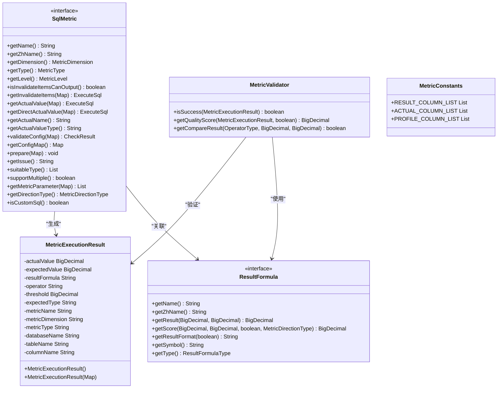
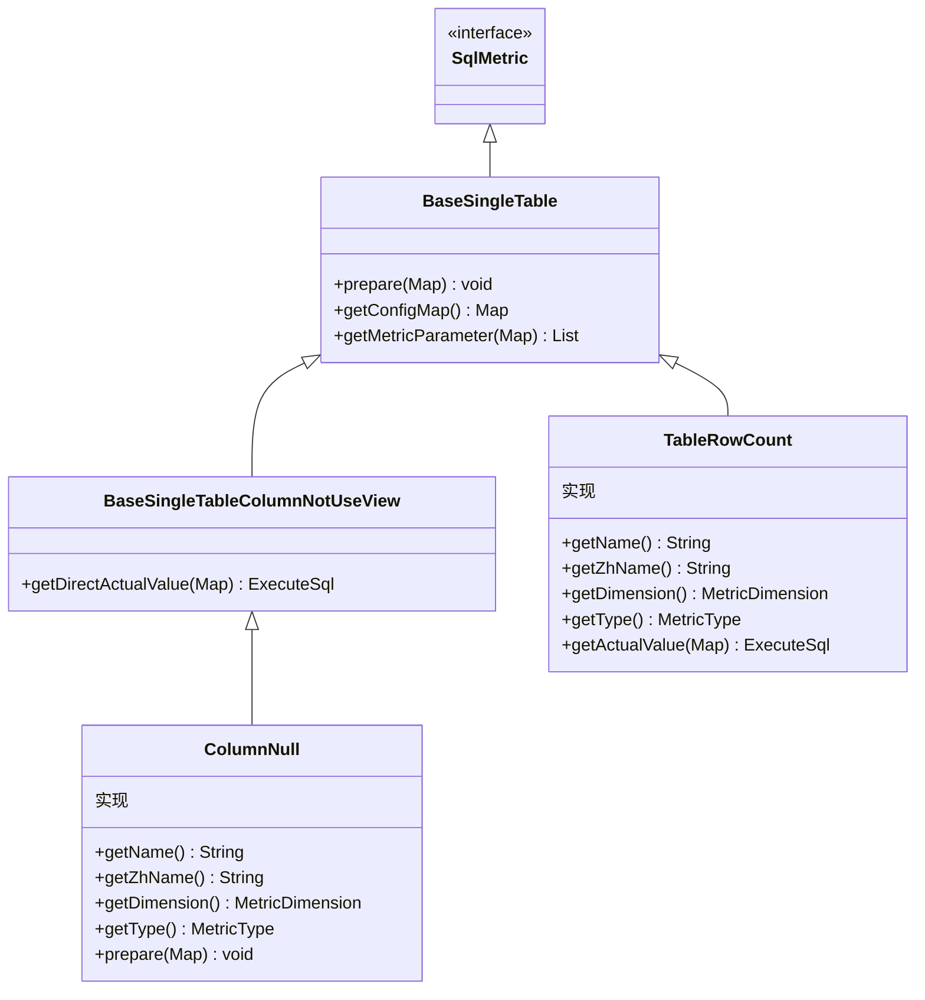

# 度量API接口

<cite>
**本文档引用的文件**  
- [SqlMetric.java](file://datavines-metric/datavines-metric-api/src/main/java/io/datavines/metric/api/SqlMetric.java)
- [MetricValidator.java](file://datavines-metric/datavines-metric-api/src/main/java/io/datavines/metric/api/MetricValidator.java)
- [MetricConstants.java](file://datavines-metric/datavines-metric-api/src/main/java/io/datavines/metric/api/MetricConstants.java)
- [MetricExecutionResult.java](file://datavines-metric/datavines-metric-api/src/main/java/io/datavines/metric/api/MetricExecutionResult.java)
- [MetricType.java](file://datavines-metric/datavines-metric-api/src/main/java/io/datavines/metric/api/MetricType.java)
- [MetricLevel.java](file://datavines-metric/datavines-metric-api/src/main/java/io/datavines/metric/api/MetricLevel.java)
- [MetricDimension.java](file://datavines-metric/datavines-metric-api/src/main/java/io/datavines/metric/api/MetricDimension.java)
- [ResultFormula.java](file://datavines-metric/datavines-metric-api/src/main/java/io/datavines/metric/api/ResultFormula.java)
- [ConfigItem.java](file://datavines-metric/datavines-metric-api/src/main/java/io/datavines/metric/api/ConfigItem.java)
- [TableRowCount.java](file://datavines-metric/datavines-metric-plugins/datavines-metric-table-row-count/src/main/java/io/datavines/metric/plugin/TableRowCount.java)
- [ColumnNull.java](file://datavines-metric/datavines-metric-plugins/datavines-metric-column-null/src/main/java/io/datavines/metric/plugin/ColumnNull.java)
</cite>

## 目录
1. [引言](#引言)
2. [核心接口概述](#核心接口概述)
3. [SqlMetric接口详解](#sqlmetric接口详解)
4. [MetricValidator验证逻辑](#metricvalidator验证逻辑)
5. [MetricConstants常量定义](#metricconstants常量定义)
6. [MetricExecutionResult数据结构](#metricexecutionresult数据结构)
7. [接口继承关系与实现示例](#接口继承关系与实现示例)
8. [典型实现分析](#典型实现分析)
9. [构建新的度量规则指南](#构建新的度量规则指南)
10. [总结](#总结)

## 引言
本文档旨在详细说明DataVines系统中`datavines-metric`模块的核心API接口设计。该模块为数据质量度量提供了标准化的接口体系，支持多种数据质量维度的检查和评估。通过统一的接口定义，系统实现了可扩展的度量规则框架，允许用户基于标准接口开发自定义的度量规则。

## 核心接口概述
`datavines-metric`模块的核心由四个关键组件构成：`SqlMetric`接口定义了度量规则的基本行为和配置；`MetricValidator`类提供了结果验证的通用逻辑；`MetricConstants`定义了系统级常量；`MetricExecutionResult`则封装了度量执行的结果数据结构。这些组件共同构成了数据质量度量的基础框架。

**接口来源**
- [SqlMetric.java](file://datavines-metric/datavines-metric-api/src/main/java/io/datavines/metric/api/SqlMetric.java)
- [MetricValidator.java](file://datavines-metric/datavines-metric-api/src/main/java/io/datavines/metric/api/MetricValidator.java)
- [MetricConstants.java](file://datavines-metric/datavines-metric-api/src/main/java/io/datavines/metric/api/MetricConstants.java)
- [MetricExecutionResult.java](file://datavines-metric/datavines-metric-api/src/main/java/io/datavines/metric/api/MetricExecutionResult.java)
- [ResultFormula.java](file://datavines-metric/datavines-metric-api/src/main/java/io/datavines/metric/api/ResultFormula.java)

## SqlMetric接口详解
`SqlMetric`接口是所有SQL度量规则的基础，通过SPI机制实现插件化扩展。该接口定义了度量规则执行、配置和结果处理的标准方法。

### 基本信息方法
接口提供了获取度量规则基本信息的方法，包括英文名称`getName()`和中文名称`getZhName()`，以及通过`getNameByLanguage(boolean)`方法根据语言环境选择合适的名称显示。

### 度量分类方法
`getDimension()`方法返回度量所属的维度，如完整性、一致性等；`getType()`方法返回度量类型，区分单表、多表等不同场景；`getLevel()`方法定义度量的粒度级别，如数据库级、表级或列级。

### SQL执行方法
核心的SQL执行方法包括：
- `getInvalidateItems()`：获取无效项的执行SQL
- `getActualValue()`：获取实际值的执行SQL
- `getDirectActualValue()`：获取直接实际值的执行SQL（默认使用`getActualValue`）

### 配置管理方法
`validateConfig()`用于验证配置参数的正确性，`getConfigMap()`返回配置项映射，`prepare()`方法用于初始化配置准备。

### 扩展属性方法
接口还定义了`suitableType()`指定适用的数据类型，`supportMultiple()`指示是否支持多实例，`getDirectionType()`定义指标方向（正向或负向）等扩展属性。

**接口来源**
- [SqlMetric.java](file://datavines-metric/datavines-metric-api/src/main/java/io/datavines/metric/api/SqlMetric.java)

## MetricValidator验证逻辑
`MetricValidator`类提供了度量结果验证的核心逻辑，主要包含两个静态方法：

### 成功判断逻辑
`isSuccess()`方法根据操作符类型、结果计算公式和阈值来判断度量结果是否成功。该方法首先从执行结果中提取实际值、期望值、操作符和阈值，然后通过`ResultFormula`插件计算结果值，最后调用`getCompareResult()`进行比较判断。

### 质量评分计算
`getQualityScore()`方法计算度量的质量分数，结合实际值、期望值、成功状态和指标方向，通过`ResultFormula`插件的`getScore()`方法得出最终评分。

### 比较逻辑实现
`getCompareResult()`私有方法实现了各种操作符（等于、小于、大于等）的比较逻辑，使用`BigDecimal.compareTo()`确保数值比较的精确性。

**接口来源**
- [MetricValidator.java](file://datavines-metric/datavines-metric-api/src/main/java/io/datavines/metric/api/MetricValidator.java)

## MetricConstants常量定义
`MetricConstants`类定义了系统中使用的常量，主要包括三个静态列表：

### 结果列定义
`RESULT_COLUMN_LIST`定义了度量结果表的列结构，包含作业执行ID、度量唯一键、度量类型、实际值、期望值、操作符、阈值等关键字段。

### 实际值列定义
`ACTUAL_COLUMN_LIST`定义了实际值存储表的列结构，包含作业执行ID、度量名称、唯一编码、实际值、数据时间和创建更新时间等字段。

### 档案列定义
`PROFILE_COLUMN_LIST`定义了数据档案表的列结构，用于存储数据特征分析结果。

这些常量在系统初始化时被静态块填充，确保了数据表结构的一致性和可维护性。

**接口来源**
- [MetricConstants.java](file://datavines-metric/datavines-metric-api/src/main/java/io/datavines/metric/api/MetricConstants.java)

## MetricExecutionResult数据结构
`MetricExecutionResult`类是度量执行结果的核心数据结构，采用Lombok注解简化代码，实现了`Serializable`接口支持序列化。

### 核心属性
该类包含以下核心属性：
- `actualValue`：实际测量值
- `expectedValue`：期望值
- `resultFormula`：结果计算公式
- `operator`：比较操作符
- `threshold`：阈值
- `metricName`：度量名称
- `metricDimension`：度量维度
- `metricType`：度量类型
- `databaseName`、`tableName`、`columnName`：目标对象标识

### 构造方法
提供了两个构造方法：无参构造方法用于反射创建实例；带`Map<String, Object>`参数的构造方法用于从数据映射创建实例，自动处理空值检查和类型转换。

### 数据类型处理
所有数值类型均使用`BigDecimal`以确保精度，字符串类型进行trim处理去除空白字符，体现了对数据质量的严格要求。

**接口来源**
- [MetricExecutionResult.java](file://datavines-metric/datavines-metric-api/src/main/java/io/datavines/metric/api/MetricExecutionResult.java)

## 接口继承关系与实现示例
`datavines-metric`模块采用接口继承和抽象基类相结合的设计模式，形成了清晰的层次结构。

**接口来源**
- [SqlMetric.java](file://datavines-metric/datavines-metric-api/src/main/java/io/datavines/metric/api/SqlMetric.java)
- [TableRowCount.java](file://datavines-metric/datavines-metric-plugins/datavines-metric-table-row-count/src/main/java/io/datavines/metric/plugin/TableRowCount.java)
- [ColumnNull.java](file://datavines-metric/datavines-metric-plugins/datavines-metric-column-null/src/main/java/io/datavines/metric/plugin/ColumnNull.java)

## 典型实现分析
通过分析`TableRowCount`和`ColumnNull`两个典型实现，可以深入了解度量规则的具体实现方式。

### TableRowCount实现
`TableRowCount`类继承自`BaseSingleTable`，实现了表行数检查功能：
- 定义了英文名"table_row_count"和中文名"表行数检查"
- 归属于完整性维度
- 使用标准的COUNT(1) SQL查询获取实际值
- 支持多表配置，通过`getMetricParameter()`方法处理逗号分隔的表名

### ColumnNull实现
`ColumnNull`类继承自`BaseSingleTableColumnNotUseView`，实现了空值检查功能：
- 定义了英文名"column_null"和中文名"空值检查"
- 重写了`prepare()`方法，在准备阶段添加空值过滤条件
- 指定适用的数据类型包括数值型、字符串型和日期时间型
- 设置指标方向为负向，因为空值越多质量越差

这两个实现展示了如何基于基础接口和抽象类快速构建具体的度量规则。

**接口来源**
- [TableRowCount.java](file://datavines-metric/datavines-metric-plugins/datavines-metric-table-row-count/src/main/java/io/datavines/metric/plugin/TableRowCount.java)
- [ColumnNull.java](file://datavines-metric/datavines-metric-plugins/datavines-metric-column-null/src/main/java/io/datavines/metric/plugin/ColumnNull.java)

## 构建新的度量规则指南
基于现有API构建新的度量规则需要遵循以下步骤：

### 继承合适的基类
根据度量类型选择合适的基类继承：
- 单表度量：继承`BaseSingleTable`
- 单表列级度量：继承`BaseSingleTableColumnNotUseView`
- 自定义SQL度量：可直接实现`SqlMetric`接口

### 实现必要方法
必须实现以下核心方法：
- `getName()`和`getZhName()`：提供度量名称
- `getDimension()`：指定度量维度
- `getType()`：定义度量类型
- `getActualValue()`：生成实际值查询SQL

### 配置管理
通过`getConfigMap()`方法定义配置项，使用`ConfigItem`类封装配置信息，包括英文标签、中文标签和配置键。

### 验证逻辑
重写`validateConfig()`方法确保配置参数的有效性，可在`prepare()`方法中进行初始化准备。

### 测试与注册
实现完成后，需要编写相应的测试用例，并确保通过SPI机制正确注册到系统中。

## 总结
`datavines-metric`模块的API设计体现了良好的面向接口编程思想和可扩展架构。通过`SqlMetric`接口定义标准，`MetricValidator`提供通用验证逻辑，`MetricConstants`统一常量管理，`MetricExecutionResult`规范数据结构，形成了完整的度量规则开发框架。开发者可以基于这些API快速构建新的度量规则，满足多样化的数据质量检查需求，同时保持系统的统一性和可维护性。