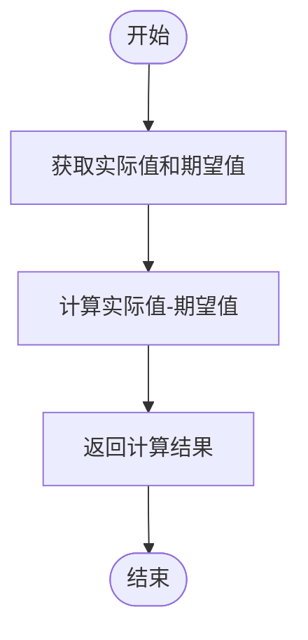
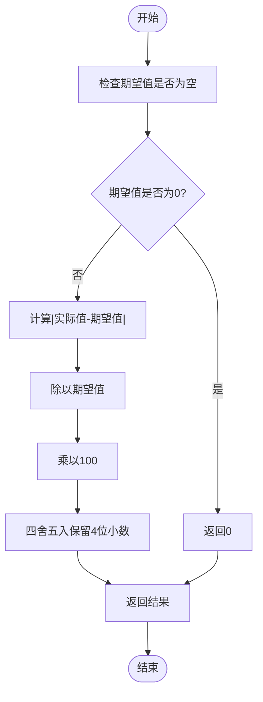
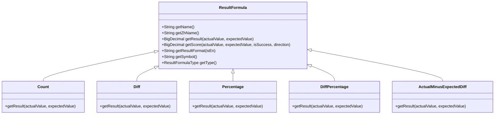
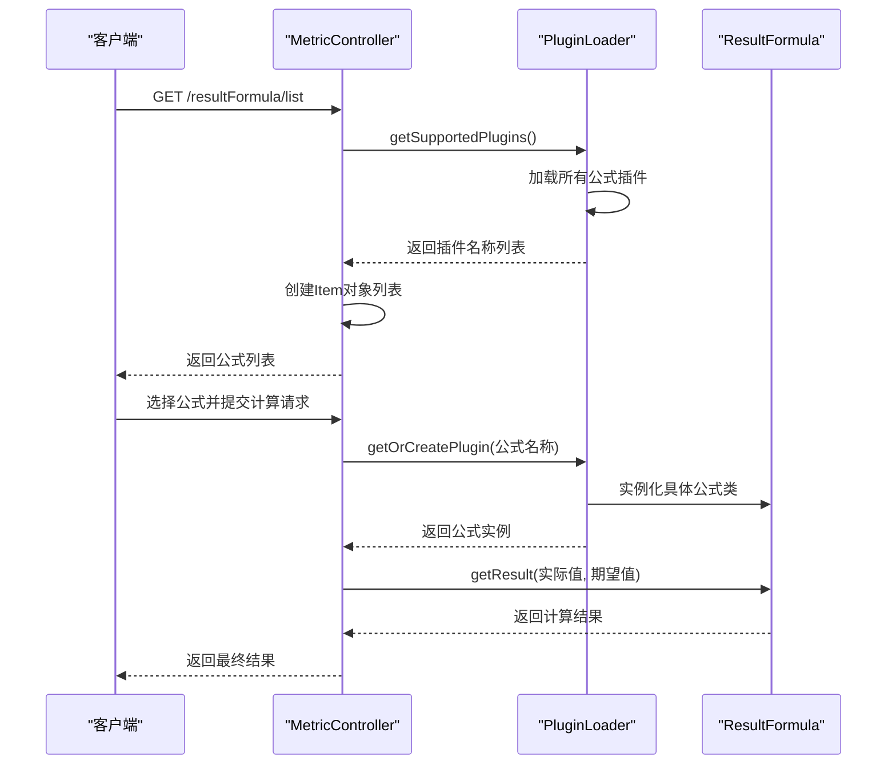
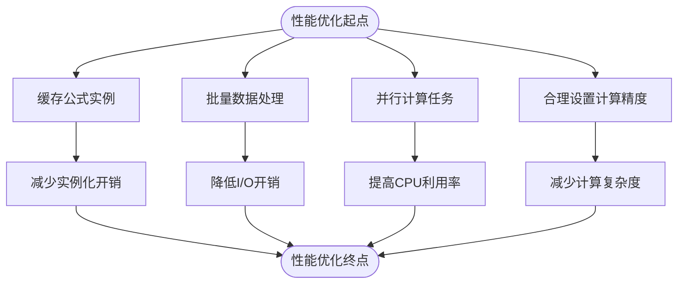
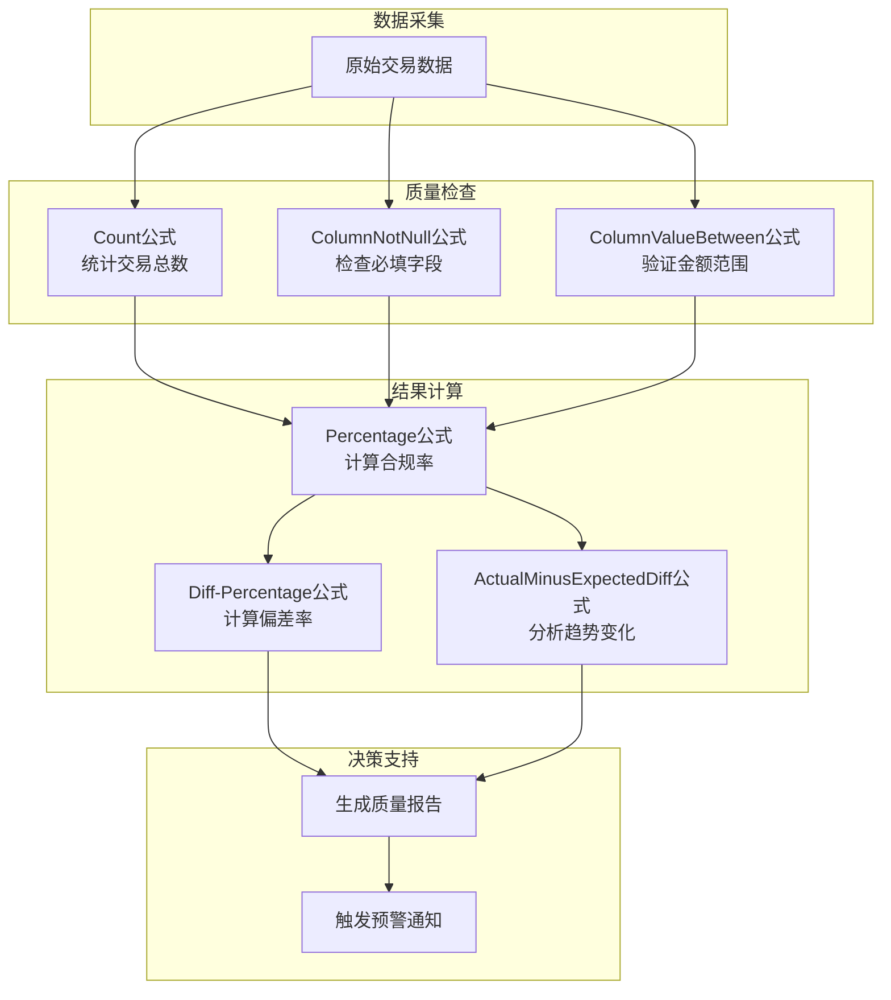

# 结果计算公式

<cite>
**本文档中引用的文件**  
- [Count.java](file://datavines-metric\datavines-metric-result-formula-plugins\datavines-metric-result-formula-count\src\main\java\io\datavines\metric\result\formula\Count.java)
- [Diff.java](file://datavines-metric\datavines-metric-result-formula-plugins\datavines-metric-result-formula-diff\src\main\java\io\datavines\metric\result\formula\Diff.java)
- [Percentage.java](file://datavines-metric\datavines-metric-result-formula-plugins\datavines-metric-result-formula-percentage\src\main\java\io\datavines\metric\result\formula\Percentage.java)
- [DiffPercentage.java](file://datavines-metric\datavines-metric-result-formula-plugins\datavines-metric-result-formula-diff-percentage\src\main\java\io\datavines\metric\result\formula\DiffPercentage.java)
- [ActualMinusExpectedDiff.java](file://datavines-metric\datavines-metric-result-formula-plugins\datavines-metric-result-formula-diff-actual-expected\src\main\java\io\datavines\metric\result\formula\ActualMinusExpectedDiff.java)
- [ResultFormula.java](file://datavines-metric\datavines-metric-api\src\main\java\io\datavines\metric\api\ResultFormula.java)
- [ResultFormulaType.java](file://datavines-metric\datavines-metric-api\src\main\java\io\datavines\metric\api\ResultFormulaType.java)
- [SPI.java](file://datavines-spi\src\main\java\io\datavines\spi\SPI.java)
- [PluginLoader.java](file://datavines-spi\src\main\java\io\datavines\spi\PluginLoader.java)
- [MetricController.java](file://datavines-server\src\main\java\io\datavines\server\api\controller\MetricController.java)
</cite>

## 目录
1. [引言](#引言)
2. [核心公式功能说明](#核心公式功能说明)
3. [复合公式计算逻辑](#复合公式计算逻辑)
4. [公式插件的SPI扩展机制](#公式插件的spi扩展机制)
5. [公式执行流程分析](#公式执行流程分析)
6. [公式参数配置与组合使用](#公式参数配置与组合使用)
7. [公式选择指南](#公式选择指南)
8. [性能优化建议](#性能优化建议)
9. [复杂业务场景应用示例](#复杂业务场景应用示例)
10. [结论](#结论)

## 引言

数据质量监控系统中的结果计算公式是衡量数据质量的核心组件。这些公式用于将实际测量值与期望值进行比较，从而生成有意义的质量指标。本文档详细说明了Count、Diff、Percentage等基础公式的功能，解释了ActualMinusExpectedDiff等复合公式的计算逻辑，分析了公式插件的SPI扩展机制和执行流程，并提供了公式参数配置、组合使用方法、选择指南和性能优化建议。

**本节不分析具体源文件，因此不提供来源**

## 核心公式功能说明

在数据质量度量结果处理中，系统提供了多种基础计算公式来满足不同的业务需求：

- **Count（计数）公式**：直接返回实际测量值，不进行任何计算。该公式适用于只需要记录原始测量结果的场景。
- **Diff（差值）公式**：计算实际值与期望值之间的绝对差值，即|实际值-期望值|。该公式用于衡量偏差的绝对大小。
- **Percentage（百分比）公式**：计算实际值相对于期望值的百分比，即实际值/期望值*100%。该公式用于衡量相对偏差。
- **Diff-Percentage（差值百分比）公式**：计算实际值与期望值之间差值相对于期望值的百分比，即|实际值-期望值|/期望值*100%。该公式用于衡量相对偏差的大小。

这些公式通过实现`ResultFormula`接口来提供统一的计算方法，确保了系统的一致性和可扩展性。

**本节来源**
- [Count.java](file://datavines-metric\datavines-metric-result-formula-plugins\datavines-metric-result-formula-count\src\main\java\io\datavines\metric\result\formula\Count.java)
- [Diff.java](file://datavines-metric\datavines-metric-result-formula-plugins\datavines-metric-result-formula-diff\src\main\java\io\datavines\metric\result\formula\Diff.java)
- [Percentage.java](file://datavines-metric\datavines-metric-result-formula-plugins\datavines-metric-result-formula-percentage\src\main\java\io\datavines\metric\result\formula\Percentage.java)
- [DiffPercentage.java](file://datavines-metric\datavines-metric-result-formula-plugins\datavines-metric-result-formula-diff-percentage\src\main\java\io\datavines\metric\result\formula\DiffPercentage.java)

## 复合公式计算逻辑

系统中的复合公式通过组合基础数学运算来实现更复杂的计算逻辑。以`ActualMinusExpectedDiff`为例，其计算逻辑如下：



**图示来源**
- [ActualMinusExpectedDiff.java](file://datavines-metric\datavines-metric-result-formula-plugins\datavines-metric-result-formula-diff-actual-expected\src\main\java\io\datavines\metric\result\formula\ActualMinusExpectedDiff.java)

`DiffPercentage`公式的计算逻辑更为复杂，需要处理除零异常和精度控制：



**图示来源**
- [DiffPercentage.java](file://datavines-metric\datavines-metric-result-formula-plugins\datavines-metric-result-formula-diff-percentage\src\main\java\io\datavines\metric\result\formula\DiffPercentage.java)

所有公式都使用`BigDecimal`类型进行计算，确保了高精度的数学运算，避免了浮点数计算中的精度丢失问题。

**本节来源**
- [ActualMinusExpectedDiff.java](file://datavines-metric\datavines-metric-result-formula-plugins\datavines-metric-result-formula-diff-actual-expected\src\main\java\io\datavines\metric\result\formula\ActualMinusExpectedDiff.java)
- [DiffPercentage.java](file://datavines-metric\datavines-metric-result-formula-plugins\datavines-metric-result-formula-diff-percentage\src\main\java\io\datavines\metric\result\formula\DiffPercentage.java)

## 公式插件的SPI扩展机制

系统采用SPI（Service Provider Interface）机制来实现公式的可扩展性。`ResultFormula`接口被`@SPI`注解标记，表明它是一个可扩展的接口：



**图示来源**
- [ResultFormula.java](file://datavines-metric\datavines-metric-api\src\main\java\io\datavines\metric\api\ResultFormula.java)
- [SPI.java](file://datavines-spi\src\main\java\io\datavines\spi\SPI.java)

每个公式插件在`META-INF/plugins/`目录下都有一个配置文件，如`io.datavines.metric.api.ResultFormula`，其中定义了插件名称与实现类的映射关系：

```
count=io.datavines.metric.result.formula.Count
diff=io.datavines.metric.result.formula.Diff
percentage=io.datavines.metric.result.formula.Percentage
```

`PluginLoader`类负责加载这些插件，通过读取类路径下的配置文件，动态加载并实例化所有可用的公式实现。

**本节来源**
- [ResultFormula.java](file://datavines-metric\datavines-metric-api\src\main\java\io\datavines\metric\api\ResultFormula.java)
- [SPI.java](file://datavines-spi\src\main\java\io\datavines\spi\SPI.java)
- [PluginLoader.java](file://datavines-spi\src\main\java\io\datavines\spi\PluginLoader.java)

## 公式执行流程分析

公式的执行流程从API请求开始，经过插件加载、实例化到最终计算结果的生成：



**图示来源**
- [MetricController.java](file://datavines-server\src\main\java\io\datavines\server\api\controller\MetricController.java)
- [PluginLoader.java](file://datavines-spi\src\main\java\io\datavines\spi\PluginLoader.java)
- [ResultFormula.java](file://datavines-metric\datavines-metric-api\src\main\java\io\datavines\metric\api\ResultFormula.java)

`PluginLoader`的加载过程包括：
1. 确定类加载器
2. 查找`META-INF/plugins/`目录下的配置文件
3. 读取配置文件中的类名映射
4. 使用反射实例化类
5. 缓存已加载的类以提高性能

**本节来源**
- [MetricController.java](file://datavines-server\src\main\java\io\datavines\server\api\controller\MetricController.java)
- [PluginLoader.java](file://datavines-spi\src\main\java\io\datavines\spi\PluginLoader.java)

## 公式参数配置与组合使用

公式参数配置主要通过JSON格式的配置文件进行，支持灵活的组合使用。基本配置结构如下：

```json
{
  "resultFormula": "diff-percentage",
  "actualValue": 95,
  "expectedValue": 100,
  "metricDirection": "positive"
}
```

公式可以组合使用以满足复杂业务需求。例如，可以先使用`Count`公式获取原始计数值，然后使用`Percentage`公式计算其相对于基准值的百分比。系统支持通过配置文件定义公式执行链：


**图示来源**
- [ResultFormula.java](file://datavines-metric\datavines-metric-api\src\main\java\io\datavines\metric\api\ResultFormula.java)
- [ResultFormulaType.java](file://datavines-metric\datavines-metric-api\src\main\java\io\datavines\metric\api\ResultFormulaType.java)

参数配置还支持国际化，通过`getNameByLanguage()`方法根据上下文语言返回相应的公式名称，确保了系统的多语言支持能力。

**本节来源**
- [ResultFormula.java](file://datavines-metric\datavines-metric-api\src\main\java\io\datavines\metric\api\ResultFormula.java)
- [ResultFormulaType.java](file://datavines-metric\datavines-metric-api\src\main\java\io\datavines\metric\api\ResultFormulaType.java)

## 公式选择指南

根据不同的业务场景，应选择合适的计算公式：

| 业务场景 | 推荐公式 | 说明 |
|---------|---------|------|
| 数据完整性检查 | Count | 直接返回实际记录数，用于监控数据量变化 |
| 数据准确性验证 | Diff | 计算实际值与期望值的绝对差值，适用于阈值比较 |
| 性能指标监控 | Percentage | 计算实际值相对于期望值的百分比，适用于比率分析 |
| 质量偏差分析 | Diff-Percentage | 计算偏差的相对大小，适用于敏感度分析 |
| 趋势变化检测 | ActualMinusExpectedDiff | 保留正负号的差值，用于分析变化方向 |

选择公式时还需考虑以下因素：
- **精度要求**：所有公式都使用`BigDecimal`确保高精度计算
- **性能影响**：简单公式（如Count）比复杂公式（如Diff-Percentage）执行更快
- **业务语义**：选择能最好表达业务意图的公式
- **可读性**：选择结果易于理解和解释的公式

**本节来源**
- [ResultFormula.java](file://datavines-metric\datavines-metric-api\src\main\java\io\datavines\metric\api\ResultFormula.java)
- 所有具体的公式实现类

## 性能优化建议

为了确保公式计算的高效性，建议采取以下优化措施：

1. **缓存公式实例**：`PluginLoader`已经实现了公式类的缓存，避免重复实例化开销
2. **批量计算**：对于大量数据的计算，应采用批量处理方式，减少函数调用开销
3. **预编译公式**：对于复杂的公式逻辑，可以考虑预编译为可执行代码
4. **并行计算**：独立的公式计算任务可以并行执行，充分利用多核CPU资源
5. **精度控制**：根据业务需求合理设置`BigDecimal`的精度，避免不必要的高精度计算



**图示来源**
- [PluginLoader.java](file://datavines-spi\src\main\java\io\datavines\spi\PluginLoader.java)

此外，应避免在循环中频繁创建`BigDecimal`对象，可以预先创建常用值的常量，如`BigDecimal.ZERO`和`BigDecimal.ONE`。

**本节来源**
- [PluginLoader.java](file://datavines-spi\src\main\java\io\datavines\spi\PluginLoader.java)
- 所有使用`BigDecimal`的公式实现类

## 复杂业务场景应用示例

在实际业务中，公式组合可以解决复杂的质量监控需求。例如，在电商交易数据监控中：



**图示来源**
- 所有相关的公式实现类

另一个示例是金融风控场景中的复合指标计算：
1. 使用`Count`公式统计异常交易数量
2. 使用`Percentage`公式计算异常交易占比
3. 使用`Diff-Percentage`公式计算占比变化率
4. 使用`ActualMinusExpectedDiff`公式判断变化方向

这种组合使用方式能够提供全面的风险视图，帮助决策者快速识别潜在问题。

**本节来源**
- 所有相关的公式实现类

## 结论

本文档详细介绍了数据质量监控系统中的结果计算公式体系。通过SPI扩展机制，系统实现了高度的可扩展性和灵活性。各种基础公式和复合公式满足了不同业务场景的需求，而合理的参数配置和组合使用方法则增强了系统的实用性。性能优化建议为大规模数据处理提供了指导。在实际应用中，应根据具体业务需求选择合适的公式，并充分利用组合能力来解决复杂的数据质量监控问题。

**本节不分析具体源文件，因此不提供来源**