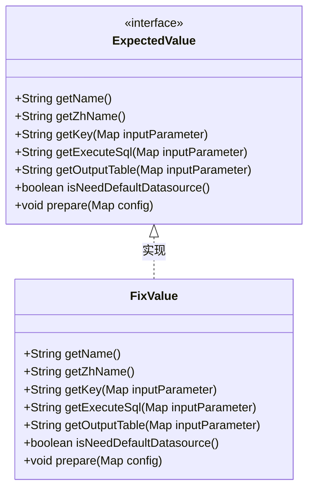
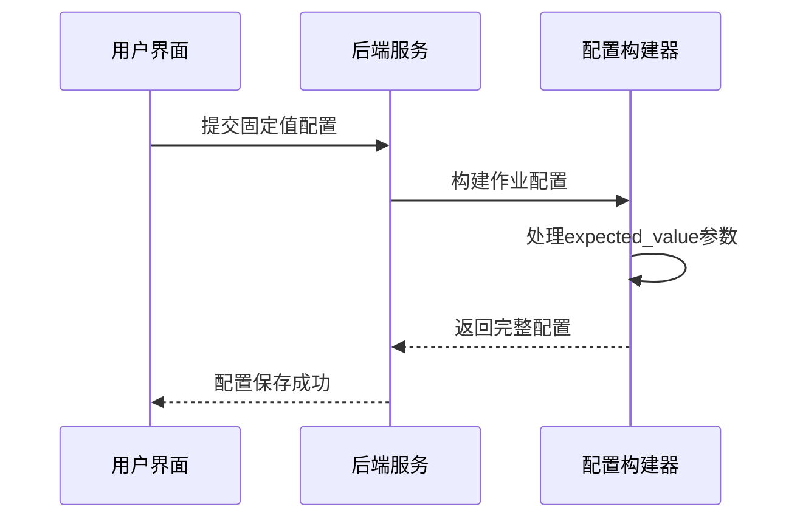
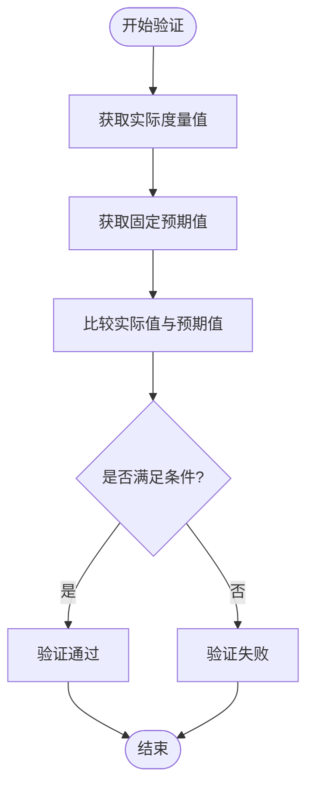
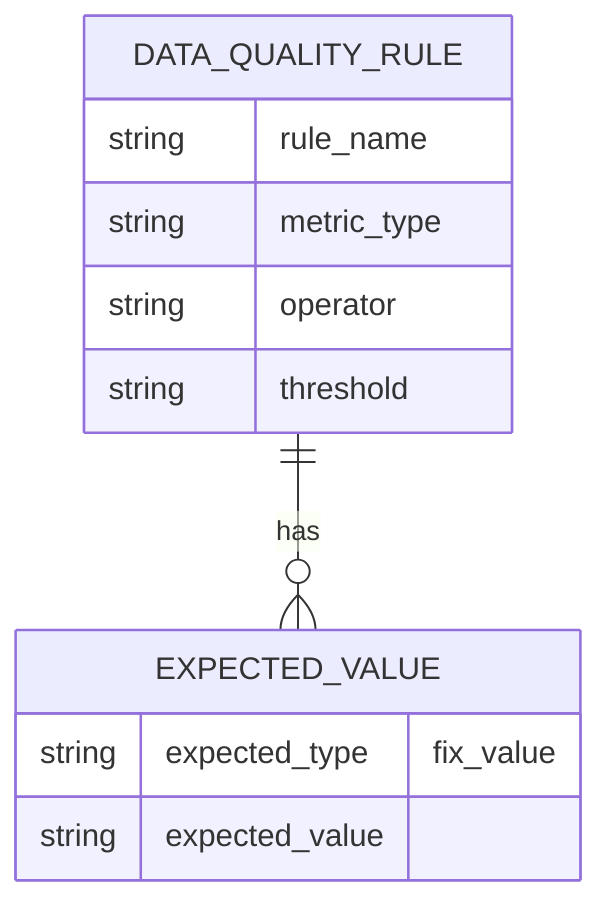
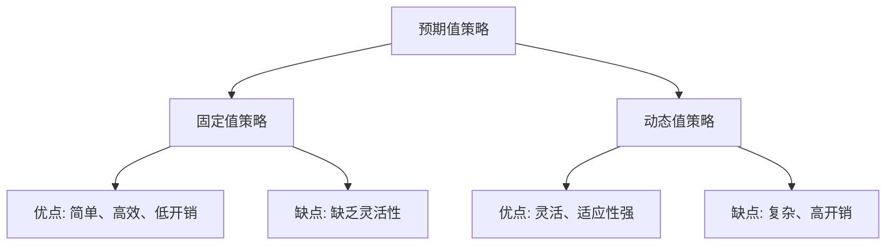

# 固定值策略

<cite>
**本文档引用的文件**
- [FixValue.java](file://datavines-metric\datavines-metric-expected-plugins\datavines-metric-expected-fix\src\main\java\io\datavines\metric\expected\plugin\FixValue.java)
- [ExpectedValue.java](file://datavines-metric\datavines-metric-api\src\main\java\io\datavines\metric\api\ExpectedValue.java)
- [AbstractExpectedValue.java](file://datavines-metric\datavines-metric-expected-plugins\datavines-metric-expected-base\src\main\java\io\datavines\metric\expected\plugin\AbstractExpectedValue.java)
- [BaseJobConfigurationBuilder.java](file://datavines-engine\datavines-engine-config\src\main\java\io\datavines\engine\config\BaseJobConfigurationBuilder.java)
- [index.tsx](file://datavines-ui\Editor\components\MetricModal\ExpectedValue\index.tsx)
</cite>

## 目录
1. [简介](#简介)
2. [核心实现原理](#核心实现原理)
3. [配置方式与数据类型支持](#配置方式与数据类型支持)
4. [验证机制](#验证机制)
5. [实际应用案例](#实际应用案例)
6. [性能特点与适用场景](#性能特点与适用场景)
7. [与其他策略的对比优势](#与其他策略的对比优势)

## 简介
固定值策略是数据质量校验中最基础且最直接的预期值策略之一。该策略通过预设一个固定的数值作为预期结果，用于与实际计算结果进行比较，从而判断数据质量是否达标。在DataVines系统中，`FixValue`类实现了这一策略，为用户提供了一种简单高效的基准值验证手段。

**Section sources**
- [FixValue.java](file://datavines-metric\datavines-metric-expected-plugins\datavines-metric-expected-fix\src\main\java\io\datavines\metric\expected\plugin\FixValue.java)

## 核心实现原理
`FixValue`类实现了`ExpectedValue`接口，作为最简单的预期值策略，其核心逻辑在于不生成任何执行SQL或输出表，而是直接使用用户配置的固定值进行比较。该类通过返回`null`来表明不需要额外的数据源查询或计算过程，所有预期值信息都直接来源于用户输入参数。

**Diagram sources**
- [ExpectedValue.java](file://datavines-metric\datavines-metric-api\src\main\java\io\datavines\metric\api\ExpectedValue.java)
- [FixValue.java](file://datavines-metric\datavines-metric-expected-plugins\datavines-metric-expected-fix\src\main\java\io\datavines\metric\expected\plugin\FixValue.java)

**Section sources**
- [FixValue.java](file://datavines-metric\datavines-metric-expected-plugins\datavines-metric-expected-fix\src\main\java\io\datavines\metric\expected\plugin\FixValue.java)
- [ExpectedValue.java](file://datavines-metric\datavines-metric-api\src\main\java\io\datavines\metric\api\ExpectedValue.java)

## 配置方式与数据类型支持
固定值策略的配置非常直观，用户只需在数据质量规则中选择"固定值"作为预期值类型，并输入具体的数值即可。系统支持多种数据类型，包括数值型、字符串型、布尔型等。配置信息通过`expected_value`参数传递，并在作业配置构建时被正确处理和存储。

**Diagram sources**
- [index.tsx](file://datavines-ui\Editor\components\MetricModal\ExpectedValue\index.tsx)
- [BaseJobConfigurationBuilder.java](file://datavines-engine\datavines-engine-config\src\main\java\io\datavines\engine\config\BaseJobConfigurationBuilder.java)

**Section sources**
- [index.tsx](file://datavines-ui\Editor\components\MetricModal\ExpectedValue\index.tsx)
- [BaseJobConfigurationBuilder.java](file://datavines-engine\datavines-engine-config\src\main\java\io\datavines\engine\config\BaseJobConfigurationBuilder.java)

## 验证机制
固定值策略的验证机制极为简洁高效。系统不会生成额外的SQL查询来获取预期值，而是直接使用用户配置的固定值与实际度量值进行比较。这种机制避免了不必要的数据库查询开销，提高了验证效率。验证过程由系统的比较运算符（如等于、大于、小于等）和阈值配置共同完成。

**Diagram sources**
- [FixValue.java](file://datavines-metric\datavines-metric-expected-plugins\datavines-metric-expected-fix\src\main\java\io\datavines\metric\expected\plugin\FixValue.java)

**Section sources**
- [FixValue.java](file://datavines-metric\datavines-metric-expected-plugins\datavines-metric-expected-fix\src\main\java\io\datavines\metric\expected\plugin\FixValue.java)

## 实际应用案例
固定值策略广泛应用于各种数据质量校验场景。例如，在校验订单表的行数是否达到预期基准值时，可以设置固定值为10000，确保每日数据量不低于此阈值。另一个常见用例是枚举值校验，如订单状态字段只能是"待支付"、"已支付"、"已发货"等预定义值，通过固定值策略可以确保数据的完整性和一致性。

**Diagram sources**
- [FixValue.java](file://datavines-metric\datavines-metric-expected-plugins\datavines-metric-expected-fix\src\main\java\io\datavines\metric\expected\plugin\FixValue.java)

**Section sources**
- [FixValue.java](file://datavines-metric\datavines-metric-expected-plugins\datavines-metric-expected-fix\src\main\java\io\datavines\metric\expected\plugin\FixValue.java)

## 性能特点与适用场景
固定值策略具有极佳的性能表现，因为它不需要额外的计算资源来确定预期值。适用于基准值验证、枚举值校验、数据完整性检查等场景。由于其简单直接的特性，特别适合用于实时性要求高、数据量大的校验任务。然而，对于需要动态计算预期值的复杂场景，如基于历史数据的平均值预测，则不适合使用固定值策略。

**Section sources**
- [FixValue.java](file://datavines-metric\datavines-metric-expected-plugins\datavines-metric-expected-fix\src\main\java\io\datavines\metric\expected\plugin\FixValue.java)

## 与其他策略的对比优势
相较于其他动态预期值策略（如日均值、周均值等），固定值策略的最大优势在于其简单性和高效性。它不需要访问历史数据或执行复杂的计算逻辑，从而减少了系统开销和响应时间。此外，固定值策略的配置和理解成本极低，适合各类用户使用。虽然灵活性不如动态策略，但在明确知道预期结果的场景下，固定值策略是最优选择。

**Diagram sources**
- [FixValue.java](file://datavines-metric\datavines-metric-expected-plugins\datavines-metric-expected-fix\src\main\java\io\datavines\metric\expected\plugin\FixValue.java)
- [DailyAvg.java](file://datavines-metric\datavines-metric-expected-plugins\datavines-metric-expected-daily-avg\src\main\java\io\datavines\metric\expected\plugin\DailyAvg.java)

**Section sources**
- [FixValue.java](file://datavines-metric\datavines-metric-expected-plugins\datavines-metric-expected-fix\src\main\java\io\datavines\metric\expected\plugin\FixValue.java)
- [DailyAvg.java](file://datavines-metric\datavines-metric-expected-plugins\datavines-metric-expected-daily-avg\src\main\java\io\datavines\metric\expected\plugin\DailyAvg.java)