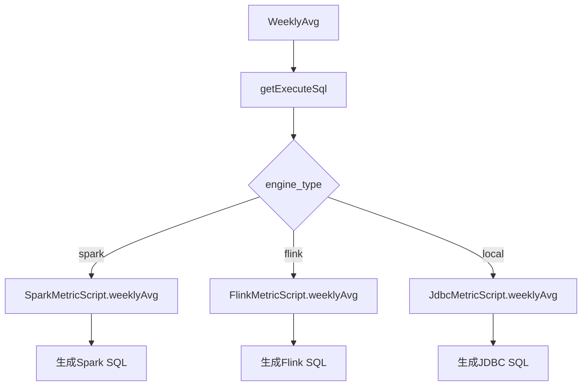
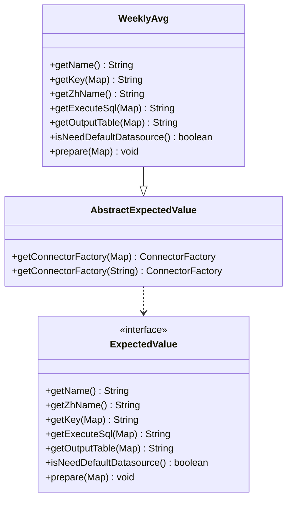
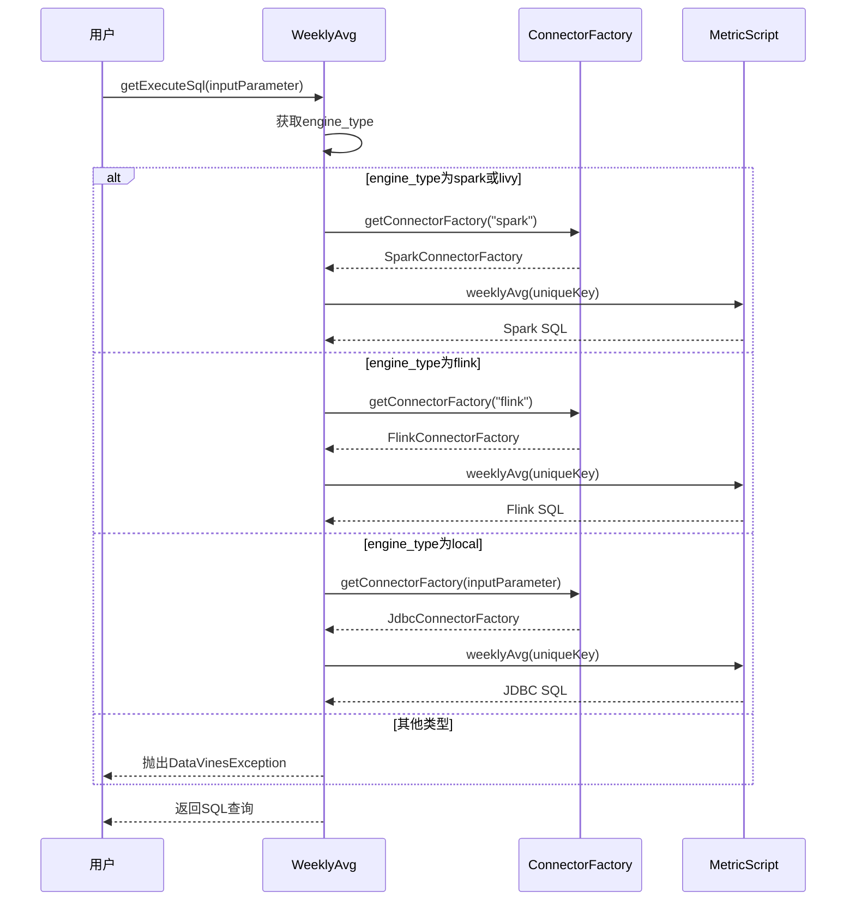
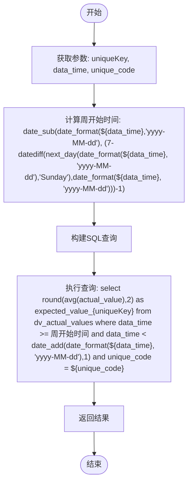
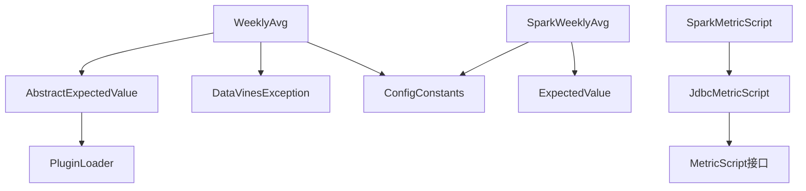

# 周平均值策略

<cite>
**本文档引用文件**  
- [WeeklyAvg.java](file://datavines-metric\datavines-metric-expected-plugins\datavines-metric-expected-weekly-avg\src\main\java\io\datavines\metric\expected\plugin\WeeklyAvg.java)
- [SparkWeeklyAvg.java](file://datavines-metric\datavines-metric-expected-plugins\datavines-metric-expected-weekly-avg\src\main\java\io\datavines\metric\expected\plugin\SparkWeeklyAvg.java)
- [SparkMetricScript.java](file://datavines-connector\datavines-connector-plugins\datavines-connector-spark\src\main\java\io\datavines\connector\plugin\SparkMetricScript.java)
- [FlinkMetricScript.java](file://datavines-connector\datavines-connector-plugins\datavines-connector-flink\src\main\java\io\datavines\connector\plugin\FlinkMetricScript.java)
- [AbstractExpectedValue.java](file://datavines-metric\datavines-metric-expected-plugins\datavines-metric-expected-base\src\main\java\io\datavines\metric\expected\plugin\AbstractExpectedValue.java)
- [ExpectedValue.java](file://datavines-metric\datavines-metric-api\src\main\java\io\datavines\metric\api\ExpectedValue.java)
- [CommonConstants.java](file://datavines-common\src\main\java\io\datavines\common\CommonConstants.java)
- [BaseJobConfigurationBuilder.java](file://datavines-engine\datavines-engine-config\src\main\java\io\datavines\engine\config\BaseJobConfigurationBuilder.java)
- [TimePlaceholderUtils.java](file://datavines-common\src\main\java\io\datavines\common\utils\placeholder\TimePlaceholderUtils.java)
</cite>

## 目录
1. [引言](#引言)
2. [核心组件](#核心组件)
3. [架构概述](#架构概述)
4. [详细组件分析](#详细组件分析)
5. [依赖分析](#依赖分析)
6. [性能考虑](#性能考虑)
7. [故障排除指南](#故障排除指南)
8. [结论](#结论)

## 引言
周平均值预期值策略是DataVines数据质量监控系统中的关键功能，用于计算指定指标在一周时间窗口内的平均值。该策略通过分析历史数据来建立基准值，为业务监控提供参考标准。本文档深入分析了`WeeklyAvg`和`SparkWeeklyAvg`类的实现机制，详细说明了周时间窗口处理逻辑、数据采样周期和Spark分布式计算优化。

## 核心组件
周平均值策略的核心组件包括`WeeklyAvg`和`SparkWeeklyAvg`两个类，它们实现了`ExpectedValue`接口，负责计算一周内数据的平均值。`WeeklyAvg`作为通用实现，支持多种计算引擎，而`SparkWeeklyAvg`则专门针对Spark引擎进行了优化。

**本文档引用文件**
- [WeeklyAvg.java](file://datavines-metric\datavines-metric-expected-plugins\datavines-metric-expected-weekly-avg\src\main\java\io\datavines\metric\expected\plugin\WeeklyAvg.java)
- [SparkWeeklyAvg.java](file://datavines-metric\datavines-metric-expected-plugins\datavines-metric-expected-weekly-avg\src\main\java\io\datavines\metric\expected\plugin\SparkWeeklyAvg.java)

## 架构概述
周平均值策略的架构基于插件化设计，通过`ExpectedValue`接口定义了预期值计算的标准方法。系统根据配置的计算引擎类型（如Spark、Flink或本地）动态选择相应的实现类。`WeeklyAvg`类作为通用入口，根据`engine_type`参数调用不同引擎的`MetricScript`来生成具体的SQL查询。

**图表来源**
- [WeeklyAvg.java](file://datavines-metric\datavines-metric-expected-plugins\datavines-metric-expected-weekly-avg\src\main\java\io\datavines\metric\expected\plugin\WeeklyAvg.java#L44-L58)
- [SparkMetricScript.java](file://datavines-connector\datavines-connector-plugins\datavines-connector-spark\src\main\java\io\datavines\connector\plugin\SparkMetricScript.java#L67-L71)
- [FlinkMetricScript.java](file://datavines-connector\datavines-connector-plugins\datavines-connector-flink\src\main\java\io\datavines\connector\plugin\FlinkMetricScript.java#L69-L72)

## 详细组件分析

### WeeklyAvg类分析
`WeeklyAvg`类继承自`AbstractExpectedValue`，实现了`ExpectedValue`接口。它作为周平均值策略的通用实现，根据不同的计算引擎类型调用相应的`MetricScript`来生成SQL查询。

#### 类图

**图表来源**
- [WeeklyAvg.java](file://datavines-metric\datavines-metric-expected-plugins\datavines-metric-expected-weekly-avg\src\main\java\io\datavines\metric\expected\plugin\WeeklyAvg.java)
- [AbstractExpectedValue.java](file://datavines-metric\datavines-metric-expected-plugins\datavines-metric-expected-base\src\main\java\io\datavines\metric\expected\plugin\AbstractExpectedValue.java)
- [ExpectedValue.java](file://datavines-metric\datavines-metric-api\src\main\java\io\datavines\metric\api\ExpectedValue.java)

#### 执行流程

**图表来源**
- [WeeklyAvg.java](file://datavines-metric\datavines-metric-expected-plugins\datavines-metric-expected-weekly-avg\src\main\java\io\datavines\metric\expected\plugin\WeeklyAvg.java#L44-L58)
- [SparkMetricScript.java](file://datavines-connector\datavines-connector-plugins\datavines-connector-spark\src\main\java\io\datavines\connector\plugin\SparkMetricScript.java#L67-L71)
- [FlinkMetricScript.java](file://datavines-connector\datavines-connector-plugins\datavines-connector-flink\src\main\java\io\datavines\connector\plugin\FlinkMetricScript.java#L69-L72)

### SparkWeeklyAvg类分析
`SparkWeeklyAvg`类是专门为Spark引擎优化的周平均值实现，直接生成适用于Spark SQL的查询语句，避免了通过`ConnectorFactory`的间接调用，提高了执行效率。

#### 算法流程

**图表来源**
- [SparkWeeklyAvg.java](file://datavines-metric\datavines-metric-expected-plugins\datavines-metric-expected-weekly-avg\src\main\java\io\datavines\metric\expected\plugin\SparkWeeklyAvg.java#L44-L49)

## 依赖分析
周平均值策略的实现依赖于多个核心组件，包括`ExpectedValue`接口、`AbstractExpectedValue`基类、`ConnectorFactory`和各种`MetricScript`实现。这些组件通过SPI机制进行插件化管理，实现了良好的扩展性和灵活性。

**图表来源**
- [WeeklyAvg.java](file://datavines-metric\datavines-metric-expected-plugins\datavines-metric-expected-weekly-avg\src\main\java\io\datavines\metric\expected\plugin\WeeklyAvg.java)
- [SparkWeeklyAvg.java](file://datavines-metric\datavines-metric-expected-plugins\datavines-metric-expected-weekly-avg\src\main\java\io\datavines\metric\expected\plugin\SparkWeeklyAvg.java)
- [SparkMetricScript.java](file://datavines-connector\datavines-connector-plugins\datavines-connector-spark\src\main\java\io\datavines\connector\plugin\SparkMetricScript.java)
- [AbstractExpectedValue.java](file://datavines-metric\datavines-metric-expected-plugins\datavines-metric-expected-base\src\main\java\io\datavines\metric\expected\plugin\AbstractExpectedValue.java)

## 性能考虑
周平均值策略在性能方面进行了多项优化：

1. **分布式计算优化**：对于Spark引擎，直接生成优化的Spark SQL查询，充分利用分布式计算能力。
2. **时间窗口计算优化**：使用Spark内置的日期函数高效计算周开始时间，避免了复杂的日期运算。
3. **缓存机制**：通过`getConnectorFactory`的插件加载机制，实现了连接工厂的缓存，减少了重复创建的开销。
4. **SQL生成优化**：预编译的SQL模板减少了运行时的字符串拼接开销。

在处理大规模数据时，建议使用Spark引擎以获得最佳性能。对于小规模数据或测试环境，可以使用本地引擎以简化部署。

## 故障排除指南
### 常见问题及解决方案

| 问题描述 | 可能原因 | 解决方案 |
|---------|--------|---------|
| 查询执行失败 | 引擎类型不支持 | 检查`engine_type`配置，确保为`spark`、`flink`或`local`之一 |
| 结果不准确 | 时间窗口计算错误 | 验证`data_time`参数格式是否正确，应为`yyyy-MM-dd`格式 |
| 性能低下 | 数据量过大 | 考虑使用Spark引擎替代本地引擎，或优化数据分区策略 |
| 连接失败 | 数据源配置错误 | 检查默认数据源配置，确保`isNeedDefaultDatasource`返回`true` |

**本文档引用文件**
- [WeeklyAvg.java](file://datavines-metric\datavines-metric-expected-plugins\datavines-metric-expected-weekly-avg\src\main\java\io\datavines\metric\expected\plugin\WeeklyAvg.java#L56-L57)
- [SparkWeeklyAvg.java](file://datavines-metric\datavines-metric-expected-plugins\datavines-metric-expected-weekly-avg\src\main\java\io\datavines\metric\expected\plugin\SparkWeeklyAvg.java#L58-L59)

## 结论
周平均值策略通过`WeeklyAvg`和`SparkWeeklyAvg`类的协同工作，实现了灵活且高效的周平均值计算功能。该策略支持多种计算引擎，能够适应不同的部署环境和性能需求。通过插件化设计和SPI机制，系统具有良好的扩展性，可以方便地添加新的计算引擎支持。在实际应用中，建议根据数据规模和性能要求选择合适的计算引擎，以获得最佳的监控效果。