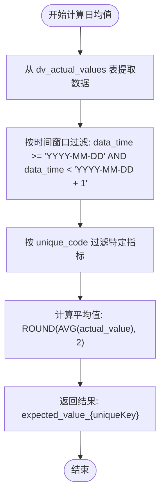
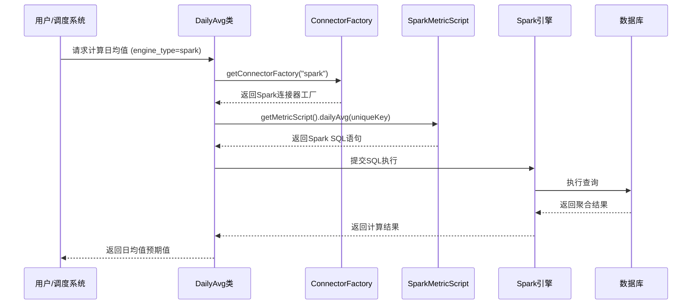

# 日平均值策略

<cite>
**本文档引用的文件**  
- [DailyAvg.java](file://datavines-metric\datavines-metric-expected-plugins\datavines-metric-expected-daily-avg\src\main\java\io\datavines\metric\expected\plugin\DailyAvg.java)
- [SparkDailyAvg.java](file://datavines-metric\datavines-metric-expected-plugins\datavines-metric-expected-daily-avg\src\main\java\io\datavines\metric\expected\plugin\SparkDailyAvg.java)
- [MetricScript.java](file://datavines-connector\datavines-connector-api\src\main\java\io\datavines\connector\api\MetricScript.java)
- [SparkMetricScript.java](file://datavines-connector\datavines-connector-plugins\datavines-connector-spark\src\main\java\io\datavines\connector\plugin\SparkMetricScript.java)
- [FlinkMetricScript.java](file://datavines-connector\datavines-connector-plugins\datavines-connector-flink\src\main\java\io\datavines\connector\plugin\FlinkMetricScript.java)
- [ExpectedValue.java](file://datavines-metric\datavines-metric-api\src\main\java\io\datavines\metric\api\ExpectedValue.java)
- [io.datavines.metric.api.ExpectedValue](file://datavines-metric\datavines-metric-expected-plugins\datavines-metric-expected-daily-avg\src\main\resources\META-INF\plugins\io.datavines.metric.api.ExpectedValue)
</cite>

## 目录
1. [简介](#简介)
2. [核心组件分析](#核心组件分析)
3. [时间窗口与数据聚合机制](#时间窗口与数据聚合机制)
4. [Spark执行计划解析](#spark执行计划解析)
5. [配置示例与应用场景](#配置示例与应用场景)
6. [数据延迟影响与应对策略](#数据延迟影响与应对策略)
7. [结论](#结论)

## 简介
日平均值预期值策略是数据质量监控系统中的关键组件，用于评估指定日期内数据指标的合理性。该策略通过计算历史数据的日平均值作为预期基准，与当日实际值进行对比，从而判断数据是否存在异常波动。本策略支持多种计算引擎（如Spark、Flink等），具备良好的扩展性和灵活性，广泛应用于每日订单量、用户活跃度等关键业务指标的监控场景。

## 核心组件分析

日平均值策略的核心实现由`DailyAvg`和`SparkDailyAvg`两个类构成，它们共同实现了`ExpectedValue`接口，遵循统一的预期值计算规范。

`DailyAvg`类继承自`AbstractExpectedValue`，作为通用的日均值计算实现，负责根据不同的执行引擎类型（spark、flink、local）动态调用相应的连接器工厂获取`MetricScript`，并执行对应的SQL脚本。该类通过`getExecuteSql`方法实现多引擎适配，确保在不同计算平台上的一致性行为。

`SparkDailyAvg`类则直接实现了`ExpectedValue`接口，专为Spark引擎优化，提供了特定的SQL生成逻辑。其`getExecuteSql`方法生成的SQL语句使用Spark SQL特有的日期函数（如`date_format`和`date_add`），确保在Spark环境下的高效执行。

两个类均实现了`getName`、`getZhName`、`getKey`、`getOutputTable`等核心方法，其中`getKey`方法生成用于标识预期值结果的唯一键，`getOutputTable`方法定义了输出结果的临时表名。

**本节来源**
- [DailyAvg.java](file://datavines-metric\datavines-metric-expected-plugins\datavines-metric-expected-daily-avg\src\main\java\io\datavines\metric\expected\plugin\DailyAvg.java#L25-L75)
- [SparkDailyAvg.java](file://datavines-metric\datavines-metric-expected-plugins\datavines-metric-expected-daily-avg\src\main\java\io\datavines\metric\expected\plugin\SparkDailyAvg.java#L25-L66)
- [ExpectedValue.java](file://datavines-metric\datavines-metric-api\src\main\java\io\datavines\metric\api\ExpectedValue.java#L24-L64)

## 时间窗口与数据聚合机制

日平均值策略的时间窗口定义精确到天级别，其计算逻辑基于`data_time`字段进行筛选。对于指定的日期`${data_time}`，时间窗口的起始时间为当天的00:00:00，结束时间为次日的00:00:00（不包含），形成一个左闭右开的区间`[date_format(${data_time}, 'yyyy-MM-dd'), date_add(date_format(${data_time}, 'yyyy-MM-dd'),1))`。

数据聚合采用标准的`AVG()`函数对`actual_value`字段进行计算，并使用`ROUND()`函数将结果保留两位小数。计算过程从`dv_actual_values`表中提取历史数据，通过`unique_code`字段确保仅聚合与当前监控指标相关的数据。聚合结果以`expected_value_{uniqueKey}`为别名返回，便于后续的比较和分析。

该机制确保了每日计算的独立性和一致性，避免了跨日数据的干扰，为数据质量评估提供了可靠的基准。



**图表来源**
- [SparkDailyAvg.java](file://datavines-metric\datavines-metric-expected-plugins\datavines-metric-expected-daily-avg\src\main\java\io\datavines\metric\expected\plugin\SparkDailyAvg.java#L46-L48)
- [MetricScript.java](file://datavines-connector\datavines-connector-api\src\main\java\io\datavines\connector\api\MetricScript.java#L129-L133)

**本节来源**
- [SparkDailyAvg.java](file://datavines-metric\datavines-metric-expected-plugins\datavines-metric-expected-daily-avg\src\main\java\io\datavines\metric\expected\plugin\SparkDailyAvg.java#L44-L49)
- [MetricScript.java](file://datavines-connector\datavines-connector-api\src\main\java\io\datavines\connector\api\MetricScript.java#L129-L133)

## Spark执行计划解析

在Spark引擎环境下，日平均值策略的执行计划由`SparkDailyAvg`类和`SparkMetricScript`类协同完成。当系统检测到`engine_type`为`spark`或`livy`时，`DailyAvg`类会通过`getConnectorFactory("spark")`获取Spark连接器工厂，并调用其`getMetricScript()`方法获得`SparkMetricScript`实例。

`SparkMetricScript`继承自`JdbcMetricScript`，并重写了`dailyAvg`方法，生成适用于Spark SQL的查询语句。该SQL语句利用Spark内置的日期函数`date_format`和`date_add`来精确计算时间窗口边界。执行时，Spark会将此SQL作为任务提交到集群，通过分布式计算快速完成大规模历史数据的聚合分析。

执行计划的优化得益于Spark的Catalyst优化器，它会自动对查询进行解析、优化和代码生成，确保计算的高效性。同时，结果数据会被写入以`daily_range_{uniqueKey}`命名的临时表中，供后续的数据质量校验流程使用。



**图表来源**
- [DailyAvg.java](file://datavines-metric\datavines-metric-expected-plugins\datavines-metric-expected-daily-avg\src\main\java\io\datavines\metric\expected\plugin\DailyAvg.java#L44-L50)
- [SparkMetricScript.java](file://datavines-connector\datavines-connector-plugins\datavines-connector-spark\src\main\java\io\datavines\connector\plugin\SparkMetricScript.java#L39-L43)

**本节来源**
- [DailyAvg.java](file://datavines-metric\datavines-metric-expected-plugins\datavines-metric-expected-daily-avg\src\main\java\io\datavines\metric\expected\plugin\DailyAvg.java#L44-L57)
- [SparkMetricScript.java](file://datavines-connector\datavines-connector-plugins\datavines-connector-spark\src\main\java\io\datavines\connector\plugin\SparkMetricScript.java#L39-L43)

## 配置示例与应用场景

### 配置示例
日平均值策略通过SPI机制进行注册和加载。在`META-INF/plugins/io.datavines.metric.api.ExpectedValue`文件中，定义了不同引擎类型对应的实现类：
```
local_daily_avg=io.datavines.metric.expected.plugin.DailyAvg
spark_daily_avg=io.datavines.metric.expected.plugin.DailyAvg
livy_daily_avg=io.datavines.metric.expected.plugin.DailyAvg
flink_daily_avg=io.datavines.metric.expected.plugin.DailyAvg
```
这表明无论使用何种引擎，系统最终都会加载`DailyAvg`类，并根据`engine_type`参数选择具体的SQL生成逻辑。

### 典型应用场景：每日订单量监控
在电商数据质量监控中，日平均值策略常用于监控每日订单量。配置流程如下：
1.  **定义指标**：创建一个监控指标，其实际值（actual value）为当日订单总数。
2.  **设置预期值策略**：选择“日均值”作为预期值策略。
3.  **配置执行引擎**：根据数据平台选择Spark或Flink作为计算引擎。
4.  **设定阈值**：配置允许的偏差范围，例如±10%。

系统将自动计算过去一段时间（如最近30天）的订单量日均值，并将其作为当日订单量的预期基准。如果当日订单量超出`预期值 ± 10%`的范围，系统将触发告警，提示数据异常，可能是由于数据采集故障、系统宕机或真实业务波动所致。

**本节来源**
- [io.datavines.metric.api.ExpectedValue](file://datavines-metric\datavines-metric-expected-plugins\datavines-metric-expected-daily-avg\src\main\resources\META-INF\plugins\io.datavines.metric.api.ExpectedValue#L1-L4)
- [DailyAvg.java](file://datavines-metric\datavines-metric-expected-plugins\datavines-metric-expected-daily-avg\src\main\java\io\datavines\metric\expected\plugin\DailyAvg.java#L44-L57)

## 数据延迟影响与应对策略

数据延迟是影响日平均值计算准确性的主要因素。由于数据从产生到入库存在一定的延迟，当日的`actual_value`可能在计算时并未完全写入`dv_actual_values`表，导致计算出的“日均值”实际上只包含了部分数据，从而产生偏差。

### 影响分析
- **低估风险**：在数据延迟严重的场景下，当日聚合的`actual_value`不完整，导致计算出的平均值偏低。
- **误报风险**：基于不完整数据计算的预期值会触发错误的告警，影响数据监控的可信度。

### 应对策略
1.  **延迟容忍机制**：在调度日平均值计算任务时，引入一个合理的延迟（如30分钟或1小时），等待大部分数据写入完成后再进行计算。
2.  **数据水位监控**：建立数据延迟监控体系，实时跟踪各数据源的延迟情况。当日均值计算任务启动前，先检查相关数据源的延迟是否在可接受范围内。
3.  **多次计算与修正**：对于关键指标，可以设计多次计算的机制。例如，首次计算在T+1小时进行，后续每隔一段时间重新计算一次，直到数据完全就绪，最终以最完整的那次计算结果为准。
4.  **使用事件时间**：在数据采集和处理环节，严格使用事件时间（Event Time）而非处理时间（Processing Time），确保数据按其真实发生时间进行归集和计算。

通过以上策略，可以有效缓解数据延迟带来的负面影响，确保日平均值预期值的准确性和可靠性。

## 结论
日平均值预期值策略通过`DailyAvg`和`SparkDailyAvg`等核心类的协同工作，实现了跨引擎的、高效的数据质量监控能力。其基于精确的时间窗口和标准的聚合函数，为业务指标提供了可靠的基准。该策略在Spark等分布式计算引擎上的良好集成，使其能够处理海量历史数据。尽管面临数据延迟的挑战，但通过合理的调度和监控策略，可以有效保障计算结果的准确性。该策略在每日订单量、用户活跃度等场景中具有广泛的应用价值，是构建健壮数据质量体系的重要组成部分。