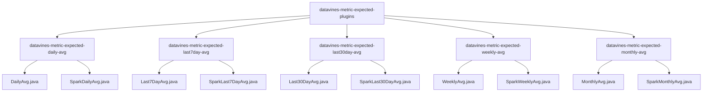
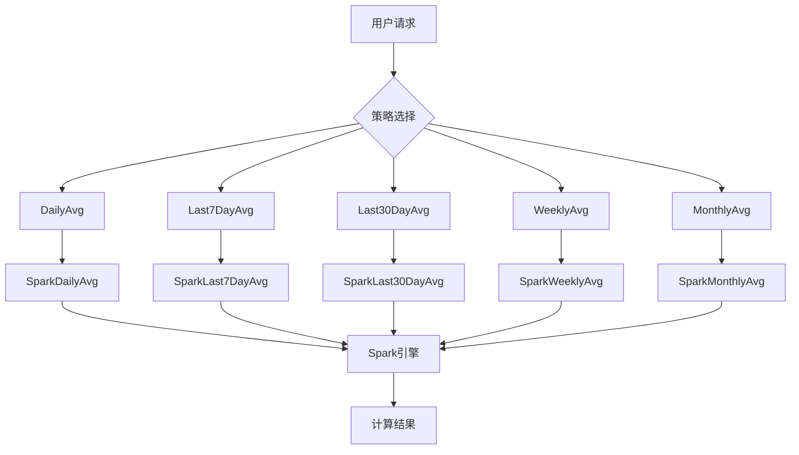
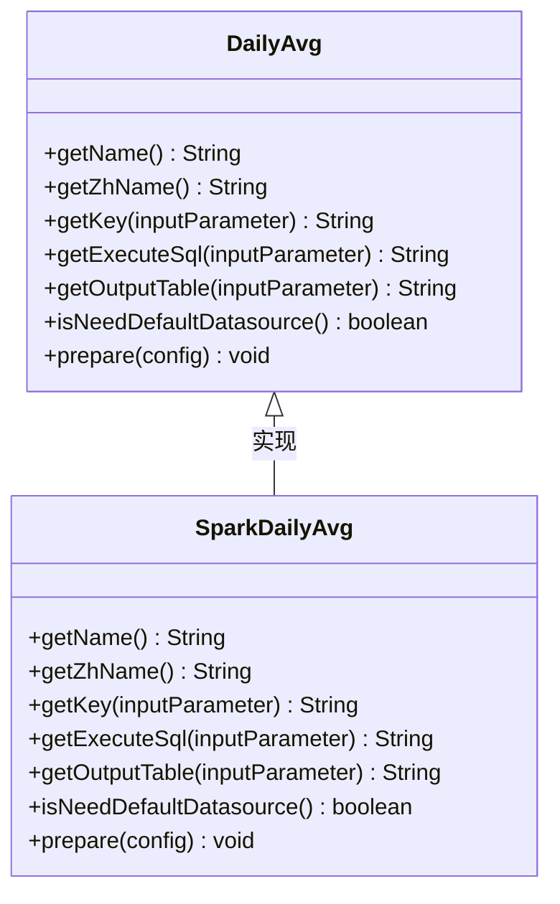
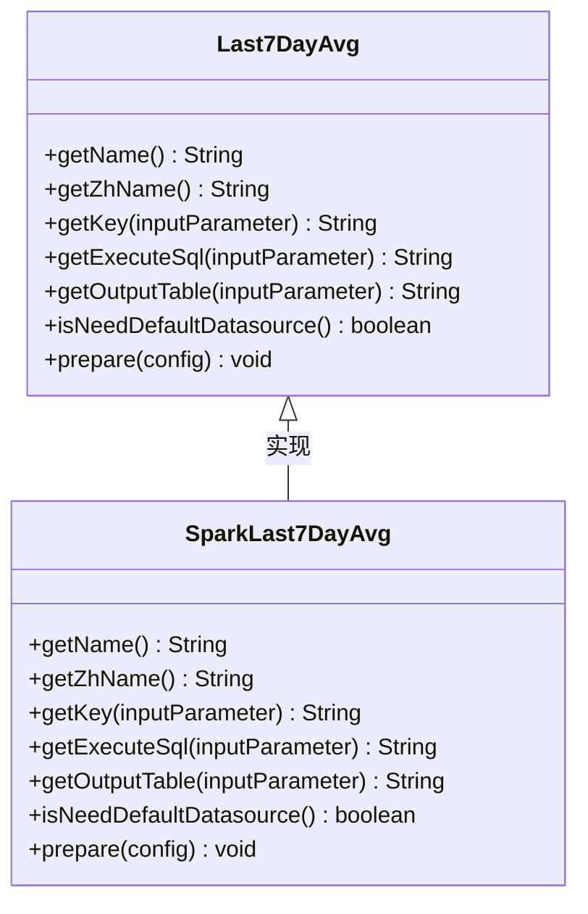
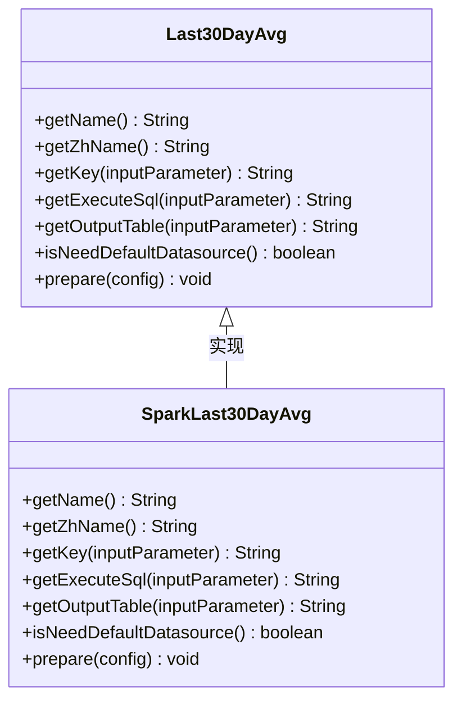
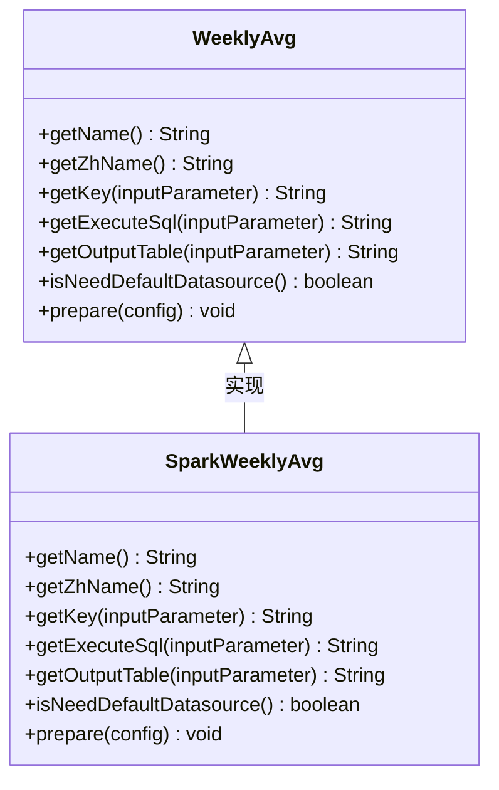
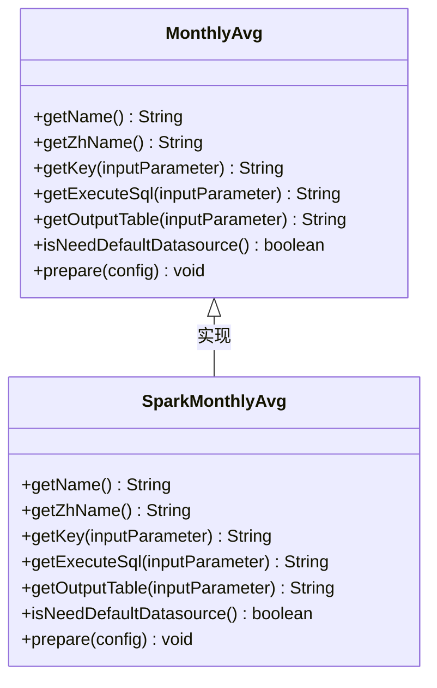
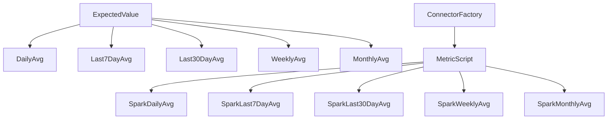

# 时间序列平均值策略

<cite>
**本文档引用的文件**
- [DailyAvg.java](file://datavines-metric/expected-plugins/datavines-metric-expected-daily-avg/src/main/java/io/datavines/metric/expected/plugin/DailyAvg.java)
- [Last7DayAvg.java](file://datavines-metric/expected-plugins/datavines-metric-expected-last7day-avg/src/main/java/io/datavines/metric/expected/plugin/Last7DayAvg.java)
- [Last30DayAvg.java](file://datavines-metric/expected-plugins/datavines-metric-expected-last30day-avg/src/main/java/io/datavines/metric/expected/plugin/Last30DayAvg.java)
- [WeeklyAvg.java](file://datavines-metric/expected-plugins/datavines-metric-expected-weekly-avg/src/main/java/io/datavines/metric/expected/plugin/WeeklyAvg.java)
- [MonthlyAvg.java](file://datavines-metric/expected-plugins/datavines-metric-expected-monthly-avg/src/main/java/io/datavines/metric/expected/plugin/MonthlyAvg.java)
- [SparkDailyAvg.java](file://datavines-metric/expected-plugins/datavines-metric-expected-daily-avg/src/main/java/io/datavines/metric/expected/plugin/SparkDailyAvg.java)
- [SparkLast7DayAvg.java](file://datavines-metric/expected-plugins/datavines-metric-expected-last7day-avg/src/main/java/io/datavines/metric/expected/plugin/SparkLast7DayAvg.java)
- [SparkLast30DayAvg.java](file://datavines-metric/expected-plugins/datavines-metric-expected-last30day-avg/src/main/java/io/datavines/metric/expected/plugin/SparkLast30DayAvg.java)
- [SparkWeeklyAvg.java](file://datavines-metric/expected-plugins/datavines-metric-expected-weekly-avg/src/main/java/io/datavines/metric/expected/plugin/SparkWeeklyAvg.java)
- [SparkMonthlyAvg.java](file://datavines-metric/expected-plugins/datavines-metric-expected-monthly-avg/src/main/java/io/datavines/metric/expected/plugin/SparkMonthlyAvg.java)
- [ExpectedValue.java](file://datavines-metric/metric-api/src/main/java/io/datavines/metric/api/ExpectedValue.java)
- [ConnectorFactory.java](file://datavines-connector/connector-api/src/main/java/io/datavines/connector/api/ConnectorFactory.java)
</cite>

## 目录
1. [引言](#引言)
2. [项目结构](#项目结构)
3. [核心组件](#核心组件)
4. [架构概述](#架构概述)
5. [详细组件分析](#详细组件分析)
6. [依赖分析](#依赖分析)
7. [性能考虑](#性能考虑)
8. [故障排除指南](#故障排除指南)
9. [结论](#结论)
10. [附录](#附录)（如有必要）

## 引言
本文档详细介绍了DataVines平台中时间序列平均值预期值策略的实现机制。重点分析了DailyAvg、Last7DayAvg、Last30DayAvg、WeeklyAvg和MonthlyAvg等策略的计算逻辑和时间窗口处理机制。文档解释了这些策略如何通过Spark引擎执行历史数据聚合计算，详细说明了各策略的配置参数、时间范围定义和数据采样方法。同时，提供了不同时间粒度预期值在业务监控中的应用案例，并讨论了数据延迟和窗口对齐对计算结果的影响。

## 项目结构
DataVines平台的项目结构清晰地组织了各种预期值策略的实现。所有时间序列平均值策略都位于`datavines-metric-expected-plugins`模块中，每个策略都有独立的子模块。这种模块化设计使得策略的扩展和维护更加容易。

**图表来源**
- [DailyAvg.java](file://datavines-metric/expected-plugins/datavines-metric-expected-daily-avg/src/main/java/io/datavines/metric/expected/plugin/DailyAvg.java)
- [Last7DayAvg.java](file://datavines-metric/expected-plugins/datavines-metric-expected-last7day-avg/src/main/java/io/datavines/metric/expected/plugin/Last7DayAvg.java)
- [Last30DayAvg.java](file://datavines-metric/expected-plugins/datavines-metric-expected-last30day-avg/src/main/java/io/datavines/metric/expected/plugin/Last30DayAvg.java)
- [WeeklyAvg.java](file://datavines-metric/expected-plugins/datavines-metric-expected-weekly-avg/src/main/java/io/datavines/metric/expected/plugin/WeeklyAvg.java)
- [MonthlyAvg.java](file://datavines-metric/expected-plugins/datavines-metric-expected-monthly-avg/src/main/java/io/datavines/metric/expected/plugin/MonthlyAvg.java)

**章节来源**
- [DailyAvg.java](file://datavines-metric/expected-plugins/datavines-metric-expected-daily-avg/src/main/java/io/datavines/metric/expected/plugin/DailyAvg.java)
- [Last7DayAvg.java](file://datavines-metric/expected-plugins/datavines-metric-expected-last7day-avg/src/main/java/io/datavines/metric/expected/plugin/Last7DayAvg.java)
- [Last30DayAvg.java](file://datavines-metric/expected-plugins/datavines-metric-expected-last30day-avg/src/main/java/io/datavines/metric/expected/plugin/Last30DayAvg.java)
- [WeeklyAvg.java](file://datavines-metric/expected-plugins/datavines-metric-expected-weekly-avg/src/main/java/io/datavines/metric/expected/plugin/WeeklyAvg.java)
- [MonthlyAvg.java](file://datavines-metric/expected-plugins/datavines-metric-expected-monthly-avg/src/main/java/io/datavines/metric/expected/plugin/MonthlyAvg.java)

## 核心组件
时间序列平均值策略的核心组件包括各种预期值计算策略的实现类，如DailyAvg、Last7DayAvg、Last30DayAvg、WeeklyAvg和MonthlyAvg。这些组件都实现了ExpectedValue接口，提供了统一的API来获取策略名称、执行SQL和输出表名等信息。每个策略都有对应的Spark引擎实现类，用于生成特定于Spark的执行SQL。

**章节来源**
- [DailyAvg.java](file://datavines-metric/expected-plugins/datavines-metric-expected-daily-avg/src/main/java/io/datavines/metric/expected/plugin/DailyAvg.java)
- [Last7DayAvg.java](file://datavines-metric/expected-plugins/datavines-metric-expected-last7day-avg/src/main/java/io/datavines/metric/expected/plugin/Last7DayAvg.java)
- [Last30DayAvg.java](file://datavines-metric/expected-plugins/datavines-metric-expected-last30day-avg/src/main/java/io/datavines/metric/expected/plugin/Last30DayAvg.java)
- [WeeklyAvg.java](file://datavines-metric/expected-plugins/datavines-metric-expected-weekly-avg/src/main/java/io/datavines/metric/expected/plugin/WeeklyAvg.java)
- [MonthlyAvg.java](file://datavines-metric/expected-plugins/datavines-metric-expected-monthly-avg/src/main/java/io/datavines/metric/expected/plugin/MonthlyAvg.java)

## 架构概述
时间序列平均值策略的架构基于插件化设计模式，通过SPI（Service Provider Interface）机制实现策略的动态加载。系统通过ConnectorFactory获取相应的MetricScript来生成执行SQL，然后由Spark引擎执行这些SQL来计算预期值。

**图表来源**
- [DailyAvg.java](file://datavines-metric/expected-plugins/datavines-metric-expected-daily-avg/src/main/java/io/datavines/metric/expected/plugin/DailyAvg.java)
- [Last7DayAvg.java](file://datavines-metric/expected-plugins/datavines-metric-expected-last7day-avg/src/main/java/io/datavines/metric/expected/plugin/Last7DayAvg.java)
- [Last30DayAvg.java](file://datavines-metric/expected-plugins/datavines-metric-expected-last30day-avg/src/main/java/io/datavines/metric/expected/plugin/Last30DayAvg.java)
- [WeeklyAvg.java](file://datavines-metric/expected-plugins/datavines-metric-expected-weekly-avg/src/main/java/io/datavines/metric/expected/plugin/WeeklyAvg.java)
- [MonthlyAvg.java](file://datavines-metric/expected-plugins/datavines-metric-expected-monthly-avg/src/main/java/io/datavines/metric/expected/plugin/MonthlyAvg.java)
- [SparkDailyAvg.java](file://datavines-metric/expected-plugins/datavines-metric-expected-daily-avg/src/main/java/io/datavines/metric/expected/plugin/SparkDailyAvg.java)
- [SparkLast7DayAvg.java](file://datavines-metric/expected-plugins/datavines-metric-expected-last7day-avg/src/main/java/io/datavines/metric/expected/plugin/SparkLast7DayAvg.java)
- [SparkLast30DayAvg.java](file://datavines-metric/expected-plugins/datavines-metric-expected-last30day-avg/src/main/java/io/datavines/metric/expected/plugin/SparkLast30DayAvg.java)
- [SparkWeeklyAvg.java](file://datavines-metric/expected-plugins/datavines-metric-expected-weekly-avg/src/main/java/io/datavines/metric/expected/plugin/SparkWeeklyAvg.java)
- [SparkMonthlyAvg.java](file://datavines-metric/expected-plugins/datavines-metric-expected-monthly-avg/src/main/java/io/datavines/metric/expected/plugin/SparkMonthlyAvg.java)

## 详细组件分析
### DailyAvg策略分析
DailyAvg策略用于计算每日平均值，其时间窗口为当前日期的00:00:00到23:59:59。该策略通过Spark引擎执行SQL查询来计算预期值。

**图表来源**
- [DailyAvg.java](file://datavines-metric/expected-plugins/datavines-metric-expected-daily-avg/src/main/java/io/datavines/metric/expected/plugin/DailyAvg.java)
- [SparkDailyAvg.java](file://datavines-metric/expected-plugins/datavines-metric-expected-daily-avg/src/main/java/io/datavines/metric/expected/plugin/SparkDailyAvg.java)

### Last7DayAvg策略分析
Last7DayAvg策略用于计算最近7天的平均值，其时间窗口为当前日期往前推7天到当前日期。该策略同样通过Spark引擎执行SQL查询来计算预期值。

**图表来源**
- [Last7DayAvg.java](file://datavines-metric/expected-plugins/datavines-metric-expected-last7day-avg/src/main/java/io/datavines/metric/expected/plugin/Last7DayAvg.java)
- [SparkLast7DayAvg.java](file://datavines-metric/expected-plugins/datavines-metric-expected-last7day-avg/src/main/java/io/datavines/metric/expected/plugin/SparkLast7DayAvg.java)

### Last30DayAvg策略分析
Last30DayAvg策略用于计算最近30天的平均值，其时间窗口为当前日期往前推30天到当前日期。该策略通过Spark引擎执行SQL查询来计算预期值。

**图表来源**
- [Last30DayAvg.java](file://datavines-metric/expected-plugins/datavines-metric-expected-last30day-avg/src/main/java/io/datavines/metric/expected/plugin/Last30DayAvg.java)
- [SparkLast30DayAvg.java](file://datavines-metric/expected-plugins/datavines-metric-expected-last30day-avg/src/main/java/io/datavines/metric/expected/plugin/SparkLast30DayAvg.java)

### WeeklyAvg策略分析
WeeklyAvg策略用于计算周平均值，其时间窗口为当前周的周一到周日。该策略通过Spark引擎执行SQL查询来计算预期值。

**图表来源**
- [WeeklyAvg.java](file://datavines-metric/expected-plugins/datavines-metric-expected-weekly-avg/src/main/java/io/datavines/metric/expected/plugin/WeeklyAvg.java)
- [SparkWeeklyAvg.java](file://datavines-metric/expected-plugins/datavines-metric-expected-weekly-avg/src/main/java/io/datavines/metric/expected/plugin/SparkWeeklyAvg.java)

### MonthlyAvg策略分析
MonthlyAvg策略用于计算月平均值，其时间窗口为当前月的第一天到最后一天。该策略通过Spark引擎执行SQL查询来计算预期值。

**图表来源**
- [MonthlyAvg.java](file://datavines-metric/expected-plugins/datavines-metric-expected-monthly-avg/src/main/java/io/datavines/metric/expected/plugin/MonthlyAvg.java)
- [SparkMonthlyAvg.java](file://datavines-metric/expected-plugins/datavines-metric-expected-monthly-avg/src/main/java/io/datavines/metric/expected/plugin/SparkMonthlyAvg.java)

**章节来源**
- [DailyAvg.java](file://datavines-metric/expected-plugins/datavines-metric-expected-daily-avg/src/main/java/io/datavines/metric/expected/plugin/DailyAvg.java)
- [Last7DayAvg.java](file://datavines-metric/expected-plugins/datavines-metric-expected-last7day-avg/src/main/java/io/datavines/metric/expected/plugin/Last7DayAvg.java)
- [Last30DayAvg.java](file://datavines-metric/expected-plugins/datavines-metric-expected-last30day-avg/src/main/java/io/datavines/metric/expected/plugin/Last30DayAvg.java)
- [WeeklyAvg.java](file://datavines-metric/expected-plugins/datavines-metric-expected-weekly-avg/src/main/java/io/datavines/metric/expected/plugin/WeeklyAvg.java)
- [MonthlyAvg.java](file://datavines-metric/expected-plugins/datavines-metric-expected-monthly-avg/src/main/java/io/datavines/metric/expected/plugin/MonthlyAvg.java)
- [SparkDailyAvg.java](file://datavines-metric/expected-plugins/datavines-metric-expected-daily-avg/src/main/java/io/datavines/metric/expected/plugin/SparkDailyAvg.java)
- [SparkLast7DayAvg.java](file://datavines-metric/expected-plugins/datavines-metric-expected-last7day-avg/src/main/java/io/datavines/metric/expected/plugin/SparkLast7DayAvg.java)
- [SparkLast30DayAvg.java](file://datavines-metric/expected-plugins/datavines-metric-expected-last30day-avg/src/main/java/io/datavines/metric/expected/plugin/SparkLast30DayAvg.java)
- [SparkWeeklyAvg.java](file://datavines-metric/expected-plugins/datavines-metric-expected-weekly-avg/src/main/java/io/datavines/metric/expected/plugin/SparkWeeklyAvg.java)
- [SparkMonthlyAvg.java](file://datavines-metric/expected-plugins/datavines-metric-expected-monthly-avg/src/main/java/io/datavines/metric/expected/plugin/SparkMonthlyAvg.java)

## 依赖分析
时间序列平均值策略依赖于ExpectedValue接口和ConnectorFactory接口。ExpectedValue接口定义了策略的基本行为，而ConnectorFactory接口提供了获取MetricScript的能力，用于生成执行SQL。

**图表来源**
- [ExpectedValue.java](file://datavines-metric/metric-api/src/main/java/io/datavines/metric/api/ExpectedValue.java)
- [ConnectorFactory.java](file://datavines-connector/connector-api/src/main/java/io/datavines/connector/api/ConnectorFactory.java)

**章节来源**
- [ExpectedValue.java](file://datavines-metric/metric-api/src/main/java/io/datavines/metric/api/ExpectedValue.java)
- [ConnectorFactory.java](file://datavines-connector/connector-api/src/main/java/io/datavines/connector/api/ConnectorFactory.java)

## 性能考虑
在执行时间序列平均值计算时，需要考虑以下几个性能因素：
1. 数据量：历史数据量越大，计算时间越长。
2. 窗口大小：时间窗口越大，需要处理的数据越多，计算时间越长。
3. 查询优化：通过合理的索引和分区策略可以提高查询性能。
4. 资源分配：合理分配Spark集群资源可以提高计算效率。

## 故障排除指南
在使用时间序列平均值策略时，可能会遇到以下问题：
1. 数据延迟：由于数据延迟，可能导致计算结果不准确。
2. 窗口对齐：时间窗口的对齐方式可能影响计算结果。
3. SQL语法错误：生成的SQL可能存在语法错误，需要检查。
4. 资源不足：Spark集群资源不足可能导致计算失败。

**章节来源**
- [DailyAvg.java](file://datavines-metric/expected-plugins/datavines-metric-expected-daily-avg/src/main/java/io/datavines/metric/expected/plugin/DailyAvg.java)
- [Last7DayAvg.java](file://datavines-metric/expected-plugins/datavines-metric-expected-last7day-avg/src/main/java/io/datavines/metric/expected/plugin/Last7DayAvg.java)
- [Last30DayAvg.java](file://datavines-metric/expected-plugins/datavines-metric-expected-last30day-avg/src/main/java/io/datavines/metric/expected/plugin/Last30DayAvg.java)
- [WeeklyAvg.java](file://datavines-metric/expected-plugins/datavines-metric-expected-weekly-avg/src/main/java/io/datavines/metric/expected/plugin/WeeklyAvg.java)
- [MonthlyAvg.java](file://datavines-metric/expected-plugins/datavines-metric-expected-monthly-avg/src/main/java/io/datavines/metric/expected/plugin/MonthlyAvg.java)

## 结论
本文档详细介绍了DataVines平台中时间序列平均值预期值策略的实现机制。通过分析DailyAvg、Last7DayAvg、Last30DayAvg、WeeklyAvg和MonthlyAvg等策略的计算逻辑和时间窗口处理机制，我们可以更好地理解这些策略在业务监控中的应用。同时，文档还讨论了数据延迟和窗口对齐对计算结果的影响，为实际应用提供了有价值的参考。

## 附录
### 配置参数说明
- **engine_type**: 指定使用的计算引擎类型，如spark、flink或local。
- **src_connector_type**: 指定数据源连接器类型。
- **METRIC_UNIQUE_KEY**: 指定指标的唯一键，用于生成输出表名和SQL查询。

### 应用案例
1. **日均交易量监控**: 使用DailyAvg策略监控每日交易量，及时发现异常波动。
2. **周同比波动分析**: 使用Last7DayAvg策略分析周同比波动，评估业务趋势。
3. **月度业绩评估**: 使用MonthlyAvg策略评估月度业绩，为决策提供数据支持。