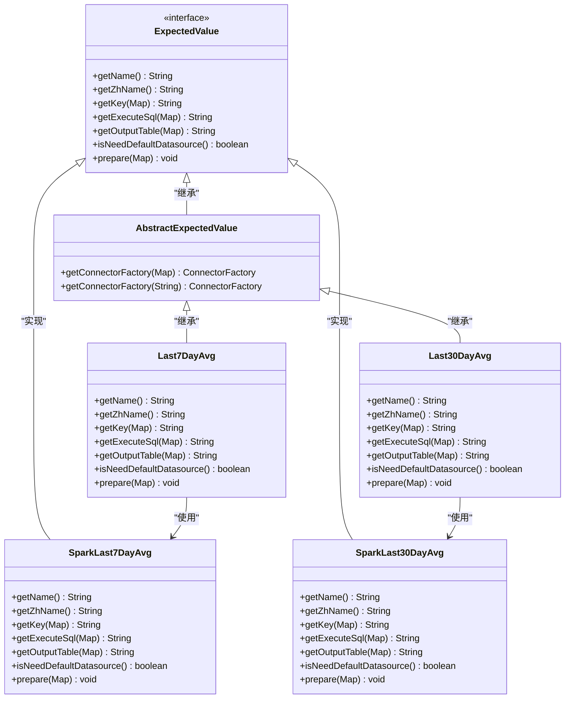
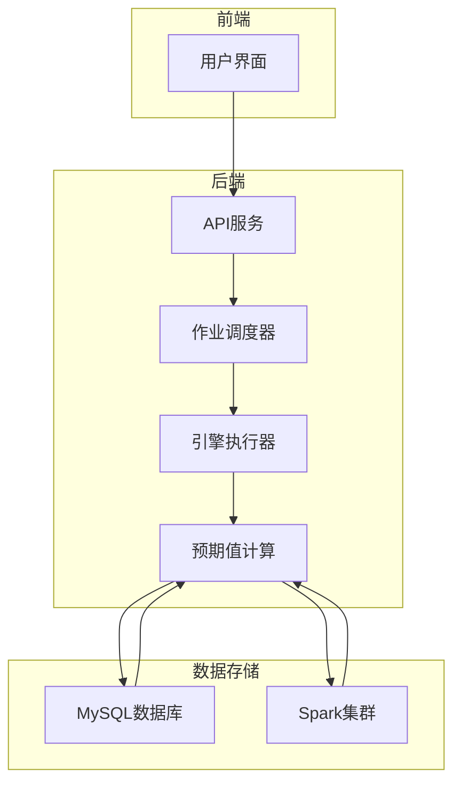

# 最近N天平均值策略

<cite>
**本文档引用的文件**   
- [Last7DayAvg.java](file://datavines-metric\datavines-metric-expected-plugins\datavines-metric-expected-last7day-avg\src\main\java\io\datavines\metric\expected\plugin\Last7DayAvg.java)
- [SparkLast7DayAvg.java](file://datavines-metric\datavines-metric-expected-plugins\datavines-metric-expected-last7day-avg\src\main\java\io\datavines\metric\expected\plugin\SparkLast7DayAvg.java)
- [Last30DayAvg.java](file://datavines-metric\datavines-metric-expected-plugins\datavines-metric-expected-last30day-avg\src\main\java\io\datavines\metric\expected\plugin\Last30DayAvg.java)
- [SparkLast30DayAvg.java](file://datavines-metric\datavines-metric-expected-plugins\datavines-metric-expected-last30day-avg\src\main\java\io\datavines\metric\expected\plugin\SparkLast30DayAvg.java)
- [MetricScript.java](file://datavines-connector\datavines-connector-api\src\main\java\io\datavines\connector\api\MetricScript.java)
- [datavines-mysql.sql](file://scripts\sql\datavines-mysql.sql)
</cite>

## 目录
1. [引言](#引言)
2. [核心组件分析](#核心组件分析)
3. [架构概述](#架构概述)
4. [详细组件分析](#详细组件分析)
5. [滑动时间窗口处理机制](#滑动时间窗口处理机制)
6. [配置方法与性能优化](#配置方法与性能优化)
7. [应用案例](#应用案例)
8. [数据新鲜度与监控效果](#数据新鲜度与监控效果)
9. [结论](#结论)

## 引言
最近N天平均值预期值策略是数据质量监控系统中的核心功能之一，用于评估当前数据指标与历史数据趋势的偏离程度。该策略通过计算最近7天或30天的历史平均值，作为当前数据的预期值，从而判断数据是否存在异常波动。本文档将深入分析Last7DayAvg、Last30DayAvg及其Spark实现类的计算逻辑，解释滑动时间窗口的处理机制，详细说明不同时间跨度的配置方法、性能优化策略和历史数据查询优化。

## 核心组件分析

最近N天平均值策略的核心组件包括`Last7DayAvg`、`Last30DayAvg`及其对应的Spark实现类`SparkLast7DayAvg`和`SparkLast30DayAvg`。这些类实现了`ExpectedValue`接口，提供了计算预期值所需的方法。

**组件关系**


**图表来源**
- [Last7DayAvg.java](file://datavines-metric\datavines-metric-expected-plugins\datavines-metric-expected-last7day-avg\src\main\java\io\datavines\metric\expected\plugin\Last7DayAvg.java)
- [Last30DayAvg.java](file://datavines-metric\datavines-metric-expected-plugins\datavines-metric-expected-last30day-avg\src\main\java\io\datavines\metric\expected\plugin\Last30DayAvg.java)
- [SparkLast7DayAvg.java](file://datavines-metric\datavines-metric-expected-plugins\datavines-metric-expected-last7day-avg\src\main\java\io\datavines\metric\expected\plugin\SparkLast7DayAvg.java)
- [SparkLast30DayAvg.java](file://datavines-metric\datavines-metric-expected-plugins\datavines-metric-expected-last30day-avg\src\main\java\io\datavines\metric\expected\plugin\SparkLast30DayAvg.java)

**章节来源**
- [Last7DayAvg.java](file://datavines-metric\datavines-metric-expected-plugins\datavines-metric-expected-last7day-avg\src\main\java\io\datavines\metric\expected\plugin\Last7DayAvg.java)
- [Last30DayAvg.java](file://datavines-metric\datavines-metric-expected-plugins\datavines-metric-expected-last30day-avg\src\main\java\io\datavines\metric\expected\plugin\Last30DayAvg.java)

## 架构概述

最近N天平均值策略的架构设计遵循了插件化和可扩展的原则。系统通过`ExpectedValue`接口定义了预期值计算的标准方法，不同的时间跨度（如7天、30天）通过实现该接口来提供具体的计算逻辑。对于不同的执行引擎（如Spark、Flink、Local），系统提供了相应的实现类来生成特定于引擎的SQL语句。

**系统架构图**


**图表来源**
- [Last7DayAvg.java](file://datavines-metric\datavines-metric-expected-plugins\datavines-metric-expected-last7day-avg\src\main\java\io\datavines\metric\expected\plugin\Last7DayAvg.java)
- [Last30DayAvg.java](file://datavines-metric\datavines-metric-expected-plugins\datavines-metric-expected-last30day-avg\src\main\java\io\datavines\metric\expected\plugin\Last30DayAvg.java)
- [datavines-mysql.sql](file://scripts\sql\datavines-mysql.sql)

**章节来源**
- [Last7DayAvg.java](file://datavines-metric\datavines-metric-expected-plugins\datavines-metric-expected-last7day-avg\src\main\java\io\datavines\metric\expected\plugin\Last7DayAvg.java)
- [Last30DayAvg.java](file://datavines-metric\datavines-metric-expected-plugins\datavines-metric-expected-last30day-avg\src\main\java\io\datavines\metric\expected\plugin\Last30DayAvg.java)

## 详细组件分析

### Last7DayAvg 分析
`Last7DayAvg`类是最近7天平均值策略的核心实现，它继承自`AbstractExpectedValue`类，实现了`ExpectedValue`接口。该类的主要职责是根据配置参数生成相应的SQL查询语句，用于计算最近7天的平均值。

**关键方法分析**
- `getName()`: 返回策略的英文名称"last_7d_avg"。
- `getZhName()`: 返回策略的中文名称"最近7天均值"。
- `getKey(Map<String,String> inputParameter)`: 生成用于标识预期值的键，格式为"expected_value_{uniqueKey}"。
- `getExecuteSql(Map<String,String> inputParameter)`: 根据执行引擎类型（Spark、Flink、Local）调用相应的`MetricScript`生成SQL查询语句。
- `getOutputTable(Map<String,String> inputParameter)`: 返回输出表的名称，格式为"last_7d_{uniqueKey}"。
- `isNeedDefaultDatasource()`: 返回true，表示需要默认的数据源。

**章节来源**
- [Last7DayAvg.java](file://datavines-metric\datavines-metric-expected-plugins\datavines-metric-expected-last7day-avg\src\main\java\io\datavines\metric\expected\plugin\Last7DayAvg.java)

### SparkLast7DayAvg 分析
`SparkLast7DayAvg`类是针对Spark执行引擎的最近7天平均值策略实现。它直接实现了`ExpectedValue`接口，提供了针对Spark的SQL生成逻辑。

**关键方法分析**
- `getName()`: 返回策略的英文名称"last_7d_avg"。
- `getZhName()`: 返回策略的中文名称"最近7天均值"。
- `getKey(Map<String,String> inputParameter)`: 生成用于标识预期值的键，格式为"last_7d_{uniqueKey}.expected_value_{uniqueKey}"。
- `getExecuteSql(Map<String,String> inputParameter)`: 生成计算最近7天平均值的SQL查询语句，使用`date_add`函数计算时间范围。
- `getOutputTable(Map<String,String> inputParameter)`: 返回输出表的名称，格式为"last_7d_{uniqueKey}"。
- `isNeedDefaultDatasource()`: 返回true，表示需要默认的数据源。

**章节来源**
- [SparkLast7DayAvg.java](file://datavines-metric\datavines-metric-expected-plugins\datavines-metric-expected-last7day-avg\src\main\java\io\datavines\metric\expected\plugin\SparkLast7DayAvg.java)

### Last30DayAvg 分析
`Last30DayAvg`类是最近30天平均值策略的核心实现，其结构和功能与`Last7DayAvg`类似，但时间跨度为30天。

**关键方法分析**
- `getName()`: 返回策略的英文名称"last_30d_avg"。
- `getZhName()`: 返回策略的中文名称"最近30天均值"。
- `getKey(Map<String,String> inputParameter)`: 生成用于标识预期值的键，格式为"expected_value_{uniqueKey}"。
- `getExecuteSql(Map<String,String> inputParameter)`: 根据执行引擎类型调用相应的`MetricScript`生成SQL查询语句。
- `getOutputTable(Map<String,String> inputParameter)`: 返回输出表的名称，格式为"last_30d_{uniqueKey}"。
- `isNeedDefaultDatasource()`: 返回true，表示需要默认的数据源。

**章节来源**
- [Last30DayAvg.java](file://datavines-metric\datavines-metric-expected-plugins\datavines-metric-expected-last30day-avg\src\main\java\io\datavines\metric\expected\plugin\Last30DayAvg.java)

### SparkLast30DayAvg 分析
`SparkLast30DayAvg`类是针对Spark执行引擎的最近30天平均值策略实现，其结构和功能与`SparkLast7DayAvg`类似，但时间跨度为30天。

**关键方法分析**
- `getName()`: 返回策略的英文名称"last_30d_avg"。
- `getZhName()`: 返回策略的中文名称"最近30天均值"。
- `getKey(Map<String,String> inputParameter)`: 生成用于标识预期值的键，格式为"last_30d_{uniqueKey}.expected_value_{uniqueKey}"。
- `getExecuteSql(Map<String,String> inputParameter)`: 生成计算最近30天平均值的SQL查询语句，使用`date_add`函数计算时间范围。
- `getOutputTable(Map<String,String> inputParameter)`: 返回输出表的名称，格式为"last_30d_{uniqueKey}"。
- `isNeedDefaultDatasource()`: 返回true，表示需要默认的数据源。

**章节来源**
- [SparkLast30DayAvg.java](file://datavines-metric\datavines-metric-expected-plugins\datavines-metric-expected-last30day-avg\src\main\java\io\datavines\metric\expected\plugin\SparkLast30DayAvg.java)

## 滑动时间窗口处理机制

最近N天平均值策略的核心是滑动时间窗口的处理机制。系统通过SQL查询语句中的时间函数来实现滑动窗口，确保每次计算都能获取到最新的历史数据。

**SQL查询逻辑**
```sql
-- 最近7天平均值查询
select round(avg(actual_value),2) as expected_value_{uniqueKey}
from dv_actual_values 
where data_time >= date_add(date_format(${data_time}, 'yyyy-MM-dd'),-7)
  and data_time < date_add(date_format(${data_time}, 'yyyy-MM-dd'),1) 
  and unique_code = ${unique_code}

-- 最近30天平均值查询
select round(avg(actual_value),2) as expected_value_{uniqueKey}
from dv_actual_values 
where data_time >= date_add(date_format(${data_time}, 'yyyy-MM-dd'),-30)
  and data_time < date_add(date_format(${data_time}, 'yyyy-MM-dd'),1) 
  and unique_code = ${unique_code}
```

**处理流程**
1. 系统接收到计算预期值的请求。
2. 根据配置参数确定时间跨度（7天或30天）和执行引擎类型。
3. 调用相应的`ExpectedValue`实现类生成SQL查询语句。
4. 执行SQL查询，从`dv_actual_values`表中获取指定时间范围内的历史数据。
5. 计算平均值并返回结果。

**图表来源**
- [SparkLast7DayAvg.java](file://datavines-metric\datavines-metric-expected-plugins\datavines-metric-expected-last7day-avg\src\main\java\io\datavines\metric\expected\plugin\SparkLast7DayAvg.java)
- [SparkLast30DayAvg.java](file://datavines-metric\datavines-metric-expected-plugins\datavines-metric-expected-last30day-avg\src\main\java\io\datavines\metric\expected\plugin\SparkLast30DayAvg.java)
- [MetricScript.java](file://datavines-connector\datavines-connector-api\src\main\java\io\datavines\connector\api\MetricScript.java)

**章节来源**
- [SparkLast7DayAvg.java](file://datavines-metric\datavines-metric-expected-plugins\datavines-metric-expected-last7day-avg\src\main\java\io\datavines\metric\expected\plugin\SparkLast7DayAvg.java)
- [SparkLast30DayAvg.java](file://datavines-metric\datavines-metric-expected-plugins\datavines-metric-expected-last30day-avg\src\main\java\io\datavines\metric\expected\plugin\SparkLast30DayAvg.java)

## 配置方法与性能优化

### 配置方法
最近N天平均值策略的配置主要通过`inputParameter`参数进行，关键配置项包括：
- `METRIC_UNIQUE_KEY`: 指标唯一键，用于标识不同的监控指标。
- `engine_type`: 执行引擎类型，支持Spark、Flink、Local等。

**配置示例**
```json
{
  "METRIC_UNIQUE_KEY": "web_traffic_001",
  "engine_type": "spark"
}
```

### 性能优化策略
1. **索引优化**: 在`dv_actual_values`表的`data_time`和`unique_code`字段上创建复合索引，提高查询效率。
2. **分区表**: 按照`data_time`字段对`dv_actual_values`表进行分区，减少查询时的数据扫描量。
3. **缓存机制**: 对频繁查询的预期值结果进行缓存，避免重复计算。
4. **并行处理**: 利用Spark的分布式计算能力，对大规模数据进行并行处理。

### 历史数据查询优化
1. **预计算**: 定期预计算常用时间跨度的平均值，存储在专门的汇总表中。
2. **增量更新**: 只查询新增的数据，基于之前的计算结果进行增量更新。
3. **数据压缩**: 对历史数据进行压缩存储，减少存储空间和I/O开销。

**章节来源**
- [Last7DayAvg.java](file://datavines-metric\datavines-metric-expected-plugins\datavines-metric-expected-last7day-avg\src\main\java\io\datavines\metric\expected\plugin\Last7DayAvg.java)
- [Last30DayAvg.java](file://datavines-metric\datavines-metric-expected-plugins\datavines-metric-expected-last30day-avg\src\main\java\io\datavines\metric\expected\plugin\Last30DayAvg.java)
- [datavines-mysql.sql](file://scripts\sql\datavines-mysql.sql)

## 应用案例

### 最近7天网站访问量监控
在网站访问量监控场景中，可以使用最近7天平均值策略来检测访问量的异常波动。

**监控流程**
1. 每天收集网站的访问量数据，存储在`dv_actual_values`表中。
2. 使用`Last7DayAvg`策略计算最近7天的平均访问量。
3. 将当天的访问量与7天平均值进行比较，判断是否存在异常。
4. 如果偏差超过预设阈值，触发告警。

**SQL查询示例**
```sql
-- 计算最近7天平均访问量
select round(avg(actual_value),2) as expected_value_web_traffic
from dv_actual_values 
where data_time >= date_add(date_format('2024-01-15', 'yyyy-MM-dd'),-7)
  and data_time < date_add(date_format('2024-01-15', 'yyyy-MM-dd'),1) 
  and unique_code = 'web_traffic_001'
```

**图表来源**
- [SparkLast7DayAvg.java](file://datavines-metric\datavines-metric-expected-plugins\datavines-metric-expected-last7day-avg\src\main\java\io\datavines\metric\expected\plugin\SparkLast7DayAvg.java)
- [datavines-mysql.sql](file://scripts\sql\datavines-mysql.sql)

**章节来源**
- [SparkLast7DayAvg.java](file://datavines-metric\datavines-metric-expected-plugins\datavines-metric-expected-last7day-avg\src\main\java\io\datavines\metric\expected\plugin\SparkLast7DayAvg.java)

## 数据新鲜度与监控效果

### 数据新鲜度
数据新鲜度是指数据的时效性，对于最近N天平均值策略而言，数据新鲜度直接影响监控的准确性。系统通过`data_time`字段来标识数据的时间戳，确保计算时使用的是最新的数据。

### 窗口滑动频率
窗口滑动频率决定了监控的粒度和响应速度。较高的滑动频率（如每小时）可以提供更及时的监控，但会增加计算开销；较低的滑动频率（如每天）则计算开销较小，但可能错过短期的异常波动。

### 监控效果影响
1. **高频率滑动**: 能够快速发现数据异常，适合对实时性要求高的场景。
2. **低频率滑动**: 计算资源消耗较少，适合对实时性要求不高的场景。
3. **数据延迟**: 如果数据采集存在延迟，可能导致计算结果不准确，需要考虑数据延迟的容忍度。

**章节来源**
- [Last7DayAvg.java](file://datavines-metric\datavines-metric-expected-plugins\datavines-metric-expected-last7day-avg\src\main\java\io\datavines\metric\expected\plugin\Last7DayAvg.java)
- [Last30DayAvg.java](file://datavines-metric\datavines-metric-expected-plugins\datavines-metric-expected-last30day-avg\src\main\java\io\datavines\metric\expected\plugin\Last30DayAvg.java)

## 结论
最近N天平均值预期值策略通过计算历史数据的平均值来评估当前数据的合理性，是数据质量监控系统中的重要组成部分。通过对`Last7DayAvg`、`Last30DayAvg`及其Spark实现类的深入分析，我们了解了其计算逻辑和滑动时间窗口的处理机制。通过合理的配置方法和性能优化策略，可以有效提高监控的准确性和效率。在实际应用中，需要根据具体场景选择合适的时间跨度和滑动频率，以达到最佳的监控效果。